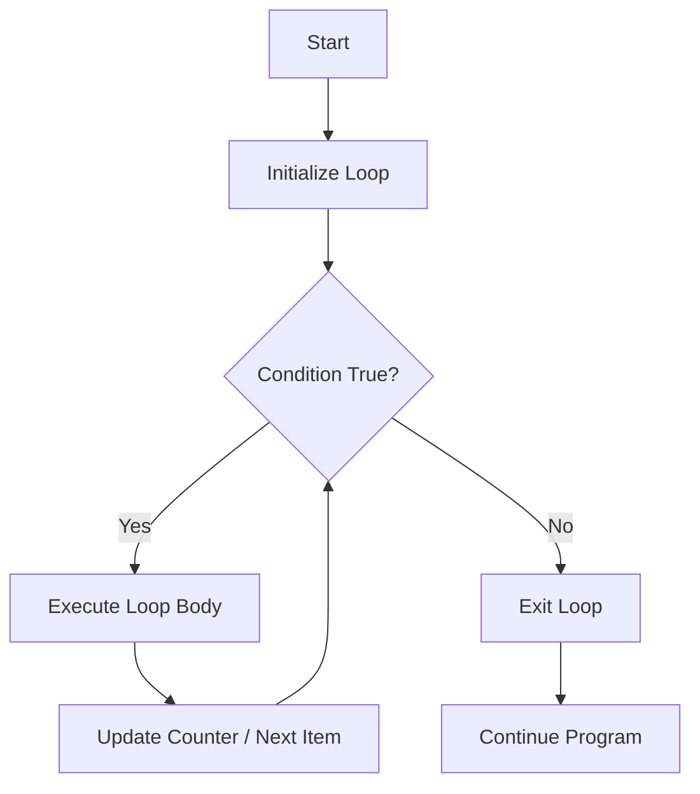
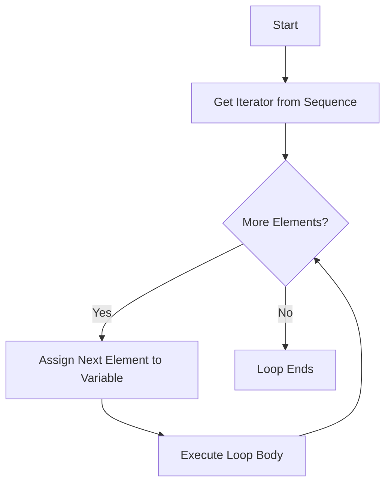
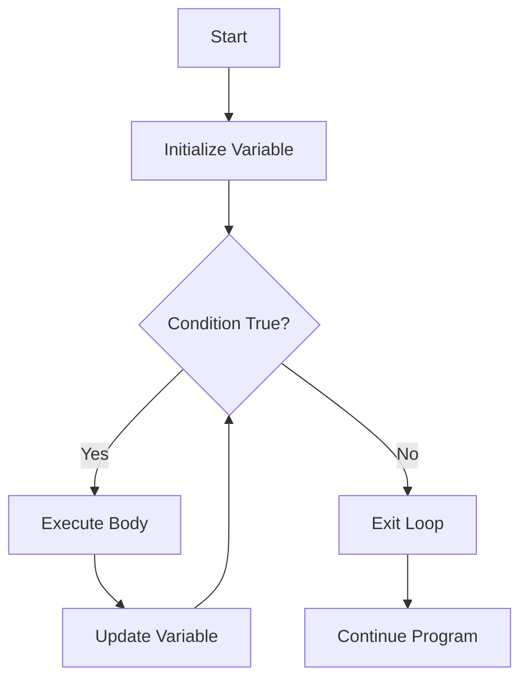
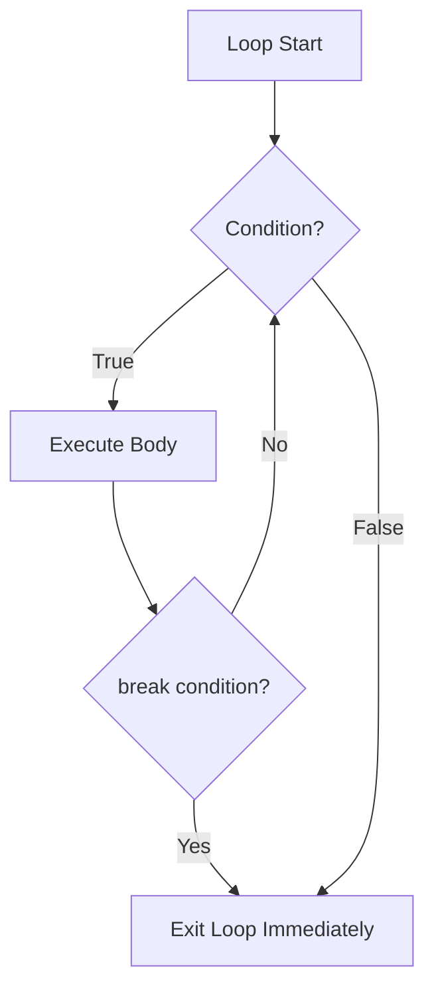
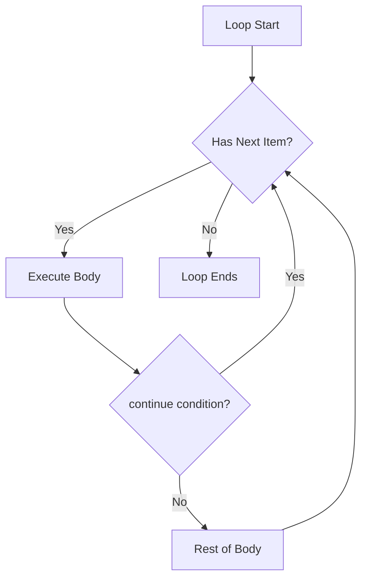
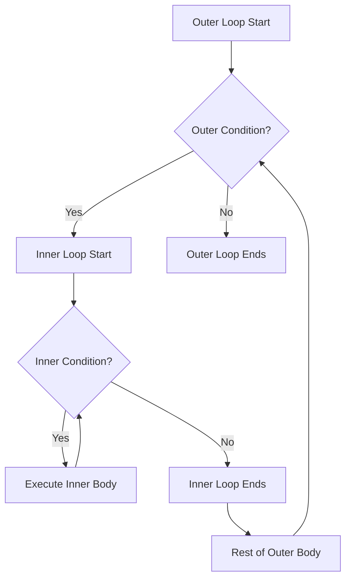
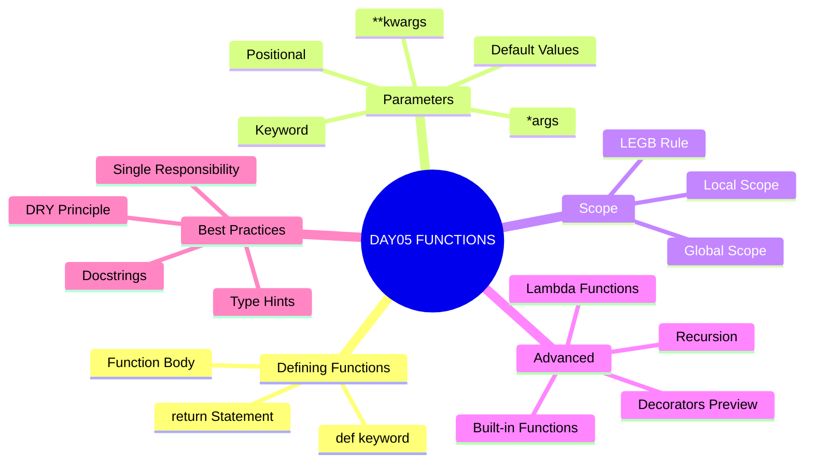
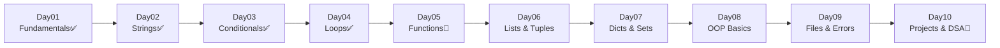

# 🐍 Python Programming — Day 04
# Loops Mastery · Iteration · Pattern Programming · Logic Building

> **Prerequisites:** Day01 (Fundamentals) | Day02 (Strings + Input) | Day03 (Conditionals)
> **Next Up:** Day05 — Functions, Scope & Modular Programming

---

## 📋 Table of Contents

| Section | Topic | Difficulty |
|---------|-------|------------|
| 01 | Day01–03 Revision | 🟢 Easy |
| 02 | Introduction to Loops | 🟢 Easy |
| 03 | `for` Loop Masterclass | 🟢 Easy |
| 04 | `range()` Function Masterclass | 🟢 Easy |
| 05 | `while` Loop Masterclass | 🟡 Medium |
| 06 | `for` vs `while` | 🟡 Medium |
| 07 | Loop Control: `break`, `continue`, `pass` | 🟡 Medium |
| 08 | Nested Loops Masterclass | 🟡 Medium |
| 09 | Loops with Strings | 🟡 Medium |
| 10 | Loops with Lists | 🟡 Medium |
| 11 | Loops with Dictionaries | 🟡 Medium |
| 12 | Loop Algorithms | 🟠 Hard |
| 13 | Pattern Printing Masterclass | 🟠 Hard |
| 14 | Logic Building Framework | 🟠 Hard |
| 15 | Time Complexity Introduction | 🟡 Medium |
| 16 | Debugging Loops | 🟡 Medium |
| 17 | Best Practices & Pythonic Loops | 🟡 Medium |
| 18 | Mini Projects (10) | 🟡 Medium |
| 19 | Portfolio Projects (20) | 🟠 Hard |
| 20 | 250 Practice Questions | All Levels |
| 21 | 100 Interview Questions | All Levels |
| 22 | Assignments (5) | All Levels |
| 23 | Challenge Projects (10) | 🔴 Expert |
| 24 | Day04 Revision & Cheat Sheet | 🟢 Easy |
| 25 | Preparation for Day05 | Preview |

---

# SECTION 01 — DAY01 + DAY02 + DAY03 REVISION

## ⚡ One-Page Quick Revision

### Day01–02 Recap

```python
# ── VARIABLES & TYPES ──────────────────────────────
name = "Shyam"        # str
age  = 21             # int
gpa  = 9.1            # float
active = True         # bool
data = None           # NoneType

# ── TYPE CONVERSION ────────────────────────────────
int("42")   # 42     | float("3.14") # 3.14
str(100)    # "100"  | bool(0)       # False

# ── INPUT ──────────────────────────────────────────
name = input("Name: ")
age  = int(input("Age: "))
x, y = map(int, input("x y: ").split())

# ── STRINGS ────────────────────────────────────────
s = "Python"
s.upper()    # "PYTHON"   | s.lower()   # "python"
s[0:3]       # "Pyt"      | s[::-1]     # "nohtyP"
len(s)       # 6          | s.find("y") # 1
f"Name: {name}, GPA: {gpa:.2f}"
```

### Day03 — Conditional Cheat Sheet

```python
# ── BOOLEAN LOGIC ──────────────────────────────────
# Falsy: 0, 0.0, "", [], {}, (), None, False
# Truthy: everything else (including "0", [0])

# ── OPERATORS ──────────────────────────────────────
# Comparison:  ==  !=  >  <  >=  <=
# Logical:     and  or  not   (priority: not > and > or)
# Membership:  in  not in
# Identity:    is  is not   (use for None checks!)

# ── CONDITIONALS ───────────────────────────────────
if x > 0:             # single branch
    print("Positive")
elif x < 0:           # multi-branch
    print("Negative")
else:
    print("Zero")

# Ternary
result = "Pass" if marks >= 40 else "Fail"

# match-case (Python 3.10+)
match status:
    case 200: print("OK")
    case 404: print("Not Found")
    case _:   print("Other")
```

### Logic Building Review

```
PROBLEM SOLVING STEPS (Day03 Foundation):
1. Read problem carefully
2. Identify inputs and outputs
3. List conditions (if/elif/else)
4. Handle edge cases (None, 0, empty)
5. Test with sample inputs
6. Refactor for readability

TODAY (Day04): We add REPETITION to this toolset.
Conditions decide WHAT to do → Loops decide HOW MANY TIMES.
```

---

# SECTION 02 — INTRODUCTION TO LOOPS

## 🔄 What is a Loop?

A **loop** is a programming construct that repeats a block of code **multiple times** — either for a fixed number of iterations or until a condition becomes False.

### Why Loops Exist

Without loops:

```python
# Printing 1 to 5 WITHOUT a loop — tedious!
print(1)
print(2)
print(3)
print(4)
print(5)
# What if you need 1 to 1,000,000? → Impossible to write manually!
```

With a loop:

```python
# Printing 1 to 1,000,000 — just 2 lines!
for i in range(1, 1_000_001):
    print(i)
```

---

### Real World: Why Computers Need Loops

| Scenario | Without Loop | With Loop |
|----------|-------------|-----------|
| ATM: process 500 transactions | 500 × copy-paste code | 3 lines |
| AI Training: 1M iterations | Physically impossible | `for epoch in range(1_000_000):` |
| Read 1M records from DB | Impossible | `for row in database:` |
| Check 10K students' grades | 10,000 if-else blocks | `for student in students:` |
| Search Google's 50B pages | Impossible | Loop through index |

---

### Flowchart: Loop Execution



---

### Two Types of Loops in Python

```
Python Loops
│
├── for  loop  → Known number of iterations, iterating over a sequence
└── while loop → Unknown iterations, condition-controlled
```

---

### Real World Analogies

| Loop Type | Real World | Python |
|-----------|-----------|--------|
| `for` loop | "Do this for every student in class" | `for student in class_list:` |
| `while` loop | "Keep the ATM running while it has power" | `while atm_on:` |
| `break` | "Stop the assembly line if defect found" | `if defect: break` |
| `continue` | "Skip rotten apples on conveyor" | `if rotten: continue` |

---

# SECTION 03 — `for` LOOP MASTERCLASS

## 📌 Definition

A `for` loop iterates over a **sequence** (list, string, tuple, range, dict, set) and executes the body for each element.

### Syntax

```python
for variable in sequence:
    # body — executed once per element
```

### Internal Working

```
1. Python asks the sequence for its iterator (__iter__())
2. On each iteration, calls __next__() to get next element
3. Assigns it to loop variable
4. Executes body
5. Repeats until StopIteration exception is raised
6. Loop ends
```

---

### Flowchart



---

### Basic Examples

```python
# ── 1. Numbers ─────────────────────────────────────
for i in range(5):
    print(i)
# 0 1 2 3 4

# ── 2. String iteration ────────────────────────────
for char in "Python":
    print(char)
# P y t h o n

# ── 3. List iteration ──────────────────────────────
fruits = ["mango", "apple", "banana"]
for fruit in fruits:
    print(fruit)

# ── 4. Tuple iteration ─────────────────────────────
coordinates = (10, 20, 30)
for val in coordinates:
    print(val)

# ── 5. Set iteration ───────────────────────────────
colors = {"red", "blue", "green"}
for color in colors:
    print(color)   # Order not guaranteed!

# ── 6. Dictionary iteration ────────────────────────
student = {"name": "Shyam", "age": 21, "gpa": 9.1}
for key in student:
    print(f"{key}: {student[key]}")

# ── 7. Enumerate ───────────────────────────────────
languages = ["Python", "C++", "Java"]
for index, lang in enumerate(languages, start=1):
    print(f"{index}. {lang}")
# 1. Python
# 2. C++
# 3. Java

# ── 8. zip ─────────────────────────────────────────
names  = ["Alice", "Bob", "Charlie"]
scores = [95, 87, 78]
for name, score in zip(names, scores):
    print(f"{name}: {score}")
```

---

### Memory Trick

> **"FOR = FOR EACH ITEM IN A COLLECTION"**
> Like a teacher calling every student's name from a register — one by one, until all are called.

---

### Common Mistakes

```python
# ❌ Modifying list while iterating over it
nums = [1, 2, 3, 4, 5]
for n in nums:
    if n == 3:
        nums.remove(n)   # Unpredictable behavior!

# ✅ Iterate over a copy
for n in nums[:]:
    if n == 3:
        nums.remove(n)

# ❌ Using wrong variable inside loop
for i in range(5):
    print(j)   # NameError: 'j' is not defined

# ❌ Expecting for loop to start at 1
for i in range(5):
    print(i)   # Prints 0,1,2,3,4 — NOT 1,2,3,4,5!
```

---

# SECTION 04 — `range()` FUNCTION MASTERCLASS

## 🎯 What is `range()`?

`range()` generates a **lazy sequence of integers** — it doesn't store all values in memory at once, making it extremely efficient.

### Three Forms

```python
range(stop)              # 0 to stop-1
range(start, stop)       # start to stop-1
range(start, stop, step) # start to stop-1 by step
```

### Visualization

```
range(5)        → 0, 1, 2, 3, 4
range(1, 6)     → 1, 2, 3, 4, 5
range(0, 10, 2) → 0, 2, 4, 6, 8
range(10, 0,-1) → 10, 9, 8, 7, 6, 5, 4, 3, 2, 1
range(5, 0, -1) → 5, 4, 3, 2, 1
range(0, 1)     → 0
range(5, 5)     → (empty)
range(5, 3)     → (empty — step must be negative to go backward)
```

---

### Internal Working — Memory Efficiency

```python
# range does NOT store all values!
r = range(1_000_000)
print(type(r))    # <class 'range'>
import sys
print(sys.getsizeof(r))         # 48 bytes — always the same!
print(sys.getsizeof(list(r)))   # ~8MB — huge difference!
```

> **Why?** `range` stores only `start`, `stop`, and `step` — three integers. It computes each value on demand.

---

### Common range() Patterns

```python
# Countdown
for i in range(10, 0, -1):
    print(i, end=" ")   # 10 9 8 7 6 5 4 3 2 1

# Even numbers 1-20
for i in range(2, 21, 2):
    print(i, end=" ")   # 2 4 6 8 10 12 14 16 18 20

# Odd numbers 1-19
for i in range(1, 20, 2):
    print(i, end=" ")   # 1 3 5 7 9 11 13 15 17 19

# Multiples of 5
for i in range(0, 51, 5):
    print(i, end=" ")   # 0 5 10 15 20 25 30 35 40 45 50

# Reverse a range
for i in range(5, -1, -1):
    print(i, end=" ")   # 5 4 3 2 1 0

# Using range with len()
fruits = ["mango", "apple", "banana"]
for i in range(len(fruits)):
    print(f"{i}: {fruits[i]}")
```

---

### Interview: range vs list

| Feature | `range` | `list` |
|---------|---------|--------|
| Memory | O(1) — 48 bytes always | O(n) |
| Speed to create | Instant | Proportional to size |
| Subscriptable | Yes: `range(10)[5]` = 5 | Yes |
| Mutable | No | Yes |
| Use case | Loops, index generation | Data storage |

---

# SECTION 05 — `while` LOOP MASTERCLASS

## 📌 Definition

A `while` loop executes its body **as long as a condition remains True**. Used when you don't know in advance how many iterations are needed.

### Syntax

```python
while condition:
    # body
    # must change something that affects condition!
```

### Flowchart



---

### Examples

```python
# ── 1. Basic Counter ───────────────────────────────
count = 1
while count <= 5:
    print(count)
    count += 1
# 1 2 3 4 5

# ── 2. User Input Validation ───────────────────────
age = -1
while age < 0 or age > 150:
    try:
        age = int(input("Enter valid age (0-150): "))
    except ValueError:
        print("Please enter a number!")
print(f"Age accepted: {age}")

# ── 3. PIN Entry (3 attempts) ──────────────────────
CORRECT_PIN = "1234"
attempts = 0
MAX = 3
while attempts < MAX:
    pin = input("Enter PIN: ")
    if pin == CORRECT_PIN:
        print("✅ Access Granted!")
        break
    attempts += 1
    print(f"❌ Wrong. {MAX - attempts} attempt(s) left.")
else:
    print("🚫 Card locked!")

# ── 4. Sentinel-Controlled Loop ────────────────────
total = 0
print("Enter marks (-1 to stop):")
while True:
    mark = int(input("Mark: "))
    if mark == -1:
        break
    total += mark
print(f"Total: {total}")

# ── 5. Collatz Conjecture ──────────────────────────
n = int(input("Enter a number: "))
steps = 0
while n != 1:
    if n % 2 == 0:
        n //= 2
    else:
        n = 3 * n + 1
    steps += 1
print(f"Reached 1 in {steps} steps")
```

---

### Infinite Loop — Handle With Care

```python
# ❌ Infinite loop — will never stop!
while True:
    print("Looping forever...")

# ✅ Infinite loop with controlled exit
while True:
    cmd = input("Enter command (quit to exit): ")
    if cmd == "quit":
        break
    print(f"Executing: {cmd}")
```

---

### Sentinel-Controlled Loops

A **sentinel** is a special value that signals the end of input.

```python
# Classic sentinel pattern
data = []
print("Enter numbers. Type 0 to stop:")
while True:
    num = int(input("Number: "))
    if num == 0:       # 0 is the sentinel
        break
    data.append(num)
print(f"You entered: {data}")
```

---

# SECTION 06 — `for` vs `while`

## ⚖️ Complete Comparison

| Feature | `for` Loop | `while` Loop |
|---------|-----------|-------------|
| When to use | Known iterations / iterating sequences | Unknown iterations / condition-based |
| Syntax complexity | Simpler | Slightly more verbose |
| Infinite loop risk | Very low | High (if condition never becomes False) |
| Counter needed | No (range handles it) | Usually yes |
| Iterating collections | Natural | Less natural |
| Input validation | Awkward | Perfect |
| Menu systems | No | Yes |
| Game loops | No | Yes |
| Database polling | No | Yes |
| Python idiom | Preferred when possible | When for doesn't fit |

### When to Choose `for`

```python
# ✅ for: Known count, iterating sequences
for i in range(10):          ...  # exactly 10 times
for item in my_list:         ...  # every item in list
for char in "hello":         ...  # every character
for key, val in d.items():   ...  # every key-value pair
```

### When to Choose `while`

```python
# ✅ while: Unknown count, condition-dependent
while user_input != "quit":  ...  # until user quits
while balance > 0:           ...  # until account empty
while not found:             ...  # until item found
while True:                  ...  # game/server loop
```

---

# SECTION 07 — LOOP CONTROL STATEMENTS

## 🛑 `break` — Exit Immediately

`break` terminates the **innermost** loop immediately, regardless of the remaining iterations.

### Flowchart



### Examples

```python
# ── 1. Search and stop ─────────────────────────────
students = ["Alice", "Bob", "Charlie", "Diana"]
target = "Charlie"
for student in students:
    if student == target:
        print(f"Found: {student}")
        break
    print(f"Checking: {student}")

# ── 2. First prime > 50 ────────────────────────────
for num in range(51, 200):
    is_prime = all(num % i != 0 for i in range(2, int(num**0.5)+1))
    if is_prime:
        print(f"First prime > 50: {num}")
        break

# ── 3. break with while ────────────────────────────
total = 0
while True:
    n = int(input("Enter number (0 to stop): "))
    if n == 0:
        break
    total += n
print(f"Sum: {total}")
```

---

## ⏭️ `continue` — Skip Current Iteration

`continue` skips the **rest of the current iteration** and jumps to the next one.

### Flowchart



### Examples

```python
# ── 1. Skip even numbers ───────────────────────────
for i in range(1, 11):
    if i % 2 == 0:
        continue
    print(i, end=" ")   # 1 3 5 7 9

# ── 2. Skip negative values ────────────────────────
data = [10, -3, 25, -1, 8, -7, 15]
valid_sum = 0
for num in data:
    if num < 0:
        continue
    valid_sum += num
print(f"Sum of positives: {valid_sum}")   # 58

# ── 3. Skip empty inputs ───────────────────────────
entries = ["Alice", "", "Bob", "  ", "Charlie"]
for entry in entries:
    if not entry.strip():
        continue
    print(f"Processing: {entry.strip()}")

# ── 4. Filter vowels ───────────────────────────────
word = "programming"
consonants = ""
for char in word:
    if char in "aeiou":
        continue
    consonants += char
print(f"Consonants: {consonants}")   # prgrmmng
```

---

## ⏸️ `pass` — Do Nothing (Placeholder)

`pass` is a no-operation statement. It's used where Python syntax requires a statement but you don't want to do anything yet.

```python
# ── 1. Empty loop body ─────────────────────────────
for i in range(5):
    pass   # Will implement later

# ── 2. Placeholder for future implementation ───────
for i in range(10):
    if i % 2 == 0:
        pass   # TODO: handle even numbers
    else:
        print(f"Odd: {i}")

# ── 3. Empty class / function (Day05 preview) ──────
# def my_function():
#     pass   # implement later
```

---

### `break` vs `continue` vs `pass`

| Statement | Effect | Loop Continues? |
|-----------|--------|-----------------|
| `break` | Exit loop entirely | No |
| `continue` | Skip to next iteration | Yes |
| `pass` | Do nothing, continue normally | Yes |

---

### `for-else` and `while-else` (Python Exclusive!)

Python uniquely supports an `else` clause on loops. It runs when the loop completes **without hitting `break`**.

```python
# Search with for-else
target = 42
numbers = [10, 25, 37, 99, 5]

for num in numbers:
    if num == target:
        print(f"Found {target}!")
        break
else:
    print(f"{target} not found in list.")
# Output: 42 not found in list.

# Prime check with for-else
def is_prime(n):
    if n < 2:
        return False
    for i in range(2, int(n**0.5) + 1):
        if n % i == 0:
            return False    # break would trigger here
    else:
        return True         # only if no break occurred

print(is_prime(17))   # True
print(is_prime(12))   # False
```

---

# SECTION 08 — NESTED LOOPS MASTERCLASS

## 🪆 Loops Inside Loops

When one loop is placed inside another loop, the inner loop runs **completely** for each single iteration of the outer loop.

### Visual Execution

```
Outer: i = 0
    Inner: j = 0, 1, 2   (3 iterations)
Outer: i = 1
    Inner: j = 0, 1, 2   (3 iterations)
Outer: i = 2
    Inner: j = 0, 1, 2   (3 iterations)
Total iterations: 3 × 3 = 9
```

```python
for i in range(3):           # outer runs 3 times
    for j in range(3):       # inner runs 3 times PER outer iteration
        print(f"({i},{j})", end=" ")
    print()                  # newline after each outer row

# (0,0) (0,1) (0,2)
# (1,0) (1,1) (1,2)
# (2,0) (2,1) (2,2)
```

---

### Flowchart



---

### Real World: Multiplication Table

```python
# 10x10 Multiplication Table
print("  ", end="")
for j in range(1, 11):
    print(f"{j:4}", end="")
print()
print("-" * 45)

for i in range(1, 11):
    print(f"{i:2}|", end="")
    for j in range(1, 11):
        print(f"{i*j:4}", end="")
    print()
```

---

### break in Nested Loops

```python
# break only exits INNERMOST loop
found = False
matrix = [[1, 2, 3], [4, 5, 6], [7, 8, 9]]
target = 5

for row in matrix:
    for val in row:
        if val == target:
            print(f"Found {target}!")
            found = True
            break        # exits inner loop only
    if found:
        break            # exits outer loop
```

---

### Time Complexity Warning

```python
# O(n²) — be careful with large n!
n = 1000
for i in range(n):
    for j in range(n):
        pass   # 1,000,000 iterations!
```

---

# SECTION 09 — LOOPS WITH STRINGS

```python
word = "Python"

# ── 1. Character Traversal ─────────────────────────
for char in word:
    print(char, end="-")    # P-y-t-h-o-n-

# ── 2. Index Traversal ─────────────────────────────
for i in range(len(word)):
    print(f"Index {i}: {word[i]}")

# ── 3. Reverse Traversal ───────────────────────────
for char in reversed(word):
    print(char, end="")     # nohtyP

# ── 4. Count Vowels ────────────────────────────────
sentence = "Hello Beautiful World"
vowel_count = 0
for char in sentence.lower():
    if char in "aeiou":
        vowel_count += 1
print(f"Vowels: {vowel_count}")    # 7

# ── 5. Count Specific Character ────────────────────
text = "Mississippi"
char = "s"
count = 0
for c in text:
    if c == char:
        count += 1
print(f"'{char}' appears {count} times")   # 4

# ── 6. Check Palindrome ────────────────────────────
def is_palindrome(s):
    s = s.lower().replace(" ", "")
    for i in range(len(s) // 2):
        if s[i] != s[-(i+1)]:
            return False
    return True

print(is_palindrome("racecar"))   # True
print(is_palindrome("hello"))     # False
print(is_palindrome("A man a plan a canal Panama"))  # True

# ── 7. Frequency Counter ───────────────────────────
text = "banana"
freq = {}
for char in text:
    if char in freq:
        freq[char] += 1
    else:
        freq[char] = 1
print(freq)   # {'b': 1, 'a': 3, 'n': 2}

# ── 8. Caesar Cipher ───────────────────────────────
def caesar_encrypt(text, shift):
    result = ""
    for char in text:
        if char.isalpha():
            base = ord('A') if char.isupper() else ord('a')
            result += chr((ord(char) - base + shift) % 26 + base)
        else:
            result += char
    return result

print(caesar_encrypt("Hello", 3))   # Khoor
```

---

# SECTION 10 — LOOPS WITH LISTS

```python
# ── 1. Sum and Average ─────────────────────────────
marks = [85, 92, 78, 95, 88, 73]
total = 0
for mark in marks:
    total += mark
avg = total / len(marks)
print(f"Sum: {total}, Average: {avg:.2f}")

# ── 2. Maximum and Minimum ─────────────────────────
data = [34, 67, 12, 89, 45, 23]
max_val = data[0]
min_val = data[0]
for num in data:
    if num > max_val:
        max_val = num
    if num < min_val:
        min_val = num
print(f"Max: {max_val}, Min: {min_val}")   # 89, 12

# ── 3. Linear Search ───────────────────────────────
students = ["Shyam", "Alice", "Bob", "Charlie"]
target = "Bob"
found_at = -1
for i, name in enumerate(students):
    if name == target:
        found_at = i
        break
if found_at != -1:
    print(f"Found '{target}' at index {found_at}")
else:
    print(f"'{target}' not found")

# ── 4. Filter Positives ────────────────────────────
nums = [10, -3, 25, -1, 8, -7, 15, -2]
positives = []
for n in nums:
    if n > 0:
        positives.append(n)
print(f"Positives: {positives}")   # [10, 25, 8, 15]

# ── 5. Count Occurrences ───────────────────────────
grades = ["A", "B", "A", "C", "A", "B", "D", "A"]
count_A = 0
for g in grades:
    if g == "A":
        count_A += 1
print(f"A grades: {count_A}")   # 4

# ── 6. Remove Duplicates ───────────────────────────
nums = [1, 2, 2, 3, 3, 3, 4]
unique = []
for n in nums:
    if n not in unique:
        unique.append(n)
print(f"Unique: {unique}")   # [1, 2, 3, 4]

# ── 7. Flatten Nested List ─────────────────────────
nested = [[1, 2], [3, 4], [5, 6]]
flat = []
for sublist in nested:
    for item in sublist:
        flat.append(item)
print(f"Flat: {flat}")   # [1, 2, 3, 4, 5, 6]
```

---

# SECTION 11 — LOOPS WITH DICTIONARIES

```python
student = {"name": "Shyam", "age": 21, "gpa": 9.1, "city": "Gorakhpur"}

# ── 1. Iterate Keys ────────────────────────────────
for key in student:          # same as student.keys()
    print(key)

# ── 2. Iterate Values ──────────────────────────────
for val in student.values():
    print(val)

# ── 3. Iterate Key-Value Pairs ─────────────────────
for key, val in student.items():
    print(f"{key}: {val}")

# ── 4. Build Dict from Loop ────────────────────────
squares = {}
for i in range(1, 11):
    squares[i] = i ** 2
print(squares)   # {1:1, 2:4, 3:9, ... 10:100}

# ── 5. Word Frequency from Text ────────────────────
text = "the cat sat on the mat the cat"
words = text.split()
freq = {}
for word in words:
    freq[word] = freq.get(word, 0) + 1
print(freq)
# {'the': 3, 'cat': 2, 'sat': 1, 'on': 1, 'mat': 1}

# ── 6. Inventory System ────────────────────────────
inventory = {
    "apples": 50,
    "bananas": 30,
    "oranges": 5,
    "grapes": 15
}
LOW_STOCK = 10
print("Low Stock Items:")
for item, qty in inventory.items():
    if qty < LOW_STOCK:
        print(f"  ⚠️  {item}: only {qty} left")

# ── 7. Nested Dict Iteration ───────────────────────
school = {
    "class_10": {"Alice": 95, "Bob": 87},
    "class_11": {"Charlie": 91, "Diana": 88}
}
for class_name, students in school.items():
    print(f"\n{class_name}:")
    for student, marks in students.items():
        print(f"  {student}: {marks}")
```

---

# SECTION 12 — LOOP ALGORITHMS

## 🔢 Classic Algorithms Using Loops

### 1. Sum, Average, Max, Min

```python
def stats(nums):
    if not nums:
        return None
    total = 0
    max_val = nums[0]
    min_val = nums[0]
    for n in nums:
        total += n
        if n > max_val: max_val = n
        if n < min_val: min_val = n
    return total, total/len(nums), max_val, min_val

data = [45, 78, 23, 90, 56, 34]
total, avg, mx, mn = stats(data)
print(f"Sum={total}, Avg={avg:.2f}, Max={mx}, Min={mn}")
```

---

### 2. Factorial

```python
def factorial(n):
    if n < 0:
        return None
    result = 1
    for i in range(2, n + 1):
        result *= i
    return result

for n in range(0, 11):
    print(f"{n}! = {factorial(n)}")
```

---

### 3. Fibonacci Series

```python
def fibonacci(n):
    series = []
    a, b = 0, 1
    for _ in range(n):
        series.append(a)
        a, b = b, a + b
    return series

print(fibonacci(15))
# [0, 1, 1, 2, 3, 5, 8, 13, 21, 34, 55, 89, 144, 233, 377]
```

---

### 4. Prime Number Check and Sieve

```python
# Simple prime check
def is_prime(n):
    if n < 2:
        return False
    if n == 2:
        return True
    if n % 2 == 0:
        return False
    for i in range(3, int(n**0.5) + 1, 2):
        if n % i == 0:
            return False
    return True

# Sieve of Eratosthenes — all primes up to N
def sieve(limit):
    is_prime = [True] * (limit + 1)
    is_prime[0] = is_prime[1] = False
    for i in range(2, int(limit**0.5) + 1):
        if is_prime[i]:
            for j in range(i*i, limit+1, i):
                is_prime[j] = False
    return [i for i in range(limit+1) if is_prime[i]]

print(sieve(50))
# [2, 3, 5, 7, 11, 13, 17, 19, 23, 29, 31, 37, 41, 43, 47]
```

---

### 5. Palindrome Check with Loop

```python
def is_palindrome(s):
    s = s.lower().replace(" ", "")
    left, right = 0, len(s) - 1
    while left < right:
        if s[left] != s[right]:
            return False
        left += 1
        right -= 1
    return True
```

---

### 6. GCD (Greatest Common Divisor) — Euclidean Algorithm

```python
def gcd(a, b):
    while b != 0:
        a, b = b, a % b
    return a

print(gcd(48, 18))   # 6
print(gcd(100, 75))  # 25
```

---

### 7. Reverse a Number

```python
def reverse_number(n):
    reversed_n = 0
    while n > 0:
        digit = n % 10
        reversed_n = reversed_n * 10 + digit
        n //= 10
    return reversed_n

print(reverse_number(12345))   # 54321
```

---

### 8. Armstrong Number

```python
def is_armstrong(n):
    digits = str(n)
    power = len(digits)
    total = 0
    for d in digits:
        total += int(d) ** power
    return total == n

for n in range(100, 1000):
    if is_armstrong(n):
        print(n, end=" ")   # 153 370 371 407
```

---

# SECTION 13 — PATTERN PRINTING MASTERCLASS

## 🎨 The Complete Pattern Guide

> **Strategy for every pattern:**
> 1. Visualize the pattern on paper
> 2. Count rows (outer loop)
> 3. Count columns per row (inner loop)
> 4. Find the relationship between row `i` and number of symbols

---

### Pattern 1: Right Triangle of Stars

```
*
**
***
****
*****
```

```python
n = 5
for i in range(1, n+1):       # rows 1 to n
    for j in range(i):        # j goes from 0 to i-1
        print("*", end="")
    print()

# One-liner version:
for i in range(1, n+1):
    print("*" * i)
```

**Dry Run (n=3):**
```
i=1: print "*"     → *
i=2: print "**"    → **
i=3: print "***"   → ***
```

---

### Pattern 2: Right Triangle of Numbers

```
1
1 2
1 2 3
1 2 3 4
1 2 3 4 5
```

```python
n = 5
for i in range(1, n+1):
    for j in range(1, i+1):
        print(j, end=" ")
    print()
```

---

### Pattern 3: Inverted Triangle

```
*****
****
***
**
*
```

```python
n = 5
for i in range(n, 0, -1):
    print("*" * i)
```

---

### Pattern 4: Square Pattern

```
*****
*****
*****
*****
*****
```

```python
n = 5
for i in range(n):
    print("*" * n)
```

---

### Pattern 5: Pyramid (Centered Triangle)

```
    *
   ***
  *****
 *******
*********
```

```python
n = 5
for i in range(1, n+1):
    spaces = n - i
    stars = 2 * i - 1
    print(" " * spaces + "*" * stars)
```

**Logic:**
```
Row 1: spaces=4, stars=1  →     *
Row 2: spaces=3, stars=3  →    ***
Row 3: spaces=2, stars=5  →   *****
Row 4: spaces=1, stars=7  →  *******
Row 5: spaces=0, stars=9  → *********
Formula: spaces = n-i, stars = 2i-1
```

---

### Pattern 6: Inverted Pyramid

```
*********
 *******
  *****
   ***
    *
```

```python
n = 5
for i in range(n, 0, -1):
    spaces = n - i
    stars = 2 * i - 1
    print(" " * spaces + "*" * stars)
```

---

### Pattern 7: Diamond Pattern

```
    *
   ***
  *****
 *******
*********
 *******
  *****
   ***
    *
```

```python
n = 5
# Upper half
for i in range(1, n+1):
    print(" " * (n-i) + "*" * (2*i-1))
# Lower half
for i in range(n-1, 0, -1):
    print(" " * (n-i) + "*" * (2*i-1))
```

---

### Pattern 8: Hollow Square

```
*****
*   *
*   *
*   *
*****
```

```python
n = 5
for i in range(n):
    for j in range(n):
        if i == 0 or i == n-1 or j == 0 or j == n-1:
            print("*", end="")
        else:
            print(" ", end="")
    print()
```

---

### Pattern 9: Hollow Triangle

```
*
**
* *
*  *
*****
```

```python
n = 5
for i in range(1, n+1):
    for j in range(1, i+1):
        if j == 1 or j == i or i == n:
            print("*", end="")
        else:
            print(" ", end="")
    print()
```

---

### Pattern 10: Number Pyramid

```
    1
   121
  12321
 1234321
123454321
```

```python
n = 5
for i in range(1, n+1):
    # Spaces
    print(" " * (n-i), end="")
    # Ascending
    for j in range(1, i+1):
        print(j, end="")
    # Descending
    for j in range(i-1, 0, -1):
        print(j, end="")
    print()
```

---

### Pattern 11: Floyd's Triangle

```
1
2 3
4 5 6
7 8 9 10
11 12 13 14 15
```

```python
n = 5
num = 1
for i in range(1, n+1):
    for j in range(i):
        print(num, end=" ")
        num += 1
    print()
```

---

### Pattern 12: Pascal's Triangle

```
    1
   1 1
  1 2 1
 1 3 3 1
1 4 6 4 1
```

```python
n = 5
for i in range(n):
    # Print leading spaces
    print(" " * (n - i - 1), end="")
    # Calculate and print each value
    val = 1
    for j in range(i + 1):
        print(val, end=" ")
        val = val * (i - j) // (j + 1)
    print()
```

---

### Pattern 13: Alphabet Triangle

```
A
AB
ABC
ABCD
ABCDE
```

```python
n = 5
for i in range(1, n+1):
    for j in range(i):
        print(chr(65 + j), end="")
    print()
```

---

### Pattern 14: Alphabet Pyramid

```
    A
   ABA
  ABCBA
 ABCDCBA
ABCDEDCBA
```

```python
n = 5
for i in range(1, n+1):
    # Spaces
    print(" " * (n-i), end="")
    # Ascending alphabets
    for j in range(i):
        print(chr(65 + j), end="")
    # Descending alphabets
    for j in range(i-2, -1, -1):
        print(chr(65 + j), end="")
    print()
```

---

### Pattern 15: Butterfly Pattern

```
*        *
**      **
***    ***
****  ****
**********
****  ****
***    ***
**      **
*        *
```

```python
n = 5
# Upper half
for i in range(1, n+1):
    print("*" * i + " " * (2*(n-i)) + "*" * i)
# Lower half
for i in range(n-1, 0, -1):
    print("*" * i + " " * (2*(n-i)) + "*" * i)
```

---

### Pattern 16: Zigzag Pattern

```
*   *   *
 * * * *
  *   *
```

```python
n = 3
cols = 20
for i in range(n):
    for j in range(cols):
        if ((i + j) % 4 == 0) or (j % 4 == 0 and (i + j) % 4 == 2):
            print("*", end="")
        else:
            print(" ", end="")
    print()
```

---

### Pattern Quick Reference Table

| Pattern | Outer Loop | Inner Loop | Key Formula |
|---------|------------|------------|-------------|
| Right Triangle | `range(1, n+1)` | `range(i)` | cols = i |
| Inverted Triangle | `range(n, 0, -1)` | `range(i)` | cols = i |
| Pyramid | `range(1, n+1)` | spaces + stars | sp=n-i, st=2i-1 |
| Diamond | Both halves | same as pyramid | combine |
| Hollow Square | `range(n)` | `range(n)` | border check |
| Pascal | `range(n)` | `range(i+1)` | C(n,k) formula |

---

# SECTION 14 — LOGIC BUILDING FRAMEWORK

## 🧠 How to Think Like a Programmer

### The 5-Step Problem Solving Method

```
STEP 1: UNDERSTAND
    → Read problem 3 times
    → Identify: What is INPUT? What is OUTPUT?
    → Identify: What are the CONSTRAINTS?

STEP 2: EXAMPLE & VISUALIZE  
    → Work through 2-3 small examples by hand
    → Draw the pattern / flow on paper

STEP 3: ALGORITHM (Plain English)
    → Write steps in plain English first
    → No code yet — just logic

STEP 4: CODE
    → Translate algorithm to Python
    → Start simple, then optimize

STEP 5: TEST & DEBUG
    → Test with sample inputs
    → Test edge cases (0, empty, large, negative)
    → Dry run line by line if wrong
```

---

### Pattern Recognition Framework

```python
# When you see: "Print N rows"  → outer for loop: range(1, N+1)
# When you see: "Print stars"   → inner for loop based on row
# When you see: "Until user quits" → while True + break
# When you see: "Process each item" → for item in collection
# When you see: "Keep going until found" → while not found
# When you see: "Retry 3 times" → while attempts < 3
```

---

### Dry Running — The Most Important Skill

**Always trace your code manually before running it.**

```python
# Code:
n = 4
for i in range(1, n+1):
    print("*" * i)

# Dry Run:
# i=1: print("*" * 1) → *
# i=2: print("*" * 2) → **
# i=3: print("*" * 3) → ***
# i=4: print("*" * 4) → ****
```

---

### Loop Variable Tracking Table

For complex nested loops, track variable states in a table:

| Outer i | Inner j | Action |
|---------|---------|--------|
| 1 | 1 | print(1,1) |
| 1 | 2 | print(1,2) |
| 2 | 1 | print(2,1) |
| 2 | 2 | print(2,2) |

---

# SECTION 15 — TIME COMPLEXITY INTRODUCTION

## ⏱️ How Fast is Your Loop?

### O(1) — Constant Time

```python
# Always takes the same time regardless of input size
x = 42
print(x)       # O(1)
arr[0]         # O(1) — direct index access
```

### O(n) — Linear Time

```python
# Time grows proportionally with input size
# One loop = O(n)
nums = [1, 2, 3, ..., n]
for num in nums:       # runs n times
    print(num)
```

### O(n²) — Quadratic Time

```python
# Nested loops = O(n²)
for i in range(n):           # n times
    for j in range(n):       # n times each
        print(i, j)          # total: n × n = n² operations
```

### Big-O Visual

```
n = 100:
  O(1)   →          1 operation
  O(n)   →        100 operations
  O(n²)  →     10,000 operations

n = 1000:
  O(1)   →             1 operation
  O(n)   →         1,000 operations
  O(n²)  →     1,000,000 operations

n = 10,000:
  O(1)   →                  1 operation
  O(n)   →             10,000 operations
  O(n²)  →        100,000,000 operations ← SLOW!
```

### Rule of Thumb

```
Single loop  → O(n)
Nested loops → O(n²) or higher
Always minimize unnecessary nesting!
```

---

# SECTION 16 — DEBUGGING LOOPS

## 🐛 Common Loop Bugs

### 1. Infinite Loop

```python
# ❌ Counter never updates!
count = 0
while count < 5:
    print(count)
    # forgot: count += 1

# ✅ Always update the counter
count = 0
while count < 5:
    print(count)
    count += 1
```

---

### 2. Off-By-One Error

```python
# ❌ Prints 0-9 when you wanted 1-10
for i in range(10):
    print(i)

# ✅ Correct
for i in range(1, 11):
    print(i)

# ❌ Misses last element
for i in range(len(arr) - 1):  # stops 1 short!
    print(arr[i])

# ✅ Correct
for i in range(len(arr)):
    print(arr[i])
```

---

### 3. Wrong Range Step

```python
# ❌ Counts 0, 2, 4... but wants 1, 3, 5...
for i in range(0, 10, 2):
    print(i)

# ✅ Odd numbers
for i in range(1, 10, 2):
    print(i)
```

---

### 4. Modifying List While Iterating

```python
# ❌ Skips elements!
nums = [1, 2, 3, 4, 5]
for n in nums:
    if n % 2 == 0:
        nums.remove(n)

# ✅ Iterate a copy
for n in nums[:]:
    if n % 2 == 0:
        nums.remove(n)
```

---

### 5. Print Debugging Inside Loops

```python
# Add debug prints to trace execution
for i in range(5):
    print(f"DEBUG: i={i}")   # trace
    # ... your logic
```

---

# SECTION 17 — BEST PRACTICES & PYTHONIC LOOPS

## ✅ Writing Clean Loop Code

### 1. Use `enumerate()` Instead of Manual Index

```python
# ❌ Non-Pythonic
for i in range(len(fruits)):
    print(f"{i}: {fruits[i]}")

# ✅ Pythonic
for i, fruit in enumerate(fruits, start=1):
    print(f"{i}: {fruit}")
```

---

### 2. Use `zip()` to Iterate Multiple Lists

```python
# ❌ Manual index
for i in range(len(names)):
    print(names[i], scores[i])

# ✅ Pythonic
for name, score in zip(names, scores):
    print(name, score)
```

---

### 3. List Comprehensions (Preview)

```python
# ❌ Verbose
squares = []
for i in range(1, 11):
    squares.append(i**2)

# ✅ Pythonic list comprehension
squares = [i**2 for i in range(1, 11)]

# With condition
evens = [i for i in range(20) if i % 2 == 0]
```

---

### 4. Use `sum()`, `max()`, `min()`, `any()`, `all()`

```python
# ❌ Manual sum
total = 0
for n in nums:
    total += n

# ✅ Built-in
total = sum(nums)
maximum = max(nums)
minimum = min(nums)

# ✅ any / all
has_negative = any(n < 0 for n in nums)
all_positive = all(n > 0 for n in nums)
```

---

### 5. Meaningful Loop Variable Names

```python
# ❌ Meaningless
for i in students:
    print(i)

# ✅ Clear
for student in students:
    print(student)

# ❌ Confusing in nested loops
for i in matrix:
    for i in i:   # reusing i!
        print(i)

# ✅ Clear
for row in matrix:
    for cell in row:
        print(cell)
```

---

# SECTION 18 — MINI PROJECTS

## Project 1: Multiplication Table Generator

```python
print("=" * 40)
print("   MULTIPLICATION TABLE GENERATOR")
print("=" * 40)

num = int(input("Enter a number: "))
limit = int(input("Up to (default 10): ") or "10")

print(f"\n  Multiplication Table of {num}")
print("-" * 25)
for i in range(1, limit + 1):
    print(f"  {num} × {i:2} = {num * i:4}")
print("-" * 25)
```

---

## Project 2: Number Guessing Game Helper

```python
import random

print("=" * 40)
print("   NUMBER GUESSING GAME")
print("=" * 40)

secret = random.randint(1, 100)
attempts = 0
MAX_ATTEMPTS = 7

print(f"Guess the number between 1 and 100!")
print(f"You have {MAX_ATTEMPTS} attempts.\n")

while attempts < MAX_ATTEMPTS:
    try:
        guess = int(input(f"Attempt {attempts+1}/{MAX_ATTEMPTS}: "))
        attempts += 1
        
        if guess == secret:
            print(f"\n🎉 Correct! You won in {attempts} attempt(s)!")
            break
        elif guess < secret:
            print("📈 Too Low!")
        else:
            print("📉 Too High!")
        
        remaining = MAX_ATTEMPTS - attempts
        if remaining > 0:
            print(f"   {remaining} attempt(s) remaining.")
    except ValueError:
        print("❌ Please enter a valid number.")
else:
    print(f"\n😔 Game Over! The number was {secret}.")
```

---

## Project 3: Student Marks Analyzer

```python
print("=" * 45)
print("     STUDENT MARKS ANALYZER")
print("=" * 45)

students = []
n = int(input("Number of students: "))

for i in range(n):
    name = input(f"\nStudent {i+1} name: ")
    marks = []
    for subject in ["Math", "Physics", "Chemistry", "English", "CS"]:
        while True:
            try:
                m = float(input(f"  {subject}: "))
                if 0 <= m <= 100:
                    marks.append(m)
                    break
                else:
                    print("  Enter 0-100")
            except ValueError:
                print("  Invalid input")
    students.append({"name": name, "marks": marks, "avg": sum(marks)/len(marks)})

print("\n" + "=" * 55)
print(f"{'RANK':<5} {'NAME':<15} {'TOTAL':<7} {'AVG':<7} {'GRADE'}")
print("=" * 55)

students.sort(key=lambda s: s["avg"], reverse=True)

for rank, s in enumerate(students, 1):
    total = sum(s["marks"])
    avg = s["avg"]
    grade = "A+" if avg>=90 else "A" if avg>=80 else "B" if avg>=70 else "C" if avg>=60 else "F"
    print(f"{rank:<5} {s['name']:<15} {total:<7.1f} {avg:<7.2f} {grade}")

class_avg = sum(s["avg"] for s in students) / len(students)
print(f"\nClass Average: {class_avg:.2f}%")
print(f"Topper: {students[0]['name']} ({students[0]['avg']:.2f}%)")
```

---

## Project 4: Expense Tracker

```python
print("=" * 40)
print("      EXPENSE TRACKER")
print("=" * 40)

expenses = []
categories = ["Food", "Transport", "Entertainment", "Shopping", "Bills", "Other"]

while True:
    print("\n1. Add Expense")
    print("2. View Summary")
    print("3. View by Category")
    print("4. Exit")
    
    choice = input("Choice: ")
    
    if choice == "1":
        desc = input("Description: ")
        amount = float(input("Amount (₹): "))
        print("Categories:", ", ".join(f"{i+1}.{c}" for i,c in enumerate(categories)))
        cat_choice = int(input("Category (1-6): ")) - 1
        category = categories[cat_choice] if 0 <= cat_choice < len(categories) else "Other"
        expenses.append({"desc": desc, "amount": amount, "category": category})
        print(f"✅ Expense ₹{amount:.2f} added!")
        
    elif choice == "2":
        if not expenses:
            print("No expenses yet!")
        else:
            total = sum(e["amount"] for e in expenses)
            print(f"\n{'DESC':<20} {'CATEGORY':<15} {'AMOUNT':>10}")
            print("-" * 47)
            for e in expenses:
                print(f"{e['desc']:<20} {e['category']:<15} ₹{e['amount']:>8.2f}")
            print("-" * 47)
            print(f"{'TOTAL':<35} ₹{total:>8.2f}")
            
    elif choice == "3":
        cat_totals = {}
        for e in expenses:
            cat_totals[e["category"]] = cat_totals.get(e["category"], 0) + e["amount"]
        for cat, total in sorted(cat_totals.items(), key=lambda x: x[1], reverse=True):
            print(f"  {cat:<15}: ₹{total:.2f}")
            
    elif choice == "4":
        print("Thank you! Goodbye.")
        break
```

---

## Project 5: Word Frequency Counter

```python
text = """
Python is a powerful programming language. Python is easy to learn.
Python is used in data science, AI, web development, and automation.
Many developers love Python because Python is simple and powerful.
"""

words = text.lower().split()
cleaned = []
for word in words:
    clean_word = ""
    for char in word:
        if char.isalpha():
            clean_word += char
    if clean_word:
        cleaned.append(clean_word)

freq = {}
for word in cleaned:
    freq[word] = freq.get(word, 0) + 1

sorted_freq = sorted(freq.items(), key=lambda x: x[1], reverse=True)

print("=" * 35)
print("   WORD FREQUENCY ANALYSIS")
print("=" * 35)
print(f"{'WORD':<20} {'COUNT':>5} {'BAR'}")
print("-" * 35)
for word, count in sorted_freq[:15]:
    bar = "█" * count
    print(f"{word:<20} {count:>5} {bar}")
```

---

## Projects 6–10 (Key Logic Summary)

```python
# Project 6: Prime Number Finder
# → Loop 2 to n, apply is_prime() for each, collect and display

# Project 7: Fibonacci Generator  
# → Loop n times, maintain a, b and keep computing a, b = b, a+b

# Project 8: Character Counter
# → Loop through string, use dict to count each char, sort by count

# Project 9: Voting Statistics Calculator
# → Take N votes, count per candidate, find winner, show percentage

# Project 10: Pattern Generator
# → Menu: user selects pattern number, generate with input n
```

---

# SECTION 19 — HIGH VALUE PORTFOLIO PROJECTS

| # | Project | Difficulty | Skills | Real World Value |
|---|---------|------------|--------|-----------------|
| 1 | Attendance Management System | ⭐⭐⭐ | Loops + Dict | EdTech |
| 2 | Dataset Statistics Analyzer | ⭐⭐⭐ | List processing | Data Science |
| 3 | CSV Statistics Generator | ⭐⭐⭐⭐ | File + Loops | Analytics |
| 4 | Log File Analyzer | ⭐⭐⭐⭐ | String + Loops | DevOps |
| 5 | Password Audit Tool | ⭐⭐⭐ | String analysis | CyberSec |
| 6 | Text Analytics Engine | ⭐⭐⭐⭐ | NLP basics | AI/NLP |
| 7 | Survey Data Processor | ⭐⭐⭐ | Dict + Loops | Research |
| 8 | Student Performance Dashboard | ⭐⭐⭐ | Aggregation | EdTech |
| 9 | Election Vote Counter | ⭐⭐⭐ | Dict + Sort | GovTech |
| 10 | CLI Report Generator | ⭐⭐⭐ | Formatting | Enterprise |
| 11 | Prime Number Lab | ⭐⭐⭐ | Algorithms | CompSci |
| 12 | Matrix Operations Tool | ⭐⭐⭐⭐ | Nested loops | Math/ML |
| 13 | Number Theory Explorer | ⭐⭐⭐ | Math + Loops | Education |
| 14 | Text Encryption Tool | ⭐⭐⭐ | Caesar/Vigenere | Security |
| 15 | Pattern Design Generator | ⭐⭐⭐ | Nested loops | Education |
| 16 | Inventory Reorder System | ⭐⭐⭐ | Dict + Conditions | Retail |
| 17 | Academic GPA Calculator | ⭐⭐ | Loop + Math | EdTech |
| 18 | Data Cleaning Utility | ⭐⭐⭐⭐ | String + Loop | Data Eng |
| 19 | Budget Planner | ⭐⭐⭐ | Lists + Dict | FinTech |
| 20 | Competitive Programming Toolkit | ⭐⭐⭐⭐⭐ | All algorithms | CP |

### Portfolio Project 6: Text Analytics Engine (Full Code)

```python
"""
TEXT ANALYTICS ENGINE
Analyzes text for: word count, sentence count, frequency,
readability score, top keywords, and character stats.
"""

def analyze_text(text):
    # Basic stats
    words = text.split()
    sentences = text.count('.') + text.count('!') + text.count('?')
    chars_total = len(text)
    chars_no_space = len(text.replace(" ", ""))
    
    # Word frequency
    cleaned_words = []
    for word in words:
        clean = ""
        for ch in word.lower():
            if ch.isalpha():
                clean += ch
        if clean:
            cleaned_words.append(clean)
    
    freq = {}
    for word in cleaned_words:
        freq[word] = freq.get(word, 0) + 1
    
    # Stop words (basic)
    stop_words = {"the", "a", "an", "and", "or", "but", "in", "on", "at", 
                  "to", "for", "of", "is", "it", "this", "that", "was", "are"}
    
    keywords = {w: c for w, c in freq.items() if w not in stop_words}
    top_keywords = sorted(keywords.items(), key=lambda x: x[1], reverse=True)[:10]
    
    # Vowel/consonant count
    vowels = consonants = 0
    for ch in text.lower():
        if ch in "aeiou":
            vowels += 1
        elif ch.isalpha():
            consonants += 1
    
    # Average word length
    total_len = sum(len(w) for w in cleaned_words)
    avg_word_len = total_len / len(cleaned_words) if cleaned_words else 0
    
    # Readability (simple)
    avg_words_per_sentence = len(words) / sentences if sentences > 0 else 0
    
    # Report
    print("=" * 55)
    print("          TEXT ANALYTICS REPORT")
    print("=" * 55)
    print(f"  Total Characters  : {chars_total}")
    print(f"  Characters (no sp): {chars_no_space}")
    print(f"  Total Words       : {len(words)}")
    print(f"  Unique Words      : {len(freq)}")
    print(f"  Sentences         : {sentences}")
    print(f"  Vowels            : {vowels}")
    print(f"  Consonants        : {consonants}")
    print(f"  Avg Word Length   : {avg_word_len:.2f} chars")
    print(f"  Avg Words/Sentence: {avg_words_per_sentence:.1f}")
    
    print(f"\n  {'TOP 10 KEYWORDS':}")
    print(f"  {'─'*30}")
    for word, count in top_keywords:
        bar = "█" * count
        print(f"  {word:<20} {count:>3} {bar}")

sample = """
Python is a high-level, general-purpose programming language. 
Python was created by Guido van Rossum. Python emphasizes code 
readability. Python supports multiple programming paradigms.
Python is widely used in data science, AI, and web development.
"""

analyze_text(sample)
```

---

# SECTION 20 — 250 PRACTICE QUESTIONS

## 🟢 Easy (100 Questions)

### `for` Loop Basics

1. Print numbers 1 to 10 using a `for` loop.
2. Print numbers 10 to 1 (countdown).
3. Print even numbers from 2 to 20.
4. Print odd numbers from 1 to 19.
5. Print multiples of 5 from 5 to 50.
6. Calculate the sum of 1 to 100.
7. Print the square of numbers 1 to 10.
8. Print each character of "Gorakhpur".
9. Print a list of 5 fruits one per line.
10. Print the index and value of each item in `[10, 20, 30, 40]`.

### `range()` Questions

11. What does `range(5)` produce?
12. What does `range(3, 8)` produce?
13. What does `range(0, 20, 4)` produce?
14. What does `range(10, 0, -2)` produce?
15. How many elements in `range(5, 100, 5)`?
16. Print `range(1, 11)` as a list.
17. Create a countdown from 10 to 1 using `range`.
18. Print only the first 5 even numbers using range.
19. What does `range(5, 5)` produce?
20. What does `range(5, 3)` produce?

### `while` Loop Basics

21. Print 1 to 5 using a `while` loop.
22. Print 10 to 1 using a `while` loop.
23. Calculate 2^10 using a `while` loop.
24. Sum numbers from 1 to 50 using `while`.
25. Keep asking for a name until a non-empty string is entered.
26. Count down from 100 to 0, stepping by 10.
27. Print "Hello" 7 times using `while`.
28. Double a number until it exceeds 1000. Print each value.
29. Find how many times 2 divides into 256 evenly.
30. Count the number of digits in a given number using `while`.

### `break` and `continue`

31. Loop 1 to 20, stop at 13.
32. Loop 1 to 20, skip 13.
33. Find the first multiple of 7 greater than 50. Use break.
34. Print even numbers 1–20, using continue to skip odds.
35. Loop user input until they type "stop".
36. Print numbers 1–100 but stop when sum exceeds 500.
37. Skip numbers divisible by 3, print rest from 1 to 30.
38. Loop a menu until choice is 0.
39. Skip all spaces in "hello world" using continue.
40. Find the first number in a list greater than 50, then break.

### Pattern Questions (Simple)

41. Print: `* ** *** **** *****`
42. Print: `***** **** *** ** *`
43. Print 5 rows of 5 stars each.
44. Print: `1 12 123 1234 12345`
45. Print numbers 1 to N in triangular form.
46. Print a right triangle of height 4.
47. Print an inverted right triangle of height 4.
48. Print: `5 55 555 5555 55555`
49. Print each row i with `i` copies of `i`.
50. Print: `A AB ABC ABCD ABCDE`

### String Loop Questions

51. Count vowels in "Hello Beautiful World".
52. Count consonants in "Python Programming".
53. Reverse a string using a loop.
54. Check if "madam" is a palindrome.
55. Print each word on a new line from "I love Python".
56. Count how many times 'l' appears in "hello world".
57. Remove all spaces from a string using a loop.
58. Convert each character to uppercase manually (without `.upper()`).
59. Print only uppercase letters from "HeLLo WoRLd".
60. Count words in a sentence.

### List Loop Questions

61. Find the sum of `[3, 7, 2, 9, 5]`.
62. Find the maximum in `[34, 12, 67, 45, 23]`.
63. Find the minimum in `[34, 12, 67, 45, 23]`.
64. Count even numbers in `[1, 2, 3, 4, 5, 6, 7, 8]`.
65. Reverse a list using a loop (no built-ins).
66. Check if 42 is in `[10, 20, 42, 50]` using a loop.
67. Create a new list of squares of `[1, 2, 3, 4, 5]`.
68. Count how many items in a list are > 50.
69. Find the second largest number in a list.
70. Remove duplicates from `[1, 2, 2, 3, 3, 3, 4]`.

### Logic Questions (Easy)

71. Print FizzBuzz for 1 to 30.
72. Print all factors of 36.
73. Find sum of digits of 12345.
74. Check if 153 is an Armstrong number.
75. Print the first 10 prime numbers.
76. Generate first 10 Fibonacci numbers.
77. Calculate 5! (factorial of 5).
78. Find GCD of 48 and 18 using a loop.
79. Print multiplication table of 7.
80. Print the reverse of number 54321.
81. Count digits in number 987654321.
82. Check if 121 is a palindrome number.
83. Sum all even numbers from 1 to 100.
84. Find LCM of 12 and 18.
85. Print numbers from 1 to 50 that are divisible by both 3 and 5.
86. Generate a list of squares of primes below 50.
87. Find the number of vowels in each word of a sentence.
88. Print each element of a list with its index.
89. Using `enumerate`, list fruits with 1-based numbering.
90. Using `zip`, pair names and ages: `["A","B","C"]`, `[20,21,22]`.
91. What does `else` in a `for` loop do?
92. Write a `while` loop with a sentinel of -999.
93. What is the output of `for i in range(2, 10, 3): print(i)`?
94. What is wrong with: `for i in range(5): i += 1`?
95. What does `pass` do in a loop?
96. Difference between `break` in outer vs inner loop?
97. Write a loop to calculate compound interest for 5 years.
98. Find how many numbers in 1–100 are perfect squares.
99. Print numbers 1–100 in reverse with step 3.
100. Create a list of all multiples of 7 up to 100.

---

## 🟡 Medium (100 Questions)

101. Implement bubble sort algorithm using nested loops.
102. Implement linear search with index returned.
103. Find all prime numbers between 100 and 200.
104. Check if a number is perfect (sum of divisors equals the number).
105. Find the sum of the series: 1 + 1/2 + 1/3 + ... + 1/n.
106. Flatten `[[1,2],[3,4],[5,6]]` without `sum()` or `itertools`.
107. Find the most frequent element in a list using a loop.
108. Implement selection sort.
109. Generate Pascal's Triangle up to n rows.
110. Find all Armstrong numbers between 1 and 999.
111. Print all pairs (i,j) where i+j = 10 from range 0–10.
112. Calculate the product of all odd numbers from 1 to 15.
113. Reverse words in a sentence without using `reversed()`.
114. Check if a string is an anagram of another using loops.
115. Find the longest word in a sentence using a loop.
116. Count the frequency of each digit in a number.
117. Print the pattern: `1 11 21 1211 111221` (Look-and-Say sequence).
118. Implement string compression: `aabcccdd` → `a2b1c3d2`.
119. Find the Nth Fibonacci number iteratively.
120. Check if a number is a perfect square without `sqrt`.
121. Implement binary search on a sorted list.
122. Find the LCM of a list of numbers.
123. Write nested loops to print a 5×5 identity matrix.
124. Print all 3-digit numbers where digit sum = 15.
125. Implement a digit reversal and check if original = reversed (palindrome).
126. Print all numbers from 1–100 that are neither divisible by 3 nor 5.
127. Use `while` to simulate an ATM with balance and retry.
128. Generate the first 20 numbers of the Collatz sequence for n=27.
129. Count how many times each vowel appears in a paragraph.
130. Find the second most frequent character in a string.
131. Given a list of marks, count A, B, C, D, F grades.
132. Implement matrix multiplication using nested loops.
133. Print a hollow diamond pattern.
134. Print the Spiral number pattern (1 to n²).
135. Find all pairs in a list that sum to a given target.
136. Implement the Sieve of Eratosthenes.
137. Find the median of an unsorted list using a loop.
138. Implement `zip()` manually using a loop.
139. Implement `enumerate()` manually using a loop.
140. Find the intersection of two lists without using `set`.
141. Print all permutations of "abc" using nested loops (3-level).
142. Validate that all elements of a list are positive integers.
143. Find the missing number in `[1, 2, 3, 5, 6, 7]` (range 1–7).
144. Compute Hamming distance between two equal-length strings.
145. Count how many numbers in 1–1000 have digit sum = 7.
146. Implement RLE (Run-Length Encoding): `"aaabbc"` → `"a3b2c1"`.
147. Find the number of common elements in two lists.
148. Print the Fibonacci sequence until the value exceeds 1000.
149. Generate all factors of N and classify as prime or composite.
150. Reverse a number and check if it is a palindrome.
151. Print the pattern: `1 / 1 2 / 1 2 3` (fraction triangle).
152. Sum digits recursively (without actual recursion — use while).
153. Find max difference between adjacent elements in a list.
154. Check if a list is sorted ascending using a loop.
155. Implement `flatten` for arbitrarily deep nested lists (2 levels).
156. Print all 3-digit Armstrong numbers.
157. Compute nCr (combinations) using a loop.
158. Find the minimum number of coins for change (greedy approach).
159. Simulate a dice rolling game until a 6 appears.
160. Find the largest palindrome number below 1000.
161. Loop through a dict and swap keys and values.
162. Given a list, find all unique pairs where a+b = 0.
163. Print the border elements of a 4×4 matrix.
164. Generate the first 15 terms of the tribonacci sequence.
165. Count the number of palindromic strings in a list.
166. Implement Bubble Sort and count comparisons made.
167. Find the geometric mean of a list using a loop.
168. Rotate a list left by k positions using loops.
169. Find the mode of a list using frequency dictionary.
170. Print the Pascals triangle in diamond shape.
171. Find all numbers from 1–1000 where sum_of_cubes_of_digits = number.
172. Count number of uppercase, lowercase, digit, and special chars.
173. Loop to find first 10 perfect numbers.
174. Implement a simple Caesar cipher encoder + decoder.
175. Find the LCS (Longest Common Subsequence) length of two strings using 2D nested loops.
176. Find the minimum edit distance (Levenshtein) using nested loops.
177. Print matrix in zigzag order using nested loops.
178. Implement counting sort algorithm.
179. Find first repeating element in a list using a loop.
180. Generate multiplication tables for 1 through 10 in formatted output.
181. Check if two strings are rotations of each other using loops.
182. Given text, extract all URLs (starting with "http") using loops.
183. Print a checkerboard pattern of size n.
184. Find sum of digits at odd positions vs even positions of a number.
185. Build a frequency dict from a sentence, sort by value descending.
186. Find all 4-digit numbers that are divisible by all their digits.
187. Implement string tokenizer (split by multiple delimiters) manually.
188. Find the longest consecutive sequence in a list.
189. Detect if a number is a Kaprekar number using loops.
190. Compute e^x using loop and Taylor series approximation.
191. Implement a basic spell checker that counts mismatched characters.
192. Generate all substrings of a string using nested loops.
193. Find the maximum product of any two elements in a list.
194. Implement cumulative sum (prefix sum) array.
195. Print the multiplication table of all primes below 10.
196. Count the number of times a sub-string appears in a string (manual).
197. Find the smallest prime factor of each number from 1–50.
198. Implement selection sort and trace each step.
199. Print numbers 1–100, replacing multiples of 3 with "Fizz", 5 with "Buzz", 15 with "FizzBuzz".
200. Build a frequency histogram in the terminal using `█` characters.

---

## 🔴 Advanced (50 Questions)

201. Implement merge sort using loops (iterative version).
202. Simulate a queue (FIFO) using a list and loops.
203. Implement a stack (LIFO) and simulate undo operations.
204. Write a loop-based expression evaluator for `+` and `*`.
205. Implement KMP (Knuth-Morris-Pratt) pattern search without library.
206. Implement run-length decoding: `"a3b2c1"` → `"aaabbc"`.
207. Find the number of islands in a 0/1 grid (BFS with loops).
208. Simulate Conway's Game of Life for 5 generations.
209. Implement Dijkstra's shortest path using loops and a basic priority queue.
210. Write a loop that generates all combinations of size r from a list.
211. Find all prime pairs (Goldbach conjecture) for all even numbers up to 100.
212. Implement the Collatz sequence and find which starting number < 100 has most steps.
213. Find the longest palindromic substring using nested loops.
214. Implement a basic neural network forward pass (matrix multiply + activation) with loops.
215. Simulate a Markov chain text generator step by step using loops.
216. Implement Huffman encoding (frequency → code dictionary) using loops.
217. Find the minimum spanning tree weight using Prim's algorithm with loops.
218. Compute the continued fraction expansion of a rational number.
219. Write a loop-based JSON minifier (remove unnecessary whitespace).
220. Implement the Z-function for string matching using a loop.
221. Simulate a 3-body gravitational problem using discrete time loops.
222. Implement the fast exponentiation algorithm (binary exponentiation) iteratively.
223. Solve the Josephus problem iteratively using a loop.
224. Find the longest increasing subsequence length using loops (O(n²)).
225. Implement a basic gradient descent loop for linear regression.
226. Find the nth number in the sequence: sums of previous two distinct primes.
227. Generate all balanced parentheses strings of length 2n using a loop.
228. Find all Pythagorean triplets with perimeter below 1000.
229. Implement a circular buffer using a loop with modular indexing.
230. Write a loop to compute the Mandelbrot set membership for a grid.
231. Compute all partitions of integer N (sum decompositions) using loops.
232. Implement the Miller-Rabin primality test using loops.
233. Write a loop-based tokenizer for simple arithmetic expressions.
234. Compute moving averages of window size k over a data stream.
235. Simulate epidemic spread (SIR model) using differential equation loops.
236. Find all magic squares of size 3×3 using brute-force nested loops.
237. Implement the Roman numeral converter (both directions) using loops.
238. Write a loop to detect a cycle in a sequence (Floyd's algorithm).
239. Implement the Ackermann function iteratively using a stack loop.
240. Compute the discrete Fourier transform (DFT) using nested loops.
241. Implement a basic regex engine for `.` and `*` patterns using loops.
242. Write a loop to enumerate Gray codes for n bits.
243. Implement Karatsuba multiplication using loops.
244. Simulate a multi-player dice tournament over N rounds.
245. Find the smallest number with exactly N divisors.
246. Implement a Trie insert and search using nested dict loops.
247. Compute nCr modulo prime using Fermat's little theorem + loops.
248. Write a loop to solve the 0/1 knapsack problem (DP table).
249. Implement a basic RNN forward pass using matrix loops.
250. Write a loop-based auto-diff system for computing derivatives numerically.

---

# SECTION 21 — 100 INTERVIEW QUESTIONS

## 🟢 Beginner (30)

**Q1. What is the difference between `for` and `while` loops?**
> `for` iterates over a known sequence or fixed range. `while` repeats while a condition is True — used when the iteration count is unknown.

**Q2. What does `range(1, 11)` produce?**
> Integers 1 through 10 (stops before 11). `range(start, stop)` excludes stop.

**Q3. What is the default start and step of `range()`?**
> Default start = 0, default step = 1. `range(5)` = `range(0, 5, 1)`.

**Q4. What does `break` do?**
> Immediately exits the innermost loop.

**Q5. What does `continue` do?**
> Skips the rest of the current iteration and moves to the next one.

**Q6. What does `pass` do in a loop?**
> Does nothing — used as a syntactic placeholder.

**Q7. What is an infinite loop? Give an example.**
> A loop that never terminates. Example: `while True: print("forever")`.

**Q8. How do you iterate over a string character by character?**
> `for char in "string":` — strings are iterable sequences of characters.

**Q9. What does `enumerate()` do?**
> Returns both index and value for each item: `for i, val in enumerate(lst):`.

**Q10. What does `zip()` do?**
> Pairs elements from multiple iterables: `for a, b in zip(list1, list2):`.

**Q11. What is the output of `range(5, 0, -1)`?**
> `5, 4, 3, 2, 1`.

**Q12. Can you use `break` and `continue` in a `while` loop?**
> Yes. Both work the same way in `while` as in `for`.

**Q13. What is `for-else` in Python?**
> The `else` block runs if the loop completes without hitting `break`.

**Q14. How many iterations does `for i in range(3, 3):` run?**
> Zero — `range(3, 3)` is empty.

**Q15. What is a sentinel-controlled loop?**
> A `while` loop that runs until a special "sentinel" value (like -1 or "quit") is entered.

**Q16. What is the output: `for i in range(1, 10, 3): print(i)`?**
> `1 4 7`.

**Q17. How do you loop through a dictionary's keys and values simultaneously?**
> `for key, value in my_dict.items():`.

**Q18. What happens if you forget to update the loop variable in `while`?**
> Infinite loop — the condition never becomes False.

**Q19. What is the time complexity of a single `for` loop over n elements?**
> O(n).

**Q20. Can a `for` loop have zero iterations?**
> Yes — if the sequence is empty: `for i in []:` never executes.

**Q21. What does `for i in "abc":` print?**
> `a`, then `b`, then `c` (one per iteration).

**Q22. What does `while 0:` do?**
> Never executes — `0` is falsy.

**Q23. What does `while 1:` do?**
> Runs forever — equivalent to `while True:`.

**Q24. What is the output of: `for i in range(5): pass`?**
> Nothing — `pass` does nothing, and there's no print.

**Q25. Can you nest a `while` inside a `for`?**
> Yes. Any combination of `for` and `while` nesting is valid.

**Q26. What is the difference between `range(10)` and `list(range(10))`?**
> `range(10)` is a lazy range object (48 bytes). `list(range(10))` is a full list in memory (~184 bytes).

**Q27. How do you print items of a list without spaces?**
> `for item in lst: print(item, end="")`

**Q28. What does `for _ in range(5):` mean?**
> `_` is a throwaway variable — the value is not used. Runs the loop 5 times.

**Q29. What happens to a variable defined inside a loop after it ends?**
> It retains its last value after the loop ends (Python has no block scope).

**Q30. How do you find the sum of a list using a loop?**
> `total = 0; for n in lst: total += n`.

---

## 🟡 Intermediate (40)

**Q31. What is short-circuit evaluation in loops?**
> Not in loops directly, but `any()` and `all()` short-circuit while iterating.

**Q32. Explain the for-else construct with an example.**
> `else` runs only if the loop wasn't terminated by `break`. Used classically for search: if found → `break` (else skipped); if not found → else runs.

**Q33. What is the time complexity of nested loops?**
> Generally O(n²) for two levels. Each additional nesting multiplies by n.

**Q34. What is the difference between `break` in outer vs inner nested loop?**
> `break` only exits the **innermost** loop. The outer loop continues.

**Q35. How do you exit ALL nested loops at once in Python?**
> Use a flag variable, or put loops inside a function and use `return`.

**Q36. What is list comprehension? How does it relate to for loops?**
> `[expr for item in seq if cond]` — a compact way to create lists from loops.

**Q37. What is a generator expression?**
> Like list comprehension but lazy: `(i**2 for i in range(10))` — doesn't create full list.

**Q38. Why is `range()` memory-efficient?**
> It computes values on demand — only stores start, stop, step (3 integers).

**Q39. What is `itertools`? Name 3 useful functions.**
> Module with efficient looping utilities: `count()`, `cycle()`, `chain()`, `product()`, `combinations()`, `permutations()`.

**Q40. What is an off-by-one error? How to prevent it?**
> When a loop runs one too many or one too few times. Carefully check `range(start, stop)` boundaries.

**Q41. How do you loop over a list and build a dict from it?**
> `result = {}; for item in lst: result[item] = process(item)`.

**Q42. What is the difference between `for i in lst` and `for i in range(len(lst))`?**
> First iterates values directly (Pythonic). Second iterates indices — use when you need the index.

**Q43. What is "loop unrolling" and why does it matter?**
> Manually duplicating loop body to reduce loop overhead. Used in performance-critical code. Python doesn't do this automatically.

**Q44. Explain the walrus operator `:=` in a loop.**
> `while chunk := f.read(1024):` — assigns and checks in one step. Python 3.8+.

**Q45. What is a "counting loop" vs "sentinel loop"?**
> Counting: runs a fixed number of times (`for i in range(n)`). Sentinel: runs until a special value is encountered.

**Q46. How does `zip()` handle lists of different lengths?**
> Stops at the shortest list. Use `itertools.zip_longest()` to continue to longest.

**Q47. What is the complexity of the Sieve of Eratosthenes?**
> O(n log log n) — much better than O(n√n) for checking each number.

**Q48. How do you implement a nested loop with `break` exiting all levels?**
> ```python
> found = False
> for i in range(n):
>     for j in range(n):
>         if condition:
>             found = True
>             break
>     if found: break
> ```

**Q49. What does `reversed()` do? How does it relate to loops?**
> Returns a reverse iterator — used in `for i in reversed(lst):`. O(1) extra memory.

**Q50. How do you loop n times without caring about the loop variable?**
> `for _ in range(n):` — `_` is a convention for "unused variable".

**Q51. What is memoization? How does it optimize recursive loops?**
> Caching previously computed results to avoid recomputation. Covered more in Day05 (Functions).

**Q52. What does `all()` do? Give an example.**
> Returns True if all elements are truthy: `all(n > 0 for n in nums)`.

**Q53. What does `any()` do? Give an example.**
> Returns True if at least one element is truthy: `any(n < 0 for n in nums)`.

**Q54. What is "lazy evaluation" and which Python objects support it?**
> Computing values only when needed. `range`, generator expressions, `map()`, `filter()` are lazy.

**Q55. How is `map()` related to loops?**
> `map(func, iterable)` applies func to each element — equivalent to a for loop creating a new list.

**Q56. What is `filter()` and how does it relate to loops?**
> `filter(func, iterable)` keeps elements where func returns True — equivalent to a conditional for loop.

**Q57. Write a loop to transpose a 3×3 matrix.**
> ```python
> result = [[matrix[j][i] for j in range(3)] for i in range(3)]
> ```

**Q58. What is amortized analysis in loops?**
> Average time per operation over many operations. E.g., list `.append()` is O(1) amortized despite occasional O(n) resize.

**Q59. How do you implement a moving window (sliding window) with a loop?**
> `for i in range(len(arr) - k + 1): window = arr[i:i+k]`.

**Q60. Explain loop-carried dependency.**
> When each iteration depends on the result of the previous (e.g., Fibonacci). Makes parallelization difficult.

**Q61. How does Python's `for` loop compare to C/Java `for` loops internally?**
> Python uses iterator protocol (`__iter__`, `__next__`). C/Java use index-based arithmetic — much faster.

**Q62. Why is it bad to use `range(len(lst))` when you can use direct iteration?**
> Less readable, slightly slower (extra index lookup). Use `enumerate()` if you need the index.

**Q63. What is the output of: `for i in range(5): print(i); i=10`?**
> `0 1 2 3 4` — `i=10` has no effect on the loop variable, which is reassigned by the for loop.

**Q64. How would you simulate `do-while` in Python?**
> ```python
> while True:
>     do_something()
>     if not condition:
>         break
> ```

**Q65. What is the time complexity of printing Pascal's Triangle up to row n?**
> O(n²) — each row k has k+1 elements, total elements = n(n+1)/2.

**Q66. How do nested `for` loops with `range(n)` relate to combinatorics?**
> Two nested loops over `range(n)` enumerate all ordered pairs — n² combinations.

**Q67. What happens when `break` is used in `for-else`?**
> The `else` clause does NOT execute — `else` only runs when loop ends naturally.

**Q68. What is the difference between `sorted()` and sorting within a loop?**
> `sorted()` is O(n log n) using Timsort. Manual bubble sort in a loop is O(n²).

**Q69. Why avoid modifying a list while iterating over it?**
> Can cause items to be skipped or processed twice — undefined behavior.

**Q70. How do you process a string word by word with a loop?**
> `for word in sentence.split():` — split creates a list of words.

---

## 🔴 Advanced (30)

**Q71. Explain Python's iterator protocol.**
> Objects implementing `__iter__()` (returns self) and `__next__()` (returns next or raises `StopIteration`).

**Q72. What is the difference between an iterable and an iterator?**
> Iterable: can produce an iterator (has `__iter__`). Iterator: has both `__iter__` and `__next__`. Lists are iterable; `iter(list)` creates an iterator.

**Q73. Explain generator functions and how they're related to loops.**
> Functions using `yield` produce values lazily — each call to `next()` resumes from the `yield`. Memory efficient.

**Q74. What is the time complexity of the Bubble Sort nested loop?**
> O(n²) worst and average case. O(n) best case (already sorted with optimization).

**Q75. How does the Sieve of Eratosthenes achieve O(n log log n)?**
> For each prime p, marks multiples starting at p². The harmonic series of primes converges.

**Q76. What is tail recursion optimization? Does Python support it?**
> Converting recursion into a loop to avoid stack overflow. Python does NOT optimize tail recursion — use explicit loops.

**Q77. Explain the GIL and its impact on Python loops.**
> Global Interpreter Lock prevents true multi-threading for CPU-bound loops. Use `multiprocessing` for CPU-bound parallel loops.

**Q78. What is the difference between `map()` with a loop and a list comprehension?**
> `map()` is lazy and slightly faster for simple functions. List comprehension is more readable and Pythonic.

**Q79. How does NumPy vectorization replace loops?**
> NumPy operations work on entire arrays at once in C — 10–100x faster than Python loops for numerical computation.

**Q80. What is "loop fusion" optimization?**
> Combining two separate loops over the same data into one pass — reduces cache misses and iteration overhead.

**Q81. Explain the concept of "accumulator pattern".**
> A loop that builds up a result (total, list, string) by updating a variable each iteration.

**Q82. What is the complexity of searching in a sorted list with binary search vs linear search?**
> Binary: O(log n). Linear: O(n). Binary search requires sorted data.

**Q83. How do you implement a parallel for loop in Python?**
> Use `concurrent.futures.ThreadPoolExecutor` for I/O-bound or `ProcessPoolExecutor` for CPU-bound.

**Q84. What is "loop invariant"? Why is it important?**
> A condition that is true before and after each loop iteration. Used to prove loop correctness.

**Q85. What is memoized Fibonacci vs loop Fibonacci in terms of complexity?**
> Both are O(n) time. Memoized uses O(n) space for cache; iterative loop uses O(1) space.

**Q86. What is the Josephus problem? State the iterative solution.**
> n people in circle, eliminate every kth. Simulate with a list and index, using modular arithmetic: `pos = (pos + k - 1) % len(circle)`.

**Q87. Explain the sliding window technique and its complexity benefit.**
> Maintains a "window" of size k while sliding across the array. O(n) vs O(nk) naive approach.

**Q88. What is amortized O(1) for list.append()?**
> Usually O(1), occasionally O(n) when resizing. Average over n appends = O(1).

**Q89. How does `itertools.product()` replace deeply nested loops?**
> `product(range(3), repeat=3)` replaces 3 nested `for` loops — generates all tuples.

**Q90. What is the two-pointer technique and how does it use loops?**
> Two indices (left/right) moving toward each other or in same direction. O(n) solution for problems that naively need O(n²).

**Q91. Explain how a `for` loop in Python calls `__next__()` internally.**
> Python calls `iter(obj)` to get iterator, then calls `next()` repeatedly catching `StopIteration` to end the loop.

**Q92. What is the XOR swap trick and how does it use a loop?**
> `a, b = a^b, b^a^b^b` — can swap without temp variable. In loops, swaps adjacent elements.

**Q93. How do you break from a loop inside a try-except block?**
> `break` works normally inside `try`. `finally` always executes even when `break` is hit.

**Q94. What is the time complexity of generating all subsets of a list of n elements?**
> O(2^n) — exponential. Can be done with bit manipulation in nested loops.

**Q95. What is "loop peeling" in compiler optimization?**
> Executing the first/last iteration separately from the main loop to simplify boundary handling.

**Q96. What is the difference between `while True` and `while 1` in Python?**
> No practical difference — both are infinite loops. `while True` is more readable and Pythonic.

**Q97. How would you implement parallel prefix sum (scan) using loops?**
> Two passes: forward pass builds prefix sums; can be parallelized into tree structure.

**Q98. What is a "staircase loop" pattern in competitive programming?**
> Loop where inner range depends on outer: `for j in range(i): ...`. Common in pattern printing and triangular numbers.

**Q99. How does `enumerate()` work internally?**
> Equivalent to: `count = 0; for item in iterable: yield count, item; count += 1`.

**Q100. In competitive programming, when do you prefer `while` over `for`?**
> When iteration count depends on runtime conditions: binary search (`while lo <= hi`), two-pointer, game simulation, input until EOF.

---

# SECTION 22 — ASSIGNMENTS

## Assignment 1: Loop Fundamentals

```python
"""
Assignment 1: Loop Fundamentals Practice
Solve ALL problems using ONLY loops (no built-in functions like sum/max/min).
"""

print("=" * 50)
print("    ASSIGNMENT 1: LOOP FUNDAMENTALS")
print("=" * 50)

# Problem 1: Sum of N numbers
n = int(input("\n1. Enter N to sum 1+2+...+N: "))
total = 0
for i in range(1, n + 1):
    total += i
print(f"   Sum = {total}")

# Problem 2: Factorial
num = int(input("\n2. Enter number for factorial: "))
fact = 1
for i in range(2, num + 1):
    fact *= i
print(f"   {num}! = {fact}")

# Problem 3: Power without **
base = int(input("\n3. Enter base: "))
exp = int(input("   Enter exponent: "))
result = 1
for _ in range(exp):
    result *= base
print(f"   {base}^{exp} = {result}")

# Problem 4: Reverse a number
num = int(input("\n4. Enter a number to reverse: "))
original = num
reversed_num = 0
while num > 0:
    digit = num % 10
    reversed_num = reversed_num * 10 + digit
    num //= 10
print(f"   Reversed: {reversed_num}")
print(f"   Palindrome: {original == reversed_num}")

# Problem 5: Digit sum
num = int(input("\n5. Enter a number for digit sum: "))
digit_sum = 0
temp = abs(num)
while temp > 0:
    digit_sum += temp % 10
    temp //= 10
print(f"   Digit sum of {num} = {digit_sum}")

# Problem 6: Count digits
num = int(input("\n6. Enter a number to count digits: "))
count = 0
temp = abs(num) if num != 0 else 1
while temp > 0:
    count += 1
    temp //= 10
print(f"   {num} has {count} digits")

print("\n✅ Assignment 1 Complete!")
```

---

## Assignment 2: Pattern Printing

```python
"""
Assignment 2: Pattern Printing (All patterns using nested loops)
"""

def print_separator(title):
    print(f"\n{'='*40}")
    print(f"  {title}")
    print("=" * 40)

n = int(input("Enter pattern size (recommended 5): "))

# Pattern 1
print_separator("Pattern 1: Right Triangle")
for i in range(1, n+1):
    print("*" * i)

# Pattern 2
print_separator("Pattern 2: Inverted Triangle")
for i in range(n, 0, -1):
    print("*" * i)

# Pattern 3
print_separator("Pattern 3: Pyramid")
for i in range(1, n+1):
    print(" " * (n-i) + "*" * (2*i-1))

# Pattern 4
print_separator("Pattern 4: Diamond")
for i in range(1, n+1):
    print(" " * (n-i) + "*" * (2*i-1))
for i in range(n-1, 0, -1):
    print(" " * (n-i) + "*" * (2*i-1))

# Pattern 5
print_separator("Pattern 5: Hollow Square")
for i in range(n):
    for j in range(n):
        if i==0 or i==n-1 or j==0 or j==n-1:
            print("*", end="")
        else:
            print(" ", end="")
    print()

# Pattern 6
print_separator("Pattern 6: Number Triangle")
for i in range(1, n+1):
    for j in range(1, i+1):
        print(j, end="")
    print()

# Pattern 7
print_separator("Pattern 7: Floyd's Triangle")
num = 1
for i in range(1, n+1):
    for j in range(i):
        print(num, end=" ")
        num += 1
    print()

# Pattern 8
print_separator("Pattern 8: Butterfly")
for i in range(1, n+1):
    print("*"*i + " "*(2*(n-i)) + "*"*i)
for i in range(n-1, 0, -1):
    print("*"*i + " "*(2*(n-i)) + "*"*i)

print("\n✅ Assignment 2 Complete!")
```

---

## Assignment 3: Prime Numbers

```python
"""
Assignment 3: Complete Prime Number Laboratory
"""

print("=" * 50)
print("     PRIME NUMBER LABORATORY")
print("=" * 50)

# 1. is_prime function
def is_prime(n):
    if n < 2: return False
    if n == 2: return True
    if n % 2 == 0: return False
    for i in range(3, int(n**0.5)+1, 2):
        if n % i == 0:
            return False
    return True

# 2. All primes up to N
limit = int(input("Find all primes up to: "))
primes = []
for n in range(2, limit+1):
    if is_prime(n):
        primes.append(n)
print(f"\nPrimes up to {limit}: {primes}")
print(f"Count: {len(primes)}")

# 3. Prime pairs (Goldbach)
print("\nGoldbach Conjecture (even numbers as sum of 2 primes):")
prime_set = set(primes)
for even in range(4, min(50, limit+1), 2):
    for p in primes:
        if p > even//2:
            break
        if (even - p) in prime_set:
            print(f"  {even} = {p} + {even-p}")
            break

# 4. Twin primes
print("\nTwin Primes (differ by 2):")
for i in range(len(primes)-1):
    if primes[i+1] - primes[i] == 2:
        print(f"  ({primes[i]}, {primes[i+1]})")

# 5. Prime factorization
num = int(input("\nEnter number for prime factorization: "))
temp = num
factors = []
d = 2
while d * d <= temp:
    while temp % d == 0:
        factors.append(d)
        temp //= d
    d += 1
if temp > 1:
    factors.append(temp)
print(f"{num} = {' × '.join(map(str, factors))}")
```

---

## Assignment 4: Fibonacci Series

```python
"""
Assignment 4: Fibonacci Deep Dive
"""

print("=" * 50)
print("     FIBONACCI SERIES LABORATORY")
print("=" * 50)

# 1. Generate N Fibonacci numbers
n = int(input("How many Fibonacci numbers? "))
a, b = 0, 1
series = []
for _ in range(n):
    series.append(a)
    a, b = b, a + b
print(f"\nFibonacci series: {series}")

# 2. Find Fibonacci at index k
k = int(input("\nFind Fibonacci number at index: "))
a, b = 0, 1
for _ in range(k):
    a, b = b, a + b
print(f"Fibonacci({k}) = {a}")

# 3. Find Fibonacci below limit
limit = int(input("\nPrint Fibonacci numbers below: "))
a, b = 0, 1
count = 0
print("Fibonacci below", limit, ":")
while a < limit:
    print(a, end=" ")
    count += 1
    a, b = b, a + b
print(f"\nCount: {count}")

# 4. Sum of Fibonacci up to N
n = int(input("\nSum of first N Fibonacci: "))
a, b = 0, 1
total = 0
for _ in range(n):
    total += a
    a, b = b, a + b
print(f"Sum of first {n} Fibonacci = {total}")

# 5. Golden Ratio approximation
print("\nGolden Ratio Approximation:")
a, b = 0, 1
for i in range(20):
    a, b = b, a + b
    if a != 0 and b != 0:
        ratio = b / a
        print(f"  F({i+2})/F({i+1}) = {b}/{a} ≈ {ratio:.8f}")
print(f"  Actual φ = 1.61803399...")

# 6. Check if N is a Fibonacci number
def is_fibonacci(n):
    a, b = 0, 1
    while b < n:
        a, b = b, a + b
    return b == n or n == 0

num = int(input("\nCheck if number is Fibonacci: "))
print(f"{num} is {'✅ a' if is_fibonacci(num) else '❌ NOT a'} Fibonacci number.")
```

---

## Assignment 5: Student Data Analysis

```python
"""
Assignment 5: Complete Student Data Analysis System
"""

students_data = [
    {"name": "Shyam",   "marks": [92, 88, 95, 90, 87], "attendance": 92},
    {"name": "Alice",   "marks": [78, 82, 75, 80, 85], "attendance": 85},
    {"name": "Bob",     "marks": [65, 70, 68, 72, 60], "attendance": 70},
    {"name": "Charlie", "marks": [95, 98, 92, 97, 99], "attendance": 98},
    {"name": "Diana",   "marks": [55, 60, 58, 62, 57], "attendance": 65},
    {"name": "Eve",     "marks": [88, 85, 90, 87, 92], "attendance": 88},
]

print("=" * 65)
print("           STUDENT DATA ANALYSIS SYSTEM")
print("=" * 65)

# Process each student
for s in students_data:
    total = sum(s["marks"])
    avg = total / len(s["marks"])
    s["total"] = total
    s["avg"] = avg
    
    if avg >= 90: s["grade"] = "A+"
    elif avg >= 80: s["grade"] = "A"
    elif avg >= 70: s["grade"] = "B"
    elif avg >= 60: s["grade"] = "C"
    else: s["grade"] = "F"
    
    s["pass"] = avg >= 40 and s["attendance"] >= 75

# Sort by average (descending)
students_data.sort(key=lambda x: x["avg"], reverse=True)

# Print report
print(f"\n{'RANK':<5} {'NAME':<12} {'AVG':>6} {'ATT':>5} {'GRADE':>6} {'STATUS':>10}")
print("-" * 50)
for rank, s in enumerate(students_data, 1):
    status = "PASS ✅" if s["pass"] else "FAIL ❌"
    print(f"{rank:<5} {s['name']:<12} {s['avg']:>6.2f} {s['attendance']:>4}% {s['grade']:>6} {status:>10}")

# Class statistics
all_avgs = [s["avg"] for s in students_data]
class_avg = sum(all_avgs) / len(all_avgs)
class_max = max(all_avgs)
class_min = min(all_avgs)
pass_count = sum(1 for s in students_data if s["pass"])

print("\n" + "=" * 50)
print("CLASS STATISTICS")
print("=" * 50)
print(f"  Students     : {len(students_data)}")
print(f"  Class Average: {class_avg:.2f}%")
print(f"  Highest Score: {class_max:.2f}% ({students_data[0]['name']})")
print(f"  Lowest Score : {class_min:.2f}% ({students_data[-1]['name']})")
print(f"  Pass Rate    : {pass_count}/{len(students_data)} ({pass_count/len(students_data)*100:.0f}%)")

# Grade distribution
grade_dist = {}
for s in students_data:
    grade_dist[s["grade"]] = grade_dist.get(s["grade"], 0) + 1
print("\nGrade Distribution:")
for grade, count in sorted(grade_dist.items()):
    bar = "█" * count
    print(f"  {grade}: {bar} ({count})")
```

---

# SECTION 23 — CHALLENGE PROJECTS

## Challenge 1: CLI Attendance Manager

```python
"""
Challenge 1: Complete CLI Attendance Management System
Features: Mark attendance, view records, calculate percentage, send alerts
"""

class AttendanceManager:
    def __init__(self):
        self.students = {}
        self.dates = []
    
    def add_student(self, name):
        if name not in self.students:
            self.students[name] = []
            print(f"✅ Student '{name}' added.")
        else:
            print(f"⚠️  '{name}' already exists.")
    
    def mark_attendance(self, date):
        if date in self.dates:
            print("⚠️  Attendance already marked for this date.")
            return
        self.dates.append(date)
        print(f"\n📋 Marking attendance for {date}")
        for name in self.students:
            status = input(f"  {name} (P/A): ").strip().upper()
            self.students[name].append("P" if status == "P" else "A")
    
    def get_percentage(self, name):
        records = self.students.get(name, [])
        if not records:
            return 0
        return (records.count("P") / len(records)) * 100
    
    def report(self):
        if not self.dates:
            print("No attendance records yet.")
            return
        
        print(f"\n{'='*60}")
        print(f"  ATTENDANCE REPORT — {len(self.dates)} Classes")
        print(f"{'='*60}")
        print(f"{'NAME':<15}", end="")
        for d in self.dates:
            print(f"{d:>8}", end="")
        print(f"{'%':>8}")
        print("-" * 60)
        
        low_attendance = []
        for name, records in self.students.items():
            pct = self.get_percentage(name)
            print(f"{name:<15}", end="")
            for r in records:
                print(f"{'✅' if r=='P' else '❌':>8}", end="")
            print(f"{pct:>7.1f}%")
            if pct < 75:
                low_attendance.append((name, pct))
        
        if low_attendance:
            print("\n⚠️  LOW ATTENDANCE ALERT (< 75%)")
            for name, pct in low_attendance:
                print(f"  {name}: {pct:.1f}% — DETAINED RISK")
    
    def run(self):
        print("=" * 45)
        print("    CLI ATTENDANCE MANAGEMENT SYSTEM")
        print("=" * 45)
        
        while True:
            print("\n1. Add Student  2. Mark Attendance")
            print("3. View Report  4. Check Student  5. Exit")
            choice = input("Choice: ")
            
            if choice == "1":
                name = input("Student name: ")
                self.add_student(name)
            elif choice == "2":
                date = input("Date (DD/MM): ")
                self.mark_attendance(date)
            elif choice == "3":
                self.report()
            elif choice == "4":
                name = input("Student name: ")
                pct = self.get_percentage(name)
                print(f"  {name}: {pct:.1f}% attendance")
            elif choice == "5":
                print("Goodbye!")
                break
            else:
                print("❌ Invalid choice")

# Run the system
am = AttendanceManager()
# Demo: add students
for name in ["Shyam", "Alice", "Bob", "Charlie"]:
    am.add_student(name)
am.run()
```

---

## Challenge 2: Competitive Programming Toolkit

```python
"""
Challenge 2: Competitive Programming Toolkit
Collection of commonly used algorithms implemented with loops.
"""

print("=" * 55)
print("    COMPETITIVE PROGRAMMING TOOLKIT v1.0")
print("=" * 55)

# ── 1. FAST INPUT ───────────────────────────────────
import sys
input = sys.stdin.readline

# ── 2. COMMON ALGORITHMS ───────────────────────────

def sieve(limit):
    """Sieve of Eratosthenes — O(n log log n)"""
    is_prime = [True] * (limit + 1)
    is_prime[0] = is_prime[1] = False
    for i in range(2, int(limit**0.5) + 1):
        if is_prime[i]:
            for j in range(i*i, limit+1, i):
                is_prime[j] = False
    return [i for i in range(2, limit+1) if is_prime[i]]

def gcd(a, b):
    """GCD — Euclidean — O(log min(a,b))"""
    while b:
        a, b = b, a % b
    return a

def lcm(a, b):
    """LCM using GCD"""
    return a * b // gcd(a, b)

def fast_pow(base, exp, mod=None):
    """Binary Exponentiation — O(log exp)"""
    result = 1
    while exp > 0:
        if exp % 2 == 1:
            result = result * base if mod is None else (result * base) % mod
        base = base * base if mod is None else (base * base) % mod
        exp //= 2
    return result

def prefix_sum(arr):
    """Prefix Sum Array — O(n) build, O(1) range query"""
    ps = [0] * (len(arr) + 1)
    for i in range(len(arr)):
        ps[i+1] = ps[i] + arr[i]
    return ps

def range_sum(prefix, l, r):
    """Query sum from l to r (0-indexed, inclusive) — O(1)"""
    return prefix[r+1] - prefix[l]

def binary_search(arr, target):
    """Binary Search — O(log n), requires sorted array"""
    lo, hi = 0, len(arr) - 1
    while lo <= hi:
        mid = (lo + hi) // 2
        if arr[mid] == target:
            return mid
        elif arr[mid] < target:
            lo = mid + 1
        else:
            hi = mid - 1
    return -1

def two_sum(arr, target):
    """Two Sum using two pointers — O(n) after sorting"""
    arr_sorted = sorted(arr)
    lo, hi = 0, len(arr_sorted) - 1
    pairs = []
    while lo < hi:
        s = arr_sorted[lo] + arr_sorted[hi]
        if s == target:
            pairs.append((arr_sorted[lo], arr_sorted[hi]))
            lo += 1; hi -= 1
        elif s < target:
            lo += 1
        else:
            hi -= 1
    return pairs

def sliding_window_max_sum(arr, k):
    """Maximum sum subarray of size k — O(n)"""
    if len(arr) < k:
        return None
    window_sum = sum(arr[:k])
    max_sum = window_sum
    for i in range(k, len(arr)):
        window_sum += arr[i] - arr[i-k]
        if window_sum > max_sum:
            max_sum = window_sum
    return max_sum

# ── 3. DEMO ─────────────────────────────────────────
print("\n1. Primes up to 50:", sieve(50))
print("2. GCD(48, 18):", gcd(48, 18))
print("3. LCM(12, 18):", lcm(12, 18))
print("4. 2^10:", fast_pow(2, 10))
print("5. 2^10 mod 1000:", fast_pow(2, 10, 1000))

data = [3, 1, 4, 1, 5, 9, 2, 6, 5, 3]
ps = prefix_sum(data)
print(f"6. Range sum [2,5]: {range_sum(ps, 2, 5)}")
print(f"7. Binary search for 9: index {binary_search(sorted(data), 9)}")
print(f"8. Two sum to 10: {two_sum(data, 10)}")
print(f"9. Max sum window k=3: {sliding_window_max_sum(data, 3)}")
```

---

## Challenge Projects 3–10 (Architecture Summary)

```
Challenge 3: Text Processing Engine
    → Input: large text / paragraph
    → Output: word freq, sentence stats, readability score, keyword cloud

Challenge 4: Student Analytics System
    → Input: N students × M subjects
    → Output: rank list, grade distribution, topper/loser, class stats

Challenge 5: Expense Analysis Tool
    → Input: expenses with date/category/amount
    → Output: monthly summary, category breakdown, trend, budget alert

Challenge 6: Election Vote Counter
    → Input: votes cast (candidate names)
    → Output: counts, percentages, winner, margin, bar chart

Challenge 7: Prime Number Laboratory
    → Input: range N
    → Output: all primes, twin primes, Goldbach pairs, prime gaps, sieve viz

Challenge 8: Pattern Design Generator
    → Input: pattern type + size
    → Output: 20+ patterns, colorized terminal output

Challenge 9: Data Cleaning Utility
    → Input: raw data list with missing/invalid values
    → Output: cleaned data, error report, summary statistics

Challenge 10: Dataset Summarizer (Mini Pandas)
    → Input: list of dicts (simulated CSV rows)
    → Output: describe(), head(), count, mean, std, min, max per column
```

---

# SECTION 24 — DAY04 REVISION

## 📝 Loop Cheat Sheet

```
FOR LOOP
────────────────────────────────────────────────────
for variable in iterable:
    body

Iterables: range, list, str, tuple, dict, set, file

WHILE LOOP
────────────────────────────────────────────────────
while condition:
    body
    update  # MUST update or infinite loop!

RANGE
────────────────────────────────────────────────────
range(stop)              → 0 to stop-1
range(start, stop)       → start to stop-1
range(start, stop, step) → with step

LOOP CONTROL
────────────────────────────────────────────────────
break     → exit loop immediately
continue  → skip to next iteration
pass      → do nothing (placeholder)

LOOP-ELSE
────────────────────────────────────────────────────
else runs ONLY if loop ends WITHOUT break.
Use for: search, prime check, retry patterns.

NESTED LOOPS
────────────────────────────────────────────────────
outer runs n times
  inner runs m times PER outer iteration
  total = n × m iterations → O(n×m)

PYTHONIC PATTERNS
────────────────────────────────────────────────────
enumerate(lst, start=1)   → index + value
zip(a, b)                 → pair elements
for _ in range(n)         → throwaway variable
sum/max/min(lst)          → prefer built-ins
[x for x in lst if cond]  → list comprehension
```

---

## 🎨 Pattern Cheat Sheet

```
RIGHT TRIANGLE         PYRAMID               DIAMOND
for i in range(1,n+1): i in range(1,n+1):   Upper+Lower pyramid
  print("*"*i)           sp=n-i, st=2i-1      combine code

HOLLOW SQUARE          BUTTERFLY             FLOYD
border condition:       i stars + spaces      num = 1
i==0 or i==n-1          + i stars             for i: for j: print(num++)
or j==0 or j==n-1

KEY FORMULAS:
  Pyramid:   spaces = n-i,  stars = 2i-1
  Inverted:  spaces = i-1,  stars = 2(n-i)+1
  Diamond:   Upper + Lower pyramids
```

---

## ⚠️ Common Mistakes

| Mistake | Problem | Fix |
|---------|---------|-----|
| Forget `count += 1` in while | Infinite loop | Always update counter |
| `range(n)` when want 1..n | Starts at 0 | `range(1, n+1)` |
| Modify list during loop | Skip/double items | Iterate copy `lst[:]` |
| `break` in outer thinking it exits all | Only exits inner | Use flag variable |
| `j` variable in loop, access outside | May not be defined | Initialize before loop |
| Off-by-one in pattern | Wrong shape | Trace with n=3 manually |
| `while True` without break | Infinite loop | Always add exit condition |
| `is` instead of `==` in loop condition | Unexpected behavior | Use `==` for values |

---

## 🧠 Day04 Mind Map

```
LOOPS (Day04)
│
├── FOR LOOP
│   ├── range(stop) / range(start,stop) / range(s,s,step)
│   ├── Iterating: str, list, tuple, dict, set
│   ├── enumerate() — index+value
│   └── zip() — pair lists
│
├── WHILE LOOP
│   ├── Counter-controlled
│   ├── Sentinel-controlled
│   ├── Infinite + break
│   └── Input validation
│
├── LOOP CONTROL
│   ├── break — exit loop
│   ├── continue — skip iteration
│   ├── pass — placeholder
│   └── for/while-else — runs if no break
│
├── NESTED LOOPS
│   ├── Multiplication tables
│   ├── Pattern printing
│   ├── Matrix operations
│   └── O(n²) complexity
│
├── ALGORITHMS
│   ├── Sum / Average / Max / Min
│   ├── Factorial / Fibonacci
│   ├── Prime / Palindrome
│   ├── Search / Sort basics
│   └── String processing
│
└── PATTERNS
    ├── Triangle / Pyramid / Diamond
    ├── Hollow shapes
    ├── Number / Alphabet patterns
    └── Floyd / Pascal / Butterfly
```

---

# SECTION 25 — PREPARATION FOR DAY05

## 🔧 What's Coming: Functions

Day05 introduces **functions** — the most important concept for writing modular, reusable, maintainable code.

### Why Functions?

```python
# Without functions — repeat the same logic everywhere
# To find max of list A:
max_A = data_A[0]
for n in data_A:
    if n > max_A: max_A = n

# To find max of list B:
max_B = data_B[0]
for n in data_B:
    if n > max_B: max_B = n

# ✅ WITH a function — write once, use everywhere
def find_max(data):
    result = data[0]
    for n in data:
        if n > result:
            result = n
    return result

max_A = find_max(data_A)
max_B = find_max(data_B)   # Reuse!
```

---

### Day05 Preview Topics



---

### Functions Sneak Peek

```python
# Basic function
def greet(name):
    return f"Hello, {name}!"

print(greet("Shyam"))   # Hello, Shyam!

# Function with default parameter
def power(base, exp=2):
    result = 1
    for _ in range(exp):
        result *= base
    return result

print(power(5))     # 25  (default exp=2)
print(power(2, 10)) # 1024

# Recursive function (Day05 deep dive!)
def factorial(n):
    if n <= 1:
        return 1
    return n * factorial(n - 1)   # calls itself!

print(factorial(5))   # 120
```

---

### Learning Roadmap



---

## ✅ Day04 Completion Checklist

```
□ Understand for loop and range() deeply
□ Understand while loop and sentinel patterns
□ Know when to use for vs while
□ Can use break, continue, pass correctly
□ Understand for-else and while-else
□ Comfortable with nested loops
□ Can iterate strings, lists, dicts fluently
□ Know enumerate() and zip()
□ Can implement: factorial, fibonacci, prime, palindrome
□ Can print at least 10 patterns
□ Understand O(1), O(n), O(n²) — basic concepts
□ Solved at least 80 practice questions
□ Completed at least 2 mini projects
□ Ready for Day05: Functions!
```

---

> **💡 Shyam's Loop Wisdom:**
> *"Loops are the heartbeat of every program. AI training? Millions of gradient descent loop iterations. Data processing? Loop through every record. Competitive programming? 90% of problems solved by clever loops. Master loops today — they power everything you'll build tomorrow."*

---

```
Day04 Complete ✅
Next: Day05 — Functions, Recursion & Modular Programming 🔧
```
