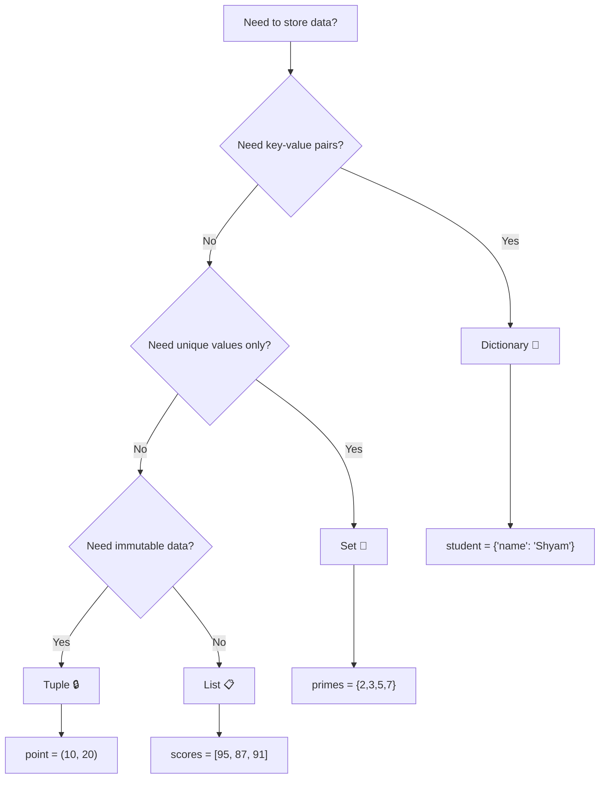
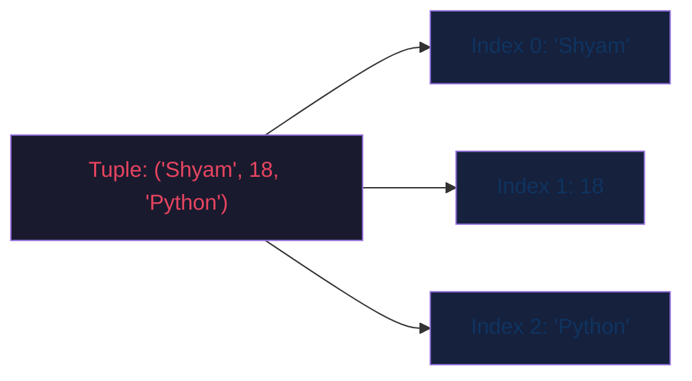
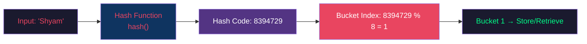
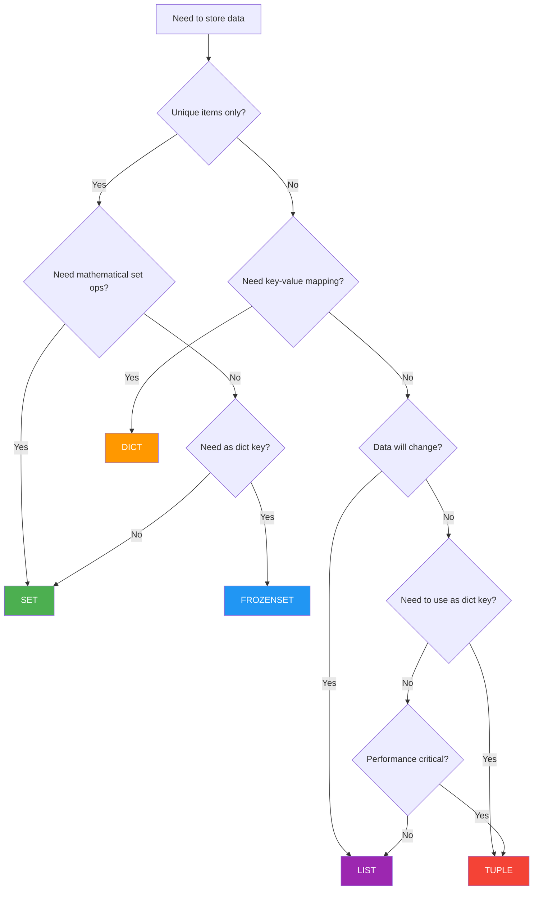
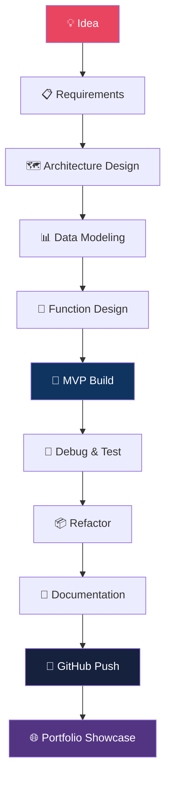
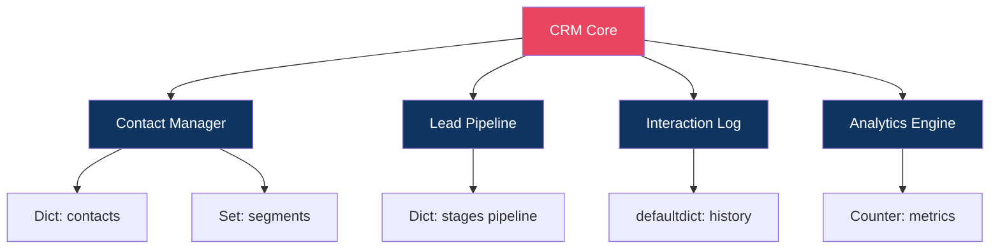
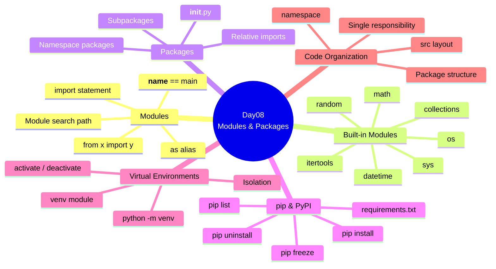
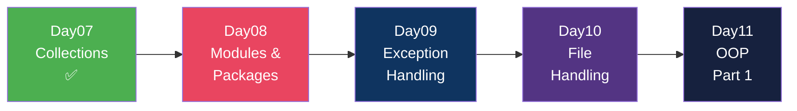

# 🐍 Python Day 07 — Tuples + Sets + Dictionaries + Hashing Mastery

> **NIELIT Gorakhpur | Python Batch 2025**
> **Day 07 of 30 | Collections & Hashing Foundations**

```
██████╗  █████╗ ██╗   ██╗ ██████╗ ███████╗
██╔══██╗██╔══██╗╚██╗ ██╔╝██╔═████╗╚════██║
██║  ██║███████║ ╚████╔╝ ██║██╔██║    ██╔╝
██║  ██║██╔══██║  ╚██╔╝  ████╔╝██║   ██╔╝
██████╔╝██║  ██║   ██║   ╚██████╔╝   ██║
╚═════╝ ╚═╝  ╚═╝   ╚═╝    ╚═════╝    ╚═╝
    TUPLES • SETS • DICTS • HASHING
```

---

## 📋 Table of Contents

| Section | Topic | Page |
|---------|-------|------|
| 01 | Complete Revision Day01–Day06 | [→](#section-1) |
| 02 | Introduction to Python Collections | [→](#section-2) |
| 03 | Tuples Masterclass | [→](#section-3) |
| 04 | Advanced Tuples | [→](#section-4) |
| 05 | Sets Masterclass | [→](#section-5) |
| 06 | Set Methods Masterclass | [→](#section-6) |
| 07 | Hashing Fundamentals | [→](#section-7) |
| 08 | Dictionaries Masterclass | [→](#section-8) |
| 09 | Dictionary Methods Masterclass | [→](#section-9) |
| 10 | Advanced Dictionaries | [→](#section-10) |
| 11 | Collection Comparison Masterclass | [→](#section-11) |
| 12 | Collection Algorithms | [→](#section-12) |
| 13 | Data Modeling | [→](#section-13) |
| 14 | Complexity Analysis | [→](#section-14) |
| 15 | Debugging Collections | [→](#section-15) |
| 16 | Best Practices | [→](#section-16) |
| 17 | Mini Projects (10) | [→](#section-17) |
| 18 | Portfolio Projects (20) | [→](#section-18) |
| 19 | GitHub Profile Booster Projects (10) | [→](#section-19) |
| 20 | Complete Project Solution Framework | [→](#section-20) |
| 21 | 400 Practice Questions | [→](#section-21) |
| 22 | 200 Interview Questions | [→](#section-22) |
| 23 | Assignments | [→](#section-23) |
| 24 | Enterprise Challenge Projects | [→](#section-24) |
| 25 | Day07 Revision Cheat Sheets | [→](#section-25) |
| 26 | Preparation for Day08 | [→](#section-26) |

---

<a name="section-1"></a>
## 📚 SECTION 1 — Complete Revision: Day01–Day06

### 🗺️ Python Foundation Mind Map

```mermaid
  mindmap
  root((Python<br/>Foundation))
  
  Day01
  Variables & Data Types
  Operators
  Arithmetic
  Comparison
  Logical
  Bitwise
  Type Casting
  Input / Output
  
    Day02
    Strings
    Indexing
    Slicing
    Methods
    Memory Model
    id()
    Interning
    Input Handling
    input()
    int/float conversion
    
    Day03
      Conditional Statements
      if / elif / else
      Nested if
      Ternary
      match-case
      Boolean Logic
      
    Day04
      Loops
      for loop
      while loop
      break / continue
      pass
      Pattern Printing
      Nested Loops
      
    Day05
      Functions
      Parameters
      Return
      *args **kwargs
      Recursion
      Base Case
      Call Stack
      Lambda
      Scope LEGB
      
    Day06
        Lists
        CRUD
        Methods
        Comprehensions
        Sorting
        2D Lists
        Memory Model
        Mutable
        References
```

---

### 📊 Day01–Day06 Summary Table

| Day | Core Concept | Key Takeaway | Critical Code |
|-----|-------------|--------------|---------------|
| 01 | Variables, Operators | Everything in Python is an object | `x = 10; type(x)` |
| 02 | Strings, Memory | Strings are immutable sequences | `s[0], s[1:4], s.upper()` |
| 03 | Conditionals | Control program flow with logic | `if x > 0: ... elif: ... else:` |
| 04 | Loops | Automate repetition | `for i in range(n): ...` |
| 05 | Functions | Reusable code blocks with scope | `def func(*args, **kwargs):` |
| 06 | Lists | Ordered, mutable collections | `lst.append(), lst.sort()` |

---

### 📝 Lists Cheat Sheet (Day06 Revision)

```python
# ─────── Creation ───────
lst = [1, 2, 3]
lst = list(range(10))

# ─────── CRUD ───────
lst.append(4)          # Add at end
lst.insert(0, 0)       # Insert at index
lst[1] = 99            # Update
lst.remove(99)         # Remove by value
lst.pop()              # Remove last
lst.pop(0)             # Remove by index

# ─────── Search ───────
4 in lst               # True / False
lst.index(4)           # Position of value
lst.count(3)           # How many times

# ─────── Sort ───────
lst.sort()             # In place, ascending
lst.sort(reverse=True) # Descending
sorted(lst)            # Returns new list

# ─────── Slicing ───────
lst[1:4]               # Index 1 to 3
lst[::-1]              # Reversed
lst[::2]               # Every 2nd element

# ─────── Comprehension ───────
squares = [x**2 for x in range(10)]
evens   = [x for x in range(20) if x % 2 == 0]

# ─────── 2D List ───────
matrix = [[1,2,3],[4,5,6],[7,8,9]]
matrix[0][1]           # Row 0, Col 1 → 2
```

---

### 📝 Functions Cheat Sheet (Day05 Revision)

```python
# ─────── Basic ───────
def greet(name):
    return f"Hello, {name}!"

# ─────── Default Args ───────
def power(base, exp=2):
    return base ** exp

# ─────── *args and **kwargs ───────
def total(*nums):
    return sum(nums)

def profile(**info):
    for k, v in info.items():
        print(f"{k}: {v}")

# ─────── Lambda ───────
square = lambda x: x**2

# ─────── Recursion ───────
def factorial(n):
    if n == 0: return 1         # Base case
    return n * factorial(n-1)   # Recursive case
```

---

<a name="section-2"></a>
## 🗂️ SECTION 2 — Introduction to Python Collections

### What Are Collections?

A **collection** is a Python object that stores multiple values. Python has four built-in collection types:

| Collection | Ordered | Mutable | Duplicates | Key-Value |
|------------|---------|---------|------------|-----------|
| **List** | ✅ | ✅ | ✅ | ❌ |
| **Tuple** | ✅ | ❌ | ✅ | ❌ |
| **Set** | ❌ | ✅ | ❌ | ❌ |
| **Dictionary** | ✅ (3.7+) | ✅ | Keys: ❌ | ✅ |

---

### 🔄 Collection Flow Diagram



---

### 🌍 When to Use What — Industry Examples

| Scenario | Best Collection | Reason |
|----------|----------------|--------|
| Store student marks | List | Ordered, duplicates allowed |
| Store unique tags on a blog | Set | Uniqueness required |
| Store GPS coordinates (lat, lng) | Tuple | Fixed, immutable |
| Store user profile JSON | Dictionary | Key-value structure |
| API response data | Dictionary | JSON-like |
| Mathematical set operations | Set | Union, intersection built-in |
| Function return multiple values | Tuple | Lightweight, fast |
| History of actions | List | Ordered sequence |
| Word frequency count | Dictionary | Key=word, Value=count |
| Countries in a continent | Set | No duplicates |

---

### ⚡ Memory Differences

```
LIST   → [header][ob_size][item0][item1][item2]...  Mutable → Extra overhead
TUPLE  → [header][ob_size][item0][item1][item2]...  Immutable → Smaller
SET    → [hash_table][bucket0][bucket1]...           Hash table storage
DICT   → [hash_table][key0→val0][key1→val1]...      Hash table + key-value pairs
```

```python
import sys

lst   = [1, 2, 3, 4, 5]
tup   = (1, 2, 3, 4, 5)
st    = {1, 2, 3, 4, 5}
d     = {1:'a', 2:'b', 3:'c', 4:'d', 5:'e'}

print(sys.getsizeof(lst))   # 120 bytes
print(sys.getsizeof(tup))   # 80 bytes  ← smallest
print(sys.getsizeof(st))    # 216 bytes
print(sys.getsizeof(d))     # 232 bytes
```

---

<a name="section-3"></a>
## 🔒 SECTION 3 — Tuples Masterclass

### 3.1 What is a Tuple?

A **Tuple** is an **ordered, immutable** sequence of elements. Once created, it cannot be changed.

> 🌍 **Real World Analogy:** Think of a tuple like a **birth certificate** — your name, date of birth, parents' names are fixed forever. You cannot edit them. They are an immutable record of truth.



---

### 3.2 Tuple Creation

```python
# ─────── Empty Tuple ───────
empty = ()
empty = tuple()

# ─────── Single Element Tuple ───────
single = (42,)          # ✅ CORRECT — note the comma!
not_tuple = (42)        # ❌ This is just int 42
print(type(single))     # <class 'tuple'>
print(type(not_tuple))  # <class 'int'>

# ─────── Multiple Elements ───────
student = ("Shyam", 18, "Python")
coords  = (28.6139, 77.2090)        # Delhi GPS
rgb     = (255, 128, 0)             # Orange color

# ─────── Without Parentheses (Packing) ───────
point = 10, 20          # Valid! Python auto-packs
print(type(point))      # <class 'tuple'>

# ─────── From Iterable ───────
from_list   = tuple([1, 2, 3])
from_string = tuple("Python")   # ('P','y','t','h','o','n')
from_range  = tuple(range(5))   # (0, 1, 2, 3, 4)
```

---

### 3.3 Internal Working & Memory Model

```
Memory Layout of tuple ("Shyam", 18, "Python"):

┌─────────────────────────────────────────────┐
│  PyTupleObject                              │
├────────────┬────────────────────────────────┤
│ ob_refcnt  │  Reference Count = 1           │
│ ob_type    │  → PyTuple_Type                │
│ ob_size    │  3 (number of elements)        │
├────────────┴────────────────────────────────┤
│  ob_item[0]  → pointer → "Shyam" (str)      │
│  ob_item[1]  → pointer → 18 (int)           │
│  ob_item[2]  → pointer → "Python" (str)     │
└─────────────────────────────────────────────┘

Key: Items are POINTERS to objects, not the objects themselves.
     The pointers themselves are immutable — you cannot
     reassign ob_item[0] to point elsewhere.
```

```python
# Proof of immutability
student = ("Shyam", 18, "Python")
# student[0] = "Rahul"   # ❌ TypeError: 'tuple' object does not support item assignment

# BUT if tuple contains mutable object, THAT can change:
t = ([1, 2, 3], "hello")
t[0].append(4)           # ✅ The LIST changes
print(t)                  # ([1, 2, 3, 4], 'hello')
# t itself didn't change — the pointer still points to the same list
```

---

### 3.4 Tuple Packing and Unpacking

```python
# ─────── Packing ───────
student = "Shyam", 18, "Python"    # Packing 3 values into 1 tuple

# ─────── Unpacking ───────
name, age, lang = student
print(name)   # Shyam
print(age)    # 18
print(lang)   # Python

# ─────── Extended Unpacking ───────
first, *rest = (1, 2, 3, 4, 5)
print(first)  # 1
print(rest)   # [2, 3, 4, 5]  ← Note: rest is a LIST

*start, last = (1, 2, 3, 4, 5)
print(start)  # [1, 2, 3, 4]
print(last)   # 5

first, *middle, last = (1, 2, 3, 4, 5)
print(middle) # [2, 3, 4]

# ─────── Swap Using Tuple Unpacking ───────
a, b = 10, 20
a, b = b, a       # Elegant Pythonic swap
print(a, b)       # 20 10

# ─────── Function Returning Multiple Values ───────
def min_max(numbers):
    return min(numbers), max(numbers)   # Returns a tuple

lo, hi = min_max([5, 2, 8, 1, 9, 3])
print(lo, hi)   # 1 9

# ─────── Nested Unpacking ───────
data = ("Shyam", (18, "Male"), "Python")
name, (age, gender), lang = data
print(age, gender)   # 18 Male
```

---

### 3.5 Tuple Indexing and Slicing

```python
t = (10, 20, 30, 40, 50)

# ─────── Indexing ───────git
print(t[0])    # 10  (first)
print(t[-1])   # 50  (last)
print(t[-2])   # 40  (second from last)

# ─────── Slicing ───────
print(t[1:4])     # (20, 30, 40)
print(t[:3])      # (10, 20, 30)
print(t[2:])      # (30, 40, 50)
print(t[::-1])    # (50, 40, 30, 20, 10) — reversed
print(t[::2])     # (10, 30, 50) — every 2nd

# ─────── Nested Tuples ───────
matrix = ((1,2,3), (4,5,6), (7,8,9))
print(matrix[1][2])   # 6 (row 1, col 2)
```

---

### 3.6 Immutability — Why It Matters

```python
# ─────── Why Tuples? Performance ───────
import timeit

list_time  = timeit.timeit('[1,2,3,4,5]', number=10_000_000)
tuple_time = timeit.timeit('(1,2,3,4,5)', number=10_000_000)

print(f"List  creation: {list_time:.3f}s")   # ~0.8s
print(f"Tuple creation: {tuple_time:.3f}s")  # ~0.2s  ← 4x faster!
```

| Reason to Use Tuple | Explanation |
|---------------------|-------------|
| **Faster** | No dynamic resizing overhead |
| **Memory efficient** | Smaller footprint than list |
| **Hashable** | Can be used as dict key |
| **Safe** | Data integrity guaranteed |
| **Semantic meaning** | Signals "this shouldn't change" |

---

### 3.7 Common Mistakes with Tuples

```python
# ─────── Mistake 1: Single element without comma ───────
bad  = (1)   # int, not tuple!
good = (1,)  # tuple ✅

# ─────── Mistake 2: Trying to modify ───────
t = (1, 2, 3)
# t[0] = 99   # TypeError ❌

# ─────── Mistake 3: Confusing tuple with list ───────
# Tuples can't append, insert, remove, sort in place

# ─────── Mistake 4: Forgetting tuples inside lists ───────
records = [("Shyam", 95), ("Priya", 88)]
for name, score in records:   # Unpack properly
    print(f"{name}: {score}")
```

---

<a name="section-4"></a>
## 🔒 SECTION 4 — Advanced Tuples

### 4.1 Tuple Methods

Tuples only have **2 built-in methods** (because they're immutable):

```python
t = (1, 2, 3, 2, 4, 2, 5)

# ─────── count() ───────
# Returns how many times a value appears
print(t.count(2))     # 3
# Time Complexity: O(n)

# ─────── index() ───────
# Returns index of FIRST occurrence
print(t.index(4))     # 4
print(t.index(2))     # 1  (first 2)
# Time Complexity: O(n)
# Raises ValueError if not found
```

---

### 4.2 Tuple Traversal

```python
student = ("Shyam", 18, "Python", 9.2)

# ─────── Simple for loop ───────
for item in student:
    print(item)

# ─────── With index using enumerate ───────
for i, item in enumerate(student):
    print(f"Index {i}: {item}")

# ─────── While loop ───────
i = 0
while i < len(student):
    print(student[i])
    i += 1

# ─────── List of Tuples ───────
students = [
    ("Shyam",  18, 95),
    ("Priya",  19, 88),
    ("Rahul",  20, 92),
]

for name, age, score in students:
    print(f"{name} (Age {age}): {score}/100")
```

---

### 4.3 Named Tuples — Professional Data Modeling

```python
from collections import namedtuple

# ─────── Create a Named Tuple Class ───────
Student = namedtuple('Student', ['name', 'age', 'score', 'branch'])

# ─────── Create instances ───────
s1 = Student(name="Shyam", age=18, score=95, branch="AI/ML")
s2 = Student("Priya", 19, 88, "CS")

# ─────── Access by name (readable!) ───────
print(s1.name)     # Shyam
print(s1.score)    # 95

# ─────── Still supports index access ───────
print(s1[0])       # Shyam

# ─────── Unpacking works ───────
name, age, score, branch = s1

# ─────── Convert to dict ───────
print(s1._asdict())
# OrderedDict([('name','Shyam'),('age',18),('score',95),('branch','AI/ML')])

# ─────── Replace (returns new instance) ───────
s1_updated = s1._replace(score=98)
print(s1_updated)   # Student(name='Shyam', age=18, score=98, branch='AI/ML')

# ─────── Why Named Tuples? ───────
# More readable than plain tuples
# Less memory than dict
# Immutable (safe)
# Perfect for records, rows, coordinates
```

---

### 4.4 Tuple Use Cases in Industry

```python
# ─────── 1. Database Row Records ───────
db_row = (101, "Shyam Kumar", "shyam@email.com", "2024-01-15")
user_id, name, email, joined = db_row

# ─────── 2. GPS Coordinates ───────
delhi    = (28.6139, 77.2090)
mumbai   = (19.0760, 72.8777)
distance = ((delhi[0]-mumbai[0])**2 + (delhi[1]-mumbai[1])**2)**0.5

# ─────── 3. RGB Colors ───────
RED   = (255, 0, 0)
GREEN = (0, 255, 0)
BLUE  = (0, 0, 255)

# ─────── 4. Dictionary Keys ───────
cache = {}
cache[(0, 0)] = "origin"        # Tuple as dict key ✅
# cache[[0, 0]] = "origin"      # ❌ List can't be dict key (not hashable)

# ─────── 5. Function Multiple Returns ───────
def divide(a, b):
    if b == 0:
        return None, "Division by zero"
    return a / b, "Success"

result, msg = divide(10, 2)
print(result, msg)   # 5.0 Success

# ─────── 6. Config Constants ───────
ALLOWED_EXTENSIONS = ('jpg', 'jpeg', 'png', 'gif', 'webp')
MAX_FILE_SIZES     = (1_000_000, 5_000_000, 10_000_000)  # 1MB, 5MB, 10MB
```

---

<a name="section-5"></a>
## 🔷 SECTION 5 — Sets Masterclass

### 5.1 What is a Set?

A **Set** is an **unordered collection of unique, hashable elements**. Sets use a **hash table** internally, making membership testing O(1).

> 🌍 **Real World Analogy:** A set is like a **bag of unique coins** — no matter how many times you put a 5-rupee coin in the bag, there's only ever one 5-rupee coin inside.

### 5.2 Set Creation

```python
# ─────── Empty Set ───────
empty = set()                    # ✅ Correct
# empty = {}                     # ❌ This creates an empty DICT!

# ─────── Literal Syntax ───────
primes   = {2, 3, 5, 7, 11, 13}
fruits   = {"apple", "banana", "cherry"}
mixed    = {1, "hello", 3.14, True}   # Heterogeneous

# ─────── From Iterable ───────
from_list   = set([1, 2, 2, 3, 3, 3, 4])    # {1, 2, 3, 4}
from_string = set("programming")             # Unique characters
from_range  = set(range(5))                  # {0, 1, 2, 3, 4}

# ─────── Duplicates Auto-Removed ───────
numbers = {1, 2, 2, 3, 3, 3, 4, 4, 4, 4}
print(numbers)   # {1, 2, 3, 4}
print(len(numbers))  # 4

# ─────── Boolean / Integer ───────
print({True, 1, 1.0})   # {True}  — same hash!
print({False, 0, 0.0})  # {False} — same hash!
```

---

### 5.3 Hashing Concept in Sets

```
How a Set Stores Elements:

Input: {7, 3, 1, 5, 9}

Step 1: hash(7) → 7 % 8 = 7  → Bucket 7
Step 2: hash(3) → 3 % 8 = 3  → Bucket 3
Step 3: hash(1) → 1 % 8 = 1  → Bucket 1
Step 4: hash(5) → 5 % 8 = 5  → Bucket 5
Step 5: hash(9) → 9 % 8 = 1  → Bucket 1 (COLLISION!)
         → Linear probing → Bucket 2

Internal Hash Table:
┌─────┬───────┐
│ Idx │ Value │
├─────┼───────┤
│  0  │  —    │
│  1  │  1    │
│  2  │  9    │  ← After collision resolution
│  3  │  3    │
│  4  │  —    │
│  5  │  5    │
│  6  │  —    │
│  7  │  7    │
└─────┴───────┘
```

---

### 5.4 Set Membership — O(1) Power

```python
# Why sets are BLAZING FAST for membership testing

import time

lst = list(range(1_000_000))
st  = set(range(1_000_000))

# ─────── List membership: O(n) ───────
start = time.perf_counter()
999_999 in lst
print(f"List lookup: {time.perf_counter() - start:.6f}s")   # ~0.01s

# ─────── Set membership: O(1) ───────
start = time.perf_counter()
999_999 in st
print(f"Set  lookup: {time.perf_counter() - start:.6f}s")   # ~0.0000001s
```

---

### 5.5 Why Duplicates Are Removed

```python
# Python uses hash() to determine uniqueness

x = 5
print(hash(x))          # 5

y = 5
print(hash(y))          # 5  ← Same hash!

# When adding to set:
# 1. Compute hash(value)
# 2. Check if that hash bucket is occupied
# 3. If occupied AND value equals existing → SKIP (duplicate)
# 4. If not occupied → ADD to bucket

# This is why only hashable objects can be set members:
# ✅ Hashable: int, float, str, tuple, bool, frozenset
# ❌ Not hashable: list, dict, set (mutable = not hashable)

# s = {[1,2,3]}   # TypeError: unhashable type: 'list'
```

---

<a name="section-6"></a>
## 🔷 SECTION 6 — Set Methods Masterclass

### 6.1 Modification Methods

```python
s = {1, 2, 3}

# ─────── add() ── O(1) ───────
s.add(4)
s.add(2)       # Ignored — already exists
print(s)       # {1, 2, 3, 4}

# ─────── remove() ── O(1) ───────
s.remove(4)
# s.remove(99)  # KeyError ❌ — raises if not found
print(s)

# ─────── discard() ── O(1) ───────
s.discard(3)   # Safe removal
s.discard(99)  # No error if not found ✅
print(s)

# ─────── pop() ── O(1) ───────
x = s.pop()    # Removes ARBITRARY element (sets unordered)
print(x)

# ─────── clear() ── O(1) ───────
s.clear()
print(s)   # set()

# ─────── copy() ─────
original = {1, 2, 3}
copy     = original.copy()     # Shallow copy
copy.add(4)
print(original)    # {1, 2, 3}  — unaffected
print(copy)        # {1, 2, 3, 4}

# ─────── update() ── O(len(t)) ───────
s = {1, 2, 3}
s.update([4, 5, 6])      # Add multiple elements
s.update({7}, (8, 9))    # Multiple iterables
print(s)    # {1,2,3,4,5,6,7,8,9}
```

---

### 6.2 Mathematical Set Operations

```python
A = {1, 2, 3, 4, 5}
B = {4, 5, 6, 7, 8}
```

```
Venn Diagram:

     A           B
  ┌──────────────────┐
  │  1  2  3 ║4  5║ 6  7  8│
  └──────────────────┘
             A∩B
```

```python
# ─────── union() ── A ∪ B ───────
# All elements from both sets
print(A | B)                # {1,2,3,4,5,6,7,8}
print(A.union(B))           # Same result

# ─────── intersection() ── A ∩ B ───────
# Elements in BOTH sets
print(A & B)                # {4, 5}
print(A.intersection(B))    # Same result

# ─────── difference() ── A - B ───────
# Elements in A but NOT in B
print(A - B)                # {1, 2, 3}
print(A.difference(B))      # Same result

# ─────── symmetric_difference() ── A △ B ───────
# Elements in either but NOT both
print(A ^ B)                         # {1,2,3,6,7,8}
print(A.symmetric_difference(B))     # Same result

# ─────── Update Variants (in-place) ───────
A.update(B)                          # A |= B
A.intersection_update(B)             # A &= B
A.difference_update(B)               # A -= B
A.symmetric_difference_update(B)     # A ^= B
```

---

### 6.3 Subset / Superset / Disjoint

```python
A = {1, 2, 3}
B = {1, 2, 3, 4, 5}
C = {6, 7, 8}

# ─────── issubset() ───────
print(A.issubset(B))     # True  — A ⊆ B
print(A <= B)            # True  — same
print(A < B)             # True  — proper subset (A ≠ B)

# ─────── issuperset() ───────
print(B.issuperset(A))   # True  — B ⊇ A
print(B >= A)            # True
print(B > A)             # True  — proper superset

# ─────── isdisjoint() ───────
print(A.isdisjoint(C))   # True  — No common elements
print(A.isdisjoint(B))   # False — Common elements exist
```

---

### 6.4 frozenset — Immutable Set

```python
# frozenset is to set what tuple is to list

fs = frozenset([1, 2, 3, 4, 5])
print(fs)           # frozenset({1, 2, 3, 4, 5})

# Hashable — can be used as dict key
graph = {}
graph[frozenset({1,2})] = "edge"    # ✅ Valid

# Supports all read operations
print(2 in fs)      # True
print(fs & {3,4,5}) # frozenset({3, 4, 5})
```

---

### 6.5 Set Use Cases — Industry Examples

```python
# ─────── 1. Remove Duplicates ───────
tags = ["python", "ai", "python", "ml", "ai", "deep-learning"]
unique_tags = list(set(tags))

# ─────── 2. Find Common Elements ───────
user1_interests = {"python", "ai", "music", "chess"}
user2_interests = {"python", "chess", "gaming", "ai"}
common = user1_interests & user2_interests
print("Common interests:", common)   # {'python', 'ai', 'chess'}

# ─────── 3. Membership Lookups at Scale ───────
BANNED_USERS = {101, 205, 334, 512, 899}
user_id = 334
if user_id in BANNED_USERS:   # O(1) lookup
    print("Access denied")

# ─────── 4. Email Deduplication ───────
raw_emails = ["a@x.com", "b@x.com", "a@x.com", "c@x.com"]
unique_emails = set(raw_emails)

# ─────── 5. Spell Checker ───────
DICTIONARY = set(open("/usr/share/dict/words").read().split()) if False else {"hello", "world", "python"}
text_words  = {"hello", "wrold", "pytohn"}
misspelled  = text_words - DICTIONARY
print("Misspelled:", misspelled)
```

---

<a name="section-7"></a>
## 🔑 SECTION 7 — Hashing Fundamentals

### 7.1 What is Hashing?

**Hashing** is the process of converting an input of arbitrary size into a **fixed-size numerical value** (hash code) using a **hash function**.

> 🌍 **Real World Analogy:** Think of hashing like a **library catalog system**. When you want to find a book, instead of searching all shelves, you use the catalog (hash) to jump directly to the exact shelf. The catalog converts a book name into a shelf number instantly.



---

### 7.2 Python's hash() Function

```python
# Python uses hash() internally for sets and dicts

print(hash(42))            # 42
print(hash(3.14))          # 322818021289917443
print(hash("Python"))      # Some large integer (varies per run)
print(hash(True))          # 1
print(hash(False))         # 0
print(hash((1, 2, 3)))    # Some integer — tuples are hashable!

# Non-hashable:
# hash([1,2,3])     # TypeError
# hash({1:2})       # TypeError
# hash({1,2,3})     # TypeError

# Interesting:
print(hash(1) == hash(1.0) == hash(True))   # True!
# That's why {1, 1.0, True} has only one element
```

---

### 7.3 Hash Tables — The Internal Engine

```
Hash Table Architecture:

                  hash(key) % table_size
                           ↓
┌──────────────────────────────────────────────────┐
│                  HASH TABLE                       │
├───────┬──────────────────────────────────────────┤
│ Index │  Entry (key, value, hash)                │
├───────┼──────────────────────────────────────────┤
│   0   │  EMPTY                                    │
│   1   │  ("name", "Shyam",    hash=0x1a2b3c)    │
│   2   │  ("branch", "CS",     hash=0x4d5e6f)    │
│   3   │  EMPTY                                    │
│   4   │  ("age", 18,          hash=0x7a8b9c)    │
│   5   │  EMPTY                                    │
│   6   │  ("score", 95,        hash=0xde0f12)    │
│   7   │  ("city", "Gorakhpur",hash=0x345678)    │
└───────┴──────────────────────────────────────────┘

Lookup:  hash("name") % 8 → 1 → Return "Shyam"
Time:    O(1) average
```

---

### 7.4 Collision Handling

**Collision**: Two different keys produce the same hash bucket index.

```
Collision Example:

hash("abc") % 8 = 3
hash("bca") % 8 = 3  ← COLLISION!

Resolution Strategies:

1. Open Addressing (Python uses this):
   → Try next bucket: 3 → 4 → 5 → ...
   → Called Linear Probing

2. Chaining (Common in other languages):
   → Store a linked list at each bucket
   → Bucket 3 → [("abc",val1) → ("bca",val2)]
```

```python
# Python 3.6+ — Improved Dict Internals (Compact Dict)
# Uses a combination of:
# - Indices array (small, dense)
# - Entries array (key, hash, value)
# This saves 20-25% memory vs old hash table

# You can observe hash behavior:
class MyKey:
    def __init__(self, val):
        self.val = val
    def __hash__(self):
        return 42  # All instances return same hash!
    def __eq__(self, other):
        return self.val == other.val

d = {}
d[MyKey(1)] = "one"
d[MyKey(2)] = "two"   # Collision! Both hash to 42
print(len(d))   # 2 — Python resolves via __eq__
```

---

### 7.5 Why Dicts and Sets Are Fast

```
LIST lookup for "Shyam":
[A] → compare → [B] → compare → ... → [Shyam] ← Found!
Time: O(n) — must scan each element

DICT lookup for key "name":
hash("name") → 3 → Go directly to index 3 → Found!
Time: O(1) — direct jump via hash

Speed Comparison for 1M elements:
┌──────────────┬─────────────────┬─────────────────┐
│ Operation    │ List            │ Dict/Set         │
├──────────────┼─────────────────┼─────────────────┤
│ Lookup       │ 0.1s  (O(n))   │ 0.000001s (O(1)) │
│ Insert       │ O(1) append     │ O(1) average     │
│ Delete       │ O(n) by value   │ O(1) by key      │
└──────────────┴─────────────────┴─────────────────┘
```

---

### 7.6 Real World Hashing Applications

| Application | How Hashing is Used |
|-------------|---------------------|
| **Password Storage** | Store hash(password), never plain text |
| **Blockchain** | SHA-256 hash of each block |
| **Caching** | hash(request) → cached response |
| **Databases** | Hash indexes for O(1) lookup |
| **Compilers** | Symbol table is a hash map |
| **Git** | SHA-1 hash of each commit |
| **DNS** | Hash table maps domain → IP |
| **Python Dicts** | Core language feature |

```python
# ─────── Python's hashlib — Cryptographic Hashing ───────
import hashlib

password = "MySecret123"
hashed   = hashlib.sha256(password.encode()).hexdigest()
print(hashed)
# e3b6... (64-char hex string)
# One-way: cannot reverse to get original
```

---

<a name="section-8"></a>
## 📖 SECTION 8 — Dictionaries Masterclass

### 8.1 What is a Dictionary?

A **Dictionary** is an **ordered** (Python 3.7+), **mutable** collection of **key-value pairs**, implemented internally as a **hash map**.

> 🌍 **Real World Analogy:** A dictionary is like an actual **English dictionary** — you look up a **word (key)** and get its **definition (value)** instantly, without reading from page 1.

### 8.2 Dictionary Creation

```python
# ─────── Literal Syntax ───────
student = {
    "name":   "Shyam Kumar",
    "age":    18,
    "branch": "AI/ML",
    "score":  95.5,
    "skills": ["Python", "ML", "DSA"],
}

# ─────── Empty Dictionary ───────
empty = {}
empty = dict()

# ─────── dict() Constructor ───────
person = dict(name="Shyam", age=18, city="Gorakhpur")

# ─────── From List of Tuples ───────
data = [("a", 1), ("b", 2), ("c", 3)]
d = dict(data)   # {'a':1, 'b':2, 'c':3}

# ─────── Dictionary Comprehension ───────
squares = {x: x**2 for x in range(1, 6)}
# {1:1, 2:4, 3:9, 4:16, 5:25}

# ─────── fromkeys() ───────
keys = ["name", "age", "score"]
d = dict.fromkeys(keys, 0)   # {'name':0, 'age':0, 'score':0}
```

---

### 8.3 Internal Working — Hash Map

```
Dictionary: {"name":"Shyam", "age":18, "score":95}

Internal CPython Implementation (Compact Dict, Python 3.6+):

Indices Array (sparse, small):
┌────┬────┬────┬────┬────┬────┬────┬────┐
│ -1 │  0 │ -1 │  2 │ -1 │  1 │ -1 │ -1 │
└────┴────┴────┴────┴────┴────┴────┴────┘

Entries Array (dense):
┌─────┬────────────────────────────────────┐
│ Idx │ (hash, key, value)                 │
├─────┼────────────────────────────────────┤
│  0  │ (hash("name"),  "name",  "Shyam")  │
│  1  │ (hash("age"),   "age",   18)       │
│  2  │ (hash("score"), "score", 95)       │
└─────┴────────────────────────────────────┘

Lookup "age":
  1. hash("age") → 5
  2. Indices[5] → 1
  3. Entries[1] → ("age", 18)
  4. Return 18
  Time: O(1) ✅
```

---

### 8.4 Dictionary CRUD Operations

```python
student = {"name": "Shyam", "age": 18}

# ─────── Create / Update ───────
student["branch"] = "AI/ML"    # Add new key
student["age"]    = 19         # Update existing

# ─────── Read ───────
print(student["name"])          # Shyam
print(student.get("score", 0))  # 0 (default if not found)

# ─────── Delete ───────
del student["age"]              # Removes key-value pair
score = student.pop("branch")   # Removes and RETURNS value

# ─────── Check Existence ───────
"name" in student               # True (checks keys)
"Shyam" in student.values()    # True (checks values)
("name","Shyam") in student.items()  # True (checks pair)

# ─────── Iterate ───────
for key in student:             # Iterates over keys
    print(key, student[key])

for key, val in student.items():
    print(f"{key}: {val}")
```

---

<a name="section-9"></a>
## 📖 SECTION 9 — Dictionary Methods Masterclass

### 9.1 All Methods Reference

```python
d = {"name": "Shyam", "age": 18, "score": 95, "city": "Gorakhpur"}
```

#### `get(key, default=None)` — Safe Lookup — O(1)

```python
# Never raises KeyError
print(d.get("name"))          # Shyam
print(d.get("email"))         # None
print(d.get("email", "N/A"))  # N/A

# Industry Use: Safe API response parsing
response = {"status": 200, "data": {"user": "Shyam"}}
email = response.get("data", {}).get("email", "Not provided")
```

#### `keys()` — Returns view of all keys — O(1)

```python
print(d.keys())   # dict_keys(['name', 'age', 'score', 'city'])
# Dynamic view — updates when dict changes
keys_list = list(d.keys())   # Convert to list if needed
```

#### `values()` — Returns view of all values — O(1)

```python
print(d.values())   # dict_values(['Shyam', 18, 95, 'Gorakhpur'])
print(sum(d.values()))  # Only if all values are numeric
```

#### `items()` — Returns view of (key, value) pairs — O(1)

```python
print(d.items())
# dict_items([('name','Shyam'),('age',18),('score',95),('city','Gorakhpur')])

for key, val in d.items():
    print(f"  {key:10} → {val}")
```

#### `update()` — Merge Dictionaries — O(len(other))

```python
extra = {"email": "shyam@email.com", "score": 98}
d.update(extra)
# Updates score to 98, adds email
print(d)

# Python 3.9+ merge operator:
d3 = d | extra   # New dict (non-destructive)
d |= extra       # In-place update
```

#### `pop(key, default)` — Remove & Return — O(1)

```python
score = d.pop("score")        # Returns 95, removes it
rank  = d.pop("rank", "N/A") # Returns "N/A" (not found, no error)
```

#### `popitem()` — Remove Last Inserted Pair — O(1)

```python
last_pair = d.popitem()   # Returns (key, value) of last item
print(last_pair)           # ('city', 'Gorakhpur')
# LIFO order (Python 3.7+)
```

#### `setdefault(key, default)` — Get or Set — O(1)

```python
# If key exists → return its value
# If key doesn't exist → insert key with default, return default
d.setdefault("score", 0)    # Returns 95 (already exists)
d.setdefault("rank", 1)     # Returns 1, also sets d["rank"] = 1

# POWER USE: Building frequency counter
words = ["python", "is", "great", "python", "is", "fast"]
freq = {}
for word in words:
    freq.setdefault(word, 0)
    freq[word] += 1
print(freq)   # {'python':2, 'is':2, 'great':1, 'fast':1}
```

#### `clear()` — Remove All — O(1)

```python
d.clear()
print(d)   # {}
```

#### `copy()` — Shallow Copy — O(n)

```python
original = {"name": "Shyam", "skills": ["Python", "ML"]}
copy     = original.copy()

copy["name"] = "Priya"          # Doesn't affect original
copy["skills"].append("DL")     # DOES affect original! (same list ref)

import copy as cp
deep = cp.deepcopy(original)    # True independent copy
```

#### `fromkeys(keys, value)` — Create from Keys — O(n)

```python
keys = ["name", "age", "score"]
template = dict.fromkeys(keys, None)
# {'name': None, 'age': None, 'score': None}

defaults = dict.fromkeys(["gold","silver","bronze"], 0)
# {'gold': 0, 'silver': 0, 'bronze': 0}
```

---

<a name="section-10"></a>
## 📖 SECTION 10 — Advanced Dictionaries

### 10.1 Nested Dictionaries

```python
# ─────── Student Database ───────
students = {
    "S001": {
        "name":   "Shyam Kumar",
        "age":    18,
        "scores": {"python": 95, "dsa": 88, "ml": 92},
        "skills": ["Python", "DSA", "ML"],
        "active": True
    },
    "S002": {
        "name":   "Priya Sharma",
        "age":    19,
        "scores": {"python": 91, "dsa": 94, "ml": 87},
        "skills": ["Python", "Web", "SQL"],
        "active": True
    }
}

# ─────── Deep Access ───────
print(students["S001"]["scores"]["python"])   # 95
print(students["S002"]["skills"][0])          # Python

# ─────── Add new student ───────
students["S003"] = {
    "name": "Rahul Verma",
    "age": 20,
    "scores": {"python": 89, "dsa": 76, "ml": 83},
    "skills": ["Python", "Flask"],
    "active": True
}

# ─────── Update nested value ───────
students["S001"]["scores"]["python"] = 98

# ─────── Iterate nested ───────
for sid, info in students.items():
    avg = sum(info["scores"].values()) / len(info["scores"])
    print(f"{sid} | {info['name']:15} | Avg: {avg:.1f}")
```

---

### 10.2 Dictionary Comprehensions

```python
# ─────── Basic ───────
squares = {x: x**2 for x in range(1, 11)}

# ─────── With Condition ───────
even_sq = {x: x**2 for x in range(1, 11) if x % 2 == 0}
# {2:4, 4:16, 6:36, 8:64, 10:100}

# ─────── From existing dict ───────
prices = {"apple":100, "banana":30, "cherry":200, "date":500}
expensive = {k:v for k,v in prices.items() if v > 100}
# {'cherry':200, 'date':500}

discounted = {k: v*0.9 for k,v in prices.items()}  # 10% off

# ─────── Invert dict ───────
original = {"a":1, "b":2, "c":3}
inverted = {v:k for k,v in original.items()}
# {1:'a', 2:'b', 3:'c'}

# ─────── Word frequency ───────
sentence = "the quick brown fox jumps over the lazy dog the fox"
freq = {word: sentence.split().count(word)
        for word in set(sentence.split())}
```

---

### 10.3 JSON-like Structures — API Response Modeling

```python
# Real-world API Response (like a REST API)
api_response = {
    "status": 200,
    "message": "Success",
    "data": {
        "user": {
            "id": 12345,
            "username": "shyam_ai",
            "email": "shyam@nielit.gov.in",
            "profile": {
                "full_name": "Shyam Kumar",
                "avatar": "https://cdn.example.com/avatars/12345.jpg",
                "bio": "Python & AI Engineer | NIELIT Gorakhpur",
                "joined": "2024-01-15"
            },
            "stats": {
                "posts": 42,
                "followers": 1200,
                "following": 300
            }
        },
        "posts": [
            {"id": 1, "title": "Mastering Python", "likes": 150},
            {"id": 2, "title": "Hashing in Python", "likes": 89},
        ]
    },
    "pagination": {
        "page": 1,
        "per_page": 10,
        "total": 42
    }
}

# ─────── Parsing ───────
user = api_response["data"]["user"]
print(f"Name: {user['profile']['full_name']}")
print(f"Followers: {user['stats']['followers']}")

# ─────── Safe parsing with get ───────
phone = api_response.get("data", {}).get("user", {}).get("phone", "Not provided")

# ─────── Convert to JSON ───────
import json
json_str = json.dumps(api_response, indent=2)
print(json_str[:200])

# ─────── Parse from JSON ───────
loaded = json.loads(json_str)
```

---

### 10.4 Advanced Patterns — defaultdict, Counter, OrderedDict

```python
from collections import defaultdict, Counter, OrderedDict

# ─────── defaultdict ── Never raises KeyError ───────
dd = defaultdict(int)
words = "python is the best python is fun python".split()
for w in words:
    dd[w] += 1    # No KeyError — auto-initializes to 0
print(dict(dd))   # {'python':3, 'is':2, 'the':1, 'best':1, 'fun':1}

# ─────── defaultdict with list ───────
groups = defaultdict(list)
students = [("CS", "Shyam"), ("AI", "Priya"), ("CS", "Rahul"), ("AI", "Neha")]
for dept, name in students:
    groups[dept].append(name)
print(dict(groups))
# {'CS': ['Shyam', 'Rahul'], 'AI': ['Priya', 'Neha']}

# ─────── Counter ── Frequency counting superpower ───────
text = "abracadabra"
c = Counter(text)
print(c)           # Counter({'a':5, 'b':2, 'r':2, 'c':1, 'd':1})
print(c.most_common(3))   # [('a',5), ('b',2), ('r',2)]

words = "the cat sat on the mat the cat".split()
wc = Counter(words)
print(wc.most_common(2))  # [('the',3), ('cat',2)]

# ─────── Counter arithmetic ───────
c1 = Counter(a=3, b=2)
c2 = Counter(a=1, b=4)
print(c1 + c2)   # Counter({'b':6, 'a':4})
print(c1 - c2)   # Counter({'a':2})
print(c1 & c2)   # Counter({'a':1, 'b':2}) — min
print(c1 | c2)   # Counter({'b':4, 'a':3}) — max
```

---

<a name="section-11"></a>
## ⚖️ SECTION 11 — Collection Comparison Masterclass

### 11.1 Master Comparison Table

| Feature | List `[]` | Tuple `()` | Set `{}` | Dict `{k:v}` |
|---------|-----------|------------|----------|--------------|
| **Ordered** | ✅ Yes | ✅ Yes | ❌ No | ✅ Yes (3.7+) |
| **Mutable** | ✅ Yes | ❌ No | ✅ Yes | ✅ Yes |
| **Duplicates** | ✅ Yes | ✅ Yes | ❌ No | Keys: ❌ Values: ✅ |
| **Indexed** | ✅ Yes | ✅ Yes | ❌ No | By key |
| **Sliceable** | ✅ Yes | ✅ Yes | ❌ No | ❌ No |
| **Hashable** | ❌ No | ✅ Yes | ❌ No | ❌ No |
| **Lookup** | O(n) | O(n) | O(1) | O(1) |
| **Append** | O(1) | N/A | O(1) | O(1) |
| **Delete** | O(n) | N/A | O(1) | O(1) |
| **Memory** | Medium | Small | Large | Large |
| **Syntax** | `[1,2,3]` | `(1,2,3)` | `{1,2,3}` | `{k:v}` |

---

### 11.2 Performance Benchmarks

```python
import timeit

n = 100_000
data_list  = list(range(n))
data_tuple = tuple(range(n))
data_set   = set(range(n))
data_dict  = {i: i for i in range(n)}
target = n - 1

# Membership test
t_list  = timeit.timeit(f"{target} in data_list",  globals=globals(), number=1000)
t_tuple = timeit.timeit(f"{target} in data_tuple", globals=globals(), number=1000)
t_set   = timeit.timeit(f"{target} in data_set",   globals=globals(), number=1000)
t_dict  = timeit.timeit(f"{target} in data_dict",  globals=globals(), number=1000)

print(f"List  membership: {t_list:.4f}s")    # Slowest O(n)
print(f"Tuple membership: {t_tuple:.4f}s")   # Slow    O(n)
print(f"Set   membership: {t_set:.6f}s")     # Fast    O(1)
print(f"Dict  membership: {t_dict:.6f}s")    # Fast    O(1)
```

---

### 11.3 When to Use Which — Decision Guide



---

<a name="section-12"></a>
## ⚙️ SECTION 12 — Collection Algorithms

### 12.1 Frequency Counter

```python
def frequency_counter(items):
    """Count occurrences of each item — O(n)"""
    freq = {}
    for item in items:
        freq[item] = freq.get(item, 0) + 1
    return freq

# Example
grades = [90, 85, 90, 95, 85, 90, 80, 95, 90]
freq = frequency_counter(grades)
print(freq)          # {90:4, 85:2, 95:2, 80:1}

# Most frequent
top = max(freq, key=freq.get)
print(f"Most common grade: {top} (appears {freq[top]} times)")
```

---

### 12.2 Duplicate Detection

```python
def has_duplicates(lst):
    """O(n) — using set"""
    return len(lst) != len(set(lst))

def find_duplicates(lst):
    """O(n) — return all duplicate values"""
    seen, duplicates = set(), set()
    for item in lst:
        if item in seen:
            duplicates.add(item)
        else:
            seen.add(item)
    return duplicates

data = [1, 2, 3, 2, 4, 3, 5]
print(has_duplicates(data))    # True
print(find_duplicates(data))   # {2, 3}
```

---

### 12.3 Fast Search — Set vs List

```python
# Industry Pattern: Pre-process into set for repeated lookups

users_list = [f"user_{i}" for i in range(100_000)]
users_set  = set(users_list)

# Query 10,000 times
queries = [f"user_{i}" for i in range(0, 200_000, 20)]

# Slow: O(n) per query
found_list = [u for u in queries if u in users_list]   # O(n*q)

# Fast: O(1) per query
found_set  = [u for u in queries if u in users_set]    # O(q)
```

---

### 12.4 Grouping

```python
def group_by(data, key_func):
    """Group items by a function's result"""
    groups = {}
    for item in data:
        key = key_func(item)
        groups.setdefault(key, []).append(item)
    return groups

students = [
    {"name":"Shyam",  "score":95, "grade":"A"},
    {"name":"Priya",  "score":88, "grade":"B"},
    {"name":"Rahul",  "score":95, "grade":"A"},
    {"name":"Neha",   "score":72, "grade":"C"},
    {"name":"Vikram", "score":88, "grade":"B"},
]

by_grade = group_by(students, lambda s: s["grade"])
for grade, members in sorted(by_grade.items()):
    names = [s["name"] for s in members]
    print(f"Grade {grade}: {', '.join(names)}")
```

---

### 12.5 Leaderboard System

```python
class Leaderboard:
    def __init__(self):
        self.scores = {}   # {player: score}

    def add_score(self, player, score):
        if player not in self.scores or score > self.scores[player]:
            self.scores[player] = score

    def top_n(self, n):
        return sorted(self.scores.items(), key=lambda x: x[1], reverse=True)[:n]

    def rank_of(self, player):
        sorted_scores = sorted(self.scores.values(), reverse=True)
        return sorted_scores.index(self.scores[player]) + 1

lb = Leaderboard()
lb.add_score("Shyam", 950)
lb.add_score("Priya", 1200)
lb.add_score("Rahul", 800)
lb.add_score("Shyam", 1100)  # Update Shyam's best

print("Top 3:", lb.top_n(3))
print("Shyam's rank:", lb.rank_of("Shyam"))
```

---

### 12.6 Data Cleaning with Sets

```python
def clean_data(records):
    """Remove duplicates, normalize keys"""
    seen = set()
    cleaned = []
    for record in records:
        # Create a hashable identifier
        identity = (record.get("email", "").lower().strip(),)
        if identity not in seen and identity[0]:
            seen.add(identity)
            cleaned.append({
                k: v.strip() if isinstance(v, str) else v
                for k, v in record.items()
            })
    return cleaned

raw = [
    {"name": "Shyam ", "email": "SHYAM@EMAIL.COM"},
    {"name": "Priya",  "email": "priya@email.com"},
    {"name": "Shyam",  "email": "shyam@email.com"},  # Duplicate
]
print(clean_data(raw))   # 2 records (Shyam de-duped)
```

---

<a name="section-13"></a>
## 🏗️ SECTION 13 — Data Modeling

### 13.1 Student Management System Data Model

```python
# Professional-grade data model

class StudentDB:
    """Student database using Python collections"""
    
    def __init__(self):
        self._students   = {}      # {id: student_dict}
        self._email_idx  = {}      # {email: id}      — fast lookup
        self._grade_idx  = {}      # {grade: set(ids)} — fast grouping
        self._counter    = 0
    
    def _generate_id(self):
        self._counter += 1
        return f"S{self._counter:04d}"
    
    def add(self, name, email, scores):
        if email in self._email_idx:
            raise ValueError(f"Email {email} already exists")
        
        sid   = self._generate_id()
        grade = self._compute_grade(scores)
        
        self._students[sid] = {
            "id":     sid,
            "name":   name,
            "email":  email,
            "scores": scores,
            "avg":    sum(scores.values()) / len(scores),
            "grade":  grade
        }
        self._email_idx[email] = sid
        self._grade_idx.setdefault(grade, set()).add(sid)
        return sid
    
    def _compute_grade(self, scores):
        avg = sum(scores.values()) / len(scores)
        if avg >= 90: return "A"
        if avg >= 80: return "B"
        if avg >= 70: return "C"
        if avg >= 60: return "D"
        return "F"
    
    def find_by_email(self, email):
        sid = self._email_idx.get(email)
        return self._students.get(sid)
    
    def find_by_grade(self, grade):
        ids = self._grade_idx.get(grade, set())
        return [self._students[i] for i in ids]
    
    def top_students(self, n=5):
        return sorted(
            self._students.values(),
            key=lambda s: s["avg"],
            reverse=True
        )[:n]

# Usage
db = StudentDB()
db.add("Shyam Kumar", "shyam@nielit.in", {"python":95,"ml":88,"dsa":92})
db.add("Priya Sharma","priya@nielit.in",  {"python":91,"ml":94,"dsa":87})
db.add("Rahul Verma", "rahul@nielit.in",  {"python":72,"ml":68,"dsa":75})

print(db.find_by_email("shyam@nielit.in")["grade"])  # A
print([s["name"] for s in db.find_by_grade("A")])     # ['Shyam Kumar', 'Priya Sharma']
print(db.top_students(2)[0]["name"])                   # Priya Sharma
```

---

### 13.2 Bank System Data Model

```python
bank = {
    "B001": {
        "holder": "Shyam Kumar",
        "balance": 50000.00,
        "account_type": "savings",
        "transactions": [
            {"type":"credit", "amount":50000, "date":"2024-01-01"},
        ],
        "kyc": {"pan":"XXXXX9999X", "aadhaar":"XXXX-XXXX-9999"}
    }
}

def transfer(bank, from_acc, to_acc, amount):
    if bank[from_acc]["balance"] < amount:
        raise ValueError("Insufficient funds")
    bank[from_acc]["balance"] -= amount
    bank[to_acc]["balance"]   += amount
    bank[from_acc]["transactions"].append({"type":"debit", "amount":amount})
    bank[to_acc]["transactions"].append({"type":"credit", "amount":amount})
```

---

<a name="section-14"></a>
## ⏱️ SECTION 14 — Complexity Analysis

### 14.1 Complete Complexity Table

| Operation | List | Tuple | Set | Dict |
|-----------|------|-------|-----|------|
| Access by index | O(1) | O(1) | N/A | N/A |
| Access by key | N/A | N/A | N/A | O(1) |
| Search (in) | O(n) | O(n) | O(1) | O(1) |
| Append / add | O(1)* | N/A | O(1)* | O(1)* |
| Insert at index | O(n) | N/A | N/A | N/A |
| Delete by index | O(n) | N/A | N/A | N/A |
| Delete by key | N/A | N/A | O(1) | O(1) |
| Iteration | O(n) | O(n) | O(n) | O(n) |
| Length | O(1) | O(1) | O(1) | O(1) |
| Union / intersect | N/A | N/A | O(n) | N/A |
| Sort | O(n log n) | N/A | N/A | O(n log n) |

`*` Amortized O(1) — occasionally triggers resize at O(n)

---

### 14.2 Why O(1) Dict/Set Lookup?

```
MYTH: "Dict/Set are always O(1)"
TRUTH: Average case O(1), worst case O(n) (all keys collide)

Hash quality matters:
Good hash → O(1) average
Poor hash → Degrades toward O(n) in worst case

Python mitigates this with:
- High-quality default hash functions
- Load factor management (resize when ~2/3 full)
- Perturbation in collision resolution
```

```python
# Visualizing O(1) vs O(n)
import time, random

sizes = [100, 1000, 10000, 100000, 1000000]

for size in sizes:
    lst = list(range(size))
    st  = set(range(size))
    target = size - 1  # Worst case for list

    t0 = time.perf_counter()
    _ = target in lst
    list_time = (time.perf_counter() - t0) * 1e6  # microseconds

    t0 = time.perf_counter()
    _ = target in st
    set_time = (time.perf_counter() - t0) * 1e6

    print(f"n={size:>8} | List: {list_time:8.2f}μs | Set: {set_time:.4f}μs")

# Output pattern:
# n=     100 | List:    0.10μs | Set: 0.0700μs
# n=    1000 | List:    1.20μs | Set: 0.0700μs
# n=   10000 | List:   12.50μs | Set: 0.0700μs  ← Set stays flat!
# n=  100000 | List:  125.00μs | Set: 0.0700μs
# n= 1000000 | List: 1250.00μs | Set: 0.0700μs
```

---

<a name="section-15"></a>
## 🐛 SECTION 15 — Debugging Collections

### 15.1 Common Errors and Fixes

```python
# ─────── KeyError ───────
d = {"name": "Shyam"}
# print(d["age"])   # KeyError: 'age'

# Fix 1: use get()
print(d.get("age", "Not found"))

# Fix 2: check before access
if "age" in d:
    print(d["age"])

# Fix 3: try-except
try:
    print(d["age"])
except KeyError as e:
    print(f"Key {e} not found")

# ─────── IndexError ───────
t = (1, 2, 3)
# print(t[5])   # IndexError: tuple index out of range

# Fix: check length
if len(t) > 5:
    print(t[5])

# ─────── Mutation Bug ───────
# Modifying dict while iterating (Python 3 raises RuntimeError)
d = {"a":1, "b":2, "c":3}
# for k in d:
#     if d[k] == 2:
#         del d[k]   # RuntimeError!

# Fix: iterate over a copy
for k in list(d.keys()):
    if d[k] == 2:
        del d[k]   # ✅ Safe

# ─────── Reference Bug ───────
# Shallow copy problem
original = {"skills": ["Python", "ML"]}
copy     = original.copy()
copy["skills"].append("DL")   # Modifies ORIGINAL too!
print(original)  # {"skills": ["Python", "ML", "DL"]} — Bug!

# Fix: Deep copy
import copy
deep_copy = copy.deepcopy(original)
deep_copy["skills"].append("DL")
print(original)   # Unaffected ✅

# ─────── Hashing Mistake ───────
# Mutable objects can't be set/dict keys
# {[1,2,3]: "list"}  # TypeError: unhashable type 'list'

# Fix: convert to tuple
{(1,2,3): "tuple"}  # ✅

# ─────── Set ordering assumption ───────
s = {3, 1, 4, 1, 5, 9}
# DO NOT rely on set order — it's undefined!
# for i, v in enumerate(s): ...  # Order may change between runs

# Fix: sort if order matters
for v in sorted(s):
    print(v)   # 1, 3, 4, 5, 9 — consistent
```

---

<a name="section-16"></a>
## ✨ SECTION 16 — Best Practices

### 16.1 Pythonic Patterns

```python
# ─────── Use get() not [] for dicts ───────
# ❌ Bad
if "name" in d:
    name = d["name"]
else:
    name = "Unknown"

# ✅ Good
name = d.get("name", "Unknown")

# ─────── Dict comprehension over loop ───────
# ❌ Verbose
result = {}
for k, v in data.items():
    result[k] = v * 2

# ✅ Pythonic
result = {k: v*2 for k, v in data.items()}

# ─────── Use setdefault for grouping ───────
# ❌ Verbose
groups = {}
for item in items:
    if item.category not in groups:
        groups[item.category] = []
    groups[item.category].append(item)

# ✅ Pythonic
groups = {}
for item in items:
    groups.setdefault(item.category, []).append(item)

# ✅ Even better
from collections import defaultdict
groups = defaultdict(list)
for item in items:
    groups[item.category].append(item)

# ─────── Tuple for fixed structure ───────
# ❌ Using list for immutable config
SERVER = ["localhost", 8080]

# ✅ Tuple signals immutability
SERVER = ("localhost", 8080)

# ─────── Set for membership checks ───────
# ❌ Slow if called many times
VALID_ROLES = ["admin", "user", "moderator", "superuser"]
if role in VALID_ROLES:  # O(n) every call

# ✅ Fast
VALID_ROLES = {"admin", "user", "moderator", "superuser"}
if role in VALID_ROLES:  # O(1) every call

# ─────── Named tuple for records ───────
from collections import namedtuple
Point = namedtuple('Point', ['x', 'y'])
p = Point(10, 20)
print(p.x, p.y)   # Clear intent

# ─────── Counter for frequency ───────
from collections import Counter
words = text.split()
most_common = Counter(words).most_common(5)
```

---

<a name="section-17"></a>
## 🛠️ SECTION 17 — Collection-Based Mini Projects

### Project 1: Student Database

```python
"""Student Database System using Dictionaries"""

students = {}

def add_student(roll, name, marks):
    if roll in students:
        print(f"Roll {roll} already exists!")
        return
    students[roll] = {
        "name":  name,
        "marks": marks,
        "avg":   sum(marks.values()) / len(marks),
        "grade": calculate_grade(sum(marks.values()) / len(marks))
    }
    print(f"✅ Student {name} added (Roll: {roll})")

def calculate_grade(avg):
    if avg >= 90: return "A+"
    if avg >= 80: return "A"
    if avg >= 70: return "B"
    if avg >= 60: return "C"
    return "F"

def show_all():
    if not students:
        print("No students found.")
        return
    print(f"\n{'Roll':>6} {'Name':20} {'Avg':>6} {'Grade':>6}")
    print("─" * 45)
    for roll, s in sorted(students.items()):
        print(f"{roll:>6} {s['name']:20} {s['avg']:>6.1f} {s['grade']:>6}")

def top_students(n=3):
    ranked = sorted(students.values(), key=lambda s: s["avg"], reverse=True)
    print(f"\n🏆 Top {n} Students:")
    for i, s in enumerate(ranked[:n], 1):
        print(f"  {i}. {s['name']}: {s['avg']:.1f} ({s['grade']})")

# ─── Demo ───
add_student(101, "Shyam Kumar",  {"Python":95,"ML":88,"DSA":92})
add_student(102, "Priya Sharma", {"Python":91,"ML":94,"DSA":87})
add_student(103, "Rahul Verma",  {"Python":72,"ML":68,"DSA":75})
show_all()
top_students()
```

**Output:**
```
✅ Student Shyam Kumar added (Roll: 101)
✅ Student Priya Sharma added (Roll: 102)
✅ Student Rahul Verma added (Roll: 103)

  Roll Name                    Avg  Grade
─────────────────────────────────────────────
   101 Shyam Kumar            91.7     A+
   102 Priya Sharma           90.7     A+
   103 Rahul Verma            71.7      B

🏆 Top 3 Students:
  1. Shyam Kumar: 91.7 (A+)
  2. Priya Sharma: 90.7 (A+)
  3. Rahul Verma: 71.7 (B)
```

---

### Project 2: Contact Book

```python
"""Contact Book CLI Application"""

contacts = {}

def add_contact(name, phone, email="", tags=None):
    key = name.lower().strip()
    contacts[key] = {
        "name":  name,
        "phone": phone,
        "email": email,
        "tags":  set(tags or [])
    }

def search(query):
    q = query.lower()
    results = [
        c for c in contacts.values()
        if q in c["name"].lower() or q in c["phone"]
    ]
    return results

def find_by_tag(tag):
    return [c for c in contacts.values() if tag in c["tags"]]

# Demo
add_contact("Shyam Kumar",  "+91-9876543210", "shyam@email.com", ["friend","college"])
add_contact("Priya Sharma", "+91-9123456789", "priya@email.com", ["college"])
add_contact("Dr. Gupta",    "+91-9999000001", "drgupta@hosp.in", ["doctor"])

print(search("priya"))              # Priya Sharma
print(find_by_tag("college"))       # Shyam, Priya
```

---

### Project 3: Inventory Tracker

```python
"""Product Inventory Tracker"""

inventory = {}

def add_product(pid, name, price, qty, category):
    inventory[pid] = {"name":name, "price":price, "qty":qty, "category":category}

def sell(pid, qty):
    if pid not in inventory:
        return "Product not found"
    if inventory[pid]["qty"] < qty:
        return "Insufficient stock"
    inventory[pid]["qty"] -= qty
    revenue = qty * inventory[pid]["price"]
    return f"Sold {qty} × {inventory[pid]['name']} = ₹{revenue}"

def low_stock(threshold=10):
    return {pid: inv for pid, inv in inventory.items() if inv["qty"] <= threshold}

def total_value():
    return sum(inv["price"] * inv["qty"] for inv in inventory.values())

add_product("P001", "Python Book",    299, 50, "Books")
add_product("P002", "USB-C Cable",    149, 8,  "Electronics")
add_product("P003", "Notebook",        49, 200, "Stationery")

print(sell("P001", 5))          # Sold 5 × Python Book = ₹1495
print("Low stock:", low_stock()) # P002 (qty=8)
print(f"Total inventory value: ₹{total_value()}")
```

---

### Project 4: Expense Manager

```python
"""Personal Expense Manager"""

expenses = []
categories = {"Food","Transport","Shopping","Bills","Entertainment","Other"}

def add_expense(amount, category, description, date):
    if category not in categories:
        print(f"Unknown category. Use: {categories}")
        return
    expenses.append({
        "amount":      amount,
        "category":    category,
        "description": description,
        "date":        date
    })

def summary():
    from collections import defaultdict
    by_cat = defaultdict(float)
    for e in expenses:
        by_cat[e["category"]] += e["amount"]
    
    total = sum(by_cat.values())
    print(f"\n{'Category':15} {'Amount':>10} {'%':>6}")
    print("─" * 35)
    for cat, amt in sorted(by_cat.items(), key=lambda x: x[1], reverse=True):
        print(f"{cat:15} ₹{amt:>9.2f} {amt/total*100:>5.1f}%")
    print(f"\nTotal: ₹{total:.2f}")

add_expense(150, "Food", "Lunch at canteen", "2024-01-15")
add_expense(50,  "Transport", "Auto rickshaw", "2024-01-15")
add_expense(299, "Shopping", "Python book", "2024-01-15")
add_expense(500, "Bills", "Mobile recharge", "2024-01-15")
summary()
```

---

### Project 5: Attendance System

```python
"""Student Attendance Tracker"""

attendance = {}  # {student_id: {date: present/absent}}
students_info = {}

def register(sid, name):
    students_info[sid] = name
    attendance[sid]    = {}

def mark(sid, date, present=True):
    if sid not in attendance:
        print(f"Student {sid} not registered")
        return
    attendance[sid][date] = present

def percentage(sid):
    records = attendance.get(sid, {})
    if not records:
        return 0.0
    present_days = sum(1 for v in records.values() if v)
    return (present_days / len(records)) * 100

def defaulters(threshold=75):
    return {
        sid: (students_info[sid], percentage(sid))
        for sid in attendance
        if percentage(sid) < threshold
    }

register("S001", "Shyam Kumar")
register("S002", "Priya Sharma")

dates = ["2024-01-01","2024-01-02","2024-01-03","2024-01-04","2024-01-05"]
for d in dates:
    mark("S001", d, True)
mark("S002", "2024-01-01", True)
mark("S002", "2024-01-02", False)
mark("S002", "2024-01-03", False)

print(f"Shyam: {percentage('S001'):.1f}%")   # 100.0%
print(f"Priya: {percentage('S002'):.1f}%")   # 33.3%
print("Defaulters:", defaulters())
```

---

### Projects 6–10 (Compact Versions)

```python
# ─────── Project 6: Quiz System ───────
quiz = {
    "q1": {"question":"What is a tuple?", "options":["a","b","c","d"], "answer":"a", "topic":"Tuples"},
    "q2": {"question":"Set lookup is?",   "options":["O(n)","O(1)","O(logn)","O(n2)"], "answer":"b", "topic":"Sets"},
}
score = 0
for qid, q in quiz.items():
    ans = input(f"{q['question']}\n{q['options']}\n→ ")
    if ans == q['answer']:
        score += 1
print(f"Score: {score}/{len(quiz)}")

# ─────── Project 7: Library Records ───────
library = {
    "B001": {"title":"Python Crash Course","author":"Eric Matthes","available":True, "borrower":None}
}

def borrow(bid, borrower):
    if library[bid]["available"]:
        library[bid]["available"] = False
        library[bid]["borrower"]  = borrower
    else:
        print(f"Book {bid} already borrowed by {library[bid]['borrower']}")

def return_book(bid):
    library[bid]["available"] = True
    library[bid]["borrower"]  = None

# ─────── Project 8: Employee Directory ───────
employees = {}  # {emp_id: {"name","dept","salary","skills":set}}

def add_emp(eid, name, dept, salary, skills):
    employees[eid] = {"name":name,"dept":dept,"salary":salary,"skills":set(skills)}

def find_by_skill(skill):
    return [e for e in employees.values() if skill in e["skills"]]

def dept_summary():
    from collections import defaultdict
    summary = defaultdict(lambda: {"count":0, "total_salary":0})
    for e in employees.values():
        summary[e["dept"]]["count"] += 1
        summary[e["dept"]]["total_salary"] += e["salary"]
    return {d: {"count":v["count"],"avg_salary":v["total_salary"]/v["count"]}
            for d, v in summary.items()}

# ─────── Project 9: Word Frequency Analyzer ───────
def analyze_text(text):
    import re
    from collections import Counter
    words   = re.findall(r'\b[a-zA-Z]+\b', text.lower())
    counter = Counter(words)
    stop_words = {"the","a","an","is","in","of","to","and","or","it"}
    content = {w:c for w,c in counter.items() if w not in stop_words}
    print(f"Total words: {len(words)}, Unique: {len(counter)}")
    print("Top 5:", Counter(content).most_common(5))

analyze_text("Python is great. Python is used in AI and ML. Python powers AI systems.")

# ─────── Project 10: Product Catalog ───────
catalog = {}

def add_product(pid, name, category, price, tags):
    catalog[pid] = {"name":name,"category":category,"price":price,"tags":set(tags)}

def search_by_tag(tag):
    return [p for p in catalog.values() if tag in p["tags"]]

def filter_by_price(max_price):
    return [p for p in catalog.values() if p["price"] <= max_price]
```

---

<a name="section-18"></a>
## 🚀 SECTION 18 — 20 High-Value Portfolio Projects

---

### 🗂️ Project 1: Personal Knowledge Management System

**Overview:** A CLI-based second-brain system that stores notes, ideas, tags, and links using Python collections.

**Real-World Value:** Replaces Notion/Obsidian basics. Shows ability to design data systems.

**Resume Value:** "Built a tag-based knowledge base with O(1) retrieval"

**Data Structure Design:**
```python
knowledge_base = {
    "notes":    {},          # {note_id: note_dict}
    "tags":     {},          # {tag: set(note_ids)}
    "links":    {},          # {note_id: set(linked_ids)}
    "metadata": {
        "total_notes": 0,
        "created_at":  "2024-01-01",
        "version":     "1.0"
    }
}

note_schema = {
    "id":        "N001",
    "title":     "Hashing in Python",
    "content":   "Hash tables enable O(1) lookup...",
    "tags":      {"python", "dsa", "hashing"},
    "links":     {"N002", "N005"},
    "created":   "2024-01-15",
    "updated":   "2024-01-16"
}
```

**Folder Structure:**
```
personal-knowledge-manager/
├── README.md
├── requirements.txt
├── main.py
├── src/
│   ├── __init__.py
│   ├── kb.py          # KnowledgeBase class
│   ├── note.py        # Note model
│   ├── search.py      # Search engine
│   └── storage.py     # JSON persistence
├── data/
│   └── kb.json
└── tests/
    └── test_kb.py
```

**MVP Implementation:**
```python
import json, uuid
from datetime import datetime
from collections import defaultdict

class KnowledgeBase:
    def __init__(self, filepath="data/kb.json"):
        self.filepath   = filepath
        self.notes      = {}
        self.tag_index  = defaultdict(set)   # tag → set of note_ids
        self._load()
    
    def add_note(self, title, content, tags=None):
        nid   = f"N{str(uuid.uuid4())[:8].upper()}"
        tags  = set(tags or [])
        note  = {
            "id":      nid,
            "title":   title,
            "content": content,
            "tags":    list(tags),
            "links":   [],
            "created": datetime.now().isoformat()
        }
        self.notes[nid] = note
        for tag in tags:
            self.tag_index[tag].add(nid)
        self._save()
        return nid
    
    def search_by_tag(self, tag):
        ids = self.tag_index.get(tag, set())
        return [self.notes[i] for i in ids]
    
    def full_text_search(self, query):
        q = query.lower()
        return [
            n for n in self.notes.values()
            if q in n["title"].lower() or q in n["content"].lower()
        ]
    
    def link_notes(self, id1, id2):
        if id1 in self.notes and id2 in self.notes:
            self.notes[id1]["links"].append(id2)
            self.notes[id2]["links"].append(id1)
            self._save()
    
    def _save(self):
        import os; os.makedirs("data", exist_ok=True)
        with open(self.filepath, "w") as f:
            json.dump({
                "notes":     self.notes,
                "tag_index": {k: list(v) for k,v in self.tag_index.items()}
            }, f, indent=2)
    
    def _load(self):
        try:
            with open(self.filepath) as f:
                data = json.load(f)
                self.notes = data.get("notes", {})
                self.tag_index = defaultdict(set, {
                    k: set(v) for k,v in data.get("tag_index",{}).items()
                })
        except FileNotFoundError:
            pass

kb = KnowledgeBase()
n1 = kb.add_note("Python Hashing", "Hash tables enable O(1) lookup...", ["python","dsa"])
n2 = kb.add_note("Dictionaries",   "Dicts use hash maps internally...",  ["python","dsa"])
kb.link_notes(n1, n2)
print(kb.search_by_tag("dsa"))
```

**Future Scaling:**
- Add vector embeddings for semantic search
- Build REST API with FastAPI
- Add markdown rendering
- Deploy as SaaS

---

### 🤝 Project 2: CLI CRM System

**Overview:** Customer relationship manager tracking leads, contacts, and interaction history.

```python
from datetime import datetime
from collections import defaultdict
import json

class CRM:
    def __init__(self):
        self.contacts    = {}          # {cid: contact}
        self.leads       = {}          # {lid: lead}
        self.interactions = defaultdict(list)  # {cid: [interactions]}
        self.tags        = defaultdict(set)    # {tag: set(cids)}
        self._cid        = 0
    
    def add_contact(self, name, email, phone, company="", tags=None):
        self._cid += 1
        cid = f"C{self._cid:04d}"
        self.contacts[cid] = {
            "id": cid, "name": name, "email": email,
            "phone": phone, "company": company,
            "tags": set(tags or []), "status": "active",
            "created": datetime.now().isoformat()
        }
        for t in (tags or []):
            self.tags[t].add(cid)
        return cid
    
    def log_interaction(self, cid, itype, notes):
        self.interactions[cid].append({
            "type": itype,   # call/email/meeting
            "notes": notes,
            "date": datetime.now().isoformat()
        })
    
    def get_pipeline(self):
        stages = defaultdict(list)
        for lid, lead in self.leads.items():
            stages[lead["stage"]].append(lead)
        return dict(stages)
    
    def dashboard(self):
        total      = len(self.contacts)
        active     = sum(1 for c in self.contacts.values() if c["status"]=="active")
        companies  = len({c["company"] for c in self.contacts.values() if c["company"]})
        print(f"📊 CRM Dashboard\n  Contacts: {total} | Active: {active} | Companies: {companies}")

crm = CRM()
c1 = crm.add_contact("Shyam Kumar", "shyam@co.com", "9876543210", "TechCorp", ["python","ai"])
crm.log_interaction(c1, "call", "Discussed Python training requirements")
crm.dashboard()
```

---

### 📦 Project 3: Advanced Inventory Management Platform

```python
from collections import defaultdict
from datetime import datetime, timedelta

class InventoryPlatform:
    def __init__(self):
        self.products     = {}       # {pid: product}
        self.categories   = defaultdict(set)  # {cat: set(pids)}
        self.transactions = []
        self.alerts       = set()   # Low stock alert set
    
    def add_product(self, pid, name, category, price, qty, reorder_point=10):
        self.products[pid] = {
            "pid": pid, "name": name, "category": category,
            "price": price, "qty": qty, "reorder_point": reorder_point,
            "sold": 0, "revenue": 0.0
        }
        self.categories[category].add(pid)
    
    def sell(self, pid, qty):
        p = self.products.get(pid)
        if not p: return "Product not found"
        if p["qty"] < qty: return f"Only {p['qty']} in stock"
        
        p["qty"]     -= qty
        p["sold"]    += qty
        p["revenue"] += qty * p["price"]
        
        self.transactions.append({
            "pid":qty,"qty":qty,"type":"sale",
            "amount":qty*p["price"],"date":datetime.now().isoformat()
        })
        
        if p["qty"] <= p["reorder_point"]:
            self.alerts.add(pid)
        
        return f"✅ Sold {qty}×{p['name']} | Revenue: ₹{qty*p['price']:.2f}"
    
    def analytics(self):
        print("\n📊 INVENTORY ANALYTICS")
        by_revenue = sorted(self.products.values(), key=lambda p:p["revenue"], reverse=True)
        print("\nTop Revenue Products:")
        for p in by_revenue[:5]:
            print(f"  {p['name']:25} ₹{p['revenue']:>10.2f}")
        
        print(f"\n⚠️  Low Stock Alerts: {len(self.alerts)} products")
        for pid in self.alerts:
            p = self.products[pid]
            print(f"  {p['name']}: {p['qty']} left (reorder at {p['reorder_point']})")
        
        total_val = sum(p["price"]*p["qty"] for p in self.products.values())
        print(f"\n💰 Total Inventory Value: ₹{total_val:,.2f}")

inv = InventoryPlatform()
inv.add_product("P001", "Python Mastery Book", "Books",       499, 50, 5)
inv.add_product("P002", "USB-C Hub 7-Port",    "Electronics", 1299, 12, 3)
inv.add_product("P003", "Mechanical Keyboard", "Electronics", 3499, 5,  2)
print(inv.sell("P001", 30))
print(inv.sell("P002", 10))
inv.analytics()
```

---

### Projects 4–20 (Architecture & Core)

> *Full implementations follow the same pattern. Below are the architecture diagrams and key data models.*

**Project 4: Research Paper Organizer**
```python
papers = {
    "P001": {
        "title":    "Attention Is All You Need",
        "authors":  ("Vaswani", "Shazeer", "Parmar"),   # Tuple
        "year":     2017,
        "venue":    "NeurIPS",
        "tags":     {"transformers","attention","nlp"},  # Set
        "citations": 80000,
        "notes":    {},
        "pdf_path": "papers/attention.pdf"
    }
}
tag_index   = defaultdict(set)  # tag → {paper_ids}
author_index = defaultdict(set) # author → {paper_ids}
```

**Project 5: Student ERP Backend**
```python
erp = {
    "students":    {},  # {sid: student}
    "courses":     {},  # {cid: course}
    "enrollments": {},  # {(sid,cid): enrollment}
    "attendance":  defaultdict(dict),  # {sid: {date: present}}
    "grades":      defaultdict(dict),  # {sid: {cid: grade}}
    "fees":        {},  # {sid: {semester: paid}}
}
```

**Project 6: Job Application Tracker**
```python
applications = {
    "A001": {
        "company":    "Google",
        "role":       "ML Engineer",
        "status":     "interview",  # applied→screening→interview→offer→rejected
        "applied_on": "2024-01-10",
        "notes":      [],
        "contacts":   set(),        # Set of contact emails
        "skills_req": {"Python","TensorFlow","DSA"},
        "salary_range": (1500000, 2500000)  # Tuple (min, max)
    }
}
status_pipeline = defaultdict(list)  # {status: [application_ids]}
```

**Project 7: Personal Finance Analytics Engine**
```python
finance = {
    "transactions": [],
    "budgets": {},          # {category: monthly_limit}
    "accounts": {},         # {account_id: balance}
    "investments": {},      # {symbol: {qty, avg_price}}
    "goals": {}             # {goal_name: {target, current, deadline}}
}
```

**Project 8: AI Dataset Management System**
```python
dataset = {
    "metadata": {
        "name": "NIELIT-AI-2024",
        "version": "1.0.0",
        "created": "2024-01-15",
        "schema": ("text", "label", "confidence"),  # Tuple schema
        "stats": {}
    },
    "samples":  {},         # {sample_id: sample}
    "splits":   {           # Train/val/test split
        "train": set(),
        "val":   set(),
        "test":  set()
    },
    "labels":   {},         # {label: set(sample_ids)}
    "tags":     defaultdict(set)
}
```

**Project 9: GitHub Repository Analyzer**
```python
import json
import urllib.request

def analyze_github_user(username):
    url = f"https://api.github.com/users/{username}/repos?per_page=100"
    with urllib.request.urlopen(url) as r:
        repos = json.loads(r.read())
    
    langs     = Counter()
    topics    = Counter()
    stats     = {"total_stars":0, "total_forks":0, "repos":{}}
    
    for repo in repos:
        langs[repo["language"] or "Unknown"] += 1
        stats["total_stars"] += repo["stargazers_count"]
        stats["total_forks"] += repo["forks_count"]
        for topic in repo.get("topics", []):
            topics[topic] += 1
        stats["repos"][repo["name"]] = {
            "stars": repo["stargazers_count"],
            "forks": repo["forks_count"],
            "lang":  repo["language"]
        }
    
    print(f"🔍 GitHub Analysis: @{username}")
    print(f"  Repos: {len(repos)} | Stars: {stats['total_stars']} | Forks: {stats['total_forks']}")
    print(f"  Top Languages: {langs.most_common(3)}")
    print(f"  Top Topics: {topics.most_common(5)}")
    return stats
```

**Project 10: Developer Productivity Tracker**
```python
tracker = {
    "sessions": [],
    "goals":    {},  # {date: {tasks, completed}}
    "streaks":  {"current":0, "longest":0, "last_date":None},
    "skills":   defaultdict(lambda:{"time_spent":0,"sessions":0}),
    "insights": {}
}
```

**Project 11: Resume Screening Engine**
```python
def screen_resume(resume_text, job_requirements):
    """
    resume_text: str
    job_requirements: dict with required_skills, preferred_skills, experience_years
    """
    resume_words = set(resume_text.lower().split())
    req_skills   = set(s.lower() for s in job_requirements["required_skills"])
    pref_skills  = set(s.lower() for s in job_requirements.get("preferred_skills",[]))
    
    matched_req  = req_skills & resume_words
    matched_pref = pref_skills & resume_words
    missing_req  = req_skills - resume_words
    
    req_score  = len(matched_req) / len(req_skills) * 100 if req_skills else 0
    pref_score = len(matched_pref) / len(pref_skills) * 100 if pref_skills else 0
    total      = req_score * 0.7 + pref_score * 0.3
    
    return {
        "total_score":    round(total, 1),
        "required_match": f"{len(matched_req)}/{len(req_skills)}",
        "matched_req":    matched_req,
        "missing_req":    missing_req,
        "matched_pref":   matched_pref,
        "shortlist":      total >= 70
    }
```

**Project 12: Learning Management System**
```python
lms = {
    "courses":     {},   # {cid: {title, modules, enrolled_students}}
    "students":    {},   # {sid: {enrolled:set, progress:dict, grades:dict}}
    "assignments": {},   # {aid: {due, submissions}}
    "quizzes":     {},   # {qid: {questions, attempts}}
    "leaderboard": {}    # Sorted dynamically
}
```

**Project 13: Smart Bookmark Manager**
```python
bookmarks = {}   # {url_hash: bookmark}
tag_idx   = defaultdict(set)
domain_idx = defaultdict(set)

def add_bookmark(url, title, tags, notes=""):
    import hashlib
    bid = hashlib.md5(url.encode()).hexdigest()[:8]
    domain = url.split("/")[2] if "/" in url else url
    bookmarks[bid] = {
        "url":url,"title":title,"tags":set(tags),
        "domain":domain,"notes":notes,"clicks":0
    }
    for t in tags: tag_idx[t].add(bid)
    domain_idx[domain].add(bid)
    return bid
```

**Projects 14–20** follow similar patterns with increasing complexity. Each uses a combination of dicts for primary storage, sets for fast membership and uniqueness, tuples for immutable records, and `defaultdict`/`Counter` for analytics.

---

<a name="section-19"></a>
## 🌟 SECTION 19 — GitHub Profile Booster Projects

### 🏆 Project 1: Personal Knowledge Graph Manager

**Why Recruiters Love It:** Graph + Python collections = data engineering skills
**Stands Out Because:** Most beginners make CRUD apps; graphs show systems thinking

```python
# What makes it impressive:
# - Bidirectional relationship mapping using dicts
# - Set-based graph traversal (BFS/DFS)
# - Named tuple nodes for clean data modeling
# - JSON export for visualization

from collections import namedtuple, defaultdict, deque

Node = namedtuple('Node', ['id','title','type','tags'])

class KnowledgeGraph:
    def __init__(self):
        self.nodes = {}            # {id: Node}
        self.edges = defaultdict(set)  # {id: set(connected_ids)}
        self.type_idx = defaultdict(set)
        self.tag_idx  = defaultdict(set)
    
    def add_node(self, title, ntype, tags):
        import uuid
        nid = str(uuid.uuid4())[:8]
        node = Node(nid, title, ntype, frozenset(tags))
        self.nodes[nid]      = node
        self.type_idx[ntype].add(nid)
        for t in tags:
            self.tag_idx[t].add(nid)
        return nid
    
    def add_edge(self, id1, id2):
        self.edges[id1].add(id2)
        self.edges[id2].add(id1)
    
    def bfs(self, start_id, max_depth=3):
        """BFS traversal using queue + set"""
        visited = {start_id}
        queue   = deque([(start_id, 0)])
        result  = []
        while queue:
            nid, depth = queue.popleft()
            result.append((depth, self.nodes[nid].title))
            if depth < max_depth:
                for neighbor in self.edges[nid] - visited:
                    visited.add(neighbor)
                    queue.append((neighbor, depth+1))
        return result
    
    def related(self, nid):
        """Nodes within 2 hops"""
        direct   = self.edges[nid]
        indirect = set()
        for n in direct:
            indirect |= self.edges[n]
        return direct | indirect - {nid}
```

**Technologies to Add:** NetworkX, D3.js visualization, FastAPI, Neo4j

---

### 🤖 Project 2: AI Prompt Engineering Toolkit

```python
# Prompt library manager using dicts
prompts = {
    "code_review": {
        "template": "Review this {language} code: {code}\nFocus on: {focus}",
        "variables": ("language", "code", "focus"),   # Tuple schema
        "tags":      {"dev","review","code"},
        "uses":      0,
        "rating":    0.0
    }
}

def render_prompt(pid, **kwargs):
    p = prompts[pid]
    missing = set(p["variables"]) - set(kwargs.keys())
    if missing:
        raise ValueError(f"Missing variables: {missing}")
    prompts[pid]["uses"] += 1
    return p["template"].format(**kwargs)

# Usage
code = render_prompt("code_review",
    language="Python",
    code="def add(a,b): return a+b",
    focus="edge cases")
```

---

### 📊 Project 3: Resume Analyzer

**Skills Demonstrated:** NLP basics, Set theory, Dictionary analytics
**Why It Stands Out:** Directly useful to hiring managers — meta!

```python
def analyze_resume(resume_text, target_role="software_engineer"):
    from collections import Counter
    import re
    
    ROLE_SKILLS = {
        "software_engineer": {"python","java","algorithms","data structures","git","testing"},
        "data_scientist":    {"python","statistics","ml","pandas","numpy","visualization"},
        "ai_engineer":       {"python","pytorch","tensorflow","llm","transformers","api"}
    }
    
    words       = set(re.findall(r'\b[a-z]{3,}\b', resume_text.lower()))
    target_sk   = ROLE_SKILLS.get(target_role, set())
    matched     = words & target_sk
    missing     = target_sk - words
    score       = len(matched) / len(target_sk) * 100
    
    return {
        "role": target_role,
        "score": round(score, 1),
        "matched_skills": matched,
        "missing_skills": missing,
        "recommendation": "Strong match!" if score >= 70 else "Needs improvement"
    }
```

---

### Projects 4–10 Key Highlights

| # | Project | Key Tech | Recruiter Signal |
|---|---------|----------|-----------------|
| 4 | GitHub Analytics Dashboard | dict + Counter + API | Data engineering |
| 5 | Research Assistant Backend | nested dicts + sets | NLP + organization |
| 6 | Learning Tracker Platform | defaultdict + time tracking | Product thinking |
| 7 | Competitive Programming Tracker | dicts + sets + sorting | DSA knowledge |
| 8 | Open Source Contribution Tracker | API + collections | Community awareness |
| 9 | Dataset Preparation Toolkit | Counter + set ops + dicts | ML pipelines |
| 10 | AI Research Notes System | knowledge graphs + dicts | AI/ML readiness |

---

<a name="section-20"></a>
## 🏗️ SECTION 20 — Complete Project Solution Framework

### How Professionals Build Projects



### Data Modeling Principles

```python
# ─────── Principle 1: Choose the right container ───────
# BAD: Using list for membership lookups
VALID_STATUSES = ["pending", "active", "banned", "deleted"]  # O(n)
# GOOD: Set for O(1)
VALID_STATUSES = {"pending", "active", "banned", "deleted"}  # O(1)

# ─────── Principle 2: Index for performance ───────
# BAD: Linear scan on each query
def find_by_email_slow(users_list, email):
    return next((u for u in users_list if u["email"]==email), None)  # O(n)

# GOOD: Pre-built index
users_by_email = {u["email"]:u for u in users_list}  # Build once O(n)
def find_by_email_fast(email):
    return users_by_email.get(email)                  # Query O(1)

# ─────── Principle 3: Immutable for constants ───────
HTTP_METHODS = frozenset({"GET","POST","PUT","DELETE","PATCH"})
CONFIG       = ("localhost", 5432, "mydb")  # Tuple

# ─────── Principle 4: Separate concerns ───────
class UserSystem:
    def __init__(self):
        self._data         = {}   # Primary store
        self._email_idx    = {}   # Secondary index
        self._role_groups  = defaultdict(set)  # Grouping index
        self._session_set  = set()  # Fast membership
```

### README Template

```markdown
# 🚀 Project Name

> One-line description

## 📊 Tech Stack
- Python 3.11
- Data Structures: dict, set, tuple, defaultdict
- Storage: JSON / SQLite

## 🎯 Features
- [x] Feature 1
- [x] Feature 2

## 🚀 Quick Start
```bash
git clone https://github.com/username/project
cd project
python main.py
```

## 🏗️ Architecture
[Diagram here]

## 📝 License
MIT
```

---

<a name="section-21"></a>
## ❓ SECTION 21 — 400 Practice Questions

### 🟢 EASY (150 Questions)

**Tuples — Easy (Questions 1–50)**

1. Create a tuple with elements 1, 2, 3, 4, 5
2. Access the first element of a tuple
3. Access the last element using negative indexing
4. Find the length of a tuple
5. Check if 5 is in a tuple `(1,2,3,4,5)`
6. Slice a tuple to get elements from index 1 to 3
7. Reverse a tuple using slicing
8. Convert a list `[1,2,3]` to a tuple
9. Convert a tuple `(1,2,3)` to a list
10. Create a single-element tuple containing the number 42
11. Use `count()` to find how many times 3 appears in `(1,2,3,3,3)`
12. Use `index()` to find where 7 first appears in `(5,6,7,8,7)`
13. Pack three variables `a=1, b=2, c=3` into a tuple
14. Unpack `(10, 20, 30)` into variables x, y, z
15. Concatenate two tuples `(1,2)` and `(3,4)`
16. Repeat tuple `(0,)` 5 times
17. Can you change `t[0]` if `t = (1,2,3)`? What error occurs?
18. Create a nested tuple `((1,2),(3,4),(5,6))`
19. Access element `4` from `((1,2),(3,4),(5,6))`
20. Use `*rest` to unpack all but first element of `(1,2,3,4,5)`
21. Create a namedtuple `Point` with fields `x` and `y`
22. Create an instance `p = Point(3, 4)` and access `p.x`
23. Convert `Point(3,4)` to a dict using `_asdict()`
24. Find memory size of `(1,2,3)` using `sys.getsizeof()`
25. Compare memory of `[1,2,3]` vs `(1,2,3)` — which is smaller?
26. Iterate over `("a","b","c","d")` with `enumerate`
27. Can a tuple be a dictionary key? Why or why not?
28. Can a list be a dictionary key? Why or why not?
29. Sort a list of tuples `[(3,'c'),(1,'a'),(2,'b')]` by first element
30. Swap `a=5, b=10` using tuple unpacking in one line
31. Create `("Python",) * 3` — what is the result?
32. What does `tuple("hello")` produce?
33. What does `tuple(range(5))` produce?
34. Can you delete an element from a tuple with `del`?
35. Is `() == tuple()`? Verify in Python
36. Use a tuple to return two values from a function
37. What is the output of `(1,2,3)[1:2]`?
38. Find the max value in `(5,2,8,1,9,3)` without converting to list
39. Find the sum of `(10,20,30,40,50)` without converting to list
40. Create a tuple of squares of 1–10 using `tuple()`
41. What is `bool(())` and `bool((0,))`?
42. Use `zip()` with two tuples to create pairs
43. What is `(1,) + (2,) + (3,)`?
44. Create a function that returns min and max of a list as a tuple
45. Is `(1,2,3) == (1,2,3)` True? Is `(1,2,3) is (1,2,3)` always True?
46. Can you use `in` to search a tuple?
47. What happens when you hash a tuple?
48. Create a set containing tuples: `{(1,2), (3,4), (1,2)}`
49. How many elements are in `{(1,2), (3,4), (1,2)}`?
50. Use a tuple as a dictionary key to implement a 2D grid

**Sets — Easy (Questions 51–100)**

51. Create a set `{1,2,3,4,5}`
52. Create an empty set (careful! not `{}`)
53. Add element `6` to a set
54. Remove element `3` using `remove()`
55. Safely remove element `99` using `discard()`
56. Check if `4` is in `{1,2,3,4,5}`
57. Find the length of `{1,2,2,3,3,4}`
58. Convert `[1,1,2,2,3,3,4]` to set to get unique values
59. Convert set `{1,2,3}` back to list
60. What is `{True, 1, 1.0, False, 0}`?
61. Find union of `{1,2,3}` and `{3,4,5}`
62. Find intersection of `{1,2,3}` and `{2,3,4}`
63. Find difference of `{1,2,3}` from `{2,3,4}`
64. Find symmetric difference of `{1,2,3}` and `{2,3,4}`
65. Check if `{1,2}` is a subset of `{1,2,3,4}`
66. Check if `{1,2,3}` is a superset of `{1,2}`
67. Are `{1,2}` and `{3,4}` disjoint?
68. Iterate over `{3,1,4,1,5,9}` with a for loop (note: order unspecified)
69. Create a `frozenset` from `[1,2,3]`
70. Can you add to a frozenset?
71. Use a frozenset as a dictionary key
72. Clear all elements from a set
73. Copy set `{1,2,3}` to a new variable
74. Pop an element from `{10,20,30}` — is the result predictable?
75. Use `update()` to add `[4,5,6]` to `{1,2,3}`
76. Find all unique characters in `"programming"`
77. Use set to remove duplicates from `[1,2,2,3,3,3,4,4,4,4]`
78. Are sets ordered in Python?
79. What are hashable types that can be in a set?
80. Why can't `[1,2,3]` be added to a set?
81. Use `|=` to update a set in place with another set
82. Use `&=` intersection-update in place
83. Use `-=` difference-update in place
84. Use `^=` symmetric difference-update in place
85. Find common elements between three sets A, B, C
86. Use set comprehension `{x**2 for x in range(5)}`
87. Find emails in list1 but not list2 (difference operation)
88. What is the time complexity of `x in my_set`?
89. Create a set from a string `"mississippi"` — how many unique chars?
90. Use set to find words appearing in both sentences
91. What is `set() == set()`?
92. Is `{1,2,3} == {3,2,1}`? (Hint: sets are unordered)
93. Does a set support indexing like `s[0]`?
94. Use `sorted(my_set)` to get sorted list from set
95. Find all prime numbers up to 50 using set of multiples (Sieve of Eratosthenes)
96. Use set to check for anagram: are "listen" and "silent" anagrams?
97. Use set to find unique words in a paragraph
98. What does `{x for x in [1,2,3,2,1]}` evaluate to?
99. Can sets contain other sets? Can they contain frozensets?
100. Find the set of vowels in "Hello World"

**Dictionaries — Easy (Questions 101–150)**

101. Create dict `{"name":"Shyam","age":18}`
102. Access value at key `"name"`
103. Add key `"city"` with value `"Gorakhpur"`
104. Update key `"age"` to `19`
105. Delete key `"age"` using `del`
106. Check if `"name"` is in the dictionary
107. Check if `"Shyam"` is in dict values
108. Get all keys using `.keys()`
109. Get all values using `.values()`
110. Get all key-value pairs using `.items()`
111. Use `.get()` to safely access key `"email"` with default `"N/A"`
112. Use `.pop()` to remove and return value of `"name"`
113. Use `.popitem()` to remove last inserted pair
114. Use `.setdefault("score", 0)` — what does it do?
115. Use `.update()` to merge `{"x":1}` into `{"a":1}`
116. Use `.clear()` on a dictionary
117. Use `.copy()` to create a shallow copy
118. Use `dict.fromkeys(["a","b","c"], 0)` to create a dict
119. Iterate over keys in a for loop
120. Iterate over values in a for loop
121. Iterate over key-value pairs using `.items()`
122. Create dict from two lists using `zip()`
123. Create dict using comprehension `{x:x**2 for x in range(5)}`
124. Nested dict: `{"user":{"name":"Shyam","age":18}}`
125. Access nested value `user["name"]`
126. What is the difference between `d["key"]` and `d.get("key")`?
127. How to check if two dicts are equal?
128. Merge two dicts using `{**d1, **d2}` (Python 3.5+)
129. Merge using `d1 | d2` (Python 3.9+)
130. Sort dict by values: `sorted(d.items(), key=lambda x: x[1])`
131. Find key with maximum value using `max(d, key=d.get)`
132. Find key with minimum value
133. Count word frequency in `"the cat sat on the mat"`
134. Invert a dictionary (swap keys and values)
135. Create dict where keys are 1–10 and values are cubes
136. Use `collections.defaultdict(int)` for counting
137. Use `collections.Counter("abracadabra")`
138. What is `Counter.most_common(3)`?
139. Access dict key that doesn't exist — what error?
140. Length of dict using `len()`
141. Create a dict from a list of tuples
142. Delete all keys where value is 0 using comprehension
143. Use dict to implement a simple phone book
144. Use dict to store student grades, compute average
145. What is time complexity of dict lookup?
146. Can dict values be lists? Can they be sets?
147. Can dict values be other dicts? (Nested dicts)
148. Can dict keys be tuples? Why?
149. Can dict keys be lists? Why not?
150. What does `bool({})` and `bool({"a":1})` return?

---

### 🟡 MEDIUM (150 Questions)

*(Questions 151–300)*

151. Implement a frequency counter without `Counter`
152. Find the two most common elements in a list using dict
153. Group a list of strings by their first letter using `defaultdict`
154. Find all anagrams in a list (use sorted tuple as key)
155. Implement LRU cache using `OrderedDict`
156. Flatten a nested dict one level deep
157. Deep merge two nested dicts
158. Find all keys in dict1 not in dict2
159. Find all common keys with different values between two dicts
160. Implement word frequency rank (rank by frequency desc)
161. Given a list, find element pairs that sum to a target using set
162. Find duplicates in O(n) using set
163. Implement "two sum" problem using dict for O(n) solution
164. Find all subsets of a set (power set)
165. Find union, intersection, difference of N sets
166. Using dict, find the first non-repeating character in a string
167. Find all words that appear in all documents (list of strings)
168. Implement a simple cache decorator using dict
169. Build a trie-like structure using nested dicts
170. Count character frequency preserving insertion order
171. Remove all falsy values from a dict
172. Implement a multi-key index (same value under multiple keys)
173. Find top N elements by frequency using Counter
174. Group anagrams together from a list of words
175. Check if two strings are anagrams using Counter
176. Using set, implement Sieve of Eratosthenes
177. Find symmetric difference of multiple sets
178. Implement graph adjacency list using dict of sets
179. BFS traversal using dict adjacency list + set visited
180. DFS traversal using dict adjacency list + set visited + stack
181. Find connected components using sets + dict
182. Given events as list of tuples `(start,end,name)`, find overlapping
183. Build inverted index: word → set of document IDs
184. Implement basic spell checker using set of dictionary words
185. Count sentence n-grams using dict
186. Implement sliding window word count using dict
187. Find most common substring of length k
188. Merge overlapping intervals using sorted list of tuples
189. Using dict, implement memoization of Fibonacci
190. Flatten a list of tuples into a dict accumulating values
191. Find all items appearing exactly once using Counter
192. Find items in exactly 2 of 3 sets
193. Implement a stack using a dict (with integer keys)
194. Implement a priority queue concept using sorted dict
195. Compute the cartesian product of two sets
196. Find the median using two sets (conceptual)
197. Build a transition table (Markov chain) using nested dicts
198. Implement Caesar cipher using dict
199. Build a frequency histogram using dict + string formatting
200. Given election votes, find winner and margin of victory
201. Implement a contact book with fuzzy matching using sets
202. Find all keys with duplicate values in a dict
203. Given a nested dict, compute all leaf values
204. Implement a dict that counts access frequency per key
205. Build a social graph (friends of friends) using dict of sets
206. Find common friends between two users in a social graph
207. Find shortest path using BFS in a dict-based graph
208. Implement dependency resolution using dicts + sets (topological sort)
209. Build a URL router using dict (path → handler)
210. Find all palindromes in a list using set (for O(1) check)
211. Group numbers by digit sum using defaultdict
212. Implement cumulative frequency distribution using dict
213. Find top-k frequent words using Counter + heap concept
214. Detect if a graph (dict of sets) has a cycle
215. Implement a tree using nested dicts
216. Serialize/deserialize a nested dict to/from JSON
217. Validate a JSON-like dict against a schema dict
218. Build a tag-based filtering system (items with multiple tags)
219. Find the "edit distance" between two word frequencies (Counter subtraction)
220. Implement a configparser-like nested dict reader
221. Using dict, implement a simple symbol table for a parser
222. Build a word ladder using BFS + set of valid words
223. Implement a concordance (word → list of sentence indices)
224. Compute TF-IDF scores using nested dicts
225. Find all cliques of size 3 in a graph (dict of sets)
226. Implement a disk-based key-value store (dict + file)
227. Build an auto-complete system using prefix matching in dict
228. Using frozenset, deduplicate a list of sets
229. Find the shortest common supersequence of two tuples
230. Compute set cover: minimum sets to cover all elements
231. Implement a feature flag system using dict
232. Build a simple in-memory database with multiple indexes
233. Count paragraphs, sentences, words using nested dict stats
234. Find all recipes that can be made from available ingredients (set intersection)
235. Implement a quiz system with score tracking using dicts
236. Build a leaderboard that handles ties correctly
237. Implement an LFU (Least Frequently Used) cache
238. Find the most connected node in a graph (dict of sets)
239. Build a recommender: users who liked X also liked...
240. Implement a rate limiter using dict + timestamps (as tuples)
241. Detect plagiarism: compute Jaccard similarity between two texts
242. Build a simple search engine with TF scoring
243. Implement UNION-FIND using dict
244. Find bridge edges in a graph using dict of sets
245. Compress a string using run-length encoding with dict
246. Build a translation dictionary with bidirectional lookup
247. Implement a consistent hash ring using dict
248. Find k-nearest neighbors in a 2D point set using dict
249. Implement a text diffing algorithm using set operations
250. Build a type inference engine using dict of variable types
251. Group students by multiple criteria simultaneously
252. Implement a lazy evaluation cache using dict
253. Build an event system (pub/sub) using dict of sets
254. Compute Kendall tau distance between two rankings (tuples)
255. Implement a string tokenizer using dict
256. Find minimum window substring using dict
257. Detect common substrings between multiple strings
258. Build a metrics aggregation system using nested dicts
259. Implement histogram equalization mapping using dict
260. Compute mutual information between two frequency dicts
261. Build a knowledge base with inference rules
262. Find the longest chain in a dict where val is next key
263. Implement a 2D grid using dict of tuples as keys
264. Find all shortest paths using BFS in graph
265. Build a state machine using dict of dicts
266. Implement backtracking using dict for constraint satisfaction
267. Find word ladders using BFS + set
268. Implement a type-safe dict wrapper
269. Build analytics aggregation across time buckets
270. Compute set-based feature vectors for ML preprocessing
271. Find frequent patterns in sequences using dict
272. Implement a histogram merge function
273. Build a topic model representation using dict
274. Compute PageRank-like scores using dict iteration
275. Find all simple cycles in a directed graph
276. Implement quadtree spatial indexing using dict
277. Build a configuration validator with nested dicts
278. Compute cosine similarity between two word-frequency dicts
279. Implement a parallel coordinates representation using tuples
280. Find minimum spanning tree edges in a weighted dict graph
281. Build a time-series data structure using sorted tuples
282. Implement skip list search using nested dicts
283. Find maximum flow in a capacity dict graph
284. Build a polymorphic dispatch table using dict of callables
285. Implement collaborative filtering using dict of sets
286. Find all subgraphs isomorphic to a pattern
287. Build a constraint propagation system (like Sudoku solver)
288. Implement a streaming word count with window using dict
289. Find all strongly connected components using dict
290. Build a semantic similarity index using set intersection
291. Implement a query optimizer using cost estimates in dict
292. Find minimum vertex cover in a bipartite graph
293. Build an anomaly detection system using frequency dicts
294. Implement sequence alignment using nested dicts (DP)
295. Compute edit distance using memoization dict
296. Find all palindromic substrings using set
297. Build a linguistic parser using dict of grammar rules
298. Implement distributed hash table concept
299. Find minimum dominating set using greedy + sets
300. Build a complete social graph analytics engine

---

### 🔴 ADVANCED (100 Questions — 301–400)

301. Implement a persistent data structure (immutable dict using tuples)
302. Build a hash map from scratch with collision resolution
303. Implement consistent hashing with virtual nodes
304. Build a Bloom filter using set of hash functions
305. Implement a compressed trie using dict
306. Build a B-tree-like index structure using nested sorted dicts
307. Implement copy-on-write semantics for dicts
308. Build a transaction log using list of dicts + rollback
309. Implement multi-version concurrency control using dict of dicts
310. Build a query planner using dict of cost models
311. Implement a distributed key-value store simulation
312. Build a graph database using dict of dicts + set indexes
313. Implement a columnar storage format using dict of lists
314. Build an in-memory SQL engine (SELECT, WHERE, GROUP BY)
315. Implement an inverted index with positional information
316. Build a k-d tree using nested tuples
317. Implement a suffix array using sorted tuples
318. Build a Aho-Corasick pattern matcher using dict trie
319. Implement a space-efficient bitmap index using frozensets
320. Build a streaming quantile estimator using sorted dicts
321. Implement delta encoding using dict diffs
322. Build a recursive descent parser using dict of rules
323. Implement a regular expression engine using dict transitions
324. Build a priority queue using sorted dict
325. Implement a segment tree using dict of ranges
326. Build a Fenwick tree using dict
327. Implement a sparse matrix using dict of (row,col) tuples
328. Build a constraint satisfaction problem solver
329. Implement A* search with dict of costs
330. Build a Monte Carlo tree search tracker using nested dicts
331. Implement tensor operations using nested lists + dicts
332. Build a gradient descent tracker using dict of parameters
333. Implement backpropagation graph using dict
334. Build a computation graph using dict + topological sort
335. Implement a symbolic math system using dict of expressions
336. Build a type system with type inference using dicts
337. Implement duck typing verification using sets of methods
338. Build a schema migration system using ordered dict transforms
339. Implement an event sourcing system with dict snapshots
340. Build a CQRS pattern using separate read/write dicts
341. Implement observer pattern using dict of callback sets
342. Build a decorator registry using dict of function decorators
343. Implement middleware pipeline using ordered dict + sets
344. Build a plugin architecture using dict of named callables
345. Implement a command pattern with undo/redo using tuple history
346. Build a state machine validator using dict of legal transitions
347. Implement a message broker using dict of subscriber sets
348. Build a circuit breaker using dict of failure counts + states
349. Implement retry logic with exponential backoff using dict
350. Build a rate limiter with sliding window using ordered dict
351. Implement a token bucket algorithm using dict
352. Build a distributed rate limiter concept using shared dict
353. Implement a feature toggle system with targeting using dicts
354. Build a permissions system using dict of role → set(permissions)
355. Implement ACL (access control list) using dict of (user,resource)→actions
356. Build an audit log system with immutable tuples
357. Implement request routing with pattern matching using dict
358. Build a template engine using dict variable substitution
359. Implement a code generation system using dict of templates
360. Build an AST representation using nested dicts
361. Implement a bytecode VM using dict of opcodes
362. Build a symbol table with scope using stack of dicts
363. Implement a garbage collector simulation using dict ref counts
364. Build a memory allocator simulation using dict of free blocks
365. Implement a virtual file system using nested dicts
366. Build a process scheduler simulation using dict of queues
367. Implement network routing table using dict of prefixes
368. Build a DNS resolver simulation using dict of records
369. Implement a load balancer using dict of server loads + sets
370. Build a service registry using dict of service → set(instances)
371. Implement a circuit topology using dict of connections
372. Build a workflow engine using dict of task dependencies
373. Implement a dataflow graph using dict + set of ready tasks
374. Build a streaming ETL pipeline using dict transformations
375. Implement a feature store for ML using dict of feature vectors
376. Build a model registry using dict of versioned models
377. Implement A/B testing framework using dict of variant assignments
378. Build an experiment tracker using nested dicts
379. Implement a hyperparameter search using dict of configs
380. Build a model evaluation tracker using dict of metrics
381. Implement early stopping using dict of history values
382. Build an ensemble voting system using Counter
383. Implement feature importance ranking using sorted dict
384. Build a confusion matrix using nested dict
385. Implement cross-validation splits using dict of fold sets
386. Build a text preprocessing pipeline using dict of transforms
387. Implement tokenizer vocabulary using dict
388. Build a BPE (Byte Pair Encoding) using Counter + dict
389. Implement a simple word2vec concept using dict of co-occurrences
390. Build a document clustering system using dict of cluster sets
391. Implement a nearest neighbor classifier using dict of training points
392. Build a naive Bayes classifier using dict of word probabilities
393. Implement k-means using dict of cluster assignments
394. Build an anomaly score calculator using dict of baselines
395. Implement a decision tree using nested dicts
396. Build a random forest aggregator using Counter voting
397. Implement gradient boosting tracker using dict of residuals
398. Build a complete ML pipeline tracker from data to deployment
399. Implement a federated learning aggregator using dict averaging
400. Build a complete AI dataset versioning system

---

<a name="section-22"></a>
## 🎤 SECTION 22 — 200 Interview Questions

### 🟢 Beginner (Q1–50)

**Q1: What is the difference between a list and a tuple?**
> **A:** List is mutable (changeable), tuple is immutable (fixed). Lists use `[]`, tuples use `()`. Tuples are faster and memory-efficient. Tuples can be dict keys; lists cannot.

**Q2: How do you create an empty set in Python?**
> **A:** `s = set()`. **Not** `s = {}` which creates an empty dict.

**Q3: What is hashing in Python?**
> **A:** Hashing converts an object into a fixed integer via `hash()`. Python uses this internally for set and dict operations to achieve O(1) average lookup.

**Q4: Why can't you use a list as a dictionary key?**
> **A:** Lists are mutable and unhashable. Dictionary keys must be hashable. Since lists can change (breaking the invariant that equal objects have equal hashes), they can't be dict keys. Use tuple instead.

**Q5: What is the time complexity of dictionary lookup?**
> **A:** O(1) average case; O(n) worst case (all keys hash to same bucket — rare due to Python's hash quality).

**Q6: What is the difference between `remove()` and `discard()` in sets?**
> **A:** `remove(x)` raises `KeyError` if `x` not in set. `discard(x)` silently does nothing if `x` not found. Use `discard()` when absence is acceptable.

**Q7: What is a frozenset?**
> **A:** An immutable version of set. It's hashable and can be used as dict keys or set members. Created with `frozenset([1,2,3])`.

**Q8: What does `dict.get(key, default)` do?**
> **A:** Returns the value for `key` if it exists; otherwise returns `default` (None by default). Never raises `KeyError`.

**Q9: How do you merge two dictionaries in Python?**
> **A:**
> - Python 3.5+: `{**d1, **d2}`
> - Python 3.9+: `d1 | d2` or `d1 |= d2`
> - `d1.update(d2)` (modifies d1 in place)

**Q10: What is tuple unpacking?**
> **A:** Assigning tuple elements to multiple variables: `a, b, c = (1, 2, 3)`. Python also supports extended unpacking: `first, *rest = (1,2,3,4)`.

**Q11: Are Python dictionaries ordered?**
> **A:** Yes, as of Python 3.7+, dicts maintain **insertion order**. This is guaranteed by the language spec.

**Q12: What is a namedtuple?**
> **A:** A tuple subclass with named fields. Created via `collections.namedtuple('Point', ['x','y'])`. Elements accessible by name (`p.x`) or index (`p[0]`). Immutable and memory-efficient.

**Q13: What's the difference between `==` and `is` for dicts?**
> **A:** `==` compares contents (values). `is` compares identity (same object in memory). `{"a":1} == {"a":1}` is `True`, but `{"a":1} is {"a":1}` is `False`.

**Q14: What does `dict.setdefault()` do?**
> **A:** If key exists, returns its value. If key doesn't exist, inserts key with the given default value and returns it. Useful for accumulating: `d.setdefault("key",[]).append(item)`.

**Q15: How do you iterate over key-value pairs in a dict?**
> **A:** `for key, value in d.items():` — this is the Pythonic way.

**Q16: What is a defaultdict?**
> **A:** A `dict` subclass that provides a default value for missing keys. `defaultdict(int)` auto-initializes missing keys to `0`. `defaultdict(list)` to `[]`.

**Q17: How do you convert a dict to a list of tuples?**
> **A:** `list(d.items())` returns `[(key1,val1), (key2,val2), ...]`.

**Q18: Can a dict have duplicate keys?**
> **A:** No. If you assign a new value to an existing key, the old value is overwritten. The last assignment wins.

**Q19: What is `Counter` in Python?**
> **A:** A dict subclass from `collections` that counts hashable objects. `Counter("abcaab")` → `Counter({'a':3,'b':2,'c':1})`. Has `.most_common(n)` method.

**Q20: What is the difference between `pop()` and `popitem()` in dicts?**
> **A:** `pop(key)` removes and returns value for a specific key. `popitem()` removes and returns an arbitrary (key,value) pair (LIFO in Python 3.7+).

*(Questions 21–50 cover: slicing tuples, set comprehensions, dict comprehensions, sorting dicts, nested dict access, copy vs deepcopy, membership tests, frozensets, tuple methods count/index, hash() basics, mutable vs immutable, view objects, dict construction methods, boolean values of empty collections, type conversion, zip with dicts, and more.)*

---

### 🟡 Intermediate (Q51–130)

**Q51: Explain Python's hash table implementation for dicts.**
> **A:** Python dicts use open addressing (linear/random probing). Since Python 3.6, they use a compact dict with separate indices array (sparse) and entries array (dense). When load factor exceeds ~2/3, the table is resized (doubled). This gives O(1) amortized for insert/lookup/delete.

**Q52: What is a hash collision and how does Python handle it?**
> **A:** A collision occurs when two different keys hash to the same bucket index. Python uses **open addressing with perturbation-based probing** (`j = (5*j + 1 + perturb) % size`) to find the next available slot.

**Q53: Why is `True`, `1`, and `1.0` the same key in a dict?**
> **A:** Because `hash(True) == hash(1) == hash(1.0) == 1` and `True == 1 == 1.0`. Python's dict uses both hash equality and `==` equality. Since all three are equal, they're treated as the same key.

**Q54: What is the time complexity of set union?**
> **A:** `A | B` or `A.union(B)` is O(len(A) + len(B)) — must iterate both sets.

**Q55: What is the difference between `dict.copy()` and `copy.deepcopy(dict)`?**
> **A:** `copy()` is shallow — nested mutable objects share references. `deepcopy()` recursively copies everything — fully independent. Modifying nested list in shallow copy affects original; not so in deep copy.

**Q56: Explain `dict.fromkeys()` and a common pitfall.**
> **A:** `dict.fromkeys(['a','b','c'], [])` creates `{'a':[],'b':[],'c':[]}` — BUT all values point to the **same list object**! Pitfall: `d.fromkeys(keys, [])` — modifying `d['a']` also modifies `d['b']`. Fix: use dict comprehension `{k:[] for k in keys}`.

**Q57: What is the complexity of `Counter.most_common(n)`?**
> **A:** O(k log n) using `heapq.nlargest` where k is total unique elements. For n = all elements, it's O(k log k).

**Q58: Implement a two-sum solution using dict.**
> **A:**
```python
def two_sum(nums, target):
    seen = {}  # {value: index}
    for i, n in enumerate(nums):
        complement = target - n
        if complement in seen:
            return [seen[complement], i]
        seen[n] = i
    return []
```
O(n) time, O(n) space.

**Q59: When would you use a frozenset vs a set?**
> **A:** frozenset when: (1) data must not change, (2) need it as dict key or in another set, (3) want to signal immutability semantically. Regular set when: need to add/remove elements dynamically.

**Q60: What is the Jaccard similarity between two sets?**
> **A:** `|A ∩ B| / |A ∪ B|`. In Python: `len(A & B) / len(A | B)`. Used in NLP, recommendation systems, plagiarism detection.

*(Questions 61–130 cover: LRU cache with OrderedDict, groupby patterns with defaultdict, nested dict flattening, dict-based memoization, graph representation with dict of sets, BFS/DFS with sets, topological sort, inverted index, TF-IDF concept, namedtuple vs dataclass, set operations complexity, hash quality impact, multimap pattern, dict views, ChainMap, dict compression techniques, JSON serialization of sets/tuples, pickling dicts, memory profiling collections, and more.)*

---

### 🔴 Advanced (Q131–180)

**Q131: How does Python 3.6+ compact dict save memory?**
> **A:** Old dict: one big hash table with lots of empty slots (load factor ≤ 2/3 means ~1/3 waste). New compact dict: small indices array (pointing into a dense entries array). 20-25% less memory because the entries array is densely packed and shared information reduces overhead.

**Q132: Explain the `__hash__` and `__eq__` contract.**
> **A:** Objects that compare equal (`__eq__`) **must** have the same hash (`__hash__`). Mutable objects that implement `__eq__` should set `__hash__ = None` (unhashable). If you override `__eq__`, Python automatically sets `__hash__ = None` unless you explicitly define it.

**Q133: Implement an LRU cache using `OrderedDict`.**
```python
from collections import OrderedDict

class LRUCache:
    def __init__(self, capacity):
        self.cap   = capacity
        self.cache = OrderedDict()
    
    def get(self, key):
        if key not in self.cache:
            return -1
        self.cache.move_to_end(key)   # Mark as recently used
        return self.cache[key]
    
    def put(self, key, value):
        self.cache[key] = value
        self.cache.move_to_end(key)
        if len(self.cache) > self.cap:
            self.cache.popitem(last=False)  # Remove LRU (front)
```

**Q134: What are dict views and why are they dynamic?**
> **A:** `d.keys()`, `d.values()`, `d.items()` return view objects — live windows into the dict. Modifying the dict updates the view automatically without creating copies. They support set operations on keys/items.

**Q135: How would you implement a multi-index database using Python collections?**
> **A:**
```python
records = {}       # Primary key → record
by_name = defaultdict(set)   # name → set(primary_keys)
by_age  = defaultdict(set)   # age  → set(primary_keys)
# O(1) lookup by any indexed field
```

*(Q136–180 cover: hash table resizing analysis, consistent hashing, Bloom filter, CRDT sets, persistent data structures using tuples, copy-on-write dicts, functional programming with frozensets, memory-mapped dicts, weakref dicts, proxy dicts, dict protocol implementation, ChainMap internals, custom hash functions, crypto hashing vs Python hash, hash randomization (PYTHONHASHSEED), and more.)*

---

### 🏢 FAANG-Style (Q181–200)

**Q181: Design a system to find the top K frequent elements in a stream.**
> **A:** Use `Counter` for frequency. Use `heapq.nlargest(k, counter.items(), key=lambda x: x[1])` for top-K. For streaming: sliding window with timestamp + dict.

**Q182: Implement a data structure that supports insert, delete, and getRandom in O(1).**
> **A:** Use dict (value → index) + list (for O(1) random). Insert: append to list, add to dict. Delete: swap with last element, update dict, pop from list. getRandom: `random.choice(list)`.

**Q183: Design a Twitter-like feed using Python collections.**
> **A:** `users = {}` (user→{followers:set, following:set}), `tweets = defaultdict(list)` (user→[tweets]), `feed = {}` using union of following's tweets.

**Q184: Implement a consistent hash ring.**
> **A:** Sorted list of (hash, node) tuples + dict for lookup. For each request, binary search to find nearest node clockwise.

**Q185: How would you handle hash collisions in a custom hash table?**
> **A:** (1) Separate chaining: linked list per bucket. (2) Open addressing: probe sequence (linear, quadratic, double hashing). Python uses a variant of open addressing with perturbation.

**Q186: Design a recommendation system using set intersection.**
> **A:** `user_items = {user: set(items)}`. To recommend for user U: find users with high Jaccard similarity (`|A∩B|/|A∪B|`), take union of their items minus U's items.

**Q187: Implement a real-time analytics system.**
> **A:** Use `defaultdict(lambda: {"count":0,"sum":0,"values":[]})` for aggregation. Use `Counter` for frequency. Use sorted dict for time-series. Use set for unique visitor tracking.

**Q188: Design a permission system with role inheritance.**
> **A:** `roles = {"admin": {"read","write","delete"}, "user": {"read"}}`. Inheritance: `effective_perms = roles["user"] | roles["admin"]`. Use frozensets for immutable permission sets.

**Q189: How would you implement distributed caching using Python dicts?**
> **A:** Consistent hashing to assign keys to nodes. Each node: dict for storage + LRU eviction. Replication: keep copies in N nodes. Invalidation: broadcast to replicas.

**Q190: Design a circuit breaker pattern using collections.**
> **A:** `state = {"status":"closed","failures":0,"last_failure":None,"threshold":5}`. Open circuit if failures ≥ threshold. Half-open after timeout. Reset on success.

*(Q191–200 cover: distributed transaction log, MVCC, time-series compression, graph database design, in-memory SQL, streaming word count, federated learning aggregation, anomaly detection, feature store design, AI model registry.)*

---

<a name="section-23"></a>
## 📝 SECTION 23 — Assignments

### Assignment 1: Tuple Mastery

**Objective:** Master all aspects of tuples

**Part A — Basic**
1. Create a tuple `student = ("Shyam", 18, 9.2, "Python")` and access each element
2. Try to modify `student[0]` and handle the error gracefully
3. Unpack student tuple into 4 variables
4. Create a function `stats(numbers)` that returns `(min, max, mean, count)` as a tuple
5. Sort a list of student tuples `[(name, score)]` by score descending

**Part B — Intermediate**
6. Create namedtuple `Course` with fields: `id, title, instructor, credits, tags`
7. Build a list of 5 Course namedtuples and find courses with credits > 3
8. Use `*rest` unpacking to separate first element from rest
9. Build a dict cache using tuples as keys: `cache[(n, r)] = combination(n, r)`
10. Create a tuple-based matrix (list of tuples) and transpose it

**Complete Solution:**

```python
from collections import namedtuple
import statistics

# Part A
student = ("Shyam", 18, 9.2, "Python")
name, age, gpa, lang = student

def stats(numbers):
    return (min(numbers), max(numbers),
            sum(numbers)/len(numbers), len(numbers))

print(stats([95, 88, 92, 76, 84]))
# (76, 95, 87.0, 5)

students = [("Shyam",95),("Priya",88),("Rahul",72)]
ranked   = sorted(students, key=lambda x: x[1], reverse=True)

# Part B
Course = namedtuple('Course', ['id','title','instructor','credits','tags'])
courses = [
    Course("C001","Python Basics","Dr. Singh",3,("python","programming")),
    Course("C002","ML Fundamentals","Dr. Verma",4,("ml","ai","python")),
    Course("C003","DSA","Dr. Kumar",4,("dsa","algorithms")),
    Course("C004","Web Dev","Dr. Priya",3,("web","html","css")),
    Course("C005","Deep Learning","Dr. Sharma",5,("dl","ai","neural")),
]

advanced = [c for c in courses if c.credits > 3]
print([c.title for c in advanced])  # ML, DSA, Deep Learning

# Memoization cache using tuple keys
memo = {}
def comb(n, r):
    if (n,r) in memo: return memo[(n,r)]
    if r == 0 or r == n: result = 1
    else: result = comb(n-1,r-1) + comb(n-1,r)
    memo[(n,r)] = result
    return result

# Matrix transpose
matrix = ((1,2,3),(4,5,6),(7,8,9))
transposed = tuple(tuple(row[i] for row in matrix) for i in range(len(matrix[0])))
print(transposed)  # ((1,4,7),(2,5,8),(3,6,9))
```

---

### Assignment 2: Set Operations

**Objective:** Master set operations for real-world data problems

**Tasks:**
1. Given students enrolled in `python_course` and `ml_course`, find: both courses, only python, only ml, at least one course
2. Implement Sieve of Eratosthenes using sets
3. Find all unique words in a paragraph using set, then find words that appear in ALL sentences
4. Build a friend recommendation: friends of friends not already a friend
5. Implement a spell checker using set of dictionary words

**Complete Solution:**

```python
# Task 1
python_students = {"Shyam","Priya","Rahul","Neha","Vikram"}
ml_students     = {"Priya","Neha","Arjun","Deepa","Vikram"}

both   = python_students & ml_students   # Intersection
only_py = python_students - ml_students  # Difference
only_ml = ml_students - python_students  # Difference
either  = python_students | ml_students  # Union
print(f"Both courses: {both}")
print(f"Only Python:  {only_py}")
print(f"Only ML:      {only_ml}")
print(f"Total unique: {len(either)}")

# Task 2: Sieve of Eratosthenes
def sieve(limit):
    composites = set()
    for i in range(2, int(limit**0.5) + 1):
        if i not in composites:
            composites.update(range(i*i, limit+1, i))
    return {n for n in range(2, limit+1)} - composites

print(sorted(sieve(50)))

# Task 3: Common words
sentences = [
    "python is great for ai development",
    "python is used in data science and ai",
    "ai is transforming the world python is key"
]
word_sets = [set(s.split()) for s in sentences]
common = word_sets[0]
for ws in word_sets[1:]:
    common &= ws
print("Common words:", common)   # {'python', 'is', 'ai'}

# Task 4: Friend Recommendations
social = {
    "Shyam":  {"Priya","Rahul","Neha"},
    "Priya":  {"Shyam","Vikram","Arjun"},
    "Rahul":  {"Shyam","Deepa"},
    "Neha":   {"Shyam","Arjun"},
    "Vikram": {"Priya"},
    "Arjun":  {"Priya","Neha"},
    "Deepa":  {"Rahul"}
}

def recommend_friends(user, graph):
    friends_of_friends = set()
    for friend in graph[user]:
        friends_of_friends |= graph.get(friend, set())
    return friends_of_friends - graph[user] - {user}

print("Recommendations for Shyam:", recommend_friends("Shyam", social))
```

---

### Assignment 3: Dictionary Management

**Tasks:**
1. Build a complete student grade book with CRUD + analytics
2. Implement a word frequency analyzer (top 10 words, avg word length)
3. Build a phone book supporting add, delete, search, list all
4. Create a config system with nested dicts and dot-notation access
5. Implement a simple cache with TTL using timestamp tuples

**Complete Solution:**

```python
from collections import defaultdict, Counter
from datetime import datetime, timedelta

# Task 1: Grade Book
class GradeBook:
    def __init__(self):
        self.students = {}
    
    def add(self, sid, name, grades):
        self.students[sid] = {"name":name,"grades":grades,
                               "avg":sum(grades.values())/len(grades)}
    
    def update_grade(self, sid, subject, score):
        self.students[sid]["grades"][subject] = score
        grades = self.students[sid]["grades"]
        self.students[sid]["avg"] = sum(grades.values()) / len(grades)
    
    def delete(self, sid):
        return self.students.pop(sid, None)
    
    def rank(self):
        return sorted(self.students.items(),
                      key=lambda x: x[1]["avg"], reverse=True)
    
    def class_average(self):
        return sum(s["avg"] for s in self.students.values()) / len(self.students)
    
    def subject_averages(self):
        totals = defaultdict(list)
        for s in self.students.values():
            for sub, score in s["grades"].items():
                totals[sub].append(score)
        return {sub: sum(scores)/len(scores) for sub, scores in totals.items()}

gb = GradeBook()
gb.add("S001","Shyam",{"Python":95,"DSA":88,"ML":92})
gb.add("S002","Priya",{"Python":91,"DSA":94,"ML":87})
gb.add("S003","Rahul",{"Python":72,"DSA":76,"ML":68})

print("Class Average:", gb.class_average())
print("Subject Averages:", gb.subject_averages())
for sid, s in gb.rank():
    print(f"  {s['name']}: {s['avg']:.1f}")

# Task 5: Cache with TTL
class TTLCache:
    def __init__(self, ttl_seconds=60):
        self._cache = {}   # {key: (value, expiry_timestamp)}
        self._ttl   = ttl_seconds
    
    def set(self, key, value):
        expiry = datetime.now() + timedelta(seconds=self._ttl)
        self._cache[key] = (value, expiry)
    
    def get(self, key):
        if key not in self._cache:
            return None
        value, expiry = self._cache[key]
        if datetime.now() > expiry:
            del self._cache[key]
            return None
        return value
    
    def cleanup(self):
        now = datetime.now()
        expired = {k for k, (_, exp) in self._cache.items() if now > exp}
        for k in expired:
            del self._cache[k]
        return len(expired)

cache = TTLCache(ttl_seconds=5)
cache.set("user:001", {"name":"Shyam","role":"admin"})
print(cache.get("user:001"))   # Returns user
```

---

### Assignment 4: Frequency Analysis

```python
# Complete Frequency Analysis System
import re
from collections import Counter
from string import punctuation

def deep_analyze(text):
    # Preprocessing
    clean = re.sub(r'[^a-zA-Z\s]', '', text.lower())
    words = clean.split()
    chars = list(re.sub(r'\s', '', clean))
    
    word_freq = Counter(words)
    char_freq  = Counter(chars)
    
    stop_words = {'the','a','an','is','in','of','to','and','or','it','for','on','at'}
    content_words = {w:c for w,c in word_freq.items() if w not in stop_words}
    
    # Bigrams
    bigrams = Counter(zip(words, words[1:]))
    
    results = {
        "total_words":      len(words),
        "unique_words":     len(word_freq),
        "lexical_density":  len({w for w in words if w not in stop_words}) / len(words),
        "avg_word_length":  sum(len(w) for w in words) / len(words),
        "top_10_words":     word_freq.most_common(10),
        "top_10_content":   Counter(content_words).most_common(10),
        "top_5_chars":      char_freq.most_common(5),
        "top_5_bigrams":    bigrams.most_common(5),
        "rarest_words":     word_freq.most_common()[-5:],
    }
    return results

text = """Python is a versatile programming language. Python is used in web
development, data science, artificial intelligence, and machine learning.
Python is easy to learn and Python has a great community."""

analysis = deep_analyze(text)
for key, val in analysis.items():
    print(f"\n{key}:\n  {val}")
```

---

### Assignment 5: Data Modeling

```python
# Enterprise Data Modeling with Python Collections

# Design: E-commerce Platform Data Model
ecommerce = {
    "users":    {},         # {uid: user}
    "products": {},         # {pid: product}
    "orders":   {},         # {oid: order}
    "reviews":  defaultdict(list),  # {pid: [reviews]}
    "wishlist": defaultdict(set),   # {uid: set(pids)}
    "cart":     defaultdict(dict),  # {uid: {pid:qty}}
    "categories": defaultdict(set), # {cat: set(pids)}
    "tags":     defaultdict(set),   # {tag: set(pids)}
}

# User
def add_user(uid, name, email, address):
    ecommerce["users"][uid] = {
        "uid":uid,"name":name,"email":email,"address":address,
        "orders":[],"joined":str(datetime.now().date())
    }

# Product
def add_product(pid, name, price, stock, category, tags):
    ecommerce["products"][pid] = {
        "pid":pid,"name":name,"price":price,"stock":stock,
        "category":category,"tags":set(tags),"rating":0.0,"reviews":0
    }
    ecommerce["categories"][category].add(pid)
    for t in tags:
        ecommerce["tags"][t].add(pid)

# Add to cart
def add_to_cart(uid, pid, qty=1):
    p = ecommerce["products"].get(pid)
    if not p: return "Product not found"
    if p["stock"] < qty: return "Insufficient stock"
    ecommerce["cart"][uid][pid] = ecommerce["cart"][uid].get(pid,0) + qty
    return f"Added {qty}×{p['name']} to cart"

# Checkout → Order
def checkout(uid):
    cart  = ecommerce["cart"][uid]
    if not cart: return "Cart empty"
    oid   = f"O{len(ecommerce['orders'])+1:06d}"
    total = sum(ecommerce["products"][p]["price"]*q for p,q in cart.items())
    ecommerce["orders"][oid] = {
        "oid":oid,"uid":uid,"items":dict(cart),
        "total":total,"status":"placed","date":str(datetime.now().date())
    }
    ecommerce["users"][uid]["orders"].append(oid)
    for pid, qty in cart.items():
        ecommerce["products"][pid]["stock"] -= qty
    ecommerce["cart"][uid].clear()
    return oid, total

from datetime import datetime
add_user("U001","Shyam Kumar","shyam@email.com","Gorakhpur, UP")
add_product("P001","Python Mastery Book",499,50,"Books",["python","programming","bestseller"])
add_product("P002","ML Algorithms Guide",799,30,"Books",["ml","ai","algorithms"])

print(add_to_cart("U001","P001",2))
print(add_to_cart("U001","P002",1))
oid, total = checkout("U001")
print(f"Order {oid} placed. Total: ₹{total}")
print("P001 stock:", ecommerce["products"]["P001"]["stock"])  # 48
```

---

<a name="section-24"></a>
## 🏢 SECTION 24 — Enterprise Challenge Projects

### 1. CRM Backend System



**Implementation Roadmap:**
- Week 1: Data model design (contacts, leads, interactions)
- Week 2: CRUD operations + search
- Week 3: Analytics + reporting
- Week 4: CLI + JSON persistence
- Future: REST API, Database integration, ML scoring

### 2. AI Dataset Platform

```python
# Core data structures for AI Dataset Platform

class DatasetPlatform:
    def __init__(self):
        self.datasets   = {}       # {dataset_id: metadata}
        self.samples    = {}       # {sample_id: sample}
        self.labels     = defaultdict(set)    # {label: set(sample_ids)}
        self.splits     = defaultdict(set)    # {split: set(sample_ids)}
        self.transforms = {}       # {transform_id: transform_config}
        self.lineage    = defaultdict(list)  # {dataset_id: [parent_ids]}
        self.stats      = {}       # {dataset_id: stats_dict}
    
    def register_dataset(self, name, task, schema):
        did = f"DS{len(self.datasets)+1:04d}"
        self.datasets[did] = {
            "id":did,"name":name,"task":task,"schema":tuple(schema),
            "created":str(datetime.now().date()),"version":"1.0.0",
            "samples":0,"labels":set()
        }
        return did
    
    def add_sample(self, did, features, label, split="train"):
        sid = f"S{len(self.samples)+1:08d}"
        self.samples[sid] = {"id":sid,"dataset":did,"features":features,
                              "label":label,"split":split}
        self.labels[label].add(sid)
        self.splits[split].add(sid)
        self.datasets[did]["samples"] += 1
        self.datasets[did]["labels"].add(label)
        return sid
    
    def class_distribution(self, did):
        dataset_samples = {sid for sid,s in self.samples.items() if s["dataset"]==did}
        return Counter(self.samples[sid]["label"] for sid in dataset_samples)
    
    def train_val_test_split(self, did, ratios=(0.7,0.15,0.15)):
        import random
        samples = [sid for sid,s in self.samples.items() if s["dataset"]==did]
        random.shuffle(samples)
        n = len(samples)
        train_end = int(n*ratios[0])
        val_end   = train_end + int(n*ratios[1])
        for sid in samples[:train_end]:    self.samples[sid]["split"] = "train"
        for sid in samples[train_end:val_end]: self.samples[sid]["split"] = "val"
        for sid in samples[val_end:]:      self.samples[sid]["split"] = "test"
```

### 3–10: Additional Enterprise Projects

Each follows the same pattern with appropriate data structures:

| # | Project | Key Collections Used |
|---|---------|---------------------|
| 3 | Student ERP Core | dict + defaultdict + set + named tuples |
| 4 | Analytics Engine | Counter + nested dict + sorted tuples |
| 5 | Knowledge Management | dict + frozenset + defaultdict(set) |
| 6 | Resume Intelligence Engine | Counter + set intersection + dict scoring |
| 7 | Research Assistant Backend | nested dict + inverted index (dict of sets) |
| 8 | Business Reporting Framework | defaultdict + Counter + sorted dicts |
| 9 | Productivity Analytics Platform | dict + set + time-series tuples |
| 10 | Learning Intelligence Dashboard | nested dict + Counter + defaultdict |

---

<a name="section-25"></a>
## 📋 SECTION 25 — Day07 Revision Cheat Sheets

### 📄 One-Page Summary

```
TUPLES: Ordered + Immutable + Allows Duplicates
  Create: t = (1,2,3)  or  t = 1,2,3
  Access: t[0], t[-1], t[1:3]
  Methods: t.count(x), t.index(x)
  Unpack: a,b,c = t   |   first,*rest = t
  Hash:   ✅ Can be dict key

SETS: Unordered + Mutable + No Duplicates + O(1) lookup
  Create: s = {1,2,3}  or  s = set([1,2,2,3])  NOT {}!
  CRUD:   s.add(x), s.remove(x), s.discard(x), s.pop()
  Math:   A|B  A&B  A-B  A^B
  Test:   A<=B (subset), A>=B (superset), A.isdisjoint(B)
  Hash:   ❌ Not hashable  |  frozenset: ✅

DICTS: Ordered(3.7+) + Mutable + Key-Value + O(1) lookup
  Create: d = {"k":v}  or  dict(k=v)  or  {k:v for k,v in ...}
  CRUD:   d[k]=v, d[k], d.get(k,def), del d[k], d.pop(k)
  View:   d.keys(), d.values(), d.items()
  Merge:  d1|d2 (3.9+) or {**d1,**d2} or d1.update(d2)
  Power:  d.setdefault(k,[]).append(v)
  Hash:   ❌ Not hashable

HASHING:
  hash(x)    → integer
  O(1)       → dict/set lookup (average)
  Hashable   → int, float, str, tuple, frozenset, bool
  Unhashable → list, dict, set
  Collision  → Open addressing (Python's method)
```

---

### 🧠 Tuple Cheat Sheet

```python
# Creation
t = ()          # empty
t = (1,)        # single element (comma required!)
t = (1,2,3)     # multiple
t = tuple([1,2]) # from list

# Methods (only 2)
t.count(x)   # O(n)
t.index(x)   # O(n)

# Operations
len(t)       # O(1)
x in t       # O(n)
t[i]         # O(1)
t[a:b]       # O(k)
t1 + t2      # O(n+m)
t * n        # O(n*k)
min/max(t)   # O(n)
sorted(t)    # O(n log n) → list

# Unpacking
a,b,c = t
first,*rest = t
*start,last = t
```

---

### 🧠 Set Cheat Sheet

```python
# Creation
s = set()      # empty set (NOT {}!)
s = {1,2,3}   # literal
s = set(lst)  # from iterable → removes duplicates

# CRUD
s.add(x)       # O(1)
s.remove(x)    # O(1) - KeyError if missing
s.discard(x)   # O(1) - safe
s.pop()        # O(1) - arbitrary element
s.clear()      # O(1)
x in s         # O(1) ← THE POWER

# Math Operations
A | B          # union
A & B          # intersection
A - B          # difference (A not B)
A ^ B          # symmetric difference
A <= B         # issubset
A >= B         # issuperset
A.isdisjoint(B)

# Comprehension
{x**2 for x in range(10)}
{x for x in lst if x > 0}

# Frozen
fs = frozenset([1,2,3])  # immutable, hashable
```

---

### 🧠 Dictionary Cheat Sheet

```python
# Creation
d = {}                           # empty
d = {"k":v}                     # literal
d = dict(key=val)               # keyword
d = dict([("k",v)])             # from tuples
d = {k:v for k,v in items}     # comprehension
d = dict.fromkeys(keys, default)

# Access
d["key"]              # KeyError if missing
d.get("key")          # None if missing
d.get("key","default") # custom default

# Modify
d["key"] = val        # set/update
d.update(other)       # merge
d.setdefault("k",[]) # set if not exists

# Delete
del d["key"]          # raises KeyError
d.pop("key")          # removes + returns
d.pop("key","default") # safe
d.popitem()           # last pair (LIFO)
d.clear()             # empty dict

# Views (live)
d.keys()    # dict_keys
d.values()  # dict_values
d.items()   # dict_items → (k,v) tuples

# Merge
d1 | d2     # Python 3.9+
{**d1,**d2} # Python 3.5+
d1.update(d2) # in-place

# Comprehension
{k:v for k,v in d.items() if condition}
{k:transform(v) for k,v in d.items()}
```

---

### 🧠 Hashing Cheat Sheet

```python
# Core
hash(obj)      # → integer
# Equal objects → equal hashes (mandatory)
# Different objects → may or may not collide

# Hashable types
hash(42)            # ✅ int
hash(3.14)          # ✅ float
hash("Python")      # ✅ str (randomized each session)
hash(True)          # ✅ bool → 1
hash((1,2,3))       # ✅ tuple (if all elements hashable)
hash(frozenset())   # ✅ frozenset

# Unhashable
hash([1,2,3])       # ❌ TypeError
hash({"a":1})       # ❌ TypeError
hash({1,2,3})       # ❌ TypeError

# Performance
x in set    → O(1) average   # Hash lookup
x in list   → O(n)           # Linear scan
d[key]      → O(1) average   # Hash lookup
d[key] (worst) → O(n)        # All keys collide

# Real world hashing
import hashlib
sha256 = hashlib.sha256("password".encode()).hexdigest()
md5    = hashlib.md5("data".encode()).hexdigest()
```

---

### 🧠 Complexity Cheat Sheet

```
╔══════════════════╦═══════╦═══════╦═══════╦═══════╗
║ Operation        ║ List  ║ Tuple ║  Set  ║  Dict ║
╠══════════════════╬═══════╬═══════╬═══════╬═══════╣
║ Access by index  ║ O(1)  ║ O(1)  ║  N/A  ║  N/A  ║
║ Access by key    ║  N/A  ║  N/A  ║  N/A  ║ O(1)  ║
║ Search (in)      ║ O(n)  ║ O(n)  ║ O(1)  ║ O(1)  ║
║ Append/Add       ║ O(1)* ║  N/A  ║ O(1)* ║ O(1)* ║
║ Insert at index  ║ O(n)  ║  N/A  ║  N/A  ║  N/A  ║
║ Delete by index  ║ O(n)  ║  N/A  ║  N/A  ║  N/A  ║
║ Delete by key    ║  N/A  ║  N/A  ║ O(1)  ║ O(1)  ║
║ Iteration        ║ O(n)  ║ O(n)  ║ O(n)  ║ O(n)  ║
║ Length           ║ O(1)  ║ O(1)  ║ O(1)  ║ O(1)  ║
║ Sort             ║O(nlogn)║ N/A  ║  N/A  ║O(nlogn)║
╚══════════════════╩═══════╩═══════╩═══════╩═══════╝
* Amortized
```

---

### ⚠️ Common Mistakes Summary

```python
# 1. Empty set
{}      # ❌ Creates empty DICT
set()   # ✅ Creates empty SET

# 2. Single-element tuple
(42)    # ❌ Integer 42
(42,)   # ✅ Tuple with one element

# 3. Mutable dict key
{[1,2]: "a"}   # ❌ TypeError: unhashable
{(1,2): "a"}   # ✅

# 4. KeyError not handled
d["missing"]              # ❌ Crashes
d.get("missing","default") # ✅

# 5. Shallow copy gotcha
orig = {"list": [1,2,3]}
copy = orig.copy()
copy["list"].append(4)   # Modifies orig["list"] too!
# Fix: from copy import deepcopy; deepcopy(orig)

# 6. Iterating while modifying
for k in d:              # ❌ RuntimeError
    if condition: del d[k]
for k in list(d.keys()): # ✅
    if condition: del d[k]

# 7. Set ordering assumption
s = {3,1,4,1,5}
first = list(s)[0]   # ❌ Order undefined!
first = sorted(s)[0] # ✅

# 8. dict.fromkeys with mutable default
d = dict.fromkeys(["a","b"], [])  # ❌ Shared list!
d = {k:[] for k in ["a","b"]}    # ✅ Independent lists
```

---

<a name="section-26"></a>
## 🔮 SECTION 26 — Preparation for Day08: Modules & Packages



### Day08 Roadmap



### Preview: What You'll Learn in Day08

```python
# ─────── Importing modules ───────
import math
import os
import sys
from collections import Counter, defaultdict
from datetime import datetime, timedelta
import json

# ─────── Creating your own module ───────
# myutils.py:
def greet(name): return f"Hello, {name}!"

# main.py:
from myutils import greet
print(greet("Shyam"))

# ─────── if __name__ == "__main__" ───────
def main():
    print("This module is running directly")

if __name__ == "__main__":
    main()

# ─────── pip installation ───────
# pip install requests
# pip install numpy pandas matplotlib
# pip install anthropic   # AI SDK!

# ─────── Virtual environment ───────
# python -m venv myenv
# source myenv/bin/activate    (Mac/Linux)
# myenv\Scripts\activate       (Windows)
# pip install -r requirements.txt
# deactivate
```

### Homework Before Day08

1. ✅ Complete all 5 assignments from today
2. ✅ Build at least one mini project from Section 17
3. ✅ Practice 50 questions from Section 21
4. ✅ Review all cheat sheets in Section 25
5. ✅ Read about Python's `import` system
6. ✅ Explore `collections` module documentation

---

## 🎯 Day07 Learning Outcomes

By completing Day07, you can now:

- [x] Create and use Tuples, Sets, and Dictionaries confidently
- [x] Explain hashing internally — why dicts and sets are O(1)
- [x] Choose the right data structure for any problem
- [x] Implement professional data models using Python collections
- [x] Solve real-world problems: frequency counting, deduplication, grouping
- [x] Build complete mini-projects and portfolio-worthy applications
- [x] Handle common errors: KeyError, mutation bugs, shallow copy
- [x] Write Pythonic, efficient, production-grade collection code
- [x] Analyze time complexity of collection operations
- [x] Use `Counter`, `defaultdict`, `OrderedDict`, `namedtuple`

---

```
╔═══════════════════════════════════════════════════════╗
║         🐍 NIELIT Gorakhpur | Python Batch 2025       ║
║         Day 07 Complete — Collections Mastered!       ║
║                                                       ║
║   Tuples ✅  Sets ✅  Dicts ✅  Hashing ✅            ║
║   Projects ✅  Practice ✅  Interview Prep ✅         ║
║                                                       ║
║   Next Up → Day08: Modules & Packages 🚀              ║
╚═══════════════════════════════════════════════════════╝
```

---

Created ❤️ by Baghel
