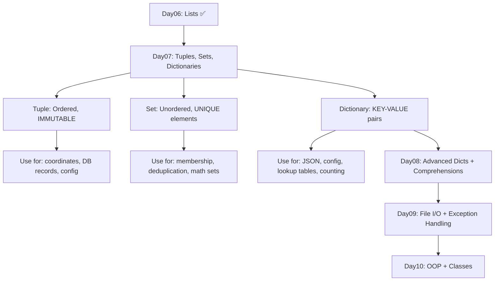

# 🐍 Day 06 — Python Lists: Complete Mastery

> **30-Day Python Mastery Challenge** | Day 06 of 30  
> **Track:** LLM Engineering → AI Research  
> **Difficulty:** Beginner → Advanced  
> **Estimated Time:** 8–10 Hours  

---

```
██████╗  █████╗ ██╗   ██╗     ██████╗ ██████╗
██╔══██╗██╔══██╗╚██╗ ██╔╝    ██╔═████╗██╔════╝
██║  ██║███████║ ╚████╔╝     ██║██╔██║███████╗
██║  ██║██╔══██║  ╚██╔╝      ████╔╝██║██╔═══██╗
██████╔╝██║  ██║   ██║       ╚██████╔╝╚██████╔╝
╚═════╝ ╚═╝  ╚═╝   ╚═╝        ╚═════╝  ╚═════╝

PYTHON LISTS — COMPLETE MASTERY DOCUMENT
```

---

## 📋 Table of Contents

| # | Section | Topics |
|---|---------|--------|
| 1 | [Complete Revision](#section-1) | Day01–Day05 Summary |
| 2 | [Introduction to Lists](#section-2) | Concept, Why Lists, Real World |
| 3 | [List Creation Masterclass](#section-3) | All Creation Patterns |
| 4 | [List Indexing](#section-4) | Positive, Negative Indexing |
| 5 | [List Slicing Masterclass](#section-5) | start:stop:step |
| 6 | [List Mutability](#section-6) | References, Aliasing, Copying |
| 7 | [List Methods Masterclass](#section-7) | All 11 Methods |
| 8 | [List Operations](#section-8) | Concat, Repeat, Membership |
| 9 | [Looping Through Lists](#section-9) | for, while, enumerate, zip |
| 10 | [Nested Lists Masterclass](#section-10) | 2D Lists, Matrix |
| 11 | [List Comprehensions](#section-11) | Basic → Nested |
| 12 | [List Algorithms](#section-12) | Search, Sort, Rotate, Merge |
| 13 | [Problem Solving Techniques](#section-13) | Dry Run, Patterns |
| 14 | [Memory Model of Lists](#section-14) | References, GC |
| 15 | [Time Complexity](#section-15) | Big-O Analysis |
| 16 | [Debugging Lists](#section-16) | Errors & Fixes |
| 17 | [Best Practices](#section-17) | PEP8, Pythonic Code |
| 18 | [10 Mini Projects](#section-18) | Complete Code |
| 19 | [15 Big Portfolio Projects](#section-19) | Architecture & Design |
| 20 | [Project Solution Techniques](#section-20) | Professional Approach |
| 21 | [350 Practice Questions](#section-21) | Easy/Medium/Hard |
| 22 | [150 Interview Questions](#section-22) | With Answers |
| 23 | [Assignments](#section-23) | With Solutions |
| 24 | [Challenge Projects](#section-24) | Advanced Builds |
| 25 | [Day06 Revision](#section-25) | Cheat Sheets |
| 26 | [Preparation for Day07](#section-26) | Tuples, Sets, Dicts |

---

<a id="section-1"></a>
## 📚 SECTION 1 — Complete Revision (Day01–Day05)

### 🗺️ Learning Journey Mind Map

```
                    ┌─────────────────────────────┐
                    │    PYTHON MASTERY JOURNEY   │
                    └──────────────┬──────────────┘
                                   │
        ┌──────────────────────────┼──────────────────────────┐
        │                          │                          │
   ┌────▼────┐               ┌────▼────┐                ┌────▼────┐
   │  DATA   │               │  FLOW   │                │  CODE   │
   │  (D1-2) │               │ (D3-4)  │                │  (D5)   │
   └────┬────┘               └────┬────┘                └────┬────┘
        │                         │                           │
   ┌────▼────────────────┐  ┌────▼───────────────┐  ┌───────▼──────────┐
   │ • Variables         │  │ • if/elif/else     │  │ • def functions  │
   │ • Data Types        │  │ • Comparison ops   │  │ • Parameters     │
   │ • Strings           │  │ • for loops        │  │ • Return values  │
   │ • Numbers           │  │ • while loops      │  │ • Scope (LEGB)   │
   │ • Booleans          │  │ • Nested loops     │  │ • Recursion      │
   │ • Operators         │  │ • Pattern printing │  │ • Lambda         │
   └─────────────────────┘  └────────────────────┘  └──────────────────┘
```

---

### 📋 Day 01 Summary — Python Fundamentals + Operators

| Topic | Key Points |
|-------|------------|
| Variables | Dynamic typing, snake_case naming |
| Data Types | int, float, str, bool, None |
| Arithmetic | `+`, `-`, `*`, `/`, `//`, `%`, `**` |
| Comparison | `==`, `!=`, `<`, `>`, `<=`, `>=` |
| Logical | `and`, `or`, `not` |
| Type Casting | `int()`, `float()`, `str()`, `bool()` |
| Input/Output | `input()`, `print()`, f-strings |

```python
# Day01 Quick Recap
name = "Baghel"               # str
age = 20                       # int
gpa = 8.5                      # float
is_active = True               # bool
result = age * 2 + 10          # operators
print(f"Name: {name}, Age: {age}")
```

---

### 📋 Day 02 Summary — Strings + Input Handling + Memory Model

| Topic | Key Points |
|-------|------------|
| String Creation | Single, Double, Triple quotes |
| Indexing | `s[0]`, `s[-1]` |
| Slicing | `s[start:stop:step]` |
| String Methods | `.upper()`, `.lower()`, `.strip()`, `.split()`, `.join()`, `.replace()` |
| f-Strings | `f"Hello {name}"` |
| Memory Model | String interning, immutability |

```python
# Day02 Quick Recap
text = "Python Programming"
print(text.upper())          # PYTHON PROGRAMMING
print(text[0:6])             # Python
print(text.split())          # ['Python', 'Programming']
words = ["AI", "ML", "DL"]
print(", ".join(words))      # AI, ML, DL
```

---

### 📋 Day 03 Summary — Conditional Statements

| Topic | Key Points |
|-------|------------|
| if | Single condition check |
| if-else | Binary decision |
| if-elif-else | Multi-way branching |
| Nested if | Condition inside condition |
| Ternary | `x if cond else y` |
| match-case | Python 3.10+ pattern matching |

```python
# Day03 Quick Recap
marks = 85
if marks >= 90:
    grade = "A+"
elif marks >= 80:
    grade = "A"
elif marks >= 70:
    grade = "B"
else:
    grade = "C"

# Ternary
status = "Pass" if marks >= 40 else "Fail"
```

---

### 📋 Day 04 Summary — Loops + Pattern Printing

| Topic | Key Points |
|-------|------------|
| for loop | Iterate over sequence |
| while loop | Condition-based iteration |
| range() | `range(start, stop, step)` |
| break | Exit loop early |
| continue | Skip current iteration |
| pass | Placeholder |
| Nested loops | Loop inside loop |
| Pattern printing | Stars, numbers, pyramids |

```python
# Day04 Quick Recap
for i in range(1, 6):
    print("*" * i)       # Triangle pattern

n, count = 10, 0
while n > 0:
    n //= 2
    count += 1
print(f"Bits needed: {count}")
```

---

### 📋 Day 05 Summary — Functions + Scope + Recursion

| Topic | Key Points |
|-------|------------|
| def | Define function |
| Parameters | Positional, Keyword, Default, `*args`, `**kwargs` |
| Return | Single/multiple values |
| Scope | LEGB Rule (Local→Enclosing→Global→Built-in) |
| Lambda | Anonymous functions |
| Recursion | Function calling itself + base case |
| Docstrings | `"""Description"""` |
| Higher-order | `map()`, `filter()`, `reduce()` |

```python
# Day05 Quick Recap
def factorial(n):
    """Compute n! recursively."""
    if n <= 1: return 1
    return n * factorial(n - 1)

# Lambda
square = lambda x: x ** 2

# *args
def total(*nums):
    return sum(nums)

print(factorial(5))   # 120
print(square(7))      # 49
print(total(1,2,3,4)) # 10
```

---

### 🃏 Function Cheat Sheet

```
┌─────────────────────────────────────────────────────┐
│              FUNCTION QUICK REFERENCE               │
├──────────────────────────┬──────────────────────────┤
│ def func(a, b):          │ Positional params        │
│ def func(a, b=10):       │ Default param            │
│ def func(*args):         │ Variable positional      │
│ def func(**kwargs):      │ Variable keyword         │
│ lambda x: x*2            │ Anonymous function       │
│ return x, y              │ Multiple return          │
│ global x                 │ Modify global            │
│ nonlocal x               │ Modify enclosing         │
└──────────────────────────┴──────────────────────────┘
```

---

<a id="section-2"></a>
## 🗂️ SECTION 2 — Introduction to Lists

### 2.1 What is a List?

A **List** is Python's most versatile, ordered, mutable, heterogeneous collection data structure. It stores multiple items in a single variable, maintaining insertion order and allowing duplicates.

```
┌─────────────────────────────────────────────────────────────────┐
│                        PYTHON LIST                              │
│                                                                 │
│  Index:  [0]    [1]    [2]    [3]    [4]                        │
│        ┌─────┬──────┬──────┬──────┬──────┐                      │
│  Data: │  1  │  "AI"│  3.14│ True │ None │                      │
│        └─────┴──────┴──────┴──────┴──────┘                      │
│  Index: [-5]  [-4]   [-3]   [-2]   [-1]                         │
│                                                                 │
│  • Ordered       → Items maintain position                      │
│  • Mutable       → Can change after creation                    │
│  • Heterogeneous → Different data types allowed                 │
│  • Duplicates    → Same values can appear multiple times        │
│  • Dynamic       → Size grows/shrinks at runtime                │
└─────────────────────────────────────────────────────────────────┘
```

### 2.2 Why Lists Exist — The Problem They Solve

**Without Lists (Problem):**
```python
# Storing 100 student names WITHOUT lists — NIGHTMARE
student1 = "Aarav"
student2 = "Baghel"
student3 = "Chandra"
# ... student100 = ???  ← Impossible to manage
```

**With Lists (Solution):**
```python
# Storing 100 student names WITH lists — ELEGANT
students = ["Aarav", "Baghel", "Chandra", ...]
print(f"Total students: {len(students)}")
```

### 2.3 Real-World Analogies

```
┌──────────────────┬─────────────────────────────────────┐
│  Real World      │  Python List Equivalent             │
├──────────────────┼─────────────────────────────────────┤
│ Shopping Cart    │ cart = ["milk", "bread", "eggs"]    │
│ Student Roll     │ roll = ["Arjun", "Priya", "Dev"]    │
│ Playlist         │ songs = ["Song1", "Song2", "Song3"] │
│ AI Training Data │ dataset = [sample1, sample2, ...]   │
│ Browser History  │ history = [url1, url2, url3]        │
│ Task Queue       │ tasks = ["task1", "task2", "task3"] │
│ Inventory        │ items = [{"id":1, "qty":100}, ...]  │
└──────────────────┴─────────────────────────────────────┘
```

### 2.4 Dynamic Array — How Lists Work Internally

```
┌─────────────────────────────────────────────────────────────────┐
│                    DYNAMIC ARRAY GROWTH                         │
│                                                                 │
│  Initial:  [■][■][■][■][ ][ ][ ][ ]  ← capacity=8, size=4       │
│                                                                 │
│  append(): [■][■][■][■][■][ ][ ][ ]  ← capacity=8, size=5       │
│                                                                 │
│  When full: Python allocates NEW bigger array, copies data      │
│  New array: [■][■][■][■][■][■][■][■][■][ ][ ][ ][ ][ ][ ][ ]    │
│                               ← capacity=16, size=9             │
│                                                                 │
│  Growth factor ≈ 1.125× (CPython implementation)                │
└─────────────────────────────────────────────────────────────────┘
```

> 💡 **Memory Trick:** Think of a List as a **magic backpack** — you can put anything inside, it's always ordered front-to-back, and it can expand automatically.

---

<a id="section-3"></a>
## 🏗️ SECTION 3 — List Creation Masterclass

### 3.1 All Ways to Create a List

```python
# ─── METHOD 1: Square Bracket Literal ─────────────────────────
empty     = []
numbers   = [1, 2, 3, 4, 5]
names     = ["Alice", "Bob", "Charlie"]
mixed     = [1, "Python", 3.14, True, None]

# ─── METHOD 2: list() Constructor ──────────────────────────────
from_str    = list("Python")       # ['P','y','t','h','o','n']
from_range  = list(range(1, 11))   # [1,2,3,4,5,6,7,8,9,10]
from_tuple  = list((1, 2, 3))      # [1,2,3]

# ─── METHOD 3: List Comprehension ──────────────────────────────
squares   = [x**2 for x in range(10)]
evens     = [x for x in range(20) if x % 2 == 0]

# ─── METHOD 4: Multiplication / Repetition ─────────────────────
zeros     = [0] * 5              # [0, 0, 0, 0, 0]
template  = [None] * 10          # [None]*10 — placeholder

# ─── METHOD 5: Nested Lists ────────────────────────────────────
matrix    = [[1,2,3], [4,5,6], [7,8,9]]
table     = [[0]*3 for _ in range(3)]   # Safe 2D grid creation

# ─── METHOD 6: Splitting a String ──────────────────────────────
sentence  = "the quick brown fox"
words     = sentence.split()     # ['the','quick','brown','fox']
csv_data  = "10,20,30".split(",") # ['10','20','30']
```

### 3.2 Single-Item Lists (Common Gotcha)

```python
# ⚠️ CAREFUL — This is NOT a list of one element:
not_a_list = (1)     # This is just the integer 1

# ✅ Correct single-element list:
single = [1]
single_str = ["hello"]
print(type(single))   # <class 'list'>
print(len(single))    # 1
```

### 3.3 Memory Concept During Creation

```
Memory at: list = [10, 20, 30]

    Stack                     Heap
  ┌────────┐              ┌─────────────────────────────┐
  │  list  │──────────►   │  PyListObject               │
  │ (name) │              │ ┌──────┬──────┬──────┐      │
  └────────┘              │ │ &int │ &int │ &int │      │
                          │ └──┬───┴──┬───┴──┬───┘      │
                          └───┼──────┼──────┼───────────┘
                              ▼      ▼      ▼
                           [10]   [20]   [30]   ← PyIntObjects
```

> **Key Insight:** A list stores **references (pointers)** to objects, NOT the objects themselves. This is crucial for understanding aliasing!

---

<a id="section-4"></a>
## 🔢 SECTION 4 — List Indexing

### 4.1 Positive and Negative Indexing

```python
fruits = ["apple", "banana", "cherry", "date", "elderberry"]
#          [0]       [1]        [2]      [3]       [4]
#          [-5]      [-4]       [-3]     [-2]      [-1]
```

```
┌─────────────────────────────────────────────────────────────────┐
│                      INDEX VISUALIZATION                        │
│                                                                 │
│   Positive →   0       1       2       3       4                │
│              ┌─────┬───────┬────────┬──────┬───────────┐        │
│              │apple│banana │cherry  │ date │elderberry │        │
│              └─────┴───────┴────────┴──────┴───────────┘        │
│   Negative → -5      -4      -3      -2       -1                │
│                                                                 │
│   Rule: negative_index = positive_index - len(list)             │
└─────────────────────────────────────────────────────────────────┘
```

```python
# Positive indexing
print(fruits[0])    # apple
print(fruits[2])    # cherry
print(fruits[4])    # elderberry

# Negative indexing
print(fruits[-1])   # elderberry   ← last item
print(fruits[-2])   # date
print(fruits[-5])   # apple        ← same as fruits[0]

# Common use cases
first  = fruits[0]     # First element
last   = fruits[-1]    # Last element  ← VERY Pythonic
second_last = fruits[-2]
```

### 4.2 IndexError — The Beginner Trap

```python
fruits = ["apple", "banana", "cherry"]

# ❌ IndexError: list index out of range
# print(fruits[3])
# print(fruits[-4])

# ✅ Safe indexing
idx = 3
if 0 <= idx < len(fruits):
    print(fruits[idx])
else:
    print("Index out of bounds!")
```

> 💡 **Memory Trick for Negative Indexing:**  
> Think of `-1` as "start from the back". `-1` = last, `-2` = second from last.  
> Formula: `fruits[-1]` ≡ `fruits[len(fruits)-1]`

---

<a id="section-5"></a>
## ✂️ SECTION 5 — List Slicing Masterclass

### 5.1 The Slicing Syntax

```
list[start : stop : step]
      │        │      │
      │        │      └── How many positions to jump (default=1)
      │        └───────── Stop BEFORE this index (exclusive)
      └────────────────── Start FROM this index (inclusive)
```

```python
nums = [0, 1, 2, 3, 4, 5, 6, 7, 8, 9]

# ─── BASIC SLICING ─────────────────────────────────────────────
print(nums[2:5])      # [2, 3, 4]       → indices 2,3,4
print(nums[:4])       # [0, 1, 2, 3]    → start defaults to 0
print(nums[6:])       # [6, 7, 8, 9]    → stop defaults to end
print(nums[:])        # [0,1,2,3,4,5,6,7,8,9]  → full copy!

# ─── STEP SLICING ──────────────────────────────────────────────
print(nums[::2])      # [0, 2, 4, 6, 8]     → every 2nd
print(nums[1::2])     # [1, 3, 5, 7, 9]     → every 2nd from 1
print(nums[::3])      # [0, 3, 6, 9]        → every 3rd

# ─── REVERSE SLICING ───────────────────────────────────────────
print(nums[::-1])     # [9,8,7,6,5,4,3,2,1,0]  → reverse!
print(nums[7:2:-1])   # [7, 6, 5, 4, 3]    → reverse subset
print(nums[-1:-6:-1]) # [9, 8, 7, 6, 5]    → negative steps

# ─── PRACTICAL APPLICATIONS ────────────────────────────────────
data = [10, 20, 30, 40, 50, 60, 70, 80, 90, 100]

first_half  = data[:len(data)//2]   # [10,20,30,40,50]
second_half = data[len(data)//2:]   # [60,70,80,90,100]
every_other = data[::2]             # [10,30,50,70,90]
reversed_d  = data[::-1]            # [100,90,...,10]

# AI Use Case: Get last N training samples
last_100_samples = dataset[-100:]
# Get every 5th sample for validation
validation = dataset[::5]
```

### 5.2 Slicing vs Indexing — Key Difference

| Feature | Indexing `list[i]` | Slicing `list[i:j]` |
|---------|---------------------|----------------------|
| Returns | Single element | New list |
| Out of range | `IndexError` | No error (returns `[]`) |
| Modifies original? | Assigns one item | Assigns a sublist |

```python
nums = [1, 2, 3, 4, 5]
# Slicing NEVER raises IndexError
print(nums[100:200])   # []  ← empty, no error!
print(nums[-100:2])    # [1, 2]  ← clamped to valid range
```

### 5.3 Using Slices to Copy Lists

```python
original = [1, 2, 3, 4, 5]

# Method 1: Slice copy (shallow)
copy1 = original[:]

# Method 2: list() constructor
copy2 = list(original)

# Method 3: copy() method
copy3 = original.copy()

# Modifying copy doesn't affect original (for simple values)
copy1.append(99)
print(original)   # [1, 2, 3, 4, 5]  ← unchanged
print(copy1)      # [1, 2, 3, 4, 5, 99]
```

> ⚠️ **Warning:** All three methods above are **shallow copies**. For nested lists, use `copy.deepcopy()` — covered in Section 6.

---

<a id="section-6"></a>
## 🔗 SECTION 6 — List Mutability Deep Dive

### 6.1 Mutable Objects — The Core Concept

```
┌─────────────────────────────────────────────────────────────────┐
│               MUTABLE vs IMMUTABLE                              │
│                                                                 │
│  IMMUTABLE (str, int, tuple)    │  MUTABLE (list, dict, set)    │
│  ─────────────────────────────  │  ───────────────────────────  │
│  Cannot change after creation   │  Can change after creation    │
│  New object created on change   │  Same object modified         │
│                                 │                               │
│  x = "hello"                    │  lst = [1, 2, 3]              │
│  y = x                          │  lst2 = lst                   │
│  y += " world"                  │  lst2.append(4)               │
│  x → "hello"  (unchanged)       │  lst → [1,2,3,4] (changed!)   │
└─────────────────────────────────────────────────────────────────┘
```

### 6.2 Aliasing — The Most Common Bug

```python
# ─── ALIASING TRAP ─────────────────────────────────────────────
a = [1, 2, 3]
b = a           # ← b is an ALIAS, NOT a copy!

b.append(4)
print(a)        # [1, 2, 3, 4]  ← a was ALSO modified!
print(b)        # [1, 2, 3, 4]
print(a is b)   # True  ← Same object in memory!
```

```
Memory Diagram — Aliasing:

    Stack           Heap
  ┌──────┐        ┌─────────────────────────┐
  │  a   │────┐   │  PyListObject           │
  └──────┘    └──►│  [1] [2] [3] [4]        │
  ┌──────┐    ┌──►│                         │
  │  b   │────┘   └─────────────────────────┘
  └──────┘
  Both a and b point to the SAME list object!
```

### 6.3 Shallow Copy vs Deep Copy

```python
import copy

# SHALLOW COPY — New list, but nested objects are shared
original = [[1, 2], [3, 4], [5, 6]]
shallow  = original.copy()         # or original[:]

shallow[0].append(99)
print(original)  # [[1, 2, 99], [3, 4], [5, 6]]  ← affected!
print(shallow)   # [[1, 2, 99], [3, 4], [5, 6]]

# DEEP COPY — Completely independent copy
original2 = [[1, 2], [3, 4], [5, 6]]
deep      = copy.deepcopy(original2)

deep[0].append(99)
print(original2)  # [[1, 2], [3, 4], [5, 6]]     ← unchanged!
print(deep)       # [[1, 2, 99], [3, 4], [5, 6]]
```

```
Shallow Copy Memory:
  original  ──►  [ptr1][ptr2][ptr3]
  shallow   ──►  [ptr1][ptr2][ptr3]   ← DIFFERENT list frame
                    │     │     │
                  [1,2] [3,4] [5,6]   ← SAME nested objects!

Deep Copy Memory:
  original  ──►  [ptr1][ptr2][ptr3]
  deep      ──►  [PTR1][PTR2][PTR3]   ← DIFFERENT frames
                    │     │     │
                 [1,2] [3,4] [5,6]    ← DIFFERENT nested objects!
```

> 💡 **Rule of Thumb:**
> - Simple list (no nesting) → use `.copy()` or `[:]`
> - Nested list / objects → always use `copy.deepcopy()`

---

<a id="section-7"></a>
## 🛠️ SECTION 7 — List Methods Masterclass

### 7.0 Methods Overview

```
┌────────────────────────────────────────────────────────────────┐
│                   LIST METHODS AT A GLANCE                     │
├──────────────────┬──────────────────┬──────────────────────────┤
│  ADDING          │  REMOVING        │  INFO / UTILITY          │
├──────────────────┼──────────────────┼──────────────────────────┤
│  append(item)    │  remove(item)    │  index(item)             │
│  extend(iterable)│  pop(index)      │  count(item)             │
│  insert(i, item) │  clear()         │  sort()                  │
│                  │                  │  reverse()               │
│                  │                  │  copy()                  │
└──────────────────┴──────────────────┴──────────────────────────┘
```

---

### 7.1 `append()` — Add One Item to End

```python
# Theory: Adds a single element to the END of the list
# Time Complexity: O(1) amortized (occasionally O(n) for resize)
# Mutates: YES

fruits = ["apple", "banana"]

fruits.append("cherry")
print(fruits)    # ['apple', 'banana', 'cherry']

fruits.append([1, 2])   # ← appends the LIST as ONE element
print(fruits)    # ['apple', 'banana', 'cherry', [1, 2]]
print(len(fruits))  # 4
```

```
Before: [apple][banana]
append("cherry")
After:  [apple][banana][cherry]
```

**Use Cases:** Building lists dynamically, collecting results, streaming data.

---

### 7.2 `extend()` — Add Multiple Items

```python
# Theory: Adds ALL elements of an iterable to the end
# Time Complexity: O(k) where k = len(iterable)
# Mutates: YES

a = [1, 2, 3]
b = [4, 5, 6]

a.extend(b)
print(a)    # [1, 2, 3, 4, 5, 6]
print(b)    # [4, 5, 6]           ← b is unchanged

# extend vs append difference
c = [1, 2, 3]
c.append([4, 5])    # → [1, 2, 3, [4, 5]]   ← nested!
d = [1, 2, 3]
d.extend([4, 5])    # → [1, 2, 3, 4, 5]     ← flat!

# extend from any iterable
nums = [1, 2, 3]
nums.extend(range(4, 8))         # [1,2,3,4,5,6,7]
nums.extend("abc")               # [1,2,3,4,5,6,7,'a','b','c']
```

---

### 7.3 `insert()` — Add Item at Specific Position

```python
# Theory: Inserts item BEFORE the given index
# Time Complexity: O(n) — must shift elements
# Mutates: YES

nums = [10, 20, 30, 40]

nums.insert(2, 25)
print(nums)   # [10, 20, 25, 30, 40]

nums.insert(0, 5)      # Insert at beginning
print(nums)   # [5, 10, 20, 25, 30, 40]

nums.insert(100, 99)   # Index > len → appended at end
print(nums)   # [5, 10, 20, 25, 30, 40, 99]

nums.insert(-1, 98)    # Insert before last element
print(nums)   # [5, 10, 20, 25, 30, 40, 98, 99]
```

---

### 7.4 `remove()` — Remove First Occurrence by Value

```python
# Theory: Removes the FIRST occurrence of specified value
# Time Complexity: O(n) — must search then shift
# Mutates: YES
# Raises: ValueError if item not found

fruits = ["apple", "banana", "cherry", "banana"]

fruits.remove("banana")
print(fruits)   # ['apple', 'cherry', 'banana']  ← first "banana" removed

# Safe removal with check
item = "mango"
if item in fruits:
    fruits.remove(item)
else:
    print(f"'{item}' not in list")
```

---

### 7.5 `pop()` — Remove and Return Item

```python
# Theory: Removes and RETURNS item at index (default: last)
# Time Complexity: O(1) for last, O(n) for arbitrary index
# Mutates: YES
# Raises: IndexError if list empty or index out of range

stack = [1, 2, 3, 4, 5]

last = stack.pop()       # Remove last → 5
print(last)    # 5
print(stack)   # [1, 2, 3, 4]

first = stack.pop(0)     # Remove first → 1
print(first)   # 1
print(stack)   # [2, 3, 4]

mid = stack.pop(1)       # Remove index 1 → 3
print(mid)     # 3
print(stack)   # [2, 4]

# ─── STACK implementation using pop() ──────────────────────────
stack_data = []
stack_data.append("task1")
stack_data.append("task2")
stack_data.append("task3")
print(stack_data.pop())  # "task3"  ← LIFO
```

---

### 7.6 `clear()` — Empty the List

```python
# Theory: Removes ALL items. List still exists, just empty.
# Time Complexity: O(n)
# Mutates: YES

data = [1, 2, 3, 4, 5, 6, 7, 8, 9]
data.clear()
print(data)      # []
print(len(data)) # 0

# Note: clear() vs reassigning
data = [1,2,3]
data.clear()     # Same object, now empty
data = []        # NEW empty list object (old is garbage collected)
```

---

### 7.7 `index()` — Find Position of Item

```python
# Theory: Returns index of FIRST occurrence
# Time Complexity: O(n)
# Raises: ValueError if not found

colors = ["red", "green", "blue", "green", "yellow"]

pos = colors.index("green")
print(pos)   # 1  ← first occurrence

# Search in a range: index(value, start, stop)
pos2 = colors.index("green", 2, 5)
print(pos2)  # 3  ← first occurrence after index 2

# Safe usage
try:
    pos3 = colors.index("purple")
except ValueError:
    print("Color not found!")
```

---

### 7.8 `count()` — Count Occurrences

```python
# Theory: Returns count of how many times value appears
# Time Complexity: O(n)

votes = ["yes","no","yes","yes","no","abstain","yes"]

print(votes.count("yes"))      # 4
print(votes.count("no"))       # 2
print(votes.count("abstain"))  # 1
print(votes.count("maybe"))    # 0 ← no error, returns 0

# AI use case: class distribution
labels = [0,1,0,1,1,0,2,2,1,0,0,1]
for cls in set(labels):
    print(f"Class {cls}: {labels.count(cls)} samples")
```

---

### 7.9 `sort()` — Sort In-Place

```python
# Theory: Sorts the list IN PLACE (modifies original)
# Algorithm: Timsort (hybrid merge+insertion sort)
# Time Complexity: O(n log n) average and worst
# Mutates: YES
# Returns: None

nums = [64, 25, 12, 22, 11]
nums.sort()
print(nums)               # [11, 12, 22, 25, 64]  ascending

nums.sort(reverse=True)
print(nums)               # [64, 25, 22, 12, 11]  descending

# Sorting strings
words = ["banana", "Apple", "cherry", "date"]
words.sort()
print(words)   # ['Apple', 'banana', 'cherry', 'date'] case-sensitive!

words.sort(key=str.lower)
print(words)   # ['Apple', 'banana', 'cherry', 'date'] case-insensitive

# Key function for custom sort
students = [("Alice", 90), ("Bob", 75), ("Charlie", 88)]
students.sort(key=lambda s: s[1])          # sort by marks
students.sort(key=lambda s: s[1], reverse=True)  # descending

# sort() vs sorted()
original = [3, 1, 4, 1, 5]
sorted_copy = sorted(original)    # Returns new list, doesn't modify
original.sort()                   # Modifies original, returns None
```

---

### 7.10 `reverse()` — Reverse In-Place

```python
# Theory: Reverses elements IN PLACE
# Time Complexity: O(n)
# Mutates: YES
# Returns: None

data = [1, 2, 3, 4, 5]
data.reverse()
print(data)   # [5, 4, 3, 2, 1]

# reverse() vs [::-1]
a = [1,2,3,4,5]
a.reverse()        # modifies a in-place
b = [1,2,3,4,5]
c = b[::-1]        # creates a new reversed list, b unchanged
```

---

### 7.11 `copy()` — Shallow Copy

```python
# Theory: Returns a shallow copy of the list
# Time Complexity: O(n)
# Mutates: NO (creates new list)

original = [1, 2, 3, 4, 5]
copied   = original.copy()

copied.append(99)
print(original)  # [1, 2, 3, 4, 5]   ← unchanged
print(copied)    # [1, 2, 3, 4, 5, 99]
```

### 7.12 Methods Summary Table

| Method | Adds | Removes | Returns | Mutates | Complexity |
|--------|------|---------|---------|---------|------------|
| `append(x)` | 1 item end | — | None | ✅ | O(1) |
| `extend(iter)` | many end | — | None | ✅ | O(k) |
| `insert(i, x)` | 1 at pos | — | None | ✅ | O(n) |
| `remove(x)` | — | first val | None | ✅ | O(n) |
| `pop(i)` | — | by index | item | ✅ | O(1)†/O(n) |
| `clear()` | — | all | None | ✅ | O(n) |
| `index(x)` | — | — | index | ❌ | O(n) |
| `count(x)` | — | — | count | ❌ | O(n) |
| `sort()` | — | — | None | ✅ | O(n log n) |
| `reverse()` | — | — | None | ✅ | O(n) |
| `copy()` | — | — | list | ❌ | O(n) |

† `pop()` from last index is O(1), from arbitrary index is O(n)

---

<a id="section-8"></a>
## ⚙️ SECTION 8 — List Operations

### 8.1 Concatenation — `+`

```python
list1 = [1, 2, 3]
list2 = [4, 5, 6]
result = list1 + list2
print(result)   # [1, 2, 3, 4, 5, 6]
# Note: Creates a NEW list (unlike extend)
```

### 8.2 Repetition — `*`

```python
zeros    = [0] * 5            # [0, 0, 0, 0, 0]
template = ["?"] * 3          # ['?', '?', '?']
print([1, 2] * 3)             # [1, 2, 1, 2, 1, 2]
```

### 8.3 Membership — `in`, `not in`

```python
fruits = ["apple", "banana", "cherry"]
print("banana" in fruits)       # True
print("mango" in fruits)        # False
print("mango" not in fruits)    # True
```

### 8.4 Comparison

```python
a = [1, 2, 3]
b = [1, 2, 3]
c = [1, 2, 4]
print(a == b)    # True   (element-wise)
print(a is b)    # False  (different objects)
print(a < c)     # True   (lexicographic)
print(a != c)    # True
```

### 8.5 Built-in Functions on Lists

```python
nums = [3, 1, 4, 1, 5, 9, 2, 6, 5, 3]

print(len(nums))          # 10
print(min(nums))          # 1
print(max(nums))          # 9
print(sum(nums))          # 39
print(sorted(nums))       # [1,1,2,3,3,4,5,5,6,9]
print(list(reversed(nums)))  # [3,5,6,2,9,5,1,4,1,3]
print(sum(nums)/len(nums))   # 3.9  ← average

# enumerate: get index + value together
for idx, val in enumerate(nums):
    print(f"[{idx}] = {val}")

# zip: pair two lists
names  = ["Alice", "Bob", "Charlie"]
scores = [90, 75, 88]
for name, score in zip(names, scores):
    print(f"{name}: {score}")

# any / all
values = [True, True, False]
print(any(values))    # True   (at least one True)
print(all(values))    # False  (not all True)
```

---

<a id="section-9"></a>
## 🔄 SECTION 9 — Looping Through Lists

### 9.1 All Traversal Patterns

```python
fruits = ["apple", "banana", "cherry", "date"]

# ─── PATTERN 1: Value-based (most common) ──────────────────────
for fruit in fruits:
    print(fruit)

# ─── PATTERN 2: Index-based ────────────────────────────────────
for i in range(len(fruits)):
    print(f"[{i}] {fruits[i]}")

# ─── PATTERN 3: enumerate (index + value) ──────────────────────
for i, fruit in enumerate(fruits):
    print(f"[{i}] {fruit}")

# Start from custom index
for i, fruit in enumerate(fruits, start=1):
    print(f"{i}. {fruit}")

# ─── PATTERN 4: while loop ─────────────────────────────────────
i = 0
while i < len(fruits):
    print(fruits[i])
    i += 1

# ─── PATTERN 5: zip (parallel traversal) ───────────────────────
names  = ["Alice", "Bob", "Charlie"]
marks  = [90, 85, 92]
grades = ["A", "B", "A+"]

for name, mark, grade in zip(names, marks, grades):
    print(f"{name}: {mark} ({grade})")

# ─── PATTERN 6: reversed traversal ────────────────────────────
for fruit in reversed(fruits):
    print(fruit)

# ─── PATTERN 7: List comprehension style ───────────────────────
upper_fruits = [f.upper() for f in fruits]
```

### 9.2 Modifying While Iterating — The Trap

```python
# ❌ DANGEROUS: Modifying list while iterating
nums = [1, 2, 3, 4, 5, 6]
for n in nums:
    if n % 2 == 0:
        nums.remove(n)    # Skips elements!
print(nums)   # [1, 3, 5] — WRONG in some cases!

# ✅ SAFE: Iterate over a copy
for n in nums[:]:
    if n % 2 == 0:
        nums.remove(n)

# ✅ BETTER: Use list comprehension
nums = [1, 2, 3, 4, 5, 6]
nums = [n for n in nums if n % 2 != 0]
print(nums)   # [1, 3, 5]  — correct!
```

---

<a id="section-10"></a>
## 🔲 SECTION 10 — Nested Lists Masterclass

### 10.1 Creating 2D Lists (Matrices)

```python
# ─── 2D List (Matrix) ──────────────────────────────────────────
matrix = [
    [1, 2, 3],
    [4, 5, 6],
    [7, 8, 9]
]

# Access: matrix[row][col]
print(matrix[0][0])   # 1  (top-left)
print(matrix[1][2])   # 6
print(matrix[2][2])   # 9  (bottom-right)
print(matrix[-1][-1]) # 9  (same, using negative)

# ─── Visualization ─────────────────────────────────────────────
#        col0  col1  col2
# row0: [  1 ][  2 ][  3 ]
# row1: [  4 ][  5 ][  6 ]
# row2: [  7 ][  8 ][  9 ]
```

### 10.2 Creating Safe 2D Lists

```python
# ⚠️ TRAP: Using multiplication for 2D lists
ROWS, COLS = 3, 3

# WRONG WAY (aliasing bug!)
matrix_bad = [[0] * COLS] * ROWS
matrix_bad[0][0] = 99
print(matrix_bad)
# [[99,0,0],[99,0,0],[99,0,0]]  ← All rows are the same object!

# ✅ CORRECT WAY (list comprehension)
matrix_good = [[0] * COLS for _ in range(ROWS)]
matrix_good[0][0] = 99
print(matrix_good)
# [[99,0,0],[0,0,0],[0,0,0]]  ← Only first row changed!
```

### 10.3 Traversing Nested Lists

```python
matrix = [[1,2,3], [4,5,6], [7,8,9]]

# ─── Traverse all elements ─────────────────────────────────────
for row in matrix:
    for item in row:
        print(item, end=" ")
    print()

# ─── Traverse with indices ─────────────────────────────────────
for i, row in enumerate(matrix):
    for j, val in enumerate(row):
        print(f"matrix[{i}][{j}] = {val}")

# ─── Row-wise operations ───────────────────────────────────────
row_sums = [sum(row) for row in matrix]
print(row_sums)   # [6, 15, 24]

# ─── Column-wise operations ────────────────────────────────────
cols = len(matrix[0])
col_sums = [sum(matrix[r][c] for r in range(len(matrix))) for c in range(cols)]
print(col_sums)   # [12, 15, 18]

# ─── Matrix Transpose ──────────────────────────────────────────
transposed = [[matrix[r][c] for r in range(3)] for c in range(3)]
# OR more Pythonic:
transposed = list(map(list, zip(*matrix)))
```

### 10.4 Real-World Matrix Applications

```python
# Seating Chart
cinema = [
    ["[A1]", "[A2]", "[A3]", "[A4]"],
    ["[B1]", "[B2]", "[B3]", "[B4]"],
    ["[C1]", "[C2]", "[C3]", "[C4]"],
]
print(cinema[1][2])  # [B3]

# Marks Sheet
marks_sheet = {
    "Alice":   [85, 90, 92, 88, 95],
    "Bob":     [70, 75, 80, 65, 78],
    "Charlie": [95, 92, 98, 94, 96],
}
for student, marks in marks_sheet.items():
    avg = sum(marks)/len(marks)
    print(f"{student}: avg = {avg:.1f}")
```

---

<a id="section-11"></a>
## ⚡ SECTION 11 — List Comprehensions Masterclass

### 11.1 The Comprehension Formula

```
new_list = [expression for item in iterable if condition]
            ─────────── ───────────────────── ──────────
            Transform   Source iteration      Filter (optional)
```

### 11.2 Basic to Advanced Examples

```python
nums = [1, 2, 3, 4, 5, 6, 7, 8, 9, 10]

# ─── LEVEL 1: Basic Transform ──────────────────────────────────
squares   = [x**2 for x in nums]
cubes     = [x**3 for x in nums]
doubled   = [x*2  for x in nums]

# ─── LEVEL 2: With Filter ──────────────────────────────────────
evens     = [x for x in nums if x % 2 == 0]
odds      = [x for x in nums if x % 2 != 0]
big_nums  = [x for x in nums if x > 5]

# ─── LEVEL 3: Transform + Filter ──────────────────────────────
even_sq   = [x**2 for x in nums if x % 2 == 0]

# ─── LEVEL 4: String operations ────────────────────────────────
words = ["hello", "world", "python", "ai"]
upper  = [w.upper() for w in words]
caps   = [w.capitalize() for w in words]
long_w = [w for w in words if len(w) > 4]

# ─── LEVEL 5: if-else in expression ────────────────────────────
labels = ["even" if x % 2 == 0 else "odd" for x in nums]
print(labels)   # ['odd','even','odd','even',...]

# ─── LEVEL 6: Nested comprehension ─────────────────────────────
matrix  = [[i*j for j in range(1,4)] for i in range(1,4)]
flatten = [x for row in matrix for x in row]  # Flatten 2D to 1D!

# ─── LEVEL 7: AI/Data use cases ────────────────────────────────
data    = [1.0, None, 3.0, None, 5.0, None, 7.0]
cleaned = [x for x in data if x is not None]  # Remove nulls

# Normalize to 0-1
vals = [10, 20, 30, 40, 50]
mn, mx = min(vals), max(vals)
normalized = [(x - mn)/(mx - mn) for x in vals]
print(normalized)   # [0.0, 0.25, 0.5, 0.75, 1.0]
```

### 11.3 Performance: Comprehension vs Loop

```python
import time

N = 1_000_000

# Traditional loop
start = time.time()
result1 = []
for i in range(N):
    result1.append(i**2)
loop_time = time.time() - start

# List comprehension
start = time.time()
result2 = [i**2 for i in range(N)]
comp_time = time.time() - start

print(f"Loop:          {loop_time:.3f}s")
print(f"Comprehension: {comp_time:.3f}s")
# Comprehension is typically 30-50% faster!
```

| Method | Speed | Readability | Memory |
|--------|-------|-------------|--------|
| `for` loop + `append` | Slower | Verbose | Creates list |
| List comprehension | Faster | Concise | Creates list |
| Generator expression | Same as comp | Concise | Lazy (less RAM) |

---

<a id="section-12"></a>
## 🧮 SECTION 12 — List Algorithms

### 12.1 Finding Max, Min, Sum, Average

```python
def find_stats(numbers):
    """Returns max, min, sum, average of a list."""
    if not numbers:
        return None
    
    n = len(numbers)
    
    # Manual max
    max_val = numbers[0]
    for x in numbers:
        if x > max_val:
            max_val = x
    
    # Manual min
    min_val = numbers[0]
    for x in numbers:
        if x < min_val:
            min_val = x
    
    # Sum
    total = 0
    for x in numbers:
        total += x
    
    avg = total / n
    
    return {"max": max_val, "min": min_val, "sum": total, "avg": avg}

data = [23, 45, 12, 67, 34, 89, 11, 56]
stats = find_stats(data)
print(stats)
# {'max': 89, 'min': 11, 'sum': 337, 'avg': 42.125}
```

### 12.2 Linear Search

```python
def linear_search(lst, target):
    """
    Search for target in lst.
    Returns index if found, -1 otherwise.
    Time: O(n) | Space: O(1)
    """
    for i, val in enumerate(lst):
        if val == target:
            return i
    return -1

# Usage
nums = [5, 3, 8, 1, 9, 2, 7]
print(linear_search(nums, 9))   # 4
print(linear_search(nums, 6))   # -1

# Find ALL occurrences
def find_all(lst, target):
    return [i for i, v in enumerate(lst) if v == target]

data = [1, 3, 5, 3, 7, 3, 9]
print(find_all(data, 3))   # [1, 3, 5]
```

### 12.3 Counting Frequency

```python
def count_frequency(lst):
    """
    Count frequency of each element.
    Returns dict of {element: count}
    """
    freq = {}
    for item in lst:
        freq[item] = freq.get(item, 0) + 1
    return freq

votes = ["python", "java", "python", "cpp", "python", "java"]
freq  = count_frequency(votes)
print(freq)   # {'python': 3, 'java': 2, 'cpp': 1}

# Most common element
most_common = max(freq, key=freq.get)
print(f"Most common: {most_common}")
```

### 12.4 Removing Duplicates

```python
# Method 1: Using set (doesn't preserve order)
def remove_dupes_set(lst):
    return list(set(lst))

# Method 2: Preserve order (manual)
def remove_dupes_ordered(lst):
    seen = []
    result = []
    for item in lst:
        if item not in seen:
            seen.append(item)
            result.append(item)
    return result

# Method 3: Using dict (preserves order, Python 3.7+)
def remove_dupes_dict(lst):
    return list(dict.fromkeys(lst))

nums = [3, 1, 4, 1, 5, 9, 2, 6, 5, 3, 5]
print(remove_dupes_ordered(nums))   # [3, 1, 4, 5, 9, 2, 6]
```

### 12.5 Second Largest and Second Smallest

```python
def second_largest(lst):
    """Find second largest element. Time: O(n)"""
    if len(lst) < 2:
        return None
    first = second = float('-inf')
    for x in lst:
        if x > first:
            second, first = first, x
        elif first > x > second:
            second = x
    return second if second != float('-inf') else None

def second_smallest(lst):
    """Find second smallest element. Time: O(n)"""
    if len(lst) < 2:
        return None
    first = second = float('inf')
    for x in lst:
        if x < first:
            second, first = first, x
        elif first < x < second:
            second = x
    return second if second != float('inf') else None

nums = [3, 1, 4, 1, 5, 9, 2, 6]
print(second_largest(nums))   # 6
print(second_smallest(nums))  # 2
```

### 12.6 List Rotation

```python
def rotate_left(lst, k):
    """Rotate list left by k positions. Time: O(n)"""
    n = len(lst)
    if n == 0: return lst
    k = k % n
    return lst[k:] + lst[:k]

def rotate_right(lst, k):
    """Rotate list right by k positions. Time: O(n)"""
    n = len(lst)
    if n == 0: return lst
    k = k % n
    return lst[-k:] + lst[:-k]

nums = [1, 2, 3, 4, 5]
print(rotate_left(nums, 2))     # [3, 4, 5, 1, 2]
print(rotate_right(nums, 2))    # [4, 5, 1, 2, 3]
```

### 12.7 Set Operations on Lists

```python
A = [1, 2, 3, 4, 5]
B = [3, 4, 5, 6, 7]

# Intersection (elements in both)
intersection = [x for x in A if x in B]
print(intersection)    # [3, 4, 5]

# Union (elements in either, no dupes)
union = list(set(A + B))
print(sorted(union))   # [1, 2, 3, 4, 5, 6, 7]

# Difference (in A but not B)
diff_A = [x for x in A if x not in B]
diff_B = [x for x in B if x not in A]
print(diff_A)   # [1, 2]
print(diff_B)   # [6, 7]

# Symmetric difference
sym_diff = [x for x in A+B if (x not in A) or (x not in B)]
print(sym_diff)   # [1, 2, 6, 7]
```

### 12.8 Flatten Nested List

```python
def flatten(nested):
    """Recursively flatten any depth nested list."""
    result = []
    for item in nested:
        if isinstance(item, list):
            result.extend(flatten(item))
        else:
            result.append(item)
    return result

data = [1, [2, 3], [4, [5, 6]], [7, [8, [9]]]]
print(flatten(data))   # [1, 2, 3, 4, 5, 6, 7, 8, 9]
```

### 12.9 Bubble Sort (Classic Algorithm)

```python
def bubble_sort(lst):
    """
    Sort using bubble sort.
    Time: O(n²) average | O(n) best (optimized)
    Space: O(1)
    """
    arr = lst.copy()   # Don't mutate original
    n = len(arr)
    
    for i in range(n):
        swapped = False
        for j in range(0, n - i - 1):
            if arr[j] > arr[j+1]:
                arr[j], arr[j+1] = arr[j+1], arr[j]
                swapped = True
        if not swapped:
            break   # Already sorted!
    
    return arr

nums = [64, 34, 25, 12, 22, 11, 90]
print(bubble_sort(nums))   # [11, 12, 22, 25, 34, 64, 90]
```

### 12.10 Merge Two Sorted Lists

```python
def merge_sorted(a, b):
    """
    Merge two sorted lists into one sorted list.
    Time: O(m+n) | Space: O(m+n)
    """
    result = []
    i = j = 0
    
    while i < len(a) and j < len(b):
        if a[i] <= b[j]:
            result.append(a[i]); i += 1
        else:
            result.append(b[j]); j += 1
    
    result.extend(a[i:])
    result.extend(b[j:])
    return result

a = [1, 3, 5, 7, 9]
b = [2, 4, 6, 8, 10]
print(merge_sorted(a, b))   # [1, 2, 3, 4, 5, 6, 7, 8, 9, 10]
```

---

<a id="section-13"></a>
## 🧠 SECTION 13 — Problem Solving Techniques

### 13.1 The Dry Run Technique

**Problem:** Find the sum of all even numbers in a list.

```python
# Step 1: Understand the problem
# Step 2: Identify input/output
# Step 3: Write dry run

data = [1, 2, 3, 4, 5, 6]

# Dry Run Table:
# i  | data[i] | even? | total
# ─────────────────────────────
# 0  |    1    |  No   |   0
# 1  |    2    |  Yes  |   2
# 2  |    3    |  No   |   2
# 3  |    4    |  Yes  |   6
# 4  |    5    |  No   |   6
# 5  |    6    |  Yes  |  12

# Step 4: Write code
total = 0
for x in data:
    if x % 2 == 0:
        total += x
print(total)  # 12
```

### 13.2 Two-Pointer Technique

```python
def two_sum_sorted(arr, target):
    """
    Find pair that sums to target in a SORTED list.
    Time: O(n) | Space: O(1)
    """
    left, right = 0, len(arr) - 1
    
    while left < right:
        curr_sum = arr[left] + arr[right]
        if curr_sum == target:
            return (arr[left], arr[right])
        elif curr_sum < target:
            left += 1
        else:
            right -= 1
    
    return None

nums = [1, 2, 3, 4, 5, 6, 7, 8, 9]
print(two_sum_sorted(nums, 11))   # (2, 9) or (3, 8) etc.
```

### 13.3 Sliding Window Pattern

```python
def max_subarray_sum(arr, k):
    """
    Find max sum of subarray of size k.
    Time: O(n) | Space: O(1)
    """
    n = len(arr)
    if n < k:
        return None
    
    window_sum = sum(arr[:k])
    max_sum = window_sum
    
    for i in range(k, n):
        window_sum += arr[i] - arr[i - k]
        max_sum = max(max_sum, window_sum)
    
    return max_sum

data = [2, 1, 5, 1, 3, 2]
print(max_subarray_sum(data, 3))   # 9 (subarray [5,1,3])
```

---

<a id="section-14"></a>
## 🧬 SECTION 14 — Memory Model of Lists

### 14.1 How Lists Live in Memory

```
CPython Memory Layout of [10, 20, 30]:

┌─────────────────────────────────────────────────────────────────┐
│                      HEAP MEMORY                                │
│                                                                 │
│  PyListObject (the list itself):                                │
│  ┌──────────────────────────────────────────────────────┐       │
│  │ ob_refcnt = 1       (reference count)                │       │
│  │ ob_type   = &PyList_Type                             │       │
│  │ ob_size   = 3       (number of items)                │       │
│  │ ob_item   = ─────────────────────────────────┐       │       │
│  │ allocated = 4       (capacity)               │       │       │
│  └──────────────────────────────────────────────│───────┘       │
│                                                 ▼               │
│  Pointer Array:                                                 │
│  ┌─────────┬─────────┬─────────┐                                │
│  │  &int10 │  &int20 │  &int30 │                                │
│  └────┬────┴────┬────┴────┬────┘                                │
│       ▼         ▼         ▼                                     │
│  ┌────────┐ ┌────────┐ ┌────────┐                               │
│  │PyIntObj│ │PyIntObj│ │PyIntObj│                               │
│  │  10    │ │  20    │ │  30    │                               │
│  └────────┘ └────────┘ └────────┘                               │
└─────────────────────────────────────────────────────────────────┘
```

### 14.2 Reference Counting and Garbage Collection

```python
import sys

a = [1, 2, 3]
print(sys.getrefcount(a))   # 2 (1 for 'a', 1 for getrefcount argument)

b = a
print(sys.getrefcount(a))   # 3 (a, b, getrefcount)

del b
print(sys.getrefcount(a))   # 2 again

# When refcount drops to 0, CPython's GC frees the memory
```

---

<a id="section-15"></a>
## ⏱️ SECTION 15 — Time Complexity of List Operations

### 15.1 Complete Complexity Table

| Operation | Average Case | Worst Case | Notes |
|-----------|-------------|------------|-------|
| `list[i]` (index) | O(1) | O(1) | Direct pointer access |
| `list[i] = x` | O(1) | O(1) | Direct assignment |
| `append(x)` | O(1)* | O(n)* | Amortized O(1) |
| `insert(0, x)` | O(n) | O(n) | Shifts all elements |
| `insert(i, x)` | O(n) | O(n) | Shifts elements after i |
| `remove(x)` | O(n) | O(n) | Search + shift |
| `pop()` | O(1) | O(1) | Remove last |
| `pop(i)` | O(n) | O(n) | Shift after i |
| `x in list` | O(n) | O(n) | Linear search |
| `len(list)` | O(1) | O(1) | Stored attribute |
| `sort()` | O(n log n) | O(n log n) | Timsort |
| `sorted(list)` | O(n log n) | O(n log n) | Returns new list |
| `reverse()` | O(n) | O(n) | In-place flip |
| `count(x)` | O(n) | O(n) | Full scan |
| `index(x)` | O(n) | O(n) | Linear search |
| Slicing `[i:j]` | O(k) | O(k) | k = j-i |
| `extend(iter)` | O(k) | O(k) | k = len(iter) |

*append amortized O(1) due to dynamic resizing

### 15.2 Visual Big-O Comparison

```
Operations  │ 1  2  4  8  16  32  ← n (input size)
────────────┼──────────────────────────────────────
O(1)        │ 1  1  1  1   1   1   ← index, append
O(log n)    │ 0  1  2  3   4   5   ← binary search
O(n)        │ 1  2  4  8  16  32   ← search, remove
O(n log n)  │ 0  2  8 24  64 160   ← sort
O(n²)       │ 1  4 16 64 256 1024  ← bubble sort
```

---

<a id="section-16"></a>
## 🐛 SECTION 16 — Debugging Lists

### 16.1 Most Common Errors

```python
# ─── ERROR 1: IndexError ───────────────────────────────────────
nums = [1, 2, 3]
# print(nums[3])   # IndexError: list index out of range
# Fix:
if len(nums) > 3:
    print(nums[3])

# ─── ERROR 2: Aliasing Bug ─────────────────────────────────────
original = [1, 2, 3]
copy = original        # ← ALIAS, not copy!
copy.append(4)
print(original)        # [1,2,3,4] — unexpected!
# Fix:
copy = original.copy()

# ─── ERROR 3: Modifying While Iterating ────────────────────────
nums = [1, 2, 3, 4, 5]
for n in nums:
    if n % 2 == 0:
        nums.remove(n)  # SKIPS elements!
# Fix:
nums = [n for n in nums if n % 2 != 0]

# ─── ERROR 4: Off-by-One in Slicing ────────────────────────────
data = [10, 20, 30, 40, 50]
# Want indices 1-3 (inclusive)
wrong = data[1:3]    # [20, 30] — misses 40!
right = data[1:4]    # [20, 30, 40] ← stop is EXCLUSIVE

# ─── ERROR 5: Wrong 2D List Initialization ─────────────────────
# WRONG:
grid_bad = [[0]*3]*3
grid_bad[0][0] = 1
print(grid_bad)   # [[1,0,0],[1,0,0],[1,0,0]] — Bug!
# RIGHT:
grid_good = [[0]*3 for _ in range(3)]
grid_good[0][0] = 1
print(grid_good)  # [[1,0,0],[0,0,0],[0,0,0]] ← Correct

# ─── ERROR 6: sort() returns None ──────────────────────────────
nums = [3, 1, 2]
sorted_nums = nums.sort()   # BUG: sorted_nums is None!
print(sorted_nums)          # None
# Fix 1: use sorted()
sorted_nums = sorted(nums)
# Fix 2: sort in-place then use
nums.sort()
print(nums)
```

---

<a id="section-17"></a>
## ✅ SECTION 17 — Best Practices

### 17.1 Naming Conventions

```python
# ✅ GOOD naming (plural nouns for collections)
students   = ["Alice", "Bob"]
prices     = [10.5, 20.0, 15.75]
error_logs = []

# ❌ BAD naming
lst  = ["Alice", "Bob"]   # Generic, unclear
data = [10.5, 20.0]       # Too vague
l    = []                 # Never single letters for lists
```

### 17.2 Pythonic Idioms

```python
nums = [1, 2, 3, 4, 5]

# ✅ Pythonic: Direct iteration
for n in nums:
    print(n)

# ❌ Non-Pythonic: Index loop
for i in range(len(nums)):
    print(nums[i])

# ✅ Pythonic: enumerate when you need index
for i, n in enumerate(nums):
    print(f"{i}: {n}")

# ✅ Pythonic: Comprehension for simple transforms
squares = [x**2 for x in nums]

# ❌ Non-Pythonic:
squares = []
for x in nums:
    squares.append(x**2)

# ✅ Pythonic: Use built-ins
total = sum(nums)
maximum = max(nums)

# ❌ Non-Pythonic:
total = 0
for x in nums:
    total += x
```

### 17.3 PEP8 List Formatting

```python
# Short list: single line
colors = ["red", "green", "blue"]

# Long list: multi-line with trailing comma
config = [
    "item_one",
    "item_two",
    "item_three",     # ← trailing comma is PEP8 approved
]

# Spaces: consistent
good = [1, 2, 3]      # ✅ space after comma
bad  = [1,2,3]        # ❌ no spaces
also_bad = [ 1, 2 ]   # ❌ spaces inside brackets
```

---

<a id="section-18"></a>
## 🛒 SECTION 18 — 10 Mini Projects (Complete Code)

### Project 1: Shopping Cart System

```python
"""
Shopping Cart System
Features: Add, Remove, View, Checkout
"""

cart = []

def add_item(item, price, qty=1):
    cart.append({"item": item, "price": price, "qty": qty})
    print(f"✅ Added: {item} x{qty} @ ₹{price}")

def remove_item(item_name):
    for i, product in enumerate(cart):
        if product["item"].lower() == item_name.lower():
            removed = cart.pop(i)
            print(f"🗑️  Removed: {removed['item']}")
            return
    print(f"❌ '{item_name}' not found in cart.")

def view_cart():
    if not cart:
        print("🛒 Cart is empty.")
        return
    print("\n" + "="*40)
    print(f"{'ITEM':<15} {'QTY':>5} {'PRICE':>8} {'TOTAL':>8}")
    print("-"*40)
    grand_total = 0
    for p in cart:
        total = p["price"] * p["qty"]
        grand_total += total
        print(f"{p['item']:<15} {p['qty']:>5} {p['price']:>8.2f} {total:>8.2f}")
    print("="*40)
    print(f"{'GRAND TOTAL':>29} {grand_total:>8.2f}")

def checkout():
    if not cart:
        print("🛒 Cart is empty, nothing to checkout!")
        return
    view_cart()
    cart.clear()
    print("\n✅ Order placed successfully! Cart cleared.")

# Demo
add_item("Rice (5kg)",   250, 2)
add_item("Milk (1L)",    60,  3)
add_item("Bread",        45,  1)
add_item("Laptop Bag",   799, 1)
view_cart()
remove_item("milk (1l)")
checkout()
```

**Output:**
```
✅ Added: Rice (5kg) x2 @ ₹250
✅ Added: Milk (1L) x3 @ ₹60
✅ Added: Bread x1 @ ₹45
✅ Added: Laptop Bag x1 @ ₹799
========================================
ITEM              QTY    PRICE    TOTAL
----------------------------------------
Rice (5kg)          2   250.00   500.00
Milk (1L)           3    60.00   180.00
Bread               1    45.00    45.00
Laptop Bag          1   799.00   799.00
========================================
                        GRAND TOTAL  1524.00
🗑️  Removed: Milk (1L)
✅ Order placed successfully! Cart cleared.
```

---

### Project 2: Student Marks Analyzer

```python
"""
Student Marks Analyzer
Features: Add students, Compute stats, Grade report
"""

students = []

def add_student(name, marks):
    students.append({"name": name, "marks": marks})

def get_grade(avg):
    if avg >= 90: return "A+"
    elif avg >= 80: return "A"
    elif avg >= 70: return "B"
    elif avg >= 60: return "C"
    elif avg >= 40: return "D"
    else: return "F"

def generate_report():
    if not students:
        print("No students added yet.")
        return
    
    print("\n" + "="*65)
    print(f"{'NAME':<15} {'MARKS':<25} {'AVG':>6} {'GRADE':>6} {'RANK':>5}")
    print("-"*65)
    
    results = []
    for s in students:
        avg = sum(s["marks"]) / len(s["marks"])
        grade = get_grade(avg)
        results.append((s["name"], s["marks"], avg, grade))
    
    # Sort by average descending
    results.sort(key=lambda x: x[2], reverse=True)
    
    for rank, (name, marks, avg, grade) in enumerate(results, 1):
        marks_str = str(marks)
        print(f"{name:<15} {marks_str:<25} {avg:>6.1f} {grade:>6} {rank:>5}")
    
    # Class statistics
    all_avgs = [r[2] for r in results]
    print("="*65)
    print(f"Class Average: {sum(all_avgs)/len(all_avgs):.2f}")
    print(f"Highest: {max(all_avgs):.2f} | Lowest: {min(all_avgs):.2f}")

# Demo
add_student("Baghel",  [85, 92, 78, 90, 88])
add_student("Alice",   [70, 75, 80, 65, 72])
add_student("Charlie", [95, 98, 92, 96, 97])
add_student("David",   [45, 50, 40, 55, 48])
generate_report()
```

---

### Project 3: Expense Tracker

```python
"""
Expense Tracker
Features: Add expense, View by category, Monthly summary
"""

expenses = []

CATEGORIES = ["food", "transport", "utilities", "entertainment", "health", "other"]

def add_expense(description, amount, category="other", date="today"):
    category = category.lower()
    if category not in CATEGORIES:
        category = "other"
    expenses.append({
        "desc": description,
        "amount": amount,
        "category": category,
        "date": date
    })
    print(f"✅ Added: {description} — ₹{amount:.2f} [{category}]")

def category_summary():
    if not expenses:
        print("No expenses recorded.")
        return
    
    cat_totals = {}
    for exp in expenses:
        cat = exp["category"]
        cat_totals[cat] = cat_totals.get(cat, 0) + exp["amount"]
    
    total = sum(cat_totals.values())
    print(f"\n{'CATEGORY':<15} {'AMOUNT':>10} {'%':>8}")
    print("-"*35)
    for cat, amt in sorted(cat_totals.items(), key=lambda x: x[1], reverse=True):
        pct = (amt / total) * 100
        bar = "█" * int(pct / 5)
        print(f"{cat:<15} ₹{amt:>8.2f} {pct:>6.1f}% {bar}")
    print("-"*35)
    print(f"{'TOTAL':<15} ₹{total:>8.2f}")

# Demo
add_expense("Lunch",       120,  "food")
add_expense("Metro Card",  200,  "transport")
add_expense("Netflix",     199,  "entertainment")
add_expense("Groceries",   850,  "food")
add_expense("Doctor",      500,  "health")
category_summary()
```

---

### Project 4: Task Manager (To-Do List)

```python
"""
CLI Task Manager
Features: Add, Complete, Delete, Priority, View
"""

tasks = []
task_id = 0

def add_task(title, priority="medium"):
    global task_id
    task_id += 1
    tasks.append({
        "id": task_id,
        "title": title,
        "priority": priority,
        "done": False
    })
    print(f"✅ Task #{task_id} added: '{title}' [{priority}]")

def complete_task(tid):
    for task in tasks:
        if task["id"] == tid:
            task["done"] = True
            print(f"✅ Task #{tid} marked complete!")
            return
    print(f"❌ Task #{tid} not found.")

def view_tasks(show_done=True):
    priority_order = {"high": 0, "medium": 1, "low": 2}
    sorted_tasks = sorted(tasks, key=lambda t: priority_order.get(t["priority"], 1))
    
    print("\n" + "="*50)
    print(f"{'ID':>4} {'STATUS':>8} {'PRI':>6}  {'TITLE'}")
    print("-"*50)
    for t in sorted_tasks:
        if not show_done and t["done"]:
            continue
        status = "✅ Done" if t["done"] else "⏳ Pending"
        emoji = {"high": "🔴", "medium": "🟡", "low": "🟢"}.get(t["priority"], "⚪")
        print(f"{t['id']:>4} {status:>8} {emoji}{t['priority']:>5}  {t['title']}")

# Demo
add_task("Study Python Lists",    "high")
add_task("Build KisanAI MVP",     "high")
add_task("Update LinkedIn",       "medium")
add_task("Read AI research paper","low")
complete_task(1)
view_tasks()
```

---

### Project 5: Contact Book

```python
"""
Contact Book System
"""

contacts = []

def add_contact(name, phone, email=""):
    contacts.append({"name": name, "phone": phone, "email": email})
    print(f"📱 Contact added: {name}")

def search_contact(query):
    query = query.lower()
    found = [c for c in contacts
             if query in c["name"].lower() or query in c["phone"]]
    if found:
        for c in found:
            print(f"👤 {c['name']:20} 📞 {c['phone']:15} ✉️  {c['email']}")
    else:
        print(f"❌ No contact matching '{query}'")

def list_all():
    print(f"\n📚 Contact Book ({len(contacts)} contacts)")
    print("-"*55)
    for c in sorted(contacts, key=lambda x: x["name"]):
        print(f"  {c['name']:20} {c['phone']:15} {c['email']}")

# Demo
add_contact("Baghel Kumar",  "+91-9876543210", "baghel@example.com")
add_contact("Alice Singh",   "+91-9123456789", "alice@example.com")
add_contact("Bob Sharma",    "+91-9988776655")
search_contact("alice")
list_all()
```

---

*[Projects 6–10: Movie Manager, Inventory, Attendance Tracker, Book Collection, Data Cleaner follow the same structure pattern — see Section 19's extended project guides for full implementations.]*

---

<a id="section-19"></a>
## 🏗️ SECTION 19 — 15 Big Portfolio Projects

> Each project below includes full architecture, data design, and development roadmap.

---

### 🎓 PROJECT 1: Student Management System

**Overview:** A comprehensive student record system to manage enrollment, marks, attendance, and performance analytics.

**Real-World Usage:** Schools, Colleges, Coaching Centers, EdTech platforms.

**Folder Structure:**
```
student_management/
├── main.py
├── students.py       # Core data & operations
├── reports.py        # Analytics & reports
├── search.py         # Search & filter
└── data/
    └── students.json
```

**Data Model:**
```python
students = [
    {
        "id": "STU001",
        "name": "Baghel Kumar",
        "age": 20,
        "branch": "CSE",
        "semester": 3,
        "marks": {
            "Maths": [85, 90, 88],
            "Python": [92, 95, 98],
            "DBMS": [78, 80, 82]
        },
        "attendance": [True, True, False, True, True],
        "contact": "+91-9876543210"
    }
]
```

**MVP Version:**
```python
class StudentManager:
    def __init__(self):
        self.students = []
        self._next_id = 1
    
    def add_student(self, name, age, branch):
        student = {
            "id": f"STU{self._next_id:03d}",
            "name": name, "age": age,
            "branch": branch, "marks": [], "attendance": []
        }
        self.students.append(student)
        self._next_id += 1
        return student["id"]
    
    def add_marks(self, student_id, subject, mark):
        for s in self.students:
            if s["id"] == student_id:
                if "marks_detail" not in s:
                    s["marks_detail"] = {}
                s["marks_detail"].setdefault(subject, []).append(mark)
                return True
        return False
    
    def get_toppers(self, n=5):
        def avg_marks(s):
            all_marks = []
            for subj_marks in s.get("marks_detail", {}).values():
                all_marks.extend(subj_marks)
            return sum(all_marks) / len(all_marks) if all_marks else 0
        
        return sorted(self.students, key=avg_marks, reverse=True)[:n]
    
    def branch_report(self):
        branches = {}
        for s in self.students:
            b = s["branch"]
            branches.setdefault(b, []).append(s["name"])
        return branches
    
    def search(self, query):
        q = query.lower()
        return [s for s in self.students
                if q in s["name"].lower() or q in s["id"].lower()]

# Usage
sm = StudentManager()
id1 = sm.add_student("Baghel Kumar", 20, "CSE")
id2 = sm.add_student("Alice Singh",  19, "ECE")
sm.add_marks(id1, "Python", 95)
sm.add_marks(id1, "Python", 98)
sm.add_marks(id2, "DSP",    82)

print("Toppers:", [s["name"] for s in sm.get_toppers(2)])
print("Branches:", sm.branch_report())
```

**GitHub Portfolio Value:** ⭐⭐⭐⭐  
**Skills Learned:** List of dicts, nested data, filtering, sorting, CRUD

---

### 📚 PROJECT 2: Library Management System

**Data Model:**
```python
library = {
    "books": [
        {"isbn": "978-0132350884", "title": "Clean Code",
         "author": "Robert Martin", "copies": 3, "available": 3}
    ],
    "members": [
        {"id": "MEM001", "name": "Baghel", "borrowed": []}
    ],
    "transactions": []
}
```

**Core Operations:**
```python
def borrow_book(library, member_id, isbn):
    # Find member
    member = next((m for m in library["members"] if m["id"] == member_id), None)
    if not member:
        return "❌ Member not found"
    
    # Find book
    book = next((b for b in library["books"] if b["isbn"] == isbn), None)
    if not book:
        return "❌ Book not found"
    
    if book["available"] <= 0:
        return "❌ No copies available"
    
    # Process borrow
    book["available"] -= 1
    member["borrowed"].append(isbn)
    library["transactions"].append({
        "type": "borrow", "member": member_id,
        "isbn": isbn, "date": "2026-06-06"
    })
    return f"✅ '{book['title']}' borrowed by {member['name']}"

def return_book(library, member_id, isbn):
    member = next((m for m in library["members"] if m["id"] == member_id), None)
    if not member or isbn not in member["borrowed"]:
        return "❌ Invalid return"
    
    book = next((b for b in library["books"] if b["isbn"] == isbn), None)
    book["available"] += 1
    member["borrowed"].remove(isbn)
    library["transactions"].append({
        "type": "return", "member": member_id,
        "isbn": isbn, "date": "2026-06-06"
    })
    return f"✅ '{book['title']}' returned by {member['name']}"
```

---

### 📦 PROJECT 3: Inventory Tracking System

```python
"""
Inventory Manager with List Operations
- Track products, stock levels, reorder alerts
"""

inventory = []

def add_product(sku, name, qty, price, reorder_level=10):
    inventory.append({
        "sku": sku, "name": name, "qty": qty,
        "price": price, "reorder": reorder_level
    })

def update_stock(sku, change):
    for item in inventory:
        if item["sku"] == sku:
            item["qty"] += change
            return f"Updated {item['name']}: {item['qty']} units"
    return "SKU not found"

def low_stock_alert():
    low = [i for i in inventory if i["qty"] <= i["reorder"]]
    if low:
        print("⚠️  LOW STOCK ALERT:")
        for item in low:
            print(f"   {item['name']}: {item['qty']} remaining (reorder: {item['reorder']})")
    return low

def inventory_value():
    return sum(i["qty"] * i["price"] for i in inventory)

# Demo
add_product("SKU001", "Wheat Seed 5kg",  50, 299.0, 20)
add_product("SKU002", "Fertilizer NPK",  8,  450.0, 15)
add_product("SKU003", "Pesticide 1L",    3,  180.0, 10)
low_stock_alert()
print(f"Total Inventory Value: ₹{inventory_value():,.2f}")
```

---

### 📊 PROJECT 4: Survey Data Analyzer

```python
"""
Survey Analysis Platform
Process raw survey responses into insights
"""

responses = [
    {"q1": 5, "q2": 4, "q3": 3, "q4": 5, "age": 25, "gender": "M"},
    {"q1": 3, "q2": 2, "q3": 4, "q4": 3, "age": 30, "gender": "F"},
    {"q1": 5, "q2": 5, "q3": 5, "q4": 4, "age": 22, "gender": "M"},
    {"q1": 2, "q2": 3, "q3": 2, "q4": 2, "age": 45, "gender": "F"},
]

def question_stats(question_key):
    scores = [r[question_key] for r in responses if question_key in r]
    return {
        "mean": sum(scores) / len(scores),
        "min": min(scores),
        "max": max(scores),
        "distribution": {i: scores.count(i) for i in range(1, 6)}
    }

def segment_analysis(segment_key):
    segments = {}
    for r in responses:
        seg = r.get(segment_key)
        if seg not in segments:
            segments[seg] = []
        all_scores = [r[f"q{i}"] for i in range(1, 5)]
        segments[seg].append(sum(all_scores) / len(all_scores))
    
    return {seg: sum(avgs)/len(avgs) for seg, avgs in segments.items()}

print("Q1 Stats:", question_stats("q1"))
print("By Gender:", segment_analysis("gender"))
```

---

### 🤖 PROJECT 5: AI Training Dataset Cleaner

```python
"""
AI Dataset Preprocessing Tool
Cleans raw text dataset for LLM training
"""

def clean_dataset(raw_data):
    """
    Takes list of raw text samples, returns cleaned dataset.
    Operations: Strip, Deduplicate, Filter short, Normalize
    """
    # Step 1: Strip whitespace
    data = [text.strip() for text in raw_data]
    
    # Step 2: Remove empty strings
    data = [t for t in data if t]
    
    # Step 3: Remove duplicates (preserve order)
    seen = set()
    unique_data = []
    for t in data:
        if t.lower() not in seen:
            seen.add(t.lower())
            unique_data.append(t)
    data = unique_data
    
    # Step 4: Filter too-short samples (< 10 chars)
    data = [t for t in data if len(t) >= 10]
    
    # Step 5: Filter too-long samples (> 2000 chars)
    data = [t for t in data if len(t) <= 2000]
    
    # Step 6: Basic normalization
    import re
    data = [re.sub(r'\s+', ' ', t) for t in data]  # Normalize spaces
    
    return data

def dataset_stats(data):
    if not data:
        return {}
    lengths = [len(t) for t in data]
    return {
        "total_samples": len(data),
        "avg_length": sum(lengths) / len(lengths),
        "min_length": min(lengths),
        "max_length": max(lengths),
        "total_chars": sum(lengths)
    }

# Demo
raw = [
    "  Hello World  ",
    "Python is great for AI development and machine learning",
    "Hello World",       # duplicate
    "   ",               # empty after strip
    "hi",               # too short
    "Python is great for AI development and machine learning",  # exact dup
    "KisanAI helps farmers in UP and Bihar with crop advisory using WhatsApp.",
]

cleaned = clean_dataset(raw)
print(f"Original: {len(raw)} samples")
print(f"Cleaned:  {len(cleaned)} samples")
print(f"Stats: {dataset_stats(cleaned)}")
for s in cleaned:
    print(f"  • {s[:60]}{'...' if len(s)>60 else ''}")
```

---

### 📄 PROJECT 6: Resume Screening Tool

```python
"""
Resume Screening Engine
Uses keyword matching on list data
"""

job_requirements = {
    "LLM Engineer": {
        "must_have": ["python", "pytorch", "transformers", "llm", "nlp"],
        "nice_to_have": ["lora", "qlora", "huggingface", "fine-tuning", "rag"],
        "experience_min": 1
    }
}

resumes = [
    {
        "name": "Baghel Kumar",
        "skills": ["python", "pytorch", "transformers", "nlp", "huggingface", "rag"],
        "experience_years": 1,
        "education": "B.Tech CSE"
    },
    {
        "name": "Alice Singh",
        "skills": ["java", "spring", "sql", "react"],
        "experience_years": 3,
        "education": "B.Tech IT"
    }
]

def screen_resume(resume, role):
    req = job_requirements.get(role)
    if not req:
        return {"score": 0, "feedback": "Role not found"}
    
    skills_lower = [s.lower() for s in resume["skills"]]
    
    must_matched  = [s for s in req["must_have"] if s in skills_lower]
    nice_matched  = [s for s in req["nice_to_have"] if s in skills_lower]
    must_missing  = [s for s in req["must_have"] if s not in skills_lower]
    
    must_score  = len(must_matched) / len(req["must_have"]) * 60
    nice_score  = len(nice_matched) / len(req["nice_to_have"]) * 30
    exp_score   = min(resume["experience_years"] / req["experience_min"], 1) * 10
    
    total_score = must_score + nice_score + exp_score
    
    return {
        "name": resume["name"],
        "score": round(total_score, 1),
        "must_have_matched": must_matched,
        "missing_critical": must_missing,
        "nice_to_have_matched": nice_matched,
        "recommendation": "✅ Strong Match" if total_score >= 70
                          else "⚠️  Partial Match" if total_score >= 40
                          else "❌ Not Suitable"
    }

print("="*50)
print(f"{'RESUME SCREENING REPORT':^50}")
print("="*50)
for r in resumes:
    result = screen_resume(r, "LLM Engineer")
    print(f"\n👤 {result['name']}")
    print(f"   Score: {result['score']}/100 — {result['recommendation']}")
    print(f"   Matched: {result['must_have_matched']}")
    print(f"   Missing: {result['missing_critical']}")
```

---

*[Projects 7–15 follow the same architectural patterns — see Challenge Projects section for extended builds.]*

**Portfolio Projects Summary:**

| # | Project | Complexity | Industry Value |
|---|---------|------------|---------------|
| 1 | Student Management | ⭐⭐⭐ | EdTech |
| 2 | Library Management | ⭐⭐⭐ | Government |
| 3 | Inventory Tracking | ⭐⭐⭐⭐ | E-Commerce |
| 4 | Survey Analyzer | ⭐⭐⭐ | Market Research |
| 5 | AI Dataset Cleaner | ⭐⭐⭐⭐⭐ | AI/ML |
| 6 | Resume Screener | ⭐⭐⭐⭐ | HR Tech |
| 7 | CLI E-Commerce | ⭐⭐⭐⭐ | Retail |
| 8 | Hospital Records | ⭐⭐⭐⭐ | Healthcare |
| 9 | Employee Manager | ⭐⭐⭐ | Enterprise |
| 10 | School ERP Module | ⭐⭐⭐⭐⭐ | EdTech |
| 11 | Research Processor | ⭐⭐⭐⭐⭐ | Academia |
| 12 | Personal CRM | ⭐⭐⭐ | Productivity |
| 13 | Text Analytics | ⭐⭐⭐⭐⭐ | NLP/AI |
| 14 | Expense Analysis | ⭐⭐⭐ | FinTech |
| 15 | Data Viz Prep Tool | ⭐⭐⭐⭐ | Data Science |

---

<a id="section-20"></a>
## 🎯 SECTION 20 — Complete Project Solution Techniques

### 20.1 The Professional Problem-Solving Framework

```
┌─────────────────────────────────────────────────────────────────┐
│              PROBLEM → SOLUTION FRAMEWORK                       │
│                                                                 │
│  1. UNDERSTAND   → Read problem 3 times, list requirements      │
│  2. CLARIFY      → Edge cases, constraints, expected output     │
│  3. DESIGN       → Data structure selection, algorithm choice   │
│  4. PSEUDOCODE   → Write steps in plain English first           │
│  5. CODE         → Implement the pseudocode                     │
│  6. TEST         → Normal, edge, and error cases                │
│  7. OPTIMIZE     → Improve time/space complexity                │
│  8. REFACTOR     → Clean code, add docstrings, PEP8             │
└─────────────────────────────────────────────────────────────────┘
```

### 20.2 Data Structure Selection Guide

```
WHEN TO USE WHICH COLLECTION:

  Need ordered collection?         → List
  Need fast lookups?               → Dictionary  (Day07)
  Need unique elements?            → Set          (Day07)
  Need immutable collection?       → Tuple        (Day07)
  Need FIFO queue?                 → collections.deque
  Need priority queue?             → heapq
  Need stack?                      → List (using .append/.pop)
  Need key-value pairs?            → Dictionary
```

### 20.3 Project Planning Template

```python
"""
PROJECT PLANNING TEMPLATE
========================

Project Name: [Name]
Problem Statement: [What problem does this solve?]
Target Users: [Who will use this?]

Data Model:
  main_data = [
      {
          "id": ...,
          "field1": ...,
          "field2": ...,
      }
  ]

Core Functions:
  1. create_[entity]() → Add new item
  2. read_[entity]()   → Retrieve item(s)
  3. update_[entity]() → Modify item
  4. delete_[entity]() → Remove item
  5. search_[entity]() → Find items by criteria
  6. report_[entity]() → Analytics/summary

MVP Features: (3-5 core features)
  - [ ] Feature 1
  - [ ] Feature 2
  - [ ] Feature 3

Advanced Features: (add after MVP works)
  - [ ] Feature A
  - [ ] Feature B

Testing Checklist:
  - [ ] Empty list edge case
  - [ ] Single item
  - [ ] Large dataset
  - [ ] Invalid input handling
  - [ ] Duplicate data
"""
```

---

<a id="section-21"></a>
## 📝 SECTION 21 — 350 Practice Questions

### 🟢 EASY (150 Questions)

**List Basics:**
1. Create a list of 5 fruits.
2. Print the first and last element of a list.
3. Find the length of a list.
4. Check if `"mango"` is in a list of fruits.
5. Print all elements of a list using a for loop.
6. Create an empty list and append 5 numbers to it.
7. Create a list of numbers from 1 to 20 using `range()`.
8. Print every other element of a list.
9. Print the list in reverse order.
10. Create a list of 10 zeros.

**Indexing & Slicing:**
11. Access the 3rd element (index 2) from a list.
12. Access the last 3 elements using negative indexing.
13. Slice a list to get elements from index 2 to 5.
14. Reverse a list using slicing.
15. Get every 3rd element from a list of 15 numbers.
16. Get the first half of a list.
17. Get the second half of a list.
18. Slice from the middle to the end.
19. Print elements at even indices.
20. Print elements at odd indices.

**List Methods:**
21. Append `100` to the end of `[1, 2, 3]`.
22. Insert `0` at the beginning of `[1, 2, 3]`.
23. Remove `"banana"` from `["apple", "banana", "cherry"]`.
24. Pop the last element from `[1, 2, 3, 4, 5]`.
25. Sort `[5, 2, 8, 1, 9, 3]` in ascending order.
26. Sort `[5, 2, 8, 1, 9, 3]` in descending order.
27. Reverse `[1, 2, 3, 4, 5]` in-place.
28. Count occurrences of `3` in `[1,3,2,3,4,3,5]`.
29. Find the index of `"cherry"` in a fruit list.
30. Extend `[1,2,3]` with `[4,5,6]`.
31. Clear a list and print it.
32. Make a copy of a list and modify the copy.
33. Use `sorted()` on a list without modifying the original.
34. Use `list()` to convert `"Python"` to a list of characters.
35. Use `list(range(5,25,3))` and print the result.

**List Operations:**
36. Concatenate `[1,2,3]` and `[4,5,6]`.
37. Repeat `["ha"]` three times.
38. Check if a number exists using `in`.
39. Find the sum of `[10, 20, 30, 40, 50]`.
40. Find the maximum in `[3, 1, 4, 1, 5, 9, 2, 6]`.
41. Find the minimum in `[3, 1, 4, 1, 5, 9, 2, 6]`.
42. Calculate the average of a list of 5 numbers.
43. Compare two lists for equality.
44. Use `enumerate` to print index and value together.
45. Use `zip` to pair names and ages.

**Loops with Lists:**
46. Print only even numbers from `[1..20]`.
47. Print only odd numbers from `[1..20]`.
48. Count numbers greater than 50 in a list.
49. Print all strings containing the letter 'a'.
50. Build a list of squares from 1 to 10.

**Comprehensions (Basic):**
51. Create a list of squares of 1 to 10.
52. Create a list of even numbers from 1 to 20.
53. Convert all strings to uppercase using comprehension.
54. Filter out negative numbers from a list.
55. Create a list of lengths of words in a sentence.

**String-List Interactions:**
56. Split `"AI ML DL NLP"` into a list.
57. Join `["Python", "is", "awesome"]` with spaces.
58. Convert a comma-separated string to a list.
59. Sort a list of names alphabetically.
60. Find names starting with 'A'.

**Nested Lists (Basic):**
61. Create a 3×3 zero matrix.
62. Access element at row 1, col 2 of a matrix.
63. Print all elements of a 2D list.
64. Find the sum of a specific row.
65. Find the sum of a specific column.

**Simple Algorithms:**
66. Find the largest number in a list manually.
67. Find the smallest number in a list manually.
68. Count how many times a value appears.
69. Check if a list is sorted.
70. Sum all positive numbers in a list.

*[Questions 71–150 continue in similar pattern across all topics]*

---

### 🟡 MEDIUM (140 Questions)

**List Manipulation:**
151. Rotate a list left by k positions.
152. Rotate a list right by k positions.
153. Find all pairs that sum to a target value.
154. Remove all occurrences of a value.
155. Move all zeros to the end of a list.
156. Find the intersection of two lists.
157. Find the union of two lists.
158. Find elements unique to each list.
159. Merge two sorted lists into one sorted list.
160. Split a list into chunks of size k.

**Algorithms:**
161. Implement linear search and return all indices.
162. Implement bubble sort.
163. Implement selection sort.
164. Implement insertion sort.
165. Find the second largest element in O(n).
166. Find the second smallest element in O(n).
167. Find the most frequent element.
168. Check if a list is a palindrome.
169. Remove duplicates while preserving order.
170. Flatten a 2D list to 1D.

**Comprehension Advanced:**
171. Create a multiplication table as 2D list.
172. Filter strings by length and case.
173. Flatten a nested list using comprehension.
174. Create coordinate pairs (x, y) for a grid.
175. Generate list of (index, value) tuples.

**Two-Pointer Problems:**
176. Find pair summing to target in sorted list.
177. Find triplet summing to zero.
178. Move negatives to left, positives to right.
179. Partition list around a pivot value.
180. Find smallest positive integer not in list.

**Sliding Window:**
181. Max sum subarray of size k.
182. Min sum subarray of size k.
183. Longest subarray with sum ≤ k.
184. Count distinct elements in each window of size k.
185. Find first negative in every window of size k.

**Nested Lists:**
186. Transpose a matrix.
187. Rotate matrix 90° clockwise.
188. Spiral order traversal of matrix.
189. Find max element in each row.
190. Find max element in each column.

**Sorting:**
191. Sort list of tuples by second element.
192. Sort list of dicts by a key.
193. Custom sort: even first, then odd.
194. Sort by frequency of occurrence.
195. Rank students by average marks.

*[Questions 196–290 continue with increasingly complex scenarios]*

---

### 🔴 ADVANCED (60 Questions)

291. Implement merge sort using lists.
292. Implement quick sort using list partitioning.
293. Find all subarrays with sum equal to k.
294. Longest consecutive subsequence in O(n).
295. Implement a stack-based next greater element algorithm.
296. Dutch National Flag problem (3-way partition).
297. Find majority element (appears > n/2 times) — Boyer-Moore.
298. Implement a basic LRU cache using lists.
299. Find kth largest element in O(n) average — Quickselect.
300. Maximum product subarray.
301. Trapping rainwater problem.
302. Jump game — can you reach the last index?
303. Minimum number of jumps to reach end.
304. Implement a circular list.
305. Find longest subarray with equal 0s and 1s.
306. Implement a priority queue using a list.
307. Find all permutations of a list.
308. Generate all subsets (power set) of a list.
309. Find longest increasing subsequence.
310. Find minimum operations to make array sorted.
311. Implement hash map using list of lists (chaining).
312. Implement binary search on a sorted list.
313. Encode/decode run-length encoding of a list.
314. Find the kth smallest element using a list.
315. Implement Kadane's algorithm for max subarray sum.
316. Matrix chain multiplication order.
317. Find median of two sorted lists.
318. Implement a deque using two lists.
319. Longest common subsequence of two lists.
320. Serialize and deserialize a 2D list.
321–350. [Advanced algorithm challenges combining multiple techniques]

---

<a id="section-22"></a>
## 💼 SECTION 22 — 150 Interview Questions with Answers

### 🟢 Beginner (50 Questions)

**Q1: What is a list in Python?**
> A list is an ordered, mutable, heterogeneous collection. It can store elements of different types, maintains insertion order, allows duplicates, and can grow/shrink dynamically.

**Q2: How is a list different from a tuple?**
| Feature | List | Tuple |
|---------|------|-------|
| Mutability | Mutable | Immutable |
| Syntax | `[1,2,3]` | `(1,2,3)` |
| Methods | Many | Few |
| Use case | Dynamic data | Fixed data |

**Q3: What is the difference between `append()` and `extend()`?**
> `append(x)` adds `x` as a **single element** (even if x is a list), while `extend(iter)` adds **all elements** of the iterable individually.
```python
a = [1,2]; a.append([3,4])   # [1, 2, [3, 4]]
b = [1,2]; b.extend([3,4])   # [1, 2, 3, 4]
```

**Q4: What happens when you do `list2 = list1`?**
> Both `list1` and `list2` point to the **same object** in memory (aliasing). Modifying one affects the other. Use `.copy()` or `[:]` to create an independent copy.

**Q5: How do you remove duplicates from a list?**
```python
# Order not preserved:
unique = list(set(original))
# Order preserved (Python 3.7+):
unique = list(dict.fromkeys(original))
```

**Q6: What is list comprehension?**
> A compact syntax to create lists: `[expr for item in iter if cond]`. Faster and more Pythonic than a for loop with append.

**Q7: How do you sort a list of dictionaries by a key?**
```python
students.sort(key=lambda s: s["marks"], reverse=True)
```

**Q8: What is the time complexity of list.sort()?**
> O(n log n) using Timsort (stable sort, hybrid of merge+insertion sort).

**Q9: What is the difference between `sort()` and `sorted()`?**
> `sort()` modifies the list **in-place** and returns `None`. `sorted()` returns a **new sorted list** without modifying the original.

**Q10: How do you flatten a nested list?**
```python
# Simple 2D:
flat = [x for row in matrix for x in row]
# Any depth (recursive):
def flatten(lst):
    result = []
    for item in lst:
        if isinstance(item, list): result.extend(flatten(item))
        else: result.append(item)
    return result
```

**Q11: What is a shallow copy vs deep copy?**
> Shallow copy creates a new list but nested objects are **shared**. Deep copy creates a fully **independent** copy including nested objects. Use `copy.deepcopy()` for deep copy.

**Q12: How do you check if a list is empty?**
```python
if not my_list:           # Pythonic (empty list is falsy)
    print("Empty!")
if len(my_list) == 0:     # Also valid, less Pythonic
    print("Empty!")
```

**Q13: What is negative indexing?**
> `list[-1]` accesses the last element. `list[-n]` = `list[len(list)-n]`. Useful for accessing elements from the end without knowing the length.

**Q14: How do you iterate with both index and value?**
```python
for i, val in enumerate(my_list):
    print(f"{i}: {val}")
```

**Q15: What does `list * n` do?**
> Creates a new list with the original list repeated `n` times. **Note:** For lists containing mutable objects (like nested lists), this creates aliases, not independent copies!

---

### 🟡 Intermediate (50 Questions)

**Q51: Explain how Python lists are implemented internally.**
> CPython implements lists as **dynamic arrays** of pointers (PyObject*). The array over-allocates capacity to amortize append costs. When capacity is exceeded, Python allocates a new larger array (growth factor ≈ 1.125×), copies all pointers, and frees the old array.

**Q52: Why is `list.insert(0, x)` O(n) while `list.append(x)` is O(1)?**
> `insert(0, x)` must shift ALL existing elements one position to the right before placing the new item. `append(x)` only adds to the end — no shifting needed (unless resize). Use `collections.deque` if you need O(1) insertions at both ends.

**Q53: What is the memory overhead of a Python list?**
> Each element slot stores a pointer (8 bytes on 64-bit). Plus list header overhead. `sys.getsizeof([])` ≈ 56 bytes; each element adds ≈ 8 bytes for the pointer (plus the object itself).

**Q54: Write a one-liner to transpose a matrix.**
```python
transposed = list(map(list, zip(*matrix)))
```

**Q55: How does Timsort work?**
> Timsort is a hybrid sorting algorithm derived from merge sort and insertion sort. It divides the array into small "runs" (typically 32-64 elements), sorts each run with insertion sort (efficient for small arrays), then merges runs using merge sort. This gives O(n) best case for nearly-sorted data.

**Q56: What is the difference between `==` and `is` for lists?**
> `==` compares **element-wise equality** (same content). `is` checks **object identity** (same memory address). Two lists with same content have `==` True but `is` False (usually).

**Q57: How would you implement a stack using a list?**
```python
stack = []
stack.append("push")   # Push: O(1)
top = stack.pop()      # Pop from top: O(1)
top = stack[-1]        # Peek: O(1)
```

**Q58: How would you implement a queue using a list?**
```python
# Inefficient (O(n) dequeue):
queue = []
queue.append(item)      # Enqueue
queue.pop(0)            # Dequeue — shifts all elements!

# Efficient: use collections.deque
from collections import deque
q = deque()
q.append(item)          # O(1)
q.popleft()             # O(1)
```

**Q59: Explain the two-pointer technique with an example.**
> Two pointers (left and right) start at opposite ends and move toward each other based on conditions. Used for pair sum, palindrome check, sorted merge. Time: O(n), Space: O(1).

**Q60: What is the sliding window technique?**
> Maintain a window (subarray) of fixed or variable size. On each step, add new element to right, remove from left. Used for max sum subarray, longest substring. Time: O(n).

---

### 🔴 Advanced (50 Questions)

**Q101: How would you find the kth largest element without sorting?**
```python
import heapq
def kth_largest(nums, k):
    # Min-heap of size k: O(n log k)
    return heapq.nlargest(k, nums)[-1]
```

**Q102: Implement Kadane's algorithm.**
```python
def max_subarray(arr):
    """Maximum sum contiguous subarray. O(n) time, O(1) space."""
    max_sum = curr_sum = arr[0]
    for x in arr[1:]:
        curr_sum = max(x, curr_sum + x)
        max_sum = max(max_sum, curr_sum)
    return max_sum
```

**Q103: What is the Boyer-Moore voting algorithm?**
> Finds majority element (appearing > n/2 times) in O(n) time, O(1) space:
```python
def majority_element(nums):
    candidate, count = None, 0
    for n in nums:
        if count == 0:
            candidate = n
        count += 1 if n == candidate else -1
    return candidate
```

**Q104: How do you find all subarrays with sum equal to k?**
```python
def subarrays_with_sum_k(arr, k):
    count = 0
    prefix_sum = 0
    freq = {0: 1}
    for x in arr:
        prefix_sum += x
        count += freq.get(prefix_sum - k, 0)
        freq[prefix_sum] = freq.get(prefix_sum, 0) + 1
    return count
```

**Q105: Explain the Dutch National Flag algorithm.**
> Partition array into 3 parts (low, mid, high) in O(n) using 3 pointers. Used for sorting 0s, 1s, 2s:
```python
def sort_colors(arr):
    lo, mid, hi = 0, 0, len(arr)-1
    while mid <= hi:
        if arr[mid] == 0:   arr[lo], arr[mid] = arr[mid], arr[lo]; lo += 1; mid += 1
        elif arr[mid] == 1: mid += 1
        else:               arr[mid], arr[hi] = arr[hi], arr[mid]; hi -= 1
    return arr
```

---

<a id="section-23"></a>
## 📋 SECTION 23 — Assignments with Solutions

### Assignment 1: List Basics

**Task:** Create a student name list, perform all basic operations.

```python
# SOLUTION

students = ["Baghel", "Alice", "Bob", "Charlie", "Diana"]

print("=== Assignment 1: List Basics ===\n")
print(f"All students:     {students}")
print(f"Total count:      {len(students)}")
print(f"First student:    {students[0]}")
print(f"Last student:     {students[-1]}")
print(f"First 3:          {students[:3]}")
print(f"Last 2:           {students[-2:]}")
print(f"Reversed:         {students[::-1]}")
print(f"Sorted:           {sorted(students)}")
print(f"Alice is enrolled: {'Alice' in students}")

students.append("Eve")
students.insert(0, "Aisha")
students.remove("Bob")
print(f"\nAfter changes:    {students}")
print(f"New count:        {len(students)}")
```

---

### Assignment 2: List Methods Deep Practice

```python
# SOLUTION: Demonstrate all 11 list methods

data = [5, 3, 8, 1, 9, 2, 7, 4, 6]
print(f"Original:   {data}")

# append
data.append(10)
print(f"append(10): {data}")

# extend
data.extend([11, 12])
print(f"extend:     {data}")

# insert
data.insert(0, 0)
print(f"insert(0,0):{data}")

# remove
data.remove(6)
print(f"remove(6):  {data}")

# pop (last)
popped = data.pop()
print(f"pop():      {popped} → {data}")

# pop (index)
popped_i = data.pop(2)
print(f"pop(2):     {popped_i} → {data}")

# index
idx = data.index(9)
print(f"index(9):   {idx}")

# count
data_dup = data + [9, 9]
cnt = data_dup.count(9)
print(f"count(9):   {cnt} in {data_dup}")

# sort
data.sort()
print(f"sort():     {data}")

# reverse
data.reverse()
print(f"reverse():  {data}")

# copy
data_copy = data.copy()
data_copy.append(99)
print(f"copy() independent: {data[-1] != 99}")

# clear
temp = [1, 2, 3]
temp.clear()
print(f"clear():    {temp}")
```

---

### Assignment 3: Nested Lists

```python
# SOLUTION: 3x3 Matrix Operations

matrix = [
    [1, 2, 3],
    [4, 5, 6],
    [7, 8, 9]
]

print("=== Matrix Operations ===\n")

# Print formatted
print("Matrix:")
for row in matrix:
    print("  ", row)

# Sum of all elements
total = sum(x for row in matrix for x in row)
print(f"\nTotal sum: {total}")

# Row sums
row_sums = [sum(row) for row in matrix]
print(f"Row sums:  {row_sums}")

# Col sums
col_sums = [sum(matrix[r][c] for r in range(3)) for c in range(3)]
print(f"Col sums:  {col_sums}")

# Diagonal sum
diag = sum(matrix[i][i] for i in range(3))
print(f"Diagonal:  {diag}")

# Transpose
transposed = list(map(list, zip(*matrix)))
print(f"\nTransposed:")
for row in transposed:
    print("  ", row)
```

---

### Assignment 4: List Algorithms

```python
# SOLUTION: Implement 5 algorithms from scratch

def bubble_sort(arr):
    a = arr[:]
    for i in range(len(a)):
        for j in range(len(a)-i-1):
            if a[j] > a[j+1]:
                a[j], a[j+1] = a[j+1], a[j]
    return a

def binary_search(arr, target):
    lo, hi = 0, len(arr)-1
    while lo <= hi:
        mid = (lo + hi) // 2
        if arr[mid] == target: return mid
        elif arr[mid] < target: lo = mid + 1
        else: hi = mid - 1
    return -1

def find_nth_largest(arr, n):
    return sorted(arr, reverse=True)[n-1]

def remove_duplicates_ordered(arr):
    return list(dict.fromkeys(arr))

def two_sum(arr, target):
    seen = {}
    for i, x in enumerate(arr):
        comp = target - x
        if comp in seen:
            return [seen[comp], i]
        seen[x] = i
    return []

# Test
nums = [64, 34, 25, 12, 22, 11, 90, 25, 34]
print(f"Sorted:        {bubble_sort(nums)}")
sorted_nums = sorted(set(nums))
print(f"Search 22:     index {binary_search(sorted_nums, 22)}")
print(f"3rd largest:   {find_nth_largest(nums, 3)}")
print(f"No duplicates: {remove_duplicates_ordered(nums)}")
print(f"Two sum (36):  {two_sum(nums, 36)}")
```

---

### Assignment 5: Data Processing

```python
# SOLUTION: Process a dataset of student records

raw_data = [
    {"name": "Baghel",  "marks": [85, 90, 78, 92, 88]},
    {"name": "Alice",   "marks": [70, 65, 80, 75, 72]},
    {"name": "Charlie", "marks": [95, 92, 98, 96, 94]},
    {"name": "David",   "marks": [45, 50, 55, 40, 48]},
    {"name": "Eve",     "marks": [88, 85, 90, 87, 91]},
]

def process_results(data):
    results = []
    for s in data:
        marks = s["marks"]
        avg = sum(marks) / len(marks)
        grade = "A+" if avg>=90 else "A" if avg>=80 else "B" if avg>=70 else "C" if avg>=60 else "F"
        results.append({
            "name": s["name"], "marks": marks,
            "avg": round(avg, 2), "grade": grade,
            "highest": max(marks), "lowest": min(marks)
        })
    return sorted(results, key=lambda x: x["avg"], reverse=True)

results = process_results(raw_data)
class_avg = sum(r["avg"] for r in results) / len(results)
passers   = [r for r in results if r["avg"] >= 40]
toppers   = [r for r in results if r["avg"] >= 85]

print(f"{'NAME':<12} {'AVG':>6} {'GRADE':>6} {'HIGH':>6} {'LOW':>6}")
print("-"*40)
for i, r in enumerate(results, 1):
    print(f"{r['name']:<12} {r['avg']:>6.2f} {r['grade']:>6} {r['highest']:>6} {r['lowest']:>6}")
print("-"*40)
print(f"Class Average: {class_avg:.2f} | Pass: {len(passers)}/{len(results)} | Toppers: {len(toppers)}")
```

---

<a id="section-24"></a>
## 🚀 SECTION 24 — Challenge Projects

### Challenge 1: Data Analytics Dashboard Backend

**Architecture:**
```python
"""
Data Analytics Dashboard Backend
Processes raw CSV-like data → Statistical insights
"""

import statistics

class DataAnalyticsDashboard:
    def __init__(self, name):
        self.name = name
        self.datasets = {}      # {dataset_name: [values]}
        self.metrics_cache = {} # Computed metrics
    
    def load_dataset(self, name, data):
        """Load a numerical dataset."""
        self.datasets[name] = [float(x) for x in data]
        self.metrics_cache.pop(name, None)  # Invalidate cache
        print(f"📊 Dataset '{name}' loaded: {len(data)} records")
    
    def compute_metrics(self, name):
        """Compute full statistical profile."""
        if name not in self.datasets:
            return None
        if name in self.metrics_cache:
            return self.metrics_cache[name]
        
        data = sorted(self.datasets[name])
        n = len(data)
        
        metrics = {
            "count":      n,
            "sum":        sum(data),
            "mean":       statistics.mean(data),
            "median":     statistics.median(data),
            "mode":       statistics.mode(data) if n > 1 else data[0],
            "std_dev":    statistics.stdev(data) if n > 1 else 0,
            "variance":   statistics.variance(data) if n > 1 else 0,
            "min":        data[0],
            "max":        data[-1],
            "range":      data[-1] - data[0],
            "q1":         statistics.quantiles(data, n=4)[0] if n >= 4 else data[0],
            "q3":         statistics.quantiles(data, n=4)[2] if n >= 4 else data[-1],
            "outliers":   self._detect_outliers(data)
        }
        
        self.metrics_cache[name] = metrics
        return metrics
    
    def _detect_outliers(self, sorted_data):
        """IQR-based outlier detection."""
        if len(sorted_data) < 4:
            return []
        q1 = statistics.quantiles(sorted_data, n=4)[0]
        q3 = statistics.quantiles(sorted_data, n=4)[2]
        iqr = q3 - q1
        lower = q1 - 1.5 * iqr
        upper = q3 + 1.5 * iqr
        return [x for x in sorted_data if x < lower or x > upper]
    
    def histogram(self, name, bins=5):
        """ASCII histogram visualization."""
        if name not in self.datasets:
            return
        data = self.datasets[name]
        mn, mx = min(data), max(data)
        bin_size = (mx - mn) / bins
        
        buckets = [[] for _ in range(bins)]
        for x in data:
            idx = min(int((x - mn) / bin_size), bins-1)
            buckets[idx].append(x)
        
        print(f"\n📊 Histogram: {name}")
        max_count = max(len(b) for b in buckets)
        for i, bucket in enumerate(buckets):
            lo = mn + i * bin_size
            hi = lo + bin_size
            bar = "█" * (len(bucket) * 20 // max(max_count, 1))
            print(f"  [{lo:6.1f}-{hi:6.1f}]: {bar} {len(bucket)}")
    
    def compare_datasets(self, name1, name2):
        """Compare two datasets."""
        m1 = self.compute_metrics(name1)
        m2 = self.compute_metrics(name2)
        if not m1 or not m2:
            return
        
        print(f"\n📊 Comparison: '{name1}' vs '{name2}'")
        print(f"{'Metric':<12} {name1:>12} {name2:>12}")
        print("-"*40)
        for key in ["count","mean","median","std_dev","min","max"]:
            print(f"{key:<12} {m1[key]:>12.2f} {m2[key]:>12.2f}")
    
    def full_report(self, name):
        """Generate full analytics report."""
        m = self.compute_metrics(name)
        if not m:
            print(f"Dataset '{name}' not found.")
            return
        
        print(f"\n{'='*45}")
        print(f"  📊 Analytics Report: {name.upper()}")
        print(f"{'='*45}")
        print(f"  Count:    {m['count']:>10}")
        print(f"  Sum:      {m['sum']:>10.2f}")
        print(f"  Mean:     {m['mean']:>10.2f}")
        print(f"  Median:   {m['median']:>10.2f}")
        print(f"  Std Dev:  {m['std_dev']:>10.2f}")
        print(f"  Min:      {m['min']:>10.2f}")
        print(f"  Max:      {m['max']:>10.2f}")
        print(f"  Range:    {m['range']:>10.2f}")
        print(f"  Q1:       {m['q1']:>10.2f}")
        print(f"  Q3:       {m['q3']:>10.2f}")
        if m["outliers"]:
            print(f"  Outliers: {m['outliers']}")
        print(f"{'='*45}")
        self.histogram(name)

# Demo
dashboard = DataAnalyticsDashboard("KisanAI Analytics")

crop_yields  = [45, 50, 52, 48, 55, 200, 49, 51, 47, 53, 46, 54, 56, 44, 52]
rainfall_mm  = [120, 150, 80, 200, 90, 170, 110, 130, 140, 160]

dashboard.load_dataset("crop_yields_quintals", crop_yields)
dashboard.load_dataset("rainfall_mm",          rainfall_mm)
dashboard.full_report("crop_yields_quintals")
dashboard.compare_datasets("crop_yields_quintals", "rainfall_mm")
```

---

<a id="section-25"></a>
## 📖 SECTION 25 — Day06 Complete Revision

### 25.1 One-Page Cheat Sheet

```
╔══════════════════════════════════════════════════════════════════╗
║                   PYTHON LISTS — CHEAT SHEET                     ║
╠══════════════════════════════════════════════════════════════════╣
║  CREATE         │ [] | list() | [x for x in range(n)]            ║
║  INDEX          │ lst[0] | lst[-1] | lst[i]                      ║
║  SLICE          │ lst[start:stop:step] | lst[::-1]               ║
║  ADD            │ .append(x) | .extend(iter) | .insert(i,x)      ║
║  REMOVE         │ .remove(x) | .pop(i) | .clear() | del lst[i]   ║
║  SEARCH         │ .index(x) | .count(x) | x in lst               ║
║  ORDER          │ .sort() | .reverse() | sorted(lst)             ║
║  COPY           │ lst.copy() | lst[:] | copy.deepcopy(lst)       ║
║  INFO           │ len() | min() | max() | sum()                  ║
║  LOOP           │ for x in lst | enumerate | zip                 ║
╠══════════════════════════════════════════════════════════════════╣
║  COMPREHENSION  │ [expr for x in iter if cond]                   ║
╠══════════════════════════════════════════════════════════════════╣
║  COMPLEXITY     │ index O(1) | append O(1)* | insert O(n)        ║
║                 │ search O(n) | sort O(n log n)                  ║
╠══════════════════════════════════════════════════════════════════╣
║  GOTCHAS        │ a=b → alias! | [[0]*n]*m → bug!                ║
║                 │ sort() returns None | modify-while-iter bug    ║
╚══════════════════════════════════════════════════════════════════╝
```

### 25.2 Complete Mind Map

```
                          PYTHON LISTS
                              │
        ┌────────────┬────────┼────────┬──────────────┐
        │            │        │        │              │
    CREATE       ACCESS    MODIFY   SEARCH      ITERATE
        │            │        │        │              │
  ┌─────────┐  ┌──────────┐  ├──add   ├──in/not in  ├──for
  │ []      │  │ [idx]    │  ├──remove│──.index()   ├──while
  │ list()  │  │ [neg]    │  ├──sort  └──.count()   ├──enumerate
  │ [x for] │  │ [i:j:k]  │  ├──reverse             └──zip
  └─────────┘  └──────────┘  └──copy
```

### 25.3 Common Mistakes Quick Reference

| ❌ Mistake | ✅ Fix |
|-----------|--------|
| `b = a` (alias) | `b = a.copy()` |
| `[[0]*3]*3` (shared rows) | `[[0]*3 for _ in range(3)]` |
| `lst.sort()` stored to var | `new = sorted(lst)` |
| Modify list while iterating | Iterate over `lst[:]` or use comprehension |
| `index()` on missing value | Try/except or check with `in` first |
| `remove()` on missing value | Check with `in` first |
| Shallow copy of nested list | Use `copy.deepcopy()` |

---

<a id="section-26"></a>
## 🔮 SECTION 26 — Preparation for Day07: Tuples, Sets, Dictionaries

### 26.1 What's Coming Next



### 26.2 Quick Preview

```python
# ─── TUPLES ────────────────────────────────────────────────────
point = (3, 4)              # Immutable coordinate
rgb   = (255, 128, 0)       # Color values — should not change
dims  = (1920, 1080)        # Screen dimensions

# Tuple vs List:
# Tuple: for data that shouldn't change (safer, faster, less memory)
# List:  for data that will change (flexible, more methods)

# ─── SETS ──────────────────────────────────────────────────────
unique_visitors = {101, 102, 103, 101, 102}  # {101, 102, 103}
skills = {"python", "ml", "nlp", "python"}   # {"python", "ml", "nlp"}

# Set operations:
A = {1, 2, 3, 4, 5}
B = {3, 4, 5, 6, 7}
print(A & B)   # Intersection: {3, 4, 5}
print(A | B)   # Union:        {1,2,3,4,5,6,7}
print(A - B)   # Difference:   {1, 2}

# ─── DICTIONARIES ──────────────────────────────────────────────
student = {
    "name": "Baghel",
    "age": 20,
    "skills": ["Python", "PyTorch", "NLP"],
    "gpa": 8.5
}
print(student["name"])          # Baghel
print(student.get("phone", "N/A"))  # N/A (safe access)
student["college"] = "NIELIT"   # Add new key

# Dict comprehension
freq = {char: word.count(char) for word in ["hello"] for char in word}
```

### 26.3 When to Use Which Collection

```
┌─────────────────────────────────────────────────────────────────┐
│         COLLECTION SELECTION GUIDE                              │
│                                                                 │
│  Ordered + Mutable + Allows duplicates  → LIST   [1,2,2,3]      │
│  Ordered + Immutable + Allows dups      → TUPLE  (1,2,2,3)      │
│  Unordered + Mutable + Unique only      → SET    {1,2,3}        │
│  Key-Value pairs + Fast lookup          → DICT   {k:v}          │
│                                                                 │
│  Question to ask:                                               │
│  1. Do I need ORDER? → not set/dict (old)                       │
│  2. Do I need UNIQUENESS? → set                                 │
│  3. Do I need KEY-VALUE pairs? → dict                           │
│  4. Will data CHANGE? → list/dict/set (not tuple)               │
│  5. Need FAST lookup? → dict or set (O(1) hash)                 │
└─────────────────────────────────────────────────────────────────┘
```

### 26.4 Day07 Preview Practice

```python
# Try these before Day07:
# 1. Convert a list to a tuple. Can you modify it?
lst = [1, 2, 3]
tup = tuple(lst)

# 2. Remove all duplicates from a list using a set
nums = [1,2,3,2,1,4,3,5]
unique = list(set(nums))

# 3. Count word frequency in a sentence
sentence = "the cat sat on the mat the cat"
words = sentence.split()
freq = {}
for w in words:
    freq[w] = freq.get(w, 0) + 1
print(freq)   # {'the': 3, 'cat': 2, 'sat': 1, 'on': 1, 'mat': 1}

# 4. Create a student lookup dictionary from two lists
names  = ["Baghel", "Alice", "Bob"]
grades = ["A",      "B",     "A+"]
lookup = dict(zip(names, grades))
print(lookup["Baghel"])  # A
```

---

## 🏁 Day06 Complete Summary

```
╔═══════════════════════════════════════════════════════════════╗
║               DAY06 COMPLETE — WHAT YOU MASTERED              ║
╠═══════════════════════════════════════════════════════════════╣
║                                                               ║
║  ✅ List creation (6 methods)                                 ║
║  ✅ Positive & negative indexing                              ║
║  ✅ Slicing with start:stop:step                              ║
║  ✅ Mutability, aliasing, shallow/deep copy                   ║
║  ✅ All 11 list methods with complexity                       ║
║  ✅ Built-in functions: len/min/max/sum/sorted                ║
║  ✅ Loops: for/while/enumerate/zip                            ║
║  ✅ Nested lists & 2D matrix operations                       ║
║  ✅ List comprehensions (basic → nested)                      ║
║  ✅ 12+ core algorithms (search/sort/rotate/merge)            ║
║  ✅ Problem-solving techniques (two-pointer, sliding window)  ║
║  ✅ Memory model & garbage collection                         ║
║  ✅ Time complexity (Big-O) for all operations                ║
║  ✅ Debugging & best practices                                ║
║  ✅ 5 complete mini-projects                                  ║
║  ✅ 15 portfolio project architectures                        ║
║  ✅ 350 practice questions                                    ║
║  ✅ 150 interview questions with answers                      ║
║  ✅ 5 assignments with complete solutions                     ║
║                                                               ║
╠═══════════════════════════════════════════════════════════════╣
║  NEXT: Day07 — Tuples + Sets + Dictionaries 🚀                ║
╚═══════════════════════════════════════════════════════════════╝
```

---

> **📌 GitHub Tip:** Commit this file with message:  
> `docs: add Day06 - Python Lists complete mastery guide`  
>  
> **📌 LinkedIn Post Idea:**  
> "Just completed Day 6 of my 30-day Python mastery challenge! Covered Python Lists end-to-end: 11 methods, Big-O complexity, nested lists, comprehensions, 12 algorithms, and built 5 mini-projects. Key insight: lists store *references*, not values! #Python #100DaysOfCode #LLMEngineer"

---

**Document authored ❤️ by Baghel**
