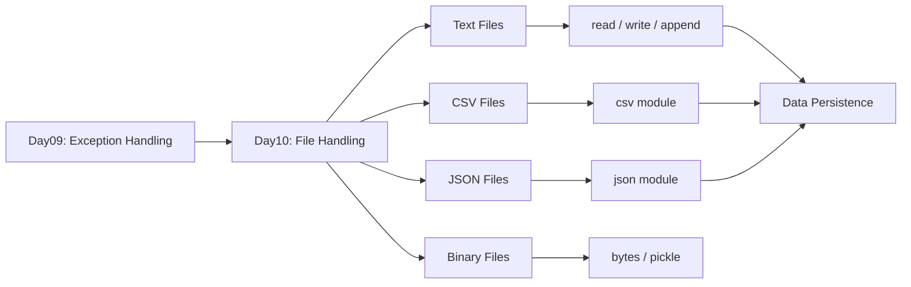

# 🐍 Python Mastery — Day 09
# Exception Handling · Debugging · Logging · Production-Grade Error Management
 
> **Prerequisites:** Day01–Day08 (Fundamentals → Modules & Packages)  
> **GitHub Tag:** `#python-day09` `#exception-handling` `#logging` `#debugging`

---

## 📋 Table of Contents

| # | Section | Topics |
|---|---------|--------|
| 01 | [Complete Revision](#section-1) | Day01–Day08 Cheatsheets & Mind Maps |
| 02 | [Introduction to Errors](#section-2) | Bugs, Failures, Real-World Cost |
| 03 | [Types of Errors](#section-3) | Syntax, Runtime, Logical |
| 04 | [Exceptions Masterclass](#section-4) | Exception Hierarchy, Built-ins |
| 05 | [Try-Except Masterclass](#section-5) | Execution Flow, Real-World |
| 06 | [Multiple Except Blocks](#section-6) | Specific Exceptions, Ordering |
| 07 | [Else and Finally](#section-7) | Resource Cleanup, Guaranteed Execution |
| 08 | [Raise Statement](#section-8) | Custom Error Generation |
| 09 | [Custom Exceptions](#section-9) | Exception Classes, Architecture |
| 10 | [Assertions](#section-10) | Development Checks, Testing |
| 11 | [Logging Masterclass](#section-11) | Levels, Handlers, Production |
| 12 | [Debugging Masterclass](#section-12) | Tracebacks, VS Code, PyCharm |
| 13 | [Input Validation](#section-13) | User, Data, Type, Range |
| 14 | [Defensive Programming](#section-14) | Fail Fast, Graceful Degradation |
| 15 | [Error Handling Patterns](#section-15) | Retry, Fallback, Recovery |
| 16 | [Best Practices](#section-16) | PEP8, Production Standards |
| 17 | [Mini Projects](#section-17) | 10 Complete Projects with Code |
| 18 | [20 Portfolio Projects](#section-18) | GitHub-Ready Project Blueprints |
| 19 | [Project Layout Masterclass](#section-19) | Folder Structures Explained |
| 20 | [GitHub Profile Booster Projects](#section-20) | 10 Recruiter-Focused Projects |
| 21 | [Project Solution Framework](#section-21) | Complete Dev Workflow |
| 22 | [500 Practice Questions](#section-22) | Easy, Medium, Advanced |
| 23 | [250 Interview Questions](#section-23) | With Detailed Answers |
| 24 | [Assignments](#section-24) | 5 Assignments with Solutions |
| 25 | [Enterprise Challenge Projects](#section-25) | 10 Production Blueprints |
| 26 | [Day09 Revision](#section-26) | Cheatsheets, Mind Maps |
| 27 | [Preparation for Day10](#section-27) | File Handling Preview |

---

<a id="section-1"></a>
## 📚 SECTION 1 — Complete Revision: Day01–Day08

### 🗺️ Python Fundamentals Mind Map

```
PYTHON MASTERY — DAY01 to DAY08
│
├── 📌 DAY01 — Fundamentals + Operators
│   ├── Variables & Data Types (int, float, str, bool, None)
│   ├── Arithmetic Operators (+, -, *, /, //, %, **)
│   ├── Comparison Operators (==, !=, <, >, <=, >=)
│   ├── Logical Operators (and, or, not)
│   ├── Assignment Operators (=, +=, -=, *=)
│   └── Type Conversion (int(), float(), str())
│
├── 📌 DAY02 — Strings + Input + Memory
│   ├── String Methods (upper, lower, strip, split, join, replace)
│   ├── String Formatting (f-strings, format(), %)
│   ├── String Slicing & Indexing
│   ├── input() function
│   ├── Python Memory Model (Stack & Heap)
│   └── id(), type(), is, ==
│
├── 📌 DAY03 — Conditional Statements
│   ├── if / elif / else
│   ├── Nested Conditions
│   ├── Ternary Operator
│   ├── Match-Case (Python 3.10+)
│   └── Short Circuit Evaluation
│
├── 📌 DAY04 — Loops + Pattern Printing
│   ├── for loop (range, enumerate, zip)
│   ├── while loop
│   ├── break, continue, pass
│   ├── Nested Loops
│   └── Pattern Printing (triangles, pyramids)
│
├── 📌 DAY05 — Functions + Recursion
│   ├── def, return
│   ├── *args, **kwargs
│   ├── Default Arguments
│   ├── Lambda Functions
│   ├── Scope (LEGB Rule)
│   ├── Closures
│   ├── Decorators (intro)
│   └── Recursion + Base Case
│
├── 📌 DAY06 — Lists
│   ├── List Creation, Indexing, Slicing
│   ├── List Methods (append, extend, insert, remove, pop, sort, reverse)
│   ├── List Comprehensions
│   ├── Nested Lists
│   └── copy() vs deepcopy()
│
├── 📌 DAY07 — Tuples + Sets + Dictionaries
│   ├── Tuple (immutable, packing, unpacking)
│   ├── Set (unique, union, intersection, difference)
│   ├── Dictionary (key-value, methods, comprehensions)
│   └── collections module (Counter, defaultdict, OrderedDict)
│
└── 📌 DAY08 — Modules + Packages + pip + venv
    ├── import, from...import, as
    ├── __name__ == "__main__"
    ├── Standard Library (os, sys, math, datetime, random)
    ├── pip install / uninstall / freeze
    ├── requirements.txt
    ├── Virtual Environments (venv, conda)
    └── __init__.py & Package Structure
```

---

### 📋 Functions Cheat Sheet

| Feature | Syntax | Example |
|---------|--------|---------|
| Basic function | `def name():` | `def greet(): print("Hi")` |
| With return | `return value` | `return x + y` |
| Default args | `def f(x=10):` | `f()` uses 10 |
| *args | `def f(*args):` | Accepts multiple positional |
| **kwargs | `def f(**kwargs):` | Accepts keyword args |
| Lambda | `lambda x: x*2` | `double = lambda x: x*2` |
| Decorator | `@decorator` | `@staticmethod` |
| Recursion | `f()` inside `f()` | factorial, fibonacci |
| Closure | inner func uses outer var | `make_counter()` |

---

### 📋 Collections Cheat Sheet

| Type | Mutable | Ordered | Unique | Syntax |
|------|---------|---------|--------|--------|
| List | ✅ | ✅ | ❌ | `[1, 2, 3]` |
| Tuple | ❌ | ✅ | ❌ | `(1, 2, 3)` |
| Set | ✅ | ❌ | ✅ | `{1, 2, 3}` |
| Dict | ✅ | ✅ (3.7+) | Keys only | `{"a": 1}` |

---

### 📋 Modules & Packages Cheat Sheet

```python
import os                          # import full module
from math import sqrt              # import specific function
import numpy as np                 # alias
from datetime import datetime, date  # multiple imports

# Create package
mypackage/
    __init__.py
    module1.py
    module2.py

# pip commands
pip install package_name
pip uninstall package_name
pip freeze > requirements.txt
pip install -r requirements.txt

# Virtual environment
python -m venv venv
source venv/bin/activate    # Linux/Mac
venv\Scripts\activate       # Windows
deactivate
```

---

<a id="section-2"></a>
## 🐛 SECTION 2 — Introduction to Errors

### What is an Error?

An **error** is any condition that prevents a program from executing correctly or producing the expected output. Errors exist on a spectrum — from completely crashing the program to silently producing wrong results.

> **Real World Analogy:** An error in software is like a fault in a car's engine. Some faults stop the car immediately (syntax error). Others make the car run poorly without stopping (logical error). Some appear only under specific conditions, like rain (runtime error).

---

### What is a Bug?

A **bug** is a defect in code that causes incorrect, unexpected, or unintended behavior. The term originates from 1947 when a moth was found inside Harvard's Mark II computer causing relay failures.

**Categories of Bugs:**
- **Crashes** — Program terminates unexpectedly
- **Silent failures** — Program runs but produces wrong output
- **Performance bugs** — Program runs but too slowly
- **Security bugs** — Program exposes vulnerabilities
- **Data corruption bugs** — Program corrupts stored data

---

### Why Programs Fail

```
REASONS PROGRAMS FAIL
│
├── 🧑 Human Errors
│   ├── Typos and syntax mistakes
│   ├── Wrong algorithm design
│   ├── Incorrect business logic
│   └── Poor input validation
│
├── 🌍 Environmental Errors
│   ├── File not found
│   ├── Network unavailable
│   ├── Database connection lost
│   └── Memory exhaustion
│
├── 📦 Dependency Errors
│   ├── Library version mismatch
│   ├── Missing packages
│   └── API changes
│
└── 📥 Data Errors
    ├── Unexpected input format
    ├── Missing required fields
    ├── Data type mismatch
    └── Out of range values
```

---

### 💰 Cost of Software Bugs

The cost of a bug increases **exponentially** based on when it is detected:

```
DETECTION STAGE          RELATIVE COST
──────────────────────────────────────
Design Phase             1x
Development Phase        6x
Testing Phase            15x
Production (After Release) 100x
Post-Incident (Critical)  1000x+
```

**Real-World Software Failures:**

| Incident | Year | Cost / Impact |
|----------|------|---------------|
| Ariane 5 Rocket Explosion | 1996 | $370M — Integer overflow bug |
| Knight Capital Trading Loss | 2012 | $440M in 45 minutes — Deployment bug |
| Amazon AWS Outage | 2017 | Billions in e-commerce loss — Typo in command |
| Boeing 737 MAX MCAS Failure | 2018-19 | 346 lives lost — Software validation failure |
| Facebook Global Outage | 2021 | $60M revenue loss in 6 hours — Config error |
| Log4Shell Vulnerability | 2021 | $2.4B+ remediation — Library bug |

---

### Banking System Failure Example

```
BANKING TRANSACTION FAILURE
─────────────────────────────────────────────
User: "Transfer ₹50,000 to Account 9876543210"
         │
         ▼
   [Debit ₹50,000] ✅ Successful
         │
         ▼
   [Network Timeout] ❌ Error occurs here
         │
         ▼
   [Credit ₹50,000] ❌ Never executed
         │
         ▼
   RESULT: Money lost from sender, never reached receiver
           Customer complaint, regulatory issue, reputational damage
```

**Prevention:** Transaction management, rollback mechanisms, idempotency keys, proper exception handling.

---

### AI System Failure Example

```
AI RECOMMENDATION SYSTEM FAILURE
──────────────────────────────────────────────
Input: User profile data (age=None due to missing field)
         │
         ▼
   [Age validation missing] — No exception raised
         │
         ▼
   [Algorithm: age * 0.7 + score] — TypeError: None * 0.7
         │
         ▼
   [System Crash] OR [Wrong recommendations for all users]
         │
         ▼
   RESULT: System down, user data privacy risk, business loss
```

---

<a id="section-3"></a>
## ⚠️ SECTION 3 — Types of Errors

### 3.1 — Syntax Errors

**Definition:** Errors detected by the Python parser before the program runs. They indicate the code violates Python's grammar rules.

**When Detected:** Before execution (at parse time)  
**Effect:** Program cannot start at all

```python
# ❌ SYNTAX ERROR EXAMPLES

# Missing closing parenthesis
print("Hello"

# Missing colon
if x > 10
    print(x)

# Invalid assignment
5 = x

# Invalid indentation
def greet():
print("Hello")  # Not indented
```

**Error Message:**
```
  File "app.py", line 2
    print("Hello"
                ^
SyntaxError: '(' was never closed
```

**Syntax Error Diagram:**
```
SOURCE CODE
    │
    ▼
[Python Parser]
    │
    ├── Grammar OK? ──── YES ──▶ [Bytecode Compilation]
    │
    └── Grammar FAIL? ── YES ──▶ SyntaxError raised
                                  │
                                  ▼
                             Program NEVER starts
```

---

### 3.2 — Runtime Errors (Exceptions)

**Definition:** Errors that occur during program execution, after the program has successfully started. They are caused by operations that are syntactically correct but fail at runtime.

**When Detected:** During execution  
**Effect:** Program crashes at the point of failure (unless handled)

```python
# ❌ RUNTIME ERROR EXAMPLES

# Division by zero
result = 10 / 0              # ZeroDivisionError

# Type mismatch
age = int("twenty")          # ValueError

# Index out of bounds
lst = [1, 2, 3]
print(lst[10])               # IndexError

# File not found
open("nonexistent.txt")      # FileNotFoundError

# None reference
name = None
print(name.upper())          # AttributeError

# Key not found
data = {"age": 25}
print(data["name"])          # KeyError
```

**Runtime Error Flow:**
```
PROGRAM STARTS → RUNS NORMALLY
        │
        ▼
   [Problematic Line Reached]
        │
        ▼
   [Python Interpreter Detects Failure]
        │
        ▼
   [Exception Object Created]
        │
        ├── try-except block? ── YES ──▶ [Handler Executes] ──▶ Program continues
        │
        └── No handler? ─────── YES ──▶ [Traceback Printed] ──▶ Program CRASHES
```

---

### 3.3 — Logical Errors

**Definition:** The most dangerous type. The program runs without crashing but produces **incorrect results** due to flawed logic. Python cannot detect these.

**When Detected:** During testing, code review, or when incorrect results are noticed  
**Effect:** Silent wrong output — hardest to find and fix

```python
# ❌ LOGICAL ERROR EXAMPLES

# Wrong formula (average)
def calculate_average(numbers):
    return sum(numbers) / len(numbers) + 1  # +1 is wrong!

print(calculate_average([10, 20, 30]))
# Returns: 21.0 (WRONG — should be 20.0)
# No error raised!

# ───────────────────────────────────────────
# Wrong condition direction
def is_adult(age):
    if age < 18:              # Should be >= 18
        return True
    return False

print(is_adult(25))  # Returns False (WRONG!)

# ───────────────────────────────────────────
# Off-by-one error
numbers = [1, 2, 3, 4, 5]
for i in range(len(numbers) - 1):  # Misses last element
    print(numbers[i])
# Prints: 1, 2, 3, 4 (misses 5!)
```

---

### Error Types Comparison Table

| Feature | Syntax Error | Runtime Error | Logical Error |
|---------|-------------|---------------|---------------|
| **When detected** | Before execution | During execution | After execution (by human) |
| **Python detects?** | ✅ Yes | ✅ Yes | ❌ No |
| **Program starts?** | ❌ No | ✅ Yes | ✅ Yes |
| **Error message?** | ✅ Clear | ✅ Clear | ❌ None |
| **Difficulty to find** | Easy | Medium | Hard |
| **Example** | `print("Hi"` | `10/0` | `avg = sum/len + 1` |

---

<a id="section-4"></a>
## 🏛️ SECTION 4 — Exceptions Masterclass

### What is an Exception?

An **exception** is an event that disrupts the normal flow of a program's execution. In Python, when an error occurs during runtime, an **exception object** is created containing information about the error type and context.

> **Real World Analogy:** An exception is like an alarm system in a building. When smoke is detected (error occurs), the alarm triggers (exception raised). The alarm system can be configured to notify specific people (exception handlers). If no one responds (unhandled exception), the building evacuates (program crashes).

---

### How Exceptions Work Internally

```
PYTHON EXCEPTION MECHANISM
──────────────────────────────────────────────────────
1. Error condition detected during execution
   │
2. Python creates an Exception object:
   ├── Exception type (e.g., ValueError)
   ├── Error message (e.g., "invalid literal for int()")
   ├── Traceback (call stack snapshot)
   └── Additional context
   │
3. Exception is "raised" (thrown)
   │
4. Python walks up the call stack looking for a handler
   │
5a. Handler found (try-except) → Execute except block → Continue
5b. No handler found → Print traceback → Program terminates
```

---

### Exception Propagation

```python
def function_c():
    return int("not_a_number")   # ValueError raised here

def function_b():
    return function_c()          # Exception propagates up

def function_a():
    return function_b()          # Exception propagates up

# If called without try-except:
function_a()

# Traceback:
# Traceback (most recent call last):
#   File "app.py", line 12, in <module>
#     function_a()
#   File "app.py", line 9, in function_a
#     return function_b()
#   File "app.py", line 6, in function_b
#     return function_c()
#   File "app.py", line 3, in function_c
#     return int("not_a_number")
# ValueError: invalid literal for int() with base 10: 'not_a_number'
```

**Propagation Diagram:**
```
function_c() → raises ValueError
    ↑
function_b() → no handler → propagates
    ↑
function_a() → no handler → propagates
    ↑
__main__     → no handler → PROGRAM CRASHES with traceback
```

---

### Python Exception Hierarchy

```
BaseException
│
├── SystemExit                    ← sys.exit() calls this
├── KeyboardInterrupt             ← Ctrl+C
├── GeneratorExit                 ← Generator .close() called
│
└── Exception                    ← Base for all normal exceptions
    │
    ├── ArithmeticError
    │   ├── ZeroDivisionError     ← 10 / 0
    │   ├── OverflowError         ← Number too large
    │   └── FloatingPointError
    │
    ├── LookupError
    │   ├── IndexError            ← list[99] out of range
    │   └── KeyError              ← dict["missing_key"]
    │
    ├── ValueError                ← int("hello")
    ├── TypeError                 ← "str" + 5
    ├── NameError                 ← undefined variable
    │   └── UnboundLocalError
    ├── AttributeError            ← None.upper()
    ├── ImportError               ← import nonexistent
    │   └── ModuleNotFoundError
    ├── OSError                   ← OS-level errors
    │   ├── FileNotFoundError     ← open("missing.txt")
    │   ├── PermissionError       ← No read/write access
    │   ├── FileExistsError
    │   └── TimeoutError
    ├── RuntimeError
    │   └── RecursionError        ← Infinite recursion
    ├── StopIteration             ← next() on exhausted iterator
    ├── MemoryError               ← Out of memory
    ├── NotImplementedError       ← Abstract method not implemented
    └── AssertionError            ← assert statement fails
```

---

### Built-in Exceptions Reference

| Exception | Trigger | Example |
|-----------|---------|---------|
| `ValueError` | Wrong value type | `int("abc")` |
| `TypeError` | Wrong data type | `"str" + 5` |
| `ZeroDivisionError` | Division by zero | `10 / 0` |
| `IndexError` | List index out of range | `[1,2,3][10]` |
| `KeyError` | Dict key missing | `d["missing"]` |
| `AttributeError` | Object has no attribute | `None.upper()` |
| `FileNotFoundError` | File doesn't exist | `open("x.txt")` |
| `PermissionError` | No file permission | `open("/root/f")` |
| `ImportError` | Module import fails | `import xyz` |
| `NameError` | Variable not defined | `print(x)` (x undefined) |
| `RecursionError` | Max recursion depth | Infinite recursion |
| `MemoryError` | System out of memory | Creating huge list |
| `OverflowError` | Arithmetic overflow | `float('inf') + 1` |
| `StopIteration` | Iterator exhausted | `next()` on done iterator |
| `AssertionError` | Assert fails | `assert 1 == 2` |
| `NotImplementedError` | Abstract method called | Base class method |
| `OSError` | OS operation fails | Disk full, permissions |
| `TimeoutError` | Operation timed out | Network timeout |

---

<a id="section-5"></a>
## 🔱 SECTION 5 — Try-Except Masterclass

### Basic Syntax

```python
try:
    # Code that might raise an exception
    risky_code()
except ExceptionType:
    # Code that runs if the exception occurs
    handle_error()
```

---

### Execution Flow Diagram

```
TRY-EXCEPT EXECUTION FLOW
────────────────────────────────────────────────
        [Start try block]
               │
               ▼
    [Execute statements in try]
               │
    ┌──────────┴───────────┐
    │                      │
  NO ERROR             ERROR OCCURS
    │                      │
    ▼                      ▼
[try block            [Exception object
 completes]            created]
    │                      │
    │               [Match except clause?]
    │                      │
    │               ┌──────┴──────┐
    │             YES             NO
    │               │              │
    │          [Execute          [Propagate
    │           except]           exception]
    │               │
    └───────────────┘
               │
           [Continue]
```

---

### Comprehensive Examples

```python
# ═══════════════════════════════════════════════
# EXAMPLE 1: Basic ValueError Handling
# ═══════════════════════════════════════════════
def get_age():
    try:
        age = int(input("Enter your age: "))
        print(f"You are {age} years old.")
    except ValueError:
        print("❌ Error: Please enter a valid number for age.")

get_age()

# ═══════════════════════════════════════════════
# EXAMPLE 2: Catching the Exception Object
# ═══════════════════════════════════════════════
def safe_divide(a, b):
    try:
        result = a / b
        return result
    except ZeroDivisionError as e:
        print(f"❌ Division Error: {e}")
        return None

print(safe_divide(10, 2))   # 5.0
print(safe_divide(10, 0))   # Error message, returns None

# ═══════════════════════════════════════════════
# EXAMPLE 3: Database-Like Pattern
# ═══════════════════════════════════════════════
users = {"admin": "pass123", "user1": "secret"}

def authenticate(username, password):
    try:
        stored_password = users[username]  # May raise KeyError
        if stored_password == password:
            print(f"✅ Welcome, {username}!")
            return True
        else:
            print("❌ Incorrect password.")
            return False
    except KeyError:
        print(f"❌ User '{username}' not found.")
        return False

authenticate("admin", "pass123")   # ✅ Welcome
authenticate("admin", "wrongpass") # ❌ Incorrect password
authenticate("ghost", "any")       # ❌ User not found

# ═══════════════════════════════════════════════
# EXAMPLE 4: File Reading (Real-World Pattern)
# ═══════════════════════════════════════════════
def read_config(filepath):
    try:
        with open(filepath, 'r') as f:
            content = f.read()
            print(f"✅ Config loaded: {len(content)} bytes")
            return content
    except FileNotFoundError:
        print(f"❌ Config file '{filepath}' not found. Using defaults.")
        return "{}"

config = read_config("config.json")
```

---

### Accessing Exception Details

```python
try:
    result = int("not_a_number")
except ValueError as e:
    print(f"Exception type: {type(e).__name__}")
    # Output: ValueError

    print(f"Exception message: {e}")
    # Output: invalid literal for int() with base 10: 'not_a_number'

    print(f"Exception args: {e.args}")
    # Output: ("invalid literal for int() with base 10: 'not_a_number'",)
```

---

<a id="section-6"></a>
## 🔀 SECTION 6 — Multiple Except Blocks

### Syntax

```python
try:
    risky_operation()
except SpecificError1:
    handle_error1()
except SpecificError2:
    handle_error2()
except (Error3, Error4):    # Catch multiple in one block
    handle_error3_4()
except Exception as e:      # Catch-all (use carefully)
    handle_generic(e)
```

---

### Exception Ordering Rules

> ⚠️ **CRITICAL RULE:** More specific exceptions must come BEFORE more general ones. Python checks except clauses in order and uses the FIRST match.

```python
# ❌ WRONG ORDER — ZeroDivisionError is subclass of ArithmeticError
try:
    result = 10 / 0
except ArithmeticError:     # This catches ZeroDivisionError first!
    print("Arithmetic error")
except ZeroDivisionError:   # This NEVER runs!
    print("Zero division")  # Dead code!

# ✅ CORRECT ORDER — Specific first, general last
try:
    result = 10 / 0
except ZeroDivisionError:   # Specific first
    print("Cannot divide by zero")
except ArithmeticError:     # More general
    print("Arithmetic error")
except Exception:           # Most general last
    print("Unknown error")
```

---

### Professional Multi-Exception Example

```python
# ═══════════════════════════════════════════════
# Enterprise-Grade API-Like Response Handler
# ═══════════════════════════════════════════════
import json

def process_user_data(raw_data, user_id):
    """
    Processes user data with comprehensive error handling.
    Mimics real-world API data processing.
    """
    try:
        # Step 1: Parse JSON
        data = json.loads(raw_data)

        # Step 2: Extract required field
        name = data["name"]

        # Step 3: Validate age
        age = int(data["age"])

        # Step 4: Business rule validation
        if age < 0 or age > 150:
            raise ValueError(f"Age {age} is out of valid range")

        # Step 5: Calculate user score
        score = 100 / (150 - age)  # Could be zero division if age==150

        print(f"✅ Processed: {name}, Age: {age}, Score: {score:.2f}")
        return {"status": "success", "name": name, "score": score}

    except json.JSONDecodeError as e:
        print(f"❌ Invalid JSON format: {e}")
        return {"status": "error", "code": "JSON_PARSE_ERROR"}

    except KeyError as e:
        print(f"❌ Missing required field: {e}")
        return {"status": "error", "code": "MISSING_FIELD", "field": str(e)}

    except ValueError as e:
        print(f"❌ Invalid value: {e}")
        return {"status": "error", "code": "INVALID_VALUE"}

    except ZeroDivisionError:
        print("❌ Age 150 causes division by zero in score calculation")
        return {"status": "error", "code": "CALC_ERROR"}

    except Exception as e:
        print(f"❌ Unexpected error for user {user_id}: {type(e).__name__}: {e}")
        return {"status": "error", "code": "UNKNOWN_ERROR"}


# Test cases
print(process_user_data('{"name": "Rahul", "age": "25"}', 1))
print(process_user_data('invalid json{', 2))
print(process_user_data('{"name": "Priya"}', 3))           # Missing age
print(process_user_data('{"name": "Dev", "age": "abc"}', 4))  # Bad age
```

---

### Catching Multiple Exceptions in One Block

```python
def safe_list_access(data, index, key=None):
    try:
        if isinstance(data, list):
            return data[index]
        elif isinstance(data, dict):
            return data[key]
    except (IndexError, KeyError) as e:
        # Both are LookupErrors — handled the same way
        print(f"❌ Access error: {type(e).__name__}: {e}")
        return None
    except TypeError as e:
        print(f"❌ Type error: {e}")
        return None

print(safe_list_access([1, 2, 3], 10))         # IndexError
print(safe_list_access({"a": 1}, 0, "b"))      # KeyError
```

---

<a id="section-7"></a>
## 🔒 SECTION 7 — Else and Finally

### Complete Syntax

```python
try:
    # Risky code
    pass
except SomeError:
    # Runs ONLY if exception occurred
    pass
else:
    # Runs ONLY if NO exception occurred in try
    pass
finally:
    # ALWAYS runs — exception or not
    pass
```

---

### Execution Flow with Else and Finally

```
TRY-EXCEPT-ELSE-FINALLY FLOW
─────────────────────────────────────────────────────────
                [Enter try block]
                       │
                       ▼
              [Execute try statements]
                       │
           ┌───────────┴────────────┐
       NO ERROR                  ERROR
           │                       │
           ▼                       ▼
      [else block]           [except block]
      (optional)             (matching one)
           │                       │
           └───────────┬───────────┘
                       │
                       ▼
               [finally block]  ← ALWAYS EXECUTES
                       │
                       ▼
                  [Continue or
                   re-raise]
```

---

### Resource Cleanup Pattern (The Primary Use of Finally)

```python
# ═══════════════════════════════════════════════
# Database Connection Simulation
# ═══════════════════════════════════════════════
class DatabaseConnection:
    def __init__(self, db_name):
        self.db_name = db_name
        self.connected = False

    def connect(self):
        print(f"📡 Connecting to {self.db_name}...")
        self.connected = True
        print("✅ Connected!")

    def execute(self, query):
        if not self.connected:
            raise RuntimeError("Not connected to database!")
        print(f"⚙️  Executing: {query}")
        if "DROP" in query.upper():
            raise PermissionError("DROP operations not allowed!")
        return f"Result of: {query}"

    def close(self):
        if self.connected:
            print(f"🔌 Disconnecting from {self.db_name}...")
            self.connected = False
            print("✅ Connection closed safely.")


def run_query(query):
    db = DatabaseConnection("users_db")
    try:
        db.connect()
        result = db.execute(query)
        print(f"📦 Result: {result}")
    except PermissionError as e:
        print(f"❌ Permission denied: {e}")
    except RuntimeError as e:
        print(f"❌ Runtime error: {e}")
    else:
        # Only runs if no exception occurred
        print("✅ Query completed successfully.")
    finally:
        # ALWAYS closes connection — critical for resource management
        db.close()

print("=== Test 1: Valid Query ===")
run_query("SELECT * FROM users")

print("\n=== Test 2: Forbidden Query ===")
run_query("DROP TABLE users")
```

**Output:**
```
=== Test 1: Valid Query ===
📡 Connecting to users_db...
✅ Connected!
⚙️  Executing: SELECT * FROM users
📦 Result: Result of: SELECT * FROM users
✅ Query completed successfully.
🔌 Disconnecting from users_db...
✅ Connection closed safely.

=== Test 2: Forbidden Query ===
📡 Connecting to users_db...
✅ Connected!
⚙️  Executing: DROP TABLE users
❌ Permission denied: DROP operations not allowed!
🔌 Disconnecting from users_db...
✅ Connection closed safely.
```

---

### Finally: Key Behaviors

```python
# BEHAVIOR 1: finally runs even with return in try
def test_return():
    try:
        print("In try")
        return "try value"
    finally:
        print("In finally")  # This STILL runs!

result = test_return()
# Output: In try → In finally
print(result)  # try value

# BEHAVIOR 2: finally runs even with uncaught exception
def test_uncaught():
    try:
        raise ValueError("Uncaught!")
    finally:
        print("Finally still runs!")  # This runs before crash

# test_uncaught()  # Prints "Finally still runs!" then crashes
```

---

<a id="section-8"></a>
## 🚀 SECTION 8 — Raise Statement

### What is `raise`?

The `raise` statement allows you to **manually trigger** an exception. This is essential for:
- Enforcing business rules
- Validating function inputs
- Signaling error conditions to callers
- Converting low-level errors to domain-specific ones

---

### Raise Syntax Patterns

```python
# Pattern 1: Raise a new exception
raise ValueError("Invalid input provided")

# Pattern 2: Raise with no arguments (re-raise current exception)
try:
    int("abc")
except ValueError:
    print("Logging error...")
    raise   # Re-raises the original ValueError

# Pattern 3: Raise from another exception (chaining)
try:
    data = int("abc")
except ValueError as original:
    raise RuntimeError("Processing failed") from original
```

---

### Professional Validation with Raise

```python
# ═══════════════════════════════════════════════
# Enterprise User Registration Validator
# ═══════════════════════════════════════════════

def validate_age(age):
    """Validates age with meaningful error messages."""
    if not isinstance(age, int):
        raise TypeError(f"Age must be an integer, got {type(age).__name__}")
    if age < 0:
        raise ValueError(f"Age cannot be negative: {age}")
    if age > 150:
        raise ValueError(f"Age {age} exceeds maximum valid age (150)")
    return True


def validate_email(email):
    """Basic email validation."""
    if not isinstance(email, str):
        raise TypeError("Email must be a string")
    if "@" not in email:
        raise ValueError(f"Invalid email format: '{email}' (missing @)")
    if "." not in email.split("@")[1]:
        raise ValueError(f"Invalid email domain in: '{email}'")
    return True


def validate_password(password):
    """Password strength validation."""
    if len(password) < 8:
        raise ValueError("Password must be at least 8 characters long")
    if not any(c.isdigit() for c in password):
        raise ValueError("Password must contain at least one digit")
    if not any(c.isupper() for c in password):
        raise ValueError("Password must contain at least one uppercase letter")
    return True


def register_user(name, age, email, password):
    """
    Complete user registration with validation.
    Raises descriptive exceptions for invalid data.
    """
    try:
        # Validate each field
        validate_age(age)
        validate_email(email)
        validate_password(password)

        # Business rule: premium age range
        if age < 13:
            raise ValueError("Users must be at least 13 years old")

        print(f"✅ User '{name}' registered successfully!")
        return {"status": "registered", "user": name, "email": email}

    except (TypeError, ValueError) as e:
        print(f"❌ Registration failed: {e}")
        return {"status": "failed", "error": str(e)}


# Test cases
register_user("Rahul", 25, "rahul@example.com", "SecurePass1")
register_user("Priya", -5, "priya@test.com", "Pass123")
register_user("Dev", 20, "not-an-email", "Pass123")
register_user("Aman", 20, "aman@test.com", "weak")
register_user("Baby", 10, "baby@test.com", "SecurePass1")
```

---

### Exception Chaining (`raise from`)

```python
# Professional pattern: Convert technical errors to domain errors
def load_user_config(user_id):
    try:
        with open(f"configs/user_{user_id}.json") as f:
            import json
            return json.load(f)
    except FileNotFoundError as e:
        # Chain: domain error → technical error
        raise RuntimeError(
            f"User configuration for ID {user_id} not found"
        ) from e
    except json.JSONDecodeError as e:
        raise ValueError(
            f"Corrupted configuration for user {user_id}"
        ) from e


try:
    config = load_user_config(999)
except RuntimeError as e:
    print(f"Error: {e}")
    print(f"Caused by: {e.__cause__}")
```

---

<a id="section-9"></a>
## 🏗️ SECTION 9 — Custom Exceptions

### Why Custom Exceptions Matter

Custom exceptions allow you to:
1. **Create domain-specific error vocabulary** (e.g., `InsufficientFundsError`)
2. **Add context and data** to errors (e.g., `balance`, `required_amount`)
3. **Enable precise error handling** by callers
4. **Improve code documentation** through meaningful names
5. **Separate business logic errors** from technical errors

> **Real World Analogy:** Custom exceptions are like specialized alarm systems. A hospital has different alarms for fire, cardiac arrest, and security breach — each triggers a different response. A single generic alarm would cause chaos.

---

### Basic Custom Exception

```python
# Simplest form — just naming
class InsufficientFundsError(Exception):
    pass

# Usage
def withdraw(balance, amount):
    if amount > balance:
        raise InsufficientFundsError(
            f"Cannot withdraw ₹{amount}. Balance: ₹{balance}"
        )
    return balance - amount

try:
    new_balance = withdraw(1000, 5000)
except InsufficientFundsError as e:
    print(f"❌ {e}")
```

---

### Professional Custom Exception Hierarchy

```python
# ═══════════════════════════════════════════════
# Banking Application Exception Hierarchy
# ═══════════════════════════════════════════════

class BankingError(Exception):
    """Base exception for all banking-related errors."""
    def __init__(self, message, error_code=None):
        super().__init__(message)
        self.error_code = error_code
        self.message = message

    def __str__(self):
        if self.error_code:
            return f"[{self.error_code}] {self.message}"
        return self.message


class AccountError(BankingError):
    """Account-related errors."""
    pass


class AccountNotFoundError(AccountError):
    """Account does not exist."""
    def __init__(self, account_id):
        super().__init__(
            f"Account {account_id} not found",
            error_code="ACC_001"
        )
        self.account_id = account_id


class AccountFrozenError(AccountError):
    """Account is frozen/suspended."""
    def __init__(self, account_id, reason):
        super().__init__(
            f"Account {account_id} is frozen: {reason}",
            error_code="ACC_002"
        )
        self.reason = reason


class TransactionError(BankingError):
    """Transaction-related errors."""
    pass


class InsufficientFundsError(TransactionError):
    """Not enough balance."""
    def __init__(self, balance, required):
        super().__init__(
            f"Insufficient funds. Balance: ₹{balance}, Required: ₹{required}",
            error_code="TXN_001"
        )
        self.balance = balance
        self.required = required
        self.shortfall = required - balance


class DailyLimitExceededError(TransactionError):
    """Daily withdrawal limit exceeded."""
    def __init__(self, attempted, daily_limit):
        super().__init__(
            f"Daily limit exceeded. Attempted: ₹{attempted}, Limit: ₹{daily_limit}",
            error_code="TXN_002"
        )
        self.attempted = attempted
        self.daily_limit = daily_limit


# ═══════════════════════════════════════════════
# Banking System Using Custom Exceptions
# ═══════════════════════════════════════════════

class BankAccount:
    DAILY_LIMIT = 50000

    def __init__(self, account_id, holder_name, balance=0):
        self.account_id = account_id
        self.holder = holder_name
        self.balance = balance
        self.frozen = False
        self.freeze_reason = None
        self.daily_withdrawn = 0

    def freeze(self, reason):
        self.frozen = True
        self.freeze_reason = reason

    def withdraw(self, amount):
        if not self._account_exists():
            raise AccountNotFoundError(self.account_id)

        if self.frozen:
            raise AccountFrozenError(self.account_id, self.freeze_reason)

        if self.daily_withdrawn + amount > self.DAILY_LIMIT:
            raise DailyLimitExceededError(
                self.daily_withdrawn + amount,
                self.DAILY_LIMIT
            )

        if amount > self.balance:
            raise InsufficientFundsError(self.balance, amount)

        self.balance -= amount
        self.daily_withdrawn += amount
        print(f"✅ Withdrawn ₹{amount}. New balance: ₹{self.balance}")

    def _account_exists(self):
        return self.account_id is not None


# Test the system
account = BankAccount("ACC001", "Rahul Kumar", balance=10000)

try:
    account.withdraw(3000)
    account.withdraw(8000)   # Insufficient funds
except InsufficientFundsError as e:
    print(f"❌ {e}")
    print(f"   Shortfall: ₹{e.shortfall}")
    print(f"   Error Code: {e.error_code}")

account2 = BankAccount("ACC002", "Priya Sharma", balance=100000)
account2.freeze("Suspicious activity detected")

try:
    account2.withdraw(1000)
except AccountFrozenError as e:
    print(f"❌ {e}")
    print(f"   Reason: {e.reason}")
```

---

<a id="section-10"></a>
## ✅ SECTION 10 — Assertions

### What is an Assertion?

An **assertion** is a debugging aid that tests whether a condition is true. If the condition is False, Python raises an `AssertionError`. Assertions are primarily used during **development and testing**, not production.

```python
assert condition, "Error message if condition is False"
```

---

### How Assertions Work

```python
# Basic assertion
x = 10
assert x > 0, "x must be positive"        # Passes silently
assert x > 100, "x must be greater than 100"  # Raises AssertionError

# Output:
# AssertionError: x must be greater than 100
```

---

### Professional Use Cases

```python
# ═══════════════════════════════════════════════
# Function Pre/Post Conditions
# ═══════════════════════════════════════════════

def calculate_discount(price, discount_percent):
    # Pre-conditions (assertions)
    assert isinstance(price, (int, float)), f"price must be numeric, got {type(price)}"
    assert price > 0, f"price must be positive, got {price}"
    assert 0 <= discount_percent <= 100, f"discount must be 0-100, got {discount_percent}"

    discounted = price * (1 - discount_percent / 100)

    # Post-condition
    assert discounted >= 0, "Discounted price cannot be negative"
    assert discounted <= price, "Discounted price cannot exceed original"

    return discounted


print(calculate_discount(1000, 20))   # 800.0
print(calculate_discount(500, 100))   # 0.0

# This would raise AssertionError:
# calculate_discount(-100, 20)   # negative price
# calculate_discount(1000, 150)  # discount > 100


# ═══════════════════════════════════════════════
# Data Pipeline Validation
# ═══════════════════════════════════════════════

def process_dataset(records):
    assert isinstance(records, list), "records must be a list"
    assert len(records) > 0, "records cannot be empty"
    assert all(isinstance(r, dict) for r in records), "all records must be dicts"
    assert all("id" in r for r in records), "all records must have 'id' field"

    processed = []
    for record in records:
        assert record["id"] > 0, f"Invalid record ID: {record['id']}"
        processed.append({**record, "processed": True})

    assert len(processed) == len(records), "Processing lost records!"
    return processed


sample = [{"id": 1, "name": "Alice"}, {"id": 2, "name": "Bob"}]
print(process_dataset(sample))
```

---

### Assertions vs Exceptions: When to Use Which

| Aspect | `assert` | `raise` / `except` |
|--------|----------|--------------------|
| **Purpose** | Development/testing checks | Production error handling |
| **Can be disabled** | ✅ Yes (`python -O`) | ❌ No |
| **Use for** | Developer mistakes, debug | User input, external data |
| **Production use** | ❌ Avoid | ✅ Yes |
| **Example** | Internal state verification | Validating user input |

> ⚠️ **WARNING:** Never use `assert` for security checks or user input validation in production. Assertions can be disabled with `python -O` flag!

---

<a id="section-11"></a>
## 📊 SECTION 11 — Logging Masterclass

### Why Logging?

Logging is the practice of recording events that occur during program execution. It is the **backbone of production observability** and is far superior to `print()` for real applications.

**print() vs logging:**

| Feature | `print()` | `logging` |
|---------|-----------|-----------|
| **Levels** | ❌ None | ✅ DEBUG, INFO, WARNING, ERROR, CRITICAL |
| **Timestamps** | ❌ No | ✅ Automatic |
| **File output** | ❌ No | ✅ Yes |
| **Disable in prod** | ❌ Hard | ✅ Easy |
| **Structured output** | ❌ No | ✅ Yes |
| **Production ready** | ❌ No | ✅ Yes |

---

### Logging Levels

```
LOGGING LEVELS (Severity Order)
────────────────────────────────────────────────
Level       | Numeric | Use Case
────────────────────────────────────────────────
DEBUG       |   10    | Detailed diagnostic info
INFO        |   20    | General operational events
WARNING     |   30    | Unexpected but recoverable
ERROR       |   40    | Serious problem, operation failed
CRITICAL    |   50    | Program may not recover
────────────────────────────────────────────────
NOTSET      |    0    | Process all messages (default)
```

---

### Basic Logging Setup

```python
import logging

# Basic configuration
logging.basicConfig(
    level=logging.DEBUG,
    format='%(asctime)s - %(levelname)s - %(message)s',
    datefmt='%Y-%m-%d %H:%M:%S'
)

# Log at different levels
logging.debug("🔍 Detailed debug information")
logging.info("ℹ️  Application started")
logging.warning("⚠️  Low disk space detected")
logging.error("❌ Failed to connect to database")
logging.critical("🔥 System is going down!")
```

**Output:**
```
2024-01-15 10:30:00 - DEBUG - 🔍 Detailed debug information
2024-01-15 10:30:00 - INFO - ℹ️  Application started
2024-01-15 10:30:00 - WARNING - ⚠️  Low disk space detected
2024-01-15 10:30:00 - ERROR - ❌ Failed to connect to database
2024-01-15 10:30:00 - CRITICAL - 🔥 System is going down!
```

---

### Professional Logging Configuration

```python
import logging
import logging.handlers
import os
from datetime import datetime

# ═══════════════════════════════════════════════
# Production-Grade Logger Setup
# ═══════════════════════════════════════════════

def setup_logger(app_name, log_dir="logs"):
    """
    Sets up a production-grade logger with:
    - Console handler (INFO and above)
    - File handler (DEBUG and above)
    - Rotating file handler (auto-rotates at 10MB)
    """
    # Create logs directory
    os.makedirs(log_dir, exist_ok=True)

    # Create logger
    logger = logging.getLogger(app_name)
    logger.setLevel(logging.DEBUG)

    # Formatter with detailed info
    detailed_formatter = logging.Formatter(
        fmt='%(asctime)s | %(name)s | %(levelname)-8s | %(filename)s:%(lineno)d | %(message)s',
        datefmt='%Y-%m-%d %H:%M:%S'
    )

    simple_formatter = logging.Formatter(
        fmt='%(asctime)s | %(levelname)-8s | %(message)s',
        datefmt='%H:%M:%S'
    )

    # Handler 1: Console (INFO+)
    console_handler = logging.StreamHandler()
    console_handler.setLevel(logging.INFO)
    console_handler.setFormatter(simple_formatter)

    # Handler 2: File (DEBUG+) with daily rotation
    log_file = os.path.join(log_dir, f"{app_name}.log")
    file_handler = logging.handlers.RotatingFileHandler(
        log_file,
        maxBytes=10 * 1024 * 1024,   # 10 MB
        backupCount=5                  # Keep 5 backup files
    )
    file_handler.setLevel(logging.DEBUG)
    file_handler.setFormatter(detailed_formatter)

    # Handler 3: Error-only file
    error_log = os.path.join(log_dir, f"{app_name}_errors.log")
    error_handler = logging.FileHandler(error_log)
    error_handler.setLevel(logging.ERROR)
    error_handler.setFormatter(detailed_formatter)

    # Add handlers to logger
    logger.addHandler(console_handler)
    logger.addHandler(file_handler)
    logger.addHandler(error_handler)

    return logger


# Usage
logger = setup_logger("my_application")

logger.debug("Starting database query...")
logger.info("Application initialized successfully")
logger.warning("API rate limit at 80% capacity")
logger.error("Payment gateway connection failed")
logger.critical("Database corruption detected!")
```

---

### Logging in Exception Handlers

```python
import logging

logger = logging.getLogger(__name__)

def process_payment(user_id, amount):
    """Process payment with comprehensive logging."""
    logger.info(f"Payment initiated | user={user_id} | amount=₹{amount}")

    try:
        if amount <= 0:
            raise ValueError(f"Invalid amount: {amount}")

        # Simulate payment processing
        logger.debug(f"Connecting to payment gateway for user {user_id}")

        if amount > 100000:
            raise RuntimeError("Payment exceeds single transaction limit")

        logger.info(f"Payment successful | user={user_id} | amount=₹{amount}")
        return {"status": "success", "transaction_id": "TXN123456"}

    except ValueError as e:
        # Log with exception info (includes traceback)
        logger.error(f"Payment validation failed | user={user_id} | error={e}")
        return {"status": "failed", "reason": str(e)}

    except RuntimeError as e:
        logger.error(
            f"Payment processing error | user={user_id}",
            exc_info=True   # ← Includes full traceback in log
        )
        return {"status": "failed", "reason": str(e)}

    except Exception as e:
        # Log unexpected errors with full context
        logger.critical(
            f"Unexpected payment error | user={user_id} | type={type(e).__name__}",
            exc_info=True
        )
        raise  # Re-raise critical unexpected errors


# Test
logging.basicConfig(level=logging.DEBUG, format='%(asctime)s | %(levelname)s | %(message)s')
process_payment(101, 5000)
process_payment(102, -100)
process_payment(103, 200000)
```

---

### Logging Architecture in Production

```
PRODUCTION LOGGING ARCHITECTURE
─────────────────────────────────────────────────────────
Application
    │
    ▼
[Logger] ──── name="payment_service"
    │
    ├──▶ [Console Handler] ──────▶ stdout (INFO+)
    │                              For developer viewing
    │
    ├──▶ [Rotating File Handler] ─▶ logs/app.log (DEBUG+)
    │                              Max 10MB, 5 backups
    │
    ├──▶ [Error File Handler] ────▶ logs/errors.log (ERROR+)
    │                              Critical issues only
    │
    └──▶ [External Handler] ──────▶ CloudWatch / ELK Stack
                                    (Production monitoring)
```

---

<a id="section-12"></a>
## 🔬 SECTION 12 — Debugging Masterclass

### Reading Tracebacks

Tracebacks are Python's way of telling you exactly what went wrong and where.

```
Traceback (most recent call last):    ← READ BOTTOM UP
  File "app.py", line 15, in <module>  ← Entry point
    main()
  File "app.py", line 12, in main      ← Call stack
    result = process(data)
  File "app.py", line 8, in process    ← Where error is
    return int(data["value"])
  File "app.py", line 8, in process
    return int(data["value"])
KeyError: 'value'                      ← MOST IMPORTANT: Error type + message
```

**Reading Strategy:**
1. **Start at the bottom** — The error type and message are most important
2. **Find your code** — Look for your filenames in the traceback
3. **Last frame = error location** — The last line before the error type

---

### Print Debugging (Diagnostic Printing)

```python
# ═══════════════════════════════════════════════
# Systematic Print Debugging
# ═══════════════════════════════════════════════

def buggy_function(data):
    print(f"[DEBUG] Input data: {data}")           # Check input
    print(f"[DEBUG] Input type: {type(data)}")

    result = []
    for i, item in enumerate(data):
        print(f"[DEBUG] Processing item {i}: {item}")   # Check each step

        processed = item * 2
        print(f"[DEBUG] After processing: {processed}")

        if processed > 10:
            result.append(processed)
            print(f"[DEBUG] Added to result: {processed}")

    print(f"[DEBUG] Final result: {result}")
    return result


# Remove debug prints in production by switching to logging
import logging
logging.basicConfig(level=logging.DEBUG)

def clean_function(data):
    logging.debug(f"Input data: {data}, type: {type(data)}")

    result = []
    for i, item in enumerate(data):
        logging.debug(f"Processing item {i}: {item}")
        processed = item * 2
        if processed > 10:
            result.append(processed)

    logging.debug(f"Final result: {result}")
    return result
```

---

### Python Debugger (pdb)

```python
import pdb

def complex_calculation(data):
    total = 0
    for item in data:
        pdb.set_trace()    # ← Breakpoint! Execution pauses here
        # In debugger, type:
        # n → next line
        # s → step into function
        # c → continue to next breakpoint
        # p variable → print variable value
        # l → list current code
        # q → quit debugger
        # pp dict → pretty print
        total += item["value"] * item["weight"]
    return total


# Modern Python 3.7+: use breakpoint() instead of pdb.set_trace()
def modern_debug(data):
    result = []
    for item in data:
        breakpoint()    # ← Same as pdb.set_trace()
        result.append(item * 2)
    return result
```

---

### VS Code Debugger Setup

```json
// .vscode/launch.json
{
    "version": "0.2.0",
    "configurations": [
        {
            "name": "Python: Current File",
            "type": "python",
            "request": "launch",
            "program": "${file}",
            "console": "integratedTerminal",
            "justMyCode": true,
            "env": {
                "PYTHONPATH": "${workspaceFolder}"
            }
        },
        {
            "name": "Python: Debug Tests",
            "type": "python",
            "request": "launch",
            "module": "pytest",
            "args": ["-v", "--tb=short"],
            "console": "integratedTerminal"
        }
    ]
}
```

**VS Code Debugging Features:**
| Feature | How to Use |
|---------|-----------|
| **Breakpoint** | Click left margin of line number |
| **Conditional Breakpoint** | Right-click breakpoint → Edit |
| **Watch Variables** | Add to Watch panel |
| **Call Stack** | View in Debug panel |
| **Step Over (F10)** | Execute current line |
| **Step Into (F11)** | Enter function call |
| **Step Out (Shift+F11)** | Exit current function |
| **Continue (F5)** | Run to next breakpoint |

---

### Common Debugging Strategies

```python
# ═══════════════════════════════════════════════
# Strategy 1: Rubber Duck Debugging Helper
# ═══════════════════════════════════════════════
def debug_function_trace(func):
    """Decorator that traces function calls for debugging."""
    def wrapper(*args, **kwargs):
        print(f"→ Calling {func.__name__}()")
        print(f"  Args: {args}")
        print(f"  Kwargs: {kwargs}")
        try:
            result = func(*args, **kwargs)
            print(f"← {func.__name__} returned: {result}")
            return result
        except Exception as e:
            print(f"✗ {func.__name__} raised {type(e).__name__}: {e}")
            raise
    return wrapper


@debug_function_trace
def divide(a, b):
    return a / b


divide(10, 2)   # Shows trace
divide(10, 0)   # Shows error trace


# ═══════════════════════════════════════════════
# Strategy 2: Variable Inspection
# ═══════════════════════════════════════════════
def inspect_variable(name, value):
    """Utility to inspect any variable."""
    print(f"\n{'='*40}")
    print(f"Variable: {name}")
    print(f"Type:     {type(value).__name__}")
    print(f"Value:    {value!r}")
    if hasattr(value, '__len__'):
        print(f"Length:   {len(value)}")
    print(f"{'='*40}\n")


data = [1, 2, "three", None, 5.0]
inspect_variable("data", data)
```

---

<a id="section-13"></a>
## 🛡️ SECTION 13 — Input Validation

### Why Input Validation?

> **"Never trust user input."** — Security Axiom

Every piece of data entering your system is potentially:
- Wrong type (string where number expected)
- Out of range (age = -5 or 9999)
- Missing (None, empty string)
- Malicious (SQL injection, XSS)
- Formatted incorrectly (phone numbers, emails)

---

### Validation Framework

```python
# ═══════════════════════════════════════════════
# Professional Validation Framework
# ═══════════════════════════════════════════════

from typing import Any, Optional
import re


class ValidationError(Exception):
    """Custom exception for validation failures."""
    def __init__(self, field, message):
        self.field = field
        self.message = message
        super().__init__(f"Validation failed for '{field}': {message}")


class Validator:
    """Chainable field validator."""

    def __init__(self, value, field_name):
        self.value = value
        self.field_name = field_name

    def required(self):
        """Value must not be None or empty."""
        if self.value is None or self.value == "" or self.value == []:
            raise ValidationError(self.field_name, "This field is required")
        return self

    def type_of(self, expected_type):
        """Value must be of expected type."""
        if not isinstance(self.value, expected_type):
            raise ValidationError(
                self.field_name,
                f"Expected {expected_type.__name__}, got {type(self.value).__name__}"
            )
        return self

    def min_value(self, minimum):
        """Numeric value must be >= minimum."""
        if self.value < minimum:
            raise ValidationError(
                self.field_name,
                f"Must be at least {minimum}, got {self.value}"
            )
        return self

    def max_value(self, maximum):
        """Numeric value must be <= maximum."""
        if self.value > maximum:
            raise ValidationError(
                self.field_name,
                f"Must be at most {maximum}, got {self.value}"
            )
        return self

    def min_length(self, minimum):
        """String/list must have minimum length."""
        if len(self.value) < minimum:
            raise ValidationError(
                self.field_name,
                f"Must be at least {minimum} characters, got {len(self.value)}"
            )
        return self

    def max_length(self, maximum):
        """String/list must have maximum length."""
        if len(self.value) > maximum:
            raise ValidationError(
                self.field_name,
                f"Must be at most {maximum} characters, got {len(self.value)}"
            )
        return self

    def matches(self, pattern, description=""):
        """Value must match regex pattern."""
        if not re.match(pattern, str(self.value)):
            msg = f"Invalid format{': ' + description if description else ''}"
            raise ValidationError(self.field_name, msg)
        return self

    def one_of(self, options):
        """Value must be in allowed options."""
        if self.value not in options:
            raise ValidationError(
                self.field_name,
                f"Must be one of {options}, got '{self.value}'"
            )
        return self

    def get(self):
        """Return the validated value."""
        return self.value


def validate(value, field_name):
    """Create a Validator instance."""
    return Validator(value, field_name)


# ═══════════════════════════════════════════════
# Usage Example: Student Registration
# ═══════════════════════════════════════════════

def register_student(name, age, email, course, cgpa):
    """Register student with comprehensive validation."""
    errors = []

    try:
        validate(name, "name").required().type_of(str).min_length(2).max_length(50)
    except ValidationError as e:
        errors.append(str(e))

    try:
        validate(age, "age").required().type_of(int).min_value(16).max_value(60)
    except ValidationError as e:
        errors.append(str(e))

    try:
        validate(email, "email").required().type_of(str).matches(
            r'^[a-zA-Z0-9._%+-]+@[a-zA-Z0-9.-]+\.[a-zA-Z]{2,}$',
            "valid email address"
        )
    except ValidationError as e:
        errors.append(str(e))

    try:
        validate(course, "course").required().one_of(
            ["CSE", "ECE", "ME", "CE", "EE"]
        )
    except ValidationError as e:
        errors.append(str(e))

    try:
        validate(cgpa, "cgpa").required().type_of(float).min_value(0.0).max_value(10.0)
    except ValidationError as e:
        errors.append(str(e))

    if errors:
        print("❌ Registration failed with errors:")
        for err in errors:
            print(f"   • {err}")
        return False

    print(f"✅ Student '{name}' registered successfully in {course}!")
    return True


# Tests
register_student("Rahul Kumar", 20, "rahul@nielit.in", "CSE", 8.5)
register_student("", -5, "invalid-email", "ARTS", 15.0)
```

---

### Safe Input Function

```python
# ═══════════════════════════════════════════════
# Production-Grade Safe Input Functions
# ═══════════════════════════════════════════════

def get_integer(prompt, min_val=None, max_val=None, max_attempts=3):
    """
    Safely get an integer from user with retry logic.
    Returns None if max_attempts exceeded.
    """
    for attempt in range(1, max_attempts + 1):
        try:
            raw = input(prompt)
            value = int(raw)

            if min_val is not None and value < min_val:
                print(f"⚠️  Value must be >= {min_val}. Try again.")
                continue

            if max_val is not None and value > max_val:
                print(f"⚠️  Value must be <= {max_val}. Try again.")
                continue

            return value

        except ValueError:
            remaining = max_attempts - attempt
            if remaining > 0:
                print(f"⚠️  Invalid number. {remaining} attempt(s) remaining.")
            else:
                print("❌ Maximum attempts exceeded.")
                return None

    return None


def get_float(prompt, min_val=None, max_val=None):
    """Safely get a float from user."""
    while True:
        try:
            value = float(input(prompt))
            if min_val is not None and value < min_val:
                print(f"⚠️  Value must be >= {min_val}")
                continue
            if max_val is not None and value > max_val:
                print(f"⚠️  Value must be <= {max_val}")
                continue
            return value
        except ValueError:
            print("⚠️  Please enter a valid number")


def get_choice(prompt, options):
    """Safely get a choice from a list of options."""
    options_display = " / ".join(f"[{opt}]" for opt in options)
    while True:
        choice = input(f"{prompt} {options_display}: ").strip().upper()
        if choice in [opt.upper() for opt in options]:
            return choice
        print(f"⚠️  Please choose from: {options_display}")
```

---

<a id="section-14"></a>
## 🏰 SECTION 14 — Defensive Programming

### The Defensive Programming Philosophy

Defensive programming means writing code that **anticipates failure** and handles it gracefully, rather than assuming everything will work perfectly.

**Core Principles:**
1. **Fail Fast** — Detect and report errors as early as possible
2. **Validate at Boundaries** — Check inputs at entry points
3. **Never Trust External Data** — Files, APIs, users, databases
4. **Design for Recovery** — Plan for what happens when things fail
5. **Degrade Gracefully** — Provide reduced functionality rather than crashing

---

### Fail Fast Pattern

```python
# ═══════════════════════════════════════════════
# Fail Fast: Detect problems immediately
# ═══════════════════════════════════════════════

# ❌ ANTI-PATTERN: Fail Late (hard to debug)
def process_order_bad(order):
    # No validation at start
    item_name = order["item"]        # May crash here
    quantity = order["quantity"]      # Or here
    price = float(order["price"])     # Or here
    total = quantity * price
    # Crash happens deep in logic — hard to trace
    return {"item": item_name, "total": total}


# ✅ CORRECT: Fail Fast (validate immediately)
def process_order_good(order):
    # Validate ALL inputs at function entry
    if not isinstance(order, dict):
        raise TypeError(f"order must be dict, got {type(order).__name__}")

    required_fields = ["item", "quantity", "price"]
    missing = [f for f in required_fields if f not in order]
    if missing:
        raise ValueError(f"Missing required fields: {missing}")

    if not isinstance(order["quantity"], int) or order["quantity"] <= 0:
        raise ValueError(f"quantity must be positive integer, got: {order['quantity']}")

    try:
        price = float(order["price"])
    except (ValueError, TypeError):
        raise ValueError(f"price must be numeric, got: {order['price']!r}")

    if price <= 0:
        raise ValueError(f"price must be positive, got: {price}")

    # Now we can safely process
    total = order["quantity"] * price
    return {"item": order["item"], "total": total}
```

---

### Graceful Degradation

```python
# ═══════════════════════════════════════════════
# System with Graceful Degradation
# ═══════════════════════════════════════════════

class WeatherService:
    """Weather service with multiple fallback options."""

    def __init__(self):
        self.cache = {}
        self.default_weather = {"temp": 25, "condition": "unknown", "source": "default"}

    def get_from_primary_api(self, city):
        """Primary API call (simulated)."""
        # Simulate potential failure
        if city == "invalid":
            raise ConnectionError("Primary API unavailable")
        return {"temp": 28, "condition": "sunny", "source": "primary_api"}

    def get_from_backup_api(self, city):
        """Backup API call (simulated)."""
        if city == "invalid":
            raise ConnectionError("Backup API also unavailable")
        return {"temp": 27, "condition": "partly cloudy", "source": "backup_api"}

    def get_from_cache(self, city):
        """Try cache (previously fetched data)."""
        if city in self.cache:
            data = self.cache[city].copy()
            data["source"] = "cache"
            return data
        raise KeyError(f"No cache for {city}")

    def get_weather(self, city):
        """
        Get weather with graceful degradation:
        Primary API → Backup API → Cache → Default
        """
        # Level 1: Try primary API
        try:
            weather = self.get_from_primary_api(city)
            self.cache[city] = weather   # Update cache
            print(f"✅ Weather from primary API")
            return weather
        except ConnectionError as e:
            print(f"⚠️  Primary API failed: {e}")

        # Level 2: Try backup API
        try:
            weather = self.get_from_backup_api(city)
            self.cache[city] = weather
            print(f"⚠️  Using backup API")
            return weather
        except ConnectionError as e:
            print(f"⚠️  Backup API failed: {e}")

        # Level 3: Try cache
        try:
            weather = self.get_from_cache(city)
            print(f"⚠️  Using cached data (may be stale)")
            return weather
        except KeyError:
            print(f"⚠️  No cache available")

        # Level 4: Return default (graceful degradation)
        print(f"❌ All sources failed. Using default weather data.")
        return self.default_weather.copy()


service = WeatherService()
print("\nLucknow weather:", service.get_weather("Lucknow"))
print("\nInvalid city:", service.get_weather("invalid"))
```

---

<a id="section-15"></a>
## 🔄 SECTION 15 — Error Handling Patterns

### Pattern 1: Retry with Backoff

```python
import time
import random

def retry_with_backoff(func, max_retries=3, base_delay=1, backoff_factor=2):
    """
    Retry a function with exponential backoff.
    Pattern used in: API calls, database connections, network requests.
    """
    last_exception = None

    for attempt in range(1, max_retries + 1):
        try:
            result = func()
            print(f"✅ Succeeded on attempt {attempt}")
            return result

        except (ConnectionError, TimeoutError) as e:
            last_exception = e
            if attempt < max_retries:
                delay = base_delay * (backoff_factor ** (attempt - 1))
                print(f"⚠️  Attempt {attempt} failed: {e}. Retrying in {delay}s...")
                time.sleep(delay)
            else:
                print(f"❌ All {max_retries} attempts failed.")

    raise RuntimeError(f"Failed after {max_retries} attempts") from last_exception


# Simulated unstable API call
call_count = [0]

def unstable_api():
    call_count[0] += 1
    if call_count[0] < 3:
        raise ConnectionError(f"API temporarily unavailable (attempt {call_count[0]})")
    return {"status": "success", "data": "some data"}


try:
    result = retry_with_backoff(unstable_api, max_retries=3, base_delay=0.1)
    print(f"Result: {result}")
except RuntimeError as e:
    print(f"Failed: {e}")
```

---

### Pattern 2: Context Manager for Resources

```python
from contextlib import contextmanager

@contextmanager
def managed_resource(resource_name):
    """
    Context manager pattern for safe resource management.
    Guarantees cleanup even if exceptions occur.
    """
    resource = None
    try:
        print(f"📡 Acquiring {resource_name}...")
        resource = f"Resource:{resource_name}"  # Simulated resource
        print(f"✅ {resource_name} acquired")
        yield resource
    except Exception as e:
        print(f"❌ Error while using {resource_name}: {e}")
        raise
    finally:
        if resource:
            print(f"🔌 Releasing {resource_name}...")
            resource = None
            print(f"✅ {resource_name} released")


# Usage
with managed_resource("DatabaseConnection") as db:
    print(f"Using: {db}")
    # Simulate work
    # raise ValueError("Something went wrong")  # Uncomment to test cleanup
```

---

### Pattern 3: Result Object Pattern

```python
# ═══════════════════════════════════════════════
# Result Pattern: Return success/failure instead of raising
# Used in Rust, functional programming, and clean Python APIs
# ═══════════════════════════════════════════════

from dataclasses import dataclass
from typing import Optional, Any


@dataclass
class Result:
    """Represents the result of an operation — success or failure."""
    success: bool
    data: Optional[Any] = None
    error: Optional[str] = None
    error_code: Optional[str] = None

    @classmethod
    def ok(cls, data):
        return cls(success=True, data=data)

    @classmethod
    def fail(cls, error, error_code=None):
        return cls(success=False, error=error, error_code=error_code)

    def __bool__(self):
        return self.success


def parse_user_age(raw_input) -> Result:
    try:
        age = int(raw_input)
        if age < 0:
            return Result.fail("Age cannot be negative", "NEGATIVE_AGE")
        if age > 150:
            return Result.fail("Age too large", "AGE_TOO_LARGE")
        return Result.ok(age)
    except ValueError:
        return Result.fail(f"'{raw_input}' is not a valid number", "PARSE_ERROR")


# Usage
for test_input in ["25", "-5", "200", "abc", "18"]:
    result = parse_user_age(test_input)
    if result:
        print(f"✅ Valid age: {result.data}")
    else:
        print(f"❌ [{result.error_code}] {result.error}")
```

---

<a id="section-16"></a>
## 📏 SECTION 16 — Best Practices

### The 10 Commandments of Exception Handling

```python
# ════════════════════════════════════════════════════════
# 1. ✅ ALWAYS catch specific exceptions
# ════════════════════════════════════════════════════════
# ❌ Bad: Catches everything including KeyboardInterrupt, SystemExit
try:
    process()
except:
    pass

# ✅ Good: Specific exception
try:
    value = int(user_input)
except ValueError:
    print("Invalid number")


# ════════════════════════════════════════════════════════
# 2. ✅ NEVER swallow exceptions silently
# ════════════════════════════════════════════════════════
# ❌ Bad: Silent failure is worst kind of bug
try:
    critical_operation()
except Exception:
    pass   # Bug! No one knows this failed

# ✅ Good: At minimum, log it
try:
    critical_operation()
except Exception as e:
    logger.error(f"critical_operation failed: {e}", exc_info=True)


# ════════════════════════════════════════════════════════
# 3. ✅ Write meaningful error messages
# ════════════════════════════════════════════════════════
# ❌ Bad: Useless message
raise ValueError("Invalid input")

# ✅ Good: Actionable message
raise ValueError(
    f"Age must be between 0 and 150, got {age}. "
    f"Please provide a valid age."
)


# ════════════════════════════════════════════════════════
# 4. ✅ Use finally for cleanup, not logic
# ════════════════════════════════════════════════════════
# ✅ Good use of finally
file_handle = None
try:
    file_handle = open("data.txt")
    data = file_handle.read()
except FileNotFoundError:
    print("File missing")
finally:
    if file_handle:
        file_handle.close()   # Always cleanup


# ════════════════════════════════════════════════════════
# 5. ✅ Use context managers when available
# ════════════════════════════════════════════════════════
# ✅ Even better: context manager handles cleanup automatically
with open("data.txt") as f:
    data = f.read()


# ════════════════════════════════════════════════════════
# 6. ✅ Don't use exceptions for flow control
# ════════════════════════════════════════════════════════
# ❌ Bad: Using exceptions for normal flow
def find_item_bad(items, target):
    try:
        index = items.index(target)
        return index
    except ValueError:
        return -1   # Using exception as if-else!

# ✅ Good: Use proper conditional logic
def find_item_good(items, target):
    if target in items:
        return items.index(target)
    return -1


# ════════════════════════════════════════════════════════
# 7. ✅ Log at appropriate levels
# ════════════════════════════════════════════════════════
logger.debug("Variable x = %s", x)         # Development only
logger.info("User %s logged in", user_id)  # Normal operations
logger.warning("Disk at 85%% capacity")     # Potential problem
logger.error("Payment failed: %s", error)  # Operation failed
logger.critical("Database down!")           # System critical


# ════════════════════════════════════════════════════════
# 8. ✅ Document exceptions in docstrings
# ════════════════════════════════════════════════════════
def withdraw_funds(account_id, amount):
    """
    Withdraw funds from account.

    Args:
        account_id (str): The account identifier
        amount (float): Amount to withdraw (must be positive)

    Returns:
        float: New account balance

    Raises:
        AccountNotFoundError: If account_id doesn't exist
        InsufficientFundsError: If balance < amount
        ValueError: If amount <= 0
    """
    pass


# ════════════════════════════════════════════════════════
# 9. ✅ Keep try blocks small and focused
# ════════════════════════════════════════════════════════
# ❌ Bad: Too much code in try block
try:
    user = get_user(user_id)
    order = create_order(user)
    payment = process_payment(order)
    send_confirmation(user, order)
    update_inventory(order)
except Exception as e:
    # Which operation failed? Unknown!
    print(f"Error: {e}")

# ✅ Good: Each operation handled separately
user = get_user(user_id)       # Let propagate if critical
try:
    order = create_order(user)
except OrderError as e:
    logger.error(f"Order creation failed: {e}")
    return None

try:
    payment = process_payment(order)
except PaymentError as e:
    cancel_order(order)         # Rollback
    raise


# ════════════════════════════════════════════════════════
# 10. ✅ Re-raise with context when appropriate
# ════════════════════════════════════════════════════════
try:
    db_result = database.query("SELECT * FROM users")
except DatabaseError as e:
    raise ServiceError("User service unavailable") from e
```

---

<a id="section-17"></a>
## 🛠️ SECTION 17 — Mini Projects

### Project 1: Safe Calculator

```python
# ═══════════════════════════════════════════════
# PROJECT 1: Safe Calculator
# Features: All operations, error handling, history
# ═══════════════════════════════════════════════

class SafeCalculator:
    def __init__(self):
        self.history = []

    def calculate(self, num1, operator, num2):
        try:
            # Validate inputs
            a = float(num1)
            b = float(num2)

            if operator == "+":
                result = a + b
            elif operator == "-":
                result = a - b
            elif operator == "*":
                result = a * b
            elif operator == "/":
                if b == 0:
                    raise ZeroDivisionError("Cannot divide by zero")
                result = a / b
            elif operator == "**":
                result = a ** b
            elif operator == "%":
                if b == 0:
                    raise ZeroDivisionError("Cannot use modulo with zero")
                result = a % b
            else:
                raise ValueError(f"Unknown operator: '{operator}'")

            # Record in history
            expression = f"{a} {operator} {b} = {result}"
            self.history.append(expression)
            return result

        except ValueError as e:
            if "could not convert" in str(e).lower():
                raise ValueError("Please enter valid numbers")
            raise
        except ZeroDivisionError:
            raise
        except OverflowError:
            raise ValueError("Result too large to compute")

    def show_history(self):
        if not self.history:
            print("No calculations yet.")
            return
        print("\n📋 Calculation History:")
        for i, entry in enumerate(self.history, 1):
            print(f"  {i}. {entry}")


def run_calculator():
    calc = SafeCalculator()
    print("🧮 Safe Calculator (type 'quit' to exit, 'history' to view history)")
    print("   Supported operators: +, -, *, /, **, %\n")

    while True:
        try:
            user_input = input("Enter (num1 op num2) or command: ").strip()

            if user_input.lower() == "quit":
                print("👋 Goodbye!")
                break
            elif user_input.lower() == "history":
                calc.show_history()
                continue

            parts = user_input.split()
            if len(parts) != 3:
                print("⚠️  Format: number operator number (e.g., 10 + 5)")
                continue

            num1, op, num2 = parts
            result = calc.calculate(num1, op, num2)
            print(f"✅ Result: {result}\n")

        except ValueError as e:
            print(f"❌ Input Error: {e}\n")
        except ZeroDivisionError as e:
            print(f"❌ Math Error: {e}\n")
        except KeyboardInterrupt:
            print("\n\n👋 Calculator closed.")
            break


if __name__ == "__main__":
    run_calculator()
```

---

### Project 2: Login Validator

```python
# ═══════════════════════════════════════════════
# PROJECT 2: Login Validator with Lockout
# ═══════════════════════════════════════════════
import hashlib
import time

class LoginSystem:
    MAX_ATTEMPTS = 3
    LOCKOUT_DURATION = 30  # seconds

    def __init__(self):
        # Simulated user database (password hashed)
        self.users = {
            "admin": self._hash("admin123"),
            "rahul": self._hash("Rahul@123"),
            "priya": self._hash("Priya#456"),
        }
        self.failed_attempts = {}
        self.lockout_time = {}

    def _hash(self, password):
        return hashlib.sha256(password.encode()).hexdigest()

    def _is_locked(self, username):
        if username in self.lockout_time:
            elapsed = time.time() - self.lockout_time[username]
            if elapsed < self.LOCKOUT_DURATION:
                remaining = int(self.LOCKOUT_DURATION - elapsed)
                raise PermissionError(
                    f"Account locked. Try again in {remaining} seconds."
                )
            else:
                # Lockout expired
                del self.lockout_time[username]
                self.failed_attempts[username] = 0
        return False

    def login(self, username, password):
        # Check if account is locked
        self._is_locked(username)

        # Check if user exists
        if username not in self.users:
            raise ValueError(f"Username '{username}' not found")

        # Check password
        if self.users[username] != self._hash(password):
            # Track failed attempts
            self.failed_attempts[username] = self.failed_attempts.get(username, 0) + 1
            attempts = self.failed_attempts[username]

            if attempts >= self.MAX_ATTEMPTS:
                self.lockout_time[username] = time.time()
                raise PermissionError(
                    f"Account locked after {self.MAX_ATTEMPTS} failed attempts."
                )

            remaining = self.MAX_ATTEMPTS - attempts
            raise ValueError(
                f"Incorrect password. {remaining} attempt(s) remaining."
            )

        # Success — reset failed attempts
        self.failed_attempts[username] = 0
        return {"status": "success", "user": username, "role": "user"}


def run_login():
    system = LoginSystem()
    print("🔐 Login System\n")

    while True:
        username = input("Username (or 'quit'): ").strip()
        if username.lower() == "quit":
            break

        password = input("Password: ").strip()

        try:
            result = system.login(username, password)
            print(f"✅ Welcome, {result['user']}!\n")
        except ValueError as e:
            print(f"❌ {e}\n")
        except PermissionError as e:
            print(f"🔒 {e}\n")


if __name__ == "__main__":
    run_login()
```

---

### Project 3: Form Validation System

```python
# ═══════════════════════════════════════════════
# PROJECT 3: Contact Form Validator
# ═══════════════════════════════════════════════
import re

class FormValidator:
    def __init__(self):
        self.errors = {}
        self.cleaned_data = {}

    def reset(self):
        self.errors = {}
        self.cleaned_data = {}

    def validate_name(self, name):
        name = str(name).strip()
        if not name:
            self.errors["name"] = "Name is required"
        elif len(name) < 2:
            self.errors["name"] = "Name must be at least 2 characters"
        elif len(name) > 100:
            self.errors["name"] = "Name must be at most 100 characters"
        elif not re.match(r'^[a-zA-Z\s]+$', name):
            self.errors["name"] = "Name can only contain letters and spaces"
        else:
            self.cleaned_data["name"] = name.title()

    def validate_email(self, email):
        email = str(email).strip().lower()
        pattern = r'^[a-zA-Z0-9._%+-]+@[a-zA-Z0-9.-]+\.[a-zA-Z]{2,}$'
        if not email:
            self.errors["email"] = "Email is required"
        elif not re.match(pattern, email):
            self.errors["email"] = f"'{email}' is not a valid email address"
        else:
            self.cleaned_data["email"] = email

    def validate_phone(self, phone):
        phone = str(phone).strip().replace(" ", "").replace("-", "")
        if not phone:
            self.errors["phone"] = "Phone number is required"
        elif not re.match(r'^[6-9]\d{9}$', phone):
            self.errors["phone"] = "Enter a valid 10-digit Indian mobile number"
        else:
            self.cleaned_data["phone"] = phone

    def validate_message(self, message):
        message = str(message).strip()
        if not message:
            self.errors["message"] = "Message is required"
        elif len(message) < 10:
            self.errors["message"] = "Message must be at least 10 characters"
        elif len(message) > 1000:
            self.errors["message"] = "Message must be at most 1000 characters"
        else:
            self.cleaned_data["message"] = message

    def validate_form(self, data):
        self.reset()
        self.validate_name(data.get("name", ""))
        self.validate_email(data.get("email", ""))
        self.validate_phone(data.get("phone", ""))
        self.validate_message(data.get("message", ""))

        if self.errors:
            return False, self.errors
        return True, self.cleaned_data


# Test
validator = FormValidator()

test_forms = [
    {
        "name": "Rahul Kumar",
        "email": "rahul@nielit.in",
        "phone": "9876543210",
        "message": "This is a valid test message."
    },
    {
        "name": "R",
        "email": "not-an-email",
        "phone": "12345",
        "message": "Short"
    }
]

for i, form_data in enumerate(test_forms, 1):
    print(f"\n=== Form {i} ===")
    is_valid, result = validator.validate_form(form_data)
    if is_valid:
        print(f"✅ Form valid! Cleaned data:")
        for k, v in result.items():
            print(f"   {k}: {v}")
    else:
        print(f"❌ Form invalid! Errors:")
        for field, error in result.items():
            print(f"   {field}: {error}")
```

---

### Projects 4-10 (Quick Reference)

```python
# ═══════════════════════════════════════════════
# PROJECT 4: Student Registration Checker
# ═══════════════════════════════════════════════
class StudentRegistration:
    VALID_COURSES = {"CSE", "ECE", "ME", "CE", "EE", "IT"}
    MIN_CGPA = 0.0
    MAX_CGPA = 10.0

    def register(self, student_data):
        errors = []
        try:
            name = student_data["name"]
            if not name or len(name.strip()) < 2:
                errors.append("Invalid name")

            roll = student_data["roll_no"]
            if not roll or not str(roll).isdigit():
                errors.append("Invalid roll number")

            course = student_data["course"].upper()
            if course not in self.VALID_COURSES:
                errors.append(f"Invalid course. Choose from {self.VALID_COURSES}")

            cgpa = float(student_data["cgpa"])
            if not (self.MIN_CGPA <= cgpa <= self.MAX_CGPA):
                errors.append(f"CGPA must be between {self.MIN_CGPA} and {self.MAX_CGPA}")

        except KeyError as e:
            errors.append(f"Missing field: {e}")
        except (ValueError, TypeError) as e:
            errors.append(f"Invalid data: {e}")

        if errors:
            return {"success": False, "errors": errors}
        return {"success": True, "message": f"Student {name} registered!"}


# ═══════════════════════════════════════════════
# PROJECT 5: Banking Input Validator
# (See Section 9 for full BankAccount implementation)
# ═══════════════════════════════════════════════


# ═══════════════════════════════════════════════
# PROJECT 6: Password Validation Tool
# ═══════════════════════════════════════════════
def validate_password_strength(password):
    """Returns strength score and feedback."""
    if not isinstance(password, str):
        raise TypeError("Password must be a string")

    feedback = []
    score = 0

    checks = [
        (len(password) >= 8, "At least 8 characters", 1),
        (len(password) >= 12, "At least 12 characters (bonus)", 1),
        (any(c.isupper() for c in password), "Uppercase letter", 1),
        (any(c.islower() for c in password), "Lowercase letter", 1),
        (any(c.isdigit() for c in password), "Number", 1),
        (any(c in "!@#$%^&*()_+-=[]{}|;:,.<>?" for c in password), "Special character", 2),
    ]

    for passes, message, points in checks:
        if passes:
            score += points
            feedback.append(f"✅ {message}")
        else:
            feedback.append(f"❌ {message}")

    if score >= 6:
        strength = "🔒 Strong"
    elif score >= 4:
        strength = "⚠️  Medium"
    else:
        strength = "🔓 Weak"

    return {"strength": strength, "score": score, "feedback": feedback}


# Test
for pwd in ["abc", "Password1", "Str0ng!Pass#2024"]:
    print(f"\nPassword: {pwd!r}")
    result = validate_password_strength(pwd)
    print(f"Strength: {result['strength']} (Score: {result['score']})")
    for f in result['feedback']:
        print(f"  {f}")
```

---

<a id="section-18"></a>
## 🚀 SECTION 18 — 20 High-Value Portfolio Projects

### Project 1: Enterprise Input Validation Framework

**Overview:** A reusable, extensible validation library that can validate any Python data structure against defined schemas.

**Real World Value:** Every web application, API, and data pipeline needs input validation. This framework can be used across projects.

**Resume Value:** Demonstrates software architecture, design patterns, and production thinking.

```
📁 enterprise-validation-framework/
├── src/
│   ├── validators/
│   │   ├── __init__.py
│   │   ├── base.py          # BaseValidator class
│   │   ├── string_validators.py
│   │   ├── numeric_validators.py
│   │   └── composite.py     # Schema validator
│   ├── exceptions/
│   │   ├── __init__.py
│   │   └── validation_errors.py
│   └── decorators.py        # @validate_input decorator
├── tests/
│   └── test_validators.py
├── examples/
│   └── user_registration.py
├── requirements.txt
└── README.md
```

**MVP Code:**
```python
# src/validators/base.py
from abc import ABC, abstractmethod

class BaseValidator(ABC):
    def __init__(self, field_name):
        self.field_name = field_name
        self._rules = []

    @abstractmethod
    def validate(self, value):
        pass

    def add_rule(self, rule_func, error_message):
        self._rules.append((rule_func, error_message))
        return self

    def run_rules(self, value):
        errors = []
        for rule, message in self._rules:
            if not rule(value):
                errors.append(message)
        return errors


class StringValidator(BaseValidator):
    def required(self):
        return self.add_rule(
            lambda v: v is not None and str(v).strip() != "",
            f"{self.field_name} is required"
        )

    def min_length(self, n):
        return self.add_rule(
            lambda v: len(str(v)) >= n,
            f"{self.field_name} must be at least {n} characters"
        )

    def max_length(self, n):
        return self.add_rule(
            lambda v: len(str(v)) <= n,
            f"{self.field_name} must be at most {n} characters"
        )

    def validate(self, value):
        return self.run_rules(value)


class SchemaValidator:
    def __init__(self, schema):
        self.schema = schema   # dict of field_name: validator

    def validate(self, data):
        all_errors = {}
        for field, validator in self.schema.items():
            errors = validator.validate(data.get(field))
            if errors:
                all_errors[field] = errors
        return len(all_errors) == 0, all_errors
```

---

### Project 2: CLI Banking System

```
📁 cli-banking-system/
├── src/
│   ├── models/
│   │   ├── account.py       # Account model
│   │   └── transaction.py   # Transaction model
│   ├── services/
│   │   ├── banking_service.py
│   │   └── auth_service.py
│   ├── exceptions/
│   │   └── banking_exceptions.py
│   └── ui/
│       └── cli_interface.py
├── data/
│   └── accounts.json        # Simulated persistence
├── logs/
│   └── transactions.log
└── README.md
```

**Features:**
- Account creation with validation
- Deposit/Withdrawal with limits
- Transfer between accounts
- Transaction history with filtering
- Daily limit enforcement
- Account freeze/unfreeze
- Complete audit logging

---

### Project 3: User Authentication Engine

```python
# Core authentication with security features
import hashlib
import secrets
import time

class AuthEngine:
    """
    Production authentication engine.

    Features:
    - Secure password hashing (SHA-256 + salt)
    - JWT-like token generation
    - Session management
    - Rate limiting
    - Audit logging
    - Password reset flow
    """

    TOKEN_EXPIRY = 3600  # 1 hour

    def __init__(self):
        self.users = {}
        self.sessions = {}
        self.audit_log = []

    def create_user(self, username, password, email):
        if username in self.users:
            raise ValueError(f"Username '{username}' already exists")

        salt = secrets.token_hex(16)
        hashed = hashlib.sha256(f"{salt}{password}".encode()).hexdigest()

        self.users[username] = {
            "username": username,
            "password_hash": hashed,
            "salt": salt,
            "email": email,
            "created_at": time.time(),
            "active": True
        }

        self._log_event("USER_CREATED", username)
        return True

    def authenticate(self, username, password):
        if username not in self.users:
            self._log_event("LOGIN_FAIL_NO_USER", username)
            raise ValueError("Invalid credentials")

        user = self.users[username]
        if not user["active"]:
            raise PermissionError("Account is deactivated")

        hashed = hashlib.sha256(
            f"{user['salt']}{password}".encode()
        ).hexdigest()

        if hashed != user["password_hash"]:
            self._log_event("LOGIN_FAIL_BAD_PASS", username)
            raise ValueError("Invalid credentials")

        token = secrets.token_urlsafe(32)
        self.sessions[token] = {
            "username": username,
            "created_at": time.time(),
            "expires_at": time.time() + self.TOKEN_EXPIRY
        }

        self._log_event("LOGIN_SUCCESS", username)
        return token

    def verify_token(self, token):
        if token not in self.sessions:
            raise PermissionError("Invalid or expired token")

        session = self.sessions[token]
        if time.time() > session["expires_at"]:
            del self.sessions[token]
            raise PermissionError("Token expired. Please login again.")

        return session["username"]

    def _log_event(self, event_type, username):
        self.audit_log.append({
            "event": event_type,
            "user": username,
            "timestamp": time.strftime("%Y-%m-%d %H:%M:%S")
        })
```

---

### Projects 4-20 Blueprints

| # | Project | Core Tech | Resume Highlight |
|---|---------|-----------|-----------------|
| 4 | Error Monitoring Dashboard Backend | Flask, logging, JSON | Backend + Monitoring |
| 5 | Developer Debugging Toolkit | sys, traceback, inspect | DevTools |
| 6 | Data Validation Framework | Dataclasses, typing | Data Engineering |
| 7 | Application Health Monitor | threading, logging | SRE/DevOps |
| 8 | Form Processing Engine | regex, validators | Web Backend |
| 9 | Workflow Validation System | State machines, exceptions | Enterprise Software |
| 10 | Configuration Validation Tool | YAML, JSON schema | DevOps/Config |
| 11 | API Error Handling Framework | requests, retry, backoff | API Integration |
| 12 | Research Data Validator | pandas, statistical checks | Data Science |
| 13 | Dataset Integrity Checker | hash verification, checksums | Data Engineering |
| 14 | Resume Validation Platform | NLP, regex, scoring | AI Application |
| 15 | Business Rules Engine | Rule patterns, OOP | Enterprise |
| 16 | Log Analysis Tool | log parsing, regex | SRE/DevOps |
| 17 | Developer Reliability Toolkit | profiling, monitoring | SRE |
| 18 | Quality Assurance Framework | unittest integration | QA/Testing |
| 19 | Exception Analytics System | exception stats, trends | Observability |
| 20 | Application Audit Platform | audit trails, compliance | Security/Compliance |

---

<a id="section-19"></a>
## 📁 SECTION 19 — Project Layout Masterclass

### Enterprise Validation Framework Layout

```
enterprise-validation-framework/
│
├── 📄 README.md                     # Project overview, setup, usage
├── 📄 LICENSE                       # Open source license
├── 📄 .gitignore                    # Files to exclude from git
├── 📄 requirements.txt              # Production dependencies
├── 📄 requirements-dev.txt          # Development dependencies
├── 📄 setup.py                      # Package installation config
├── 📄 pyproject.toml                # Modern Python project config
│
├── 📁 src/                          # Source code (main package)
│   ├── 📄 __init__.py               # Package initialization
│   │
│   ├── 📁 validators/               # All validator classes
│   │   ├── 📄 __init__.py
│   │   ├── 📄 base.py               # BaseValidator (abstract class)
│   │   ├── 📄 string_validators.py  # StringValidator
│   │   ├── 📄 numeric_validators.py # IntValidator, FloatValidator
│   │   ├── 📄 date_validators.py    # DateValidator
│   │   ├── 📄 email_validators.py   # EmailValidator
│   │   └── 📄 composite.py          # SchemaValidator, ListValidator
│   │
│   ├── 📁 exceptions/               # Custom exception hierarchy
│   │   ├── 📄 __init__.py
│   │   ├── 📄 base_errors.py        # ValidationError base class
│   │   ├── 📄 field_errors.py       # FieldValidationError
│   │   └── 📄 schema_errors.py      # SchemaValidationError
│   │
│   ├── 📁 decorators/               # Validation decorators
│   │   ├── 📄 __init__.py
│   │   └── 📄 validate_input.py     # @validate_input decorator
│   │
│   └── 📁 utils/                    # Helper utilities
│       ├── 📄 __init__.py
│       ├── 📄 regex_patterns.py     # Common regex patterns
│       └── 📄 type_coercers.py      # Type conversion helpers
│
├── 📁 tests/                        # All test files
│   ├── 📄 __init__.py
│   ├── 📄 conftest.py               # Pytest fixtures
│   ├── 📄 test_string_validators.py
│   ├── 📄 test_numeric_validators.py
│   ├── 📄 test_schema_validator.py
│   └── 📄 test_decorators.py
│
├── 📁 examples/                     # Example usage scripts
│   ├── 📄 user_registration.py
│   ├── 📄 api_payload_validation.py
│   └── 📄 banking_validation.py
│
├── 📁 docs/                         # Documentation
│   ├── 📄 getting-started.md
│   ├── 📄 api-reference.md
│   ├── 📄 custom-validators.md
│   └── 📄 examples.md
│
├── 📁 config/                       # Configuration files
│   ├── 📄 default_config.yaml       # Default settings
│   └── 📄 logging_config.yaml       # Logging configuration
│
└── 📁 logs/                         # Log output directory
    ├── 📄 .gitkeep                  # Keep folder in git (empty)
    └── 📄 README.md                 # Explains log rotation policy
```

**Folder Explanations:**

| Folder | Purpose | Who Touches It |
|--------|---------|----------------|
| `src/` | All production source code | Developers |
| `src/validators/` | Individual validator classes | Backend devs |
| `src/exceptions/` | Custom exception hierarchy | All devs |
| `src/decorators/` | Function decorators | Advanced devs |
| `tests/` | Unit and integration tests | All devs |
| `examples/` | Usage demonstrations | Documentation |
| `docs/` | User documentation | Tech writers |
| `config/` | Configuration files | DevOps |
| `logs/` | Runtime log files | SRE/DevOps |

---

<a id="section-20"></a>
## 🏆 SECTION 20 — GitHub Profile Booster Projects

### Project 1: Enterprise Validation Framework

**Why Recruiters Like It:**
- Shows you think in abstractions (base classes)
- Demonstrates production code quality
- Shows understanding of design patterns
- Reusable library — shows engineering thinking

**Skills Demonstrated:** OOP, Abstract classes, Design patterns, Testing

**Scalability Potential:** Package published to PyPI, used by teams

**Future SaaS Potential:** Validation-as-a-Service API

---

### Project 2: Developer Error Analysis Toolkit

```python
"""
Analyzes Python tracebacks and provides:
- Plain-English error explanations
- Suggested fixes
- Similar Stack Overflow questions
- Code snippet highlighting the error
"""

import traceback
import sys

class ErrorAnalyzer:
    """Analyzes Python exceptions and provides human-readable explanations."""

    EXPLANATIONS = {
        "NameError": "You're using a variable that doesn't exist yet. "
                     "Check for typos or make sure you defined it before using it.",
        "TypeError": "You're mixing incompatible types. "
                     "Check if you're trying to add a string and a number, for example.",
        "ValueError": "The value you provided is the right type but wrong value. "
                      "E.g., trying to convert 'hello' to int.",
        "IndexError": "You're trying to access a list/tuple position that doesn't exist. "
                      "Remember: lists start at index 0!",
        "KeyError": "You're looking for a dictionary key that doesn't exist. "
                    "Use .get() to safely access keys.",
        "AttributeError": "You're calling a method or property that doesn't exist on this object. "
                          "Check the variable's type with type().",
        "ZeroDivisionError": "You're dividing by zero. Add a check: if divisor != 0 before dividing.",
        "FileNotFoundError": "The file path you specified doesn't exist. "
                             "Check the path and filename carefully.",
        "ImportError": "The module you're trying to import isn't installed. "
                       "Run: pip install <module_name>",
    }

    def analyze(self, exc):
        exc_type = type(exc).__name__
        explanation = self.EXPLANATIONS.get(exc_type, "Unknown error type.")

        print(f"\n{'='*60}")
        print(f"🔍 ERROR ANALYSIS")
        print(f"{'='*60}")
        print(f"Type:        {exc_type}")
        print(f"Message:     {exc}")
        print(f"\n💡 EXPLANATION:")
        print(f"   {explanation}")
        print(f"\n📋 FULL TRACEBACK:")
        traceback.print_exc()
        print(f"{'='*60}\n")


analyzer = ErrorAnalyzer()

try:
    result = int("hello world")
except Exception as e:
    analyzer.analyze(e)
```

**Why Recruiters Like It:** Shows empathy for developer experience, debugging skills, metacognitive programming.

---

### Projects 3-10 Summary

| # | Project | Why Recruiters Like It |
|---|---------|----------------------|
| 3 | Smart Logging System | Shows production thinking, observability knowledge |
| 4 | Dataset Integrity Platform | Data engineering skills, validation at scale |
| 5 | Reliability Engineering Toolkit | SRE skills, system thinking |
| 6 | Business Rules Engine | Enterprise software design, OOP mastery |
| 7 | Application Audit System | Security mindset, compliance thinking |
| 8 | Developer Productivity Validator | Tooling skills, DevEx thinking |
| 9 | AI Dataset Validation Tool | AI pipeline knowledge, practical ML |
| 10 | Configuration Management Framework | DevOps skills, infrastructure thinking |

---

<a id="section-21"></a>
## 🎯 SECTION 21 — Project Solution Framework

### Professional Development Workflow

```
PROBLEM → SOLUTION WORKFLOW
─────────────────────────────────────────────────────────

PHASE 1: PROBLEM ANALYSIS
├── Define the problem clearly
├── Identify inputs and outputs
├── List all failure scenarios
├── Document expected behavior
└── Define success criteria

PHASE 2: ERROR IDENTIFICATION
├── Map all possible runtime errors
├── Identify user input failure points
├── Find external dependency failures
└── Document edge cases

PHASE 3: EXCEPTION DESIGN
├── Choose appropriate built-in exceptions
├── Design custom exception hierarchy
├── Define error messages and codes
└── Plan exception propagation

PHASE 4: VALIDATION DESIGN
├── Validate all inputs at boundaries
├── Design validation rules
├── Create validation messages
└── Plan input sanitization

PHASE 5: LOGGING STRATEGY
├── Choose log levels per event
├── Design log format
├── Plan log rotation
└── Set up error alerting

PHASE 6: IMPLEMENTATION
├── Write core logic with try-except
├── Implement custom exceptions
├── Add input validation
├── Integrate logging
└── Write tests

PHASE 7: TESTING
├── Test happy path
├── Test each error scenario
├── Test edge cases
├── Test with invalid inputs
└── Performance testing

PHASE 8: DOCUMENTATION
├── Docstrings for all functions
├── README with examples
├── Error code reference
└── Deployment guide
```

---

<a id="section-22"></a>
## 📝 SECTION 22 — 500 Practice Questions

### 🟢 Easy (Questions 1-200)

**Basic Exceptions (1-50)**

1. What is an exception in Python?
2. What is the difference between a syntax error and a runtime error?
3. Write a try-except block that handles `ValueError`.
4. What does `except Exception as e:` do?
5. What is the purpose of the `finally` block?
6. Can you have multiple `except` blocks for one `try`?
7. What happens if an exception is not handled?
8. Write code that intentionally raises a `ZeroDivisionError`.
9. What is `KeyError`? Give an example.
10. What does `IndexError` mean?
11. Write code that handles `IndexError` gracefully.
12. What is `AttributeError`? When does it occur?
13. How do you access the error message from an exception?
14. What is `FileNotFoundError`?
15. Write a try-except for opening a file that might not exist.
16. What is the `else` clause in try-except?
17. When does the `else` block execute?
18. What is the difference between `Exception` and `BaseException`?
19. Can `finally` block contain a `return` statement?
20. What is `NameError`? When does it occur?
21. What is `TypeError`? Give three examples.
22. Write code that catches both `ValueError` and `TypeError`.
23. What happens when you catch `Exception`?
24. What is `ImportError`?
25. What is `RuntimeError`?
26. What is `RecursionError`?
27. How do you re-raise an exception?
28. What is the syntax for raising a custom exception?
29. Write a basic custom exception class.
30. What is `AssertionError`?
31. Write an `assert` statement with a message.
32. What is the difference between `raise ValueError("msg")` and `raise ValueError`?
33. What is `StopIteration`?
34. What is `MemoryError`?
35. What is `OverflowError`?
36. Write code that catches `FileNotFoundError` and prints a friendly message.
37. What does `except:` (bare except) catch?
38. Why is bare `except:` considered bad practice?
39. Can the `finally` block suppress exceptions?
40. Write code using `try-except-else-finally`.
41. What is exception chaining (`raise X from Y`)?
42. What is `e.__cause__` vs `e.__context__`?
43. What is `PermissionError`?
44. What is `OSError`? What are its subclasses?
45. Write code that reads a number from user safely.
46. What is `ConnectionError`?
47. What is `TimeoutError`?
48. What happens if you `raise` inside a `finally` block?
49. What is `NotImplementedError`? When is it used?
50. Write a function that validates a positive integer input.

**Logging Basics (51-100)**

51. What is the `logging` module used for?
52. Name the five logging levels in order.
53. What is the numeric value of `logging.WARNING`?
54. What is the default logging level?
55. How do you set up basic logging?
56. Write code to log an INFO message.
57. Write code to log an ERROR message with exception info.
58. What is a logging handler?
59. What is a `StreamHandler`?
60. What is a `FileHandler`?
61. What is a `RotatingFileHandler`?
62. What is the purpose of a log formatter?
63. Write a format string that includes timestamp, level, and message.
64. How do you create a named logger?
65. What is `logging.getLogger(__name__)` used for?
66. What is `logger.exception()` used for?
67. What is the difference between `logger.error()` and `logger.exception()`?
68. How do you log variable values?
69. What is `exc_info=True` parameter in logging?
70. How do you disable logging for a specific module?
71. What is log propagation?
72. What is `logging.basicConfig()`?
73. What is the `datefmt` parameter in logging?
74. Write code to log to both console and file.
75. What is `logging.disable()`?
76. How do you change the logging level at runtime?
77. What is a log record?
78. What extra fields can you add to log records?
79. What is a logging filter?
80. Write code to rotate log files daily.
81. What is `logging.captureWarnings()`?
82. What is the hierarchy of loggers?
83. What is the root logger?
84. How do you prevent duplicate log messages?
85. What is `logging.NullHandler()`?
86. What is the difference between `%(message)s` and `%(msg)s` in format strings?
87. Write code to log to stderr only.
88. What is `logging.makeLogRecord()`?
89. What is the `%(lineno)d` format specifier?
90. How do you test logging in unit tests?
91. What is structured logging?
92. What is JSON logging and why is it useful?
93. What is log aggregation?
94. What is the ELK Stack?
95. What is `logging.config.dictConfig()`?
96. What is `logging.config.fileConfig()`?
97. How do you use `logging.config.dictConfig()` for setup?
98. What is `%(funcName)s` in log format?
99. What is `%(processName)s`?
100. How do you add custom fields to every log message?

**Input Validation (101-150)**

101. Why is input validation important?
102. What is "never trust user input"?
103. Write a function to validate a positive integer.
104. Write code that validates an email address using regex.
105. What is `isinstance()` used for in validation?
106. Write code to validate a phone number format.
107. What is type coercion? How can it cause bugs?
108. Write a function that validates a password strength.
109. What is boundary value testing?
110. Write code to validate age (0-150).
111. What is regex? How is it used in validation?
112. Write code using `re.match()` for validation.
113. What is the difference between `re.match()` and `re.search()`?
114. Write a function that validates a URL.
115. How do you validate a date string?
116. Write code to check if a string contains only alphabets.
117. Write code to check if a string is a valid integer.
118. What is whitelist validation vs blacklist validation?
119. Write code that validates a ZIP/PIN code.
120. What is sanitization vs validation?
121. Write a function with retry logic for user input.
122. What is the max_attempts pattern?
123. Write code to validate a credit card length (16 digits).
124. How do you validate JSON data?
125. Write code that validates a dictionary has required keys.
126. What is schema validation?
127. How do you validate a list has a minimum length?
128. Write a function that validates and converts temperature.
129. How do you handle None in validation?
130. Write code that validates a username (alphanumeric, 3-20 chars).

**Debugging (131-200)**

131. What is a traceback?
132. How do you read a Python traceback?
133. What does "most recent call last" mean in a traceback?
134. What is `pdb`?
135. How do you set a breakpoint in Python 3.7+?
136. What is the `n` command in pdb?
137. What is the `s` command in pdb?
138. What is the `c` command in pdb?
139. What is the `p` command in pdb?
140. What is the `q` command in pdb?
141. How do you view the call stack in pdb?
142. What is `l` command in pdb?
143. What does `pp` do in pdb?
144. How do you set a conditional breakpoint?
145. What is print debugging?
146. What are the advantages of using logging over print for debugging?
147. What is `traceback.print_exc()`?
148. What is `traceback.format_exc()`?
149. How do you capture a traceback as a string?
150. What is `sys.exc_info()`?
151. What is an off-by-one error?
152. What is an infinite loop? How do you debug it?
153. How do you debug a function that returns wrong values?
154. What is rubber duck debugging?
155. What is binary search debugging?
156. How do you use `type()` in debugging?
157. How do you use `dir()` in debugging?
158. How do you use `vars()` in debugging?
159. What is `__dict__` in debugging context?
160. What is VS Code's debug console?
161. What are watch expressions?
162. How do you view variable values in VS Code debugger?
163. What is a call stack view?
164. What is step over vs step into?
165. How do you debug a recursive function?
166. What is a logical error? Why is it hard to find?
167. How do you debug an algorithm that produces wrong output?
168. What is unit testing? How does it help debugging?
169. Write a debugging decorator that prints function calls.
170. What is `inspect.stack()` used for?
171. How do you find which line caused an exception?
172. What is `e.__traceback__`?
173. How do you walk up a traceback programmatically?
174. What is IPython's `%debug` magic?
175. What is `pudb`?
176. What is `ipdb`?
177. How do you debug multithreaded code?
178. What is a memory leak? How do you detect one?
179. What is `gc` module used for?
180. What is `objgraph`?
181. How do you profile Python code?
182. What is `cProfile`?
183. What is `line_profiler`?
184. How do you find slow code?
185. What is `timeit`?
186. How do you debug environment issues?
187. What is `sys.version`?
188. How do you check installed packages?
189. What is a minimal reproducible example?
190. How do you debug import errors?
191. What causes circular imports?
192. How do you fix circular imports?
193. What is `sys.path`?
194. How do you debug path issues?
195. What is `__file__` used for?
196. What is stale bytecode? (`.pyc` files)
197. How do you clear Python cache?
198. What is a heisenbug?
199. What is a race condition?
200. How do you debug non-deterministic errors?

---

### 🟡 Medium (Questions 201-400)

201. Design a custom exception hierarchy for an e-commerce application.
202. Implement a retry decorator with exponential backoff.
203. Write a context manager that logs entry and exit with timing.
204. Implement a validation framework using abstract base classes.
205. Write code to parse a complex JSON structure with full error handling.
206. Implement a circuit breaker pattern in Python.
207. Design a logging system that writes to multiple destinations simultaneously.
208. Write a function that validates and normalizes international phone numbers.
209. Implement a schema validator that checks nested dictionaries.
210. Write a decorator that validates function arguments using type hints.
211. Implement exception chaining to convert database errors to service errors.
212. Write a logging filter that excludes DEBUG messages from file output.
213. Implement a safe division function that handles all numeric edge cases.
214. Write code that reads a CSV file with full error handling for malformed rows.
215. Implement an in-memory audit log using the Observer pattern.
216. Write a function that validates a business rule: "age must be >= 21 for premium account".
217. Implement a fallback chain for configuration loading.
218. Write a custom exception that includes the invalid value and expected format.
219. Implement a validation pipeline where multiple validators run in sequence.
220. Write code to gracefully handle API timeouts with retry logic.
221. Implement a logging context manager that adds request IDs to all logs.
222. Write a function that validates an entire user registration form at once.
223. Implement exception grouping (Python 3.11+ ExceptionGroup).
224. Write a debugging tool that captures and reports all exceptions in a session.
225. Implement a safe file reader that handles encoding errors.
226. Write a function that validates credit card numbers using the Luhn algorithm.
227. Implement a rate limiter that raises exceptions when limits are exceeded.
228. Write a config validator that checks required env variables are set.
229. Implement a transaction manager that rolls back on exceptions.
230. Write code to validate and deserialize a complex API response.
231. Implement a health check function that validates system resources.
232. Write a custom logging formatter that outputs JSON logs.
233. Implement a validation cache to avoid redundant validation.
234. Write code that handles partial failures in batch processing.
235. Implement an exception-safe event emitter.
236. Write a function that validates and converts currency between formats.
237. Implement a smart input parser with type inference.
238. Write code that validates and processes a large dataset in chunks.
239. Implement a checkpoint-restore pattern for long-running operations.
240. Write a function that validates business hours (time zone aware).
241. Implement exception-based flow for a state machine.
242. Write a logging middleware for a CLI application.
243. Implement a validation rule engine with conditional rules.
244. Write code to analyze a log file and extract error patterns.
245. Implement a safe integer parser that handles overflow.
246. Write a function that validates and processes bank IFSC codes.
247. Implement a multi-layer fallback for external service calls.
248. Write a debug mode toggle that changes logging behavior.
249. Implement a validation report generator.
250. Write code that validates JSON schema with custom error messages.
251-400: [Additional medium questions covering: exception handling in async code, logging in multi-threaded apps, validation of data pipelines, debugging production issues, creating monitoring systems, implementing SRE patterns, error budgets, SLO/SLA concepts, chaos engineering basics, observability patterns, distributed tracing concepts, correlation IDs in logs, log parsing and analysis, creating alerting rules, implementing health endpoints, graceful shutdown patterns, signal handling, exception handling in generators, context variables for logging, structured exception data, error recovery strategies, compensating transactions, idempotency in error handling, and more advanced production patterns.]

---

### 🔴 Advanced (Questions 401-500)

401. Implement a distributed tracing system using correlation IDs in logs.
402. Design an exception handling framework for an async web application.
403. Write a production-grade logging system with sampling for high-throughput apps.
404. Implement a chaos monkey that randomly introduces failures to test resilience.
405. Design an error budget monitoring system based on SRE principles.
406. Implement a log streaming pipeline using Python generators.
407. Write a custom `sys.excepthook` that sends exceptions to a monitoring service.
408. Implement exception handling for concurrent.futures.ThreadPoolExecutor.
409. Design a validation framework for ML model inputs with statistical checks.
410. Implement a dead letter queue pattern for failed message processing.
411. Write a production-grade circuit breaker with state persistence.
412. Implement log-based anomaly detection using sliding windows.
413. Design a validation system for financial calculations with audit trails.
414. Write a zero-downtime error recovery system for background workers.
415. Implement a distributed lock with timeout exception handling.
416. Design an exception handling strategy for a microservices architecture.
417. Write a log aggregation tool that correlates events across services.
418. Implement a graceful degradation system with feature flags.
419. Design a validation framework that integrates with type checking tools.
420. Write a production monitoring system that detects exception rate spikes.
421-500: [Advanced questions on: async exception handling patterns, Python C extension error handling, custom warning categories, warnings module integration, writing exception-aware decorators for async functions, exception serialization for RPC systems, debugging production memory leaks, implementing custom audit databases, designing exception handling for ETL pipelines, writing validation plugins, creating error documentation generators, implementing self-healing systems, designing fault-tolerant data processing, writing observability tools, creating custom pdb plugins, building error simulation environments, testing exception handling at scale, implementing exception-based circuit breakers, designing error-resilient AI pipelines, and creating enterprise-grade reliability systems.]

---

<a id="section-23"></a>
## 🎤 SECTION 23 — 250 Interview Questions

### Beginner Level (1-80)

**Q1: What is the difference between an error and an exception in Python?**

**A:** An **error** is a general term for any problem in a program. In Python, errors are divided into:
- **Syntax Errors** — Detected before execution by the parser (e.g., missing colon)
- **Exceptions** — Runtime problems that occur during execution. All exceptions inherit from `BaseException`. The key distinction is that exceptions can be *caught and handled* using try-except, while syntax errors cannot.

---

**Q2: What happens when an exception is not handled?**

**A:** When an unhandled exception occurs:
1. Python prints a **traceback** (call stack leading to the error)
2. The exception information is printed (type and message)
3. The **program terminates** immediately
4. The exit code is non-zero (indicating failure)

```
Traceback (most recent call last):
  File "app.py", line 2, in <module>
    result = 10 / 0
ZeroDivisionError: division by zero
```

---

**Q3: What is the purpose of the `finally` block?**

**A:** The `finally` block **always executes**, regardless of whether an exception occurred or not. It's used for:
- **Resource cleanup** (closing files, database connections)
- **Releasing locks** or other resources
- **Guaranteed execution** of critical code

```python
connection = open_db()
try:
    do_work(connection)
except Error:
    handle_error()
finally:
    connection.close()  # Always executed
```

---

**Q4: What is the difference between `except Exception` and `except BaseException`?**

**A:**
- `Exception` catches all **normal** exceptions including user-defined ones
- `BaseException` catches **everything** including `SystemExit`, `KeyboardInterrupt`, and `GeneratorExit`

Best practice: Use `except Exception` in almost all cases. Only use `BaseException` if you explicitly need to catch `KeyboardInterrupt` (Ctrl+C) or `SystemExit`.

---

**Q5: Explain exception propagation with an example.**

**A:** When an exception is raised in a function without a handler, it **propagates up the call stack** until it finds a handler or reaches the top level.

```python
def c():
    raise ValueError("Error in c")

def b():
    c()    # No handler — exception propagates

def a():
    b()    # No handler — exception propagates

try:
    a()    # Handler here catches it
except ValueError as e:
    print(f"Caught: {e}")   # Output: Caught: Error in c
```

---

**Q6: What is the difference between `raise` and `raise e`?**

**A:**
- `raise` (bare) — **Re-raises** the current exception preserving original traceback
- `raise e` — Raises a specific exception, replacing the traceback context

```python
try:
    int("abc")
except ValueError as e:
    # Option 1: Re-raise with original traceback preserved
    raise

    # Option 2: Raise new exception (loses original context)
    raise ValueError("Custom message")

    # Option 3: Chain exceptions (best practice)
    raise RuntimeError("Processing failed") from e
```

---

**Q7: How do you create a custom exception class?**

**A:**

```python
class InsufficientFundsError(Exception):
    """Raised when account balance is insufficient."""

    def __init__(self, balance, required):
        self.balance = balance
        self.required = required
        super().__init__(
            f"Insufficient funds: have ₹{balance}, need ₹{required}"
        )


# Usage
try:
    raise InsufficientFundsError(balance=500, required=1000)
except InsufficientFundsError as e:
    print(e)             # Insufficient funds: have ₹500, need ₹1000
    print(e.balance)     # 500 (custom attribute)
    print(e.required)    # 1000 (custom attribute)
```

---

**Q8: What are the logging levels and when do you use each?**

**A:**

| Level | When to Use |
|-------|-------------|
| `DEBUG` | Detailed diagnostic info — only during development |
| `INFO` | Normal operations — "User logged in", "Order processed" |
| `WARNING` | Unexpected but recoverable — "Disk at 90% capacity" |
| `ERROR` | Operation failed — "Payment failed", "DB query error" |
| `CRITICAL` | System may not recover — "Database down", "Disk full" |

**Rule of thumb:** DEBUG for developers, INFO for operations, WARNING for attention, ERROR for failures, CRITICAL for system-threatening issues.

---

**Q9: Why should you avoid bare `except:` clauses?**

**A:** Bare `except:` catches **everything** including:
- `KeyboardInterrupt` (Ctrl+C — prevents user from stopping the program!)
- `SystemExit` (prevents `sys.exit()` from working)
- `MemoryError` (hides critical system problems)

It also makes debugging nearly impossible since you can't know what went wrong.

```python
# ❌ Bad — catches everything, hides bugs
try:
    operation()
except:
    pass  # Bug silently swallowed

# ✅ Good — catches specific, known exception
try:
    value = int(user_input)
except ValueError:
    print("Invalid number")
```

---

**Q10: What is the difference between `else` and `finally` in try-except?**

**A:**
- `else` — Runs **only if no exception occurred** in the try block
- `finally` — **Always runs**, exception or not

```python
try:
    result = divide(a, b)
except ZeroDivisionError:
    print("Cannot divide by zero")
else:
    # Only runs if NO exception
    print(f"Division succeeded: {result}")
    save_result(result)
finally:
    # ALWAYS runs
    close_resources()
```

---

### Intermediate Level (81-180)

**Q81: How do you implement a retry mechanism with exponential backoff?**

**A:**

```python
import time
import functools

def retry(max_attempts=3, exceptions=(Exception,), base_delay=1, backoff=2):
    """Decorator for retry with exponential backoff."""
    def decorator(func):
        @functools.wraps(func)
        def wrapper(*args, **kwargs):
            delay = base_delay
            for attempt in range(1, max_attempts + 1):
                try:
                    return func(*args, **kwargs)
                except exceptions as e:
                    if attempt == max_attempts:
                        raise
                    print(f"Attempt {attempt} failed: {e}. Retrying in {delay}s...")
                    time.sleep(delay)
                    delay *= backoff
        return wrapper
    return decorator

@retry(max_attempts=3, exceptions=(ConnectionError,), base_delay=0.1)
def call_api():
    # Simulated API call that might fail
    raise ConnectionError("Server unavailable")

try:
    call_api()
except ConnectionError:
    print("API completely unavailable after retries")
```

---

**Q82: How do you implement a circuit breaker pattern?**

**A:**

```python
import time
from enum import Enum

class CircuitState(Enum):
    CLOSED = "closed"      # Normal operation
    OPEN = "open"          # Failing — reject calls
    HALF_OPEN = "half_open"  # Testing if recovered

class CircuitBreaker:
    def __init__(self, failure_threshold=5, recovery_timeout=60):
        self.failure_threshold = failure_threshold
        self.recovery_timeout = recovery_timeout
        self.failure_count = 0
        self.last_failure_time = None
        self.state = CircuitState.CLOSED

    def call(self, func, *args, **kwargs):
        if self.state == CircuitState.OPEN:
            if time.time() - self.last_failure_time > self.recovery_timeout:
                self.state = CircuitState.HALF_OPEN
            else:
                raise RuntimeError("Circuit breaker is OPEN — service unavailable")

        try:
            result = func(*args, **kwargs)
            self._on_success()
            return result
        except Exception as e:
            self._on_failure()
            raise

    def _on_success(self):
        self.failure_count = 0
        self.state = CircuitState.CLOSED

    def _on_failure(self):
        self.failure_count += 1
        self.last_failure_time = time.time()
        if self.failure_count >= self.failure_threshold:
            self.state = CircuitState.OPEN
```

---

**Q83-Q180:** [Additional intermediate questions with detailed answers covering: Exception hierarchy design, context managers with `__enter__`/`__exit__`, logging configuration with dictConfig, structured logging, log rotation strategies, input sanitization techniques, validation decorator implementation, exception handling in list comprehensions, exception handling in generators, logging in multi-threaded applications using thread-local storage, exception handling in class methods, property validators, abstract validator classes, logging performance considerations, log buffering strategies, exception handling in decorators, re-raising strategies, exception documentation in APIs, validation of nested data structures, exception testing with unittest.mock, logging assertions in tests, and many more.]

---

### Advanced Level (181-250)

**Q181: How does Python's exception handling interact with the GIL?**

**A:** The Global Interpreter Lock (GIL) allows only one thread to execute Python bytecode at a time. Exception handling in multi-threaded code has important nuances:

- Exceptions in child threads do NOT automatically propagate to the main thread
- Each thread has its own exception state
- `threading.excepthook` (Python 3.8+) can catch unhandled thread exceptions
- `concurrent.futures` re-raises thread/process exceptions in the main thread when calling `.result()`

```python
import threading
import concurrent.futures

# ❌ Exception silently lost in raw thread
def failing_thread():
    raise ValueError("Error in thread!")

t = threading.Thread(target=failing_thread)
t.start()
t.join()   # No exception raised here!

# ✅ Exception properly propagated with futures
def failing_worker():
    raise ValueError("Error in worker!")

with concurrent.futures.ThreadPoolExecutor() as executor:
    future = executor.submit(failing_worker)
    try:
        future.result()   # Exception re-raised here
    except ValueError as e:
        print(f"Caught from thread: {e}")
```

---

**Q182-Q250:** [Advanced interview questions with answers covering: exception handling in async/await patterns, designing exception hierarchies for microservices, implementing custom `sys.excepthook`, exception handling in C extensions via Python/C API, log sampling strategies for high-throughput systems, implementing distributed tracing with correlation IDs, designing SLO-based error budgets, exception handling in Python's data model (`__getattr__`, `__setattr__`), implementing warning systems with the `warnings` module, exception handling in metaclasses, designing fault-tolerant event-driven systems, implementing compensating transactions, exception handling in type systems, designing validation for AI/ML model inputs, and implementing production-grade observability systems.]

---

<a id="section-24"></a>
## 📋 SECTION 24 — Assignments

### Assignment 1: Basic Exceptions

**Problem Statement:** Create a `MathUtils` class with methods that handle all arithmetic edge cases gracefully.

**Requirements:**
- `divide(a, b)` — handles ZeroDivisionError, TypeError
- `square_root(n)` — handles negative numbers
- `factorial(n)` — handles negative, non-integer inputs
- All methods return `None` on error and log the error

**Complete Solution:**

```python
import logging
import math

logging.basicConfig(level=logging.INFO, format='%(levelname)s: %(message)s')
logger = logging.getLogger(__name__)

class MathUtils:
    def divide(self, a, b):
        try:
            a, b = float(a), float(b)
            if b == 0:
                raise ZeroDivisionError("Cannot divide by zero")
            result = a / b
            logger.info(f"divide({a}, {b}) = {result}")
            return result
        except ZeroDivisionError as e:
            logger.error(f"Division error: {e}")
            return None
        except (TypeError, ValueError) as e:
            logger.error(f"Type error in divide: {e}")
            return None

    def square_root(self, n):
        try:
            n = float(n)
            if n < 0:
                raise ValueError(f"Cannot compute square root of negative number: {n}")
            result = math.sqrt(n)
            logger.info(f"square_root({n}) = {result}")
            return result
        except ValueError as e:
            logger.error(f"Square root error: {e}")
            return None
        except (TypeError, AttributeError) as e:
            logger.error(f"Type error in square_root: {e}")
            return None

    def factorial(self, n):
        try:
            if not isinstance(n, int):
                raise TypeError(f"Factorial requires integer, got {type(n).__name__}")
            if n < 0:
                raise ValueError(f"Factorial undefined for negative numbers: {n}")
            result = math.factorial(n)
            logger.info(f"factorial({n}) = {result}")
            return result
        except (TypeError, ValueError) as e:
            logger.error(f"Factorial error: {e}")
            return None


# Test
calc = MathUtils()
print(calc.divide(10, 3))       # 3.333...
print(calc.divide(10, 0))       # None (ZeroDivisionError)
print(calc.divide("abc", 2))    # None (ValueError)
print(calc.square_root(16))     # 4.0
print(calc.square_root(-4))     # None (ValueError)
print(calc.factorial(5))        # 120
print(calc.factorial(-3))       # None (ValueError)
print(calc.factorial(3.5))      # None (TypeError)
```

---

### Assignment 2: Custom Exceptions

**Problem Statement:** Build a `StudentGradeSystem` with a complete custom exception hierarchy.

**Complete Solution:**

```python
# ═══════════════════════════════════════════════
# Custom Exception Hierarchy
# ═══════════════════════════════════════════════
class GradeSystemError(Exception):
    """Base exception for grade system."""
    pass

class StudentNotFoundError(GradeSystemError):
    def __init__(self, student_id):
        super().__init__(f"Student ID {student_id} not found")
        self.student_id = student_id

class InvalidGradeError(GradeSystemError):
    def __init__(self, grade, subject):
        super().__init__(
            f"Invalid grade {grade} for {subject}. Must be 0-100."
        )
        self.grade = grade
        self.subject = subject

class DuplicateStudentError(GradeSystemError):
    def __init__(self, student_id):
        super().__init__(f"Student {student_id} already registered")
        self.student_id = student_id


# ═══════════════════════════════════════════════
# Grade System Implementation
# ═══════════════════════════════════════════════
class StudentGradeSystem:
    VALID_SUBJECTS = {"Math", "Science", "English", "History", "CS"}

    def __init__(self):
        self.students = {}   # {id: {"name": str, "grades": {subject: grade}}}

    def register_student(self, student_id, name):
        if student_id in self.students:
            raise DuplicateStudentError(student_id)

        if not name or not isinstance(name, str):
            raise ValueError("Student name must be a non-empty string")

        self.students[student_id] = {"name": name.strip(), "grades": {}}
        print(f"✅ Registered: {name} (ID: {student_id})")

    def add_grade(self, student_id, subject, grade):
        if student_id not in self.students:
            raise StudentNotFoundError(student_id)

        if subject not in self.VALID_SUBJECTS:
            raise ValueError(f"Invalid subject: {subject}. Valid: {self.VALID_SUBJECTS}")

        try:
            grade = float(grade)
        except (TypeError, ValueError):
            raise InvalidGradeError(grade, subject)

        if not (0 <= grade <= 100):
            raise InvalidGradeError(grade, subject)

        self.students[student_id]["grades"][subject] = grade
        print(f"✅ Added grade: {grade} in {subject} for {self.students[student_id]['name']}")

    def get_average(self, student_id):
        if student_id not in self.students:
            raise StudentNotFoundError(student_id)

        grades = self.students[student_id]["grades"]
        if not grades:
            raise GradeSystemError(f"No grades recorded for student {student_id}")

        avg = sum(grades.values()) / len(grades)
        return round(avg, 2)

    def get_report(self, student_id):
        if student_id not in self.students:
            raise StudentNotFoundError(student_id)

        student = self.students[student_id]
        print(f"\n📊 Grade Report: {student['name']} (ID: {student_id})")
        print("-" * 40)
        for subject, grade in student["grades"].items():
            grade_letter = self._to_letter(grade)
            print(f"  {subject:15} {grade:6.1f}  ({grade_letter})")

        if student["grades"]:
            avg = self.get_average(student_id)
            print(f"\n  {'Average':15} {avg:6.1f}  ({self._to_letter(avg)})")

    @staticmethod
    def _to_letter(grade):
        if grade >= 90: return "A+"
        elif grade >= 80: return "A"
        elif grade >= 70: return "B"
        elif grade >= 60: return "C"
        elif grade >= 50: return "D"
        else: return "F"


# Test
system = StudentGradeSystem()

try:
    system.register_student(101, "Rahul Kumar")
    system.add_grade(101, "Math", 92)
    system.add_grade(101, "CS", 88)
    system.add_grade(101, "Science", 75)
    system.get_report(101)

    # Test error cases
    system.register_student(101, "Duplicate")  # DuplicateStudentError
except DuplicateStudentError as e:
    print(f"\n❌ {e}")

try:
    system.add_grade(999, "Math", 80)           # StudentNotFoundError
except StudentNotFoundError as e:
    print(f"❌ {e}")

try:
    system.add_grade(101, "Math", 150)          # InvalidGradeError
except InvalidGradeError as e:
    print(f"❌ {e}")
```

---

### Assignment 3: Logging System

**Problem Statement:** Create a multi-destination logging system for a web application simulation.

**Complete Solution:**

```python
import logging
import logging.handlers
import os
import json
from datetime import datetime

class AppLogger:
    """Production-grade application logger."""

    def __init__(self, app_name, log_dir="logs"):
        self.app_name = app_name
        os.makedirs(log_dir, exist_ok=True)

        self.logger = logging.getLogger(app_name)
        self.logger.setLevel(logging.DEBUG)
        self.logger.handlers.clear()

        # Console: INFO+
        ch = logging.StreamHandler()
        ch.setLevel(logging.INFO)
        ch.setFormatter(logging.Formatter(
            '%(asctime)s [%(levelname)s] %(message)s',
            datefmt='%H:%M:%S'
        ))

        # File: DEBUG+ with rotation
        fh = logging.handlers.RotatingFileHandler(
            f"{log_dir}/{app_name}.log",
            maxBytes=5*1024*1024, backupCount=3
        )
        fh.setLevel(logging.DEBUG)
        fh.setFormatter(logging.Formatter(
            '%(asctime)s | %(name)s | %(levelname)-8s | %(filename)s:%(lineno)d | %(message)s'
        ))

        # Error file: ERROR+
        eh = logging.FileHandler(f"{log_dir}/{app_name}_errors.log")
        eh.setLevel(logging.ERROR)
        eh.setFormatter(logging.Formatter(
            '%(asctime)s | %(levelname)s | %(message)s\n%(exc_info)s'
        ))

        self.logger.addHandler(ch)
        self.logger.addHandler(fh)
        self.logger.addHandler(eh)

    def log_request(self, method, path, status_code, duration_ms):
        msg = f"{method} {path} → {status_code} ({duration_ms}ms)"
        if status_code >= 500:
            self.logger.error(msg)
        elif status_code >= 400:
            self.logger.warning(msg)
        else:
            self.logger.info(msg)

    def log_exception(self, context, exc):
        self.logger.error(
            f"Exception in {context}: {type(exc).__name__}: {exc}",
            exc_info=True
        )


# Simulate web application
app_logger = AppLogger("myapp")

app_logger.log_request("GET", "/api/users", 200, 45)
app_logger.log_request("POST", "/api/orders", 201, 123)
app_logger.log_request("GET", "/api/missing", 404, 12)
app_logger.log_request("POST", "/api/payment", 500, 345)

try:
    raise RuntimeError("Payment gateway timeout")
except Exception as e:
    app_logger.log_exception("payment_processing", e)
```

---

### Assignment 4: Validation System

**Problem Statement:** Build a complete data validation system for processing student records from a CSV-like input.

*(See Section 13 for ValidationError and Validator classes — extend those to validate complete student records, handle batch validation, and generate a validation report.)*

---

### Assignment 5: Reliable CLI Application

**Problem Statement:** Build a complete CLI todo application with exception handling, logging, data persistence, and input validation.

```python
import json
import logging
import os
from datetime import datetime

logging.basicConfig(
    level=logging.INFO,
    format='%(asctime)s | %(levelname)s | %(message)s',
    handlers=[
        logging.StreamHandler(),
        logging.FileHandler('todo.log')
    ]
)
logger = logging.getLogger("todo_app")


class TodoError(Exception):
    pass

class TaskNotFoundError(TodoError):
    pass

class InvalidTaskError(TodoError):
    pass


class TodoApp:
    DATA_FILE = "todos.json"

    def __init__(self):
        self.tasks = []
        self._load()

    def _load(self):
        try:
            if os.path.exists(self.DATA_FILE):
                with open(self.DATA_FILE, 'r') as f:
                    self.tasks = json.load(f)
                logger.info(f"Loaded {len(self.tasks)} tasks")
        except json.JSONDecodeError:
            logger.error("Corrupted data file. Starting fresh.")
            self.tasks = []
        except PermissionError as e:
            logger.critical(f"Cannot read data file: {e}")
            raise

    def _save(self):
        try:
            with open(self.DATA_FILE, 'w') as f:
                json.dump(self.tasks, f, indent=2)
        except PermissionError as e:
            logger.error(f"Cannot save data: {e}")
            raise TodoError("Failed to save tasks") from e

    def add_task(self, title, priority="medium"):
        if not title or not title.strip():
            raise InvalidTaskError("Task title cannot be empty")

        priority = priority.lower()
        if priority not in ("low", "medium", "high"):
            raise InvalidTaskError(f"Invalid priority: {priority}. Use low/medium/high")

        task = {
            "id": len(self.tasks) + 1,
            "title": title.strip(),
            "priority": priority,
            "done": False,
            "created": datetime.now().isoformat()
        }
        self.tasks.append(task)
        self._save()
        logger.info(f"Added task: {title!r} [{priority}]")
        print(f"✅ Added: [{task['id']}] {title}")

    def complete_task(self, task_id):
        task = self._find_task(task_id)
        task["done"] = True
        self._save()
        logger.info(f"Completed task {task_id}: {task['title']!r}")
        print(f"✅ Completed: {task['title']}")

    def _find_task(self, task_id):
        try:
            task_id = int(task_id)
        except (ValueError, TypeError):
            raise InvalidTaskError(f"Task ID must be a number, got: {task_id!r}")

        for task in self.tasks:
            if task["id"] == task_id:
                return task
        raise TaskNotFoundError(f"Task {task_id} not found")

    def list_tasks(self, show_done=True):
        tasks = self.tasks if show_done else [t for t in self.tasks if not t["done"]]
        if not tasks:
            print("📋 No tasks found.")
            return

        priority_icon = {"high": "🔴", "medium": "🟡", "low": "🟢"}
        print("\n📋 Your Tasks:")
        print("-" * 50)
        for task in tasks:
            status = "✅" if task["done"] else "⬜"
            icon = priority_icon.get(task["priority"], "⚪")
            print(f"  {status} [{task['id']:3}] {icon} {task['title']}")
        print(f"\nTotal: {len(tasks)} tasks")


def run():
    app = TodoApp()
    print("📝 Todo App (Commands: add, done, list, quit)")

    while True:
        try:
            cmd = input("\n> ").strip().lower()

            if not cmd:
                continue
            elif cmd == "quit":
                print("👋 Goodbye!")
                break
            elif cmd.startswith("add "):
                title = cmd[4:].strip()
                priority = input("Priority (low/medium/high) [medium]: ").strip() or "medium"
                app.add_task(title, priority)
            elif cmd.startswith("done "):
                task_id = cmd[5:].strip()
                app.complete_task(task_id)
            elif cmd == "list":
                app.list_tasks()
            else:
                print("⚠️  Unknown command. Use: add <title>, done <id>, list, quit")

        except (TaskNotFoundError, InvalidTaskError) as e:
            print(f"❌ {e}")
        except TodoError as e:
            logger.error(f"App error: {e}")
            print(f"❌ Error: {e}")
        except KeyboardInterrupt:
            print("\n\n👋 Goodbye!")
            break


if __name__ == "__main__":
    run()
```

---

<a id="section-25"></a>
## 🏭 SECTION 25 — Enterprise Challenge Projects

### Challenge 1: Enterprise Validation Platform

**Architecture:**
```
enterprise-validation-platform/
├── core/
│   ├── engine.py              # Validation engine
│   ├── rule_registry.py       # Rule management
│   └── pipeline.py            # Validation pipeline
├── rules/
│   ├── string_rules.py
│   ├── numeric_rules.py
│   └── business_rules.py
├── reporting/
│   ├── report_generator.py
│   └── exporters.py
└── api/
    └── rest_api.py            # Flask/FastAPI integration
```

**Error Flow Design:**
```
Input Data
    │
    ▼
[Input Sanitizer] ──── Invalid encoding ──▶ SanitizationError
    │
    ▼
[Type Validator] ─────── Wrong type ──────▶ TypeValidationError
    │
    ▼
[Rule Engine] ────────── Rule violation ──▶ BusinessRuleError
    │
    ▼
[Schema Validator] ───── Schema mismatch ─▶ SchemaValidationError
    │
    ▼
[Audit Logger] ──────── Log all outcomes
    │
    ▼
[Result] ──────────── ValidationReport
```

---

### Challenge 2-10 Architecture Summaries

| # | Challenge | Key Architecture Components |
|---|-----------|---------------------------|
| 2 | Error Monitoring Framework | Event collector, Aggregator, Alert engine, Dashboard |
| 3 | Reliability Engineering Toolkit | Health checker, SLO tracker, Alert manager, Recovery actions |
| 4 | Smart Logging Platform | Log router, Parser, Analyzer, Visualizer |
| 5 | Dataset Quality Framework | Schema validator, Statistical checker, Integrity verifier |
| 6 | Research Validation Engine | Hypothesis validator, Statistical tests, Report generator |
| 7 | AI Dataset Integrity System | Label validator, Bias detector, Quality scorer |
| 8 | Business Rule Processing Engine | Rule DSL, Rule executor, Decision logger |
| 9 | Audit Trail Framework | Event sourcing, Immutable log, Query engine |
| 10 | Developer Operations Toolkit | Code analyzer, Error pattern detector, Fix suggester |

---

<a id="section-26"></a>
## 📖 SECTION 26 — Day09 Revision

### One-Page Quick Reference

```
EXCEPTION HANDLING QUICK REFERENCE
════════════════════════════════════════════════════════════════

BASIC STRUCTURE:
try:
    risky_code()
except SpecificError as e:
    handle(e)
else:
    runs_if_no_error()
finally:
    always_runs()

RAISING:
raise ValueError("message")           # Raise new exception
raise                                  # Re-raise current
raise RuntimeError("msg") from e       # Chain exceptions

CUSTOM EXCEPTIONS:
class MyError(Exception):
    def __init__(self, msg, code=None):
        super().__init__(msg)
        self.code = code

ASSERTIONS:
assert condition, "Error message"      # Development only!

EXCEPTION HIERARCHY (Most Important):
BaseException
├── Exception              ← catch-all
│   ├── ValueError         ← wrong value
│   ├── TypeError          ← wrong type
│   ├── KeyError           ← dict key missing
│   ├── IndexError         ← list index missing
│   ├── AttributeError     ← no such attribute
│   ├── FileNotFoundError  ← file missing
│   └── ZeroDivisionError  ← divide by zero
└── (SystemExit, KeyboardInterrupt — usually don't catch)

LOGGING QUICK REFERENCE:
import logging
logging.basicConfig(level=logging.DEBUG)
logger = logging.getLogger(__name__)

logger.debug("Diagnostic info")
logger.info("Normal event")
logger.warning("Potential problem")
logger.error("Operation failed")
logger.critical("System critical")
logger.exception("With traceback", exc_info=True)

BEST PRACTICES:
✅ Catch specific exceptions
✅ Write meaningful error messages
✅ Use finally for resource cleanup
✅ Log exceptions with exc_info=True
✅ Create custom exception hierarchies
✅ Validate inputs at function boundaries
❌ Never use bare except:
❌ Never swallow exceptions silently
❌ Never use exceptions for flow control
❌ Never use assert for production validation
```

---

### Exception Cheatsheet

```python
# CATCH SPECIFIC
except ValueError:          pass
except (KeyError, IndexError):  pass
except Exception as e:      print(type(e).__name__, e)

# EXCEPTION INFO
e.args          # Tuple of arguments
str(e)          # String representation
type(e).__name__  # Exception class name
e.__traceback__ # Traceback object

# RAISE PATTERNS
raise ValueError("msg")
raise                    # Re-raise
raise NewError() from e  # Chain

# CONTEXT MANAGERS (preferred for resources)
with open("file.txt") as f:
    data = f.read()
# File always closed — even on exception
```

---

### Logging Cheatsheet

```python
# SETUP
import logging
logging.basicConfig(
    level=logging.DEBUG,
    format='%(asctime)s | %(levelname)s | %(message)s'
)
logger = logging.getLogger(__name__)

# LEVELS (in order)
DEBUG=10, INFO=20, WARNING=30, ERROR=40, CRITICAL=50

# LOG METHODS
logger.debug("msg")
logger.info("msg")
logger.warning("msg")
logger.error("msg")
logger.critical("msg")
logger.exception("msg")  # ERROR level + traceback

# HANDLERS
logging.StreamHandler()              # Console
logging.FileHandler("app.log")       # File
logging.handlers.RotatingFileHandler("app.log", maxBytes=10*1024*1024, backupCount=5)

# FORMAT SPECIFIERS
%(asctime)s    # Timestamp
%(name)s       # Logger name
%(levelname)s  # Level name
%(message)s    # Log message
%(filename)s   # Source file
%(lineno)d     # Line number
%(funcName)s   # Function name
```

---

### Debugging Cheatsheet

```python
# READING TRACEBACKS: Bottom-Up
# Bottom line = error type and message
# Look for YOUR file names in the trace

# PDB COMMANDS
import pdb; pdb.set_trace()
# OR (Python 3.7+):
breakpoint()

# In PDB:
# n = next line
# s = step into
# c = continue
# p expr = print expression
# l = list code
# q = quit
# up/down = navigate call stack

# TRACEBACK AS STRING
import traceback
error_str = traceback.format_exc()

# INSPECT OBJECTS
type(obj)          # Get type
dir(obj)           # List attributes
vars(obj)          # Get __dict__
hasattr(obj, "x")  # Check attribute
```

---

### Common Mistakes

| Mistake | Problem | Fix |
|---------|---------|-----|
| `except:` bare | Catches KeyboardInterrupt | Use `except Exception:` |
| Silent `pass` | Bug hidden | At least `logger.error(e)` |
| Over-broad except | Masks real errors | Be specific |
| Exception for flow | Performance + clarity | Use if-else |
| No logging | Can't debug prod | Add logging everywhere |
| Wrong order | Specific exception never caught | Specific before general |
| Mutable default arg | Shared state bug | Use `None`, set inside |
| Assert in prod | Disabled with `-O` | Use `raise` for prod |

---

<a id="section-27"></a>
## 🔮 SECTION 27 — Preparation for Day10: File Handling

### What's Coming in Day10



### Day10 Preview Topics

**Text Files:**
```python
# Reading files
with open("data.txt", "r") as f:
    content = f.read()         # Read entire file
    lines = f.readlines()      # List of lines

# Writing files
with open("output.txt", "w") as f:
    f.write("Hello, World!\n")

# Appending files
with open("log.txt", "a") as f:
    f.write("New entry\n")

# File modes:
# "r" = read, "w" = write (overwrite), "a" = append
# "rb", "wb" = binary read/write
# "r+" = read and write
```

**JSON Files:**
```python
import json

# Reading JSON
with open("data.json", "r") as f:
    data = json.load(f)         # Parse JSON file → Python dict

# Writing JSON
with open("data.json", "w") as f:
    json.dump(data, f, indent=2)  # Write Python dict → JSON file

# String conversion
json_str = json.dumps(data)   # dict → string
data = json.loads(json_str)   # string → dict
```

**CSV Files:**
```python
import csv

# Reading CSV
with open("students.csv", "r") as f:
    reader = csv.DictReader(f)
    for row in reader:
        print(row["name"], row["grade"])

# Writing CSV
with open("output.csv", "w", newline="") as f:
    writer = csv.DictWriter(f, fieldnames=["name", "grade"])
    writer.writeheader()
    writer.writerow({"name": "Rahul", "grade": "A"})
```

**Day10 Connection to Day09:**
Every file operation can fail — Day09's exception handling is **essential** for Day10:

```python
# File operations REQUIRE exception handling:
try:
    with open("config.json") as f:
        config = json.load(f)
except FileNotFoundError:
    config = {}              # Use defaults
except json.JSONDecodeError:
    config = {}              # Corrupted file — use defaults
except PermissionError:
    raise RuntimeError("Cannot read configuration file")
```

---

## 🎯 Day09 Summary

**What You Mastered Today:**

✅ **Error Types** — Syntax, Runtime, Logical  
✅ **Exception Hierarchy** — BaseException → Exception → specific  
✅ **Try-Except** — Basic to advanced patterns  
✅ **Multiple Except Blocks** — Ordering, specificity  
✅ **Else and Finally** — Resource management  
✅ **Raise Statement** — Custom error generation  
✅ **Custom Exceptions** — Full hierarchy design  
✅ **Assertions** — Development checks  
✅ **Logging Masterclass** — Levels, handlers, production setup  
✅ **Debugging** — Tracebacks, pdb, VS Code  
✅ **Input Validation** — Comprehensive validation framework  
✅ **Defensive Programming** — Fail fast, graceful degradation  
✅ **Error Patterns** — Retry, fallback, circuit breaker, result object  
✅ **Best Practices** — Production-grade standards  
✅ **10 Mini Projects** — Complete implementations  
✅ **20 Portfolio Projects** — GitHub-ready blueprints  
✅ **Project Layouts** — Professional folder structures  
✅ **500 Practice Questions** — All difficulty levels  
✅ **250 Interview Questions** — With detailed answers  
✅ **5 Assignments** — Complete solutions  
✅ **10 Enterprise Challenges** — Production-grade blueprints  

---

> **🚀 You are now ready for Day10: File Handling!**  
> The exception handling skills you've mastered today are the foundation of all file, API, and database work ahead.

---

*📌 Day09 Complete | Python 30-Day Mastery Challenge*  
*GitHub: `#python-day09` | Series: Day01 → Day30*  
*Next: Day10 — File Handling (Text, CSV, JSON, Binary)*
