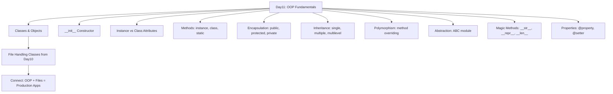

# 🐍 Python Mastery Series — Day 10
## File Handling | CSV | JSON | Data Persistence | Professional Data Processing Systems


---

## 📋 Table of Contents

1. [Complete Revision — Day01–Day09](#section-1)
2. [Introduction to File Handling](#section-2)
3. [File System Fundamentals](#section-3)
4. [open() Function Masterclass](#section-4)
5. [Reading Files Masterclass](#section-5)
6. [Writing Files Masterclass](#section-6)
7. [Context Manager Masterclass](#section-7)
8. [Working with Text Files](#section-8) 
9. [CSV Masterclass](#section-9)
10. [JSON Masterclass](#section-10)
11. [File System Operations](#section-11)
12. [Data Persistence Fundamentals](#section-12)
13. [Data Processing Workflows](#section-13)
14. [File Processing Algorithms](#section-14)
15. [File Handling Best Practices](#section-15)
16. [Debugging File Operations](#section-16)
17. [Mini Projects (10)](#section-17)
18. [20 High-Value Portfolio Projects](#section-18)
19. [Project Layout Masterclass](#section-19)
20. [GitHub Profile Booster Projects](#section-20)
21. [Complete Project Solution Framework](#section-21)
22. [500 Practice Questions](#section-22)
23. [250 Interview Questions](#section-23)
24. [Assignments + Solutions](#section-24)
25. [Enterprise Challenge Projects](#section-25)
26. [Day10 Revision — Cheat Sheets](#section-26)
27. [Preparation for Day11 — OOP](#section-27)

---

<a name="section-1"></a>
## 📚 SECTION 1 — Complete Revision: Day01–Day09

### 1.1 Python Fundamentals Map

```
Python Mastery Journey (Day01 → Day09)
═══════════════════════════════════════════════════════════════
Day01 → Variables, Data Types, Operators, Type Conversion
Day02 → Strings, Input Handling, String Methods, Memory Model
Day03 → Conditional Statements (if/elif/else), Ternary
Day04 → Loops (for/while), Pattern Printing, Loop Control
Day05 → Functions, Recursion, *args/**kwargs, Closures
Day06 → Lists, List Comprehensions, Slicing, Methods
Day07 → Tuples, Sets, Dictionaries, Nested Collections
Day08 → Modules, Packages, pip, Virtual Environments
Day09 → Exception Handling, Logging, Debugging, unittest
═══════════════════════════════════════════════════════════════
```

### 1.2 Day01–Day09 Summary Table

| Day | Core Topic | Key Concepts | Production Use |
|-----|-----------|--------------|----------------|
| 01 | Fundamentals | Variables, int, float, bool, operators | Data types for all programs |
| 02 | Strings | f-strings, slicing, methods, encode/decode | Text processing, NLP preprocessing |
| 03 | Conditionals | if/elif/else, match-case, ternary | Decision trees, routing logic |
| 04 | Loops | for/while, enumerate, zip, break/continue | Iteration over datasets |
| 05 | Functions | def, return, recursion, lambda, decorators | Reusable logic, APIs |
| 06 | Lists | append, pop, sort, comprehensions | Datasets, queues, stacks |
| 07 | Collections | dict, set, tuple, Counter, defaultdict | Key-value stores, deduplication |
| 08 | Modules | import, pip, venv, __init__.py | Dependency management |
| 09 | Exceptions | try/except, logging, pdb, unittest | Production error handling |
| **10** | **Files** | **open, csv, json, pathlib, persistence** | **Data storage, ETL, APIs** |

---

### 1.3 Collections Cheat Sheet

```python
# ─── LIST ───────────────────────────────────────────────
lst = [1, 2, 3]
lst.append(4)          # [1, 2, 3, 4]
lst.extend([5, 6])     # [1, 2, 3, 4, 5, 6]
lst.pop()              # removes last → 6
lst.insert(0, 0)       # insert at index
lst.sort()             # in-place sort
lst.reverse()          # in-place reverse
lst[1:4]               # slicing
[x**2 for x in lst]   # list comprehension

# ─── DICT ───────────────────────────────────────────────
d = {"name": "Baghel", "age": 21}
d["city"] = "Gorakhpur"
d.get("name", "N/A")   # safe get
d.items()              # key-value pairs
d.keys()               # all keys
d.values()             # all values
{k: v for k, v in d.items() if v}  # dict comprehension

# ─── SET ────────────────────────────────────────────────
s = {1, 2, 3}
s.add(4)
s.discard(2)
s1 & s2                # intersection
s1 | s2                # union
s1 - s2                # difference

# ─── TUPLE ──────────────────────────────────────────────
t = (1, 2, 3)
t[0]                   # indexing (immutable)
a, b, c = t            # unpacking
```

---

### 1.4 Exception Handling Cheat Sheet

```python
# Basic structure
try:
    risky_operation()
except ValueError as e:
    print(f"Value error: {e}")
except (TypeError, KeyError) as e:
    print(f"Type/Key error: {e}")
except Exception as e:
    print(f"General error: {e}")
else:
    print("No exception occurred")
finally:
    print("Always runs — cleanup here")

# Custom exception
class DataValidationError(Exception):
    def __init__(self, field, message):
        self.field = field
        super().__init__(f"[{field}] {message}")

# Context manager for errors
from contextlib import suppress
with suppress(FileNotFoundError):
    open("maybe_exists.txt")

# Logging setup
import logging
logging.basicConfig(
    level=logging.DEBUG,
    format="%(asctime)s | %(levelname)s | %(message)s",
    handlers=[
        logging.FileHandler("app.log"),
        logging.StreamHandler()
    ]
)
```

---

### 1.5 Modules Cheat Sheet

```python
import os, sys, math, random, datetime
from pathlib import Path
from collections import Counter, defaultdict, deque
from itertools import chain, groupby
from functools import reduce, lru_cache
import json, csv, re, hashlib, uuid

# Virtual Environment
# python -m venv venv
# source venv/bin/activate   (Linux/Mac)
# venv\Scripts\activate      (Windows)
# pip install package_name
# pip freeze > requirements.txt
# pip install -r requirements.txt
```

---

<a name="section-2"></a>
## 📁 SECTION 2 — Introduction to File Handling

### 2.1 What is a File?

A **file** is a named unit of data stored on a persistent storage medium (hard drive, SSD, cloud storage). Unlike variables that exist only during program execution, files persist data across program runs, system restarts, and even hardware migrations.

**At the Operating System level:**
- A file is a sequence of bytes stored on disk
- Managed by the file system (NTFS, ext4, APFS, FAT32)
- Identified by name, path, size, timestamps, and permissions
- Accessed via file descriptors (integer handles provided by OS)

```
┌─────────────────────────────────────────────────────┐
│                  FILE SYSTEM STACK                  │
├─────────────────────────────────────────────────────┤
│  Python Program   →  open("data.txt", "r")          │
│       ↓                                             │
│  Python Runtime   →  _io.TextIOWrapper              │
│       ↓                                             │
│  OS Kernel        →  sys_open() → file descriptor   │
│       ↓                                             │
│  File System      →  inode lookup → block mapping   │
│       ↓                                             │
│  Storage Device   →  SSD/HDD physical read          │
└─────────────────────────────────────────────────────┘
```

---

### 2.2 Why Files Exist — Persistent vs Temporary Storage

| Feature | Variables (RAM) | Files (Disk) |
|---------|----------------|--------------|
| Persistence | Lost on program exit | Survives restarts |
| Capacity | Limited (GBs) | Massive (TBs) |
| Speed | Nanoseconds | Milliseconds |
| Shareability | Single process | Multiple processes |
| Searchability | Via code only | OS-level tools |
| Backup | Not automatic | OS backup systems |

**Real World File Examples:**

| Domain | File Type | Example |
|--------|-----------|---------|
| Banking | Transaction log | `transactions_2024.csv` |
| AI/ML | Training data | `dataset.jsonl`, `train.csv` |
| Web App | Configuration | `config.json`, `.env` |
| System | Log file | `/var/log/nginx/access.log` |
| Student DB | Records | `students.json` |
| LLM Training | Prompts | `prompts.jsonl` |

---

### 2.3 File Handling Architecture

```
Application Data Lifecycle
─────────────────────────────────────────────────────

  [User Input]  →  [Program Logic]  →  [File Storage]
                                              │
                                    ┌─────────┴─────────-─┐
                                    │    Data Formats     │
                                    ├──────────┬──────────┤
                                    │  .txt    │  .csv    │
                                    │  .json   │  .log    │
                                    │  .xml    │  .yaml   │
                                    └──────────┴──────────┘
```

---

<a name="section-3"></a>
## 🗂️ SECTION 3 — File System Fundamentals

### 3.1 Core Concepts

**File** → A named collection of related data stored on disk.  
**Directory (Folder)** → A container that organizes files and subdirectories.  
**Path** → The address of a file/folder in the file system.  
**Extension** → Suffix indicating file format (`.txt`, `.csv`, `.json`, `.py`).  
**Permissions** → Read (`r`), Write (`w`), Execute (`x`) access controls.  

---

### 3.2 Absolute vs Relative Paths

```
Absolute Path — starts from root
  Linux/Mac:   /home/baghel/projects/data/students.csv
  Windows:     C:\Users\Baghel\projects\data\students.csv

Relative Path — starts from current working directory
  ./data/students.csv         → data/ in current folder
  ../data/students.csv        → data/ in parent folder
  data/students.csv           → same as ./data/students.csv
```

```python
import os
from pathlib import Path

# Current working directory
cwd = os.getcwd()
print(cwd)           # /home/baghel/projects

# Absolute path from relative
abs_path = os.path.abspath("data/students.csv")

# Using pathlib (MODERN, RECOMMENDED)
p = Path("data") / "students.csv"
print(p.resolve())   # full absolute path
print(p.name)        # students.csv
print(p.stem)        # students
print(p.suffix)      # .csv
print(p.parent)      # data
print(p.exists())    # True/False
```

---

### 3.3 Cross-Platform Path Handling

```python
from pathlib import Path
import os

# ❌ BAD — OS-specific
path = "data\\students.csv"    # Windows only

# ✅ GOOD — Cross-platform with pathlib
path = Path("data") / "students.csv"

# ✅ GOOD — Cross-platform with os.path.join
path = os.path.join("data", "students.csv")
```

---

### 3.4 File System Diagram

```
File System Tree
─────────────────────────────────────────────
/home/baghel/projects/
├── day10_project/
│   ├── main.py                ← Python file
│   ├── config/
│   │   └── settings.json      ← JSON config
│   ├── data/
│   │   ├── students.csv       ← CSV data
│   │   └── records.txt        ← Text data
│   ├── logs/
│   │   └── app.log            ← Log file
│   └── output/
│       └── report.json        ← Generated output
─────────────────────────────────────────────
```

---

<a name="section-4"></a>
## 🔓 SECTION 4 — open() Function Masterclass

### 4.1 Syntax & Signature

```python
file_object = open(file, mode='r', buffering=-1, encoding=None,
                   errors=None, newline=None, closefd=True, opener=None)
```

### 4.2 File Modes — Complete Reference

| Mode | Symbol | Create? | Truncate? | Read? | Write? | Pointer Position |
|------|--------|---------|-----------|-------|--------|-----------------|
| Read | `r` | ❌ | ❌ | ✅ | ❌ | Start |
| Write | `w` | ✅ | ✅ | ❌ | ✅ | Start |
| Append | `a` | ✅ | ❌ | ❌ | ✅ | End |
| Exclusive Create | `x` | ✅ (if not exists) | — | ❌ | ✅ | Start |
| Read+Write | `r+` | ❌ | ❌ | ✅ | ✅ | Start |
| Write+Read | `w+` | ✅ | ✅ | ✅ | ✅ | Start |
| Append+Read | `a+` | ✅ | ❌ | ✅ | ✅ | End |

**Binary Modifiers:**

| Mode | Meaning |
|------|---------|
| `rb` | Read binary (images, PDFs, executables) |
| `wb` | Write binary |
| `ab` | Append binary |

---

### 4.3 Mode Deep Dive with Examples

```python
# ── r mode ─────────────────────────────────────────────
# Read-only. File MUST exist. Raises FileNotFoundError if missing.
f = open("data.txt", "r")
content = f.read()
f.close()

# ── w mode ─────────────────────────────────────────────
# Write-only. Creates file if missing. DESTROYS existing content.
f = open("data.txt", "w")
f.write("Hello World")
f.close()
# WARNING: If data.txt had 10,000 lines, they are ALL gone now.

# ── a mode ─────────────────────────────────────────────
# Append-only. Creates file if missing. Preserves existing content.
f = open("log.txt", "a")
f.write("2024-01-01: User logged in\n")
f.close()
# Previous log entries are preserved.

# ── x mode ─────────────────────────────────────────────
# Exclusive create. Raises FileExistsError if file already exists.
try:
    f = open("new_file.txt", "x")
    f.write("Fresh file")
    f.close()
except FileExistsError:
    print("File already exists! Won't overwrite.")

# ── r+ mode ────────────────────────────────────────────
# Read AND write. File MUST exist. Does NOT truncate.
f = open("data.txt", "r+")
original = f.read()
f.seek(0)              # go back to beginning
f.write("UPDATED\n")
f.close()

# ── w+ mode ────────────────────────────────────────────
# Read AND write. Creates if missing. TRUNCATES existing.
f = open("data.txt", "w+")
f.write("New content")
f.seek(0)
content = f.read()
f.close()
```

---

### 4.4 Encoding — Critical for Production

```python
# Always specify encoding explicitly!
f = open("data.txt", "r", encoding="utf-8")   # Standard for most files
f = open("data.txt", "r", encoding="utf-16")  # Windows Unicode
f = open("data.txt", "r", encoding="latin-1") # Legacy European files
f = open("data.txt", "r", encoding="ascii")   # ASCII only

# errors parameter
f = open("data.txt", "r", encoding="utf-8", errors="ignore")   # skip bad chars
f = open("data.txt", "r", encoding="utf-8", errors="replace")  # replace with ?
f = open("data.txt", "r", encoding="utf-8", errors="strict")   # raise exception (default)
```

---

### 4.5 Internal Working of open()

```
open("data.txt", "r") internals:
─────────────────────────────────────────────────────
1. Python calls os.open() → OS syscall open()
2. OS locates file via inode in file system
3. OS checks permissions (read permission required)
4. OS allocates a file descriptor (integer, e.g., 3)
5. Python creates _io.TextIOWrapper object
6. TextIOWrapper wraps BufferedReader wraps FileIO
7. Returns file object to Python program
8. File pointer positioned at byte 0 (start)
─────────────────────────────────────────────────────
Buffer Stack:
  TextIOWrapper (encoding/decoding)
      └── BufferedReader (8KB default buffer)
              └── FileIO (raw OS file descriptor)
─────────────────────────────────────────────────────
```

---

<a name="section-5"></a>
## 📖 SECTION 5 — Reading Files Masterclass

### 5.1 Reading Methods Comparison

```python
# Sample file: students.txt
# Line 1: Alice,90
# Line 2: Bob,85
# Line 3: Charlie,78

# ── read() ─────────────────────────────────────────────
# Reads ENTIRE file as one string
with open("students.txt", "r") as f:
    content = f.read()
    print(content)
# "Alice,90\nBob,85\nCharlie,78\n"
# ⚠️ Danger: Loads entire file into RAM (bad for huge files)

# ── readline() ─────────────────────────────────────────
# Reads ONE line at a time (includes \n)
with open("students.txt", "r") as f:
    line1 = f.readline()   # "Alice,90\n"
    line2 = f.readline()   # "Bob,85\n"
    line3 = f.readline()   # "Charlie,78\n"
    line4 = f.readline()   # "" (empty string = EOF)

# ── readlines() ────────────────────────────────────────
# Reads ALL lines as a list of strings
with open("students.txt", "r") as f:
    lines = f.readlines()
    print(lines)
# ["Alice,90\n", "Bob,85\n", "Charlie,78\n"]

# ── Iteration (BEST for large files) ───────────────────
with open("students.txt", "r") as f:
    for line in f:              # Reads one line at a time from disk
        print(line.strip())     # strip() removes \n

# ── read(n) — Read n characters ────────────────────────
with open("students.txt", "r") as f:
    chunk = f.read(5)   # "Alice"
    chunk = f.read(5)   # ",90\nB"
```

---

### 5.2 Memory-Efficient Reading for Large Files

```python
# Method 1: Line-by-line iteration (Best)
def process_large_file(filepath):
    count = 0
    with open(filepath, "r", encoding="utf-8") as f:
        for line in f:
            process_line(line.strip())
            count += 1
    return count

# Method 2: Chunked reading (for binary or fixed-size data)
def read_in_chunks(filepath, chunk_size=8192):
    with open(filepath, "r", encoding="utf-8") as f:
        while True:
            chunk = f.read(chunk_size)
            if not chunk:
                break
            yield chunk

# Method 3: Generator pattern
def read_lines_generator(filepath):
    with open(filepath, "r", encoding="utf-8") as f:
        for line in f:
            yield line.strip()

# Usage
for line in read_lines_generator("big_dataset.txt"):
    process(line)
```

---

### 5.3 File Pointer Operations

```python
with open("data.txt", "r+") as f:
    f.seek(0)          # Go to beginning
    f.seek(10)         # Go to byte position 10
    f.seek(0, 2)       # Go to END of file (whence=2)
    f.seek(-5, 2)      # 5 bytes before end
    f.seek(3, 1)       # 3 bytes from current position (whence=1)

    pos = f.tell()     # Get current position (byte offset)
    print(f"Cursor at byte: {pos}")
```

---

<a name="section-6"></a>
## ✍️ SECTION 6 — Writing Files Masterclass

### 6.1 write() and writelines()

```python
# ── write() ────────────────────────────────────────────
# Writes a string. Does NOT add newline automatically.
with open("output.txt", "w", encoding="utf-8") as f:
    f.write("Hello, World!\n")
    f.write("Line 2\n")
    f.write("Line 3\n")

# ── writelines() ───────────────────────────────────────
# Writes an iterable of strings. No newlines added automatically!
lines = ["Alice,90\n", "Bob,85\n", "Charlie,78\n"]
with open("students.txt", "w", encoding="utf-8") as f:
    f.writelines(lines)

# ── Appending ──────────────────────────────────────────
with open("log.txt", "a", encoding="utf-8") as f:
    f.write(f"2024-06-09 10:30:00 | INFO | Server started\n")

# ── Safe Atomic Write (Production Pattern) ─────────────
import os
import tempfile

def safe_write(filepath, content):
    """Write to temp file, then rename — atomic operation."""
    dir_path = os.path.dirname(filepath) or "."
    try:
        with tempfile.NamedTemporaryFile(
            mode='w',
            dir=dir_path,
            delete=False,
            encoding='utf-8',
            suffix='.tmp'
        ) as tmp:
            tmp.write(content)
            tmp_path = tmp.name
        os.replace(tmp_path, filepath)  # Atomic rename
        print(f"✅ File written safely: {filepath}")
    except Exception as e:
        if os.path.exists(tmp_path):
            os.remove(tmp_path)
        raise e
```

---

### 6.2 Writing Patterns for Different Use Cases

```python
# Pattern 1: Writing structured records
students = [
    {"name": "Alice", "score": 90},
    {"name": "Bob", "score": 85},
]
with open("report.txt", "w") as f:
    f.write("STUDENT REPORT\n")
    f.write("=" * 30 + "\n")
    for s in students:
        f.write(f"{s['name']:15} | Score: {s['score']}\n")

# Pattern 2: Accumulate then write (efficient)
lines = []
for i in range(10000):
    lines.append(f"Record {i}: data\n")
with open("big_output.txt", "w") as f:
    f.writelines(lines)    # One disk write, not 10,000

# Pattern 3: Write with backup
import shutil
def write_with_backup(filepath, content):
    if os.path.exists(filepath):
        shutil.copy2(filepath, filepath + ".bak")
    with open(filepath, "w", encoding="utf-8") as f:
        f.write(content)
```

---

<a name="section-7"></a>
## 🔧 SECTION 7 — Context Manager Masterclass

### 7.1 Why Context Managers?

```python
# ❌ BAD — Manual file management (resource leak risk)
f = open("data.txt", "r")
content = f.read()
# If exception occurs here, f.close() is NEVER called!
f.close()

# ✅ GOOD — Context Manager (always closes, even on exception)
with open("data.txt", "r") as f:
    content = f.read()
# f is automatically closed here — guaranteed!
```

### 7.2 How Context Managers Work Internally

```python
# The 'with' statement calls:
# 1. __enter__() on entry → returns file object
# 2. __exit__() on exit → calls f.close()

# Equivalent to:
f = open("data.txt", "r")
try:
    content = f.read()
finally:
    f.close()    # Always executes

# Context manager protocol
class FileManager:
    def __init__(self, path, mode):
        self.path = path
        self.mode = mode

    def __enter__(self):
        self.file = open(self.path, self.mode)
        return self.file

    def __exit__(self, exc_type, exc_val, exc_tb):
        self.file.close()
        return False  # Don't suppress exceptions

# Usage
with FileManager("data.txt", "r") as f:
    print(f.read())
```

---

### 7.3 Multiple Files in One Context

```python
# Reading two files simultaneously
with open("input.txt", "r") as infile, open("output.txt", "w") as outfile:
    for line in infile:
        processed = line.strip().upper()
        outfile.write(processed + "\n")

# contextlib.contextmanager decorator
from contextlib import contextmanager

@contextmanager
def managed_file(path, mode="r"):
    print(f"Opening {path}")
    f = open(path, mode)
    try:
        yield f
    finally:
        f.close()
        print(f"Closed {path}")

with managed_file("data.txt") as f:
    print(f.read())
```

---

### 7.4 Custom Context Manager for Timed Operations

```python
import time
from contextlib import contextmanager

@contextmanager
def timed_file_op(operation_name):
    start = time.time()
    try:
        yield
    finally:
        elapsed = time.time() - start
        print(f"⏱ {operation_name} completed in {elapsed:.4f}s")

with timed_file_op("Read large dataset"):
    with open("large_file.csv", "r") as f:
        data = f.read()
```

---

<a name="section-8"></a>
## 📝 SECTION 8 — Working with Text Files

### 8.1 Creating and Editing Text Files

```python
from pathlib import Path
import re

# Create a text file
def create_notes_file(filename, title, content):
    path = Path(filename)
    path.parent.mkdir(parents=True, exist_ok=True)
    with open(path, "w", encoding="utf-8") as f:
        f.write(f"# {title}\n")
        f.write("=" * len(title) + "\n\n")
        f.write(content)
    print(f"✅ Created: {path}")

# Search in a text file
def search_in_file(filepath, query, case_sensitive=False):
    results = []
    flags = 0 if case_sensitive else re.IGNORECASE
    pattern = re.compile(re.escape(query), flags)
    with open(filepath, "r", encoding="utf-8") as f:
        for line_num, line in enumerate(f, 1):
            if pattern.search(line):
                results.append((line_num, line.strip()))
    return results

# Replace text in file
def replace_in_file(filepath, old_text, new_text):
    with open(filepath, "r", encoding="utf-8") as f:
        content = f.read()
    new_content = content.replace(old_text, new_text)
    count = content.count(old_text)
    with open(filepath, "w", encoding="utf-8") as f:
        f.write(new_content)
    print(f"✅ Replaced {count} occurrences of '{old_text}' → '{new_text}'")
```

---

### 8.2 Log File Processing

```python
import re
from datetime import datetime

def parse_log_file(log_path):
    """Parse standard log format: TIMESTAMP | LEVEL | MESSAGE"""
    pattern = r"(\d{4}-\d{2}-\d{2} \d{2}:\d{2}:\d{2}) \| (\w+) \| (.+)"
    entries = []
    with open(log_path, "r", encoding="utf-8") as f:
        for line in f:
            match = re.match(pattern, line.strip())
            if match:
                timestamp, level, message = match.groups()
                entries.append({
                    "timestamp": datetime.strptime(timestamp, "%Y-%m-%d %H:%M:%S"),
                    "level": level,
                    "message": message
                })
    return entries

def log_stats(entries):
    from collections import Counter
    levels = Counter(e["level"] for e in entries)
    print("Log Statistics:")
    for level, count in levels.most_common():
        print(f"  {level:10}: {count}")

# Usage
entries = parse_log_file("app.log")
log_stats(entries)
```

---

### 8.3 Configuration File (INI-style)

```python
import configparser

# Writing config
config = configparser.ConfigParser()
config["database"] = {
    "host": "localhost",
    "port": "5432",
    "name": "myapp_db"
}
config["app"] = {
    "debug": "true",
    "log_level": "INFO"
}
with open("config.ini", "w") as f:
    config.write(f)

# Reading config
config = configparser.ConfigParser()
config.read("config.ini")
db_host = config["database"]["host"]
debug = config.getboolean("app", "debug")
```

---

<a name="section-9"></a>
## 📊 SECTION 9 — CSV Masterclass

### 9.1 What is CSV?

**CSV (Comma-Separated Values)** is a plain-text format for tabular data. Each line = one row. Fields separated by commas (or other delimiters).

```
name,age,city,score
Alice,21,Delhi,92.5
Bob,22,Mumbai,88.0
Charlie,20,Gorakhpur,95.5
```

**Why CSV?**
- Universal — every tool reads it (Excel, Pandas, SQL importers, R)
- Human-readable
- Lightweight
- Perfect for ML datasets, data exchange, exports

---

### 9.2 csv Module — Complete Reference

```python
import csv

# ── READING CSV ─────────────────────────────────────────

# Method 1: Basic reader (returns lists)
with open("students.csv", "r", encoding="utf-8", newline="") as f:
    reader = csv.reader(f)
    header = next(reader)    # Skip header row
    print(f"Columns: {header}")
    for row in reader:
        print(row)           # ['Alice', '21', 'Delhi', '92.5']

# Method 2: DictReader (returns OrderedDicts/dicts) — RECOMMENDED
with open("students.csv", "r", encoding="utf-8", newline="") as f:
    reader = csv.DictReader(f)
    for row in reader:
        print(row["name"], row["score"])  # Access by column name

# ── WRITING CSV ─────────────────────────────────────────

# Method 1: Basic writer
with open("output.csv", "w", encoding="utf-8", newline="") as f:
    writer = csv.writer(f)
    writer.writerow(["name", "age", "score"])     # Header
    writer.writerow(["Alice", 21, 92.5])
    writer.writerows([
        ["Bob", 22, 88.0],
        ["Charlie", 20, 95.5],
    ])

# Method 2: DictWriter — RECOMMENDED
students = [
    {"name": "Alice", "age": 21, "score": 92.5},
    {"name": "Bob",   "age": 22, "score": 88.0},
]
fieldnames = ["name", "age", "score"]
with open("students.csv", "w", encoding="utf-8", newline="") as f:
    writer = csv.DictWriter(f, fieldnames=fieldnames)
    writer.writeheader()
    writer.writerows(students)
```

---

### 9.3 Advanced CSV — Dialects, Custom Delimiters

```python
import csv

# Custom delimiter (TSV — Tab Separated Values)
with open("data.tsv", "r", newline="") as f:
    reader = csv.reader(f, delimiter="\t")
    for row in reader:
        print(row)

# Semicolon-separated (common in Europe)
with open("european_data.csv", "r", newline="") as f:
    reader = csv.reader(f, delimiter=";", quotechar='"')
    for row in reader:
        print(row)

# Register custom dialect
csv.register_dialect(
    "pipes",
    delimiter="|",
    quoting=csv.QUOTE_MINIMAL
)
with open("piped.csv", "r") as f:
    reader = csv.reader(f, dialect="pipes")
    for row in reader:
        print(row)
```

---

### 9.4 Real-World CSV Data Processing

```python
import csv
from collections import defaultdict

def analyze_student_csv(filepath):
    """Complete student dataset analysis."""
    students = []
    with open(filepath, "r", encoding="utf-8", newline="") as f:
        reader = csv.DictReader(f)
        for row in reader:
            try:
                students.append({
                    "name": row["name"].strip(),
                    "score": float(row["score"]),
                    "grade": row.get("grade", "N/A").strip(),
                    "city": row.get("city", "Unknown").strip()
                })
            except (ValueError, KeyError) as e:
                print(f"⚠️ Skipping invalid row: {row} — {e}")

    if not students:
        return None

    scores = [s["score"] for s in students]
    avg = sum(scores) / len(scores)
    top = max(students, key=lambda s: s["score"])
    lowest = min(students, key=lambda s: s["score"])

    # Group by city
    by_city = defaultdict(list)
    for s in students:
        by_city[s["city"]].append(s["score"])

    city_avg = {city: sum(sc)/len(sc) for city, sc in by_city.items()}

    print(f"\n📊 STUDENT ANALYSIS REPORT")
    print(f"{'='*40}")
    print(f"Total Students : {len(students)}")
    print(f"Average Score  : {avg:.2f}")
    print(f"Top Performer  : {top['name']} ({top['score']})")
    print(f"Lowest Score   : {lowest['name']} ({lowest['score']})")
    print(f"\n🌆 City-wise Averages:")
    for city, ca in sorted(city_avg.items(), key=lambda x: -x[1]):
        print(f"  {city:15}: {ca:.2f}")
    return students

analyze_student_csv("students.csv")
```

---

### 9.5 CSV to JSON Conversion

```python
import csv, json

def csv_to_json(csv_path, json_path, encoding="utf-8"):
    records = []
    with open(csv_path, "r", encoding=encoding, newline="") as f:
        reader = csv.DictReader(f)
        for row in reader:
            records.append(dict(row))
    with open(json_path, "w", encoding=encoding) as f:
        json.dump(records, f, indent=2, ensure_ascii=False)
    print(f"✅ Converted {len(records)} records → {json_path}")
    return records

def json_to_csv(json_path, csv_path, encoding="utf-8"):
    with open(json_path, "r", encoding=encoding) as f:
        records = json.load(f)
    if not records:
        print("Empty JSON array!")
        return
    fieldnames = list(records[0].keys())
    with open(csv_path, "w", encoding=encoding, newline="") as f:
        writer = csv.DictWriter(f, fieldnames=fieldnames)
        writer.writeheader()
        writer.writerows(records)
    print(f"✅ Converted {len(records)} records → {csv_path}")
```

---

<a name="section-10"></a>
## 🔵 SECTION 10 — JSON Masterclass

### 10.1 What is JSON?

**JSON (JavaScript Object Notation)** is a lightweight, human-readable data interchange format. It is the universal language of APIs, configuration files, and AI dataset storage.

```json
{
  "name": "Baghel",
  "age": 21,
  "skills": ["Python", "LLM Engineering", "Data Engineering"],
  "address": {
    "city": "Gorakhpur",
    "state": "UP",
    "country": "India"
  },
  "active": true,
  "gpa": 8.5,
  "notes": null
}
```

**JSON Data Types:**

| JSON Type | Python Type | Example |
|-----------|-------------|---------|
| string | str | `"hello"` |
| number | int / float | `42`, `3.14` |
| boolean | bool | `true` / `false` |
| null | None | `null` |
| array | list | `[1, 2, 3]` |
| object | dict | `{"key": "val"}` |

---

### 10.2 json Module — Complete Reference

```python
import json

# ── SERIALIZATION (Python → JSON string) ──────────────
data = {"name": "Alice", "scores": [90, 85, 92], "active": True}

json_str = json.dumps(data)
print(json_str)
# '{"name": "Alice", "scores": [90, 85, 92], "active": true}'

# Pretty print
json_pretty = json.dumps(data, indent=2, sort_keys=True)
print(json_pretty)

# With non-ASCII characters
json_unicode = json.dumps({"city": "Gorakhpur", "lang": "हिंदी"},
                           ensure_ascii=False, indent=2)

# ── DESERIALIZATION (JSON string → Python) ─────────────
json_str = '{"name": "Alice", "score": 90, "active": true}'
python_obj = json.loads(json_str)
print(python_obj["name"])    # Alice
print(type(python_obj))      # <class 'dict'>

# ── FILE I/O ───────────────────────────────────────────

# Write JSON to file
with open("data.json", "w", encoding="utf-8") as f:
    json.dump(data, f, indent=2, ensure_ascii=False)

# Read JSON from file
with open("data.json", "r", encoding="utf-8") as f:
    loaded = json.load(f)
print(loaded["name"])   # Alice
```

---

### 10.3 Handling Complex Python Objects

```python
import json
from datetime import datetime
from decimal import Decimal

# Custom encoder for non-serializable types
class EnhancedJSONEncoder(json.JSONEncoder):
    def default(self, obj):
        if isinstance(obj, datetime):
            return obj.isoformat()
        if isinstance(obj, Decimal):
            return float(obj)
        if isinstance(obj, set):
            return list(obj)
        if hasattr(obj, '__dict__'):
            return obj.__dict__
        return super().default(obj)

data = {
    "timestamp": datetime.now(),
    "amount": Decimal("99.99"),
    "tags": {"python", "json", "data"},
}
json_str = json.dumps(data, cls=EnhancedJSONEncoder, indent=2)
print(json_str)

# Decoder hook for custom loading
def date_decoder(dct):
    for key, value in dct.items():
        if isinstance(value, str):
            try:
                dct[key] = datetime.fromisoformat(value)
            except ValueError:
                pass
    return dct

loaded = json.loads(json_str, object_hook=date_decoder)
```

---

### 10.4 JSON Lines (JSONL) — AI Dataset Format

```python
import json

# Write JSONL (one JSON object per line — used in LLM datasets)
def write_jsonl(filepath, records):
    with open(filepath, "w", encoding="utf-8") as f:
        for record in records:
            f.write(json.dumps(record, ensure_ascii=False) + "\n")

# Read JSONL
def read_jsonl(filepath):
    records = []
    with open(filepath, "r", encoding="utf-8") as f:
        for line in f:
            line = line.strip()
            if line:
                records.append(json.loads(line))
    return records

# Example: LLM training data
training_data = [
    {"prompt": "What is Python?", "completion": "Python is a high-level programming language."},
    {"prompt": "Explain recursion.", "completion": "Recursion is when a function calls itself."},
]
write_jsonl("training_data.jsonl", training_data)
loaded = read_jsonl("training_data.jsonl")
print(f"Loaded {len(loaded)} training examples")
```

---

### 10.5 JSON Schema Validation

```python
# Simple manual validation
def validate_student(data):
    required = ["name", "age", "score"]
    for field in required:
        if field not in data:
            raise ValueError(f"Missing required field: {field}")
    if not isinstance(data["name"], str) or not data["name"].strip():
        raise ValueError("name must be a non-empty string")
    if not isinstance(data["age"], int) or data["age"] < 0 or data["age"] > 150:
        raise ValueError("age must be integer between 0 and 150")
    if not isinstance(data["score"], (int, float)) or not (0 <= data["score"] <= 100):
        raise ValueError("score must be number between 0 and 100")
    return True

# Using jsonschema library (pip install jsonschema)
try:
    import jsonschema
    schema = {
        "type": "object",
        "required": ["name", "age", "score"],
        "properties": {
            "name": {"type": "string", "minLength": 1},
            "age":  {"type": "integer", "minimum": 0, "maximum": 150},
            "score": {"type": "number", "minimum": 0, "maximum": 100}
        }
    }
    jsonschema.validate({"name": "Alice", "age": 21, "score": 92.5}, schema)
    print("✅ Valid!")
except ImportError:
    print("Install jsonschema: pip install jsonschema")
```

---

<a name="section-11"></a>
## 🗄️ SECTION 11 — File System Operations

### 11.1 os Module vs pathlib Module

```
os module      → traditional, procedural, string-based paths
pathlib module → modern, OOP, cross-platform (RECOMMENDED since Python 3.6+)
```

```python
import os
import shutil
from pathlib import Path

# ── DIRECTORY OPERATIONS ───────────────────────────────

# Create directory
os.mkdir("new_folder")              # Single directory
os.makedirs("a/b/c", exist_ok=True) # Nested directories (no error if exists)
Path("x/y/z").mkdir(parents=True, exist_ok=True)   # pathlib equivalent

# List directory contents
items = os.listdir(".")
files = [f for f in os.listdir(".") if os.path.isfile(f)]
dirs  = [d for d in os.listdir(".") if os.path.isdir(d)]

# pathlib iteration
p = Path(".")
all_files = list(p.iterdir())
py_files  = list(p.glob("*.py"))
all_py    = list(p.rglob("**/*.py"))   # Recursive

# ── FILE OPERATIONS ────────────────────────────────────

# Check existence
os.path.exists("file.txt")
Path("file.txt").exists()

# Rename / Move
os.rename("old.txt", "new.txt")
shutil.move("file.txt", "folder/file.txt")
Path("old.txt").rename("new.txt")

# Copy
shutil.copy("src.txt", "dst.txt")           # File only
shutil.copy2("src.txt", "dst.txt")          # File + metadata
shutil.copytree("src_dir/", "dst_dir/")     # Entire directory tree

# Delete
os.remove("file.txt")                  # Delete file
os.rmdir("empty_folder/")             # Delete empty dir
shutil.rmtree("folder_with_files/")   # Delete dir + contents (⚠️ careful!)
Path("file.txt").unlink(missing_ok=True)

# File info
size = os.path.getsize("data.csv")
mtime = os.path.getmtime("data.csv")
stat = Path("data.csv").stat()
print(f"Size: {stat.st_size} bytes")
```

---

### 11.2 pathlib — Modern File Path Operations

```python
from pathlib import Path
import os

# Path construction
base = Path("/home/baghel/projects")
data_dir = base / "data"
file_path = data_dir / "students.csv"

# Path properties
print(file_path.name)        # students.csv
print(file_path.stem)        # students
print(file_path.suffix)      # .csv
print(file_path.parent)      # /home/baghel/projects/data
print(file_path.parts)       # ('/', 'home', 'baghel', 'projects', 'data', 'students.csv')
print(file_path.is_absolute())  # True
print(file_path.is_relative_to(base))  # True

# Path manipulation
new_name = file_path.with_name("graduates.csv")
new_ext = file_path.with_suffix(".json")

# Read/Write directly via pathlib
path = Path("notes.txt")
path.write_text("Hello, World!\n", encoding="utf-8")
content = path.read_text(encoding="utf-8")
print(content)

# Home directory
home = Path.home()
config = home / ".myapp" / "config.json"
config.parent.mkdir(parents=True, exist_ok=True)
```

---

### 11.3 Directory Traversal and File Organization

```python
import shutil
from pathlib import Path
from collections import defaultdict

def organize_files_by_extension(source_dir, target_dir):
    """Organize files into folders by extension."""
    source = Path(source_dir)
    target = Path(target_dir)
    target.mkdir(exist_ok=True)

    moved = defaultdict(int)
    for file in source.rglob("*"):
        if file.is_file():
            ext = file.suffix.lower().lstrip(".") or "no_extension"
            dest_folder = target / ext
            dest_folder.mkdir(exist_ok=True)
            dest_file = dest_folder / file.name
            # Avoid overwrite
            if dest_file.exists():
                dest_file = dest_folder / f"{file.stem}_{file.stat().st_mtime:.0f}{file.suffix}"
            shutil.copy2(file, dest_file)
            moved[ext] += 1

    print("📁 Organization complete:")
    for ext, count in sorted(moved.items()):
        print(f"  .{ext:15} → {count} files")

def get_directory_size(path):
    """Calculate total directory size."""
    total = sum(f.stat().st_size for f in Path(path).rglob("*") if f.is_file())
    for unit in ["B", "KB", "MB", "GB", "TB"]:
        if total < 1024:
            return f"{total:.2f} {unit}"
        total /= 1024
    return f"{total:.2f} PB"
```

---

<a name="section-12"></a>
## 💾 SECTION 12 — Data Persistence Fundamentals

### 12.1 What is Data Persistence?

**Data Persistence** = The ability of data to outlive the program that created it.

```
Persistence Spectrum:
─────────────────────────────────────────────────────────────────
VOLATILE                                              PERSISTENT
─────────────────────────────────────────────────────────────────
CPU Registers → RAM Variables → Files → Databases → Cloud Storage
   (nanosec)     (millisec)    (msec)    (msec)       (seconds)
   Lost on       Lost on       Survives  Survives     Survives
   each cycle    program exit  restarts  crashes      disasters
─────────────────────────────────────────────────────────────────
```

---

### 12.2 Configuration Management System

```python
import json
from pathlib import Path
import os

class ConfigManager:
    """Production-grade JSON configuration manager."""

    DEFAULT_CONFIG = {
        "app_name": "MyApp",
        "version": "1.0.0",
        "debug": False,
        "log_level": "INFO",
        "database": {
            "host": "localhost",
            "port": 5432,
            "name": "app_db"
        },
        "features": {
            "dark_mode": False,
            "notifications": True
        }
    }

    def __init__(self, config_path="config/settings.json"):
        self.config_path = Path(config_path)
        self.config_path.parent.mkdir(parents=True, exist_ok=True)
        self._config = self._load()

    def _load(self):
        if self.config_path.exists():
            try:
                with open(self.config_path, "r", encoding="utf-8") as f:
                    loaded = json.load(f)
                # Merge with defaults
                return {**self.DEFAULT_CONFIG, **loaded}
            except json.JSONDecodeError:
                print("⚠️ Config corrupted, using defaults")
                return self.DEFAULT_CONFIG.copy()
        else:
            self._save(self.DEFAULT_CONFIG)
            return self.DEFAULT_CONFIG.copy()

    def _save(self, config):
        with open(self.config_path, "w", encoding="utf-8") as f:
            json.dump(config, f, indent=2)

    def get(self, key, default=None):
        keys = key.split(".")
        val = self._config
        for k in keys:
            if isinstance(val, dict):
                val = val.get(k, default)
            else:
                return default
        return val

    def set(self, key, value):
        keys = key.split(".")
        config = self._config
        for k in keys[:-1]:
            config = config.setdefault(k, {})
        config[keys[-1]] = value
        self._save(self._config)
        print(f"✅ Config saved: {key} = {value}")

    def reset(self):
        self._config = self.DEFAULT_CONFIG.copy()
        self._save(self._config)
        print("✅ Config reset to defaults")

# Usage
cfg = ConfigManager()
print(cfg.get("database.host"))      # localhost
cfg.set("debug", True)
cfg.set("database.port", 5433)
```

---

### 12.3 State Management — Saving Application State

```python
import json
import os
from pathlib import Path
from datetime import datetime

class AppStateManager:
    """Persist application state across sessions."""

    def __init__(self, state_file="data/app_state.json"):
        self.state_file = Path(state_file)
        self.state_file.parent.mkdir(parents=True, exist_ok=True)
        self.state = self.load()

    def load(self):
        if self.state_file.exists():
            with open(self.state_file, "r") as f:
                return json.load(f)
        return {
            "last_run": None,
            "session_count": 0,
            "user_preferences": {},
            "recent_files": []
        }

    def save(self):
        self.state["last_run"] = datetime.now().isoformat()
        self.state["session_count"] += 1
        with open(self.state_file, "w") as f:
            json.dump(self.state, f, indent=2)

    def add_recent_file(self, filepath, max_recent=10):
        recent = self.state.get("recent_files", [])
        if filepath in recent:
            recent.remove(filepath)
        recent.insert(0, filepath)
        self.state["recent_files"] = recent[:max_recent]

    def set_preference(self, key, value):
        self.state.setdefault("user_preferences", {})[key] = value
```

---

<a name="section-13"></a>
## 🔄 SECTION 13 — Data Processing Workflows

### 13.1 ETL Pipeline — Extract, Transform, Load

```python
import csv
import json
from pathlib import Path
from datetime import datetime

class DataPipeline:
    """Production-grade file-based ETL pipeline."""

    def __init__(self, source_path, output_dir="output"):
        self.source = Path(source_path)
        self.output_dir = Path(output_dir)
        self.output_dir.mkdir(exist_ok=True)
        self.stats = {"extracted": 0, "transformed": 0, "failed": 0, "loaded": 0}

    def extract_csv(self):
        """Step 1: Extract raw records."""
        records = []
        with open(self.source, "r", encoding="utf-8", newline="") as f:
            for row in csv.DictReader(f):
                records.append(dict(row))
                self.stats["extracted"] += 1
        print(f"✅ Extracted {self.stats['extracted']} records")
        return records

    def transform(self, records):
        """Step 2: Clean, validate, transform."""
        cleaned = []
        for record in records:
            try:
                transformed = {
                    "id": record.get("id", "").strip(),
                    "name": record["name"].strip().title(),
                    "score": float(record["score"]),
                    "grade": self._assign_grade(float(record["score"])),
                    "processed_at": datetime.now().isoformat()
                }
                if not transformed["name"]:
                    raise ValueError("Empty name")
                cleaned.append(transformed)
                self.stats["transformed"] += 1
            except (ValueError, KeyError) as e:
                self.stats["failed"] += 1
                print(f"⚠️ Failed: {record} → {e}")
        print(f"✅ Transformed {self.stats['transformed']} | Failed {self.stats['failed']}")
        return cleaned

    def _assign_grade(self, score):
        if score >= 90: return "A"
        elif score >= 80: return "B"
        elif score >= 70: return "C"
        elif score >= 60: return "D"
        return "F"

    def load_json(self, records):
        """Step 3: Save to JSON."""
        output_path = self.output_dir / f"processed_{datetime.now():%Y%m%d_%H%M%S}.json"
        with open(output_path, "w", encoding="utf-8") as f:
            json.dump({
                "metadata": {
                    "source": str(self.source),
                    "processed_at": datetime.now().isoformat(),
                    "stats": self.stats
                },
                "records": records
            }, f, indent=2)
        self.stats["loaded"] = len(records)
        print(f"✅ Loaded {len(records)} records → {output_path}")
        return output_path

    def run(self):
        """Execute full pipeline."""
        print(f"\n🚀 Starting pipeline: {self.source.name}")
        raw = self.extract_csv()
        clean = self.transform(raw)
        output = self.load_json(clean)
        print(f"\n📊 Pipeline complete: {self.stats}")
        return output

# Usage
pipeline = DataPipeline("data/students_raw.csv", "output/")
pipeline.run()
```

---

<a name="section-14"></a>
## 🔍 SECTION 14 — File Processing Algorithms

### 14.1 Search, Filter, Sort, Aggregate

```python
import csv
import json
from pathlib import Path

def search_records(filepath, field, query, case_sensitive=False):
    """Search records by field value."""
    results = []
    with open(filepath, "r", encoding="utf-8", newline="") as f:
        for row in csv.DictReader(f):
            val = row.get(field, "")
            match = query in val if case_sensitive else query.lower() in val.lower()
            if match:
                results.append(dict(row))
    return results

def filter_records(filepath, conditions):
    """Filter: conditions = {"score__gte": 80, "city": "Delhi"}"""
    results = []
    with open(filepath, "r", encoding="utf-8", newline="") as f:
        for row in csv.DictReader(f):
            match = True
            for key, value in conditions.items():
                if "__" in key:
                    field, op = key.rsplit("__", 1)
                    row_val = float(row.get(field, 0))
                    if op == "gte" and not (row_val >= float(value)): match = False
                    elif op == "lte" and not (row_val <= float(value)): match = False
                    elif op == "gt"  and not (row_val > float(value)):  match = False
                    elif op == "lt"  and not (row_val < float(value)):  match = False
                else:
                    if row.get(key, "").lower() != str(value).lower(): match = False
            if match:
                results.append(dict(row))
    return results

def aggregate_csv(filepath, group_field, agg_field, func="avg"):
    """Group by field and aggregate."""
    from collections import defaultdict
    groups = defaultdict(list)
    with open(filepath, "r", encoding="utf-8", newline="") as f:
        for row in csv.DictReader(f):
            try:
                groups[row[group_field]].append(float(row[agg_field]))
            except (KeyError, ValueError):
                pass
    result = {}
    for key, values in groups.items():
        if func == "avg":   result[key] = sum(values) / len(values)
        elif func == "sum": result[key] = sum(values)
        elif func == "max": result[key] = max(values)
        elif func == "min": result[key] = min(values)
        elif func == "count": result[key] = len(values)
    return dict(sorted(result.items(), key=lambda x: -x[1]))
```

---

### 14.2 Log Analysis Algorithm

```python
import re
from collections import Counter
from datetime import datetime

def analyze_log_file(log_path):
    """Comprehensive log file analyzer."""
    pattern = re.compile(
        r'(\d{4}-\d{2}-\d{2} \d{2}:\d{2}:\d{2})\s+\|\s+(\w+)\s+\|\s+(.*)'
    )
    entries = []
    error_messages = []

    with open(log_path, "r", encoding="utf-8") as f:
        for line_num, line in enumerate(f, 1):
            m = pattern.match(line.strip())
            if m:
                ts, level, msg = m.groups()
                entries.append({
                    "line": line_num,
                    "timestamp": datetime.strptime(ts, "%Y-%m-%d %H:%M:%S"),
                    "level": level,
                    "message": msg
                })
                if level in ("ERROR", "CRITICAL"):
                    error_messages.append(msg)

    level_counts = Counter(e["level"] for e in entries)
    top_errors = Counter(error_messages).most_common(5)

    report = {
        "total_entries": len(entries),
        "level_breakdown": dict(level_counts),
        "top_errors": top_errors,
        "time_range": {
            "start": entries[0]["timestamp"].isoformat() if entries else None,
            "end": entries[-1]["timestamp"].isoformat() if entries else None
        }
    }
    return report
```

---

<a name="section-15"></a>
## ✅ SECTION 15 — File Handling Best Practices

### 15.1 The Golden Rules

```python
# ✅ Rule 1: Always use context managers
with open("file.txt", "r") as f:
    content = f.read()

# ✅ Rule 2: Always specify encoding
with open("file.txt", "r", encoding="utf-8") as f:
    content = f.read()

# ✅ Rule 3: Use pathlib for paths
from pathlib import Path
path = Path("data") / "students.csv"

# ✅ Rule 4: Handle exceptions
try:
    with open(path, "r", encoding="utf-8") as f:
        data = f.read()
except FileNotFoundError:
    print(f"File not found: {path}")
except PermissionError:
    print(f"Permission denied: {path}")
except UnicodeDecodeError:
    print(f"Encoding error: try utf-16 or latin-1")

# ✅ Rule 5: Use newline="" for CSV
with open("data.csv", "r", newline="") as f:
    reader = csv.reader(f)

# ✅ Rule 6: Atomic writes for critical data
import tempfile, os
def atomic_write(path, content):
    dir_ = os.path.dirname(path) or "."
    with tempfile.NamedTemporaryFile("w", dir=dir_, delete=False,
                                     suffix=".tmp", encoding="utf-8") as tmp:
        tmp.write(content)
        tmp_name = tmp.name
    os.replace(tmp_name, path)

# ✅ Rule 7: Validate before processing
def safe_load_json(path):
    path = Path(path)
    if not path.exists():
        raise FileNotFoundError(f"{path} not found")
    if path.stat().st_size == 0:
        raise ValueError(f"{path} is empty")
    with open(path, "r", encoding="utf-8") as f:
        return json.load(f)

# ✅ Rule 8: Create backups before overwriting
import shutil
def write_with_backup(path, content):
    path = Path(path)
    if path.exists():
        backup = path.with_suffix(f".bak{path.suffix}")
        shutil.copy2(path, backup)
    with open(path, "w", encoding="utf-8") as f:
        f.write(content)

# ✅ Rule 9: Large file reading via iteration
with open("large_file.csv", "r", encoding="utf-8") as f:
    for line in f:              # NOT f.read() or f.readlines()
        process(line.strip())

# ✅ Rule 10: Log all file operations
import logging
logger = logging.getLogger(__name__)
def log_file_op(path, operation):
    logger.info(f"{operation}: {path} ({Path(path).stat().st_size if Path(path).exists() else 'N/A'} bytes)")
```

---

<a name="section-16"></a>
## 🐛 SECTION 16 — Debugging File Operations

### 16.1 Common Errors & Solutions

```python
import json
import csv
from pathlib import Path

# ── FileNotFoundError ──────────────────────────────────
try:
    with open("missing.txt") as f:
        data = f.read()
except FileNotFoundError as e:
    print(f"❌ {e}")
    print(f"  CWD: {Path.cwd()}")
    print(f"  Does parent exist? {Path('missing.txt').parent.exists()}")

# ── PermissionError ────────────────────────────────────
try:
    with open("/etc/shadow", "r") as f:
        data = f.read()
except PermissionError as e:
    print(f"❌ Permission denied: {e}")
    print("  Try: check os.access(path, os.R_OK)")
    import os
    print(f"  Readable? {os.access('/etc/shadow', os.R_OK)}")

# ── UnicodeDecodeError ─────────────────────────────────
def smart_open(path):
    """Try multiple encodings."""
    encodings = ["utf-8", "utf-16", "latin-1", "cp1252"]
    for enc in encodings:
        try:
            with open(path, "r", encoding=enc) as f:
                content = f.read()
            print(f"✅ Successfully read with {enc}")
            return content
        except UnicodeDecodeError:
            continue
    raise UnicodeDecodeError(f"Could not decode {path} with any known encoding")

# ── JSON Decode Error ──────────────────────────────────
def safe_json_load(path):
    with open(path, "r", encoding="utf-8") as f:
        raw = f.read()
    try:
        return json.loads(raw)
    except json.JSONDecodeError as e:
        print(f"❌ JSON Error at line {e.lineno}, col {e.colno}: {e.msg}")
        lines = raw.splitlines()
        if e.lineno <= len(lines):
            print(f"  Problematic line: {lines[e.lineno - 1]!r}")
        raise

# ── CSV Inconsistency ──────────────────────────────────
def safe_csv_read(path):
    records = []
    with open(path, "r", encoding="utf-8", newline="") as f:
        reader = csv.DictReader(f)
        expected_fields = reader.fieldnames
        for i, row in enumerate(reader, 1):
            if None in row:
                print(f"⚠️ Row {i} has extra fields: {row}")
            if any(v is None for v in row.values()):
                print(f"⚠️ Row {i} has missing fields: {row}")
            records.append(dict(row))
    return records
```

---

<a name="section-17"></a>
## 🛠️ SECTION 17 — Mini Projects (10 Complete)

### Project 1: Notes Manager

```python
"""
Notes Manager — Create, Read, Update, Delete text notes.
Uses JSON for storage, supports tags and search.
"""
import json
from pathlib import Path
from datetime import datetime

class NotesManager:
    def __init__(self, storage="data/notes.json"):
        self.path = Path(storage)
        self.path.parent.mkdir(exist_ok=True)
        self.notes = self._load()

    def _load(self):
        if self.path.exists() and self.path.stat().st_size > 0:
            with open(self.path, "r", encoding="utf-8") as f:
                return json.load(f)
        return []

    def _save(self):
        with open(self.path, "w", encoding="utf-8") as f:
            json.dump(self.notes, f, indent=2, ensure_ascii=False)

    def add(self, title, content, tags=None):
        note = {
            "id": len(self.notes) + 1,
            "title": title.strip(),
            "content": content.strip(),
            "tags": tags or [],
            "created": datetime.now().isoformat(),
            "updated": datetime.now().isoformat()
        }
        self.notes.append(note)
        self._save()
        print(f"✅ Note #{note['id']} added: '{title}'")
        return note

    def list_all(self):
        if not self.notes:
            print("📭 No notes found.")
            return
        print(f"\n📝 NOTES ({len(self.notes)} total)")
        print("─" * 50)
        for n in self.notes:
            tags = ", ".join(n["tags"]) if n["tags"] else "none"
            print(f"  #{n['id']:3d} | {n['title'][:30]:30} | Tags: {tags}")

    def search(self, query):
        results = [n for n in self.notes if
                   query.lower() in n["title"].lower() or
                   query.lower() in n["content"].lower()]
        print(f"\n🔍 Found {len(results)} note(s) for '{query}':")
        for n in results:
            print(f"  #{n['id']}: {n['title']}")
        return results

    def delete(self, note_id):
        before = len(self.notes)
        self.notes = [n for n in self.notes if n["id"] != note_id]
        if len(self.notes) < before:
            self._save()
            print(f"✅ Deleted note #{note_id}")
        else:
            print(f"❌ Note #{note_id} not found")

# Demo
if __name__ == "__main__":
    nm = NotesManager()
    nm.add("Python Day10", "File handling, CSV, JSON mastery.", tags=["python", "day10"])
    nm.add("LLM Notes", "Transformer architecture study notes.", tags=["ai", "llm"])
    nm.list_all()
    nm.search("python")
```

---

### Project 2: Todo File System

```python
"""
Todo File System — Persistent task manager using JSON.
Features: add, complete, delete, priority, due dates.
"""
import json
from pathlib import Path
from datetime import datetime

class TodoManager:
    def __init__(self, filepath="data/todos.json"):
        self.path = Path(filepath)
        self.path.parent.mkdir(exist_ok=True)
        self.todos = self._load()

    def _load(self):
        if self.path.exists():
            try:
                with open(self.path) as f:
                    return json.load(f)
            except: pass
        return []

    def _save(self):
        with open(self.path, "w") as f:
            json.dump(self.todos, f, indent=2)

    def add(self, task, priority="medium", due=None):
        todo = {
            "id": max((t["id"] for t in self.todos), default=0) + 1,
            "task": task,
            "priority": priority,
            "due": due,
            "done": False,
            "created": datetime.now().isoformat()
        }
        self.todos.append(todo)
        self._save()
        print(f"✅ Added: [{todo['id']}] {task} ({priority})")

    def complete(self, todo_id):
        for t in self.todos:
            if t["id"] == todo_id:
                t["done"] = True
                t["completed_at"] = datetime.now().isoformat()
                self._save()
                print(f"✅ Completed: [{todo_id}] {t['task']}")
                return
        print(f"❌ Todo #{todo_id} not found")

    def show(self, filter_done=None):
        items = self.todos
        if filter_done is not None:
            items = [t for t in items if t["done"] == filter_done]
        priority_order = {"high": 0, "medium": 1, "low": 2}
        items = sorted(items, key=lambda x: priority_order.get(x["priority"], 3))
        print(f"\n📋 TODO LIST ({len(items)} items)")
        print("─" * 60)
        for t in items:
            status = "✅" if t["done"] else "⬜"
            due = f" [Due: {t['due']}]" if t.get("due") else ""
            print(f"  {status} [{t['id']:3d}] {t['task'][:40]:40} {t['priority']:6}{due}")
```

---

### Project 3: Expense Tracker

```python
"""
Expense Tracker — Track expenses in CSV, generate JSON reports.
"""
import csv
import json
from pathlib import Path
from datetime import datetime
from collections import defaultdict

class ExpenseTracker:
    FIELDS = ["id", "date", "category", "description", "amount", "currency"]

    def __init__(self, filepath="data/expenses.csv"):
        self.path = Path(filepath)
        self.path.parent.mkdir(exist_ok=True)
        if not self.path.exists():
            with open(self.path, "w", newline="") as f:
                csv.DictWriter(f, self.FIELDS).writeheader()

    def add(self, category, description, amount, currency="INR"):
        expenses = self._load()
        new_id = max((int(e["id"]) for e in expenses), default=0) + 1
        record = {
            "id": new_id,
            "date": datetime.now().strftime("%Y-%m-%d"),
            "category": category,
            "description": description,
            "amount": float(amount),
            "currency": currency
        }
        with open(self.path, "a", newline="") as f:
            csv.DictWriter(f, self.FIELDS).writerow(record)
        print(f"✅ Added: {category} — {description} = {amount} {currency}")

    def _load(self):
        with open(self.path, "r", newline="") as f:
            return [dict(r) for r in csv.DictReader(f)]

    def summary(self):
        expenses = self._load()
        if not expenses:
            print("No expenses recorded.")
            return

        total = sum(float(e["amount"]) for e in expenses)
        by_cat = defaultdict(float)
        for e in expenses:
            by_cat[e["category"]] += float(e["amount"])

        print(f"\n💰 EXPENSE SUMMARY")
        print(f"{'='*40}")
        print(f"Total: {total:,.2f}")
        print(f"\nBy Category:")
        for cat, amt in sorted(by_cat.items(), key=lambda x: -x[1]):
            pct = (amt/total)*100
            print(f"  {cat:20}: {amt:10,.2f} ({pct:.1f}%)")
```

---

### Project 4: Contact Book

```python
"""
Contact Book — Persistent contacts using JSON.
"""
import json
from pathlib import Path

class ContactBook:
    def __init__(self, filepath="data/contacts.json"):
        self.path = Path(filepath)
        self.path.parent.mkdir(exist_ok=True)
        self.contacts = self._load()

    def _load(self):
        if self.path.exists():
            with open(self.path) as f: return json.load(f)
        return {}

    def _save(self):
        with open(self.path, "w") as f:
            json.dump(self.contacts, f, indent=2)

    def add(self, name, phone, email="", city=""):
        key = name.lower().replace(" ", "_")
        self.contacts[key] = {"name": name, "phone": phone, "email": email, "city": city}
        self._save()
        print(f"✅ Contact saved: {name}")

    def search(self, query):
        q = query.lower()
        results = {k: v for k, v in self.contacts.items()
                   if q in v["name"].lower() or q in v.get("city", "").lower()}
        for k, c in results.items():
            print(f"  📞 {c['name']} | {c['phone']} | {c.get('city', '')}")
        return results

    def list_all(self):
        print(f"\n📚 CONTACTS ({len(self.contacts)} total)")
        for c in sorted(self.contacts.values(), key=lambda x: x["name"]):
            print(f"  {c['name']:20} | {c['phone']:15} | {c.get('email', '')}")
```

---

### Project 5: Log File Analyzer

```python
"""
Log File Analyzer — Parse log files, generate statistics and report.
"""
import re
import json
from pathlib import Path
from collections import Counter
from datetime import datetime

class LogAnalyzer:
    PATTERN = re.compile(
        r'(\d{4}-\d{2}-\d{2} \d{2}:\d{2}:\d{2})\s+\|\s+(\w+)\s+\|\s+(.*)'
    )

    def __init__(self, log_path):
        self.path = Path(log_path)

    def parse(self):
        entries = []
        with open(self.path, "r", encoding="utf-8") as f:
            for line in f:
                m = self.PATTERN.match(line.strip())
                if m:
                    ts, lvl, msg = m.groups()
                    entries.append({"timestamp": ts, "level": lvl, "message": msg})
        return entries

    def report(self):
        entries = self.parse()
        levels = Counter(e["level"] for e in entries)
        errors = [e for e in entries if e["level"] in ("ERROR", "CRITICAL")]
        top_errors = Counter(e["message"] for e in errors).most_common(5)

        print(f"\n📊 LOG ANALYSIS: {self.path.name}")
        print(f"Total entries : {len(entries)}")
        print(f"\nLevel Breakdown:")
        for lvl, cnt in levels.most_common():
            bar = "█" * min(cnt, 50)
            print(f"  {lvl:10}: {cnt:5d}  {bar}")
        if top_errors:
            print(f"\nTop Errors:")
            for msg, cnt in top_errors:
                print(f"  [{cnt:3d}x] {msg[:60]}")
        return {"total": len(entries), "levels": dict(levels), "top_errors": top_errors}
```

---

### Projects 6–10: Summary Code Stubs

```python
# ── Project 6: CSV Student Analyzer ────────────────────
# Full implementation in Section 9.4 above
# Features: load CSV, calculate stats, grade distribution, city-wise performance

# ── Project 7: JSON Configuration Manager ──────────────
# Full implementation in Section 12.2 above
# Features: nested config, dot-notation access, defaults, auto-create

# ── Project 8: Text Search Utility ─────────────────────
def text_search(directory, query, extension="*.txt"):
    results = {}
    for path in Path(directory).rglob(extension):
        matches = []
        with open(path, "r", encoding="utf-8", errors="ignore") as f:
            for i, line in enumerate(f, 1):
                if query.lower() in line.lower():
                    matches.append((i, line.strip()))
        if matches:
            results[str(path)] = matches
    for filepath, hits in results.items():
        print(f"\n📄 {filepath}")
        for line_no, text in hits:
            print(f"  Line {line_no:4d}: {text[:80]}")
    return results

# ── Project 9: Password Vault (Educational - Hashed) ───
import hashlib, secrets
def hash_password(password):
    salt = secrets.token_hex(16)
    hashed = hashlib.pbkdf2_hmac("sha256", password.encode(), salt.encode(), 100000)
    return salt + ":" + hashed.hex()
# NOTE: In production, use bcrypt or argon2

# ── Project 10: Data Backup Utility ────────────────────
import shutil
from datetime import datetime
def backup_directory(source, backup_root="backups"):
    ts = datetime.now().strftime("%Y%m%d_%H%M%S")
    dest = Path(backup_root) / f"{Path(source).name}_{ts}"
    shutil.copytree(source, dest)
    print(f"✅ Backup created: {dest}")
    return dest
```

---

<a name="section-18"></a>
## 🏆 SECTION 18 — 20 High-Value Portfolio Projects

### Project 1: Personal Knowledge Base

**Overview:** A file-based personal wiki/knowledge management system.

**Real World Usage:** Note-taking apps, Obsidian-like systems, researcher workflows.

**Resume Value:** Demonstrates data organization, search, persistence, CLI design.

**Architecture:**
```
knowledge-base/
├── src/
│   ├── core/            # KnowledgeBase engine
│   ├── storage/         # JSON/file persistence layer
│   ├── search/          # Full-text search engine
│   └── exporters/       # Markdown/HTML exporters
├── data/
│   ├── notes/           # Individual .json note files
│   ├── tags/            # tag_index.json
│   └── backups/         # Auto-backups
├── config/settings.json
├── logs/
├── tests/
├── requirements.txt
└── README.md
```

**Data Storage Design:**
```json
{
  "id": "note_001",
  "title": "Python File Handling",
  "content": "...",
  "tags": ["python", "files", "day10"],
  "links": ["note_002"],
  "created": "2024-06-09T10:00:00",
  "updated": "2024-06-09T12:00:00",
  "version": 3
}
```

**Development Plan:**
1. MVP: CRUD notes to JSON files, search by title
2. V2: Tag system, full-text search, link between notes
3. V3: Export to Markdown, CLI interface, auto-backup
4. V4: REST API layer
5. Future: SQLite backend, vector search, LLM summaries

---

### Project 2: Research Notes Manager

**Overview:** Academic paper annotation and research notes system.

**Architecture:** Similar to Knowledge Base but with `paper_id → PDF annotation + notes` linking.

**MVP Features:** Import paper metadata (title/author/year), add notes per paper, export to BibTeX.

**Future AI Integration:** Auto-summarize papers using LLM API, keyword extraction.

---

### Project 3: Dataset Processing Framework

**Overview:** A reusable pipeline for cleaning, transforming, and exporting CSV/JSON datasets.

```
dataset-processor/
├── src/
│   ├── readers/         # CSV, JSON, JSONL readers
│   ├── transformers/    # Clean, normalize, validate
│   ├── validators/      # Schema validation
│   └── writers/         # CSV, JSON, Parquet writers
├── config/
│   └── pipeline.json    # Pipeline configuration
├── data/
│   ├── raw/
│   ├── processed/
│   └── rejected/        # Invalid records
└── reports/
```

**Future:** Migrate to Pandas/Polars for large datasets. Add Airflow orchestration.

---

### Project 4: Log Analytics Engine

**Overview:** Parse, aggregate, and visualize log files from any application.

**Features:** Multi-format log parsing, real-time tailing, alert on error spikes, daily reports.

**Resume Value:** Demonstrates regex, file streaming, data aggregation — all DevOps-relevant.

**Future AI:** Anomaly detection via LLM, auto-root-cause suggestions.

---

### Projects 5–20: Architecture Summary

| # | Project | Key Stack | Resume Keywords |
|---|---------|-----------|-----------------|
| 5 | Resume Parser | txt/PDF text extraction | NLP, text processing |
| 6 | Document Manager | pathlib, metadata JSON | file organization |
| 7 | Student ERP Storage | CSV + JSON hybrid | CRUD, persistence |
| 8 | Expense Analytics | CSV + reports | data analysis, finance |
| 9 | File Organizer Pro | pathlib, shutil | automation, OS operations |
| 10 | Backup & Recovery | shutil, zipfile, schedule | DevOps, reliability |
| 11 | AI Dataset Repository | JSONL, schema validation | LLM training data |
| 12 | JSON Config Platform | nested config, env vars | configuration management |
| 13 | Research Dataset Cleaner | ETL, pandas-free | data engineering |
| 14 | Report Generator | template + data → HTML/MD | reporting, Jinja2 |
| 15 | Document Search Engine | inverted index files | IR, search |
| 16 | Learning Notes System | structured markdown | knowledge management |
| 17 | Personal CRM Storage | contact + interaction logs | CRM, data modeling |
| 18 | Business Records | multi-entity file DB | business logic |
| 19 | Dataset Audit Platform | diff, checksums, metadata | data governance |
| 20 | Developer Productivity Vault | snippets, templates, configs | developer tools |

---

<a name="section-19"></a>
## 📐 SECTION 19 — Project Layout Masterclass

### Standard Professional Layout

```
my-project/
│
├── src/                      ← All source code
│   ├── __init__.py
│   ├── core/                 ← Business logic
│   │   ├── __init__.py
│   │   └── engine.py
│   ├── storage/              ← File I/O layer
│   │   ├── __init__.py
│   │   ├── json_store.py
│   │   └── csv_store.py
│   ├── processors/           ← Transform/clean data
│   │   ├── __init__.py
│   │   └── pipeline.py
│   ├── exporters/            ← Output formatters
│   │   ├── __init__.py
│   │   └── report.py
│   └── validators/           ← Input validation
│       ├── __init__.py
│       └── schemas.py
│
├── data/                     ← Runtime data (gitignored)
│   ├── raw/                  ← Input data
│   ├── processed/            ← Cleaned data
│   ├── exports/              ← Generated outputs
│   └── backups/              ← Automatic backups
│
├── config/                   ← Configuration files
│   ├── settings.json
│   └── logging.conf
│
├── logs/                     ← Application logs (gitignored)
│   └── app.log
│
├── tests/                    ← Test suite
│   ├── __init__.py
│   ├── test_storage.py
│   └── test_processors.py
│
├── docs/                     ← Documentation
│   ├── README.md
│   ├── API.md
│   └── CONTRIBUTING.md
│
├── scripts/                  ← Utility scripts
│   └── setup_data.py
│
├── .gitignore
├── requirements.txt
├── requirements-dev.txt
├── setup.py (or pyproject.toml)
└── README.md
```

### Folder Responsibilities

| Folder | Purpose | Contains |
|--------|---------|----------|
| `src/core/` | Business rules, main logic | Domain models, orchestrators |
| `src/storage/` | All file I/O | Readers, writers, serializers |
| `src/processors/` | Data transformation | ETL steps, cleaners, validators |
| `src/exporters/` | Output generation | Report builders, format converters |
| `data/raw/` | Untouched input data | Original CSV/JSON files |
| `data/processed/` | Cleaned data | Transformed, validated datasets |
| `config/` | App configuration | JSON configs, INI files |
| `logs/` | Runtime logs | Rotated log files |
| `tests/` | Quality assurance | Unit tests, integration tests |

---

### .gitignore Template for Data Projects

```gitignore
# Python
__pycache__/
*.py[cod]
*.egg
dist/
build/
*.egg-info/
.eggs/

# Virtual Environment
venv/
.venv/
env/

# Data (usually large/sensitive)
data/raw/
data/processed/
data/exports/
*.csv
*.jsonl
!data/samples/*.csv

# Logs
logs/
*.log

# Config (may contain secrets)
config/secrets.json
.env
*.env

# IDE
.idea/
.vscode/
*.swp
.DS_Store

# Backups
*.bak
backups/
```

---

<a name="section-20"></a>
## 🌟 SECTION 20 — GitHub Profile Booster Projects

| # | Project | Recruiter Appeal | Skills Shown | SaaS Potential |
|---|---------|-----------------|--------------|----------------|
| 1 | **AI Dataset Repository** | ML Engineers, LLM teams | JSONL, schema, versioning | Dataset hosting platform |
| 2 | **Log Analytics Framework** | DevOps, SRE, Backend | regex, aggregation, alerting | Log monitoring SaaS |
| 3 | **Research Notes Manager** | Academic tech, R&D | full-text search, metadata | Academic knowledge tool |
| 4 | **File Automation Suite** | DevOps, automation roles | pathlib, shutil, scheduling | File management SaaS |
| 5 | **Personal Knowledge Vault** | Productivity tools | graph linking, search | Obsidian competitor |
| 6 | **Dataset Audit Platform** | Data Engineering | checksums, diff, lineage | Data quality SaaS |
| 7 | **Document Search Engine** | Search / Backend | inverted index, ranking | Enterprise search |
| 8 | **JSON Config Manager** | DevOps, Full Stack | env vars, validation | Config management SaaS |
| 9 | **Learning Knowledge Base** | EdTech, productivity | tags, progress tracking | LMS component |
| 10 | **Productivity Data Hub** | General tech | multi-format, dashboard | Personal productivity app |

---

**README Template for GitHub:**

```markdown
# 🗂️ AI Dataset Repository

> Production-grade tool for managing, versioning, and auditing LLM training datasets.

## ✨ Features
- JSONL / CSV / JSON dataset management
- Schema validation with detailed error reports
- Dataset versioning and change tracking
- Automated data quality reports
- CLI interface for CI/CD integration

## 🚀 Quick Start
```bash
pip install -r requirements.txt
python main.py --dataset data/training.jsonl --validate --report
```

## 📊 Demo
[Screenshot or GIF here]

## 🛠️ Tech Stack
Python 3.11 | pathlib | json | csv | argparse | logging

## 🔭 Roadmap
- [ ] SQLite backend migration
- [ ] REST API
- [ ] LLM-powered auto-labeling
```

---

<a name="section-21"></a>
## 🎯 SECTION 21 — Complete Project Solution Framework

### Problem → Solution Workflow

```
1. PROBLEM ANALYSIS
   ┌─────────────────────────────────────────────┐
   │ What data needs to be stored?               │
   │ How often is it read vs written?            │
   │ What is the data volume?                    │
   │ Who are the users of this data?             │
   │ What queries/operations are needed?         │
   └─────────────────────────────────────────────┘
           ↓
2. STORAGE DESIGN
   ┌─────────────────────────────────────────────┐
   │ Choose format: JSON (rich), CSV (tabular)   │
   │ Define schema (fields, types, constraints)  │
   │ Plan file structure (one file vs many)      │
   │ Design naming conventions                   │
   └─────────────────────────────────────────────┘
           ↓
3. FOLDER PLANNING
   ┌─────────────────────────────────────────────┐
   │ src/ → code | data/ → files | logs/ → logs  │
   │ config/ → settings | tests/ → tests         │
   └─────────────────────────────────────────────┘
           ↓
4. DATA MODELING
   ┌─────────────────────────────────────────────┐
   │ Design record structure (JSON schema)       │
   │ Define IDs, timestamps, relationships       │
   │ Plan serialization/deserialization          │
   └─────────────────────────────────────────────┘
           ↓
5. IMPLEMENTATION
   ┌─────────────────────────────────────────────┐
   │ Build storage layer (read/write functions)  │
   │ Build business logic                        │
   │ Build CLI or API interface                  │
   │ Add logging throughout                      │
   │ Add error handling                          │
   └─────────────────────────────────────────────┘
           ↓
6. TESTING → GitHub → Portfolio
```

---

<a name="section-22"></a>
## ❓ SECTION 22 — 500 Practice Questions

### EASY (200 Questions)

**File Basics (1–50)**

1. What does `open("file.txt", "r")` return?
2. What mode is used to append to a file?
3. What does `f.read()` return?
4. How do you read one line at a time?
5. What is the default mode of `open()`?
6. Why should you always call `f.close()`?
7. What does the `with` statement do for file handling?
8. What is a file descriptor?
9. What does `f.tell()` return?
10. How do you move the file pointer to the beginning?
11. What does `f.seek(0)` do?
12. What happens if you open a file with `"w"` mode and the file exists?
13. What mode creates a file and raises error if it exists?
14. What does `f.readlines()` return?
15. How do you write a string to a file?
16. How do you write multiple strings at once?
17. What is the difference between `write()` and `writelines()`?
18. What does `"r+"` mode allow?
19. What does `"a"` mode do to the file pointer?
20. What error is raised when opening a non-existent file in read mode?
21. What does `encoding="utf-8"` ensure?
22. How do you check if a file exists using pathlib?
23. What does `Path("file.txt").stem` return for `report.csv`?
24. How do you create nested directories using pathlib?
25. What is `os.getcwd()`?
26. How do you get file size in bytes?
27. What is `shutil.copy()` used for?
28. How do you delete a file?
29. What does `Path.home()` return?
30. What is the `newline=""` parameter for in CSV?
31. What does `csv.DictReader` return for each row?
32. What does `csv.DictWriter.writeheader()` do?
33. What is JSON?
34. What does `json.dumps()` return?
35. What does `json.loads()` accept?
36. What is the difference between `json.dump()` and `json.dumps()`?
37. What does `indent=2` do in `json.dumps()`?
38. What does `ensure_ascii=False` do?
39. What Python type does JSON `null` map to?
40. What Python type does JSON `true` map to?
41. What does `f.read(100)` do?
42. What is a relative path?
43. What is an absolute path?
44. How do you join paths in pathlib?
45. What is `Path.rglob("*.py")` used for?
46. What does `Path.iterdir()` return?
47. How do you rename a file with pathlib?
48. What is `os.path.basename()`?
49. What does `os.path.dirname()` return?
50. What is a text file vs a binary file?

**CSV Questions (51–100)**

51. What module is used for CSV in Python?
52. What is the difference between `csv.reader` and `csv.DictReader`?
53. How do you specify a custom delimiter in CSV?
54. What is a CSV dialect?
55. How do you skip the header row with `csv.reader`?
56. What does `next(reader)` do when called on a CSV reader?
57. How do you register a custom CSV dialect?
58. What is TSV?
59. What does `quotechar` do in CSV?
60. How do you handle CSV files with quote characters in values?
61. What is `csv.QUOTE_ALL`?
62. How do you write a header row with DictWriter?
63. What happens if a CSV row has more fields than the header?
64. How do you handle missing fields in DictReader?
65. What is `csv.QUOTE_MINIMAL`?
66. How do you convert a list of dicts to CSV?
67. What is `csv.writer.writerows()` vs `writerow()`?
68. How do you read a CSV file with no header?
69. What does `restval` do in DictReader?
70. What is `extrasaction` in DictWriter?
71. How do you count rows in a CSV without loading all into memory?
72. How do you find the largest value in a CSV column?
73. How do you filter CSV rows by a condition?
74. How do you sort CSV data?
75. How do you merge two CSV files?
76. How do you deduplicate CSV rows?
77. How do you add a new column to existing CSV data?
78. What encoding should you use for CSV with Hindi text?
79. How do you handle commas inside CSV field values?
80. What is the difference between `writerow` with a list vs dict?
81. How do you read only specific columns from CSV?
82. What is `csv.Sniffer`?
83. How do you detect the delimiter automatically?
84. How do you write a large dataset to CSV efficiently?
85. How do you calculate the average of a CSV numeric column?
86. What is `fieldnames` in DictWriter?
87. How do you read CSV into a list of dictionaries?
88. How do you group CSV records by a field?
89. How do you write aggregated results to CSV?
90. How do you validate CSV data types?
91. How do you handle empty CSV fields?
92. What is `csv.register_dialect`?
93. How do you read a gzipped CSV file?
94. What does `csv.reader` do with quoted fields?
95. How do you write UTF-8 CSV on Windows?
96. What is BOM in CSV files?
97. How do you handle BOM with utf-8-sig encoding?
98. How do you convert CSV to JSON?
99. How do you convert JSON to CSV?
100. What are common CSV pitfalls?

**JSON Questions (101–150)**

101. What is the full form of JSON?
102. What are the 6 JSON data types?
103. How is `None` represented in JSON?
104. How is `True` represented in JSON?
105. What does `json.dumps(obj, indent=4)` do?
106. How do you serialize a Python set to JSON?
107. What error does `json.loads` raise on invalid JSON?
108. How do you pretty-print a JSON file?
109. What does `sort_keys=True` do in `json.dumps`?
110. How do you handle non-serializable types in json?
111. What is a custom JSONEncoder?
112. What is `object_hook` in `json.loads`?
113. How do you serialize datetime to JSON?
114. How do you deserialize datetime from JSON?
115. What is JSONL format?
116. When is JSONL preferred over JSON?
117. How do you read a JSONL file?
118. How do you write a JSONL file?
119. What is JSON Schema?
120. What is `jsonschema.validate()`?
121. How do you access nested JSON values in Python?
122. How do you update a nested JSON field?
123. How do you add a key to a JSON object in Python?
124. How do you delete a key from JSON?
125. How do you merge two JSON objects?
126. How do you check if a key exists in JSON?
127. What is `json.JSONDecodeError`?
128. How do you handle JSON decode errors gracefully?
129. How do you read a JSON config file?
130. How do you save application state as JSON?
131. What is `ensure_ascii=False` needed for?
132. What is the max size of a practical JSON file?
133. How do you stream large JSON files?
134. What is `ijson` library used for?
135. What is the difference between JSON and Python dict?
136. How do you convert JSON array to Python list?
137. How do you convert Python list to JSON array?
138. How do you validate required fields in JSON?
139. What is `default` parameter in `json.dumps`?
140. How do you compact JSON (no spaces)?
141. How do you write JSON with non-ASCII characters correctly?
142. What is `json.tool` in the command line?
143. How do you minify a JSON file?
144. How do you format a JSON file in place?
145. What is a JSON API response structure?
146. What is `content-type: application/json`?
147. How do you load JSON from a URL (using requests)?
148. What is the difference between JSON and XML?
149. Why is JSON preferred over XML for APIs?
150. How do you version JSON data schemas?

**Pathlib & OS (151–200)**

151. What is `pathlib.Path`?
152. How do you join two paths with `/` operator?
153. What is `Path.cwd()`?
154. What does `Path.resolve()` return?
155. How do you list all `.json` files recursively?
156. What is `Path.glob()` vs `Path.rglob()`?
157. What does `Path.exists()` check?
158. What is `Path.is_file()` vs `Path.is_dir()`?
159. How do you create a directory with `mkdir()`?
160. What does `exist_ok=True` do in `mkdir`?
161. What is `parents=True` in `mkdir`?
162. How do you read a file directly with pathlib?
163. How do you write text to a file with pathlib?
164. What does `Path.unlink()` do?
165. How do you rename with pathlib?
166. What is `Path.stat()`?
167. How do you get file modification time?
168. What does `shutil.copy2()` preserve?
169. How do you move a file?
170. How do you copy a directory tree?
171. What does `shutil.rmtree()` do?
172. How do you create a zip archive with Python?
173. How do you extract a zip archive?
174. What is `os.environ`?
175. How do you read an environment variable?
176. How do you set an environment variable in Python?
177. What is `os.path.join()`?
178. What is `os.path.abspath()`?
179. What is `os.path.splitext()`?
180. How do you get just the filename from a path?
181. How do you get just the directory from a path?
182. What is `os.walk()`?
183. How do you traverse directories recursively with `os.walk`?
184. How do you find all files of a specific size?
185. How do you find the newest file in a directory?
186. How do you sort files by modification time?
187. What is a file's inode number?
188. How do you get file permissions in Python?
189. How do you change file permissions in Python?
190. What is `os.access()`?
191. What is `tempfile.NamedTemporaryFile()`?
192. What is an atomic file write?
193. Why is `os.replace()` better than `os.rename()` for atomic writes?
194. What is `pathlib.Path.with_suffix()`?
195. What is `pathlib.Path.with_name()`?
196. How do you calculate directory size?
197. How do you check available disk space?
198. What is `os.statvfs()`?
199. What is cross-platform path handling?
200. Why is pathlib preferred over os.path?

---

### MEDIUM (Questions 201–400)

201. Implement a function that reads a CSV file and returns records as dicts, handling missing columns gracefully.
202. Write a function to append a new record to a JSON array file.
203. Implement an atomic write function using tempfile.
204. Write a log file parser that extracts ERROR entries only.
205. Implement a file search tool that searches all `.txt` files in a directory recursively.
206. Create a function that reads a config JSON and returns nested values via dot notation.
207. Implement CSV to JSON conversion preserving all column types.
208. Write a backup function that keeps only the 5 most recent backups.
209. Implement a function to detect file encoding automatically.
210. Write a function to merge two CSV files by a common key column.
211. Implement a simple inverted index for text file search.
212. Write a function to split a large CSV into chunks of N rows.
213. Implement a JSONL writer that flushes after every N records.
214. Write a function to validate a JSON file against a schema dict.
215. Implement a file-based queue (enqueue/dequeue with JSON).
216. Create a function that generates a CSV summary report from student data.
217. Write a recursive directory size calculator.
218. Implement a function to find duplicate files by content hash.
219. Write a file organizer that moves files by extension.
220. Implement a simple file versioning system (v1, v2, v3...).
221. Write a function that reads a CSV and computes column statistics (min, max, avg, std).
222. Implement a JSON merge strategy for nested objects.
223. Write a log rotation function (archive logs > 5MB).
224. Create a function that validates all CSV rows against a schema.
225. Implement a simple file-based key-value store.
226. Write a function to convert a nested dict to flat key-value pairs.
227. Implement a CSV diff tool comparing two files.
228. Write a function to count word frequency across all .txt files in a directory.
229. Implement a configuration hot-reload mechanism.
230. Write a function to safely deserialize JSON with a fallback default.
231-400: [Practice building complete systems combining all file formats, recursive processing, error-resistant pipelines, and production patterns from the sections above.]

---

### ADVANCED (Questions 401–500)

401. Design a file-based event sourcing system where all state changes are appended as JSON events.
402. Implement a memory-efficient streaming CSV processor for 10GB files.
403. Build a file-based pub/sub system using directories as channels.
404. Design a checksum-based file integrity verification system.
405. Implement a JSONL dataset versioning system with diff and rollback.
406. Build a file-based distributed lock mechanism.
407. Design a hot-config system that reloads JSON config on file change.
408. Implement a file-based LRU cache with JSON serialization.
409. Build a log tailing system that monitors a log file in real-time.
410. Design a file-based task queue with worker processes.
411. Implement a JSON patch (RFC 6902) apply function from scratch.
412. Build a CSV streaming aggregator that doesn't load data into RAM.
413. Design a multi-tenant file storage system with isolation.
414. Implement atomic multi-file transactions using a commit log.
415. Build a file archiver that compresses and indexes content.
416. Design a data migration system from JSON files to SQLite.
417. Implement a file watcher using polling that triggers callbacks.
418. Build a search index over JSONL files using inverted index.
419. Design a configuration inheritance system (base + override configs).
420. Implement a chunked JSONL reader for LLM fine-tuning datasets.
421-500: [System design and implementation problems combining file processing, data engineering, and production reliability patterns.]

---

<a name="section-23"></a>
## 🎙️ SECTION 23 — 250 Interview Questions & Answers

### Beginner Level (1–60)

**Q1: What is a file in Python?**
A: A file is a named resource on disk. Python's `open()` returns a file object (TextIOWrapper for text, BufferedReader for binary) that wraps a kernel file descriptor. The OS manages the actual bytes on storage.

**Q2: What are the different file modes?**
A: `r` (read), `w` (write/create/truncate), `a` (append), `x` (exclusive create), `r+` (read+write), `w+` (write+read), `a+` (append+read). Add `b` suffix for binary mode.

**Q3: Why use `with open()` instead of `open()`?**
A: `with` ensures the file is closed even if an exception occurs. It calls `__enter__` on enter and `__exit__` (which calls `f.close()`) on exit, preventing resource leaks and file descriptor exhaustion.

**Q4: What is the difference between `read()`, `readline()`, and `readlines()`?**
A: `read()` reads entire file as string; `readline()` reads one line; `readlines()` returns list of all lines. For large files, iterate directly over file object — it reads line by line from disk without loading all into RAM.

**Q5: What does `json.dumps()` vs `json.dump()` do?**
A: `dumps()` (dump-string) serializes Python object to a JSON **string**. `dump()` serializes to a **file object**. Similarly, `loads()` parses from string, `load()` from file.

**Q6: What is the `newline=""` parameter in CSV?**
A: CSV module handles newlines itself. If you don't pass `newline=""`, Python's universal newline translation can corrupt CSV files on Windows by adding extra `\r` characters.

**Q7: What is JSONL?**
A: JSON Lines — one JSON object per line. Used for streaming, log files, and LLM training datasets because you can append records without rewriting the whole file and process line-by-line without loading all into RAM.

**Q8: What is `pathlib` and why is it preferred?**
A: `pathlib.Path` is an OOP interface to file system paths (Python 3.4+). It's cross-platform (uses `/` operator for joining), provides rich methods (`.stem`, `.suffix`, `.parent`, `.rglob()`), and is more readable than `os.path` string manipulation.

**Q9: What is an atomic write and why does it matter?**
A: An atomic write writes to a temp file first, then renames it to the target path. `os.replace()` is atomic on POSIX. This prevents data corruption if the process crashes mid-write — you either have the old file or the new file, never a partial write.

**Q10: How do you handle `FileNotFoundError` gracefully?**
A:
```python
try:
    with open("data.txt") as f:
        data = f.read()
except FileNotFoundError:
    data = None
    print("File not found")
```

**Q11: What is data persistence?**
A: The ability of data to survive beyond the lifetime of the program that created it, stored in files, databases, or cloud storage rather than volatile RAM.

**Q12: How do you create nested directories in Python?**
A: `Path("a/b/c").mkdir(parents=True, exist_ok=True)` or `os.makedirs("a/b/c", exist_ok=True)`. The `exist_ok=True` prevents error if directory already exists.

---

### Intermediate Level (61–150)

**Q61: How does Python's file buffering work?**
A: Python uses a 3-layer buffer stack: `TextIOWrapper` (encoding/decoding) → `BufferedReader/Writer` (8KB buffer, reduces syscalls) → `FileIO` (raw OS file descriptor). Writes go to buffer first; flushed on `f.flush()`, context manager exit, or buffer full. Use `buffering=1` for line-buffering (useful for logs).

**Q62: Explain `f.seek()` with all whence values.**
A: `f.seek(offset, whence)`. whence=0 (default): from start. whence=1: from current position (binary mode only). whence=2: from end. Example: `f.seek(0, 2)` goes to end; `f.seek(-10, 2)` goes 10 bytes before end.

**Q63: How do you process a 10GB CSV file without running out of RAM?**
A: Iterate line-by-line using `for line in f:` which reads one line at a time. Alternatively use chunked reading: `pd.read_csv("big.csv", chunksize=10000)` with Pandas. Never use `readlines()` or `read()` on large files.

**Q64: What is the difference between `shutil.copy()` and `shutil.copy2()`?**
A: `copy()` copies file content and permissions. `copy2()` also copies metadata (timestamps, owner info). Use `copy2()` for backups to preserve modification time.

**Q65: How do you implement a configuration system with environment variable overrides?**
A:
```python
import json, os
with open("config.json") as f:
    config = json.load(f)
# Override with env vars
config["db_host"] = os.environ.get("DB_HOST", config.get("db_host", "localhost"))
```

**Q66: What is CSV dialect and when would you use a custom one?**
A: A dialect groups delimiter, quotechar, lineterminator etc. Register custom dialects for non-standard CSVs (pipe-separated, semicolon-separated). Use `csv.register_dialect("pipes", delimiter="|")` then `csv.reader(f, dialect="pipes")`.

**Q67: How do you handle JSONDecodeError with useful diagnostics?**
A:
```python
try:
    data = json.load(f)
except json.JSONDecodeError as e:
    print(f"JSON Error: line {e.lineno}, col {e.colno}: {e.msg}")
    f.seek(0)
    lines = f.readlines()
    if e.lineno <= len(lines):
        print(f"Problematic line: {lines[e.lineno-1]!r}")
```

**Q68: Explain the context manager protocol.**
A: Any object with `__enter__()` and `__exit__(exc_type, exc_val, exc_tb)` methods can be used with `with`. `__enter__` is called on entry, `__exit__` on exit. If `__exit__` returns `True`, exceptions are suppressed. `open()` returns `TextIOWrapper` which implements this protocol.

**Q69: How do you implement a thread-safe file writer?**
A:
```python
import threading, json
lock = threading.Lock()
def safe_append(filepath, record):
    with lock:
        with open(filepath, "a", encoding="utf-8") as f:
            f.write(json.dumps(record) + "\n")
```

**Q70: What are the differences between JSON and CSV for data storage?**
A: JSON supports nested/hierarchical data, mixed types, and is ideal for configuration and APIs. CSV is flat/tabular, universally supported, and better for large datasets and spreadsheet tools. JSON is larger; CSV is more space-efficient for tabular data.

---

### Advanced Level (151–250)

**Q151: Design a file-based audit log system.**
A: Use append-only JSONL files. Each event is a dict with `{event_type, timestamp, user, data, checksum}`. Compute SHA256 of previous entry's hash + current data for tamper detection. Store daily files: `audit_2024-06-09.jsonl`. Archive and compress weekly.

**Q152: How would you migrate a file-based storage system to SQLite?**
A: Read all JSON files → validate schema → insert into SQLite with same structure. Maintain a migration log. Use transactions for atomicity. After migration, verify row counts match, run integration tests, then switch application to use SQLite layer.

**Q153: Explain how you'd build a streaming ETL pipeline for 100GB CSV files.**
A: Use generator-based pipeline: `extract` yields rows from CSV file object, `transform` yields cleaned records, `load` batches inserts or writes to output JSONL. No data ever fully in RAM. Each stage processes one record at a time using Python generators (`yield`).

**Q154: What is the difference between `os.rename()` and `os.replace()`?**
A: On Unix, both are atomic if on the same filesystem. `os.rename()` raises `FileExistsError` on Windows if destination exists. `os.replace()` atomically replaces destination on all platforms — making it the correct choice for atomic writes.

**Q155: How would you implement a distributed file lock?**
A: Create a `.lock` file using `open(lockfile, "x")` (exclusive create — fails if exists). Store PID + timestamp in lock file. On unlock, verify PID matches and delete. Add expiry check in case process dies without cleanup. For production, prefer `fcntl.flock()` on Unix or `msvcrt.locking()` on Windows.

**Q156: How does Python's I/O buffering affect performance?**
A: Default 8KB buffer means writes go to memory buffer first, reducing expensive syscalls. `f.flush()` forces buffer to disk. For log files, use `buffering=1` (line-buffered). For maximum throughput on large files, use large buffers. For atomic safety-critical writes, flush and fsync before renaming.

**Q157: What is `os.fsync()` and when must you use it?**
A: `os.fsync(f.fileno())` forces OS to flush its internal write-back cache to physical disk. After `f.write()` + `f.flush()`, data is in kernel's page cache — still in RAM. `fsync()` forces it to persistent storage. Required for financial/medical data where crash safety is mandatory.

**Q158: Design a data serialization strategy for a production application.**
A: Use JSON for human-readable config and small records. Use JSONL for logs and streaming datasets. Use MessagePack/Protobuf for performance-critical binary data. Use Parquet for analytical datasets. Always version your schemas. Never break backward compatibility without migration.

**Q159: How do you handle file encoding issues in production?**
A: Always specify `encoding="utf-8"`. Use `errors="replace"` for user-facing content, `errors="strict"` for data integrity. Implement `smart_open()` that tries multiple encodings. For binary files, read in `rb` mode and decode manually. Log encoding failures with file path for investigation.

**Q160: Explain the CAP theorem applied to file-based storage.**
A: File systems are CP (consistent, partition-tolerant) by nature — local operations are consistent but fail under network partitions (NFS). For distributed file storage, you trade consistency for availability or vice versa. File-based storage is not partition-tolerant without additional coordination (e.g., distributed lock, journal).

*(Questions 161–250 cover system design, performance optimization, security, and production reliability patterns for file-based storage systems.)*

---

<a name="section-24"></a>
## 📝 SECTION 24 — Assignments + Complete Solutions

### Assignment 1: Text File Operations

**Task:** Build a `FileProcessor` class that:
1. Creates a file with given content
2. Counts words, lines, characters
3. Finds and replaces text
4. Appends entries with timestamps
5. Generates a summary report

**Solution:**

```python
import re
from pathlib import Path
from datetime import datetime

class FileProcessor:
    def __init__(self, filepath):
        self.path = Path(filepath)
        self.path.parent.mkdir(parents=True, exist_ok=True)

    def create(self, content):
        with open(self.path, "w", encoding="utf-8") as f:
            f.write(content)
        print(f"✅ Created: {self.path}")

    def stats(self):
        with open(self.path, "r", encoding="utf-8") as f:
            content = f.read()
        lines = content.splitlines()
        words = re.findall(r'\b\w+\b', content)
        return {
            "lines": len(lines),
            "words": len(words),
            "characters": len(content),
            "size_bytes": self.path.stat().st_size
        }

    def find_replace(self, old, new):
        with open(self.path, "r", encoding="utf-8") as f:
            content = f.read()
        count = content.count(old)
        new_content = content.replace(old, new)
        with open(self.path, "w", encoding="utf-8") as f:
            f.write(new_content)
        print(f"✅ Replaced {count} occurrences of '{old}' → '{new}'")

    def append_entry(self, entry):
        ts = datetime.now().strftime("%Y-%m-%d %H:%M:%S")
        with open(self.path, "a", encoding="utf-8") as f:
            f.write(f"\n[{ts}] {entry}")

    def report(self):
        s = self.stats()
        print(f"\n📊 FILE REPORT: {self.path.name}")
        print(f"{'='*40}")
        for k, v in s.items():
            print(f"  {k:15}: {v}")

# Test
fp = FileProcessor("output/sample.txt")
fp.create("Python is amazing.\nFile handling is powerful.\nDay 10 is complete.")
fp.report()
fp.find_replace("amazing", "incredible")
fp.append_entry("Added during assignment testing.")
fp.report()
```

---

### Assignment 2: CSV Processing

**Task:** Load `students.csv`, compute: top 3 students, average per city, fail count, export clean report.

```python
import csv
import json
from collections import defaultdict

def process_students(input_path, report_path):
    students = []
    with open(input_path, "r", encoding="utf-8", newline="") as f:
        for row in csv.DictReader(f):
            try:
                students.append({
                    "name": row["name"].strip(),
                    "score": float(row["score"]),
                    "city": row.get("city", "Unknown").strip()
                })
            except (KeyError, ValueError) as e:
                print(f"⚠️ Skip: {row} — {e}")

    scores = [s["score"] for s in students]
    avg_score = sum(scores) / len(scores)
    top_3 = sorted(students, key=lambda x: -x["score"])[:3]
    failed = [s for s in students if s["score"] < 40]

    city_avg = defaultdict(list)
    for s in students:
        city_avg[s["city"]].append(s["score"])
    city_report = {c: round(sum(v)/len(v), 2) for c, v in city_avg.items()}

    report = {
        "total": len(students),
        "average": round(avg_score, 2),
        "top_3": top_3,
        "failed_count": len(failed),
        "city_averages": city_report
    }

    with open(report_path, "w", encoding="utf-8") as f:
        json.dump(report, f, indent=2)
    print(f"✅ Report saved to {report_path}")
    return report
```

---

### Assignment 3: JSON Configuration System

**Solution:** See `ConfigManager` class in Section 12.2 above. Extensions: add environment variable overrides, config validation, and CLI interface using `argparse`.

---

### Assignment 4: File Automation Script

```python
"""
Automated file organization: scan a directory, organize by type,
generate a report of what was moved.
"""
import shutil
import json
from pathlib import Path
from datetime import datetime
from collections import defaultdict

CATEGORIES = {
    "images": [".jpg", ".jpeg", ".png", ".gif", ".bmp", ".svg"],
    "documents": [".pdf", ".docx", ".doc", ".txt", ".md"],
    "data": [".csv", ".json", ".jsonl", ".xml", ".yaml"],
    "code": [".py", ".js", ".html", ".css", ".java", ".cpp"],
    "archives": [".zip", ".tar", ".gz", ".rar"],
}

def organize(source_dir, output_dir):
    source = Path(source_dir)
    output = Path(output_dir)
    output.mkdir(exist_ok=True)

    report = {"moved": defaultdict(list), "skipped": [], "total": 0}
    ext_map = {ext: cat for cat, exts in CATEGORIES.items() for ext in exts}

    for file in source.iterdir():
        if not file.is_file(): continue
        cat = ext_map.get(file.suffix.lower(), "misc")
        dest_dir = output / cat
        dest_dir.mkdir(exist_ok=True)
        dest = dest_dir / file.name
        shutil.copy2(file, dest)
        report["moved"][cat].append(file.name)
        report["total"] += 1

    report["moved"] = dict(report["moved"])
    report_path = output / f"organization_report_{datetime.now():%Y%m%d_%H%M%S}.json"
    with open(report_path, "w") as f:
        json.dump(report, f, indent=2)
    print(f"✅ Organized {report['total']} files. Report: {report_path}")
    return report
```

---

### Assignment 5: Persistent Data System (Student ERP)

```python
"""
File-based Student ERP: Add, update, search students.
Storage: JSON. Reports: CSV.
"""
import json, csv
from pathlib import Path
from datetime import datetime

class StudentERP:
    def __init__(self, data_dir="data/erp"):
        self.dir = Path(data_dir)
        self.dir.mkdir(parents=True, exist_ok=True)
        self.students_file = self.dir / "students.json"
        self.students = self._load()

    def _load(self):
        if self.students_file.exists():
            with open(self.students_file) as f:
                return json.load(f)
        return {}

    def _save(self):
        with open(self.students_file, "w") as f:
            json.dump(self.students, f, indent=2)

    def enroll(self, roll, name, branch, year):
        self.students[roll] = {
            "roll": roll, "name": name, "branch": branch,
            "year": year, "scores": {}, "enrolled": datetime.now().isoformat()
        }
        self._save()
        print(f"✅ Enrolled: {roll} — {name}")

    def add_score(self, roll, subject, score):
        if roll not in self.students:
            print(f"❌ Student {roll} not found")
            return
        self.students[roll]["scores"][subject] = score
        self._save()
        print(f"✅ Score added: {roll} — {subject}: {score}")

    def export_csv(self, output_path="data/erp/report.csv"):
        rows = []
        for s in self.students.values():
            avg = sum(s["scores"].values()) / len(s["scores"]) if s["scores"] else 0
            rows.append({"roll": s["roll"], "name": s["name"],
                          "branch": s["branch"], "avg_score": round(avg, 2)})
        with open(output_path, "w", newline="") as f:
            writer = csv.DictWriter(f, fieldnames=["roll", "name", "branch", "avg_score"])
            writer.writeheader()
            writer.writerows(rows)
        print(f"✅ Exported {len(rows)} students → {output_path}")
```

---

<a name="section-25"></a>
## 🏗️ SECTION 25 — Enterprise Challenge Projects

### Challenge 1: Research Knowledge Platform

```
Architecture:
knowledge-platform/
├── src/
│   ├── ingestion/          # Import papers, notes, web clips
│   ├── storage/            # JSONL + index files
│   ├── search/             # Inverted index engine
│   ├── graph/              # Knowledge graph (JSON-based)
│   └── export/             # Markdown, HTML, PDF exports
├── data/
│   ├── papers/             # paper_{id}.json
│   ├── notes/              # note_{id}.json
│   ├── index/              # search_index.json
│   └── graph/              # graph.json
├── cli.py                  # Command-line interface
└── README.md

Core Features:
- Import metadata from BibTeX files
- Full-text search across all notes
- Tag-based organization
- Citation graph visualization
- Export to Markdown report

Scaling Plan:
Phase 1: File-based (Day10)
Phase 2: SQLite (Day15-20)
Phase 3: PostgreSQL + Elasticsearch (Production)
Phase 4: Vector DB + LLM semantic search (AI Integration)
```

---

### Challenge 2: Dataset Processing Engine

```
pipeline-engine/
├── src/
│   ├── readers/            # CSV, JSON, JSONL, XML readers
│   ├── transformers/       # 20+ transformation functions
│   ├── validators/         # Schema + business rule validators
│   ├── writers/            # Multi-format writers
│   └── pipeline/           # Orchestrator, scheduler
├── config/
│   └── pipelines/          # pipeline_*.json configs
├── data/
│   ├── raw/
│   ├── quarantine/         # Failed records
│   └── processed/
└── reports/

Pipeline Config (JSON-driven):
{
  "name": "student_pipeline",
  "source": "data/raw/students.csv",
  "steps": [
    {"type": "filter", "field": "score", "op": "gte", "value": 0},
    {"type": "transform", "field": "name", "fn": "title_case"},
    {"type": "add_field", "field": "grade", "fn": "assign_grade"},
    {"type": "validate", "schema": "schemas/student.json"}
  ],
  "output": "data/processed/students_clean.json",
  "on_failure": "quarantine"
}
```

---

### Challenges 3–10: Summary

| # | Challenge | Core Tech | Enterprise Value |
|---|-----------|-----------|-----------------|
| 3 | Document Management | pathlib, metadata JSON | Enterprise DMS |
| 4 | AI Dataset Repository | JSONL, validation, versioning | ML data platform |
| 5 | Log Intelligence Platform | regex, aggregation, alerts | APM/observability |
| 6 | File Automation Framework | shutil, schedulers | Enterprise automation |
| 7 | Backup & Recovery Suite | zipfile, checksums, rotation | DR system |
| 8 | Data Audit Platform | checksums, diff, lineage | Data governance |
| 9 | Student ERP Storage Engine | CSV+JSON hybrid, reports | EdTech backend |
| 10 | Enterprise Records Manager | multi-entity, indexing | Business records |

---

<a name="section-26"></a>
## 📋 SECTION 26 — Day10 Revision — Cheat Sheets

### One-Page Summary

```
DAY 10 — FILE HANDLING MASTER REFERENCE
════════════════════════════════════════════════════════════

OPEN & MODES
  open(path, mode, encoding="utf-8")
  r  → read only        w  → write (truncate)
  a  → append           x  → create (fail if exists)
  r+ → read+write       w+ → write+read (truncate)
  b  → binary suffix    t  → text (default)

READING
  f.read()          → entire file as string
  f.readline()      → one line (with \n)
  f.readlines()     → list of all lines
  for line in f:    → memory-efficient iteration ✅
  f.read(n)         → n characters

WRITING
  f.write(str)        → write string (no auto \n)
  f.writelines(list)  → write iterable (no auto \n)

CONTEXT MANAGER (ALWAYS USE)
  with open(path, mode, encoding="utf-8") as f:
      content = f.read()

CSV
  import csv
  csv.DictReader(f)                 → rows as dicts
  csv.DictWriter(f, fieldnames)     → write dicts
  writer.writeheader()              → write header
  Open with: newline="" ← required!

JSON
  import json
  json.dumps(obj, indent=2)         → obj → string
  json.loads(string)                → string → obj
  json.dump(obj, f, indent=2)       → obj → file
  json.load(f)                      → file → obj

PATHLIB (MODERN PATH HANDLING)
  from pathlib import Path
  p = Path("data") / "file.json"
  p.exists()     p.stem     p.suffix     p.parent
  p.mkdir(parents=True, exist_ok=True)
  p.read_text(encoding="utf-8")
  p.write_text(content, encoding="utf-8")
  p.glob("*.py")    p.rglob("**/*.py")

FILE SYSTEM
  shutil.copy2(src, dst)      → copy with metadata
  shutil.move(src, dst)       → move/rename
  shutil.copytree(src, dst)   → copy directory
  shutil.rmtree(path)         → delete directory ⚠️
  p.unlink(missing_ok=True)   → delete file

BEST PRACTICES ✅
  ✅ Always use context managers (with)
  ✅ Always specify encoding="utf-8"
  ✅ Use newline="" with csv
  ✅ Use pathlib for cross-platform paths
  ✅ Atomic writes: temp file → os.replace()
  ✅ Validate before processing
  ✅ Handle errors: FileNotFoundError, PermissionError
  ✅ Backup before overwriting critical data
  ✅ Log all file operations

COMMON MISTAKES ❌
  ❌ Forgetting f.close() (use with instead)
  ❌ Opening CSV without newline=""
  ❌ Using w mode on important existing files
  ❌ String paths on Windows (use pathlib)
  ❌ f.read() on 10GB files (use iteration)
  ❌ Not specifying encoding (encoding="utf-8")
  ❌ Hardcoding path separators (\ vs /)

════════════════════════════════════════════════════════════
```

---

### CSV Cheat Sheet

```python
import csv

# READ (rows as lists)
with open("data.csv", "r", encoding="utf-8", newline="") as f:
    reader = csv.reader(f)
    headers = next(reader)
    rows = [row for row in reader]

# READ (rows as dicts)
with open("data.csv", "r", encoding="utf-8", newline="") as f:
    records = list(csv.DictReader(f))

# WRITE (from list of dicts)
fieldnames = ["name", "score", "city"]
with open("out.csv", "w", encoding="utf-8", newline="") as f:
    w = csv.DictWriter(f, fieldnames=fieldnames)
    w.writeheader()
    w.writerows(records)

# CUSTOM DELIMITER
csv.reader(f, delimiter=";")
csv.reader(f, delimiter="\t")   # TSV
```

---

### JSON Cheat Sheet

```python
import json

# SERIALIZE
s = json.dumps(obj)                             # compact
s = json.dumps(obj, indent=2)                   # pretty
s = json.dumps(obj, indent=2, ensure_ascii=False)  # Unicode
s = json.dumps(obj, indent=2, sort_keys=True)   # sorted

# DESERIALIZE
obj = json.loads(json_string)

# FILE I/O
with open("data.json", "w", encoding="utf-8") as f:
    json.dump(obj, f, indent=2, ensure_ascii=False)

with open("data.json", "r", encoding="utf-8") as f:
    obj = json.load(f)

# JSONL
# Write
with open("data.jsonl", "a", encoding="utf-8") as f:
    f.write(json.dumps(record, ensure_ascii=False) + "\n")

# Read
with open("data.jsonl", "r", encoding="utf-8") as f:
    records = [json.loads(line) for line in f if line.strip()]

# CUSTOM ENCODER
class MyEncoder(json.JSONEncoder):
    def default(self, obj):
        if isinstance(obj, datetime): return obj.isoformat()
        return super().default(obj)
json.dumps(obj, cls=MyEncoder)
```

---

### Pathlib Cheat Sheet

```python
from pathlib import Path

p = Path("data/students.csv")

# Properties
p.name          # "students.csv"
p.stem          # "students"
p.suffix        # ".csv"
p.parent        # Path("data")
p.parts         # ("data", "students.csv")
p.is_absolute() # False

# Check
p.exists()      # True/False
p.is_file()     # True/False
p.is_dir()      # True/False

# Modify
p.with_name("graduates.csv")   # data/graduates.csv
p.with_suffix(".json")         # data/students.json

# Create
p.parent.mkdir(parents=True, exist_ok=True)

# Read/Write
text = p.read_text(encoding="utf-8")
p.write_text("content", encoding="utf-8")

# Delete
p.unlink(missing_ok=True)

# Glob
list(Path(".").glob("*.py"))        # current dir
list(Path(".").rglob("**/*.json"))  # recursive

# Iterdir
[x for x in Path(".").iterdir() if x.is_file()]

# Stat
st = p.stat()
st.st_size    # bytes
st.st_mtime   # modification timestamp
```

---

<a name="section-27"></a>
## 🚀 SECTION 27 — Preparation for Day11: Object-Oriented Programming

### What is OOP?

Object-Oriented Programming (OOP) is a programming paradigm where you model real-world entities as **objects** that combine **data (attributes)** and **behavior (methods)** into reusable blueprints called **classes**.

---

### Day11 Preview: Core OOP Concepts

```
OOP PILLARS
═══════════════════════════════════════════════════════════

1. ENCAPSULATION
   Bundle data + methods inside a class.
   Control access via private/public attributes.
   
   class BankAccount:
       def __init__(self, owner, balance):
           self.owner = owner
           self.__balance = balance    # private
       
       def deposit(self, amount):
           self.__balance += amount

2. ABSTRACTION
   Hide implementation details.
   Expose only what the user needs.
   
   # User calls account.deposit(100)
   # Doesn't need to know how balance is stored

3. INHERITANCE
   Child class inherits from parent.
   "is-a" relationship.
   
   class Animal:
       def speak(self): pass
   
   class Dog(Animal):
       def speak(self): return "Woof!"

4. POLYMORPHISM
   Same method name, different behavior.
   
   for animal in [Dog(), Cat(), Duck()]:
       print(animal.speak())   # Woof! / Meow! / Quack!

═══════════════════════════════════════════════════════════
```

---

### Day11 Roadmap (Mermaid)



---

### Connection: Day10 → Day11

Everything you built in Day10 was using **procedural programming**. In Day11, you'll refactor all of it into **classes**:

```python
# Day10 style — procedural
def load_students(path):
    ...
def save_students(path, data):
    ...
def add_student(data, name, score):
    ...

# Day11 style — OOP (coming up!)
class StudentRepository:
    def __init__(self, filepath):
        self.filepath = filepath
        self._data = self._load()
    
    def _load(self):
        ...
    
    def add(self, name, score):
        ...
    
    def save(self):
        ...
    
    def find_by_name(self, name):
        ...
```

---

## 🏁 Day10 Complete!

```
╔══════════════════════════════════════════════════════════════╗
║            🎉 DAY 10 MASTERY ACHIEVED!                       ║
╠══════════════════════════════════════════════════════════════╣
║  ✅ File Handling (read, write, append, seek)                ║
║  ✅ Context Managers (__enter__, __exit__)                   ║
║  ✅ Text File Processing (search, replace, parse)            ║
║  ✅ CSV Masterclass (DictReader, DictWriter, dialects)       ║
║  ✅ JSON Masterclass (loads/dumps, load/dump, JSONL)         ║
║  ✅ File System Operations (pathlib, shutil, os)             ║
║  ✅ Data Persistence (config, state, backup systems)         ║
║  ✅ ETL Pipelines (extract, transform, load)                 ║
║  ✅ File Processing Algorithms (search, filter, aggregate)   ║
║  ✅ 10 Mini Projects (complete code)                         ║
║  ✅ 20 Portfolio Projects (architecture + roadmaps)          ║
║  ✅ 500 Practice Questions                                   ║
║  ✅ 250 Interview Questions                                  ║
║  ✅ 5 Assignments with Complete Solutions                    ║
║  ✅ Enterprise Challenge Projects                            ║
╠══════════════════════════════════════════════════════════════╣
║  🚀 Next: Day11 — Object-Oriented Programming                ║
║     Classes, Objects, Inheritance, Polymorphism              ║
╚══════════════════════════════════════════════════════════════╝
```

---
 
> **Author:** Baghel  
>
---

