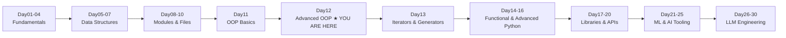
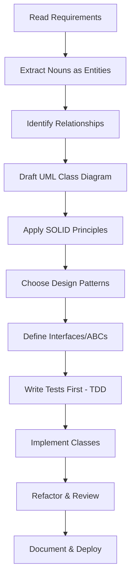
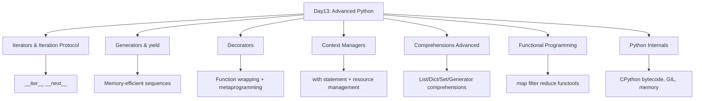

# Advanced OOP: Encapsulation, Inheritance, Polymorphism, Abstraction, Design Patterns & Enterprise Architecture

> **Series:** 30-Day Python Mastery | **Track:** LLM Engineering & Software Architecture  
> **Prerequisites:** Day01–Day11 Complete | **Difficulty:** Intermediate → Advanced  
> **Estimated Study Time:** 8–12 Hours | **Document Standard:** Enterprise / GitHub-Ready

---

## 📋 Table of Contents

| Section | Topic |
|---------|-------|
| [Section 1](#section-1) | Complete Revision — Day01 to Day11 |
| [Section 2](#section-2) | Advanced OOP Overview |
| [Section 3](#section-3) | Encapsulation Masterclass |
| [Section 4](#section-4) | Getters and Setters |
| [Section 5](#section-5) | Inheritance Masterclass |
| [Section 6](#section-6) | Method Overriding |
| [Section 7](#section-7) | super() Masterclass |
| [Section 8](#section-8) | Polymorphism Masterclass |
| [Section 9](#section-9) | Abstraction Masterclass |
| [Section 10](#section-10) | Composition vs Inheritance |
| [Section 11](#section-11) | SOLID Principles Introduction |
| [Section 12](#section-12) | Design Patterns Introduction |
| [Section 13](#section-13) | Memory Model of OOP |
| [Section 14](#section-14) | Debugging Advanced OOP |
| [Section 15](#section-15) | Python Developer Best Practices |
| [Section 16](#section-16) | 10 Mini Projects (Complete Code) |
| [Section 17](#section-17) | 20 High-Value Portfolio Projects |
| [Section 18](#section-18) | Project Layout Masterclass |
| [Section 19](#section-19) | GitHub Profile Booster Projects |
| [Section 20](#section-20) | Complete Project Solution Framework |
| [Section 21](#section-21) | 600 Practice Questions |
| [Section 22](#section-22) | 300 Interview Questions |
| [Section 23](#section-23) | Assignments with Solutions |
| [Section 24](#section-24) | Enterprise Challenge Projects |
| [Section 25](#section-25) | Day12 Revision — Cheat Sheets |
| [Section 26](#section-26) | Preparation for Day13 |

---

<a name="section-1"></a>
## 📚 SECTION 1 — Complete Revision: Day01 to Day11

### 1.1 Full Series Summary

```
Day01 → Python Fundamentals + Operators
Day02 → Strings + Input Handling + Memory Model
Day03 → Conditional Statements
Day04 → Loops + Pattern Printing
Day05 → Functions + Recursion
Day06 → Lists
Day07 → Tuples + Sets + Dictionaries
Day08 → Modules + Packages + Virtual Environments
Day09 → Exception Handling + Logging + Debugging
Day10 → File Handling + CSV + JSON
Day11 → OOP Fundamentals: Classes, Objects, Attributes, Methods, Constructors
```

---

### 1.2 OOP Fundamentals Mind Map (Day11 Revision)

```
                        ┌─────────────────────────────────┐
                        │        PYTHON OOP (Day11)       │
                        └──────────────┬──────────────────┘
                                       │
          ┌────────────┬───────────────┼───────────────┬────────────┐
          │            │               │               │            │
      ┌───▼───┐   ┌────▼────┐   ┌──────▼──────┐  ┌───▼───┐  ┌────▼────┐
      │ Class │   │ Object  │   │ Constructor │  │ Attrs │  │ Methods │
      └───────┘   └─────────┘   └─────────────┘  └───────┘  └─────────┘
          │            │               │               │            │
    Blueprint      Instance         __init__       instance    instance
    of object     of class          method        class         static
```

---

### 1.3 Quick Class Cheat Sheet

```python
class MyClass:
    class_variable = "shared"          # Class attribute — shared across all instances

    def __init__(self, name, age):
        self.name = name               # Instance attribute — unique per object
        self.age = age

    def instance_method(self):         # Regular method — has access to self
        return f"Hello {self.name}"

    @classmethod
    def class_method(cls):             # Class method — has access to cls
        return cls.class_variable

    @staticmethod
    def static_method():               # Static method — no access to self or cls
        return "I am static"

    def __str__(self):                 # String representation
        return f"MyClass({self.name}, {self.age})"

    def __repr__(self):                # Developer-friendly representation
        return f"MyClass(name={self.name!r}, age={self.age!r})"
```

---

### 1.4 Python Developer Roadmap (Current Position)



---

<a name="section-2"></a>
## 🏗️ SECTION 2 — Advanced OOP Overview

### 2.1 Why Advanced OOP Exists

When software grows from a script to a product used by thousands of users, simple code breaks down. Advanced OOP gives us tools to:

- **Scale** systems without rewriting everything
- **Maintain** code so future developers (and future you) can understand it
- **Reuse** logic across different modules
- **Test** components independently
- **Collaborate** across teams with clear contracts

---

### 2.2 Evolution of Programming Paradigms

```
┌──────────────────────────────────────────────────────────────────────────────┐
│  PROGRAMMING EVOLUTION                                                       │
├──────────────────┬───────────────────┬──────────────────┬────────────────────┤
│  PROCEDURAL      │  BASIC OOP        │  ADVANCED OOP    │  ENTERPRISE OOP    │
│                  │                   │                  │                    │
│  - Functions     │  - Classes        │  - Encapsulation │  - SOLID Principles│
│  - Variables     │  - Objects        │  - Inheritance   │  - Design Patterns │
│  - Loops         │  - Attributes     │  - Polymorphism  │  - Clean Arch      │
│  - Conditions    │  - Methods        │  - Abstraction   │  - DDD             │
│                  │  - Constructors   │  - Composition   │  - Microservices   │
│  Example:        │                   │                  │                    │
│  C, Pascal       │  Python (Day11)   │  Python (Day12)  │  Python (Advanced) │
├──────────────────┼───────────────────┼──────────────────┼────────────────────┤
│  Problem:        │  Problem:         │  Problem:        │  Solves:           │
│  No structure    │  No encapsulation │  No patterns     │  Scale + Teams     │
│  for large apps  │  Tight coupling   │  Hard to scale   │  Maintainability   │
└──────────────────┴───────────────────┴──────────────────┴────────────────────┘
```

---

### 2.3 Enterprise Software Challenges

```python
# BAD — Procedural code at scale (hard to maintain)
user_name = "Baghel"
user_email = "baghel@email.com"
user_balance = 5000

def deposit(balance, amount):
    return balance + amount

def withdraw(balance, amount):
    if amount > balance:
        raise ValueError("Insufficient funds")
    return balance - amount

# GOOD — Advanced OOP (scalable, maintainable)
class BankAccount:
    def __init__(self, owner: str, email: str, balance: float = 0.0):
        self.__owner = owner          # Encapsulated
        self.__email = email          # Encapsulated
        self.__balance = balance      # Encapsulated

    @property
    def balance(self) -> float:       # Controlled access
        return self.__balance

    def deposit(self, amount: float) -> None:
        if amount <= 0:
            raise ValueError("Deposit amount must be positive")
        self.__balance += amount

    def withdraw(self, amount: float) -> None:
        if amount > self.__balance:
            raise ValueError("Insufficient funds")
        self.__balance -= amount
```

---

<a name="section-3"></a>
## 🔒 SECTION 3 — Encapsulation Masterclass

### 3.1 Definition

**Encapsulation** is the OOP principle of bundling data (attributes) and behavior (methods) together in a class, and restricting direct access to some of the object's components.

> **Real World Analogy:** A car's engine is encapsulated. You interact with it via the steering wheel, accelerator, and brake — you don't directly access the combustion system.

---

### 3.2 Three Levels of Access in Python

| Level | Syntax | Convention | Meaning |
|-------|--------|------------|---------|
| Public | `self.name` | No prefix | Accessible from anywhere |
| Protected | `self._name` | Single underscore | Internal use — "handle with care" |
| Private | `self.__name` | Double underscore | Name mangled — restricted access |

---

### 3.3 Complete Encapsulation Example

```python
class Employee:
    """Demonstrates all three access levels."""

    company_name = "TechCorp"  # Public class attribute

    def __init__(self, emp_id: str, name: str, salary: float):
        self.emp_id = emp_id            # Public — freely accessible
        self._department = "General"    # Protected — internal/subclass use
        self.__salary = salary          # Private — highly restricted
        self.__name = name              # Private

    # Public methods — the interface
    def get_info(self) -> str:
        return f"ID: {self.emp_id} | Name: {self.__name}"

    def get_salary_range(self) -> str:
        """Business rule: External code sees range, not exact salary."""
        if self.__salary < 30000:
            return "Entry Level"
        elif self.__salary < 70000:
            return "Mid Level"
        return "Senior Level"

    # Protected method — for subclasses
    def _calculate_tax(self) -> float:
        return self.__salary * 0.20

    # Private method — internal use only
    def __validate_salary(self, amount: float) -> bool:
        return 10000 <= amount <= 500000

    def give_raise(self, amount: float) -> None:
        if not self.__validate_salary(self.__salary + amount):
            raise ValueError("Salary would go out of valid range")
        self.__salary += amount
        print(f"Raise applied. New salary range: {self.get_salary_range()}")


# Usage
emp = Employee("E001", "Baghel", 45000)
print(emp.get_info())             # ✅ Public access
print(emp._department)            # ⚠️  Protected — works but not recommended
# print(emp.__salary)             # ❌ AttributeError

# Name Mangling — Python's actual storage
print(emp._Employee__salary)      # ✅ Accessible via mangled name (for debugging only)
```

---

### 3.4 Name Mangling — Internal Working

When Python encounters `self.__attribute`, it internally renames it to `self._ClassName__attribute`. This prevents accidental overriding in subclasses.

```python
class Base:
    def __init__(self):
        self.__secret = "base_secret"   # Stored as _Base__secret

class Child(Base):
    def __init__(self):
        super().__init__()
        self.__secret = "child_secret"  # Stored as _Child__secret (different!)

obj = Child()
print(obj._Base__secret)   # "base_secret"
print(obj._Child__secret)  # "child_secret"
# Both coexist — no conflict
```

---

### 3.5 Memory Representation of Encapsulation

```
┌─────────────────────────────────────────────────────┐
│  EMPLOYEE OBJECT — Memory (id: 0x7f...)             │
├─────────────────────────────────────────────────────┤
│  __dict__:                                          │
│  {                                                  │
│    'emp_id'            : 'E001',      ← PUBLIC      │
│    '_department'       : 'General',   ← PROTECTED   │
│    '_Employee__salary' : 45000,       ← PRIVATE     │
│    '_Employee__name'   : 'Baghel'     ← PRIVATE     │
│  }                                                  │
└─────────────────────────────────────────────────────┘
```

---

### 3.6 Common Encapsulation Mistakes

```python
# ❌ MISTAKE 1: Over-exposing data
class BadUser:
    def __init__(self):
        self.password = "123456"      # Should NEVER be public

# ❌ MISTAKE 2: Breaking encapsulation from outside
class BadCode:
    pass

obj = BadCode()
obj._BadCode__secret = "hacked"       # Works but violates contract

# ✅ CORRECT: Use controlled interfaces
class GoodUser:
    def __init__(self, password: str):
        self.__password_hash = self.__hash(password)

    def __hash(self, password: str) -> str:
        import hashlib
        return hashlib.sha256(password.encode()).hexdigest()

    def verify_password(self, password: str) -> bool:
        return self.__password_hash == self.__hash(password)
```

---

### 3.7 Encapsulation Best Practices

1. Default to `private` for sensitive data (`__`)
2. Use `protected` for subclass access (`_`)
3. Always provide public methods as controlled interfaces
4. Validate data inside setters — don't trust the caller
5. Never expose internal state directly if it has business rules
6. Document what external code IS allowed to access

---

<a name="section-4"></a>
## 🎛️ SECTION 4 — Getters and Setters (Property Masterclass)

### 4.1 The Pythonic Way — @property

Python uses the `@property` decorator instead of explicit `getXxx()`/`setXxx()` methods (unlike Java).

```python
class Temperature:
    """Demonstrates professional property usage."""

    def __init__(self, celsius: float):
        self.__celsius = None
        self.celsius = celsius          # Uses the setter for validation

    @property
    def celsius(self) -> float:
        """Get temperature in Celsius."""
        return self.__celsius

    @celsius.setter
    def celsius(self, value: float) -> None:
        """Set temperature with validation."""
        if value < -273.15:
            raise ValueError(f"Temperature {value}°C is below absolute zero!")
        self.__celsius = value

    @celsius.deleter
    def celsius(self) -> None:
        """Reset temperature."""
        print("Resetting temperature...")
        self.__celsius = 0.0

    @property
    def fahrenheit(self) -> float:
        """Computed property — no setter needed."""
        return (self.__celsius * 9/5) + 32

    @property
    def kelvin(self) -> float:
        return self.__celsius + 273.15


# Usage
t = Temperature(100)
print(t.celsius)       # 100 — calls getter
print(t.fahrenheit)    # 212.0 — computed
print(t.kelvin)        # 373.15 — computed

t.celsius = 25         # calls setter with validation
# t.celsius = -300     # Raises ValueError

del t.celsius          # calls deleter
```

---

### 4.2 Business Rules via Properties

```python
class BankAccount:
    MIN_BALANCE = 0.0
    MAX_SINGLE_DEPOSIT = 100_000.0

    def __init__(self, account_id: str, owner: str):
        self.__account_id = account_id
        self.__owner = owner
        self.__balance = 0.0
        self.__is_frozen = False

    @property
    def balance(self) -> float:
        return self.__balance

    @property
    def account_id(self) -> str:
        return self.__account_id      # Read-only — no setter

    @property
    def is_frozen(self) -> bool:
        return self.__is_frozen

    @is_frozen.setter
    def is_frozen(self, value: bool) -> None:
        if not isinstance(value, bool):
            raise TypeError("Frozen status must be boolean")
        self.__is_frozen = value

    def deposit(self, amount: float) -> None:
        if self.__is_frozen:
            raise PermissionError("Account is frozen")
        if not (0 < amount <= self.MAX_SINGLE_DEPOSIT):
            raise ValueError(f"Deposit must be between 0 and {self.MAX_SINGLE_DEPOSIT}")
        self.__balance += amount

    def withdraw(self, amount: float) -> None:
        if self.__is_frozen:
            raise PermissionError("Account is frozen")
        if amount <= 0:
            raise ValueError("Withdrawal must be positive")
        if self.__balance - amount < self.MIN_BALANCE:
            raise ValueError("Insufficient funds")
        self.__balance -= amount

    def __repr__(self) -> str:
        return f"BankAccount(id={self.__account_id!r}, owner={self.__owner!r}, balance={self.__balance})"
```

---

### 4.3 Property vs Direct Attribute — When to Use Which

| Scenario | Use Direct Attribute | Use @property |
|----------|----------------------|---------------|
| Simple data, no rules | ✅ | ❌ |
| Validation required | ❌ | ✅ |
| Computed from other attrs | ❌ | ✅ |
| Read-only value | ❌ | ✅ |
| Business rule enforcement | ❌ | ✅ |
| Type checking | ❌ | ✅ |

---

<a name="section-5"></a>
## 🌳 SECTION 5 — Inheritance Masterclass

### 5.1 Definition

**Inheritance** allows a class (child/subclass) to acquire the attributes and methods of another class (parent/superclass). This models the **IS-A** relationship.

> **Real World Analogy:** A `SavingsAccount` IS-A `BankAccount`. A `Dog` IS-AN `Animal`.

---

### 5.2 Types of Inheritance

```
┌──────────────────────────────────────────────────────────────────┐
│  TYPES OF INHERITANCE IN PYTHON                                  │
├────────────────┬─────────────────────────────────────────────────┤
│  Single        │  A → B (one parent, one child)                  │
│  Multiple      │  A, B → C (multiple parents)                    │
│  Multilevel    │  A → B → C (chain of inheritance)               │
│  Hierarchical  │  A → B, A → C (one parent, multiple children)   │
│  Hybrid        │  Combination of above                           │
└────────────────┴─────────────────────────────────────────────────┘
```

---

### 5.3 Single Inheritance

```python
class Animal:
    """Base class for all animals."""

    def __init__(self, name: str, species: str):
        self.name = name
        self.species = species

    def breathe(self) -> str:
        return f"{self.name} breathes air"

    def eat(self, food: str) -> str:
        return f"{self.name} eats {food}"

    def __str__(self) -> str:
        return f"{self.species}: {self.name}"


class Dog(Animal):
    """Dog inherits from Animal — Single Inheritance."""

    def __init__(self, name: str, breed: str):
        super().__init__(name, "Canis lupus familiaris")
        self.breed = breed

    def bark(self) -> str:
        return f"{self.name} says: Woof!"

    def fetch(self, item: str) -> str:
        return f"{self.name} fetches the {item}"


# Usage
dog = Dog("Rex", "German Shepherd")
print(dog.breathe())          # Inherited from Animal
print(dog.eat("bones"))       # Inherited from Animal
print(dog.bark())             # Dog-specific
print(str(dog))               # Inherited __str__
```

---

### 5.4 Multiple Inheritance

```python
class Flyable:
    def fly(self) -> str:
        return f"{self.__class__.__name__} is flying"

    def get_altitude(self) -> int:
        return 1000


class Swimmable:
    def swim(self) -> str:
        return f"{self.__class__.__name__} is swimming"

    def get_depth(self) -> int:
        return 50


class Duck(Animal, Flyable, Swimmable):
    """Duck can fly AND swim — Multiple Inheritance."""

    def __init__(self, name: str):
        Animal.__init__(self, name, "Anas platyrhynchos")

    def quack(self) -> str:
        return f"{self.name} says: Quack!"


donald = Duck("Donald")
print(donald.breathe())       # From Animal
print(donald.fly())           # From Flyable
print(donald.swim())          # From Swimmable
print(donald.quack())         # Duck-specific
print(Duck.__mro__)           # See Method Resolution Order
```

---

### 5.5 Multilevel Inheritance

```python
class LivingBeing:
    def __init__(self, name: str):
        self.name = name

    def be_alive(self) -> str:
        return f"{self.name} is alive"


class Animal(LivingBeing):
    def __init__(self, name: str, species: str):
        super().__init__(name)
        self.species = species

    def breathe(self) -> str:
        return f"{self.name} breathes"


class Mammal(Animal):
    def __init__(self, name: str, species: str):
        super().__init__(name, species)

    def nurse_young(self) -> str:
        return f"{self.name} nurses its young"


class Dog(Mammal):
    def __init__(self, name: str):
        super().__init__(name, "Canis lupus familiaris")

    def bark(self) -> str:
        return f"{self.name} barks"


# LivingBeing → Animal → Mammal → Dog
rex = Dog("Rex")
print(rex.be_alive())     # From LivingBeing
print(rex.breathe())      # From Animal
print(rex.nurse_young())  # From Mammal
print(rex.bark())         # From Dog
```

---

### 5.6 Hierarchical Inheritance

```python
class Vehicle:
    def __init__(self, make: str, model: str, year: int):
        self.make = make
        self.model = model
        self.year = year

    def start(self) -> str:
        return f"{self.year} {self.make} {self.model} started"


class Car(Vehicle):
    def __init__(self, make: str, model: str, year: int, doors: int):
        super().__init__(make, model, year)
        self.doors = doors

    def honk(self) -> str:
        return "Beep beep!"


class Truck(Vehicle):
    def __init__(self, make: str, model: str, year: int, payload_kg: float):
        super().__init__(make, model, year)
        self.payload_kg = payload_kg

    def load_cargo(self, weight: float) -> str:
        if weight > self.payload_kg:
            raise ValueError("Overloaded!")
        return f"Loaded {weight}kg cargo"


class Motorcycle(Vehicle):
    def __init__(self, make: str, model: str, year: int):
        super().__init__(make, model, year)

    def wheelie(self) -> str:
        return f"{self.model} does a wheelie!"
```

---

### 5.7 UML Class Diagram — Inheritance

```
            ┌──────────────┐
            │   Animal     │
            ├──────────────┤
            │+ name: str   │
            │+ species: str│
            ├──────────────┤
            │ + breathe()  │
            │ + eat()      │
            └──────┬───────┘
                   │ inherits
         ┌─────────┼─────────┐
         │         │         │
    ┌────▼───┐ ┌───▼────┐ ┌──▼─────┐
    │  Dog   │ │  Cat   │ │  Bird  │
    ├────────┤ ├────────┤ ├────────┤
    │ breed  │ │ indoor │ │ canFly │
    ├────────┤ ├────────┤ ├────────┤
    │ bark() │ │ purr() │ │ sing() │
    └────────┘ └────────┘ └────────┘
```

---

### 5.8 Inheritance Best Practices

1. **Prefer shallow inheritance hierarchies** — max 3–4 levels deep
2. **Only inherit when IS-A relationship is genuine**
3. **Don't inherit just to reuse code** — use composition instead
4. **Always call `super().__init__()`** in child constructors
5. **Liskov Substitution must hold** — child must be usable wherever parent is expected

---

<a name="section-6"></a>
## 🔄 SECTION 6 — Method Overriding

### 6.1 Definition

**Method Overriding** is when a child class provides its own implementation of a method that is already defined in the parent class.

```python
class Shape:
    def area(self) -> float:
        return 0.0

    def perimeter(self) -> float:
        return 0.0

    def describe(self) -> str:
        return f"Shape with area={self.area():.2f}, perimeter={self.perimeter():.2f}"


class Circle(Shape):
    import math

    def __init__(self, radius: float):
        self.radius = radius

    def area(self) -> float:           # OVERRIDE
        import math
        return math.pi * self.radius ** 2

    def perimeter(self) -> float:      # OVERRIDE
        import math
        return 2 * math.pi * self.radius


class Rectangle(Shape):
    def __init__(self, width: float, height: float):
        self.width = width
        self.height = height

    def area(self) -> float:           # OVERRIDE
        return self.width * self.height

    def perimeter(self) -> float:      # OVERRIDE
        return 2 * (self.width + self.height)


class Square(Rectangle):
    def __init__(self, side: float):
        super().__init__(side, side)   # Reuses Rectangle constructor

    def describe(self) -> str:         # OVERRIDE
        return f"Square(side={self.width}) — {super().describe()}"


# Polymorphic behavior
shapes = [Circle(5), Rectangle(4, 6), Square(3)]
for shape in shapes:
    print(shape.describe())
```

---

### 6.2 Runtime Polymorphism via Overriding

```python
class Logger:
    def log(self, message: str) -> None:
        print(f"[LOG] {message}")


class FileLogger(Logger):
    def __init__(self, filepath: str):
        self.filepath = filepath

    def log(self, message: str) -> None:   # Override
        with open(self.filepath, 'a') as f:
            f.write(f"[FILE] {message}\n")


class JSONLogger(Logger):
    def log(self, message: str) -> None:   # Override
        import json, datetime
        entry = {"time": str(datetime.datetime.now()), "message": message}
        print(json.dumps(entry))


def process_event(logger: Logger, event: str) -> None:
    """Works with ANY Logger — polymorphic."""
    logger.log(f"Processing: {event}")


# Same function, different behavior
process_event(Logger(), "user_login")
process_event(JSONLogger(), "payment_processed")
```

---

<a name="section-7"></a>
## ⬆️ SECTION 7 — super() Masterclass

### 7.1 What is super()?

`super()` returns a proxy object that delegates method calls to the parent class. It respects the **Method Resolution Order (MRO)**.

```python
class Person:
    def __init__(self, name: str, age: int):
        self.name = name
        self.age = age
        print(f"Person.__init__ called for {name}")

    def introduce(self) -> str:
        return f"Hi, I'm {self.name}, age {self.age}"


class Employee(Person):
    def __init__(self, name: str, age: int, emp_id: str, department: str):
        super().__init__(name, age)    # Calls Person.__init__
        self.emp_id = emp_id
        self.department = department
        print(f"Employee.__init__ called for {emp_id}")

    def introduce(self) -> str:
        base_intro = super().introduce()   # Calls Person.introduce
        return f"{base_intro} | Employee ID: {self.emp_id} ({self.department})"


class Manager(Employee):
    def __init__(self, name: str, age: int, emp_id: str, team_size: int):
        super().__init__(name, age, emp_id, "Management")
        self.team_size = team_size

    def introduce(self) -> str:
        base_intro = super().introduce()
        return f"{base_intro} | Manages {self.team_size} people"


mgr = Manager("Baghel", 22, "M001", 10)
print(mgr.introduce())
```

---

### 7.2 super() in Multiple Inheritance (MRO)

```python
class A:
    def hello(self):
        print("A.hello")

class B(A):
    def hello(self):
        print("B.hello")
        super().hello()

class C(A):
    def hello(self):
        print("C.hello")
        super().hello()

class D(B, C):
    def hello(self):
        print("D.hello")
        super().hello()


d = D()
d.hello()
# Output:
# D.hello
# B.hello
# C.hello
# A.hello

print(D.__mro__)
# (<class 'D'>, <class 'B'>, <class 'C'>, <class 'A'>, <class 'object'>)
```

> **C3 Linearization Algorithm** determines the MRO. Python uses this to decide which parent's method is called when multiple inheritance is involved.

---

<a name="section-8"></a>
## 🦆 SECTION 8 — Polymorphism Masterclass

### 8.1 Definition

**Polymorphism** means "many forms." An object can take many forms — the same interface works with different types.

Types of polymorphism in Python:
1. **Duck Typing** — if it quacks like a duck, it IS a duck
2. **Method Overriding** — runtime polymorphism
3. **Operator Overloading** — `__add__`, `__eq__`, etc.
4. **Function Polymorphism** — built-in functions work on multiple types

---

### 8.2 Duck Typing

```python
class Dog:
    def speak(self) -> str:
        return "Woof!"

class Cat:
    def speak(self) -> str:
        return "Meow!"

class Parrot:
    def speak(self) -> str:
        return "Squawk! Hello!"

class RobotDog:
    def speak(self) -> str:
        return "BEEP BOOP WOOF"


def make_noise(animal) -> None:
    """Duck typing — doesn't care about the type, only the interface."""
    print(animal.speak())


animals = [Dog(), Cat(), Parrot(), RobotDog()]
for a in animals:
    make_noise(a)
```

---

### 8.3 Operator Overloading

```python
class Vector:
    """2D Vector with operator overloading."""

    def __init__(self, x: float, y: float):
        self.x = x
        self.y = y

    def __add__(self, other: 'Vector') -> 'Vector':
        return Vector(self.x + other.x, self.y + other.y)

    def __sub__(self, other: 'Vector') -> 'Vector':
        return Vector(self.x - other.x, self.y - other.y)

    def __mul__(self, scalar: float) -> 'Vector':
        return Vector(self.x * scalar, self.y * scalar)

    def __eq__(self, other: 'Vector') -> bool:
        return self.x == other.x and self.y == other.y

    def __abs__(self) -> float:
        return (self.x**2 + self.y**2) ** 0.5

    def __repr__(self) -> str:
        return f"Vector({self.x}, {self.y})"

    def __str__(self) -> str:
        return f"({self.x}, {self.y})"


v1 = Vector(1, 2)
v2 = Vector(3, 4)
print(v1 + v2)    # (4, 6)
print(v1 - v2)    # (-2, -2)
print(v1 * 3)     # (3, 6)
print(abs(v2))    # 5.0
print(v1 == v1)   # True
```

---

### 8.4 Magic Methods Reference

| Method | Operator/Usage | Example |
|--------|----------------|---------|
| `__add__` | `+` | `v1 + v2` |
| `__sub__` | `-` | `v1 - v2` |
| `__mul__` | `*` | `v1 * 3` |
| `__truediv__` | `/` | `v1 / 2` |
| `__eq__` | `==` | `v1 == v2` |
| `__lt__` | `<` | `v1 < v2` |
| `__len__` | `len()` | `len(obj)` |
| `__contains__` | `in` | `x in obj` |
| `__getitem__` | `[]` | `obj[0]` |
| `__setitem__` | `[]=` | `obj[0] = x` |
| `__str__` | `str()` | `str(obj)` |
| `__repr__` | `repr()` | `repr(obj)` |
| `__bool__` | `bool()` | `bool(obj)` |
| `__call__` | `()` | `obj()` |
| `__enter__`/`__exit__` | `with` | `with obj:` |

---

### 8.5 Polymorphism in AI Engineering

```python
from abc import ABC, abstractmethod

class BaseEmbeddingModel(ABC):
    @abstractmethod
    def embed(self, text: str) -> list[float]:
        pass

    @abstractmethod
    def embed_batch(self, texts: list[str]) -> list[list[float]]:
        pass


class OpenAIEmbedding(BaseEmbeddingModel):
    def embed(self, text: str) -> list[float]:
        # In reality: call openai.embeddings.create(...)
        return [0.1, 0.2, 0.3]

    def embed_batch(self, texts: list[str]) -> list[list[float]]:
        return [self.embed(t) for t in texts]


class HuggingFaceEmbedding(BaseEmbeddingModel):
    def embed(self, text: str) -> list[float]:
        # In reality: use sentence_transformers
        return [0.4, 0.5, 0.6]

    def embed_batch(self, texts: list[str]) -> list[list[float]]:
        return [self.embed(t) for t in texts]


def build_vector_store(model: BaseEmbeddingModel, docs: list[str]) -> list[list[float]]:
    """Polymorphic — works with any embedding model."""
    return model.embed_batch(docs)
```

---

<a name="section-9"></a>
## 🎭 SECTION 9 — Abstraction Masterclass

### 9.1 Definition

**Abstraction** hides implementation complexity and exposes only what is necessary. In Python, abstraction is achieved via **Abstract Base Classes (ABCs)**.

> **Real World Analogy:** When you press a car's accelerator, you don't know if it's petrol, diesel, or electric. The interface is the same — the implementation is hidden.

---

### 9.2 ABC Module

```python
from abc import ABC, abstractmethod
from typing import Optional


class PaymentGateway(ABC):
    """Abstract Base Class — defines the contract for all payment gateways."""

    @abstractmethod
    def charge(self, amount: float, currency: str) -> dict:
        """Charge the customer."""
        pass

    @abstractmethod
    def refund(self, transaction_id: str, amount: float) -> dict:
        """Refund a transaction."""
        pass

    @abstractmethod
    def get_transaction_status(self, transaction_id: str) -> str:
        """Get current transaction status."""
        pass

    # Concrete method in abstract class — shared logic
    def validate_amount(self, amount: float) -> None:
        if amount <= 0:
            raise ValueError(f"Invalid amount: {amount}")
        if amount > 1_000_000:
            raise ValueError("Amount exceeds maximum limit")


class StripeGateway(PaymentGateway):
    """Concrete implementation for Stripe."""

    def charge(self, amount: float, currency: str) -> dict:
        self.validate_amount(amount)
        # In reality: stripe.PaymentIntent.create(...)
        return {"status": "success", "gateway": "stripe", "amount": amount}

    def refund(self, transaction_id: str, amount: float) -> dict:
        return {"status": "refunded", "transaction_id": transaction_id}

    def get_transaction_status(self, transaction_id: str) -> str:
        return "completed"


class RazorpayGateway(PaymentGateway):
    """Concrete implementation for Razorpay."""

    def charge(self, amount: float, currency: str) -> dict:
        self.validate_amount(amount)
        return {"status": "success", "gateway": "razorpay", "amount": amount}

    def refund(self, transaction_id: str, amount: float) -> dict:
        return {"status": "refunded", "transaction_id": transaction_id}

    def get_transaction_status(self, transaction_id: str) -> str:
        return "captured"


# Usage — same code works with any gateway
def process_payment(gateway: PaymentGateway, amount: float) -> dict:
    return gateway.charge(amount, "INR")


# Can't instantiate abstract class
# pg = PaymentGateway()  # TypeError!

stripe = StripeGateway()
razorpay = RazorpayGateway()
print(process_payment(stripe, 999.00))
print(process_payment(razorpay, 499.00))
```

---

### 9.3 Abstract Properties

```python
from abc import ABC, abstractmethod

class DataStore(ABC):

    @property
    @abstractmethod
    def connection_string(self) -> str:
        """Subclasses must define how to connect."""
        pass

    @abstractmethod
    def connect(self) -> None:
        pass

    @abstractmethod
    def disconnect(self) -> None:
        pass

    @abstractmethod
    def execute(self, query: str) -> list:
        pass


class PostgresStore(DataStore):

    def __init__(self, host: str, port: int, db: str):
        self.__host = host
        self.__port = port
        self.__db = db

    @property
    def connection_string(self) -> str:
        return f"postgresql://{self.__host}:{self.__port}/{self.__db}"

    def connect(self) -> None:
        print(f"Connecting to {self.connection_string}")

    def disconnect(self) -> None:
        print("Disconnecting from PostgreSQL")

    def execute(self, query: str) -> list:
        print(f"Executing: {query}")
        return []
```

---

<a name="section-10"></a>
## 🧩 SECTION 10 — Composition vs Inheritance

### 10.1 The Core Principle

> **"Favor composition over inheritance"** — Gang of Four Design Patterns

| | Inheritance (IS-A) | Composition (HAS-A) |
|---|---|---|
| Relationship | Dog IS-A Animal | Car HAS-A Engine |
| Coupling | Tight | Loose |
| Flexibility | Less | More |
| Testing | Harder | Easier |
| Code reuse | Via inheritance chain | Via component injection |
| Changes | Cascading (risky) | Isolated |

---

### 10.2 Inheritance vs Composition — A Real Example

```python
# ❌ APPROACH 1: Inheritance (rigid, over-coupled)
class Animal:
    def breathe(self): ...
    def eat(self): ...

class FlyingAnimal(Animal):
    def fly(self): ...

class SwimmingAnimal(Animal):
    def swim(self): ...

# Problem: What about a Duck that flies AND swims?
# We need FlyingSwimmingAnimal — inheritance explosion!


# ✅ APPROACH 2: Composition (flexible, clean)
class BreathingAbility:
    def breathe(self) -> str:
        return "Breathing air"

class FlyingAbility:
    def __init__(self, max_altitude: int = 1000):
        self.max_altitude = max_altitude

    def fly(self) -> str:
        return f"Flying up to {self.max_altitude}m"

class SwimmingAbility:
    def __init__(self, max_depth: int = 50):
        self.max_depth = max_depth

    def swim(self) -> str:
        return f"Swimming up to {self.max_depth}m deep"

class RunningAbility:
    def __init__(self, max_speed_kmh: int = 30):
        self.max_speed = max_speed_kmh

    def run(self) -> str:
        return f"Running at up to {self.max_speed} km/h"


class Animal:
    def __init__(self, name: str, species: str):
        self.name = name
        self.species = species
        self._abilities: list = []

    def add_ability(self, ability) -> None:
        self._abilities.append(ability)


class Duck(Animal):
    def __init__(self, name: str):
        super().__init__(name, "Duck")
        self.flying = FlyingAbility(max_altitude=500)
        self.swimming = SwimmingAbility(max_depth=10)
        self.running = RunningAbility(max_speed_kmh=5)
        self.breathing = BreathingAbility()

    def fly(self) -> str:
        return self.flying.fly()

    def swim(self) -> str:
        return self.swimming.swim()


class Eagle(Animal):
    def __init__(self, name: str):
        super().__init__(name, "Eagle")
        self.flying = FlyingAbility(max_altitude=3000)
        self.breathing = BreathingAbility()

    def fly(self) -> str:
        return self.flying.fly()


donald = Duck("Donald")
print(donald.fly())    # Flying up to 500m
print(donald.swim())   # Swimming up to 10m deep
```

---

### 10.3 Composition in Enterprise Systems

```python
class DatabaseRepository:
    """Handles data persistence."""
    def save(self, data: dict) -> str:
        print(f"Saving to DB: {data}")
        return "db_id_001"

    def find_by_id(self, id: str) -> dict:
        return {"id": id, "data": "..."}


class EmailService:
    """Handles notifications."""
    def send(self, to: str, subject: str, body: str) -> None:
        print(f"Email → {to}: {subject}")


class AuditLogger:
    """Handles audit trails."""
    def log_action(self, user_id: str, action: str) -> None:
        import datetime
        print(f"[AUDIT] {datetime.datetime.now()} | User:{user_id} | {action}")


class UserService:
    """
    UserService uses composition to combine:
    - Database access (repository)
    - Email notifications (email service)
    - Audit logging (audit logger)
    """
    def __init__(
        self,
        repository: DatabaseRepository,
        email_service: EmailService,
        audit_logger: AuditLogger
    ):
        self._repo = repository
        self._email = email_service
        self._audit = audit_logger

    def register_user(self, user_data: dict) -> dict:
        # Save to database
        user_id = self._repo.save(user_data)

        # Send welcome email
        self._email.send(
            user_data["email"],
            "Welcome!",
            "Thanks for registering."
        )

        # Audit log
        self._audit.log_action("system", f"User {user_id} registered")

        return {"user_id": user_id, "status": "created"}


# Dependency Injection — easy to test/swap components
service = UserService(
    repository=DatabaseRepository(),
    email_service=EmailService(),
    audit_logger=AuditLogger()
)
service.register_user({"name": "Baghel", "email": "b@test.com"})
```

---

<a name="section-11"></a>
## 🏛️ SECTION 11 — SOLID Principles Introduction

### 11.1 What is SOLID?

SOLID is a set of 5 object-oriented design principles that make software more maintainable, flexible, and scalable.

```
S — Single Responsibility Principle
O — Open/Closed Principle
L — Liskov Substitution Principle
I — Interface Segregation Principle
D — Dependency Inversion Principle
```

---

### 11.2 S — Single Responsibility Principle (SRP)

> **A class should have only one reason to change.**

```python
# ❌ VIOLATION — One class doing too much
class BadUserManager:
    def create_user(self, data: dict) -> None:
        # Validates data
        # Saves to database
        # Sends email
        # Logs to file
        # All in one class — 4 reasons to change!
        pass


# ✅ CORRECT — Each class has one job
class UserValidator:
    """ONLY validates user data."""
    def validate(self, data: dict) -> bool:
        return bool(data.get("email") and data.get("name"))


class UserRepository:
    """ONLY persists user data."""
    def save(self, user: dict) -> str:
        print(f"Saving user: {user}")
        return "user_001"


class UserEmailService:
    """ONLY sends emails."""
    def send_welcome(self, email: str) -> None:
        print(f"Sending welcome email to {email}")


class UserLogger:
    """ONLY logs user actions."""
    def log(self, message: str) -> None:
        print(f"[LOG] {message}")


class UserService:
    """Orchestrates — each dependency has a single responsibility."""
    def __init__(self, validator, repository, email_service, logger):
        self.validator = validator
        self.repository = repository
        self.email_service = email_service
        self.logger = logger

    def create_user(self, data: dict) -> str:
        if not self.validator.validate(data):
            raise ValueError("Invalid user data")
        user_id = self.repository.save(data)
        self.email_service.send_welcome(data["email"])
        self.logger.log(f"User created: {user_id}")
        return user_id
```

---

### 11.3 O — Open/Closed Principle (OCP)

> **Open for extension, closed for modification.**

```python
# ❌ VIOLATION — Adding new discount type requires modifying existing code
class BadDiscountCalculator:
    def calculate(self, order, discount_type: str) -> float:
        if discount_type == "student":
            return order.total * 0.10
        elif discount_type == "senior":
            return order.total * 0.15
        # Adding "corporate" requires editing this class!


# ✅ CORRECT — Extend without modifying
from abc import ABC, abstractmethod

class DiscountStrategy(ABC):
    @abstractmethod
    def calculate(self, total: float) -> float:
        pass

class StudentDiscount(DiscountStrategy):
    def calculate(self, total: float) -> float:
        return total * 0.10

class SeniorDiscount(DiscountStrategy):
    def calculate(self, total: float) -> float:
        return total * 0.15

class CorporateDiscount(DiscountStrategy):    # NEW — no modification needed
    def calculate(self, total: float) -> float:
        return total * 0.20

class DiscountCalculator:
    def __init__(self, strategy: DiscountStrategy):
        self.strategy = strategy

    def apply_discount(self, total: float) -> float:
        discount = self.strategy.calculate(total)
        return total - discount
```

---

### 11.4 L — Liskov Substitution Principle (LSP)

> **Objects of a subclass should be substitutable for objects of the parent class without breaking the program.**

```python
class Rectangle:
    def __init__(self, width: float, height: float):
        self._width = width
        self._height = height

    @property
    def width(self): return self._width

    @property
    def height(self): return self._height

    def area(self) -> float:
        return self._width * self._height


# ❌ LSP VIOLATION
class BadSquare(Rectangle):
    def __init__(self, side: float):
        super().__init__(side, side)

    @Rectangle.width.setter
    def width(self, value):
        self._width = value
        self._height = value  # Breaks Rectangle contract!

    @Rectangle.height.setter
    def height(self, value):
        self._width = value
        self._height = value  # Breaks Rectangle contract!


# ✅ LSP CORRECT — Use separate hierarchy or abstract base
class Shape(ABC):
    @abstractmethod
    def area(self) -> float: pass

class Rectangle(Shape):
    def __init__(self, w: float, h: float):
        self.w = w
        self.h = h
    def area(self) -> float:
        return self.w * self.h

class Square(Shape):
    def __init__(self, side: float):
        self.side = side
    def area(self) -> float:
        return self.side ** 2
```

---

### 11.5 I — Interface Segregation Principle (ISP)

> **Clients should not be forced to depend on interfaces they don't use.**

```python
# ❌ VIOLATION — Fat interface
class BadWorker(ABC):
    @abstractmethod
    def work(self): pass

    @abstractmethod
    def eat(self): pass

    @abstractmethod
    def sleep(self): pass

class Robot(BadWorker):
    def work(self): print("Robot working")
    def eat(self): pass   # Robots don't eat — forced implementation!
    def sleep(self): pass # Robots don't sleep — forced!


# ✅ CORRECT — Segregated interfaces
class Workable(ABC):
    @abstractmethod
    def work(self): pass

class Eatable(ABC):
    @abstractmethod
    def eat(self): pass

class Sleepable(ABC):
    @abstractmethod
    def sleep(self): pass

class Human(Workable, Eatable, Sleepable):
    def work(self): print("Human working")
    def eat(self): print("Human eating")
    def sleep(self): print("Human sleeping")

class Robot(Workable):
    def work(self): print("Robot working")
    # Only implements what it needs!
```

---

### 11.6 D — Dependency Inversion Principle (DIP)

> **High-level modules should not depend on low-level modules. Both should depend on abstractions.**

```python
# ❌ VIOLATION — High level depends on low level
class MySQLDatabase:
    def query(self, sql: str) -> list:
        return []

class UserService:
    def __init__(self):
        self.db = MySQLDatabase()  # Tightly coupled to MySQL!

    def get_users(self) -> list:
        return self.db.query("SELECT * FROM users")


# ✅ CORRECT — Depend on abstraction
class Database(ABC):
    @abstractmethod
    def query(self, sql: str) -> list: pass

class MySQLDatabase(Database):
    def query(self, sql: str) -> list:
        print(f"MySQL: {sql}")
        return []

class MongoDatabase(Database):
    def query(self, sql: str) -> list:
        print(f"MongoDB: {sql}")
        return []

class UserService:
    def __init__(self, db: Database):   # Depends on abstraction
        self.db = db

    def get_users(self) -> list:
        return self.db.query("SELECT * FROM users")


# Swap database without changing UserService!
mysql_service = UserService(MySQLDatabase())
mongo_service = UserService(MongoDatabase())
```

---

<a name="section-12"></a>
## 🎨 SECTION 12 — Design Patterns Introduction

### 12.1 What Are Design Patterns?

Design patterns are **proven, reusable solutions** to common software design problems. They are not code — they are templates/blueprints.

Three categories:
- **Creational** — how objects are created (Singleton, Factory, Builder)
- **Structural** — how objects are composed (Adapter, Decorator, Facade)
- **Behavioral** — how objects communicate (Observer, Strategy, Command)

---

### 12.2 Singleton Pattern

> Ensures only ONE instance of a class exists in the application.

```python
class Singleton:
    _instance = None

    def __new__(cls, *args, **kwargs):
        if cls._instance is None:
            cls._instance = super().__new__(cls)
        return cls._instance


class AppConfig(Singleton):
    """Application configuration — only one instance needed."""

    def __init__(self):
        if not hasattr(self, '_initialized'):
            self._initialized = True
            self._config = {
                "debug": False,
                "database_url": "postgresql://localhost/mydb",
                "api_version": "v2"
            }

    def get(self, key: str):
        return self._config.get(key)

    def set(self, key: str, value) -> None:
        self._config[key] = value


# Proof of singleton
config1 = AppConfig()
config2 = AppConfig()
config1.set("debug", True)
print(config2.get("debug"))    # True — same instance!
print(config1 is config2)      # True
```

---

### 12.3 Factory Pattern

> Creates objects without specifying their exact class.

```python
from abc import ABC, abstractmethod

class Notification(ABC):
    @abstractmethod
    def send(self, recipient: str, message: str) -> None:
        pass

class EmailNotification(Notification):
    def send(self, recipient: str, message: str) -> None:
        print(f"EMAIL → {recipient}: {message}")

class SMSNotification(Notification):
    def send(self, recipient: str, message: str) -> None:
        print(f"SMS → {recipient}: {message}")

class PushNotification(Notification):
    def send(self, recipient: str, message: str) -> None:
        print(f"PUSH → {recipient}: {message}")


class NotificationFactory:
    """Factory — creates the right notification type."""
    _registry = {
        "email": EmailNotification,
        "sms": SMSNotification,
        "push": PushNotification
    }

    @classmethod
    def create(cls, notification_type: str) -> Notification:
        creator = cls._registry.get(notification_type.lower())
        if not creator:
            raise ValueError(f"Unknown notification type: {notification_type}")
        return creator()

    @classmethod
    def register(cls, name: str, notification_class) -> None:
        """Extensible — register new types without modifying factory."""
        cls._registry[name] = notification_class


# Usage
notifier = NotificationFactory.create("email")
notifier.send("baghel@example.com", "Your order is ready!")

notifier2 = NotificationFactory.create("sms")
notifier2.send("+91-9999999999", "OTP: 123456")
```

---

### 12.4 Strategy Pattern

> Defines a family of algorithms, encapsulates each, and makes them interchangeable.

```python
from abc import ABC, abstractmethod

class SortStrategy(ABC):
    @abstractmethod
    def sort(self, data: list) -> list:
        pass

class BubbleSort(SortStrategy):
    def sort(self, data: list) -> list:
        arr = data.copy()
        n = len(arr)
        for i in range(n):
            for j in range(n - i - 1):
                if arr[j] > arr[j+1]:
                    arr[j], arr[j+1] = arr[j+1], arr[j]
        return arr

class QuickSort(SortStrategy):
    def sort(self, data: list) -> list:
        if len(data) <= 1:
            return data
        pivot = data[len(data)//2]
        left = [x for x in data if x < pivot]
        mid = [x for x in data if x == pivot]
        right = [x for x in data if x > pivot]
        return self.sort(left) + mid + self.sort(right)

class PythonBuiltinSort(SortStrategy):
    def sort(self, data: list) -> list:
        return sorted(data)


class DataProcessor:
    def __init__(self, strategy: SortStrategy):
        self._strategy = strategy

    def set_strategy(self, strategy: SortStrategy) -> None:
        self._strategy = strategy

    def process(self, data: list) -> list:
        return self._strategy.sort(data)


data = [64, 34, 25, 12, 22, 11, 90]
processor = DataProcessor(QuickSort())
print(processor.process(data))

processor.set_strategy(PythonBuiltinSort())
print(processor.process(data))
```

---

### 12.5 Observer Pattern

> Defines a subscription mechanism to notify multiple objects of events.

```python
from abc import ABC, abstractmethod
from typing import Any

class Observer(ABC):
    @abstractmethod
    def update(self, event: str, data: Any) -> None:
        pass

class Observable:
    def __init__(self):
        self._observers: list[Observer] = []

    def subscribe(self, observer: Observer) -> None:
        self._observers.append(observer)

    def unsubscribe(self, observer: Observer) -> None:
        self._observers.remove(observer)

    def notify(self, event: str, data: Any = None) -> None:
        for observer in self._observers:
            observer.update(event, data)


class EmailAlertObserver(Observer):
    def update(self, event: str, data: Any) -> None:
        print(f"EMAIL ALERT: Event={event}, Data={data}")

class LogObserver(Observer):
    def update(self, event: str, data: Any) -> None:
        print(f"[LOG] Event={event}, Data={data}")

class DashboardObserver(Observer):
    def update(self, event: str, data: Any) -> None:
        print(f"DASHBOARD UPDATE: Event={event}")


class OrderService(Observable):
    def __init__(self):
        super().__init__()
        self._orders = []

    def create_order(self, order: dict) -> dict:
        self._orders.append(order)
        self.notify("ORDER_CREATED", order)
        return order

    def cancel_order(self, order_id: str) -> None:
        self.notify("ORDER_CANCELLED", {"order_id": order_id})


service = OrderService()
service.subscribe(EmailAlertObserver())
service.subscribe(LogObserver())
service.subscribe(DashboardObserver())

service.create_order({"id": "ORD001", "item": "Laptop", "amount": 75000})
```

---

### 12.6 Repository Pattern

> Abstracts the data layer, separating business logic from data access.

```python
from abc import ABC, abstractmethod
from typing import Optional
import uuid

class User:
    def __init__(self, name: str, email: str):
        self.id = str(uuid.uuid4())[:8]
        self.name = name
        self.email = email

    def __repr__(self):
        return f"User(id={self.id}, name={self.name})"


class UserRepository(ABC):
    @abstractmethod
    def save(self, user: User) -> User: pass

    @abstractmethod
    def find_by_id(self, user_id: str) -> Optional[User]: pass

    @abstractmethod
    def find_by_email(self, email: str) -> Optional[User]: pass

    @abstractmethod
    def find_all(self) -> list[User]: pass

    @abstractmethod
    def delete(self, user_id: str) -> bool: pass


class InMemoryUserRepository(UserRepository):
    """For testing — stores in memory."""

    def __init__(self):
        self._store: dict[str, User] = {}

    def save(self, user: User) -> User:
        self._store[user.id] = user
        return user

    def find_by_id(self, user_id: str) -> Optional[User]:
        return self._store.get(user_id)

    def find_by_email(self, email: str) -> Optional[User]:
        for user in self._store.values():
            if user.email == email:
                return user
        return None

    def find_all(self) -> list[User]:
        return list(self._store.values())

    def delete(self, user_id: str) -> bool:
        if user_id in self._store:
            del self._store[user_id]
            return True
        return False
```

---

<a name="section-13"></a>
## 🧠 SECTION 13 — Memory Model of OOP

### 13.1 How Objects Live in Memory

```
STACK (Execution)             HEAP (Objects)
┌─────────────────┐           ┌──────────────────────────────────────┐
│  Variable Names │           │                                      │
│                 │           │   ┌─────────────────────────────────┐│
│  dog  ─────────────────────────▶│ Dog Object (id: 0x7f3a...)      ││
│                 │           │   ├─────────────────────────────────┤│
│  cat  ─────────────────────┐│   │ __dict__: {                     ││
│                 │          ││   │   'name': ──────────────────────────▶ 'Rex'
│                 │          ││   │   'breed': ─────────────────────────▶ 'GSD'
└─────────────────┘          ││   │   '_dept': 'Canine'             ││
                             ││   │   '_Dog__id': 'D001'            ││
                             ││   │ }                               ││
                             ││   │ __class__: Dog                  ││
                             ││   └─────────────────────────────────┘│
                             ││                                      │
                             │└────────────────────────────────────┐ │   |
                             │   ┌─────────────────────────────────▼┐│   |
                             └──▶│ Cat Object (id: 0x7f5b...)        │   │
                                 └───────────────────────────────────┘   │
                                                                         │
└────────────────────────────────────────────────────────────────────────┘
```

---

### 13.2 Method Resolution Order (MRO)

Python uses the **C3 Linearization** algorithm to determine MRO:

```python
class A: pass
class B(A): pass
class C(A): pass
class D(B, C): pass

print(D.__mro__)
# (<class 'D'>, <class 'B'>, <class 'C'>, <class 'A'>, <class 'object'>)

# MRO for D:
# 1. D itself
# 2. B (first parent of D)
# 3. C (second parent of D)
# 4. A (parent of B and C)
# 5. object (root of all Python classes)
```

**MRO Diagram:**
```
     object
       │
       A
      / \
     B   C
      \ /
       D
MRO: D → B → C → A → object
```

---

### 13.3 Object Graph and Reference Counting

```python
import sys

a = [1, 2, 3]
b = a              # b points to same list
c = a.copy()       # c points to a new list

print(sys.getrefcount(a))   # 3 (a, b, plus getrefcount argument)
print(a is b)               # True — same object
print(a is c)               # False — different object
print(a == c)               # True — same value

# When references drop to 0, Python's garbage collector reclaims memory
del b
# sys.getrefcount(a) is now 2
```

---

<a name="section-14"></a>
## 🐛 SECTION 14 — Debugging Advanced OOP

### 14.1 Common OOP Bugs and Fixes

```python
# BUG 1: Mutable default argument (class-level list shared across all instances)
class BadClass:
    items = []               # ❌ Shared across ALL instances!

    def add(self, item):
        self.items.append(item)


class GoodClass:
    def __init__(self):
        self.items = []      # ✅ Each instance gets its own list


# BUG 2: Forgetting super().__init__() in multiple inheritance
class A:
    def __init__(self):
        self.a = "a"

class B(A):
    def __init__(self):
        # super().__init__()  # Missing! self.a won't exist
        self.b = "b"


# BUG 3: Calling overridden method on wrong class
class Parent:
    def greet(self):
        return "Hello from Parent"

class Child(Parent):
    def greet(self):
        return "Hello from Child"

# To call parent explicitly:
child = Child()
print(Parent.greet(child))       # Explicit parent call
print(super(Child, child).greet())  # Using super explicitly


# BUG 4: Private name mangling confusion
class MyClass:
    def __init__(self):
        self.__value = 42       # Stored as _MyClass__value

obj = MyClass()
try:
    print(obj.__value)           # AttributeError!
except AttributeError as e:
    print(f"Error: {e}")
    print(obj._MyClass__value)   # Works — but bad practice outside class
```

---

### 14.2 Debugging with inspect

```python
import inspect

class Vehicle:
    def start(self): pass
    def stop(self): pass

class Car(Vehicle):
    def honk(self): pass

car = Car()

# Inspect methods
methods = inspect.getmembers(car, predicate=inspect.ismethod)
print([m[0] for m in methods])

# Check MRO
print(Car.__mro__)

# Check if attribute exists
print(hasattr(car, 'honk'))    # True
print(hasattr(car, 'fly'))     # False

# Get class hierarchy
print(inspect.getmro(Car))

# Check if class
print(isinstance(car, Vehicle))  # True
print(issubclass(Car, Vehicle))  # True
```

---

<a name="section-15"></a>
## ✨ SECTION 15 — Python Developer Best Practices

### 15.1 Clean Architecture

```
┌──────────────────────────────────────────────────────┐
│  CLEAN ARCHITECTURE LAYERS                           │
├──────────────────────────────────────────────────────┤
│  Presentation Layer    (API, CLI, Web UI)            │
│         │ calls                                      │
│  Application Layer     (Services, Use Cases)         │
│         │ calls                                      │
│  Domain Layer          (Models, Business Logic)      │
│         │ calls                                      │
│  Infrastructure Layer  (DB, Files, APIs, Cache)      │
└──────────────────────────────────────────────────────┘
         Dependency rule: inner layers don't know outer
```

---

### 15.2 Naming Conventions (PEP8 + Professional)

```python
# Classes — PascalCase
class UserAccount: pass
class BankTransactionService: pass

# Functions and methods — snake_case
def calculate_total_balance(): pass

# Constants — UPPER_SNAKE_CASE
MAX_RETRY_ATTEMPTS = 3
DEFAULT_TIMEOUT_SECONDS = 30

# Protected — single underscore
class Service:
    def _internal_helper(self): pass

# Private — double underscore
class Model:
    def __validate(self): pass

# Type hints — always use them
def get_user(user_id: str) -> dict | None:
    pass

# Docstrings — always document public APIs
class PaymentService:
    """
    Handles all payment processing operations.

    Attributes:
        gateway: The payment gateway to use.
        currency: Default currency code.
    """
    def process(self, amount: float) -> dict:
        """
        Process a payment transaction.

        Args:
            amount: The amount to charge in the default currency.

        Returns:
            A dictionary containing transaction_id and status.

        Raises:
            ValueError: If amount is not positive.
            PaymentError: If gateway rejects the transaction.
        """
        pass
```

---

### 15.3 Testing OOP Code

```python
import unittest
from unittest.mock import Mock, patch

class TestUserService(unittest.TestCase):

    def setUp(self):
        """Run before each test."""
        self.mock_repo = Mock()
        self.mock_email = Mock()
        self.mock_logger = Mock()
        self.service = UserService(
            repository=self.mock_repo,
            email_service=self.mock_email,
            audit_logger=self.mock_logger
        )

    def test_create_user_success(self):
        # Arrange
        self.mock_repo.save.return_value = "user_001"
        user_data = {"name": "Baghel", "email": "b@test.com"}

        # Act
        result = self.service.create_user(user_data)

        # Assert
        self.assertEqual(result, "user_001")
        self.mock_repo.save.assert_called_once_with(user_data)
        self.mock_email.send_welcome.assert_called_once()

    def test_create_user_invalid_data(self):
        # Act + Assert
        with self.assertRaises(ValueError):
            self.service.create_user({})

if __name__ == "__main__":
    unittest.main()
```

---

<a name="section-16"></a>
## 🛠️ SECTION 16 — Mini Projects (Complete Code)

### Project 1: Employee Management System

```python
from abc import ABC, abstractmethod
from datetime import date
from typing import Optional
import uuid


class Person(ABC):
    def __init__(self, name: str, email: str, phone: str):
        self.__id = str(uuid.uuid4())[:8]
        self.__name = name
        self.__email = email
        self.__phone = phone

    @property
    def id(self): return self.__id

    @property
    def name(self): return self.__name

    @property
    def email(self): return self.__email

    @abstractmethod
    def get_role(self) -> str: pass

    def __repr__(self):
        return f"{self.__class__.__name__}(id={self.__id}, name={self.__name})"


class Employee(Person):
    def __init__(self, name: str, email: str, phone: str,
                 department: str, salary: float, hire_date: date):
        super().__init__(name, email, phone)
        self._department = department
        self.__salary = salary
        self.hire_date = hire_date

    @property
    def salary(self): return self.__salary

    @salary.setter
    def salary(self, value: float):
        if value < 0:
            raise ValueError("Salary cannot be negative")
        self.__salary = value

    def get_role(self) -> str: return "Employee"

    def get_years_of_service(self) -> int:
        return (date.today() - self.hire_date).days // 365

    def get_annual_package(self) -> float:
        return self.__salary * 12


class Manager(Employee):
    def __init__(self, name, email, phone, department, salary, hire_date, team_size):
        super().__init__(name, email, phone, department, salary, hire_date)
        self.team_size = team_size
        self._reports: list[Employee] = []

    def get_role(self) -> str: return "Manager"

    def add_report(self, employee: Employee) -> None:
        self._reports.append(employee)
        print(f"{employee.name} now reports to {self.name}")

    def get_team(self) -> list[Employee]:
        return self._reports

    @property
    def salary(self): return super().salary * 1.20   # 20% bonus for managers


class EmployeeRepository:
    def __init__(self):
        self._store: dict[str, Employee] = {}

    def save(self, emp: Employee) -> Employee:
        self._store[emp.id] = emp
        return emp

    def find_by_id(self, emp_id: str) -> Optional[Employee]:
        return self._store.get(emp_id)

    def find_by_department(self, dept: str) -> list[Employee]:
        return [e for e in self._store.values() if e._department == dept]

    def find_all(self) -> list[Employee]:
        return list(self._store.values())

    def delete(self, emp_id: str) -> bool:
        if emp_id in self._store:
            del self._store[emp_id]
            return True
        return False


class EmployeeService:
    def __init__(self, repository: EmployeeRepository):
        self._repo = repository

    def hire(self, name: str, email: str, phone: str,
             department: str, salary: float) -> Employee:
        emp = Employee(name, email, phone, department, salary, date.today())
        return self._repo.save(emp)

    def give_raise(self, emp_id: str, percentage: float) -> Employee:
        emp = self._repo.find_by_id(emp_id)
        if not emp:
            raise ValueError(f"Employee {emp_id} not found")
        emp.salary = emp.salary * (1 + percentage/100)
        return emp

    def get_department_payroll(self, dept: str) -> float:
        employees = self._repo.find_by_department(dept)
        return sum(e.salary for e in employees)

    def get_payroll_report(self) -> dict:
        all_emps = self._repo.find_all()
        return {
            "total_employees": len(all_emps),
            "total_monthly_payroll": sum(e.salary for e in all_emps),
            "total_annual_payroll": sum(e.get_annual_package() for e in all_emps),
            "employees": [{"name": e.name, "salary": e.salary, "role": e.get_role()}
                          for e in all_emps]
        }


# Demo
repo = EmployeeRepository()
service = EmployeeService(repo)

emp1 = service.hire("Baghel Singh", "baghel@tech.com", "9876543210", "Engineering", 60000)
emp2 = service.hire("Priya Sharma", "priya@tech.com", "9876543211", "Engineering", 55000)
emp3 = service.hire("Rahul Verma", "rahul@tech.com", "9876543212", "HR", 45000)

service.give_raise(emp1.id, 10)
report = service.get_payroll_report()

print(f"Total Employees: {report['total_employees']}")
print(f"Monthly Payroll: ₹{report['total_monthly_payroll']:,.0f}")
print(f"Annual Payroll:  ₹{report['total_annual_payroll']:,.0f}")
for emp in report["employees"]:
    print(f"  {emp['name']}: ₹{emp['salary']:,.0f}/mo ({emp['role']})")
```

---

### Project 2: Banking System

```python
from abc import ABC, abstractmethod
from datetime import datetime
from typing import Optional
import uuid

class TransactionType:
    DEPOSIT = "DEPOSIT"
    WITHDRAWAL = "WITHDRAWAL"
    TRANSFER = "TRANSFER"
    INTEREST = "INTEREST"

class Transaction:
    def __init__(self, txn_type: str, amount: float, description: str = ""):
        self.id = str(uuid.uuid4())[:8]
        self.type = txn_type
        self.amount = amount
        self.description = description
        self.timestamp = datetime.now()

    def __repr__(self):
        return f"[{self.timestamp.strftime('%Y-%m-%d %H:%M')}] {self.type}: ₹{self.amount:,.2f}"


class BankAccount(ABC):
    def __init__(self, owner: str, initial_balance: float = 0.0):
        self.__account_id = f"ACC{str(uuid.uuid4())[:6].upper()}"
        self.__owner = owner
        self.__balance = initial_balance
        self.__transactions: list[Transaction] = []
        self.__is_active = True

    @property
    def account_id(self): return self.__account_id

    @property
    def owner(self): return self.__owner

    @property
    def balance(self): return self.__balance

    @property
    def is_active(self): return self.__is_active

    @abstractmethod
    def get_account_type(self) -> str: pass

    @abstractmethod
    def can_withdraw(self, amount: float) -> bool: pass

    def deposit(self, amount: float, description: str = "Deposit") -> Transaction:
        if not self.__is_active:
            raise PermissionError("Account is closed")
        if amount <= 0:
            raise ValueError("Deposit amount must be positive")
        self.__balance += amount
        txn = Transaction(TransactionType.DEPOSIT, amount, description)
        self.__transactions.append(txn)
        return txn

    def withdraw(self, amount: float, description: str = "Withdrawal") -> Transaction:
        if not self.__is_active:
            raise PermissionError("Account is closed")
        if not self.can_withdraw(amount):
            raise ValueError(f"Cannot withdraw ₹{amount:,.2f}")
        self.__balance -= amount
        txn = Transaction(TransactionType.WITHDRAWAL, amount, description)
        self.__transactions.append(txn)
        return txn

    def get_statement(self) -> list[Transaction]:
        return self.__transactions.copy()

    def close_account(self) -> None:
        self.__is_active = False


class SavingsAccount(BankAccount):
    MINIMUM_BALANCE = 500.0
    ANNUAL_INTEREST_RATE = 0.04

    def __init__(self, owner: str, initial_balance: float = 500.0):
        super().__init__(owner, initial_balance)

    def get_account_type(self) -> str: return "Savings"

    def can_withdraw(self, amount: float) -> bool:
        return (self.balance - amount) >= self.MINIMUM_BALANCE

    def apply_interest(self) -> Transaction:
        interest = self.balance * (self.ANNUAL_INTEREST_RATE / 12)
        txn = self.deposit(interest, "Monthly Interest")
        txn.type = TransactionType.INTEREST
        return txn


class CurrentAccount(BankAccount):
    OVERDRAFT_LIMIT = 10000.0

    def __init__(self, owner: str, initial_balance: float = 0.0):
        super().__init__(owner, initial_balance)

    def get_account_type(self) -> str: return "Current"

    def can_withdraw(self, amount: float) -> bool:
        return (self.balance - amount) >= -self.OVERDRAFT_LIMIT


# Demo
savings = SavingsAccount("Baghel Singh", 10000)
current = CurrentAccount("Baghel Singh", 5000)

savings.deposit(5000, "Salary credit")
savings.withdraw(2000, "EMI payment")
savings.apply_interest()

print(f"\n{savings.get_account_type()} Account: {savings.account_id}")
print(f"Balance: ₹{savings.balance:,.2f}")
print("\nStatement:")
for txn in savings.get_statement():
    print(f"  {txn}")
```

---

### Projects 3–10: Problem Statements and Architecture

> **Project 3: School Management System**

```
Classes: School → Department → Teacher → Student → Course → Grade
Key OOP: Inheritance (Person → Teacher/Student), Composition (School HAS Department)
Features: Enroll, grade, transcript, attendance
```

> **Project 4: Vehicle Management System**

```
Classes: Vehicle → Car/Truck/Bike, Fleet, Driver, Trip, MaintenanceLog
Key OOP: Abstract Vehicle, Factory for vehicle creation, Observer for maintenance alerts
Features: Fleet tracking, fuel logs, maintenance scheduling
```

> **Project 5: Library System**

```
Classes: Library, Book, Member, Loan, Author, Category
Key OOP: Repository pattern, Singleton (Library config), Strategy (search)
Features: Checkout, return, overdue fines, search
```

> **Project 6: E-Commerce Product System**

```
Classes: Product → PhysicalProduct/DigitalProduct, Cart, Order, Discount, Payment
Key OOP: Abstract Product, Strategy (Discount), Observer (OrderEvent)
Features: Cart management, checkout, payment, order tracking
```

> **Project 7: Hospital Management System**

```
Classes: Hospital, Doctor, Patient, Appointment, MedicalRecord, Department
Key OOP: Composition, Abstract (Billing), Factory (Appointment types)
Features: Scheduling, records, billing, prescriptions
```

> **Project 8: Course Management System**

```
Classes: Platform, Course, Module, Lesson, Student, Instructor, Enrollment
Key OOP: Decorator (Premium content), Strategy (Pricing), Observer (Progress)
Features: Enrollment, progress tracking, certificates, quizzes
```

> **Project 9: Ticket Booking System**

```
Classes: Venue, Event, Seat, Ticket, Booking, Customer, PaymentProcessor
Key OOP: State pattern (ticket states), Factory (event types), Observer (booking alerts)
Features: Seat selection, booking, payment, cancellation
```

> **Project 10: Membership Management System**

```
Classes: Organization, Member, MembershipTier, Subscription, Benefits, Invoice
Key OOP: Strategy (tier benefits), Observer (renewal reminders), Decorator (premium add-ons)
Features: Onboarding, renewals, benefit calculation, billing
```

---

<a name="section-17"></a>
## 💼 SECTION 17 — 20 High-Value Portfolio Projects

### Project 1: CRM System

**Overview:** A Customer Relationship Management platform for sales teams.

**Resume Value:** Backend architecture, data modeling, relationship management systems

**Class Hierarchy:**
```
Person
├── Contact
│   ├── Lead
│   └── Customer
└── Employee
    └── SalesRep

Organization
└── Account

Interaction
├── Call
├── Email
└── Meeting

Pipeline
├── Deal
└── Stage
```

**Architecture:**
```
crm-system/
├── src/
│   ├── domain/
│   │   ├── models/       # Contact, Deal, Account
│   │   ├── events/       # DealWon, ContactCreated
│   │   └── exceptions/   # CRMException, DealNotFound
│   ├── application/
│   │   ├── services/     # ContactService, DealService
│   │   └── use_cases/    # CreateContact, CloseDeal
│   ├── infrastructure/
│   │   ├── repositories/ # SQLContactRepo, InMemoryRepo
│   │   └── persistence/  # Database adapters
│   └── interfaces/
│       ├── api/          # FastAPI routes
│       └── cli/          # Click CLI
├── tests/
├── docs/
└── requirements.txt
```

**MVP → Professional → Enterprise:**

| Version | Features |
|---------|---------|
| MVP | CRUD contacts + deals, basic pipeline |
| Professional | Email integration, reporting, search |
| Enterprise | AI lead scoring, API webhooks, multi-tenant |

**Future AI Integration:** GPT-powered email drafting, lead scoring, sentiment analysis from call transcripts

---

### Project 2: AI Prompt Management Platform

**Overview:** A versioned prompt library for AI engineering teams.

**Why Recruiters Love It:** Directly relevant to LLM Engineering roles.

**Class Hierarchy:**
```
PromptTemplate
├── SystemPrompt
├── UserPrompt
└── FewShotPrompt

PromptVersion
PromptCollection
PromptTest
PromptMetric
```

**Architecture:**
```
prompt-manager/
├── src/
│   ├── models/
│   │   ├── prompt.py
│   │   ├── version.py
│   │   └── collection.py
│   ├── services/
│   │   ├── prompt_service.py
│   │   ├── version_service.py
│   │   └── evaluation_service.py
│   ├── repositories/
│   └── api/
├── tests/
└── notebooks/
```

**Sample Code:**

```python
from dataclasses import dataclass, field
from datetime import datetime
from enum import Enum
import uuid

class PromptRole(Enum):
    SYSTEM = "system"
    USER = "user"
    ASSISTANT = "assistant"

@dataclass
class PromptTemplate:
    name: str
    content: str
    role: PromptRole
    variables: list[str] = field(default_factory=list)
    tags: list[str] = field(default_factory=list)
    id: str = field(default_factory=lambda: str(uuid.uuid4())[:8])
    created_at: datetime = field(default_factory=datetime.now)

    def render(self, **kwargs) -> str:
        """Fill in template variables."""
        result = self.content
        for key, value in kwargs.items():
            result = result.replace(f"{{{key}}}", str(value))
        return result

    def validate(self) -> list[str]:
        """Check all variables are in content."""
        missing = [v for v in self.variables if f"{{{v}}}" not in self.content]
        return missing


@dataclass
class PromptVersion:
    prompt_id: str
    version_number: int
    content: str
    change_note: str
    created_at: datetime = field(default_factory=datetime.now)
    performance_score: float = 0.0


class PromptLibrary:
    def __init__(self):
        self._prompts: dict[str, PromptTemplate] = {}
        self._versions: dict[str, list[PromptVersion]] = {}

    def save(self, prompt: PromptTemplate) -> PromptTemplate:
        self._prompts[prompt.id] = prompt
        self._versions[prompt.id] = []
        return prompt

    def create_version(self, prompt_id: str, new_content: str, note: str) -> PromptVersion:
        versions = self._versions.get(prompt_id, [])
        version_num = len(versions) + 1
        version = PromptVersion(prompt_id, version_num, new_content, note)
        versions.append(version)
        self._versions[prompt_id] = versions
        return version

    def get_history(self, prompt_id: str) -> list[PromptVersion]:
        return self._versions.get(prompt_id, [])


# Demo
library = PromptLibrary()

extraction_prompt = PromptTemplate(
    name="entity_extraction",
    content="Extract all {entity_type} from the following text:\n\n{text}\n\nReturn as JSON array.",
    role=PromptRole.USER,
    variables=["entity_type", "text"],
    tags=["extraction", "nlp"]
)

library.save(extraction_prompt)
rendered = extraction_prompt.render(
    entity_type="person names",
    text="Baghel and Priya are studying at NIELIT Gorakhpur."
)
print(rendered)
```

---

### Projects 3–20: Summary Table

| # | Project | Key Skills | AI Integration Potential |
|---|---------|-----------|--------------------------|
| 3 | Learning Management Platform | OOP, Events, Progress tracking | Adaptive learning AI |
| 4 | Inventory Management | Stock algorithms, Alerts | Demand forecasting |
| 5 | Student ERP | Multi-entity modeling | Grade prediction |
| 6 | Hospital Management Backend | Scheduling, Records | Diagnosis assistance |
| 7 | Research Management System | Citation graphs, Tags | Literature summarization |
| 8 | Project Tracking Platform | Kanban, Time tracking | Sprint planning AI |
| 9 | Developer Productivity Suite | Git integration, Metrics | Code review automation |
| 10 | Personal Finance Manager | Budget, Transactions | Expense categorization |
| 11 | Knowledge Base System | Search, Tags, Hierarchy | RAG integration |
| 12 | Book Management Platform | Reviews, Recommendations | Book summarization |
| 13 | Employee Analytics System | HR metrics, Charts | Attrition prediction |
| 14 | Task Management Platform | Boards, Priorities | AI task suggestions |
| 15 | Developer Portfolio Backend | Projects, Skills, Blog | Bio generation |
| 16 | Resume Management Platform | Parsing, Matching | Job fit scoring |
| 17 | Customer Relationship Engine | Interactions, Deals | Next best action |
| 18 | Dataset Metadata Platform | Schema, Lineage, Quality | Data quality AI |
| 19 | Research Notes Platform | Markdown, Links, Tags | Note synthesis AI |
| 20 | AI Resource Management System | Models, Evals, Costs | Auto model selection |

---

<a name="section-18"></a>
## 📁 SECTION 18 — Project Layout Masterclass

### 18.1 Professional Python Project Structure

```
crm-system/                          ← Root project directory
│
├── src/                             ← All source code lives here
│   ├── __init__.py
│   │
│   ├── domain/                      ← Business logic, pure Python, no dependencies
│   │   ├── __init__.py
│   │   ├── models/                  ← Core business entities
│   │   │   ├── __init__.py
│   │   │   ├── contact.py
│   │   │   ├── deal.py
│   │   │   └── account.py
│   │   ├── events/                  ← Domain events
│   │   │   ├── contact_events.py
│   │   │   └── deal_events.py
│   │   ├── exceptions/              ← Custom exceptions
│   │   │   └── domain_exceptions.py
│   │   └── value_objects/           ← Immutable value types (Email, Money)
│   │       ├── email.py
│   │       └── money.py
│   │
│   ├── application/                 ← Orchestration — use cases and services
│   │   ├── __init__.py
│   │   ├── services/
│   │   │   ├── contact_service.py
│   │   │   └── deal_service.py
│   │   └── use_cases/
│   │       ├── create_contact.py
│   │       └── close_deal.py
│   │
│   ├── infrastructure/              ← External concerns (DB, files, APIs)
│   │   ├── __init__.py
│   │   ├── repositories/
│   │   │   ├── base_repository.py
│   │   │   ├── sql_contact_repo.py
│   │   │   └── in_memory_contact_repo.py
│   │   ├── persistence/
│   │   │   ├── database.py
│   │   │   └── migrations/
│   │   └── external/
│   │       ├── email_client.py
│   │       └── sms_client.py
│   │
│   └── interfaces/                  ← Entry points — how users interact
│       ├── api/
│       │   ├── routes/
│       │   │   ├── contacts.py
│       │   │   └── deals.py
│       │   ├── schemas/             ← Pydantic request/response models
│       │   └── main.py
│       └── cli/
│           └── commands.py
│
├── tests/                           ← All tests mirror src/ structure
│   ├── unit/
│   │   ├── domain/
│   │   └── application/
│   ├── integration/
│   │   └── infrastructure/
│   └── e2e/
│
├── docs/                            ← Documentation
│   ├── architecture.md
│   ├── api.md
│   └── deployment.md
│
├── config/                          ← Configuration files
│   ├── development.yaml
│   ├── production.yaml
│   └── testing.yaml
│
├── data/                            ← Sample data, fixtures, seeds
│   └── fixtures/
│
├── scripts/                         ← Utility scripts
│   ├── seed_database.py
│   └── migrate.py
│
├── .github/                         ← GitHub Actions CI/CD
│   └── workflows/
│       └── ci.yaml
│
├── requirements.txt                 ← Production dependencies
├── requirements-dev.txt             ← Development dependencies
├── pyproject.toml                   ← Modern Python packaging config
├── Makefile                         ← Common commands
├── README.md                        ← Project documentation
├── LICENSE                          ← License file
├── .gitignore                       ← Git ignore patterns
├── .env.example                     ← Environment variable template
└── docker-compose.yaml              ← Local development setup
```

---

### 18.2 Makefile for Common Commands

```makefile
.PHONY: install test lint format clean run

install:
	pip install -r requirements.txt
	pip install -r requirements-dev.txt

test:
	pytest tests/ -v --cov=src --cov-report=html

lint:
	flake8 src/ tests/
	mypy src/

format:
	black src/ tests/
	isort src/ tests/

clean:
	find . -type d -name __pycache__ -exec rm -rf {} +
	find . -type f -name "*.pyc" -delete
	rm -rf .coverage htmlcov/ .mypy_cache/

run:
	uvicorn src.interfaces.api.main:app --reload
```

---

<a name="section-19"></a>
## 🌟 SECTION 19 — GitHub Profile Booster Projects

### Why These 10 Projects Impress Recruiters

| # | Project | Why Recruiters Love It | Skills Demonstrated | SaaS Potential |
|---|---------|----------------------|--------------------|----|
| 1 | AI Prompt Management Platform | Directly LLM Engineering | Versioning, evaluation, OOP | ✅ High |
| 2 | Knowledge Base Engine | RAG pipeline ready | Graph models, search, tags | ✅ High |
| 3 | Research Management System | Academic + enterprise | Citation graphs, OOP | ✅ Medium |
| 4 | CRM Backend | Classic enterprise skill | Full OOP, patterns, API | ✅ Very High |
| 5 | Student ERP | Large-scale modeling | Multi-entity, reports | ✅ Medium |
| 6 | Developer Productivity Platform | Self-dogfooding | Tool integration, metrics | ✅ High |
| 7 | Learning Management System | EdTech wave | Progress, gamification | ✅ Very High |
| 8 | Dataset Metadata Manager | MLOps-relevant | Lineage, quality, schema | ✅ High |
| 9 | Inventory Platform | Real-world business | Alerts, analytics, OOP | ✅ High |
| 10 | Personal Finance Manager | Consumer facing | Transactions, budgets, vis | ✅ High |

### GitHub README Template for Portfolio Projects

```markdown
# 🚀 AI Prompt Management Platform

> A professional prompt versioning and management system for LLM engineering teams.

[](https://python.org)
[](LICENSE)
[]()

## ✨ Features
- Versioned prompt templates with change history
- Variable interpolation and validation
- Performance tracking across model versions
- Collections and tagging system

## 🏗️ Architecture
[Mermaid diagram here]

## 🚀 Quick Start
```bash
git clone https://github.com/yourname/prompt-manager
cd prompt-manager
pip install -r requirements.txt
python -m pytest
python demo.py
```

## 📊 Tech Stack
Python 3.11 | FastAPI | SQLite/PostgreSQL | Pydantic

## 🗺️ Roadmap
- [ ] REST API
- [ ] A/B testing framework
- [ ] LLM evaluation integration
```

---

<a name="section-20"></a>
## 🎯 SECTION 20 — Complete Project Solution Framework

### 20.1 Requirements Analysis Process

```
Step 1: UNDERSTAND THE PROBLEM
   - Who are the users?
   - What are the core use cases?
   - What are the constraints?

Step 2: IDENTIFY ENTITIES
   - Nouns in requirements = potential classes
   - Verbs = potential methods
   - Adjectives = potential attributes

Step 3: DESIGN RELATIONSHIPS
   - IS-A → Inheritance
   - HAS-A → Composition
   - USES-A → Dependency injection

Step 4: APPLY PATTERNS
   - How are objects created? → Factory/Builder
   - Do changes need notification? → Observer
   - Are there algorithms to swap? → Strategy

Step 5: DEFINE INTERFACES
   - What does each layer expose?
   - What is the contract?
   - ABC for critical abstractions

Step 6: PLAN TESTS
   - Unit test each class independently
   - Mock dependencies
   - Integration test the wiring
```

---

### 20.2 Object Modeling Workflow



---

<a name="section-21"></a>
## 📝 SECTION 21 — 600 Practice Questions

### 21.1 Easy Questions (1–250 Sample Set)

**Encapsulation:**
1. What is encapsulation in Python?
2. What is the difference between `_name` and `__name`?
3. How does name mangling work in Python?
4. Can you access a private attribute from outside the class?
5. What is data hiding?
6. Write a class with a public, protected, and private attribute.
7. What happens when you try to access `obj.__private`?
8. What is the purpose of the `@property` decorator?
9. How do you create a read-only property?
10. How do you create a write-only property?
11. What is the difference between a getter and a setter?
12. Can a property setter have validation logic?
13. What does `self._Employee__salary` mean?
14. Write a class `Circle` with a private radius and a property for area.
15. Why should passwords never be stored as public attributes?
16. What is the benefit of using `@property` over `get_x()` methods?
17. Write a `Temperature` class that stores Celsius but provides Fahrenheit as a property.
18. What is the `@property.deleter` decorator used for?
19. Can a class have both a property and a regular method with the same logic?
20. Write a class where setting an attribute to a negative number raises ValueError.

**Inheritance:**
21. What is inheritance?
22. What keyword is used to inherit in Python?
23. What is a parent class? What is a child class?
24. What does `super()` do?
25. What is single inheritance?
26. What is multiple inheritance?
27. What is multilevel inheritance?
28. What is hierarchical inheritance?
29. What is hybrid inheritance?
30. How does Python handle multiple inheritance conflicts?
31. What is MRO?
32. How do you check the MRO of a class?
33. What is the `__mro__` attribute?
34. Write a `Dog` class that inherits from `Animal`.
35. What happens if you don't call `super().__init__()` in a child class?
36. Can a child class override a parent method?
37. Can a child class call the parent's overridden method?
38. What is method overriding?
39. What is the difference between overriding and overloading?
40. Does Python support method overloading natively?

**Polymorphism:**
41. What is polymorphism?
42. What is duck typing?
43. What is runtime polymorphism?
44. What is operator overloading?
45. What method is called when you use `+` on custom objects?
46. What method is called when you use `==`?
47. What is `__str__` used for?
48. What is `__repr__` used for?
49. What is the difference between `__str__` and `__repr__`?
50. Write a `Vector` class with `+` and `-` support.
51. What is `__len__` used for?
52. What is `__contains__` used for?
53. What is `__getitem__`?
54. What is `__setitem__`?
55. What is `__call__`?
56. Write a class that behaves like a function using `__call__`.
57. What is `__bool__`?
58. When does Python call `__bool__`?
59. What is `__iter__`?
60. What is `__next__`?

**Abstraction:**
61. What is abstraction in Python?
62. What module provides ABC in Python?
63. What is an abstract class?
64. Can you instantiate an abstract class?
65. What is an abstract method?
66. How do you declare an abstract method?
67. What decorator marks a method as abstract?
68. What happens if a child doesn't implement all abstract methods?
69. Can an abstract class have concrete methods?
70. Write an abstract class `Shape` with abstract method `area()`.
71. What is the difference between an abstract class and an interface?
72. Can abstract classes have `__init__`?
73. What is an abstract property?
74. How do you create an abstract class attribute?
75. What is the benefit of using ABCs?
76. Write a `PaymentGateway` ABC.
77. Can you call a concrete method in an abstract class from a child?
78. What is the `ABCMeta` metaclass?
79. Is `ABC` a metaclass or a class?
80. What happens when ABC.register() is used?

> *(Questions 81–250 follow the same pattern covering: Composition, SOLID, Design Patterns, Mixed topics, Code analysis questions, debugging questions, best practice questions)*

---

### 21.2 Medium Questions (251–500 Sample Set)

81. Explain the difference between `isinstance()` and `issubclass()`.
82. Design a class hierarchy for a logistics company.
83. Explain how the Strategy pattern helps with OCP compliance.
84. What are the risks of deep inheritance hierarchies?
85. How does the Factory pattern differ from direct instantiation?
86. Explain MRO with an example of diamond inheritance.
87. Write a Singleton logger class.
88. How would you test a class that depends on a database?
89. What is the Repository pattern?
90. How does composition improve testability over inheritance?
91. What is dependency injection?
92. Write a class hierarchy for an e-commerce product catalog.
93. How do you implement the Observer pattern without external libraries?
94. Explain what happens in memory when an object is instantiated.
95. What is the `__slots__` optimization?
96. How does `__slots__` affect inheritance?
97. Write a `Money` value object that prevents invalid currencies.
98. How do you make a class iterable?
99. Implement a custom iterator class.
100. Write a context manager class using `__enter__` and `__exit__`.

> *(Questions 101–250 follow the same pattern)*

---

### 21.3 Advanced Questions (501–600 Sample Set)

501. Implement a metaclass that enforces all public methods have type hints.
502. Write a thread-safe Singleton.
503. Explain how Python's descriptor protocol works.
504. Implement `__getattr__` and `__setattr__` for a dynamic proxy class.
505. Design a plugin system using abstract classes and a registry.
506. Implement the Command design pattern for an undo/redo system.
507. Write a generic Repository base class using Python generics.
508. Implement lazy loading using `__getattr__`.
509. Design a service locator pattern.
510. Write a mixin class that adds JSON serialization to any model.
511. How would you implement a publish-subscribe event system?
512. Design an OOP-based rule engine.
513. Implement the Builder pattern for a complex object.
514. Write a proxy class that adds caching to any method.
515. Design a circuit breaker pattern using OOP.
516. Implement a class decorator that adds logging to all methods.
517. Design a multi-tenant data model using OOP.
518. Write an abstract state machine.
519. Implement the Chain of Responsibility pattern.
520. Design a plugin architecture for an LLM application.

> *(Questions 521–600 cover architecture design, system design with OOP, AI engineering OOP patterns)*

---

<a name="section-22"></a>
## 🎤 SECTION 22 — 300 Interview Questions

### 22.1 Beginner Level (1–75)

**Q1: What are the four pillars of OOP?**
> **A:** Encapsulation, Inheritance, Polymorphism, Abstraction. Encapsulation bundles data and behavior. Inheritance creates IS-A hierarchies. Polymorphism allows one interface, many forms. Abstraction hides implementation complexity.

**Q2: What is the difference between a class and an object?**
> **A:** A class is a blueprint — it defines attributes and methods but holds no data itself. An object is an instance of a class — it occupies memory and holds actual data values. `Dog` is a class; `my_dog = Dog("Rex")` creates an object.

**Q3: Explain encapsulation with a real-world example.**
> **A:** A car's engine is encapsulated. You interact with it via the accelerator, brake, and steering wheel — not by directly touching the pistons. Similarly, a `BankAccount` class exposes `deposit()` and `withdraw()` methods but hides `__balance`, preventing direct manipulation.

**Q4: What is name mangling in Python?**
> **A:** When you prefix an attribute with `__`, Python renames it to `_ClassName__attributeName`. So `self.__salary` in `Employee` is stored as `self._Employee__salary`. This prevents accidental overriding in subclasses.

**Q5: What is method overriding?**
> **A:** When a child class provides its own implementation of a method defined in the parent class. The child's version executes when called on a child object. This enables runtime polymorphism.

**Q6: What is `super()` and why do we use it?**
> **A:** `super()` returns a proxy to the parent class. We use it to call parent class methods (especially `__init__`) without hardcoding the parent's name. It also properly handles MRO in multiple inheritance scenarios.

**Q7: What is an abstract class?**
> **A:** A class that cannot be instantiated directly and may contain abstract methods — methods with no implementation that subclasses must override. It defines a contract. In Python, we use `ABC` from the `abc` module.

**Q8: What is duck typing?**
> **A:** "If it walks like a duck and quacks like a duck, it's a duck." Python doesn't require objects to share a type — only an interface. If an object has the method being called, it works. `len()` works on strings, lists, dicts — they all implement `__len__`.

**Q9: What is the MRO and how is it calculated?**
> **A:** Method Resolution Order — the order Python searches for methods in a class hierarchy. Calculated using the C3 Linearization algorithm. Check it with `ClassName.__mro__`. For `class D(B, C)`, MRO is typically D → B → C → A → object.

**Q10: What is the difference between `@classmethod` and `@staticmethod`?**
> **A:** `@classmethod` receives `cls` as first argument and can access/modify class state. `@staticmethod` receives no implicit argument and cannot access class or instance state — it's essentially a regular function namespaced in the class.

> *(Questions 11–75 follow the same Q&A format covering: multiple inheritance, property, composition, operator overloading, ABC, singleton, factory, etc.)*

---

### 22.2 Intermediate Level (76–175)

**Q76: Explain the SOLID principles with examples.**
> **A:** S (Single Responsibility): Each class should have one reason to change. O (Open/Closed): Extend without modifying existing code — use inheritance/strategy. L (Liskov Substitution): Child classes must be substitutable for parent without breaking code. I (Interface Segregation): Small, focused interfaces rather than fat ones. D (Dependency Inversion): Depend on abstractions, not concretions.

**Q77: When would you use composition over inheritance?**
> **A:** Use composition when: the relationship is HAS-A not IS-A; you need to swap behavior at runtime; you want looser coupling; multiple features need to be combined flexibly. Inheritance creates tight coupling and can lead to the "fragile base class" problem.

**Q78: Explain the Factory pattern and when you'd use it.**
> **A:** Factory creates objects without exposing creation logic. Use it when: object creation is complex; you need to create different types based on input; you want to centralize creation logic; you need to swap implementations. Example: `NotificationFactory.create("email")` returns the right notifier.

**Q79: How do you implement dependency injection in Python?**
> **A:** Pass dependencies via constructor. Instead of `self.db = MySQL()`, use `def __init__(self, db: Database)`. This decouples classes, makes testing easy (inject mocks), and follows DIP. Can also use frameworks like `dependency-injector`.

**Q80: What is the difference between Strategy and State patterns?**
> **A:** Strategy: Encapsulates different algorithms that can be swapped — behavior is chosen by the client. State: Encapsulates different states an object can be in — behavior changes automatically as state changes. An order switches states (Pending → Processing → Shipped). A sorter chooses strategies (QuickSort vs MergeSort).

> *(Questions 81–175 cover: observer pattern, decorator pattern, repository pattern, event sourcing, testing OOP code, Python internals related to OOP)*

---

### 22.3 Advanced & AI Engineer Level (176–300)

**Q176: How would you design a plugin system for an LLM application using OOP?**
> **A:** Use an abstract base class `LLMPlugin` with abstract methods `process()` and `get_capabilities()`. Maintain a `PluginRegistry` using a dictionary. Plugins self-register via a decorator or explicit registration. The main pipeline iterates plugins polymorphically. New plugins extend without modifying the core.

**Q177: Design the OOP architecture for a RAG (Retrieval Augmented Generation) system.**
> **A:**
```
Abstract: DocumentLoader, VectorStore, EmbeddingModel, LLMBackend, Retriever
Concrete: PDFLoader, PineconeStore, OpenAIEmbedding, GeminiBackend
Service: RAGPipeline (composed of all above via DI)
Patterns: Strategy (model selection), Factory (loader creation), Observer (logging)
```

**Q178: What are Python descriptors and how do properties use them?**
> **A:** Descriptors are objects with `__get__`, `__set__`, `__delete__` methods. When accessed as class attributes, these methods are called. `@property` is actually a descriptor. This enables powerful attribute customization — validation, lazy loading, caching.

**Q179: How would you implement a thread-safe Singleton?**
```python
import threading

class ThreadSafeSingleton:
    _instance = None
    _lock = threading.Lock()

    def __new__(cls):
        if cls._instance is None:
            with cls._lock:
                if cls._instance is None:
                    cls._instance = super().__new__(cls)
        return cls._instance
```

**Q180: Explain metaclasses and when you'd use them.**
> **A:** A metaclass is the class of a class — it controls class creation. `type` is the default metaclass. Use metaclasses when: enforcing coding standards (all methods must have type hints), auto-registering classes, adding automatic logging to all methods. They're powerful but complex — use sparingly.

> *(Questions 181–300 cover: Python internals, asyncio with OOP, dataclasses, attrs, pydantic models, LLM system design, multi-agent OOP, enterprise patterns)*

---

<a name="section-23"></a>
## 📋 SECTION 23 — Assignments with Solutions

### Assignment 1: Encapsulation

**Task:** Build a `SecureVault` class that:
- Stores items privately
- Requires a PIN to access
- Logs access attempts
- Locks after 3 failed attempts

**Solution:**

```python
from datetime import datetime

class SecureVault:
    MAX_ATTEMPTS = 3

    def __init__(self, pin: str, owner: str):
        self.__pin = pin
        self.__owner = owner
        self.__items: dict = {}
        self.__is_locked = False
        self.__failed_attempts = 0
        self.__access_log: list = []

    def __log_access(self, action: str, success: bool) -> None:
        self.__access_log.append({
            "timestamp": datetime.now().isoformat(),
            "action": action,
            "success": success,
            "owner": self.__owner
        })

    def __verify_pin(self, pin: str) -> bool:
        if self.__is_locked:
            raise PermissionError("Vault is locked due to too many failed attempts")

        if pin == self.__pin:
            self.__failed_attempts = 0
            return True
        else:
            self.__failed_attempts += 1
            if self.__failed_attempts >= self.MAX_ATTEMPTS:
                self.__is_locked = True
                self.__log_access("PIN_FAILED_LOCKED", False)
                raise PermissionError(f"Vault locked after {self.MAX_ATTEMPTS} failed attempts")
            remaining = self.MAX_ATTEMPTS - self.__failed_attempts
            raise ValueError(f"Wrong PIN. {remaining} attempts remaining")

    def store(self, key: str, value: str, pin: str) -> None:
        self.__verify_pin(pin)
        self.__items[key] = value
        self.__log_access(f"STORE:{key}", True)
        print(f"✅ Item '{key}' stored")

    def retrieve(self, key: str, pin: str) -> str:
        self.__verify_pin(pin)
        if key not in self.__items:
            self.__log_access(f"RETRIEVE:{key}", False)
            raise KeyError(f"Item '{key}' not found")
        self.__log_access(f"RETRIEVE:{key}", True)
        return self.__items[key]

    def get_audit_log(self, pin: str) -> list:
        self.__verify_pin(pin)
        return self.__access_log.copy()

    @property
    def is_locked(self) -> bool:
        return self.__is_locked

    def unlock(self, master_pin: str) -> None:
        # In real system, master pin would be different and more secure
        if master_pin == "MASTER_" + self.__pin:
            self.__is_locked = False
            self.__failed_attempts = 0
            print("✅ Vault unlocked")
        else:
            raise PermissionError("Invalid master PIN")


# Test
vault = SecureVault(pin="1234", owner="Baghel")
vault.store("api_key", "sk-abc123", "1234")
vault.store("db_password", "SuperSecret99", "1234")
print(vault.retrieve("api_key", "1234"))

try:
    vault.retrieve("api_key", "wrong")
except ValueError as e:
    print(f"Error: {e}")
```

---

### Assignment 2: Inheritance

**Task:** Design a `Media` hierarchy (Audio, Video, Podcast) with a `MediaPlayer` that can play any type.

**Solution:**

```python
from abc import ABC, abstractmethod
from datetime import timedelta

class Media(ABC):
    def __init__(self, title: str, creator: str, duration_seconds: int):
        self.title = title
        self.creator = creator
        self._duration = duration_seconds
        self._play_count = 0

    @property
    def duration(self) -> str:
        return str(timedelta(seconds=self._duration))

    @abstractmethod
    def get_media_type(self) -> str: pass

    @abstractmethod
    def get_display_info(self) -> str: pass

    def play(self) -> None:
        self._play_count += 1
        print(f"▶️ Playing {self.get_media_type()}: {self.title}")
        print(f"   {self.get_display_info()}")
        print(f"   Duration: {self.duration} | Plays: {self._play_count}")

    def __repr__(self):
        return f"{self.get_media_type()}('{self.title}' by {self.creator})"


class Audio(Media):
    def __init__(self, title, creator, duration, album: str, bitrate: int = 320):
        super().__init__(title, creator, duration)
        self.album = album
        self.bitrate = bitrate

    def get_media_type(self) -> str: return "Audio"

    def get_display_info(self) -> str:
        return f"Album: {self.album} | {self.bitrate}kbps"


class Video(Media):
    def __init__(self, title, creator, duration, resolution: str = "1080p"):
        super().__init__(title, creator, duration)
        self.resolution = resolution

    def get_media_type(self) -> str: return "Video"

    def get_display_info(self) -> str:
        return f"Resolution: {self.resolution}"


class Podcast(Media):
    def __init__(self, title, creator, duration, episode: int, season: int = 1):
        super().__init__(title, creator, duration)
        self.episode = episode
        self.season = season

    def get_media_type(self) -> str: return "Podcast"

    def get_display_info(self) -> str:
        return f"Season {self.season}, Episode {self.episode}"


class MediaPlayer:
    def __init__(self):
        self._library: list[Media] = []
        self._history: list[Media] = []

    def add_to_library(self, media: Media) -> None:
        self._library.append(media)

    def play(self, media: Media) -> None:
        media.play()
        self._history.append(media)

    def play_all(self, media_type: type = None) -> None:
        for media in self._library:
            if media_type is None or isinstance(media, media_type):
                self.play(media)


player = MediaPlayer()
player.add_to_library(Audio("Blinding Lights", "The Weeknd", 200, "After Hours"))
player.add_to_library(Video("Python Tutorial", "Corey Schafer", 3600))
player.add_to_library(Podcast("Lex Fridman #400", "Lex Fridman", 7200, 400, 1))

player.play_all()
print("\nAll podcasts:")
player.play_all(Podcast)
```

---

### Assignment 3: Polymorphism

**Task:** Implement a `ReportGenerator` that can generate reports in multiple formats (Console, CSV, JSON, HTML).

**Solution:**

```python
from abc import ABC, abstractmethod
import json
import csv
import io

class ReportFormatter(ABC):
    @abstractmethod
    def format(self, title: str, headers: list, rows: list[list]) -> str: pass

class ConsoleFormatter(ReportFormatter):
    def format(self, title: str, headers: list, rows: list[list]) -> str:
        lines = [f"\n{'='*50}", f"  {title.upper()}", f"{'='*50}"]
        col_widths = [max(len(str(h)), max((len(str(r[i])) for r in rows), default=0))
                      for i, h in enumerate(headers)]
        header_line = " | ".join(str(h).ljust(w) for h, w in zip(headers, col_widths))
        lines.append(header_line)
        lines.append("-" * len(header_line))
        for row in rows:
            lines.append(" | ".join(str(v).ljust(w) for v, w in zip(row, col_widths)))
        lines.append(f"{'='*50}\n")
        return "\n".join(lines)

class JSONFormatter(ReportFormatter):
    def format(self, title: str, headers: list, rows: list[list]) -> str:
        data = {
            "title": title,
            "data": [dict(zip(headers, row)) for row in rows]
        }
        return json.dumps(data, indent=2)

class CSVFormatter(ReportFormatter):
    def format(self, title: str, headers: list, rows: list[list]) -> str:
        output = io.StringIO()
        writer = csv.writer(output)
        writer.writerow(headers)
        writer.writerows(rows)
        return output.getvalue()


class ReportGenerator:
    def __init__(self, formatter: ReportFormatter):
        self._formatter = formatter

    def set_formatter(self, formatter: ReportFormatter) -> None:
        self._formatter = formatter

    def generate(self, title: str, headers: list, rows: list[list]) -> str:
        return self._formatter.format(title, headers, rows)


headers = ["Name", "Department", "Salary"]
data = [
    ["Baghel", "Engineering", 60000],
    ["Priya", "Design", 55000],
    ["Rahul", "HR", 45000]
]

gen = ReportGenerator(ConsoleFormatter())
print(gen.generate("Employee Report", headers, data))

gen.set_formatter(JSONFormatter())
print(gen.generate("Employee Report", headers, data))
```

---

### Assignment 4: Abstraction + SOLID

**Task:** Build an `AlertSystem` using ABCs and SOLID principles.

**Solution:**

```python
from abc import ABC, abstractmethod
from enum import Enum
from typing import Any

class AlertLevel(Enum):
    INFO = "INFO"
    WARNING = "WARNING"
    CRITICAL = "CRITICAL"

class Alert:
    def __init__(self, level: AlertLevel, source: str, message: str):
        self.level = level
        self.source = source
        self.message = message

    def __repr__(self):
        return f"[{self.level.value}] {self.source}: {self.message}"

class AlertChannel(ABC):
    @abstractmethod
    def send(self, alert: Alert) -> bool: pass

    @abstractmethod
    def get_channel_name(self) -> str: pass

class AlertFilter(ABC):
    @abstractmethod
    def should_send(self, alert: Alert) -> bool: pass

class ConsoleChannel(AlertChannel):
    def send(self, alert: Alert) -> bool:
        print(f"🔔 {alert}")
        return True
    def get_channel_name(self) -> str: return "Console"

class EmailChannel(AlertChannel):
    def __init__(self, recipient: str):
        self.recipient = recipient
    def send(self, alert: Alert) -> bool:
        print(f"📧 Email to {self.recipient}: {alert}")
        return True
    def get_channel_name(self) -> str: return f"Email({self.recipient})"

class CriticalOnlyFilter(AlertFilter):
    def should_send(self, alert: Alert) -> bool:
        return alert.level == AlertLevel.CRITICAL

class AllAlertsFilter(AlertFilter):
    def should_send(self, alert: Alert) -> bool:
        return True

class AlertRouter:
    def __init__(self):
        self._routes: list[tuple[AlertFilter, AlertChannel]] = []

    def add_route(self, filter_: AlertFilter, channel: AlertChannel) -> None:
        self._routes.append((filter_, channel))

    def dispatch(self, alert: Alert) -> None:
        dispatched = False
        for filter_, channel in self._routes:
            if filter_.should_send(alert):
                channel.send(alert)
                dispatched = True
        if not dispatched:
            print(f"⚠️ No channel matched for: {alert}")


router = AlertRouter()
router.add_route(AllAlertsFilter(), ConsoleChannel())
router.add_route(CriticalOnlyFilter(), EmailChannel("admin@tech.com"))

router.dispatch(Alert(AlertLevel.INFO, "API", "Request received"))
router.dispatch(Alert(AlertLevel.CRITICAL, "Database", "Connection lost!"))
```

---

<a name="section-24"></a>
## 🏢 SECTION 24 — Enterprise Challenge Projects

### Challenge 1: CRM Platform — Full Architecture Blueprint

```
DOMAIN MODEL:
─────────────
Contact (Person) → Lead → Customer → ChurnedCustomer
Organization (Account)
Interaction: Call, Email, Meeting, Note
Pipeline: Stage → Deal
Activity: Task, Reminder

SERVICES:
─────────
ContactService      → create, update, search, merge duplicates
DealService         → create, update, stage transitions, win/loss
PipelineService     → pipeline metrics, forecasting
ActivityService     → tasks, reminders, overdue tracking

PATTERNS USED:
──────────────
Repository          → data access abstraction
Observer            → notify on deal stage change
State               → deal states (Prospect→Negotiation→Won/Lost)
Strategy            → lead scoring algorithms
Factory             → interaction type creation

DATABASE DESIGN:
────────────────
contacts(id, name, email, phone, status, created_at)
deals(id, contact_id, stage_id, amount, close_date)
pipeline_stages(id, name, order, probability)
interactions(id, contact_id, type, notes, timestamp)
activities(id, assigned_to, due_date, status, priority)

API ENDPOINTS:
──────────────
POST   /api/v1/contacts
GET    /api/v1/contacts?search=&stage=
GET    /api/v1/contacts/{id}
PUT    /api/v1/contacts/{id}
POST   /api/v1/deals
PUT    /api/v1/deals/{id}/stage
GET    /api/v1/pipeline/metrics
POST   /api/v1/activities

FUTURE AI INTEGRATION:
──────────────────────
- Lead scoring model (XGBoost/LightGBM)
- Email sentiment analysis
- Deal close probability prediction
- Churn prediction
- Auto-draft email responses
```

---

### Challenge 2–10: Architecture Tables

| # | System | Key Entities | Patterns | DB | AI Features |
|---|--------|-------------|---------|-----|------------|
| 2 | Student ERP | Student, Course, Faculty, Grade, Department | Repository, Observer, Factory | PostgreSQL | GPA prediction, dropout risk |
| 3 | Hospital Backend | Patient, Doctor, Appointment, MedicalRecord, Invoice | State, Observer, Strategy | PostgreSQL | Diagnosis assistant |
| 4 | AI Prompt Platform | Prompt, Version, Collection, EvalRun, Metric | Repository, Observer, Strategy | SQLite/PG | A/B eval automation |
| 5 | Knowledge Mgmt | Article, Tag, Author, Revision, Category | Repository, Observer, Full-text search | PostgreSQL | Semantic search, summarization |
| 6 | Research Suite | Paper, Citation, Author, Project, Note | Graph model, Observer | Neo4j + PG | Literature review AI |
| 7 | Dev Productivity | Project, Task, TimeLog, Sprint, Metric | Kanban state machine | PostgreSQL | Sprint estimation AI |
| 8 | LMS | Course, Module, Lesson, Student, Progress | State, Observer, Strategy | PostgreSQL | Adaptive learning |
| 9 | Dataset Manager | Dataset, Schema, Version, Quality, Lineage | Repository, Observer | PostgreSQL | Quality scoring AI |
| 10 | Project Tracker | Project, Epic, Story, Sprint, Velocity | Scrum state machines | PostgreSQL | Velocity prediction |

---

<a name="section-25"></a>
## 📖 SECTION 25 — Day12 Revision — Cheat Sheets

### 25.1 One-Page Notes

```
╔══════════════════════════════════════════════════════════════════════════╗
║                    ADVANCED OOP — DAY12 CHEAT SHEET                      ║
╠══════════════════════════════════════════════════════════════════════════╣
║ ENCAPSULATION                          │ INHERITANCE                     ║
║  public   → self.attr                  │  class Child(Parent):           ║
║  protected→ self._attr                 │  super().__init__(...)          ║
║  private  → self.__attr → _Cls__attr   │  Single/Multi/Multilevel/       ║
║  @property  → getter                   │  Hierarchical/Hybrid            ║
║  @x.setter  → setter with validation   │  isinstance(obj, Class)         ║
╠══════════════════════════════════════════════════════════════════════════╣
║ POLYMORPHISM                           │ ABSTRACTION                     ║
║  method overriding → child redefines   │  from abc import ABC,           ║
║  duck typing → interface > type        │    abstractmethod               ║
║  __add__ __eq__ __len__ __str__        │  class X(ABC):                  ║
║  __repr__ __call__ __bool__            │    @abstractmethod              ║
║  __getitem__ __setitem__ __contains__  │    def method(self): pass       ║
╠══════════════════════════════════════════════════════════════════════════╣
║ SOLID                                  │ DESIGN PATTERNS                 ║
║  S → One reason to change              │  Singleton → one instance       ║
║  O → Extend not modify                 │  Factory → create without class ║
║  L → Substitutable children           │  Strategy → swap algorithms      ║
║  I → Small interfaces                  │  Observer → event notification  ║
║  D → Depend on abstractions            │  Repository → data abstraction  ║
╠══════════════════════════════════════════════════════════════════════════╣
║ COMPOSITION vs INHERITANCE             │ MRO                             ║
║  IS-A → inheritance                    │  ClassName.__mro__              ║
║  HAS-A → composition                   │  C3 Linearization               ║
║  Prefer composition for flexibility    │  D→B→C→A→object (diamond)       ║
║  Composition → better testability      │  super() follows MRO            ║
╚══════════════════════════════════════════════════════════════════════════╝
```

---

### 25.2 Encapsulation Cheat Sheet

```python
# Access Levels
self.public      # Anyone can access
self._protected  # Convention: internal/subclass only
self.__private   # Name mangled: _ClassName__private

# Property Pattern
@property
def value(self): return self.__value

@value.setter
def value(self, v):
    if v < 0: raise ValueError(...)
    self.__value = v

@value.deleter
def value(self): del self.__value

# Read-only: only @property, no setter
# Write-only: only setter, no getter (rare)
# Computed: property with no stored value
```

---

### 25.3 Inheritance Quick Reference

```python
class Child(Parent):                     # Single
class Child(Parent1, Parent2):           # Multiple
class GrandChild(Child):                 # Multilevel

super().__init__(args)                   # Call parent init
super().method()                         # Call parent method
Parent.method(self)                      # Explicit parent call

Child.__mro__                            # View resolution order
isinstance(obj, Parent)                  # True if obj is Parent or subclass
issubclass(Child, Parent)                # True if Child inherits from Parent
```

---

### 25.4 Design Patterns Quick Reference

```python
# Singleton
class Singleton:
    _instance = None
    def __new__(cls):
        if not cls._instance:
            cls._instance = super().__new__(cls)
        return cls._instance

# Factory
class Factory:
    @classmethod
    def create(cls, type_: str):
        return cls._registry[type_]()

# Strategy
class Context:
    def __init__(self, strategy: Strategy):
        self._strategy = strategy
    def execute(self, data):
        return self._strategy.algorithm(data)

# Observer
class Subject:
    def notify(self, event):
        for obs in self._observers:
            obs.update(event)
```

---

### 25.5 Common Mistakes Reference

| Mistake | Problem | Fix |
|---------|---------|-----|
| `class Bad: items = []` | Shared mutable class var | Move to `__init__` |
| No `super().__init__()` | Parent state not initialized | Always call super |
| Too deep inheritance | Fragile base class problem | Max 3–4 levels, prefer composition |
| Inheriting for code reuse | Wrong motivation | Use composition |
| `obj.__private` | AttributeError | Use public interface |
| Not calling abstract method | TypeError on instantiation | Implement all abstract methods |
| Hardcoding class names | Tight coupling | Depend on abstractions |
| God class | Violates SRP | Split responsibilities |

---

<a name="section-26"></a>
## 🔮 SECTION 26 — Preparation for Day13

### What's Coming in Day13

Day13 covers **Advanced Python Features** that power professional Python libraries and frameworks:



---

### Day13 Preview: Iterators

```python
# Custom Iterator — sneak peek
class CountUp:
    def __init__(self, start: int, stop: int):
        self.current = start
        self.stop = stop

    def __iter__(self):
        return self

    def __next__(self):
        if self.current >= self.stop:
            raise StopIteration
        value = self.current
        self.current += 1
        return value

for num in CountUp(1, 6):
    print(num)   # 1 2 3 4 5
```

---

### Day13 Preview: Generators

```python
# Generator — memory-efficient alternative to lists
def infinite_fibonacci():
    a, b = 0, 1
    while True:
        yield a
        a, b = b, a + b

fib = infinite_fibonacci()
for _ in range(10):
    print(next(fib), end=" ")   # 0 1 1 2 3 5 8 13 21 34
```

---

### Day13 Preview: Decorators

```python
import functools
import time

def timer(func):
    @functools.wraps(func)
    def wrapper(*args, **kwargs):
        start = time.perf_counter()
        result = func(*args, **kwargs)
        end = time.perf_counter()
        print(f"{func.__name__} took {end-start:.4f}s")
        return result
    return wrapper

@timer
def heavy_computation(n: int) -> int:
    return sum(i**2 for i in range(n))

heavy_computation(1_000_000)
```

---

### Day13 Preview: Context Managers

```python
class ManagedFile:
    def __init__(self, path: str, mode: str = 'r'):
        self.path = path
        self.mode = mode
        self.file = None

    def __enter__(self):
        self.file = open(self.path, self.mode)
        return self.file

    def __exit__(self, exc_type, exc_val, exc_tb):
        if self.file:
            self.file.close()
        return False  # Don't suppress exceptions

with ManagedFile("data.txt", "w") as f:
    f.write("Hello from custom context manager!")
```

---

## 🎯 Day12 Summary & Next Steps

### What You Mastered Today

```
✅ Encapsulation — public, protected, private, @property, name mangling
✅ Inheritance — single, multiple, multilevel, hierarchical, hybrid
✅ Method Overriding — runtime polymorphism
✅ super() — parent calls, MRO-aware
✅ Polymorphism — duck typing, operator overloading, magic methods
✅ Abstraction — ABC, abstractmethod, abstract properties
✅ Composition — HAS-A over IS-A, dependency injection
✅ SOLID — all 5 principles with Python examples
✅ Design Patterns — Singleton, Factory, Strategy, Observer, Repository
✅ Memory Model — MRO, C3 Linearization, object graphs
✅ 10 Mini Projects — complete implementations
✅ 20 Portfolio Projects — architectures and blueprints
✅ Enterprise Project Layouts — professional folder structures
✅ 600 Practice Questions
✅ 300 Interview Questions with answers
✅ 5 Assignments with full solutions
```

### Skills Unlocked

After Day12, you can:
- Read and contribute to open-source Python projects
- Design scalable systems at an architectural level
- Pass OOP rounds in Python developer interviews
- Build production-quality backends
- Design AI engineering systems with clean architecture
- Mentor junior developers on OOP principles

---
