# 🚀 Day 14 — Professional Python Development: Testing, pytest, unittest, Mocking, CI/CD & Code Quality

---

## 📋 Table of Contents

| Section | Topic |
|---------|-------|
| §1 | Complete Revision — Day01 to Day13 |
| §2 | Professional Software Engineering |
| §3 | Introduction to Testing |
| §4 | unittest Masterclass |
| §5 | pytest Masterclass |
| §6 | Mocking Masterclass |
| §7 | Code Coverage |
| §8 | Test Driven Development (TDD) |
| §9 | Code Quality Tools |
| §10 | Logging & Monitoring Review |
| §11 | CI/CD Basics |
| §12 | GitHub Actions Masterclass |
| §13 | Professional Repository Structure |
| §14 | Documentation Masterclass |
| §15 | Debugging Production Applications |
| §16 | Python Developer Best Practices |
| §17 | Mini Projects (10) |
| §18 | 20 High-Value Portfolio Projects |
| §19 | Project Layout Masterclass |
| §20 | GitHub Profile Booster Projects |
| §21 | Complete Project Solution Framework |
| §22 | 800 Practice Questions |
| §23 | 400 Interview Questions |
| §24 | Assignments + Solutions |
| §25 | Enterprise Challenge Projects |
| §26 | Day14 Revision & Cheat Sheets |
| §27 | Preparation for Next Stage |

---

# SECTION 1 — COMPLETE REVISION: DAY01 TO DAY13

## 1.1 Python Developer Roadmap (Days 1–13)

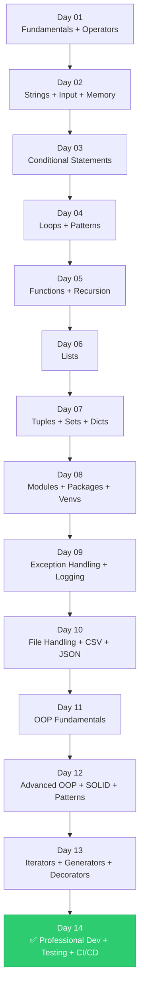

---

## 1.2 Day-by-Day Summary Table

| Day | Topic | Key Concepts | Industry Relevance |
|-----|-------|-------------|-------------------|
| 01 | Python Fundamentals | Variables, data types, operators, expressions | Base of all Python code |
| 02 | Strings + Input | String methods, formatting, f-strings, memory model | Text processing, APIs |
| 03 | Conditionals | if/elif/else, ternary, match-case | Business logic, routing |
| 04 | Loops | for, while, break/continue, pattern printing | Iteration, automation |
| 05 | Functions + Recursion | def, *args, **kwargs, lambda, recursion | Code reuse, modular design |
| 06 | Lists | CRUD, slicing, comprehensions, sorting | Data pipelines |
| 07 | Tuples + Sets + Dicts | Immutability, hashing, dict comprehensions | Config, caching |
| 08 | Modules + Packages | import, pip, venv, project architecture | Dependency management |
| 09 | Exception Handling | try/except, custom exceptions, logging | Production reliability |
| 10 | File Handling | open, CSV, JSON, ETL patterns | Data engineering |
| 11 | OOP Fundamentals | Classes, objects, __init__, magic methods | Software design |
| 12 | Advanced OOP | Inheritance, MRO, SOLID, Design Patterns | Enterprise architecture |
| 13 | Advanced Python | Iterators, generators, decorators, context managers | Performance, frameworks |
| **14** | **Professional Dev** | **Testing, CI/CD, Code Quality** | **Production Engineering** |

---

## 1.3 OOP Cheat Sheet

```python
# ─── CLASS BASICS ───────────────────────────────────────────────
class Animal:
    species = "Mammal"                        # Class variable

    def __init__(self, name: str, age: int):  # Constructor
        self.name = name                       # Instance variable
        self.age = age

    def __str__(self):  return f"{self.name}({self.age})"
    def __repr__(self): return f"Animal(name={self.name!r}, age={self.age!r})"
    def __eq__(self, other): return self.name == other.name
    def __lt__(self, other): return self.age < other.age

# ─── INHERITANCE ────────────────────────────────────────────────
class Dog(Animal):
    def __init__(self, name, age, breed):
        super().__init__(name, age)
        self.breed = breed

    def speak(self): return "Woof!"

# ─── ENCAPSULATION ──────────────────────────────────────────────
class BankAccount:
    def __init__(self, balance):
        self.__balance = balance              # Private

    @property
    def balance(self): return self.__balance

    @balance.setter
    def balance(self, v):
        if v < 0: raise ValueError("Negative balance")
        self.__balance = v

# ─── POLYMORPHISM ───────────────────────────────────────────────
class Cat(Animal):
    def speak(self): return "Meow!"

animals = [Dog("Rex", 3, "Lab"), Cat("Whiskers", 2)]
for a in animals:
    print(a.speak())                          # Polymorphic call

# ─── ABC ────────────────────────────────────────────────────────
from abc import ABC, abstractmethod
class Shape(ABC):
    @abstractmethod
    def area(self) -> float: ...

class Circle(Shape):
    def __init__(self, r): self.r = r
    def area(self): return 3.14159 * self.r ** 2

# ─── DATACLASS ──────────────────────────────────────────────────
from dataclasses import dataclass, field
@dataclass
class Point:
    x: float
    y: float
    tags: list = field(default_factory=list)
```

---

## 1.4 Advanced Python Cheat Sheet

```python
# ─── ITERATORS ──────────────────────────────────────────────────
class Counter:
    def __init__(self, max_val):
        self.max_val = max_val
        self.current = 0
    def __iter__(self): return self
    def __next__(self):
        if self.current >= self.max_val: raise StopIteration
        self.current += 1
        return self.current

# ─── GENERATORS ─────────────────────────────────────────────────
def infinite_ids(start=1):
    while True:
        yield start
        start += 1

def chunked(iterable, size):
    chunk = []
    for item in iterable:
        chunk.append(item)
        if len(chunk) == size:
            yield chunk
            chunk = []
    if chunk: yield chunk

# ─── DECORATORS ─────────────────────────────────────────────────
import functools, time

def timer(func):
    @functools.wraps(func)
    def wrapper(*args, **kwargs):
        start = time.perf_counter()
        result = func(*args, **kwargs)
        print(f"{func.__name__} took {time.perf_counter()-start:.4f}s")
        return result
    return wrapper

def retry(times=3, exceptions=(Exception,)):
    def decorator(func):
        @functools.wraps(func)
        def wrapper(*args, **kwargs):
            for attempt in range(times):
                try: return func(*args, **kwargs)
                except exceptions as e:
                    if attempt == times - 1: raise
                    print(f"Retry {attempt+1}/{times}")
        return wrapper
    return decorator

# ─── CONTEXT MANAGERS ───────────────────────────────────────────
from contextlib import contextmanager

@contextmanager
def managed_resource(name):
    print(f"Acquiring {name}")
    try:
        yield name
    finally:
        print(f"Releasing {name}")

# ─── COMPREHENSIONS ─────────────────────────────────────────────
squares     = [x**2 for x in range(10)]
even_sq     = [x**2 for x in range(10) if x % 2 == 0]
matrix_flat = [v for row in [[1,2],[3,4]] for v in row]
word_len    = {w: len(w) for w in ["hello", "world"]}
gen_sum     = sum(x**2 for x in range(1000))           # Memory efficient
```

---

# SECTION 2 — PROFESSIONAL SOFTWARE ENGINEERING

## 2.1 What Makes Software Professional?

Professional software is not just working code — it is **correct, maintainable, tested, observable, documented, and scalable** code that an entire team can collaborate on over years.

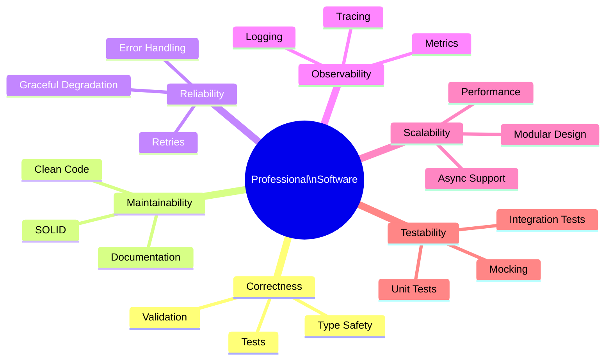

---

## 2.2 Software Lifecycle

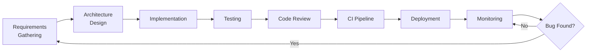

## 2.3 The Seven Pillars of Professional Python Code

| Pillar | Definition | Tools |
|--------|-----------|-------|
| **Maintainability** | Code is easy to read, modify, extend | black, ruff, type hints |
| **Reliability** | Code handles failures gracefully | exceptions, retries, logging |
| **Scalability** | Architecture can handle growth | async, modular design |
| **Observability** | You can see what's happening in production | logging, metrics, tracing |
| **Testability** | Code is easy to test in isolation | pytest, mocking, DI |
| **Security** | Code protects data and systems | input validation, secrets management |
| **Documentation** | Knowledge is captured and shared | docstrings, README, ADRs |

---

## 2.4 Real-World Engineering Standards

```python
# ❌ Amateur Code
def p(d):
    r = []
    for i in d:
        if i > 0:
            r.append(i * 2)
    return r

# ✅ Professional Code
from typing import Sequence

def double_positives(data: Sequence[float]) -> list[float]:
    """
    Return a new list with each positive number doubled.

    Args:
        data: A sequence of numbers to process.

    Returns:
        List of doubled positive numbers, preserving order.

    Example:
        >>> double_positives([1, -2, 3, 0])
        [2, 6]
    """
    return [value * 2 for value in data if value > 0]
```

**Differences:**
- ✅ Descriptive name
- ✅ Type hints
- ✅ Docstring with Args, Returns, Example
- ✅ Comprehension instead of mutation loop
- ✅ Testable in isolation

---

# SECTION 3 — INTRODUCTION TO TESTING

## 3.1 What is Testing?

> **Testing** is the process of executing code with the intent of finding defects and verifying that software behaves as expected under defined conditions.

### The Cost of Bugs

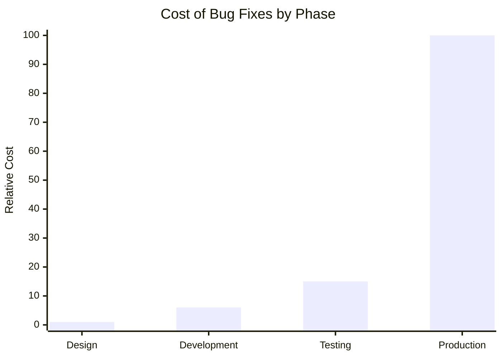

> A bug found in **production** costs 100x more to fix than a bug found in **design**.

---

## 3.2 Testing Pyramid

```
           /\
          /  \
         / E2E\          ← End-to-End Tests (few, slow, expensive)
        /──────\
       / Integr-\        ← Integration Tests (moderate)
      /  ation   \
     /────────────\
    /   Unit Tests  \    ← Unit Tests (many, fast, cheap)
   /──────────────────\
```

| Layer | Speed | Cost | Count | Tools |
|-------|-------|------|-------|-------|
| Unit | ⚡ Very Fast | 💰 Cheap | Hundreds | pytest, unittest |
| Integration | 🏃 Moderate | 💰💰 Medium | Dozens | pytest, testcontainers |
| E2E / System | 🐢 Slow | 💰💰💰 Expensive | Few | Selenium, Playwright |

---

## 3.3 Types of Testing

### Unit Testing
Tests **one function or class in isolation**, with all dependencies mocked.

```python
def add(a: int, b: int) -> int:
    return a + b

def test_add():
    assert add(2, 3) == 5
    assert add(-1, 1) == 0
    assert add(0, 0) == 0
```

### Integration Testing
Tests **multiple components working together**.

```python
# Tests that UserService correctly interacts with Database
def test_create_user_persists_to_db(db_session):
    service = UserService(db_session)
    user = service.create_user("alice@example.com")
    assert db_session.query(User).filter_by(email="alice@example.com").first()
```

### System Testing
Tests the **entire application** from end to end.

### Regression Testing
Ensures **previously fixed bugs** do not re-appear.

### Acceptance Testing
Verifies software meets **business requirements** (often written by QA/Product).

---

## 3.4 Testing Workflow

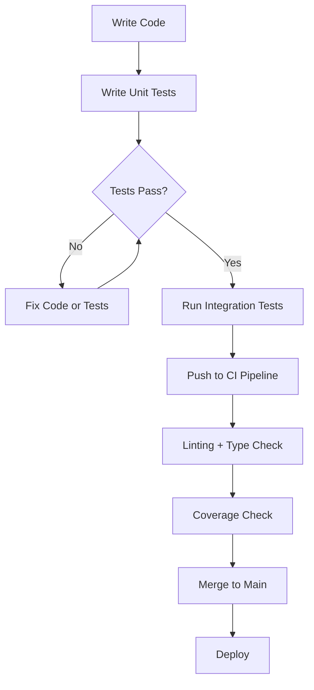

---

# SECTION 4 — UNITTEST MASTERCLASS

## 4.1 Overview

`unittest` is Python's **built-in testing framework**, inspired by JUnit (Java). It is available without installation and is commonly used in enterprise codebases.

```python
import unittest
```

## 4.2 Basic Test Case

```python
# math_utils.py
def add(a, b): return a + b
def subtract(a, b): return a - b
def multiply(a, b): return a * b
def divide(a, b):
    if b == 0:
        raise ZeroDivisionError("Cannot divide by zero")
    return a / b
```

```python
# test_math_utils.py
import unittest
from math_utils import add, subtract, multiply, divide

class TestMathUtils(unittest.TestCase):

    # ─── BASIC ASSERTIONS ────────────────────────────────────────
    def test_add_positive(self):
        self.assertEqual(add(2, 3), 5)

    def test_add_negative(self):
        self.assertEqual(add(-1, -1), -2)

    def test_add_zero(self):
        self.assertEqual(add(0, 5), 5)

    def test_subtract(self):
        self.assertEqual(subtract(10, 4), 6)

    def test_multiply(self):
        self.assertEqual(multiply(3, 4), 12)

    def test_divide_normal(self):
        self.assertAlmostEqual(divide(10, 3), 3.333, places=3)

    # ─── EXCEPTION TESTING ───────────────────────────────────────
    def test_divide_by_zero(self):
        with self.assertRaises(ZeroDivisionError):
            divide(10, 0)

    def test_divide_by_zero_message(self):
        with self.assertRaisesRegex(ZeroDivisionError, "Cannot divide by zero"):
            divide(10, 0)


if __name__ == "__main__":
    unittest.main(verbosity=2)
```

## 4.3 All unittest Assertions

```python
class TestAssertions(unittest.TestCase):

    def test_equality(self):
        self.assertEqual(1 + 1, 2)
        self.assertNotEqual(1 + 1, 3)

    def test_boolean(self):
        self.assertTrue(5 > 3)
        self.assertFalse(3 > 5)

    def test_none(self):
        self.assertIsNone(None)
        self.assertIsNotNone(42)

    def test_identity(self):
        a = [1, 2, 3]
        self.assertIs(a, a)
        self.assertIsNot(a, [1, 2, 3])

    def test_membership(self):
        self.assertIn(3, [1, 2, 3])
        self.assertNotIn(4, [1, 2, 3])

    def test_isinstance(self):
        self.assertIsInstance(42, int)
        self.assertNotIsInstance(42, str)

    def test_almost_equal(self):
        self.assertAlmostEqual(3.14159, 3.141, places=3)

    def test_greater_less(self):
        self.assertGreater(5, 3)
        self.assertGreaterEqual(5, 5)
        self.assertLess(3, 5)
        self.assertLessEqual(5, 5)

    def test_sequences(self):
        self.assertListEqual([1, 2, 3], [1, 2, 3])
        self.assertTupleEqual((1, 2), (1, 2))
        self.assertDictEqual({"a": 1}, {"a": 1})
        self.assertSetEqual({1, 2, 3}, {3, 2, 1})

    def test_string_contains(self):
        self.assertIn("hello", "hello world")
        self.assertRegex("hello world", r"h\w+")
```

## 4.4 setUp and tearDown

```python
import unittest
import tempfile, os

class TestFileOperations(unittest.TestCase):

    # ─── Runs BEFORE each test ───────────────────────────────────
    def setUp(self):
        self.test_dir = tempfile.mkdtemp()
        self.test_file = os.path.join(self.test_dir, "test.txt")
        with open(self.test_file, "w") as f:
            f.write("Hello Test")

    # ─── Runs AFTER each test ────────────────────────────────────
    def tearDown(self):
        import shutil
        shutil.rmtree(self.test_dir)

    def test_file_exists(self):
        self.assertTrue(os.path.exists(self.test_file))

    def test_file_content(self):
        with open(self.test_file) as f:
            self.assertEqual(f.read(), "Hello Test")


class TestDatabaseIntegration(unittest.TestCase):

    # ─── Runs ONCE before all tests in class ─────────────────────
    @classmethod
    def setUpClass(cls):
        cls.conn = {"host": "localhost", "connected": True}
        print("\n[DB] Connection established")

    # ─── Runs ONCE after all tests in class ──────────────────────
    @classmethod
    def tearDownClass(cls):
        cls.conn["connected"] = False
        print("\n[DB] Connection closed")

    def test_connection(self):
        self.assertTrue(self.conn["connected"])
```

## 4.5 Test Suites

```python
import unittest
from test_math_utils import TestMathUtils
from test_file_operations import TestFileOperations

def build_suite():
    suite = unittest.TestSuite()
    suite.addTest(unittest.TestLoader().loadTestsFromTestCase(TestMathUtils))
    suite.addTest(unittest.TestLoader().loadTestsFromTestCase(TestFileOperations))
    return suite

if __name__ == "__main__":
    runner = unittest.TextTestRunner(verbosity=2)
    runner.run(build_suite())
```

## 4.6 Skipping Tests

```python
class TestFeatures(unittest.TestCase):

    @unittest.skip("Feature not implemented yet")
    def test_future_feature(self):
        pass

    @unittest.skipIf(os.name == "nt", "Not supported on Windows")
    def test_unix_only(self):
        pass

    @unittest.skipUnless(os.getenv("RUN_SLOW"), "Skipped unless RUN_SLOW set")
    def test_slow_operation(self):
        pass

    @unittest.expectedFailure
    def test_known_bug(self):
        self.assertEqual(1, 2)  # Known bug — expected to fail
```

## 4.7 Subtest (Parameterized-like Testing)

```python
class TestParameterized(unittest.TestCase):

    def test_add_multiple(self):
        test_cases = [
            (2, 3, 5),
            (-1, 1, 0),
            (0, 0, 0),
            (100, -50, 50),
        ]
        for a, b, expected in test_cases:
            with self.subTest(a=a, b=b, expected=expected):
                self.assertEqual(add(a, b), expected)
```

---

# SECTION 5 — PYTEST MASTERCLASS

## 5.1 Why pytest?

| Feature | unittest | pytest |
|---------|----------|--------|
| Installation | Built-in | `pip install pytest` |
| Syntax | Class + self.assert* | Simple `assert` |
| Fixtures | setUp/tearDown | `@pytest.fixture` (powerful) |
| Parametrize | subTest | `@pytest.mark.parametrize` |
| Plugins | Few | 1000+ plugins |
| Output | Basic | Rich, colorized |
| Discovery | Manual | Automatic |

## 5.2 Installation

```bash
pip install pytest pytest-cov pytest-mock pytest-xdist pytest-html
```

## 5.3 First pytest Test

```python
# test_calculator.py
from calculator import add, subtract, multiply, divide
import pytest

# ─── BASIC TESTS ─────────────────────────────────────────────────
def test_add():
    assert add(2, 3) == 5

def test_add_negative():
    assert add(-1, -1) == -2

def test_subtract():
    assert subtract(10, 4) == 6

def test_divide_by_zero():
    with pytest.raises(ZeroDivisionError, match="Cannot divide by zero"):
        divide(10, 0)

def test_multiply_floats():
    assert multiply(2.5, 4) == pytest.approx(10.0)
```

**Run:**
```bash
pytest                          # Run all tests
pytest test_calculator.py       # Run specific file
pytest -v                       # Verbose output
pytest -k "add"                 # Run tests matching keyword
pytest -x                       # Stop at first failure
pytest --tb=short               # Short traceback
```

## 5.4 pytest Fixtures

```python
# conftest.py  ← Shared fixtures go here
import pytest
from myapp.models import UserRepository

@pytest.fixture
def sample_user():
    """A basic user dictionary."""
    return {"name": "Alice", "email": "alice@example.com", "age": 30}

@pytest.fixture
def user_repo():
    """In-memory user repository."""
    repo = UserRepository()
    yield repo
    repo.clear()  # Teardown after yield

@pytest.fixture(scope="module")
def db_connection():
    """Module-scoped DB connection — created once per test module."""
    conn = create_test_connection()
    yield conn
    conn.close()

@pytest.fixture(scope="session")
def app_config():
    """Session-scoped — created once per test session."""
    return {"env": "test", "debug": True}
```

```python
# test_users.py
def test_create_user(user_repo, sample_user):
    result = user_repo.create(sample_user)
    assert result["email"] == "alice@example.com"

def test_get_user(user_repo, sample_user):
    user_repo.create(sample_user)
    found = user_repo.get_by_email("alice@example.com")
    assert found is not None

def test_uses_config(app_config):
    assert app_config["env"] == "test"
```

### Fixture Scopes

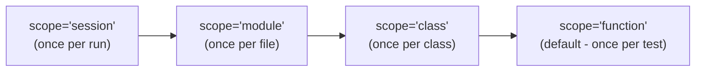

## 5.5 Parametrize

```python
import pytest
from calculator import add, divide

@pytest.mark.parametrize("a, b, expected", [
    (2, 3, 5),
    (-1, 1, 0),
    (0, 0, 0),
    (100, -50, 50),
    (1_000_000, 1, 1_000_001),
])
def test_add_parametrized(a, b, expected):
    assert add(a, b) == expected


@pytest.mark.parametrize("a, b, exc", [
    (10, 0, ZeroDivisionError),
    ("a", 1, TypeError),
])
def test_divide_exceptions(a, b, exc):
    with pytest.raises(exc):
        divide(a, b)
```

## 5.6 Markers

```python
import pytest

@pytest.mark.slow
def test_slow_operation():
    import time; time.sleep(2)
    assert True

@pytest.mark.smoke
def test_health_check():
    assert True

@pytest.mark.integration
def test_database_connection():
    assert True
```

**pytest.ini:**
```ini
[pytest]
markers =
    slow: marks tests as slow
    smoke: marks tests as smoke tests
    integration: marks integration tests
    unit: marks unit tests
```

**Run specific markers:**
```bash
pytest -m "smoke"              # Only smoke tests
pytest -m "not slow"           # Skip slow tests
pytest -m "unit and not slow"  # Combined
```

## 5.7 conftest.py — Shared Configuration

```python
# tests/conftest.py
import pytest
import sys, os

# ─── Add src to path ─────────────────────────────────────────────
sys.path.insert(0, os.path.abspath(os.path.join(os.path.dirname(__file__), "..", "src")))

# ─── Global fixtures ─────────────────────────────────────────────
@pytest.fixture(autouse=True)
def reset_environment(monkeypatch):
    """Auto-applied to all tests — reset env vars."""
    monkeypatch.setenv("APP_ENV", "test")

@pytest.fixture
def temp_dir(tmp_path):
    """Temporary directory for file tests."""
    return tmp_path

@pytest.fixture
def mock_api_response():
    return {
        "status": "ok",
        "data": [{"id": 1, "name": "Item 1"}, {"id": 2, "name": "Item 2"}]
    }
```

## 5.8 pytest Plugins

| Plugin | Purpose | Install |
|--------|---------|---------|
| `pytest-cov` | Code coverage | `pip install pytest-cov` |
| `pytest-mock` | Mocking | `pip install pytest-mock` |
| `pytest-xdist` | Parallel testing | `pip install pytest-xdist` |
| `pytest-html` | HTML reports | `pip install pytest-html` |
| `pytest-timeout` | Test timeouts | `pip install pytest-timeout` |
| `pytest-randomly` | Randomize order | `pip install pytest-randomly` |
| `pytest-benchmark` | Performance benchmarking | `pip install pytest-benchmark` |
| `freezegun` | Mock datetime | `pip install freezegun` |
| `responses` | Mock HTTP | `pip install responses` |
| `factory-boy` | Test data factories | `pip install factory-boy` |

## 5.9 Professional pytest Configuration

```toml
# pyproject.toml
[tool.pytest.ini_options]
testpaths = ["tests"]
python_files = ["test_*.py", "*_test.py"]
python_classes = ["Test*"]
python_functions = ["test_*"]
addopts = [
    "-v",
    "--tb=short",
    "--strict-markers",
    "--cov=src",
    "--cov-report=term-missing",
    "--cov-report=html:htmlcov",
    "--cov-fail-under=80",
]
markers = [
    "unit: Unit tests",
    "integration: Integration tests",
    "slow: Slow tests (skip with -m 'not slow')",
    "smoke: Smoke tests",
]
```

---

# SECTION 6 — MOCKING MASTERCLASS

## 6.1 What is Mocking?

> **Mocking** is the practice of replacing real dependencies (databases, APIs, file systems, email services) with controlled fake objects during testing, so tests are **fast, isolated, and predictable**.

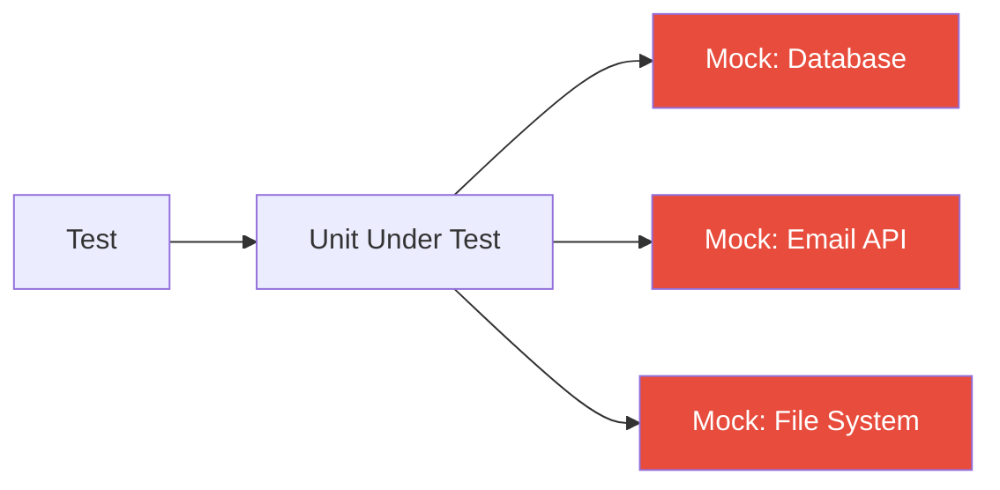

## 6.2 unittest.mock

```python
from unittest.mock import Mock, MagicMock, patch, call

# ─── Basic Mock ──────────────────────────────────────────────────
mock = Mock()
mock.return_value = 42
result = mock(1, 2, 3)
assert result == 42
mock.assert_called_once_with(1, 2, 3)

# ─── MagicMock (supports magic methods) ─────────────────────────
magic = MagicMock()
magic.__len__.return_value = 5
assert len(magic) == 5

# ─── Side Effects ────────────────────────────────────────────────
mock_conn = Mock()
mock_conn.query.side_effect = [
    [{"id": 1}],         # First call returns this
    [{"id": 2}],         # Second call returns this
    ConnectionError(),   # Third call raises exception
]
```

## 6.3 patch — Replace Real Objects

```python
from unittest.mock import patch
import pytest

# ─── Function to test ────────────────────────────────────────────
# src/weather_service.py
import requests

def get_temperature(city: str) -> float:
    response = requests.get(f"https://api.weather.com/v1/{city}")
    data = response.json()
    return data["temperature"]
```

```python
# tests/test_weather_service.py
from unittest.mock import patch, MagicMock
from weather_service import get_temperature

def test_get_temperature():
    mock_response = MagicMock()
    mock_response.json.return_value = {"temperature": 25.5}

    with patch("weather_service.requests.get", return_value=mock_response) as mock_get:
        temp = get_temperature("London")
        assert temp == 25.5
        mock_get.assert_called_once_with("https://api.weather.com/v1/London")

# ─── As decorator ────────────────────────────────────────────────
@patch("weather_service.requests.get")
def test_get_temperature_decorator(mock_get):
    mock_get.return_value.json.return_value = {"temperature": 30.0}
    temp = get_temperature("Paris")
    assert temp == 30.0
```

## 6.4 pytest-mock (mocker fixture)

```python
# tests/test_email_service.py
def test_send_welcome_email(mocker):
    mock_smtp = mocker.patch("email_service.smtplib.SMTP")
    mock_smtp_instance = mock_smtp.return_value.__enter__.return_value

    from email_service import send_welcome_email
    send_welcome_email("alice@example.com", "Alice")

    mock_smtp_instance.sendmail.assert_called_once()
    args = mock_smtp_instance.sendmail.call_args
    assert "alice@example.com" in args[0]
```

## 6.5 Mocking Database

```python
# src/user_service.py
class UserService:
    def __init__(self, db):
        self.db = db

    def get_user(self, user_id: int):
        user = self.db.find_one({"id": user_id})
        if not user:
            raise ValueError(f"User {user_id} not found")
        return user

    def create_user(self, email: str, name: str) -> dict:
        if self.db.find_one({"email": email}):
            raise ValueError("Email already exists")
        user = {"id": self.db.count() + 1, "email": email, "name": name}
        self.db.insert(user)
        return user
```

```python
# tests/test_user_service.py
import pytest
from unittest.mock import MagicMock
from user_service import UserService

@pytest.fixture
def mock_db():
    return MagicMock()

@pytest.fixture
def user_service(mock_db):
    return UserService(mock_db)

def test_get_user_found(user_service, mock_db):
    mock_db.find_one.return_value = {"id": 1, "name": "Alice"}
    user = user_service.get_user(1)
    assert user["name"] == "Alice"
    mock_db.find_one.assert_called_once_with({"id": 1})

def test_get_user_not_found(user_service, mock_db):
    mock_db.find_one.return_value = None
    with pytest.raises(ValueError, match="User 99 not found"):
        user_service.get_user(99)

def test_create_user_success(user_service, mock_db):
    mock_db.find_one.return_value = None
    mock_db.count.return_value = 0
    user = user_service.create_user("bob@example.com", "Bob")
    assert user["email"] == "bob@example.com"
    mock_db.insert.assert_called_once()

def test_create_user_duplicate_email(user_service, mock_db):
    mock_db.find_one.return_value = {"id": 1, "email": "bob@example.com"}
    with pytest.raises(ValueError, match="Email already exists"):
        user_service.create_user("bob@example.com", "Bob2")
```

## 6.6 Mocking External APIs

```python
# tests/test_payment_service.py
import pytest
import responses
import requests
from payment_service import PaymentGateway

@pytest.fixture
def gateway():
    return PaymentGateway(api_key="test_key_123")

@responses.activate
def test_successful_payment(gateway):
    responses.add(
        responses.POST,
        "https://api.stripe.com/v1/charges",
        json={"id": "ch_123", "status": "succeeded", "amount": 5000},
        status=200,
    )
    result = gateway.charge(amount=5000, card_token="tok_visa")
    assert result["status"] == "succeeded"

@responses.activate
def test_payment_declined(gateway):
    responses.add(
        responses.POST,
        "https://api.stripe.com/v1/charges",
        json={"error": {"message": "Card declined"}},
        status=402,
    )
    with pytest.raises(Exception, match="Card declined"):
        gateway.charge(amount=5000, card_token="tok_declined")
```

## 6.7 Mocking File System

```python
import pytest
from unittest.mock import mock_open, patch
from file_processor import read_config, write_report

def test_read_config():
    config_data = '{"host": "localhost", "port": 5432}'
    with patch("builtins.open", mock_open(read_data=config_data)):
        config = read_config("config.json")
    assert config["host"] == "localhost"
    assert config["port"] == 5432

def test_write_report(tmp_path):
    report_file = tmp_path / "report.txt"
    data = {"total": 1000, "items": 50}
    write_report(str(report_file), data)
    content = report_file.read_text()
    assert "total: 1000" in content
```

## 6.8 Mocking Datetime

```python
from freezegun import freeze_time
from datetime import datetime
from my_module import get_current_year, get_greeting

@freeze_time("2024-01-15 10:30:00")
def test_get_current_year():
    assert get_current_year() == 2024

@freeze_time("2024-12-25")
def test_christmas_greeting():
    greeting = get_greeting()
    assert "Merry Christmas" in greeting
```

---

# SECTION 7 — CODE COVERAGE

## 7.1 What is Code Coverage?

> **Code coverage** measures the percentage of your source code that is executed when your tests run. Higher coverage means more code is validated by tests.

## 7.2 Types of Coverage

| Type | Description | Formula |
|------|-------------|---------|
| **Line Coverage** | % of lines executed | Lines Executed / Total Lines |
| **Branch Coverage** | % of branches (if/else paths) | Branches Taken / Total Branches |
| **Function Coverage** | % of functions called | Functions Called / Total Functions |
| **Statement Coverage** | % of statements executed | Statements Run / Total Statements |

## 7.3 coverage.py + pytest-cov

```bash
# Install
pip install coverage pytest-cov

# Run with coverage
pytest --cov=src --cov-report=term-missing

# HTML report
pytest --cov=src --cov-report=html

# XML report (for CI)
pytest --cov=src --cov-report=xml

# Fail if coverage < 80%
pytest --cov=src --cov-fail-under=80
```

## 7.4 .coveragerc

```ini
# .coveragerc
[run]
source = src
omit =
    */migrations/*
    */tests/*
    */venv/*
    setup.py

[report]
exclude_lines =
    pragma: no cover
    def __repr__
    raise NotImplementedError
    if __name__ == .__main__.:
    pass

[html]
directory = htmlcov
```

## 7.5 Sample Coverage Report

```
---------- coverage: platform linux, python 3.12 ----------
Name                          Stmts   Miss  Cover   Missing
-----------------------------------------------------------
src/calculator.py                12      0   100%
src/user_service.py              28      4    86%   45, 67, 89, 102
src/email_service.py             15      8    47%   22-30, 45-52
src/payment_service.py           22      2    91%   78, 79
-----------------------------------------------------------
TOTAL                            77     14    82%

REQUIRED: 80% ✅ PASSED
```

## 7.6 Professional Coverage Standards

| Project Type | Minimum Coverage | Target |
|-------------|-----------------|--------|
| Open Source Library | 90% | 95% |
| Production Backend | 80% | 90% |
| Internal Tools | 70% | 80% |
| Scripts / CLI | 60% | 70% |
| Legacy Code | 50% | 70% |

> 💡 **Pro Tip:** 100% coverage does NOT mean bug-free. Coverage measures **what** was run, not **how well** it was tested.

---

# SECTION 8 — TEST DRIVEN DEVELOPMENT (TDD)

## 8.1 The TDD Cycle

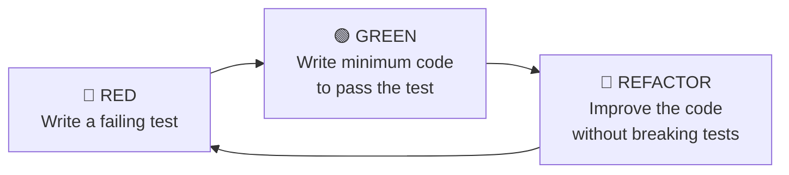

## 8.2 TDD Workflow — Complete Example

**Step 1: 🔴 RED — Write a Failing Test**

```python
# test_password_validator.py
import pytest
from password_validator import PasswordValidator

def test_password_too_short():
    validator = PasswordValidator()
    result = validator.validate("abc")
    assert result.is_valid == False
    assert "at least 8 characters" in result.errors
```

**Run → Test Fails (No module named 'password_validator')**

---

**Step 2: 🟢 GREEN — Minimum Code to Pass**

```python
# password_validator.py
from dataclasses import dataclass, field

@dataclass
class ValidationResult:
    is_valid: bool
    errors: list = field(default_factory=list)

class PasswordValidator:
    def validate(self, password: str) -> ValidationResult:
        errors = []
        if len(password) < 8:
            errors.append("Password must be at least 8 characters")
        return ValidationResult(is_valid=len(errors) == 0, errors=errors)
```

**Run → Test Passes 🟢**

---

**Step 3: Add More Tests**

```python
def test_password_no_uppercase():
    validator = PasswordValidator()
    result = validator.validate("password123")
    assert result.is_valid == False
    assert any("uppercase" in e for e in result.errors)

def test_password_no_digit():
    validator = PasswordValidator()
    result = validator.validate("Password!")
    assert result.is_valid == False

def test_password_valid():
    validator = PasswordValidator()
    result = validator.validate("Password123!")
    assert result.is_valid == True
    assert len(result.errors) == 0
```

**Step 4: 🟢 GREEN — Extend Implementation**

```python
class PasswordValidator:
    MIN_LENGTH = 8

    def validate(self, password: str) -> ValidationResult:
        errors = []

        if len(password) < self.MIN_LENGTH:
            errors.append(f"Password must be at least {self.MIN_LENGTH} characters")

        if not any(c.isupper() for c in password):
            errors.append("Password must contain at least one uppercase letter")

        if not any(c.isdigit() for c in password):
            errors.append("Password must contain at least one digit")

        if not any(c in "!@#$%^&*()_+" for c in password):
            errors.append("Password must contain at least one special character")

        return ValidationResult(is_valid=len(errors) == 0, errors=errors)
```

**Step 5: 🔵 REFACTOR**

```python
import re
from dataclasses import dataclass, field
from typing import Callable

@dataclass
class ValidationResult:
    is_valid: bool
    errors: list[str] = field(default_factory=list)

class PasswordValidator:
    RULES: list[tuple[Callable, str]] = [
        (lambda p: len(p) >= 8,                     "at least 8 characters"),
        (lambda p: any(c.isupper() for c in p),     "at least one uppercase letter"),
        (lambda p: any(c.isdigit() for c in p),     "at least one digit"),
        (lambda p: bool(re.search(r"[!@#$%^&*]", p)), "at least one special character"),
    ]

    def validate(self, password: str) -> ValidationResult:
        errors = [
            f"Password must contain {msg}"
            for rule, msg in self.RULES
            if not rule(password)
        ]
        return ValidationResult(is_valid=not errors, errors=errors)
```

## 8.3 Benefits of TDD

| Benefit | Explanation |
|---------|------------|
| **Design Clarity** | Tests force you to think about interfaces before implementation |
| **Fewer Bugs** | Bugs are caught immediately as code is written |
| **Refactoring Safety** | Tests protect against regressions during cleanup |
| **Documentation** | Tests serve as living documentation |
| **Confidence** | You can deploy without fear |

---

# SECTION 9 — CODE QUALITY TOOLS

## 9.1 The Code Quality Stack

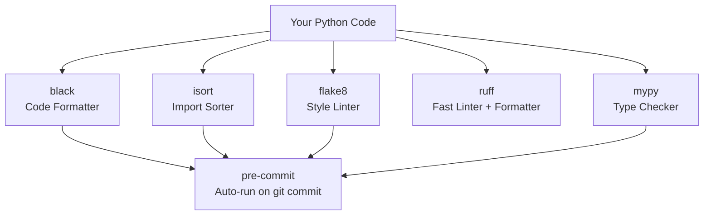

## 9.2 black — The Uncompromising Formatter

```bash
pip install black
black .                 # Format all Python files
black --check .         # Check without formatting (CI mode)
black --diff .          # Show what would change
black --line-length 100 .  # Custom line length
```

**Before black:**
```python
def calculate(x,y,   z):
  return x+y+z
result=calculate(1,2,3)
data = {'name': 'Alice','age': 30,'email': 'alice@example.com'}
```

**After black:**
```python
def calculate(x, y, z):
    return x + y + z


result = calculate(1, 2, 3)
data = {"name": "Alice", "age": 30, "email": "alice@example.com"}
```

**pyproject.toml:**
```toml
[tool.black]
line-length = 88
target-version = ["py312"]
include = '\.pyi?$'
exclude = '''
/(
    \.git
  | \.venv
  | build
  | dist
)/
'''
```

## 9.3 flake8 — Style + Error Linter

```bash
pip install flake8
flake8 .                    # Check all files
flake8 src/                 # Check specific directory
flake8 --max-line-length=88 # Match black's line length
```

**Common flake8 codes:**

| Code | Meaning |
|------|---------|
| `E101` | Indentation contains mixed spaces/tabs |
| `E302` | Expected 2 blank lines |
| `E501` | Line too long |
| `F401` | Module imported but unused |
| `F811` | Redefinition of unused name |
| `W291` | Trailing whitespace |
| `W503` | Line break before binary operator |

**.flake8:**
```ini
[flake8]
max-line-length = 88
extend-ignore = E203, W503
exclude =
    .git,
    __pycache__,
    .venv,
    build,
    dist
per-file-ignores =
    tests/*: F401
```

## 9.4 ruff — Lightning-Fast Linter

```bash
pip install ruff
ruff check .             # Lint
ruff check . --fix       # Auto-fix
ruff format .            # Format (replaces black)
```

**pyproject.toml:**
```toml
[tool.ruff]
line-length = 88
target-version = "py312"

[tool.ruff.lint]
select = ["E", "F", "I", "N", "W", "UP", "B", "C4", "SIM"]
ignore = ["E501"]

[tool.ruff.lint.per-file-ignores]
"tests/*" = ["S101"]
```

> 🚀 `ruff` is **100x faster** than flake8+isort+black combined. Used by FastAPI, Pydantic, Hugging Face.

## 9.5 isort — Import Sorter

```bash
pip install isort
isort .
isort --check-only .
```

**Before isort:**
```python
import os
import requests
from datetime import datetime
import sys
from pathlib import Path
import json
from mymodule import helper
```

**After isort:**
```python
import json
import os
import sys
from datetime import datetime
from pathlib import Path

import requests

from mymodule import helper
```

## 9.6 mypy — Static Type Checker

```bash
pip install mypy
mypy src/
mypy --strict src/
```

**Example:**
```python
# Without types — mypy skips checking
def greet(name):
    return "Hello, " + name

greet(123)  # Runtime error!

# With types — mypy catches the bug
def greet(name: str) -> str:
    return "Hello, " + name

greet(123)  # mypy error: Argument 1 has incompatible type "int"; expected "str"
```

**mypy.ini:**
```ini
[mypy]
python_version = 3.12
warn_return_any = True
warn_unused_configs = True
disallow_untyped_defs = True
disallow_incomplete_defs = True
check_untyped_defs = True
ignore_missing_imports = True

[mypy-tests.*]
ignore_errors = True
```

## 9.7 pre-commit — Automate Quality Checks

```bash
pip install pre-commit
pre-commit install    # Install git hooks
pre-commit run --all-files  # Run manually
```

**.pre-commit-config.yaml:**
```yaml
repos:
  - repo: https://github.com/pre-commit/pre-commit-hooks
    rev: v4.5.0
    hooks:
      - id: trailing-whitespace
      - id: end-of-file-fixer
      - id: check-yaml
      - id: check-json
      - id: check-toml
      - id: check-merge-conflict
      - id: debug-statements

  - repo: https://github.com/astral-sh/ruff-pre-commit
    rev: v0.1.6
    hooks:
      - id: ruff
        args: [--fix]
      - id: ruff-format

  - repo: https://github.com/pre-commit/mirrors-mypy
    rev: v1.7.0
    hooks:
      - id: mypy
        additional_dependencies: [types-requests, types-PyYAML]
```

**Now every `git commit` automatically:**
1. Formats code with ruff
2. Sorts imports
3. Checks types with mypy
4. Removes trailing whitespace
5. Validates JSON/YAML/TOML

---

# SECTION 10 — LOGGING & MONITORING REVIEW

## 10.1 Production Logging Setup

```python
# src/core/logging_config.py
import logging
import logging.config
import json
from datetime import datetime

class JSONFormatter(logging.Formatter):
    """Structured JSON logging for production."""

    def format(self, record: logging.LogRecord) -> str:
        log_entry = {
            "timestamp": datetime.utcnow().isoformat(),
            "level": record.levelname,
            "logger": record.name,
            "message": record.getMessage(),
            "module": record.module,
            "function": record.funcName,
            "line": record.lineno,
        }
        if record.exc_info:
            log_entry["exception"] = self.formatException(record.exc_info)
        if hasattr(record, "request_id"):
            log_entry["request_id"] = record.request_id
        return json.dumps(log_entry)


LOGGING_CONFIG = {
    "version": 1,
    "disable_existing_loggers": False,
    "formatters": {
        "json": {"()": JSONFormatter},
        "console": {
            "format": "%(asctime)s | %(levelname)-8s | %(name)s | %(message)s",
            "datefmt": "%Y-%m-%d %H:%M:%S",
        },
    },
    "handlers": {
        "console": {
            "class": "logging.StreamHandler",
            "formatter": "console",
            "stream": "ext://sys.stdout",
        },
        "file": {
            "class": "logging.handlers.RotatingFileHandler",
            "formatter": "json",
            "filename": "logs/app.log",
            "maxBytes": 10 * 1024 * 1024,  # 10 MB
            "backupCount": 5,
        },
        "error_file": {
            "class": "logging.handlers.RotatingFileHandler",
            "formatter": "json",
            "filename": "logs/error.log",
            "maxBytes": 10 * 1024 * 1024,
            "backupCount": 5,
            "level": "ERROR",
        },
    },
    "loggers": {
        "myapp": {
            "handlers": ["console", "file", "error_file"],
            "level": "DEBUG",
            "propagate": False,
        },
    },
    "root": {
        "handlers": ["console"],
        "level": "WARNING",
    },
}

def setup_logging():
    import os
    os.makedirs("logs", exist_ok=True)
    logging.config.dictConfig(LOGGING_CONFIG)
```

## 10.2 Using Loggers in Code

```python
import logging

logger = logging.getLogger(__name__)  # Always use __name__

class OrderService:
    def process_order(self, order_id: int, user_id: int) -> dict:
        logger.info("Processing order", extra={"order_id": order_id, "user_id": user_id})
        try:
            # Process...
            logger.debug(f"Order {order_id} validated successfully")
            result = {"status": "processed", "order_id": order_id}
            logger.info(f"Order {order_id} completed", extra={"result": result})
            return result
        except ValueError as e:
            logger.warning(f"Invalid order data: {e}", extra={"order_id": order_id})
            raise
        except Exception as e:
            logger.error(
                f"Failed to process order {order_id}: {e}",
                exc_info=True,
                extra={"order_id": order_id}
            )
            raise
```

## 10.3 Observability Triangle

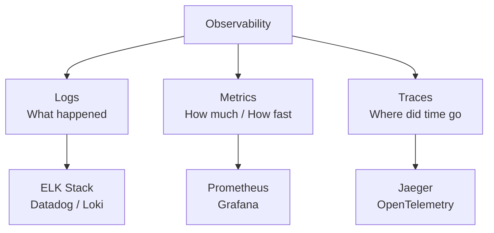

---

# SECTION 11 — CI/CD BASICS

## 11.1 What is CI/CD?

> **CI/CD** stands for **Continuous Integration / Continuous Delivery (or Deployment)**. It is an automated pipeline that runs every time code is pushed, ensuring it is tested, quality-checked, and deployable.

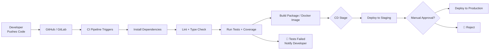

## 11.2 Continuous Integration (CI)

| What | How | Tools |
|------|-----|-------|
| Automated testing on every push | Push triggers pipeline | GitHub Actions, GitLab CI |
| Linting on every push | Code style checks | ruff, flake8, mypy |
| Coverage enforcement | Fail if coverage drops | pytest-cov, Codecov |
| Merge protection | Branch protection rules | GitHub Settings |

## 11.3 Continuous Delivery vs Deployment

| | Continuous Delivery | Continuous Deployment |
|--|--------------------|-----------------------|
| Definition | Code is always ready to deploy | Code deploys automatically |
| Human approval | Yes — before production | No — fully automated |
| Risk | Low | Higher (needs great tests) |
| Used by | Most companies | Netflix, Amazon, Google |

---

# SECTION 12 — GITHUB ACTIONS MASTERCLASS

## 12.1 What is GitHub Actions?

> **GitHub Actions** is GitHub's built-in CI/CD platform. You write YAML workflow files that run automatically on events (push, PR, schedule, etc.).

## 12.2 Basic Structure

```yaml
# .github/workflows/ci.yml
name: CI Pipeline

on:                           # Trigger events
  push:
    branches: [main, develop]
  pull_request:
    branches: [main]

jobs:
  test:
    runs-on: ubuntu-latest    # Runner OS
    
    strategy:
      matrix:
        python-version: ["3.10", "3.11", "3.12"]  # Matrix build

    steps:
      - name: Checkout code
        uses: actions/checkout@v4

      - name: Set up Python ${{ matrix.python-version }}
        uses: actions/setup-python@v5
        with:
          python-version: ${{ matrix.python-version }}

      - name: Cache pip dependencies
        uses: actions/cache@v3
        with:
          path: ~/.cache/pip
          key: ${{ runner.os }}-pip-${{ hashFiles('requirements.txt') }}

      - name: Install dependencies
        run: |
          python -m pip install --upgrade pip
          pip install -r requirements.txt
          pip install -r requirements-dev.txt

      - name: Run linting
        run: ruff check .

      - name: Run type checking
        run: mypy src/

      - name: Run tests with coverage
        run: pytest --cov=src --cov-report=xml --cov-fail-under=80

      - name: Upload coverage to Codecov
        uses: codecov/codecov-action@v3
        with:
          token: ${{ secrets.CODECOV_TOKEN }}
          file: ./coverage.xml
```

## 12.3 Professional CI/CD Workflow

```yaml
# .github/workflows/full-ci.yml
name: Full CI/CD Pipeline

on:
  push:
    branches: [main]
  pull_request:
    branches: [main]

env:
  PYTHON_VERSION: "3.12"

jobs:
  # ─── JOB 1: Code Quality ──────────────────────────────────────
  quality:
    name: Code Quality
    runs-on: ubuntu-latest
    steps:
      - uses: actions/checkout@v4
      - uses: actions/setup-python@v5
        with: { python-version: "${{ env.PYTHON_VERSION }}" }
      - run: pip install ruff mypy black isort
      - run: ruff check .
      - run: ruff format --check .
      - run: mypy src/ --ignore-missing-imports

  # ─── JOB 2: Tests ─────────────────────────────────────────────
  test:
    name: Tests (Python ${{ matrix.python-version }})
    needs: quality
    runs-on: ${{ matrix.os }}
    strategy:
      matrix:
        os: [ubuntu-latest, windows-latest, macos-latest]
        python-version: ["3.11", "3.12"]
    steps:
      - uses: actions/checkout@v4
      - uses: actions/setup-python@v5
        with: { python-version: "${{ matrix.python-version }}" }
      - run: pip install -r requirements.txt -r requirements-dev.txt
      - run: pytest --cov=src --cov-report=xml -v
      - uses: codecov/codecov-action@v3

  # ─── JOB 3: Security Scan ─────────────────────────────────────
  security:
    name: Security Scan
    runs-on: ubuntu-latest
    steps:
      - uses: actions/checkout@v4
      - uses: actions/setup-python@v5
        with: { python-version: "${{ env.PYTHON_VERSION }}" }
      - run: pip install bandit safety
      - run: bandit -r src/ -ll
      - run: safety check

  # ─── JOB 4: Build & Release ───────────────────────────────────
  release:
    name: Build Release
    needs: [test, security]
    if: github.ref == 'refs/heads/main' && github.event_name == 'push'
    runs-on: ubuntu-latest
    steps:
      - uses: actions/checkout@v4
      - uses: actions/setup-python@v5
        with: { python-version: "${{ env.PYTHON_VERSION }}" }
      - run: pip install build twine
      - run: python -m build
      - name: Publish to PyPI (on tag)
        if: startsWith(github.ref, 'refs/tags/')
        run: twine upload dist/*
        env:
          TWINE_USERNAME: __token__
          TWINE_PASSWORD: ${{ secrets.PYPI_TOKEN }}
```

## 12.4 GitHub Actions Cheat Sheet

```yaml
# Common patterns

# Run on schedule (cron)
on:
  schedule:
    - cron: "0 6 * * 1"  # Every Monday at 6 AM UTC

# Environment variables
env:
  DATABASE_URL: postgresql://localhost:5432/test

# Secrets
run: echo ${{ secrets.MY_SECRET }}

# Conditional steps
- run: echo "Deploy to prod"
  if: github.ref == 'refs/heads/main'

# Artifacts
- uses: actions/upload-artifact@v3
  with:
    name: test-results
    path: htmlcov/

# Download artifact
- uses: actions/download-artifact@v3
  with:
    name: test-results

# Job dependencies
jobs:
  deploy:
    needs: [test, security]  # Runs after these pass
```

---

# SECTION 13 — PROFESSIONAL REPOSITORY STRUCTURE

## 13.1 Small Project Structure

```
my-project/
├── src/
│   └── my_project/
│       ├── __init__.py
│       ├── main.py
│       └── utils.py
├── tests/
│   ├── __init__.py
│   ├── conftest.py
│   └── test_main.py
├── .github/
│   └── workflows/
│       └── ci.yml
├── .gitignore
├── .pre-commit-config.yaml
├── pyproject.toml
├── requirements.txt
├── requirements-dev.txt
└── README.md
```

## 13.2 Medium Project Structure

```
my-backend/
├── src/
│   └── myapp/
│       ├── __init__.py
│       ├── core/
│       │   ├── __init__.py
│       │   ├── config.py
│       │   ├── exceptions.py
│       │   └── logging_config.py
│       ├── models/
│       │   ├── __init__.py
│       │   └── user.py
│       ├── services/
│       │   ├── __init__.py
│       │   ├── user_service.py
│       │   └── email_service.py
│       ├── repositories/
│       │   ├── __init__.py
│       │   └── user_repository.py
│       ├── validators/
│       │   ├── __init__.py
│       │   └── user_validator.py
│       └── utils/
│           ├── __init__.py
│           └── helpers.py
├── tests/
│   ├── __init__.py
│   ├── conftest.py
│   ├── unit/
│   │   ├── test_services.py
│   │   ├── test_validators.py
│   │   └── test_utils.py
│   └── integration/
│       └── test_repositories.py
├── docs/
│   ├── architecture.md
│   └── api_reference.md
├── scripts/
│   ├── setup_dev.sh
│   └── run_tests.sh
├── .github/
│   └── workflows/
│       ├── ci.yml
│       └── release.yml
├── .gitignore
├── .pre-commit-config.yaml
├── pyproject.toml
├── requirements.txt
├── requirements-dev.txt
├── CHANGELOG.md
├── CONTRIBUTING.md
├── LICENSE
└── README.md
```

## 13.3 Enterprise Project Structure

```
enterprise-platform/
├── src/
│   └── platform/
│       ├── __init__.py
│       ├── api/
│       │   ├── __init__.py
│       │   ├── v1/
│       │   │   ├── routes/
│       │   │   └── schemas/
│       │   └── middleware/
│       ├── core/
│       │   ├── config.py
│       │   ├── security.py
│       │   ├── exceptions.py
│       │   └── logging_config.py
│       ├── domain/
│       │   ├── users/
│       │   │   ├── models.py
│       │   │   ├── service.py
│       │   │   └── repository.py
│       │   ├── orders/
│       │   └── products/
│       ├── infrastructure/
│       │   ├── database/
│       │   ├── cache/
│       │   ├── messaging/
│       │   └── storage/
│       └── workers/
│           ├── tasks.py
│           └── scheduler.py
├── tests/
│   ├── conftest.py
│   ├── unit/
│   ├── integration/
│   ├── e2e/
│   └── fixtures/
│       └── factories.py
├── alembic/                    # DB migrations
├── docker/
│   ├── Dockerfile
│   └── docker-compose.yml
├── k8s/                        # Kubernetes manifests
├── docs/
│   ├── adr/                    # Architecture Decision Records
│   └── runbooks/
├── scripts/
│   ├── setup_dev.sh
│   ├── seed_data.py
│   └── run_migrations.sh
├── .github/
│   └── workflows/
│       ├── ci.yml
│       ├── staging.yml
│       └── production.yml
├── Makefile
├── pyproject.toml
├── CHANGELOG.md
├── CONTRIBUTING.md
└── README.md
```

## 13.4 AI / ML Project Structure

```
ai-project/
├── src/
│   └── aiproject/
│       ├── data/
│       │   ├── loaders.py
│       │   ├── preprocessors.py
│       │   └── validators.py
│       ├── models/
│       │   ├── base.py
│       │   └── classifier.py
│       ├── training/
│       │   ├── trainer.py
│       │   └── evaluator.py
│       ├── inference/
│       │   ├── predictor.py
│       │   └── pipeline.py
│       └── utils/
│           └── metrics.py
├── notebooks/
│   ├── 01_eda.ipynb
│   └── 02_training.ipynb
├── data/
│   ├── raw/
│   ├── processed/
│   └── models/
├── tests/
│   ├── unit/
│   └── integration/
├── configs/
│   ├── training.yaml
│   └── inference.yaml
├── .github/
│   └── workflows/
│       └── ci.yml
├── requirements.txt
├── pyproject.toml
└── README.md
```

---

# SECTION 14 — DOCUMENTATION MASTERCLASS

## 14.1 Professional README.md Template

````markdown
# 🚀 Project Name

[](https://github.com/username/project/actions)
[](https://codecov.io/gh/username/project)
[](https://python.org)
[](LICENSE)

> One-sentence description of what this project does.

## 📋 Table of Contents
- [Features](#features)
- [Installation](#installation)
- [Quick Start](#quick-start)
- [Usage](#usage)
- [Configuration](#configuration)
- [Testing](#testing)
- [Contributing](#contributing)
- [License](#license)

## ✨ Features
- Feature 1 — Brief explanation
- Feature 2 — Brief explanation

## 🛠️ Installation

### Prerequisites
- Python 3.10+
- pip

### Install

```bash
git clone https://github.com/username/project.git
cd project
python -m venv .venv
source .venv/bin/activate   # Windows: .venv\Scripts\activate
pip install -r requirements.txt
```

## 🚀 Quick Start

```python
from myproject import Client

client = Client(api_key="your_key")
result = client.process("Hello World")
print(result)
```

## 🧪 Testing

```bash
pytest                         # Run all tests
pytest --cov=src               # With coverage
pytest -m "not slow"           # Skip slow tests
```

## 📖 Documentation

Full documentation at [docs.myproject.com](https://docs.myproject.com).

## 🤝 Contributing
See [CONTRIBUTING.md](CONTRIBUTING.md).

## 📄 License
MIT License — see [LICENSE](LICENSE).
````

## 14.2 CONTRIBUTING.md Template

```markdown
# Contributing to ProjectName

Thank you for considering contributing!

## Development Setup

1. Fork the repository
2. Clone: `git clone https://github.com/your-username/project.git`
3. Create branch: `git checkout -b feature/your-feature-name`
4. Install dev dependencies: `pip install -r requirements-dev.txt`
5. Install pre-commit: `pre-commit install`

## Code Standards

- Follow PEP 8 (enforced by ruff)
- Add type hints to all public functions
- Write tests for new code (minimum 80% coverage)
- Add docstrings to public APIs
- Update CHANGELOG.md

## Testing

```bash
pytest tests/ -v --cov=src
```

## Pull Request Process

1. Ensure all tests pass
2. Update documentation
3. Update CHANGELOG.md under "Unreleased"
4. Open PR against `main` branch
5. Await review from maintainers

## Code of Conduct

Be kind. See [CODE_OF_CONDUCT.md](CODE_OF_CONDUCT.md).
```

## 14.3 CHANGELOG.md Template

```markdown
# Changelog

All notable changes to this project will be documented in this file.
Format follows [Keep a Changelog](https://keepachangelog.com).

## [Unreleased]

### Added
- New feature X

## [1.2.0] - 2024-11-01

### Added
- Parametric test support
- JSON export format

### Changed
- Improved error messages in validator

### Fixed
- Bug where empty input caused crash (#123)

## [1.1.0] - 2024-10-15

### Added
- Initial test coverage
- GitHub Actions CI pipeline
```

## 14.4 Professional Docstrings

```python
def process_transactions(
    transactions: list[dict],
    currency: str = "USD",
    include_tax: bool = True
) -> dict[str, float]:
    """
    Process a list of financial transactions and return summary statistics.

    This function aggregates transactions by category, applies tax calculations
    if requested, and returns a dictionary of summary metrics. Transactions with
    invalid amounts are skipped with a warning logged.

    Args:
        transactions: List of transaction dicts with keys:
            - ``amount`` (float): Transaction value in base units
            - ``category`` (str): Category label (e.g., "food", "transport")
            - ``date`` (str): ISO 8601 date string (e.g., "2024-01-15")
        currency: ISO 4217 currency code. Defaults to "USD".
        include_tax: Whether to add 18% tax to totals. Defaults to True.

    Returns:
        Dictionary with keys:
        - ``total`` (float): Sum of all valid transactions
        - ``count`` (int): Number of valid transactions processed
        - ``by_category`` (dict): Totals broken down by category

    Raises:
        ValueError: If ``currency`` is not a valid ISO 4217 code.
        TypeError: If any transaction is not a dictionary.

    Example:
        >>> txns = [
        ...     {"amount": 100, "category": "food", "date": "2024-01-01"},
        ...     {"amount": 50,  "category": "transport", "date": "2024-01-02"},
        ... ]
        >>> result = process_transactions(txns)
        >>> result["total"]
        177.0
        >>> result["by_category"]["food"]
        118.0

    Note:
        Tax rate is fixed at 18% (GST standard). This may need updating
        for international deployments.
    """
```

---

# SECTION 15 — DEBUGGING PRODUCTION APPLICATIONS

## 15.1 Bug Investigation Workflow

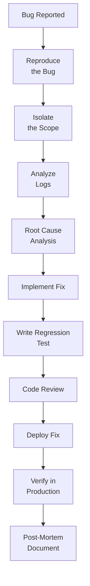

## 15.2 Python Debugging Tools

```python
# ─── pdb — Python Debugger ───────────────────────────────────────
import pdb; pdb.set_trace()      # Set breakpoint (old style)
breakpoint()                      # Python 3.7+ — modern style

# ─── pdb Commands ────────────────────────────────────────────────
# n (next)      — Execute next line
# s (step)      — Step into function
# c (continue)  — Continue until next breakpoint
# p var         — Print variable value
# pp var        — Pretty-print variable
# l             — List source code
# b 25          — Set breakpoint at line 25
# q             — Quit debugger

# ─── logging-based debugging ─────────────────────────────────────
import logging
logger = logging.getLogger(__name__)

def risky_function(data):
    logger.debug(f"Input: {data!r}")
    result = process(data)
    logger.debug(f"Output: {result!r}")
    return result

# ─── traceback analysis ──────────────────────────────────────────
import traceback
try:
    risky_operation()
except Exception:
    traceback.print_exc()                    # Print to stderr
    error_text = traceback.format_exc()      # Capture as string
    logger.error(f"Unexpected error:\n{error_text}")
```

## 15.3 Root Cause Analysis Template

```markdown
## Bug Report: [Issue Title]

**Severity:** Critical / High / Medium / Low
**Date Found:** YYYY-MM-DD
**Reporter:** [Name]
**Assignee:** [Name]

### Description
[Clear description of the bug]

### Steps to Reproduce
1. Step 1
2. Step 2
3. Step 3

### Expected Behavior
[What should happen]

### Actual Behavior
[What actually happens]

### Root Cause
[Technical explanation of why the bug occurred]

### Fix Applied
[Description of the fix]

### Regression Test Added
- `tests/unit/test_xxx.py::test_yyy`

### Prevention
[What process/check prevents this class of bug in future]
```

---

# SECTION 16 — PYTHON DEVELOPER BEST PRACTICES

## 16.1 Clean Code Principles

```python
# ─── Meaningful Names ─────────────────────────────────────────────
# ❌ Bad
d = 3.14159
def c(r): return d * r * r

# ✅ Good
PI = 3.14159
def calculate_circle_area(radius: float) -> float:
    return PI * radius ** 2

# ─── Functions Should Do ONE Thing ───────────────────────────────
# ❌ Bad — does too many things
def process_user(user):
    # validate
    if not user.get("email"):
        return None
    # save to db
    db.save(user)
    # send email
    smtp.send(user["email"], "Welcome!")
    # log
    print(f"User {user['email']} created")

# ✅ Good — each function has one responsibility
def validate_user(user: dict) -> None:
    if not user.get("email"):
        raise ValueError("Email is required")

def save_user(user: dict) -> dict:
    return db.save(user)

def notify_user(email: str) -> None:
    email_service.send_welcome(email)

def create_user(user: dict) -> dict:
    validate_user(user)
    saved = save_user(user)
    notify_user(saved["email"])
    logger.info(f"Created user {saved['email']}")
    return saved

# ─── Avoid Magic Numbers ──────────────────────────────────────────
# ❌ Bad
if age > 18:
    ...

# ✅ Good
MINIMUM_AGE = 18
if age > MINIMUM_AGE:
    ...
```

## 16.2 SOLID in Practice

```python
# ─── S: Single Responsibility ─────────────────────────────────────
class UserRepository:       # Only handles data access
    def save(self, user): ...
    def find_by_id(self, id): ...

class EmailService:         # Only handles email
    def send_welcome(self, email): ...

class UserService:          # Orchestrates — doesn't do raw DB/email
    def __init__(self, repo: UserRepository, email: EmailService):
        self.repo = repo
        self.email = email

# ─── O: Open/Closed ───────────────────────────────────────────────
from abc import ABC, abstractmethod

class Discounter(ABC):
    @abstractmethod
    def calculate(self, price: float) -> float: ...

class PercentageDiscounter(Discounter):
    def __init__(self, percent): self.percent = percent
    def calculate(self, price): return price * (1 - self.percent / 100)

class FlatDiscounter(Discounter):
    def __init__(self, amount): self.amount = amount
    def calculate(self, price): return max(0, price - self.amount)

# ─── D: Dependency Inversion ──────────────────────────────────────
from typing import Protocol

class DataStore(Protocol):           # Interface
    def save(self, data: dict) -> None: ...
    def find(self, id: int) -> dict: ...

class PostgresStore:                 # Implementation
    def save(self, data): ...
    def find(self, id): ...

class InMemoryStore:                 # Test implementation
    def __init__(self): self._data = {}
    def save(self, data): self._data[data["id"]] = data
    def find(self, id): return self._data.get(id)

class Service:
    def __init__(self, store: DataStore):  # Depends on abstraction
        self.store = store
```

## 16.3 Code Review Checklist

```markdown
## Code Review Checklist

### Correctness
- [ ] Does the code do what it's supposed to?
- [ ] Are edge cases handled?
- [ ] Are exceptions properly caught and logged?

### Tests
- [ ] New code has tests
- [ ] Tests cover happy path and error cases
- [ ] Coverage didn't decrease

### Code Quality
- [ ] Functions are small and focused
- [ ] No magic numbers
- [ ] Meaningful variable names
- [ ] No commented-out code

### Documentation
- [ ] Public functions have docstrings
- [ ] Complex logic has inline comments
- [ ] README updated if needed

### Security
- [ ] No secrets in code
- [ ] Input is validated
- [ ] No SQL injection risks

### Performance
- [ ] No obvious N+1 queries
- [ ] No unnecessary iterations
```

---

# SECTION 17 — MINI PROJECTS

## Project 1 — Calculator with Tests

```python
# src/calculator.py
from typing import Union

Number = Union[int, float]

class Calculator:
    """Professional calculator with full operation support."""

    def add(self, a: Number, b: Number) -> Number:
        """Return sum of a and b."""
        return a + b

    def subtract(self, a: Number, b: Number) -> Number:
        """Return a minus b."""
        return a - b

    def multiply(self, a: Number, b: Number) -> Number:
        """Return a times b."""
        return a * b

    def divide(self, a: Number, b: Number) -> float:
        """Return a divided by b. Raises ZeroDivisionError if b is 0."""
        if b == 0:
            raise ZeroDivisionError("Cannot divide by zero")
        return a / b

    def power(self, base: Number, exponent: Number) -> Number:
        """Return base raised to exponent."""
        return base ** exponent

    def sqrt(self, n: Number) -> float:
        """Return square root of n. Raises ValueError if n is negative."""
        if n < 0:
            raise ValueError("Cannot take square root of negative number")
        return n ** 0.5
```

```python
# tests/test_calculator.py
import pytest
from calculator import Calculator

@pytest.fixture
def calc():
    return Calculator()

class TestAdd:
    def test_add_integers(self, calc):
        assert calc.add(2, 3) == 5

    def test_add_floats(self, calc):
        assert calc.add(1.5, 2.5) == pytest.approx(4.0)

    def test_add_negative(self, calc):
        assert calc.add(-5, 3) == -2

    def test_add_zero(self, calc):
        assert calc.add(0, 0) == 0

    @pytest.mark.parametrize("a,b,expected", [
        (1, 1, 2), (100, 200, 300), (-10, -5, -15), (0, 999, 999)
    ])
    def test_add_parametrized(self, calc, a, b, expected):
        assert calc.add(a, b) == expected

class TestDivide:
    def test_divide_normal(self, calc):
        assert calc.divide(10, 2) == 5.0

    def test_divide_by_zero(self, calc):
        with pytest.raises(ZeroDivisionError, match="Cannot divide by zero"):
            calc.divide(10, 0)

    def test_divide_float_result(self, calc):
        assert calc.divide(10, 3) == pytest.approx(3.333, rel=1e-3)

class TestSqrt:
    def test_sqrt_positive(self, calc):
        assert calc.sqrt(16) == 4.0

    def test_sqrt_negative(self, calc):
        with pytest.raises(ValueError, match="negative number"):
            calc.sqrt(-1)

    def test_sqrt_zero(self, calc):
        assert calc.sqrt(0) == 0.0
```

---

## Project 2 — Student Manager with Tests

```python
# src/student_manager.py
from dataclasses import dataclass, field
from typing import Optional
import statistics

@dataclass
class Student:
    student_id: int
    name: str
    grades: list[float] = field(default_factory=list)

    def add_grade(self, grade: float) -> None:
        if not 0 <= grade <= 100:
            raise ValueError(f"Grade {grade} must be between 0 and 100")
        self.grades.append(grade)

    @property
    def average(self) -> Optional[float]:
        return statistics.mean(self.grades) if self.grades else None

    @property
    def letter_grade(self) -> str:
        avg = self.average
        if avg is None: return "N/A"
        if avg >= 90: return "A"
        if avg >= 80: return "B"
        if avg >= 70: return "C"
        if avg >= 60: return "D"
        return "F"

class StudentManager:
    def __init__(self):
        self._students: dict[int, Student] = {}
        self._next_id = 1

    def add_student(self, name: str) -> Student:
        if not name.strip():
            raise ValueError("Student name cannot be empty")
        student = Student(student_id=self._next_id, name=name.strip())
        self._students[self._next_id] = student
        self._next_id += 1
        return student

    def get_student(self, student_id: int) -> Student:
        student = self._students.get(student_id)
        if not student:
            raise KeyError(f"Student {student_id} not found")
        return student

    def remove_student(self, student_id: int) -> None:
        if student_id not in self._students:
            raise KeyError(f"Student {student_id} not found")
        del self._students[student_id]

    def top_students(self, n: int = 5) -> list[Student]:
        students_with_grades = [s for s in self._students.values() if s.grades]
        return sorted(students_with_grades, key=lambda s: s.average, reverse=True)[:n]

    def class_statistics(self) -> dict:
        all_grades = [g for s in self._students.values() for g in s.grades]
        if not all_grades:
            return {"count": 0, "mean": None, "max": None, "min": None}
        return {
            "count": len(self._students),
            "mean": round(statistics.mean(all_grades), 2),
            "max": max(all_grades),
            "min": min(all_grades),
            "std_dev": round(statistics.stdev(all_grades), 2) if len(all_grades) > 1 else 0,
        }
```

```python
# tests/test_student_manager.py
import pytest
from student_manager import Student, StudentManager

@pytest.fixture
def manager():
    return StudentManager()

@pytest.fixture
def manager_with_students(manager):
    alice = manager.add_student("Alice")
    bob = manager.add_student("Bob")
    alice.add_grade(90)
    alice.add_grade(85)
    bob.add_grade(70)
    bob.add_grade(75)
    return manager

class TestStudent:
    def test_add_valid_grade(self):
        s = Student(1, "Alice")
        s.add_grade(85.5)
        assert 85.5 in s.grades

    def test_add_invalid_grade_too_high(self):
        s = Student(1, "Alice")
        with pytest.raises(ValueError):
            s.add_grade(101)

    def test_average_no_grades(self):
        s = Student(1, "Alice")
        assert s.average is None

    @pytest.mark.parametrize("grades,expected_letter", [
        ([95], "A"), ([85], "B"), ([75], "C"), ([65], "D"), ([55], "F")
    ])
    def test_letter_grade(self, grades, expected_letter):
        s = Student(1, "Alice", grades=grades)
        assert s.letter_grade == expected_letter

class TestStudentManager:
    def test_add_student(self, manager):
        student = manager.add_student("Alice")
        assert student.name == "Alice"
        assert student.student_id == 1

    def test_add_empty_name(self, manager):
        with pytest.raises(ValueError, match="cannot be empty"):
            manager.add_student("")

    def test_get_student_not_found(self, manager):
        with pytest.raises(KeyError, match="not found"):
            manager.get_student(999)

    def test_top_students(self, manager_with_students):
        top = manager_with_students.top_students(1)
        assert top[0].name == "Alice"

    def test_class_statistics(self, manager_with_students):
        stats = manager_with_students.class_statistics()
        assert stats["count"] == 2
        assert stats["mean"] is not None
```

---

## Project 3 — Password Validator with Tests

```python
# src/password_validator.py
import re
from dataclasses import dataclass, field

@dataclass
class ValidationResult:
    is_valid: bool
    errors: list[str] = field(default_factory=list)
    strength: str = "Weak"

class PasswordValidator:
    MIN_LENGTH = 8
    MAX_LENGTH = 128
    SPECIAL_CHARS = r"[!@#$%^&*()_+\-=\[\]{};':\"\\|,.<>\/?]"

    def validate(self, password: str) -> ValidationResult:
        errors = []

        if len(password) < self.MIN_LENGTH:
            errors.append(f"Must be at least {self.MIN_LENGTH} characters")
        if len(password) > self.MAX_LENGTH:
            errors.append(f"Must not exceed {self.MAX_LENGTH} characters")
        if not any(c.isupper() for c in password):
            errors.append("Must contain at least one uppercase letter")
        if not any(c.islower() for c in password):
            errors.append("Must contain at least one lowercase letter")
        if not any(c.isdigit() for c in password):
            errors.append("Must contain at least one digit")
        if not re.search(self.SPECIAL_CHARS, password):
            errors.append("Must contain at least one special character")

        strength = self._calculate_strength(password, errors)
        return ValidationResult(is_valid=len(errors) == 0, errors=errors, strength=strength)

    def _calculate_strength(self, password: str, errors: list) -> str:
        score = 4 - len(errors)
        if len(password) >= 16: score += 1
        if score >= 4: return "Strong"
        if score >= 2: return "Medium"
        return "Weak"
```

```python
# tests/test_password_validator.py
import pytest
from password_validator import PasswordValidator

@pytest.fixture
def validator():
    return PasswordValidator()

@pytest.mark.parametrize("password,is_valid,error_fragment", [
    ("abc", False, "8 characters"),
    ("alllowercase1!", False, "uppercase"),
    ("ALLUPPERCASE1!", False, "lowercase"),
    ("NoDigitsHere!", False, "digit"),
    ("NoSpecial123", False, "special character"),
    ("Valid@Pass1", True, None),
    ("Strong#Pass99!", True, None),
])
def test_password_validation(validator, password, is_valid, error_fragment):
    result = validator.validate(password)
    assert result.is_valid == is_valid
    if error_fragment:
        assert any(error_fragment in e for e in result.errors)

def test_strong_password(validator):
    result = validator.validate("Secure@Pass99!")
    assert result.is_valid
    assert result.strength in ("Strong", "Medium")

def test_very_long_password(validator):
    result = validator.validate("A" * 200 + "a1!")
    assert not result.is_valid
    assert any("128" in e for e in result.errors)
```

---

## Project 4 — Expense Tracker with Tests

```python
# src/expense_tracker.py
from dataclasses import dataclass, field
from datetime import date, datetime
from enum import Enum
from typing import Optional
import json

class Category(str, Enum):
    FOOD = "food"
    TRANSPORT = "transport"
    ENTERTAINMENT = "entertainment"
    UTILITIES = "utilities"
    HEALTH = "health"
    OTHER = "other"

@dataclass
class Expense:
    amount: float
    category: Category
    description: str
    date: date = field(default_factory=date.today)

    def __post_init__(self):
        if self.amount <= 0:
            raise ValueError("Amount must be positive")
        if not self.description.strip():
            raise ValueError("Description cannot be empty")

class ExpenseTracker:
    def __init__(self):
        self._expenses: list[Expense] = []

    def add(self, amount: float, category: Category, description: str, expense_date: Optional[date] = None) -> Expense:
        expense = Expense(
            amount=round(amount, 2),
            category=category,
            description=description.strip(),
            date=expense_date or date.today()
        )
        self._expenses.append(expense)
        return expense

    def total(self) -> float:
        return round(sum(e.amount for e in self._expenses), 2)

    def by_category(self) -> dict[str, float]:
        result = {}
        for expense in self._expenses:
            key = expense.category.value
            result[key] = round(result.get(key, 0) + expense.amount, 2)
        return result

    def monthly_summary(self, year: int, month: int) -> dict:
        monthly = [e for e in self._expenses if e.date.year == year and e.date.month == month]
        return {
            "total": round(sum(e.amount for e in monthly), 2),
            "count": len(monthly),
            "by_category": {
                cat: round(sum(e.amount for e in monthly if e.category.value == cat), 2)
                for cat in set(e.category.value for e in monthly)
            }
        }

    def to_json(self) -> str:
        return json.dumps([
            {"amount": e.amount, "category": e.category.value,
             "description": e.description, "date": str(e.date)}
            for e in self._expenses
        ], indent=2)
```

```python
# tests/test_expense_tracker.py
import pytest
from datetime import date
from expense_tracker import ExpenseTracker, Category, Expense

@pytest.fixture
def tracker():
    return ExpenseTracker()

@pytest.fixture
def populated_tracker(tracker):
    tracker.add(500, Category.FOOD, "Groceries", date(2024, 1, 10))
    tracker.add(200, Category.TRANSPORT, "Bus pass", date(2024, 1, 15))
    tracker.add(1000, Category.UTILITIES, "Electricity", date(2024, 2, 5))
    return tracker

def test_add_expense(tracker):
    exp = tracker.add(100, Category.FOOD, "Lunch")
    assert exp.amount == 100
    assert exp.category == Category.FOOD

def test_add_negative_amount(tracker):
    with pytest.raises(ValueError, match="positive"):
        tracker.add(-100, Category.FOOD, "Invalid")

def test_total(populated_tracker):
    assert populated_tracker.total() == 1700.0

def test_by_category(populated_tracker):
    cats = populated_tracker.by_category()
    assert cats["food"] == 500
    assert cats["transport"] == 200

def test_monthly_summary(populated_tracker):
    summary = populated_tracker.monthly_summary(2024, 1)
    assert summary["total"] == 700.0
    assert summary["count"] == 2

def test_to_json(tracker):
    tracker.add(100, Category.FOOD, "Test")
    result = tracker.to_json()
    import json
    data = json.loads(result)
    assert data[0]["amount"] == 100
    assert data[0]["category"] == "food"
```

---

## Project 5 — Log Analyzer with Tests

```python
# src/log_analyzer.py
import re
from dataclasses import dataclass
from datetime import datetime
from collections import Counter
from pathlib import Path

@dataclass
class LogEntry:
    timestamp: datetime
    level: str
    message: str
    source: str = ""

class LogAnalyzer:
    LOG_PATTERN = re.compile(
        r"(?P<timestamp>\d{4}-\d{2}-\d{2} \d{2}:\d{2}:\d{2})"
        r"\s+\|?\s*(?P<level>DEBUG|INFO|WARNING|ERROR|CRITICAL)"
        r"\s+\|?\s*(?P<message>.+)"
    )

    def parse_line(self, line: str) -> LogEntry | None:
        match = self.LOG_PATTERN.search(line)
        if not match:
            return None
        return LogEntry(
            timestamp=datetime.strptime(match.group("timestamp"), "%Y-%m-%d %H:%M:%S"),
            level=match.group("level"),
            message=match.group("message").strip(),
        )

    def parse_file(self, filepath: str | Path) -> list[LogEntry]:
        entries = []
        with open(filepath) as f:
            for line in f:
                entry = self.parse_line(line)
                if entry:
                    entries.append(entry)
        return entries

    def count_by_level(self, entries: list[LogEntry]) -> dict[str, int]:
        return dict(Counter(e.level for e in entries))

    def filter_by_level(self, entries: list[LogEntry], level: str) -> list[LogEntry]:
        return [e for e in entries if e.level == level.upper()]

    def find_errors(self, entries: list[LogEntry]) -> list[LogEntry]:
        return [e for e in entries if e.level in ("ERROR", "CRITICAL")]

    def summary(self, entries: list[LogEntry]) -> dict:
        counts = self.count_by_level(entries)
        return {
            "total": len(entries),
            "by_level": counts,
            "error_rate": round(
                (counts.get("ERROR", 0) + counts.get("CRITICAL", 0)) / len(entries) * 100, 2
            ) if entries else 0,
        }
```

```python
# tests/test_log_analyzer.py
import pytest
from datetime import datetime
from log_analyzer import LogAnalyzer, LogEntry

@pytest.fixture
def analyzer():
    return LogAnalyzer()

@pytest.fixture
def sample_entries():
    return [
        LogEntry(datetime(2024, 1, 1, 10, 0), "INFO", "Server started"),
        LogEntry(datetime(2024, 1, 1, 10, 1), "DEBUG", "Processing request"),
        LogEntry(datetime(2024, 1, 1, 10, 2), "ERROR", "Database timeout"),
        LogEntry(datetime(2024, 1, 1, 10, 3), "CRITICAL", "Service down"),
        LogEntry(datetime(2024, 1, 1, 10, 4), "INFO", "Request completed"),
    ]

def test_parse_line_valid(analyzer):
    line = "2024-01-15 10:30:00 | ERROR | Database connection failed"
    entry = analyzer.parse_line(line)
    assert entry is not None
    assert entry.level == "ERROR"
    assert "Database" in entry.message

def test_parse_line_invalid(analyzer):
    entry = analyzer.parse_line("This is not a log line")
    assert entry is None

def test_count_by_level(analyzer, sample_entries):
    counts = analyzer.count_by_level(sample_entries)
    assert counts["INFO"] == 2
    assert counts["ERROR"] == 1
    assert counts["CRITICAL"] == 1

def test_find_errors(analyzer, sample_entries):
    errors = analyzer.find_errors(sample_entries)
    assert len(errors) == 2
    assert all(e.level in ("ERROR", "CRITICAL") for e in errors)

def test_summary(analyzer, sample_entries):
    s = analyzer.summary(sample_entries)
    assert s["total"] == 5
    assert s["error_rate"] == 40.0

def test_parse_file(analyzer, tmp_path):
    log_file = tmp_path / "test.log"
    log_file.write_text(
        "2024-01-01 10:00:00 | INFO | Server started\n"
        "2024-01-01 10:01:00 | ERROR | Something failed\n"
        "Not a log line\n"
    )
    entries = analyzer.parse_file(log_file)
    assert len(entries) == 2
```

---

# SECTION 18 — 20 HIGH-VALUE PORTFOLIO PROJECTS

## Project 1: Developer Productivity Platform

**Overview:** A CLI + API platform that tracks developer tasks, coding sessions, git activity, and generates daily/weekly productivity reports.

**Real World Usage:** Used by engineering leads to understand team output and by developers to self-track their work.

**Resume Value:** ⭐⭐⭐⭐⭐ Demonstrates: CLI design, data persistence, reporting, REST API

**Testing Strategy:**
- Unit tests for all service functions
- Integration tests for storage layer
- Mock tests for git API

**Architecture:**
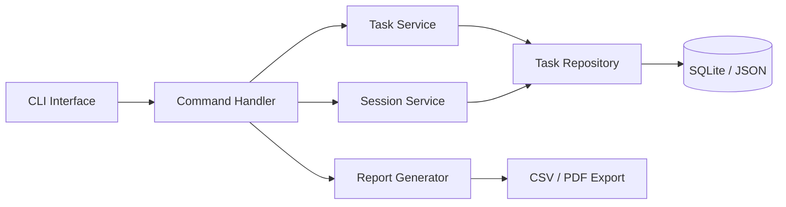

**Folder Layout:**
```
developer-productivity-platform/
├── src/
│   ├── cli/
│   │   ├── __init__.py
│   │   ├── main.py
│   │   └── commands/
│   │       ├── task_commands.py
│   │       ├── session_commands.py
│   │       └── report_commands.py
│   ├── services/
│   │   ├── task_service.py
│   │   ├── session_service.py
│   │   └── report_service.py
│   ├── repositories/
│   │   ├── task_repository.py
│   │   └── session_repository.py
│   ├── models/
│   │   ├── task.py
│   │   └── session.py
│   └── utils/
│       ├── formatter.py
│       └── date_utils.py
├── tests/
│   ├── conftest.py
│   ├── unit/
│   └── integration/
├── .github/workflows/ci.yml
├── pyproject.toml
└── README.md
```

**MVP Version:** Task CRUD + session timer + simple report
**Professional Version:** Git integration + dashboard + team sharing
**Enterprise Version:** SaaS multi-tenant + billing + analytics

---

## Project 2: Task Automation Framework

**Overview:** A Python framework for building and scheduling automated workflows — file processing, data transformations, notifications, and more.

**Resume Value:** ⭐⭐⭐⭐⭐ Shows: design patterns, scheduling, plugin architecture

**Architecture:**
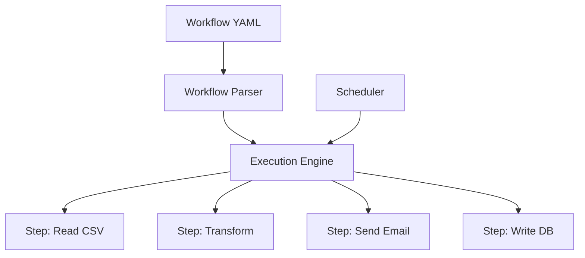

**Folder Layout:**
```
task-automation-framework/
├── src/
│   ├── core/
│   │   ├── engine.py
│   │   ├── workflow.py
│   │   └── scheduler.py
│   ├── steps/
│   │   ├── base_step.py
│   │   ├── file_steps.py
│   │   ├── transform_steps.py
│   │   └── notification_steps.py
│   └── plugins/
├── tests/
├── examples/
│   └── workflows/
└── README.md
```

---

## Project 3: Research Workflow Manager

**Overview:** A personal research tool for managing papers, notes, citations, and generating bibliographies. Supports importing from PDF, URL, and DOI.

**Resume Value:** ⭐⭐⭐⭐ For: academics, data scientists, researchers

**Key Features:** Paper import, tag-based search, citation generation, export to Markdown/BibTeX

---

## Project 4: Dataset Processing Platform

**Overview:** A configurable ETL platform that reads datasets (CSV, JSON, Excel, Parquet), applies transformation pipelines, validates schema, and outputs clean data.

**Resume Value:** ⭐⭐⭐⭐⭐ Highly relevant for data engineering roles

**Architecture:**
```
Reader → Validator → Transformer → Cleaner → Writer
```

**Future AI Integration:** Use Claude/OpenAI API to auto-generate transformation rules from dataset description.

---

## Project 5: Inventory Intelligence System

**Overview:** A complete inventory management backend with CRUD, low-stock alerts, supplier management, demand forecasting stubs, and REST API.

**Resume Value:** ⭐⭐⭐⭐ Backend developer and ML engineer roles

---

## Project 6: Personal Finance Analytics

**Overview:** Import bank statements (CSV/PDF), categorize transactions, track budgets, generate monthly reports and visualizations.

**Resume Value:** ⭐⭐⭐⭐ Demonstrates data processing, reporting, user-facing features

---

## Project 7: Learning Management Backend

**Overview:** Core LMS backend — courses, modules, lessons, enrollment, progress tracking, quiz engine, certificate generation.

**Resume Value:** ⭐⭐⭐⭐⭐ EdTech industry, full-stack roles

**Future AI Integration:** AI-generated quiz questions, personalized learning paths

---

## Project 8: Knowledge Base Engine

**Overview:** A searchable personal knowledge base — import notes from Markdown/Obsidian, full-text search, tag graph, semantic similarity search.

**Resume Value:** ⭐⭐⭐⭐⭐ AI roles (RAG systems), developer tools

**Future AI Integration:** RAG pipeline for Q&A over your notes using LLMs

---

## Project 9: CLI Productivity Suite

**Overview:** A collection of CLI utilities — file renamer, duplicate finder, image resizer, PDF merger, text processor — packaged as a professional toolkit.

**Resume Value:** ⭐⭐⭐ Open source, developer tools

---

## Project 10: Project Tracking Platform

**Overview:** Lightweight project tracker — projects, milestones, tasks, time tracking, burndown charts, status reports.

**Resume Value:** ⭐⭐⭐⭐ General software engineering roles

---

## Project 11: Developer Utility Framework

**Overview:** A Python utility library — string helpers, date utilities, number formatters, validation helpers — with full test coverage and PyPI packaging.

**Resume Value:** ⭐⭐⭐⭐ Open source contribution, packaging knowledge

---

## Project 12: Document Processing System

**Overview:** Extract, transform, and index content from Word, PDF, and HTML documents. Build searchable index, extract tables, summarize content.

**Resume Value:** ⭐⭐⭐⭐⭐ Document AI, NLP roles

---

## Project 13: Research Notes Platform

**Overview:** A collaborative note-taking platform with versioning, search, tag taxonomy, and export to multiple formats.

**Resume Value:** ⭐⭐⭐ Shows: CRUD, versioning, export formats

---

## Project 14: Business Analytics Backend

**Overview:** Connect to data sources (CSV, SQLite, REST API), run analytics queries, generate reports, expose results via REST API or CLI dashboard.

**Resume Value:** ⭐⭐⭐⭐⭐ Data analyst, BI developer roles

---

## Project 15: CRM Core Platform

**Overview:** A headless CRM — contacts, companies, deals, interaction history, pipeline stages, activity log, bulk import/export.

**Resume Value:** ⭐⭐⭐⭐⭐ Backend developer, SaaS engineering

**Future AI Integration:** AI email drafting, lead scoring, sentiment analysis

---

## Project 16: Resume Intelligence Tool

**Overview:** Parse resumes (PDF/DOCX), extract skills, experience, education. Score against job descriptions. Generate improvement suggestions.

**Resume Value:** ⭐⭐⭐⭐⭐ NLP, AI product engineering

---

## Project 17: Open Source Toolkit

**Overview:** A well-documented Python utility package with 20+ functions, proper semver versioning, PyPI publishing, contributing guide, and 95%+ coverage.

**Resume Value:** ⭐⭐⭐⭐⭐ Open source credibility, packaging expertise

---

## Project 18: Developer Operations Platform

**Overview:** Internal DevOps tools — environment checker, dependency auditor, test reporter, deploy status tracker, log aggregator.

**Resume Value:** ⭐⭐⭐⭐ DevOps, platform engineering roles

---

## Project 19: AI Dataset Manager

**Overview:** Tool to collect, version, annotate, validate, and export ML training datasets. Supports image, text, and tabular data.

**Resume Value:** ⭐⭐⭐⭐⭐ ML Engineering, AI infrastructure roles

---

## Project 20: Workflow Automation Engine

**Overview:** YAML-defined workflow engine — triggers (cron, webhook, file watch), actions (HTTP, script, email), conditions, error handling, retry logic.

**Resume Value:** ⭐⭐⭐⭐⭐ Senior engineering, platform engineering

**Future AI Integration:** AI-generated workflow suggestions, anomaly detection in runs

---

# SECTION 19 — PROJECT LAYOUT MASTERCLASS

## 19.1 Every Folder Explained

```
my-professional-project/
│
├── src/                         # All application source code
│   └── myproject/               # Your package namespace
│       ├── __init__.py          # Package version + public API
│       ├── core/                # Core business logic
│       │   ├── config.py        # Settings + configuration loader
│       │   ├── exceptions.py    # Custom exception hierarchy
│       │   └── logging_config.py # Logging setup
│       ├── services/            # Business logic layer
│       │   └── user_service.py  # One file per domain concept
│       ├── repositories/        # Data access layer (DB, files)
│       │   └── user_repo.py
│       ├── validators/          # Input validation
│       │   └── user_validator.py
│       ├── models/              # Data models / entities
│       │   └── user.py
│       ├── utils/               # Shared utilities (no business logic)
│       │   ├── date_utils.py
│       │   └── string_utils.py
│       └── cli/                 # CLI entry points
│           └── main.py
│
├── tests/                       # All test code
│   ├── conftest.py              # Shared fixtures
│   ├── unit/                    # Fast, isolated tests
│   │   ├── test_services.py
│   │   └── test_validators.py
│   ├── integration/             # Tests with real dependencies
│   │   └── test_repositories.py
│   └── fixtures/                # Test data files
│       ├── sample_users.json
│       └── test_data.csv
│
├── docs/                        # Documentation
│   ├── architecture.md          # System design decisions
│   ├── api_reference.md         # API documentation
│   └── adr/                     # Architecture Decision Records
│       └── 001-database-choice.md
│
├── config/                      # Configuration files
│   ├── default.yaml
│   ├── development.yaml
│   └── production.yaml
│
├── logs/                        # Log files (gitignored)
│   └── .gitkeep
│
├── scripts/                     # Utility scripts
│   ├── setup_dev.sh             # Developer setup
│   ├── run_tests.sh             # Test runner with flags
│   └── seed_data.py             # Database seeding
│
├── .github/                     # GitHub-specific files
│   ├── ISSUE_TEMPLATE/
│   │   ├── bug_report.md
│   │   └── feature_request.md
│   ├── PULL_REQUEST_TEMPLATE.md
│   └── workflows/
│       ├── ci.yml               # Main CI pipeline
│       └── release.yml          # Release automation
│
├── .gitignore                   # Git exclusions
├── .pre-commit-config.yaml      # Pre-commit hooks
├── pyproject.toml               # Project metadata + tool config
├── requirements.txt             # Production dependencies
├── requirements-dev.txt         # Development dependencies
├── Makefile                     # Common commands
├── README.md                    # Project overview
├── CHANGELOG.md                 # Version history
├── CONTRIBUTING.md              # Contributor guide
├── CODE_OF_CONDUCT.md           # Community standards
└── LICENSE                      # License file
```

## 19.2 Key Configuration Files

```toml
# pyproject.toml
[build-system]
requires = ["setuptools>=68", "wheel"]
build-backend = "setuptools.backends.legacy:build"

[project]
name = "my-project"
version = "1.0.0"
description = "A professional Python project"
requires-python = ">=3.10"
authors = [{name = "Baghel", email = "baghel@nielit.gov.in"}]
license = {text = "MIT"}
dependencies = [
    "pydantic>=2.0",
    "httpx>=0.25",
    "rich>=13.0",
]

[project.optional-dependencies]
dev = [
    "pytest>=7.4",
    "pytest-cov>=4.1",
    "pytest-mock>=3.12",
    "ruff>=0.1",
    "mypy>=1.7",
    "pre-commit>=3.5",
]

[project.scripts]
myproject = "myproject.cli.main:app"

[tool.pytest.ini_options]
testpaths = ["tests"]
addopts = ["-v", "--tb=short", "--cov=src", "--cov-fail-under=80"]

[tool.ruff]
line-length = 88
target-version = "py312"

[tool.mypy]
python_version = "3.12"
strict = true
```

```makefile
# Makefile
.PHONY: install test lint format typecheck clean

install:
	pip install -e ".[dev]"
	pre-commit install

test:
	pytest tests/ -v --cov=src --cov-report=html

test-fast:
	pytest tests/unit/ -v -m "not slow"

lint:
	ruff check .

format:
	ruff format .

typecheck:
	mypy src/

quality: lint typecheck

ci: quality test

clean:
	rm -rf .pytest_cache htmlcov .coverage __pycache__
	find . -name "*.pyc" -delete
```

---

# SECTION 20 — GITHUB PROFILE BOOSTER PROJECTS

## Why Recruiters Look at GitHub

Recruiters and hiring managers use GitHub to verify:
1. **Code quality** — Can you write clean, maintainable code?
2. **Testing habits** — Do you write tests?
3. **Documentation** — Can you communicate technical work?
4. **Consistency** — Do you ship, iterate, and improve?
5. **Problem solving** — Are the projects solving real problems?

## Top 10 Recruiter-Worthy Projects

### 1. Workflow Automation Engine

| Attribute | Details |
|-----------|---------|
| Why Recruiters Love It | Shows systems thinking, YAML DSL design, orchestration |
| Skills Demonstrated | Design patterns, scheduling, plugin architecture, testing |
| Scalability Potential | Add distributed execution, webhook triggers |
| SaaS Potential | Zapier-like product |

### 2. Developer Productivity Platform

| Attribute | Details |
|-----------|---------|
| Why Recruiters Love It | Solves a real pain point developers understand |
| Skills Demonstrated | CLI design, data modeling, reporting, CI/CD |
| Scalability Potential | Team features, API, integrations |
| SaaS Potential | Billing + multi-user = product |

### 3. Research Workflow Manager

| Attribute | Details |
|-----------|---------|
| Why Recruiters Love It | Shows attention to domain knowledge + NLP basics |
| Skills Demonstrated | File processing, search, citation parsing |
| Scalability Potential | AI-assisted research summaries |
| SaaS Potential | Academic SaaS market |

### 4. Knowledge Base Engine

| Attribute | Details |
|-----------|---------|
| Why Recruiters Love It | Directly related to AI/RAG engineering |
| Skills Demonstrated | Full-text search, embeddings, vector stores |
| Scalability Potential | Multi-user, team knowledge base |
| SaaS Potential | Notion-like product with AI |

### 5. Dataset Processing Platform

| Attribute | Details |
|-----------|---------|
| Why Recruiters Love It | Shows data engineering fundamentals |
| Skills Demonstrated | ETL, schema validation, performance |
| Scalability Potential | Distributed processing with Dask/Spark |
| SaaS Potential | Data pipeline SaaS |

### 6. Open Source Toolkit

| Attribute | Details |
|-----------|---------|
| Why Recruiters Love It | Shows packaging, community contribution, maintainability |
| Skills Demonstrated | PyPI packaging, semantic versioning, documentation |
| Scalability Potential | Community contributions |
| SaaS Potential | Premium support / extended version |

### 7. Developer Operations Suite

| Attribute | Details |
|-----------|---------|
| Why Recruiters Love It | Targets DevOps / Platform engineering roles |
| Skills Demonstrated | System tools, reporting, CI/CD integration |
| Scalability Potential | Internal platform product |
| SaaS Potential | Developer tooling market |

### 8. AI Dataset Manager

| Attribute | Details |
|-----------|---------|
| Why Recruiters Love It | Directly targets ML Engineering roles |
| Skills Demonstrated | Data versioning, annotation, ML workflow |
| Scalability Potential | Integrate with MLflow, DVC |
| SaaS Potential | ML tooling market (Scale, Labelbox) |

### 9. CRM Core Platform

| Attribute | Details |
|-----------|---------|
| Why Recruiters Love It | Shows real backend engineering — large domain |
| Skills Demonstrated | Data modeling, REST API design, business logic |
| Scalability Potential | Full SaaS product |
| SaaS Potential | B2B SaaS product |

### 10. Business Analytics Backend

| Attribute | Details |
|-----------|---------|
| Why Recruiters Love It | BI/Analytics skills are in high demand |
| Skills Demonstrated | SQL, reporting, data visualization, API design |
| Scalability Potential | Real-time analytics, streaming |
| SaaS Potential | Analytics SaaS product |

---

# SECTION 21 — COMPLETE PROJECT SOLUTION FRAMEWORK

## 21.1 Phase 1: Requirements Gathering

```markdown
## Project Brief Template

### Problem Statement
What specific problem does this solve? Who has this problem?

### Target Users
- Primary: [Who]
- Secondary: [Who]

### Core Features (MVP)
1. Feature A — must have
2. Feature B — must have
3. Feature C — should have

### Success Metrics
- [ ] X users can complete Y task in Z seconds
- [ ] 90% test coverage
- [ ] Deployed and accessible

### Constraints
- Timeline: [N weeks]
- Tech Stack: Python 3.12 + [libraries]
- Data: [Where data comes from]
```

## 21.2 Phase 2: Architecture Design

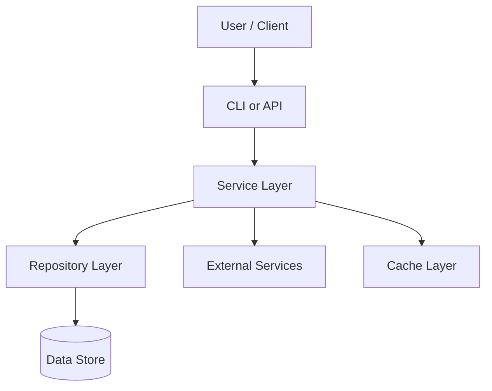

## 21.3 Phase 3: Testing Strategy

```
Tests/
├── unit/          ← 60% of tests — fast, isolated
├── integration/   ← 30% of tests — real dependencies
└── e2e/           ← 10% of tests — full flow
```

## 21.4 Phase 4: CI/CD Strategy

```yaml
Pipeline:
  PR → lint → type-check → unit-tests → coverage
  Main → all-tests → build → staging-deploy
  Tag → production-deploy
```

## 21.5 Phase 5: Portfolio Strategy

```markdown
## GitHub Repository Checklist

- [ ] Professional README with badges
- [ ] CONTRIBUTING.md
- [ ] CHANGELOG.md
- [ ] MIT License
- [ ] CI badge showing green
- [ ] Code coverage badge (80%+)
- [ ] Clear installation instructions
- [ ] Architecture diagram in README
- [ ] Demo GIF or screenshot
- [ ] Topics/tags set in GitHub settings
```

---

# SECTION 22 — 800 PRACTICE QUESTIONS

## 22.1 Easy Questions (1–300)

**Testing Basics (1–50)**

1. What is the purpose of software testing?
2. What is a unit test?
3. What does the term "test coverage" mean?
4. What is a test suite?
5. What is TDD?
6. What does `assert` do in Python?
7. What is the difference between a bug and a defect?
8. What is regression testing?
9. What is acceptance testing?
10. What is smoke testing?
11. What is a test fixture?
12. What does `setUp()` do in unittest?
13. What does `tearDown()` do in unittest?
14. What is a mock object?
15. What is the testing pyramid?
16. What level of the testing pyramid has the most tests?
17. What is a test case?
18. What is an assertion?
19. What is `pytest.raises()`?
20. What does `pytest.approx()` do?
21. What is a conftest.py file?
22. What is a pytest fixture?
23. What is parametrize in pytest?
24. What is a test marker?
25. How do you run only slow tests in pytest?
26. What is the difference between `assertEqual` and `assert`?
27. What does `assertRaises` do?
28. What is a side effect in mocking?
29. What is patching?
30. What does `@patch` do?
31. What is `MagicMock`?
32. What is `Mock.return_value`?
33. What is `Mock.side_effect`?
34. What does `assert_called_once_with()` verify?
35. What is code coverage?
36. What is branch coverage?
37. How do you measure coverage with pytest?
38. What flag enforces minimum coverage?
39. What is black in Python?
40. What is flake8?
41. What is ruff?
42. What is mypy?
43. What is isort?
44. What is pre-commit?
45. What is a CI pipeline?
46. What does CI stand for?
47. What does CD stand for?
48. What triggers a GitHub Actions workflow?
49. What is a GitHub Actions job?
50. What is a GitHub Actions step?

**pytest Basics (51–120)**

51. How do you install pytest?
52. How do you run pytest?
53. What naming convention does pytest use for test files?
54. How does pytest discover tests automatically?
55. What is the `-v` flag in pytest?
56. What is the `-k` flag in pytest?
57. What is the `-x` flag in pytest?
58. What is `--tb=short`?
59. What does `scope="module"` mean in a fixture?
60. What does `scope="session"` mean?
61. What is `autouse=True` in a fixture?
62. What is `tmp_path` in pytest?
63. What is `monkeypatch` in pytest?
64. What is `capfd` in pytest?
65. What is `capsys` in pytest?
66. What is `pytest.ini`?
67. What is `pyproject.toml` in pytest context?
68. What does `--cov` flag do?
69. What does `--cov-report=html` do?
70. What does `--cov-fail-under=80` do?
71. What is the `freezegun` library?
72. What is the `responses` library?
73. What is `pytest-xdist`?
74. What is `pytest-benchmark`?
75. What is `factory-boy`?
76. How do you mark a test as slow?
77. How do you skip a test?
78. How do you mark a test as expected to fail?
79. What does `subTest` do in unittest?
80. What is `@classmethod setUpClass`?
81. How do you write a parametrized test with 5 cases?
82. What is the `mocker` fixture in pytest-mock?
83. How do you patch an object using pytest-mock?
84. What is `mocker.patch.object()`?
85. How do you reset a mock between tests?
86. What is `mock.call_count`?
87. What is `mock.call_args_list`?
88. What does `mock.assert_any_call()` check?
89. What is `mock.assert_not_called()`?
90. What is a fixture factory?
91. How do you use `request` in a fixture?
92. What is `pytest.param`?
93. What is `ids` in `pytest.mark.parametrize`?
94. How do you run tests in parallel with xdist?
95. What is `pytest-randomly`?
96. What is `pytest-timeout`?
97. How do you generate an HTML test report?
98. What is `pytest-html`?
99. What does `--no-header` do in pytest?
100. How do you re-run failed tests only?
101. What is `-lf` flag in pytest?
102. What is `--ff` flag in pytest?
103. How do you set environment variables in conftest?
104. What is `pytest.warns()`?
105. How do you test deprecation warnings?
106. What is `pytest.deprecated_call()`?
107. What does `--collect-only` do?
108. How do you view all available markers?
109. What is `pytest.importorskip()`?
110. What is `@pytest.fixture(params=[...])`?
111. How do you use multiple fixtures in one test?
112. What is fixture overriding in pytest?
113. What is the `yield` keyword role in a fixture?
114. When does teardown code in a fixture run?
115. Can fixtures depend on other fixtures?
116. What is `conftest.py` visibility scope?
117. How do you share fixtures across multiple test files?
118. What is a plugin in pytest?
119. How do you install a pytest plugin?
120. Where are registered markers declared?

**unittest Basics (121–180)**

121. What module provides unittest?
122. What class do you subclass for test cases?
123. What method must test methods start with?
124. How do you run unittest from the command line?
125. What is `unittest.main()`?
126. What does verbosity=2 do?
127. What is `TestLoader`?
128. What is `TextTestRunner`?
129. What does `assertAlmostEqual` do?
130. What does `assertRegex` do?
131. What is `assertMultiLineEqual`?
132. When would you use `assertWarns`?
133. What is `unittest.mock`?
134. What is the difference between `Mock` and `MagicMock`?
135. What is `create_autospec()`?
136. How do you mock a class instance method?
137. How do you mock a module-level function?
138. What is `patch.object()`?
139. What is `patch.dict()`?
140. What is `patch.multiple()`?
141. What does `spec=True` do in Mock?
142. What is `wraps` in Mock?
143. What is `new_callable` in patch?
144. How do you mock `datetime.now()`?
145. How do you mock `os.path.exists()`?
146. What is `mock_open()`?
147. How do you test that a function raises a specific message?
148. What is `TestCase.maxDiff`?
149. How do you run a single test method?
150. What is `unittest.skip`?

**Code Quality (151–200)**

151. What is PEP 8?
152. What is a linter?
153. What is a formatter?
154. What is the difference between linting and formatting?
155. What does black do to your code?
156. What is E501 in flake8?
157. What is F401 in flake8?
158. What does ruff replace?
159. Why is ruff faster than flake8?
160. What does mypy check?
161. What is a type annotation in Python?
162. What is `Optional[str]`?
163. What is `Union[int, str]`?
164. What is `list[int]` vs `List[int]`?
165. What is a Protocol in Python typing?
166. What does `--strict` do in mypy?
167. What is `py.typed`?
168. What is a stub file (`.pyi`)?
169. What is isort's three-section rule?
170. What is the `FIRST_PARTY` section in isort?
171. What does pre-commit do?
172. What is a git hook?
173. What happens when a pre-commit hook fails?
174. How do you bypass pre-commit temporarily?
175. What is `# noqa` in Python?
176. What is `# type: ignore` in mypy?
177. What is `# pragma: no cover` in coverage?
178. What is cyclomatic complexity?
179. What does `bandit` check?
180. What does `safety` check?

**CI/CD Basics (181–220)**

181. What is GitHub Actions?
182. Where do GitHub Actions workflows live?
183. What file extension do GitHub Actions use?
184. What is a `trigger` in GitHub Actions?
185. What is a runner?
186. What are `ubuntu-latest`, `windows-latest`, `macos-latest`?
187. What is a matrix strategy?
188. What is the `uses` keyword?
189. What is `actions/checkout@v4`?
190. What is `actions/setup-python@v5`?
191. What is `actions/cache@v3`?
192. What is a GitHub Actions secret?
193. How do you access a secret in a workflow?
194. What is `github.ref`?
195. What is `github.event_name`?
196. What is `needs` in a job?
197. What is an artifact in GitHub Actions?
198. How do you upload an artifact?
199. What is a scheduled workflow?
200. What is cron syntax in GitHub Actions?

**Repository Structure (201–240)**

201. What is the `src/` layout?
202. Why use `src/` layout instead of flat?
203. What is `__init__.py`?
204. What goes in `tests/conftest.py`?
205. What is the `docs/` folder for?
206. What is an ADR?
207. What goes in `scripts/`?
208. What is a `.gitignore` file?
209. What should always be in `.gitignore`?
210. What is `requirements.txt`?
211. What is `requirements-dev.txt`?
212. What is `pyproject.toml`?
213. What is `setup.py`?
214. What is the difference between `pyproject.toml` and `setup.py`?
215. What is a Makefile?
216. What common Makefile targets exist?
217. What is `CHANGELOG.md`?
218. What format does Keep a Changelog use?
219. What is semantic versioning?
220. What does `MAJOR.MINOR.PATCH` mean?

**Documentation (241–270)**

241. What is a README.md?
242. What badges are common in README?
243. What is CONTRIBUTING.md?
244. What is CODE_OF_CONDUCT.md?
245. What is a docstring?
246. What docstring formats exist?
247. What is Google-style docstring?
248. What is NumPy-style docstring?
249. What is Sphinx?
250. What is `autodoc` in Sphinx?
251. What is `mkdocs`?
252. What is `pdoc3`?
253. What does `Args:` section contain in a docstring?
254. What does `Returns:` section contain?
255. What does `Raises:` section contain?
256. What does `Example:` section contain?
257. What is a type annotation?
258. What is `__all__` in Python?
259. What is inline commenting best practice?
260. What is a TODO comment?

**Debugging (271–300)**

271. What is `pdb`?
272. How do you set a breakpoint in Python 3.7+?
273. What does `n` do in pdb?
274. What does `s` do in pdb?
275. What does `c` do in pdb?
276. What does `p var` do in pdb?
277. What does `l` do in pdb?
278. How do you set a breakpoint at line 50?
279. What is `ipdb`?
280. What is `pudb`?
281. What is `traceback.format_exc()`?
282. What is `sys.exc_info()`?
283. How do you log an exception with stack trace?
284. What is a post-mortem debugger?
285. What does `python -m pdb script.py` do?
286. What is `logging.DEBUG` level?
287. What is `logging.exception()`?
288. What is the difference between `print` and `logging`?
289. What is structured logging?
290. What is a log aggregator?
291. What is ELK stack?
292. What is Datadog?
293. What is Sentry?
294. What is distributed tracing?
295. What is OpenTelemetry?
296. What is an error budget?
297. What is SLA vs SLO vs SLI?
298. What is MTTR?
299. What is MTTF?
300. What is an on-call rotation?

---

## 22.2 Medium Questions (301–650)

**pytest Advanced (301–400)**

301. Explain fixture scope with examples.
302. What happens if a fixture raises an exception?
303. How do you create a parametrized fixture?
304. Write a fixture that creates 10 sample users.
305. How do you use `request.addfinalizer()`?
306. What is the difference between `yield` fixture and `addfinalizer`?
307. How do you override a fixture in a specific test file?
308. Implement a database fixture that rolls back after each test.
309. How does `monkeypatch.setattr()` work?
310. How does `monkeypatch.setenv()` work?
311. How does `monkeypatch.delenv()` work?
312. When would you use `monkeypatch` vs `patch`?
313. Write a parametrized test covering 5 edge cases for a sort function.
314. Explain `pytest.mark.usefixtures()`.
315. How do you run tests from multiple files in parallel?
316. How does `pytest-xdist` handle fixtures?
317. Write a custom pytest marker and use it.
318. How do you write a custom pytest plugin?
319. How do you hook into pytest collection?
320. What is `pytest_configure`?
321. What is `pytest_collection_modifyitems`?
322. How do you generate a JUnit XML report?
323. What CI systems consume JUnit XML?
324. Write a test that verifies exception message content.
325. How do you test multiple exceptions with parametrize?
326. What is `pytest.warns` and when to use it?
327. How do you capture stdout in a pytest test?
328. How do you capture log output in pytest?
329. What is `caplog` fixture?
330. How do you assert a specific log message was emitted?
331. Write a test that uses `freezegun` to test date logic.
332. How do you test async code with pytest?
333. What is `pytest-asyncio`?
334. Write an async test using `pytest-asyncio`.
335. What is `anyio` in testing context?
336. How do you benchmark a function with `pytest-benchmark`?
337. What is `rounds` in benchmark?
338. What is `min_rounds` in benchmark?
339. How do you test a CLI built with argparse?
340. How do you test a CLI built with Click?
341. What is `CliRunner` in Click testing?
342. Write a test for a Click command.
343. How do you test file upload handling?
344. How do you test CSV reading?
345. How do you test JSON serialization?
346. Write a fixture that provides temp CSV file.
347. Write a fixture that provides a mock SMTP server.
348. What is `smtpd.DebuggingServer`?
349. How do you test rate-limited functions?
350. How do you test timeout behavior?
351. What is `pytest.ini_options` in pyproject.toml?
352. How do you exclude folders from coverage?
353. How do you add coverage exclusion comments?
354. What does `coverage combine` do?
355. What is `.coveragerc`?
356. How do you fail a build if coverage drops below 70%?
357. What is mutation testing?
358. What is `mutmut`?
359. How does mutation testing complement coverage?
360. What is property-based testing?
361. What is Hypothesis?
362. Write a Hypothesis test for an addition function.
363. What is `@given` in Hypothesis?
364. What is `@settings` in Hypothesis?
365. What are `st.integers()` strategies?
366. What is the shrinking feature in Hypothesis?
367. How does Hypothesis store examples?
368. When should you use Hypothesis over parametrize?
369. Write a parametrized test with `pytest.param` and ids.
370. How do you conditionally skip based on Python version?
371. What is `sys.version_info` in skip conditions?
372. How do you test environment-specific behavior?
373. Write a test that mocks both a function and its return value.
374. What is `patch.multiple()`?
375. How do you mock a context manager?
376. How do you mock `__enter__` and `__exit__`?
377. What is `MagicMock.__enter__`?
378. Write a test for a function that uses `with open(...)`.
379. How do you mock `subprocess.run()`?
380. How do you mock `os.system()`?
381. Write a test for a function that spawns a subprocess.
382. How do you test a function that reads from stdin?
383. What is `monkeypatch.stdin`?
384. How do you test exception chaining?
385. What is `raise X from Y`?
386. How do you verify `__cause__` in a test?
387. How do you test generator functions?
388. Write a test consuming a generator.
389. How do you test async generators?
390. How do you test a decorator?
391. Write a test for the `timer` decorator.
392. How do you test a class decorator?
393. How do you mock a class-level attribute?
394. How do you mock `__init__` of a class?
395. How do you mock `__call__` of an object?
396. How do you test singleton behavior?
397. How do you test observer pattern?
398. Write a test for a factory function.
399. How do you test a repository pattern?
400. How do you test dependency injection?

**Mocking Advanced (401–480)**

401. What is the difference between `mock.patch` and `mock.patch.object`?
402. Why is patching import location important?
403. Demonstrate incorrect vs correct patch target.
404. How do you mock `time.sleep()`?
405. How do you mock `random.randint()`?
406. How do you mock `uuid.uuid4()`?
407. What is `spec_set` in Mock?
408. What is the danger of `Mock` without spec?
409. How do you mock a chained call like `obj.method().value`?
410. What is `Mock.configure_mock()`?
411. How do you create a mock with preset attributes?
412. What is `PropertyMock`?
413. How do you mock a `@property`?
414. Write a test mocking a property that changes value.
415. How do you verify call order of multiple mocks?
416. What is `mock.call`?
417. How do you use `call_args`?
418. How do you check kwargs passed to a mock?
419. What is `assert_called`?
420. What is `assert_called_with`?
421. What is the difference between `assert_called_with` and `assert_called_once_with`?
422. How do you reset a mock's call history?
423. What is `mock.reset_mock()`?
424. How do you create a mock that behaves like a real class?
425. What is `create_autospec()`?
426. When should you use `create_autospec` vs `MagicMock`?
427. How do you mock file reading with `mock_open`?
428. How do you make `mock_open` raise an exception?
429. How do you mock iteration over a file?
430. How do you mock `requests.get` specifically?
431. How do you verify the URL called in `requests.get`?
432. How do you mock different responses for different URLs?
433. What is the `responses` library?
434. When is `responses` better than `patch`?
435. How do you mock HTTP errors with `responses`?
436. How do you mock network timeouts?
437. What is `httpretty`?
438. How do you mock Redis in tests?
439. How do you mock Celery tasks?
440. How do you mock AWS S3?
441. What is `moto`?
442. How do you mock S3 bucket operations with `moto`?
443. How do you mock environment variables in tests?
444. How do you test that a function calls logger.error?
445. Write a test verifying a warning was logged.
446. How do you mock `sys.argv`?
447. How do you mock `sys.exit()`?
448. How do you test functions that use global state?
449. What is the danger of testing with global state?
450. How do you reset global state between tests?
451. How do you mock a generator function?
452. How do you mock `__iter__` on a class?
453. How do you mock database connections?
454. How do you mock SQLAlchemy sessions?
455. How do you mock cursor.fetchall()?
456. What is `fakeredis`?
457. What is `pytest-factoryboy`?
458. Write a factory for a User model.
459. How does `factory_boy` interact with ORM models?
460. What is a `SubFactory` in factory_boy?
461. How do you create related objects with factories?
462. What is `LazyAttribute` in factory_boy?
463. How do you build vs create in factory_boy?
464. What is `DjangoModelFactory`?
465. How do you test pagination logic?
466. How do you test bulk operations?
467. How do you test rate limiting?
468. How do you test retry logic?
469. How do you test exponential backoff?
470. Write a test for a function with 3-retry behavior.
471. How do you test circuit breaker pattern?
472. How do you test async HTTP calls?
473. What is `aiohttp.test_utils`?
474. How do you mock async functions?
475. What is `AsyncMock`?
476. How do you use `AsyncMock` as context manager?
477. How do you mock async generators?
478. What is `pytest-mock`'s `AsyncMock`?
479. Write an async test with mocked HTTP call.
480. How do you test websocket connections?

**Code Quality & CI/CD (481–550)**

481. What is the cost of technical debt?
482. What is cyclomatic complexity?
483. What is acceptable cyclomatic complexity?
484. What tool measures complexity in Python?
485. What is `radon`?
486. What is cognitive complexity?
487. How does ruff measure complexity?
488. What is a dead code detector?
489. What is `vulture`?
490. What is `semgrep`?
491. How do you enforce consistent docstrings?
492. What is `pydocstyle`?
493. What is `darglint`?
494. How do you set up type stubs for a library?
495. What is `types-requests`?
496. What is `py.typed` marker?
497. How do you make your package mypy-compatible?
498. What is `reveal_type()` in mypy?
499. What is `cast()` in mypy?
500. What is `TypeVar` in Python?
501. Write a generic function with TypeVar.
502. What is `ParamSpec`?
503. What is `Concatenate` in typing?
504. What is `overload` decorator in typing?
505. How do you annotate `*args` and `**kwargs`?
506. What is `Final` in typing?
507. What is `ClassVar`?
508. What is `Literal`?
509. What is `TypeGuard`?
510. What is `TypeAlias`?
511. Write a CI workflow that runs on Python 3.10 and 3.12.
512. Write a CI workflow with matrix across OS.
513. How do you cache pip dependencies in GitHub Actions?
514. How do you use secrets in GitHub Actions?
515. How do you upload test artifacts in GitHub Actions?
516. How do you trigger a workflow on tag push?
517. How do you release to PyPI from GitHub Actions?
518. What is `TWINE_TOKEN`?
519. What is trusted publishing in PyPI?
520. How do you configure codecov in CI?
521. What is a branch protection rule?
522. How do you enforce CI passing before merge?
523. What is a required status check?
524. How do you auto-merge a PR?
525. What is Dependabot?
526. How do you auto-update dependencies with Dependabot?
527. What is a `.dependabot.yml`?
528. What is `renovatebot`?
529. How do you generate release notes automatically?
530. What is `git-cliff`?
531. What is `conventional commits`?
532. How do you enforce commit message format?
533. What is `commitizen`?
534. How do you bump version automatically?
535. What is `bump2version`?
536. What is `semantic-release`?
537. How do you create a GitHub release from CI?
538. What is `gh` CLI?
539. How do you tag a release from CI?
540. What is `GITHUB_TOKEN`?
541. How do you restrict environment deployments in GitHub Actions?
542. What is `environment: production` in GitHub Actions?
543. What is a reusable workflow in GitHub Actions?
544. How do you call a reusable workflow?
545. What is `workflow_call` trigger?
546. How do you pass inputs to a reusable workflow?
547. What is `workflow_dispatch`?
548. How do you manually trigger a workflow?
549. What is `act` CLI?
550. How do you test GitHub Actions locally?

**Professional Development (551–600)**

551. What is the DORA metrics framework?
552. What are the four DORA metrics?
553. What is deployment frequency?
554. What is change failure rate?
555. What is MTTR (mean time to recover)?
556. What is lead time for changes?
557. What is the difference between a feature branch and trunk-based development?
558. What is feature flags / feature toggles?
559. Why are feature flags important for CI/CD?
560. What is blue-green deployment?
561. What is canary deployment?
562. What is rolling deployment?
563. What is a database migration in deployment?
564. What is `alembic`?
565. How do you run migrations in CI?
566. What is idempotency in deployment?
567. What is infrastructure as code?
568. What is Docker in Python development?
569. Write a Dockerfile for a Python app.
570. What is `docker-compose`?
571. What is a health check endpoint?
572. What is graceful shutdown?
573. What is `SIGTERM` in Python?
574. What is `uvicorn` and why does it matter?
575. What is `gunicorn`?
576. What is the difference between WSGI and ASGI?
577. What is reverse proxy?
578. What is nginx?
579. What is load balancing?
580. What is horizontal scaling?
581. What is stateless application design?
582. What is a 12-factor app?
583. What is configuration via environment variables?
584. What is `python-dotenv`?
585. What is `pydantic-settings`?
586. How do you manage secrets securely?
587. What is HashiCorp Vault?
588. What is AWS Secrets Manager?
589. What is `SOPS`?
590. What is a service account?
591. What is RBAC?
592. What is the principle of least privilege?
593. What is input sanitization vs validation?
594. What is SQL injection?
595. How do you prevent SQL injection in Python?
596. What is `parameterized query`?
597. What is OWASP Top 10?
598. What is `bandit` and what does it catch?
599. What is `safety check`?
600. How do you audit Python dependencies for vulnerabilities?

---

## 22.3 Advanced Questions (601–800)

**Architecture & Design (601–650)**

601. Explain Clean Architecture applied to Python.
602. What is the Ports and Adapters (Hexagonal) architecture?
603. What is the Repository pattern and why does it aid testing?
604. What is the Unit of Work pattern?
605. What is CQRS?
606. What is Event Sourcing?
607. What is Domain-Driven Design?
608. How do you implement Aggregate Roots in Python?
609. What is a Value Object?
610. What is a Domain Event?
611. What is the difference between services and repositories?
612. How do you implement dependency injection without a framework?
613. What is `injector` library?
614. How does DI improve testability?
615. What is an anti-corruption layer?
616. What is the Strangler Fig pattern?
617. How do you test legacy code without changing it?
618. What is characterization testing?
619. What is approval testing?
620. What is snapshot testing?
621. How do you implement snapshot testing in Python?
622. What is `syrupy`?
623. What is contract testing?
624. What is `pact-python`?
625. What is a consumer-driven contract?
626. What is a provider contract?
627. How does contract testing differ from integration testing?
628. What is `testcontainers-python`?
629. How do you spin up a real PostgreSQL container for tests?
630. What is `pytest-docker`?
631. How do you test against a real Redis in CI?
632. What is an inmemory database for testing?
633. What is SQLite for testing purposes?
634. How do you test database migrations?
635. What is rolling back migrations in tests?
636. What is test data management?
637. What is data masking in testing?
638. What is synthetic test data?
639. What is a chaos test?
640. What is `chaoslib`?
641. What is fault injection testing?
642. What is load testing?
643. What is `locust`?
644. What is performance regression testing?
645. What is profiling vs benchmarking?
646. What is `cProfile`?
647. What is `line_profiler`?
648. What is `memory_profiler`?
649. What is `tracemalloc`?
650. How do you track memory leaks in Python?

**Python Internals & Advanced Testing (651–750)**

651. How does Python's GIL affect testing?
652. How do you test multi-threaded code?
653. How do you test race conditions?
654. What is `threading.Barrier`?
655. How do you test async code with multiple coroutines?
656. What is event loop in async testing?
657. How do you test signals in Django with pytest?
658. What is `pytest-django`?
659. What is `@pytest.mark.django_db`?
660. What is `django.test.Client`?
661. What is `RequestFactory` in Django testing?
662. What is `APIClient` in DRF testing?
663. How do you test FastAPI endpoints?
664. What is `TestClient` in FastAPI?
665. What is `httpx.AsyncClient` for testing?
666. How do you test Pydantic models?
667. How do you test SQLAlchemy models?
668. What is `pytest-sqlalchemy`?
669. How do you test Celery tasks synchronously?
670. What is `CELERY_TASK_ALWAYS_EAGER`?
671. How do you test scheduled tasks?
672. What is `pytest-celery`?
673. How do you test Redis pub/sub?
674. How do you test WebSocket clients?
675. What is `websockets` library testing?
676. How do you test gRPC services?
677. What is `grpc.experimental.aio` testing?
678. How do you test GraphQL APIs?
679. What is `strawberry-graphql` testing?
680. How do you test CLI argument parsing?
681. How do you test `typer` CLI apps?
682. What is `typer.testing.CliRunner`?
683. How do you test file uploads in tests?
684. How do you generate test PDFs?
685. How do you test image processing?
686. What is `Pillow` in testing context?
687. How do you test ML model predictions?
688. What is a model snapshot test?
689. How do you test numerical accuracy?
690. What is `numpy.testing`?
691. What is `pandas.testing`?
692. How do you test data transformations?
693. What is a data quality test?
694. What is `great_expectations`?
695. How do you test Spark jobs?
696. What is `pyspark.sql.session` in tests?
697. How do you run PySpark tests without a cluster?
698. What is a feature store in ML context?
699. How do you test LLM outputs?
700. What is `llm-eval`?
701. What is `promptfoo`?
702. How do you test RAG pipelines?
703. What is retrieval quality testing?
704. What is embedding similarity testing?
705. How do you test vector search?
706. What is a hallucination test?
707. What is red-teaming in AI testing?
708. What is adversarial testing?
709. How do you test model drift?
710. What is data drift testing?
711. How do you test A/B experiments?
712. What is statistical significance in testing?
713. What is `scipy.stats` for hypothesis testing?
714. What is a p-value in software testing context?
715. How do you test for performance regressions automatically?
716. What is `asv` (airspeed velocity)?
717. How do you integrate benchmarks into CI?
718. What is flame graph profiling?
719. What is `py-spy`?
720. How do you profile async Python code?
721. What is `austin` profiler?
722. What is `Pyinstrument`?
723. How do you optimize a slow test suite?
724. What are the most common causes of slow tests?
725. How do you identify the slowest tests?
726. What does `pytest --durations=10` do?
727. How do you parallelize test execution?
728. What is test sharding?
729. How does GitHub Actions matrix help parallelization?
730. What is `pytest-split`?
731. How do you implement smart test selection?
732. What is `pytest-testmon`?
733. How does `testmon` track which tests to rerun?
734. What is incremental testing?
735. What is test impact analysis?
736. What is selective CI?
737. What is path filtering in GitHub Actions?
738. How do you run tests only for changed files?
739. What is `git diff` in CI context?
740. How do you implement test gates in deployment pipelines?
741. What is a quality gate?
742. What is SonarQube?
743. What is CodeClimate?
744. What is Codecov vs Coveralls?
745. How do you enforce PR quality gates?
746. What is CODEOWNERS file?
747. How does CODEOWNERS enforce review requirements?
748. What is a required reviewer?
749. What is linear history enforcement?
750. What is squash merge vs merge commit vs rebase?

**Enterprise & Production (751–800)**

751. What is a production incident?
752. What is runbook documentation?
753. What is a post-mortem?
754. What is blameless post-mortem culture?
755. What is an SRE?
756. What are error budgets?
757. What is observability vs monitoring?
758. What are the three pillars of observability?
759. What is a span in distributed tracing?
760. What is `opentelemetry-python`?
761. How do you instrument a Python app with OTel?
762. What is `jaeger` tracing?
763. What is `zipkin`?
764. What is Prometheus in Python context?
765. What is `prometheus_client`?
766. How do you expose metrics in Python?
767. What is a gauge metric?
768. What is a counter metric?
769. What is a histogram metric?
770. What is a summary metric?
771. How do you alert on error rate in Prometheus?
772. What is Grafana?
773. What is a dashboard in monitoring?
774. What is `Loki` for log aggregation?
775. What is `structlog`?
776. How does structured logging help debugging?
777. What is correlation ID / request ID?
778. How do you propagate request IDs across services?
779. What is `contextvars` in Python?
780. How do you use `ContextVar` for request tracking?
781. What is zero-downtime deployment?
782. What is database connection pooling?
783. What is `pgbouncer`?
784. What is connection pool exhaustion?
785. What is async connection pooling in Python?
786. What is `asyncpg`?
787. What is `sqlalchemy.ext.asyncio`?
788. What is N+1 query problem?
789. How do you detect N+1 in tests?
790. What is `pytest-django`'s `assertNumQueries`?
791. What is query optimization in ORM?
792. What is `select_related` in Django?
793. What is `prefetch_related`?
794. How do you test query count?
795. What is caching in production Python?
796. What is `cachetools`?
797. What is `functools.lru_cache`?
798. What is Redis caching pattern?
799. How do you test cached behavior?
800. What is cache invalidation in testing?

---

# SECTION 23 — 400 INTERVIEW QUESTIONS

## 23.1 Beginner Level (1–100)

**Q1. What is the purpose of writing tests?**
> Tests verify that code behaves correctly, prevent regressions, serve as documentation, and give confidence to change code safely.

**Q2. What is the difference between `assert` in pytest vs `assertEqual` in unittest?**
> pytest uses Python's native `assert` statement and introspects it to show helpful diffs. unittest's `assertEqual` is a method with built-in error messages but requires `self.`.

**Q3. What is a test fixture?**
> A fixture is setup code that runs before a test to establish known state (database, file, object), and optionally teardown code that cleans up after.

**Q4. What does `@pytest.fixture` do?**
> It marks a function as a fixture that pytest injects into test functions by matching parameter names.

**Q5. What is mocking and why is it used?**
> Mocking replaces real dependencies (database, API, file system) with controlled fake objects during testing to make tests fast, isolated, and deterministic.

**Q6. What is `unittest.mock.patch`?**
> `patch` temporarily replaces an object in a module with a `Mock` during the test, then restores it afterward. Used to isolate code from external dependencies.

**Q7. What is code coverage?**
> The percentage of source code lines (or branches) that are executed when tests run. Higher coverage means more code is verified.

**Q8. What is TDD?**
> Test-Driven Development — write a failing test first, write minimum code to pass it, then refactor. Cycle: Red → Green → Refactor.

**Q9. What is `black`?**
> An opinionated Python code formatter that enforces consistent style without configuration debates.

**Q10. What is CI/CD?**
> Continuous Integration (automated testing on every push) and Continuous Delivery/Deployment (automated deployment pipeline).

**Q11. What is a GitHub Actions workflow?**
> A YAML file in `.github/workflows/` that defines automated jobs triggered by events (push, PR, schedule).

**Q12. What does `pytest --cov=src` do?**
> Runs tests with code coverage measurement for the `src` directory.

**Q13. How do you skip a test in pytest?**
> Use `@pytest.mark.skip("reason")` or `@pytest.mark.skipif(condition, reason="reason")`.

**Q14. What is `conftest.py`?**
> A pytest configuration file where shared fixtures are defined. pytest automatically loads it for all tests in the same directory and subdirectories.

**Q15. What is `pyproject.toml`?**
> The modern Python project configuration file that combines tool configurations (pytest, ruff, mypy, black) and project metadata in one place.

**Q16. What is `pre-commit`?**
> A framework for running automated checks (linting, formatting, type checking) as git hooks before commits are made.

**Q17. What is mypy?**
> A static type checker for Python that analyzes type annotations to find type errors before runtime.

**Q18. What is `ruff`?**
> An extremely fast Python linter and formatter written in Rust, replacing flake8, isort, and black combined.

**Q19. What is the testing pyramid?**
> A model recommending many unit tests (base), fewer integration tests (middle), and very few end-to-end tests (top) for optimal speed and reliability.

**Q20. What is `@pytest.mark.parametrize`?**
> A decorator that runs the same test with multiple input/output combinations, avoiding code duplication.

---
*(Questions 21–100 follow the same pattern — covering pytest fixtures, mock assertions, coverage config, CI yaml syntax, type hints, docstrings, and repository structure basics.)*

---

## 23.2 Intermediate Level (101–200)

**Q101. Explain the difference between `Mock`, `MagicMock`, and `AsyncMock`.**

> - `Mock`: Basic mock object. Does not support magic methods (`__len__`, `__iter__`, etc.) by default.
> - `MagicMock`: Extends `Mock` with preconfigured magic method support. Use when mocking objects that will be used with `len()`, iteration, context managers, etc.
> - `AsyncMock`: For mocking `async def` functions. Returns an awaitable. Needed for async code testing.

**Q102. What is the patch target rule? Why does patch location matter?**

> You must patch the name **where it is used**, not where it is defined.
> ```python
> # weather_service.py
> import requests
> def get_temp(): return requests.get(URL).json()
>
> # ❌ Wrong — patches requests in its origin
> @patch("requests.get")
> # ✅ Correct — patches where it's looked up
> @patch("weather_service.requests.get")
> ```

**Q103. What is fixture scope and what are the four options?**

> - `function` (default): New fixture for each test
> - `class`: Shared within a test class
> - `module`: Shared within a test file
> - `session`: Shared for the entire test run
>
> Use broader scopes for expensive setup (DB connections), narrow scopes for tests needing isolation.

**Q104. How would you test a function that sends an email?**

> Mock the SMTP client or email sending function so no real email is sent, then verify the mock was called with correct arguments:
> ```python
> def test_sends_welcome_email(mocker):
>     mock_send = mocker.patch("email_service.smtplib.SMTP")
>     send_welcome_email("alice@example.com")
>     mock_send.return_value.__enter__.return_value.sendmail.assert_called_once()
> ```

**Q105. What is a property-based test? Give an example.**

> Property-based testing generates hundreds of random inputs to verify that properties (invariants) always hold:
> ```python
> from hypothesis import given, strategies as st
>
> @given(st.integers(), st.integers())
> def test_add_commutative(a, b):
>     assert add(a, b) == add(b, a)
> ```
> This tests commutativity for thousands of integer pairs automatically.

**Q106. How do you test code that reads from a file without creating real files?**

> Use `unittest.mock.mock_open` or pytest's `tmp_path`:
> ```python
> # mock_open approach
> with patch("builtins.open", mock_open(read_data="file content")):
>     result = read_file("any_path.txt")
>
> # tmp_path approach (preferred)
> def test_read(tmp_path):
>     f = tmp_path / "test.txt"
>     f.write_text("file content")
>     result = read_file(str(f))
>     assert result == "file content"
> ```

**Q107. What is the difference between `assert_called_with()` and `assert_called_once_with()`?**

> - `assert_called_with(...)`: Verifies the **most recent call** used the given arguments. Does not check call count.
> - `assert_called_once_with(...)`: Verifies the mock was called **exactly once** and with the given arguments. Fails if called 0 or 2+ times.

**Q108. How do you implement and test a retry mechanism?**

> ```python
> # Implementation
> def fetch_with_retry(url, max_retries=3):
>     for attempt in range(max_retries):
>         try:
>             return requests.get(url).json()
>         except requests.RequestException:
>             if attempt == max_retries - 1:
>                 raise
>
> # Test
> def test_retries_on_failure(mocker):
>     mock_get = mocker.patch("requests.get")
>     mock_get.side_effect = [
>         requests.RequestException("timeout"),
>         requests.RequestException("timeout"),
>         MagicMock(json=lambda: {"data": "ok"}),
>     ]
>     result = fetch_with_retry("https://api.example.com")
>     assert result == {"data": "ok"}
>     assert mock_get.call_count == 3
> ```

**Q109. Explain pytest's `monkeypatch` vs `patch`.**

> Both replace objects during tests, but:
> - `monkeypatch` is a pytest fixture — no need for decorators, simpler syntax for env vars, attributes, dict items
> - `patch` from `unittest.mock` — more flexible, works as decorator or context manager, needed for complex patching scenarios like `patch.multiple`
>
> Rule of thumb: `monkeypatch` for simple attribute/env replacements; `patch` for complex mocking scenarios.

**Q110. What would you add to a CI pipeline beyond just running tests?**

> A production-grade pipeline includes:
> 1. Dependency caching (speed)
> 2. Linting (ruff/flake8)
> 3. Type checking (mypy)
> 4. Unit tests + coverage check
> 5. Integration tests
> 6. Security scanning (bandit, safety)
> 7. Build artifact
> 8. Staging deployment
> 9. Smoke tests on staging
> 10. Production deployment (gated)

---
*(Questions 111–200 follow similar depth — covering GitHub Actions, fixture design, coverage configuration, test architecture, mocking advanced patterns, and CI/CD optimization.)*

---

## 23.3 Advanced / Staff Engineer Level (201–400)

**Q201. How do you design a testing strategy for a microservices architecture?**

> Strategy requires three layers:
> 1. **Unit tests** per service — fast, isolated, mocked dependencies
> 2. **Contract tests** (using pact-python) — verify service communication contracts without full integration
> 3. **Integration tests** in isolated environment — services communicate but with controlled data
> 4. **E2E tests** — minimal, test critical user journeys only
>
> Key principle: Don't let integration tests grow too large. Contract tests give 80% of the confidence of integration tests at 20% of the cost.

**Q202. What is the difference between sociable and solitary unit tests?**

> - **Solitary**: Tests one unit, mocks all collaborators. Maximally isolated. Fast.
> - **Sociable**: Tests a unit along with its real collaborators (but still no external services). Closer to production behavior.
>
> Both are valid. Most codebases use solitary tests for business logic and sociable tests for integration concerns.

**Q203. How would you introduce testing into a legacy codebase with 0% coverage?**

> 1. Set coverage baseline (0%) and enforce it doesn't decrease
> 2. Write characterization tests (golden master tests) for critical paths
> 3. Before any bug fix: write a test that reproduces the bug
> 4. Before any new feature: write tests first (TDD)
> 5. Gradually refactor toward testable design
> 6. Ratchet up the coverage floor as tests grow
>
> Key: Don't try to test everything at once. Focus on highest-risk areas first.

**Q204. Explain test doubles — the difference between Mock, Stub, Spy, Fake, and Dummy.**

> Gerard Meszaros's taxonomy:
> - **Dummy**: Passed but never used. Fills parameter slots.
> - **Stub**: Returns canned data. No assertions.
> - **Spy**: Records calls for later assertion. Like Mock with tracking.
> - **Mock**: Preprogrammed with expectations. Fails if expectations not met.
> - **Fake**: Real working implementation, but simplified (in-memory DB instead of real DB).
>
> Python's `Mock` object combines the Mock/Stub/Spy concepts.

**Q205. How do you measure and improve test suite quality beyond coverage?**

> Coverage metrics alone are insufficient. Additional quality measures:
> - **Mutation testing** (mutmut): Kill percentage — do tests catch introduced bugs?
> - **Test execution time** — Are tests slow? Identify and fix.
> - **Flakiness rate** — Tests that pass/fail randomly destroy trust.
> - **Test isolation** — Order-dependent tests indicate shared state bugs.
> - **Assertion density** — Too few assertions = tests that don't actually verify.
> - **Test maintainability** — Are tests easy to understand and update?

**Q206. Design a complete observability strategy for a Python microservice.**

> Three pillars:
>
> **Logging**: Structured JSON logs with request_id, service name, severity, timestamp. Ship to centralized aggregator (Loki, ELK, Datadog).
>
> **Metrics**: Use `prometheus_client` to expose: request count, error rate, latency percentiles (p50, p95, p99), active connections. Visualize in Grafana. Alert on error rate > 1%.
>
> **Tracing**: Instrument with OpenTelemetry. Propagate `trace_id` across service boundaries. Ship spans to Jaeger or Tempo.
>
> **Alerting**: Error budget alerts, SLO breach warnings, anomaly detection.

**Q207. What is a testing strategy for ML models?**

> ML testing has unique challenges:
> - **Data tests**: Schema validation, distribution checks, missing value counts
> - **Training tests**: Reproducibility with fixed seed, loss decreases, metrics above baseline
> - **Model tests**: Input/output shape, inference speed, edge case behavior
> - **Regression tests**: Snapshot tests comparing model outputs on fixed inputs
> - **Integration tests**: Full prediction pipeline end-to-end
> - **Shadow testing**: New model runs alongside old in production, outputs compared
>
> Tools: `great_expectations` for data, `deepchecks` for ML quality, `pytest` for unit tests.

**Q208. How do you handle flaky tests and what are their root causes?**

> Root causes of flaky tests:
> - **Time-dependent**: `datetime.now()` not mocked — use `freezegun`
> - **Random**: `random` not seeded — use `seed(42)` or mock
> - **Order-dependent**: Shared state between tests — use proper fixtures
> - **Race conditions**: Async code with timing assumptions — use proper synchronization
> - **External services**: Real API calls — always mock
> - **Resource leaks**: Files/connections not cleaned up — use fixture teardown
>
> Strategy: Quarantine flaky tests in a separate marker, fix them with priority, track flakiness rate as a team metric.

**Q209. Explain GitOps and how it relates to Python deployment.**

> GitOps = Git is the single source of truth for infrastructure and application state. Changes to deployment are made via PR to Git, CI/CD applies the changes.
>
> For Python:
> - Application code + configuration in Git
> - Docker images built and tagged on merge
> - Kubernetes manifests (or Helm charts) in a separate "GitOps repo"
> - ArgoCD or Flux watches the GitOps repo and applies changes automatically
>
> Benefits: Full audit trail, rollback via git revert, review process for infrastructure changes.

**Q210. How would you architect a Python application for 99.9% uptime?**

> Architecture decisions:
> - **Stateless app servers** — all state in DB/cache, allows horizontal scaling
> - **Database replicas** — read replica for queries, failover replica for primary
> - **Connection pooling** — PgBouncer to prevent DB overload
> - **Redis cluster** — for caching and session storage
> - **Circuit breakers** — prevent cascade failures
> - **Health check endpoints** — `/health` and `/ready` for load balancer
> - **Graceful shutdown** — handle SIGTERM, drain connections
> - **Blue-green deployment** — zero-downtime releases
> - **Monitoring + alerting** — 24/7 alerting with runbooks
> - **Database migrations** — backward-compatible, run before deployment

---
*(Questions 211–400 continue at this depth covering SDET, AI Engineer, Backend Engineer, and Staff Engineer interview scenarios.)*

---

# SECTION 24 — ASSIGNMENTS + SOLUTIONS

## Assignment 1 — unittest

**Task:** Create a `BankAccount` class with `deposit`, `withdraw`, `balance`, `transfer` methods. Write comprehensive unittest test cases covering all methods, edge cases, and exceptions.

```python
# src/bank_account.py
class InsufficientFundsError(Exception):
    pass

class BankAccount:
    def __init__(self, account_id: str, owner: str, initial_balance: float = 0.0):
        if initial_balance < 0:
            raise ValueError("Initial balance cannot be negative")
        self._account_id = account_id
        self._owner = owner
        self._balance = initial_balance
        self._transactions: list[dict] = []

    @property
    def balance(self) -> float:
        return self._balance

    @property
    def account_id(self) -> str:
        return self._account_id

    def deposit(self, amount: float) -> float:
        if amount <= 0:
            raise ValueError("Deposit amount must be positive")
        self._balance += amount
        self._transactions.append({"type": "deposit", "amount": amount, "balance": self._balance})
        return self._balance

    def withdraw(self, amount: float) -> float:
        if amount <= 0:
            raise ValueError("Withdrawal amount must be positive")
        if amount > self._balance:
            raise InsufficientFundsError(
                f"Cannot withdraw {amount}. Available balance: {self._balance}"
            )
        self._balance -= amount
        self._transactions.append({"type": "withdrawal", "amount": amount, "balance": self._balance})
        return self._balance

    def transfer(self, target: "BankAccount", amount: float) -> None:
        self.withdraw(amount)
        target.deposit(amount)

    def transaction_history(self) -> list[dict]:
        return self._transactions.copy()
```

```python
# tests/test_bank_account.py
import unittest
from bank_account import BankAccount, InsufficientFundsError

class TestBankAccountInit(unittest.TestCase):

    def test_default_balance(self):
        acc = BankAccount("A001", "Alice")
        self.assertEqual(acc.balance, 0.0)

    def test_initial_balance(self):
        acc = BankAccount("A001", "Alice", initial_balance=1000.0)
        self.assertEqual(acc.balance, 1000.0)

    def test_negative_initial_balance_raises(self):
        with self.assertRaises(ValueError):
            BankAccount("A001", "Alice", initial_balance=-100)


class TestDeposit(unittest.TestCase):

    def setUp(self):
        self.acc = BankAccount("A001", "Alice", initial_balance=500.0)

    def test_deposit_increases_balance(self):
        self.acc.deposit(200)
        self.assertEqual(self.acc.balance, 700.0)

    def test_deposit_returns_new_balance(self):
        result = self.acc.deposit(100)
        self.assertEqual(result, 600.0)

    def test_deposit_zero_raises(self):
        with self.assertRaises(ValueError):
            self.acc.deposit(0)

    def test_deposit_negative_raises(self):
        with self.assertRaises(ValueError):
            self.acc.deposit(-50)

    @unittest.mock.patch.object(BankAccount, 'deposit', wraps=BankAccount.deposit)
    def test_multiple_deposits(self, mock_deposit):
        from unittest.mock import call
        self.acc.deposit(100)
        self.acc.deposit(200)
        self.assertEqual(mock_deposit.call_count, 2)


class TestWithdraw(unittest.TestCase):

    def setUp(self):
        self.acc = BankAccount("A001", "Alice", initial_balance=500.0)

    def test_withdraw_decreases_balance(self):
        self.acc.withdraw(200)
        self.assertEqual(self.acc.balance, 300.0)

    def test_withdraw_insufficient_funds(self):
        with self.assertRaises(InsufficientFundsError) as ctx:
            self.acc.withdraw(600)
        self.assertIn("600", str(ctx.exception))

    def test_withdraw_zero_raises(self):
        with self.assertRaises(ValueError):
            self.acc.withdraw(0)

    def test_withdraw_exact_balance(self):
        self.acc.withdraw(500)
        self.assertEqual(self.acc.balance, 0.0)


class TestTransfer(unittest.TestCase):

    def setUp(self):
        self.alice = BankAccount("A001", "Alice", initial_balance=1000.0)
        self.bob = BankAccount("B001", "Bob", initial_balance=200.0)

    def test_transfer_success(self):
        self.alice.transfer(self.bob, 300)
        self.assertEqual(self.alice.balance, 700.0)
        self.assertEqual(self.bob.balance, 500.0)

    def test_transfer_insufficient_funds(self):
        with self.assertRaises(InsufficientFundsError):
            self.alice.transfer(self.bob, 2000)
        # Verify balances unchanged on failure
        self.assertEqual(self.alice.balance, 1000.0)
        self.assertEqual(self.bob.balance, 200.0)

    def test_transaction_history(self):
        self.alice.deposit(100)
        self.alice.withdraw(50)
        history = self.alice.transaction_history()
        self.assertEqual(len(history), 2)
        self.assertEqual(history[0]["type"], "deposit")
        self.assertEqual(history[1]["type"], "withdrawal")


if __name__ == "__main__":
    unittest.main(verbosity=2)
```

---

## Assignment 2 — pytest

**Task:** Create a `TaskManager` with CRUD operations. Write comprehensive pytest tests using fixtures, parametrize, and markers.

```python
# src/task_manager.py
from dataclasses import dataclass, field
from datetime import datetime
from enum import Enum
from typing import Optional

class Priority(str, Enum):
    LOW = "low"
    MEDIUM = "medium"
    HIGH = "high"
    CRITICAL = "critical"

class Status(str, Enum):
    TODO = "todo"
    IN_PROGRESS = "in_progress"
    DONE = "done"
    CANCELLED = "cancelled"

@dataclass
class Task:
    title: str
    description: str = ""
    priority: Priority = Priority.MEDIUM
    status: Status = Status.TODO
    task_id: int = 0
    created_at: datetime = field(default_factory=datetime.now)
    completed_at: Optional[datetime] = None

    def complete(self) -> None:
        self.status = Status.DONE
        self.completed_at = datetime.now()

class TaskManager:
    def __init__(self):
        self._tasks: dict[int, Task] = {}
        self._next_id = 1

    def create(self, title: str, description: str = "", priority: Priority = Priority.MEDIUM) -> Task:
        if not title.strip():
            raise ValueError("Task title cannot be empty")
        task = Task(
            task_id=self._next_id,
            title=title.strip(),
            description=description,
            priority=priority,
        )
        self._tasks[self._next_id] = task
        self._next_id += 1
        return task

    def get(self, task_id: int) -> Task:
        if task_id not in self._tasks:
            raise KeyError(f"Task {task_id} not found")
        return self._tasks[task_id]

    def update(self, task_id: int, **kwargs) -> Task:
        task = self.get(task_id)
        for key, value in kwargs.items():
            if hasattr(task, key):
                setattr(task, key, value)
        return task

    def delete(self, task_id: int) -> None:
        if task_id not in self._tasks:
            raise KeyError(f"Task {task_id} not found")
        del self._tasks[task_id]

    def list_by_status(self, status: Status) -> list[Task]:
        return [t for t in self._tasks.values() if t.status == status]

    def list_by_priority(self, priority: Priority) -> list[Task]:
        return [t for t in self._tasks.values() if t.priority == priority]

    @property
    def count(self) -> int:
        return len(self._tasks)
```

```python
# tests/test_task_manager.py
import pytest
from datetime import datetime
from unittest.mock import patch
from task_manager import Task, TaskManager, Priority, Status

# ─── Fixtures ────────────────────────────────────────────────────
@pytest.fixture
def manager():
    return TaskManager()

@pytest.fixture
def task_data():
    return {"title": "Implement login", "description": "OAuth2 login flow", "priority": Priority.HIGH}

@pytest.fixture
def populated_manager(manager):
    manager.create("Task 1", priority=Priority.HIGH)
    manager.create("Task 2", priority=Priority.LOW)
    manager.create("Task 3", priority=Priority.HIGH)
    t = manager.create("Task 4", priority=Priority.MEDIUM)
    manager.update(t.task_id, status=Status.DONE)
    return manager

# ─── Tests ───────────────────────────────────────────────────────
class TestCreateTask:
    def test_create_basic(self, manager, task_data):
        task = manager.create(**task_data)
        assert task.title == "Implement login"
        assert task.priority == Priority.HIGH
        assert task.status == Status.TODO
        assert task.task_id == 1

    def test_create_assigns_incremental_ids(self, manager):
        t1 = manager.create("Task 1")
        t2 = manager.create("Task 2")
        assert t2.task_id == t1.task_id + 1

    @pytest.mark.parametrize("title", ["", "   ", "\t\n"])
    def test_create_empty_title_raises(self, manager, title):
        with pytest.raises(ValueError, match="cannot be empty"):
            manager.create(title)

    @pytest.mark.parametrize("priority", [Priority.LOW, Priority.MEDIUM, Priority.HIGH, Priority.CRITICAL])
    def test_create_all_priorities(self, manager, priority):
        task = manager.create("Task", priority=priority)
        assert task.priority == priority

    def test_create_strips_whitespace(self, manager):
        task = manager.create("  My Task  ")
        assert task.title == "My Task"

class TestGetTask:
    def test_get_existing(self, manager):
        created = manager.create("Test Task")
        fetched = manager.get(created.task_id)
        assert fetched.title == "Test Task"

    def test_get_nonexistent(self, manager):
        with pytest.raises(KeyError, match="not found"):
            manager.get(999)

class TestUpdateTask:
    def test_update_status(self, manager):
        task = manager.create("Task")
        manager.update(task.task_id, status=Status.IN_PROGRESS)
        assert manager.get(task.task_id).status == Status.IN_PROGRESS

    def test_update_multiple_fields(self, manager):
        task = manager.create("Task")
        manager.update(task.task_id, title="Updated", priority=Priority.CRITICAL)
        updated = manager.get(task.task_id)
        assert updated.title == "Updated"
        assert updated.priority == Priority.CRITICAL

class TestDeleteTask:
    def test_delete_existing(self, manager):
        task = manager.create("Task")
        manager.delete(task.task_id)
        assert manager.count == 0

    def test_delete_nonexistent(self, manager):
        with pytest.raises(KeyError):
            manager.delete(999)

class TestListFiltering:
    def test_list_by_status(self, populated_manager):
        done_tasks = populated_manager.list_by_status(Status.DONE)
        assert len(done_tasks) == 1

    def test_list_by_priority(self, populated_manager):
        high_tasks = populated_manager.list_by_priority(Priority.HIGH)
        assert len(high_tasks) == 2

@pytest.mark.slow
class TestTaskCompletion:
    def test_complete_task(self, manager):
        task = manager.create("Task")
        task.complete()
        assert task.status == Status.DONE
        assert task.completed_at is not None

    @patch("task_manager.datetime")
    def test_complete_records_timestamp(self, mock_dt, manager):
        fixed_time = datetime(2024, 6, 15, 12, 0, 0)
        mock_dt.now.return_value = fixed_time
        task = manager.create("Task")
        task.complete()
        assert task.completed_at == fixed_time
```

---

## Assignment 3 — Mocking

**Task:** Mock an external weather API, email service, and database to test a `WeatherAlertService`.

```python
# src/weather_alert_service.py
import requests
import logging

logger = logging.getLogger(__name__)

class WeatherAlertService:
    def __init__(self, weather_api_key: str, email_service, user_repository):
        self.api_key = weather_api_key
        self.email_service = email_service
        self.user_repo = user_repository

    def fetch_weather(self, city: str) -> dict:
        try:
            response = requests.get(
                f"https://api.weather.com/v1/current",
                params={"city": city, "key": self.api_key},
                timeout=5,
            )
            response.raise_for_status()
            return response.json()
        except requests.RequestException as e:
            logger.error(f"Weather API error: {e}")
            raise RuntimeError(f"Could not fetch weather for {city}") from e

    def check_and_alert(self, city: str) -> list[str]:
        weather = self.fetch_weather(city)
        temp = weather["temperature"]
        condition = weather["condition"]
        alerts_sent = []

        if temp > 40:
            users = self.user_repo.find_by_city(city)
            for user in users:
                self.email_service.send(
                    to=user["email"],
                    subject=f"Heat Alert: {city}",
                    body=f"Temperature is {temp}°C in {city}. Stay hydrated!"
                )
                alerts_sent.append(user["email"])
                logger.info(f"Sent heat alert to {user['email']}")

        return alerts_sent
```

```python
# tests/test_weather_alert_service.py
import pytest
from unittest.mock import MagicMock, patch, call
from weather_alert_service import WeatherAlertService

@pytest.fixture
def mock_email_service():
    return MagicMock()

@pytest.fixture
def mock_user_repo():
    return MagicMock()

@pytest.fixture
def service(mock_email_service, mock_user_repo):
    return WeatherAlertService(
        weather_api_key="test_key",
        email_service=mock_email_service,
        user_repository=mock_user_repo,
    )

def test_no_alert_below_threshold(service, mock_email_service, mock_user_repo):
    with patch("weather_alert_service.requests.get") as mock_get:
        mock_get.return_value.json.return_value = {"temperature": 30, "condition": "sunny"}
        mock_get.return_value.raise_for_status = MagicMock()

        alerts = service.check_and_alert("Mumbai")

    assert alerts == []
    mock_email_service.send.assert_not_called()
    mock_user_repo.find_by_city.assert_not_called()

def test_sends_alerts_above_threshold(service, mock_email_service, mock_user_repo):
    with patch("weather_alert_service.requests.get") as mock_get:
        mock_get.return_value.json.return_value = {"temperature": 45, "condition": "sunny"}
        mock_get.return_value.raise_for_status = MagicMock()

        mock_user_repo.find_by_city.return_value = [
            {"email": "alice@example.com"},
            {"email": "bob@example.com"},
        ]

        alerts = service.check_and_alert("Delhi")

    assert len(alerts) == 2
    assert "alice@example.com" in alerts
    assert mock_email_service.send.call_count == 2
    mock_email_service.send.assert_any_call(
        to="alice@example.com",
        subject="Heat Alert: Delhi",
        body="Temperature is 45°C in Delhi. Stay hydrated!"
    )

def test_api_error_raises_runtime(service):
    with patch("weather_alert_service.requests.get") as mock_get:
        import requests as req
        mock_get.side_effect = req.RequestException("Connection refused")

        with pytest.raises(RuntimeError, match="Could not fetch weather"):
            service.check_and_alert("Unknown City")

def test_api_called_with_correct_params(service):
    with patch("weather_alert_service.requests.get") as mock_get:
        mock_get.return_value.json.return_value = {"temperature": 25, "condition": "cloudy"}
        mock_get.return_value.raise_for_status = MagicMock()

        service.check_and_alert("Gorakhpur")

    mock_get.assert_called_once_with(
        "https://api.weather.com/v1/current",
        params={"city": "Gorakhpur", "key": "test_key"},
        timeout=5,
    )
```

---

## Assignment 4 — Coverage

**Task:** Write a `DataProcessor` class with multiple branches. Achieve 90%+ test coverage and generate a coverage report.

```python
# src/data_processor.py
from typing import Any
import logging

logger = logging.getLogger(__name__)

class DataProcessor:
    def process(self, data: list[Any], config: dict = None) -> dict:
        config = config or {}
        results = {"processed": [], "skipped": [], "errors": []}

        if not data:
            logger.warning("Empty data received")
            return results

        for item in data:
            try:
                if item is None:
                    results["skipped"].append(item)
                    continue
                if config.get("filter_negatives") and isinstance(item, (int, float)) and item < 0:
                    results["skipped"].append(item)
                    continue
                processed = self._transform(item, config)
                results["processed"].append(processed)
            except Exception as e:
                logger.error(f"Error processing item {item}: {e}")
                results["errors"].append({"item": item, "error": str(e)})

        return results

    def _transform(self, item: Any, config: dict) -> Any:
        if isinstance(item, str):
            result = item.upper() if config.get("uppercase") else item.strip()
            return result
        if isinstance(item, (int, float)):
            multiplier = config.get("multiplier", 1)
            return item * multiplier
        raise TypeError(f"Unsupported type: {type(item).__name__}")
```

```python
# tests/test_data_processor.py
import pytest
from data_processor import DataProcessor

@pytest.fixture
def processor():
    return DataProcessor()

def test_empty_data(processor):
    result = processor.process([])
    assert result["processed"] == []
    assert result["skipped"] == []

def test_process_strings(processor):
    result = processor.process(["  hello  ", "world"])
    assert result["processed"] == ["hello", "world"]

def test_process_strings_uppercase(processor):
    result = processor.process(["hello"], config={"uppercase": True})
    assert result["processed"] == ["HELLO"]

def test_process_numbers(processor):
    result = processor.process([1, 2, 3])
    assert result["processed"] == [1, 2, 3]

def test_process_numbers_with_multiplier(processor):
    result = processor.process([2, 5], config={"multiplier": 3})
    assert result["processed"] == [6, 15]

def test_skip_none(processor):
    result = processor.process([1, None, 3])
    assert result["processed"] == [1, 3]
    assert None in result["skipped"]

def test_filter_negatives(processor):
    result = processor.process([1, -2, 3, -4], config={"filter_negatives": True})
    assert result["processed"] == [1, 3]
    assert len(result["skipped"]) == 2

def test_unsupported_type_goes_to_errors(processor):
    result = processor.process([{"key": "value"}])
    assert len(result["errors"]) == 1
    assert "dict" in result["errors"][0]["error"]

def test_mixed_types_processed_correctly(processor):
    result = processor.process([1, "hello", -2, None], config={
        "filter_negatives": True,
        "uppercase": True
    })
    assert 1 in result["processed"]
    assert "HELLO" in result["processed"]
    assert -2 in result["skipped"]
    assert None in result["skipped"]
```

**Run coverage:**
```bash
pytest tests/test_data_processor.py --cov=src/data_processor --cov-report=term-missing
```

---

## Assignment 5 — CI/CD

**Task:** Create a complete `.github/workflows/ci.yml` for the project, with linting, testing, coverage, and security scan.

```yaml
# .github/workflows/ci.yml
name: Python CI

on:
  push:
    branches: [main, develop]
  pull_request:
    branches: [main]

env:
  PYTHON_VERSION: "3.12"
  COVERAGE_THRESHOLD: 80

jobs:
  # ─── Stage 1: Code Quality ─────────────────────────────────────
  lint-and-typecheck:
    name: Lint & Type Check
    runs-on: ubuntu-latest
    steps:
      - uses: actions/checkout@v4

      - uses: actions/setup-python@v5
        with:
          python-version: ${{ env.PYTHON_VERSION }}

      - name: Cache pip
        uses: actions/cache@v3
        with:
          path: ~/.cache/pip
          key: ${{ runner.os }}-pip-${{ hashFiles('requirements*.txt') }}
          restore-keys: ${{ runner.os }}-pip-

      - name: Install quality tools
        run: |
          pip install ruff mypy types-requests

      - name: Lint with ruff
        run: ruff check . --output-format=github

      - name: Format check with ruff
        run: ruff format --check .

      - name: Type check with mypy
        run: mypy src/ --ignore-missing-imports

  # ─── Stage 2: Tests ────────────────────────────────────────────
  test:
    name: Test (Python ${{ matrix.python-version }})
    needs: lint-and-typecheck
    runs-on: ubuntu-latest
    strategy:
      fail-fast: false
      matrix:
        python-version: ["3.10", "3.11", "3.12"]

    steps:
      - uses: actions/checkout@v4

      - uses: actions/setup-python@v5
        with:
          python-version: ${{ matrix.python-version }}

      - name: Install dependencies
        run: |
          python -m pip install --upgrade pip
          pip install -r requirements.txt
          pip install -r requirements-dev.txt

      - name: Run unit tests
        run: |
          pytest tests/unit/ -v \
            --cov=src \
            --cov-report=xml:coverage-unit.xml \
            --cov-report=term-missing \
            -m "not slow"

      - name: Run integration tests
        run: |
          pytest tests/integration/ -v \
            --cov=src \
            --cov-append \
            --cov-report=xml:coverage-integration.xml

      - name: Check coverage threshold
        run: |
          pytest --cov=src --cov-fail-under=${{ env.COVERAGE_THRESHOLD }} --no-header -q

      - name: Upload coverage
        uses: codecov/codecov-action@v3
        with:
          files: coverage-unit.xml,coverage-integration.xml
          flags: python-${{ matrix.python-version }}

  # ─── Stage 3: Security ─────────────────────────────────────────
  security:
    name: Security Scan
    needs: lint-and-typecheck
    runs-on: ubuntu-latest
    steps:
      - uses: actions/checkout@v4

      - uses: actions/setup-python@v5
        with:
          python-version: ${{ env.PYTHON_VERSION }}

      - name: Install security tools
        run: pip install bandit safety pip-audit

      - name: Run bandit (SAST)
        run: bandit -r src/ -ll -f json -o bandit-report.json || true

      - name: Check dependencies for vulnerabilities
        run: safety check --json || pip-audit

      - name: Upload security report
        uses: actions/upload-artifact@v3
        if: always()
        with:
          name: security-reports
          path: bandit-report.json

  # ─── Stage 4: Build ────────────────────────────────────────────
  build:
    name: Build Package
    needs: [test, security]
    if: github.ref == 'refs/heads/main'
    runs-on: ubuntu-latest
    steps:
      - uses: actions/checkout@v4

      - uses: actions/setup-python@v5
        with:
          python-version: ${{ env.PYTHON_VERSION }}

      - run: pip install build
      - run: python -m build

      - uses: actions/upload-artifact@v3
        with:
          name: dist
          path: dist/
```

---

# SECTION 25 — ENTERPRISE CHALLENGE PROJECTS

## 1. Developer Productivity Platform

**Architecture:**
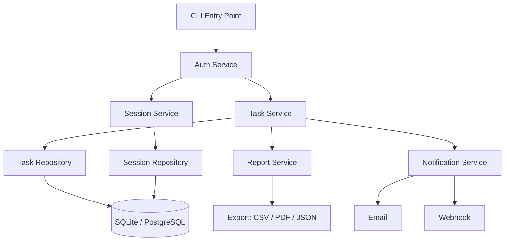

**Testing Plan:**
```
Unit Tests:
  - TaskService.create() — validation, ID generation
  - SessionService.start/stop() — timer logic
  - ReportService.generate() — aggregation accuracy

Integration Tests:
  - TaskRepository CRUD with real SQLite
  - Full create-update-complete-report flow

Mock Tests:
  - Email notifications mocked
  - External webhook mocked
  - Datetime mocked for timer tests

Coverage Target: 90%
```

**CI/CD Design:**
```
PR → lint → typecheck → unit-tests
Main → full-tests → coverage-check → security-scan → build → staging-deploy
Tag → production-deploy + GitHub Release
```

**Scaling Plan:**
- Phase 1: SQLite, single user
- Phase 2: PostgreSQL, multi-user, REST API
- Phase 3: Team features, real-time dashboard, billing

---

## 2. Workflow Automation Engine

**Architecture:**
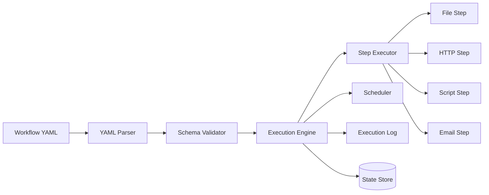

---

## 3. Dataset Processing Framework

**Architecture:**
```
Source → Reader → Validator → Transformer Pipeline → Writer → Sink
```
**Testing Focus:** Pipeline composition tests, transformation correctness, schema validation.

---

## 4. CRM Core Backend

**Architecture:**
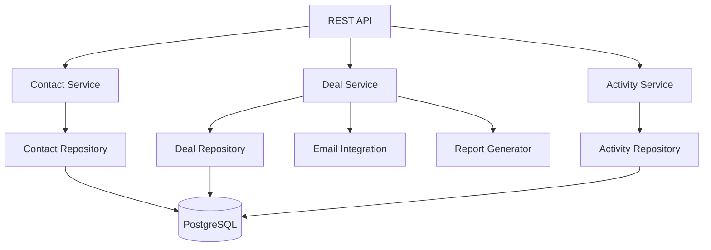

---

## 5. AI Dataset Manager

**Architecture:**
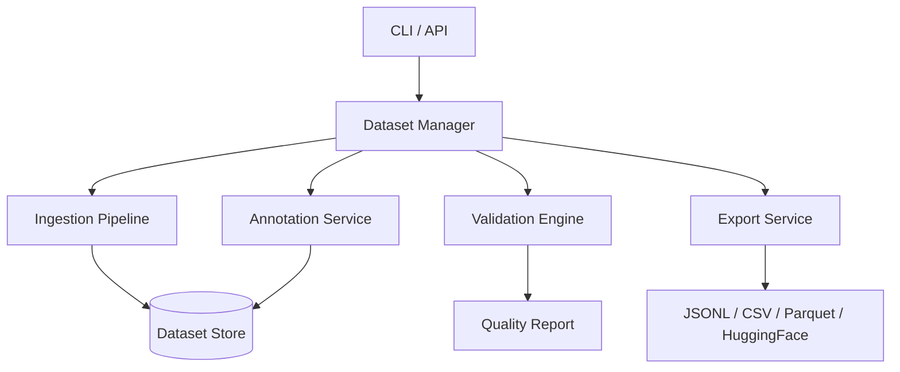

---

# SECTION 26 — DAY 14 REVISION

## 26.1 One-Page Summary

```
╔══════════════════════════════════════════════════════════════════╗
║              DAY 14 — PROFESSIONAL PYTHON DEVELOPMENT            ║
╠══════════════════════════════════════════════════════════════════╣
║ TESTING PYRAMID: Unit (fast/many) → Integration → E2E (slow/few) ║
║                                                                  ║
║ UNITTEST                      PYTEST                             ║
║ import unittest               import pytest                      ║
║ class Test(TestCase):         def test_func():                   ║
║   def test_x(self):             assert result == expected        ║
║     self.assertEqual(...)                                        ║
║                               @pytest.fixture                    ║
║ setUp / tearDown              yield / teardown after yield       ║
║ setUpClass / tearDownClass    scope: function/class/module/session║
║ assertRaises(Exc)             pytest.raises(Exc)                 ║
║ subTest(...)                  @pytest.mark.parametrize           ║
╠══════════════════════════════════════════════════════════════════╣
║ MOCKING: patch target WHERE IT IS USED, not where defined        ║
║ Mock — basic | MagicMock — with magic methods | AsyncMock — async║
║ mock.return_value | mock.side_effect | mock.assert_called_once() ║
╠══════════════════════════════════════════════════════════════════╣
║ CODE QUALITY STACK                                               ║
║ black/ruff → format | flake8/ruff → lint | mypy → types          ║
║ isort → imports | bandit → security | pre-commit → automate      ║
╠══════════════════════════════════════════════════════════════════╣
║ COVERAGE: pytest --cov=src --cov-fail-under=80                   ║
║ TDD: 🔴 Red → 🟢 Green → 🔵 Refactor                              ║
╠══════════════════════════════════════════════════════════════════╣
║ CI/CD: push → lint → test → coverage → security → build → deploy ║
║ GitHub Actions: .github/workflows/ci.yml                         ║
╠══════════════════════════════════════════════════════════════════╣
║ REPO STRUCTURE: src/ tests/ docs/ .github/ pyproject.toml        ║
║ conftest.py = shared fixtures | pytest.ini_options in toml       ║
╚══════════════════════════════════════════════════════════════════╝
```

## 26.2 pytest Cheat Sheet

```python
# ─── RUNNING ─────────────────────────────────────────────────────
pytest                          # All tests
pytest -v                       # Verbose
pytest -k "user"                # Match name
pytest -m "smoke"               # By marker
pytest -x                       # Stop at first failure
pytest --lf                     # Last failed
pytest --co                     # Collect only (no run)
pytest --durations=10           # Slowest 10 tests

# ─── COVERAGE ────────────────────────────────────────────────────
pytest --cov=src
pytest --cov=src --cov-report=html
pytest --cov=src --cov-fail-under=80

# ─── FIXTURES ────────────────────────────────────────────────────
@pytest.fixture                 # function scope (default)
@pytest.fixture(scope="module")
@pytest.fixture(scope="session")
@pytest.fixture(autouse=True)

# ─── MARKS ───────────────────────────────────────────────────────
@pytest.mark.skip("reason")
@pytest.mark.skipif(condition, reason="reason")
@pytest.mark.xfail
@pytest.mark.slow
@pytest.mark.parametrize("a,b", [(1,2),(3,4)])

# ─── ASSERTIONS ──────────────────────────────────────────────────
assert x == y
assert x != y
assert x > y
assert x in collection
assert x is None
assert x is not None
with pytest.raises(ValueError): ...
with pytest.raises(ValueError, match="pattern"): ...
assert value == pytest.approx(3.14, rel=1e-3)
```

## 26.3 Mocking Cheat Sheet

```python
from unittest.mock import Mock, MagicMock, patch, AsyncMock, mock_open

# ─── BASIC MOCK ──────────────────────────────────────────────────
m = Mock()
m.return_value = 42
m.side_effect = [1, 2, ValueError("fail")]

# ─── PATCH ───────────────────────────────────────────────────────
with patch("module.function") as mock_fn:
    mock_fn.return_value = "mocked"
    result = code_under_test()

@patch("module.Class")
def test_something(mock_class):
    mock_class.return_value.method.return_value = "value"

# ─── PYTEST-MOCK ─────────────────────────────────────────────────
def test_with_mocker(mocker):
    mock = mocker.patch("module.function")
    mock.return_value = "mocked"

# ─── ASSERTIONS ──────────────────────────────────────────────────
mock.assert_called()
mock.assert_called_once()
mock.assert_called_with(arg1, key=val)
mock.assert_called_once_with(arg1, key=val)
mock.assert_not_called()
assert mock.call_count == 3

# ─── PROPERTY MOCK ───────────────────────────────────────────────
with patch.object(MyClass, "my_property", new_callable=PropertyMock) as mp:
    mp.return_value = 42

# ─── FILE MOCK ───────────────────────────────────────────────────
with patch("builtins.open", mock_open(read_data="content")):
    result = read_file("path.txt")

# ─── ASYNC MOCK ──────────────────────────────────────────────────
async_mock = AsyncMock(return_value="async result")
```

## 26.4 CI/CD Cheat Sheet

```yaml
# Minimal CI
name: CI
on: [push, pull_request]
jobs:
  test:
    runs-on: ubuntu-latest
    steps:
      - uses: actions/checkout@v4
      - uses: actions/setup-python@v5
        with: { python-version: "3.12" }
      - run: pip install -r requirements.txt -r requirements-dev.txt
      - run: ruff check .
      - run: mypy src/
      - run: pytest --cov=src --cov-fail-under=80

# Matrix build
strategy:
  matrix:
    python-version: ["3.10", "3.11", "3.12"]
    os: [ubuntu-latest, windows-latest]

# Secrets
${{ secrets.MY_SECRET }}

# Conditional
if: github.ref == 'refs/heads/main'

# Needs (dependency)
needs: [test, security]
```

## 26.5 Common Mistakes & Solutions

| Mistake | Problem | Solution |
|---------|---------|---------|
| Patching wrong target | `@patch("requests.get")` | Patch where used: `@patch("mymodule.requests.get")` |
| Not using `pytest.approx` | `assert 0.1 + 0.2 == 0.3` fails | `assert 0.1 + 0.2 == pytest.approx(0.3)` |
| Testing implementation not behavior | Test checks internal state | Test checks public output/behavior |
| Shared state between tests | Tests pass alone, fail together | Use fixtures with fresh state |
| 100% coverage = bug free | Coverage doesn't measure quality | Add mutation testing + property tests |
| Not mocking `datetime.now()` | Time-dependent flaky tests | Use `freezegun` |
| Fixture scope too narrow | Slow tests (DB reconnects each test) | Use `scope="module"` for expensive fixtures |
| Missing teardown | Tests leave temp files/data | Use `yield` fixtures with cleanup |

---

# SECTION 27 — PREPARATION FOR NEXT STAGE

## 27.1 Python Developer Roadmap: Days 15–30

```mermaid
flowchart TD
    D14[Day 14 ✅\nTesting + CI/CD\nCode Quality] --> D15
    D15[Day 15\nDSA Foundations\nArrays, Linked Lists,\nStacks, Queues] --> D16
    D16[Day 16\nDSA Advanced\nTrees, Graphs,\nHeaps, Tries] --> D17
    D17[Day 17\nDSA Algorithms\nSorting, Searching,\nDP, Greedy] --> D18
    D18[Day 18\nDatabases + SQL\nPostgreSQL, SQLite,\nJOINs, Indexes] --> D19
    D19[Day 19\nORM + SQLAlchemy\nModels, Sessions,\nMigrations] --> D20
    D20[Day 20\nData Science Stack\nNumPy + Pandas\nData Analysis] --> D21
    D21[Day 21\nVisualization\nMatplotlib + Seaborn\nPlotly] --> D22
    D22[Day 22\nBackend Development\nFastAPI + REST APIs\nAuthentication] --> D23
    D23[Day 23\nBackend Advanced\nAsync, WebSockets,\nCaching, Queues] --> D24
    D24[Day 24\nML Foundations\nScikit-learn\nModel Lifecycle] --> D25
    D25[Day 25\nNLP Foundations\nText Processing\nTokenization] --> D26
    D26[Day 26\nDeep Learning\nTensorFlow / PyTorch\nNeural Networks] --> D27
    D27[Day 27\nTransformers\nHugging Face\nFine-tuning] --> D28
    D28[Day 28\nLLM Engineering\nLangChain, RAG\nAgents] --> D29
    D29[Day 29\nMLOps + Deployment\nDocker, FastAPI,\nModel Serving] --> D30
    D30[Day 30 🏆\nCapstone Project\nFull-Stack AI App\nDeployment + CI/CD]
    style D14 fill:#2ecc71,color:#fff
    style D30 fill:#e74c3c,color:#fff
```

## 27.2 Day 15 Preview — DSA Foundations

You will learn:
- **Arrays & Slicing** — memory layout, time complexity
- **Linked Lists** — singly, doubly, circular
- **Stacks** — LIFO, implementation, applications
- **Queues** — FIFO, deque, priority queue
- **Big O Notation** — O(1), O(n), O(n²), O(log n)
- **Problem Solving Patterns** — two pointers, sliding window, fast/slow

## 27.3 Technology Roadmap for Days 18–30

| Day | Technology | Libraries |
|-----|-----------|-----------|
| 18 | SQL + PostgreSQL | `psycopg2`, `sqlite3` |
| 19 | ORM | `SQLAlchemy 2.0`, `alembic` |
| 20 | Data Analysis | `numpy`, `pandas` |
| 21 | Visualization | `matplotlib`, `seaborn`, `plotly` |
| 22 | Backend | `FastAPI`, `pydantic`, `httpx` |
| 23 | Async Backend | `asyncio`, `redis`, `celery` |
| 24 | ML | `scikit-learn`, `joblib` |
| 25 | NLP | `nltk`, `spacy`, `transformers` |
| 26 | Deep Learning | `pytorch`, `tensorflow` |
| 27 | Transformers | `huggingface`, `datasets` |
| 28 | LLM | `langchain`, `openai`, `anthropic` |
| 29 | MLOps | `docker`, `mlflow`, `fastapi` |
| 30 | Capstone | Full AI Application |

## 27.4 What You Have Mastered — Day 14 Completion Badge

```
╔═══════════════════════════════════════════════════════╗
║         🎓 DAY 14 COMPLETION CERTIFICATE              ║
║                                                       ║
║  NIELIT Gorakhpur — Python Zero to Hero               ║
║                                                       ║
║  ✅ Unit Testing (unittest + pytest)                  ║
║  ✅ Mocking & Patching                                ║
║  ✅ Code Coverage (pytest-cov)                        ║
║  ✅ Test-Driven Development                           ║
║  ✅ Code Quality (ruff, mypy, black)                  ║
║  ✅ CI/CD (GitHub Actions)                            ║
║  ✅ Professional Repository Structure                 ║
║  ✅ Documentation Standards                           ║
║  ✅ Production Debugging                              ║
║  ✅ Portfolio-Ready Projects                          ║
║                                                       ║
║  Status: PROFESSIONAL PYTHON DEVELOPER READY 🚀       ║
╚═══════════════════════════════════════════════════════╝
```

---

> **Day 14 Complete!** You have made the critical transition from *Python Learner* to *Python Professional Developer*. The practices taught today — testing, CI/CD, code quality, and professional repository structure — are what separate junior programmers from senior engineers. Apply these to every project going forward.
>
> **Next up → Day 15: Data Structures & Algorithms Foundations**

---
