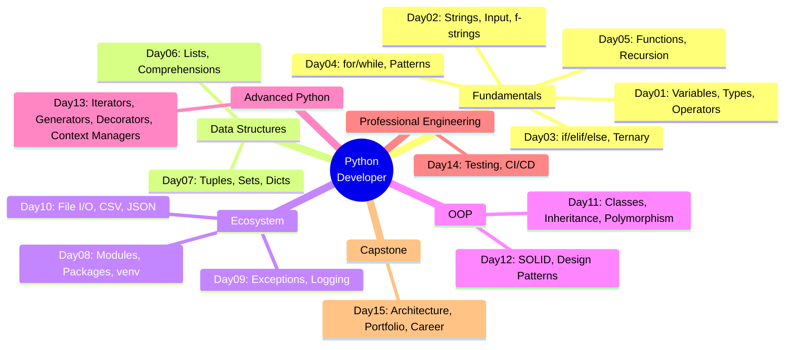
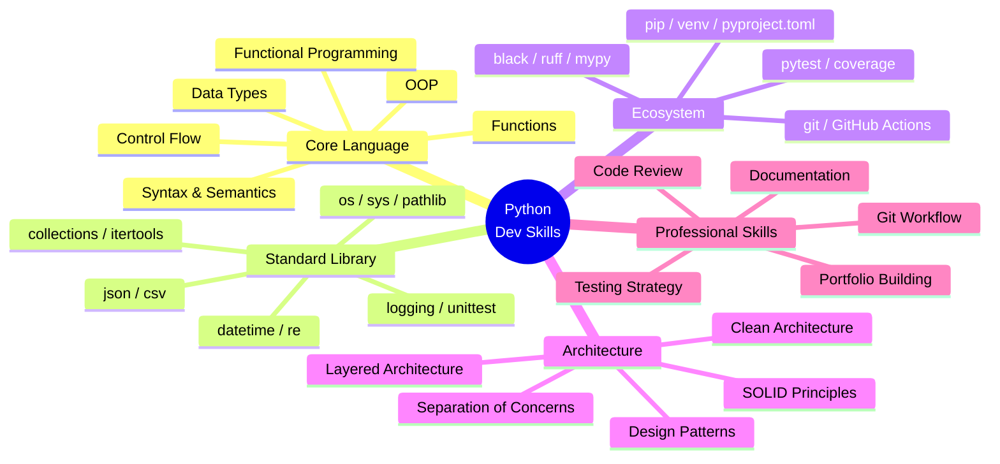
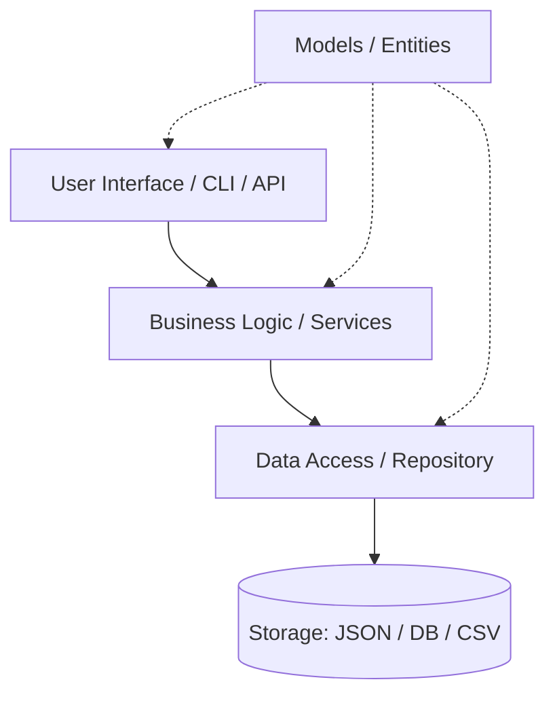
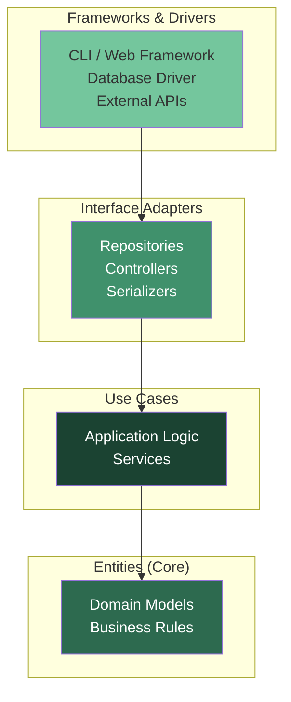
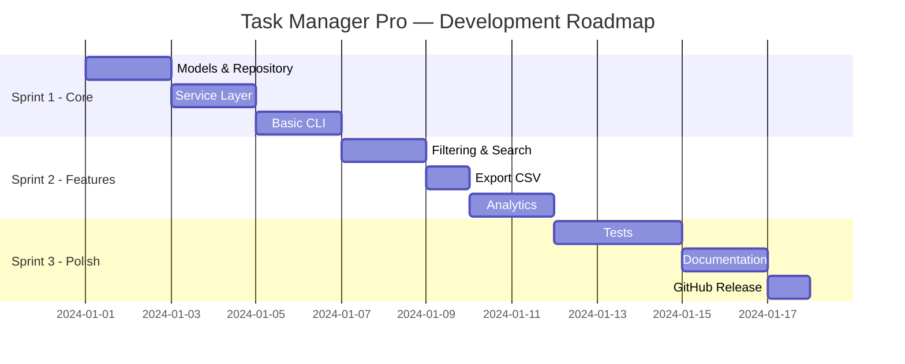
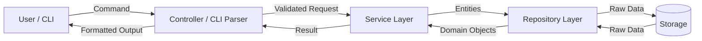
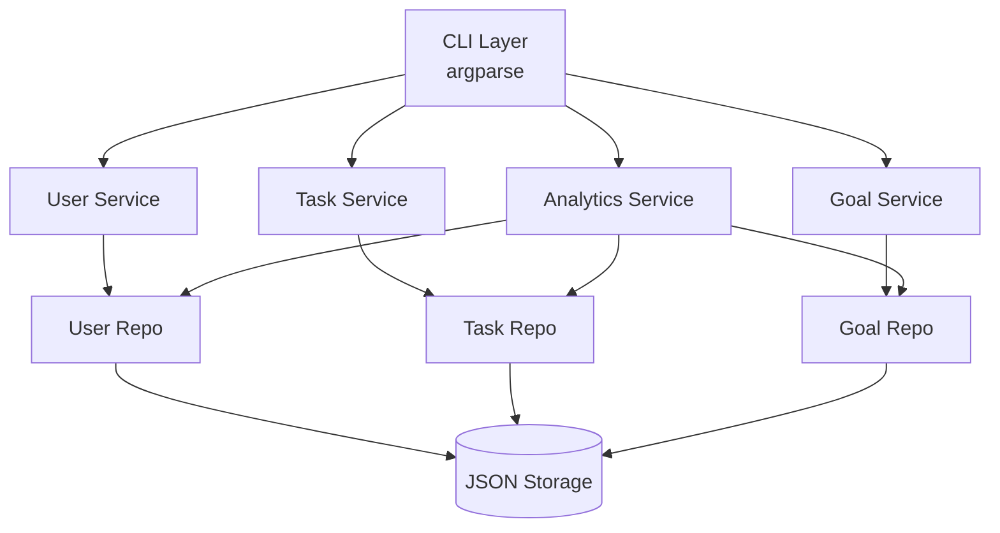
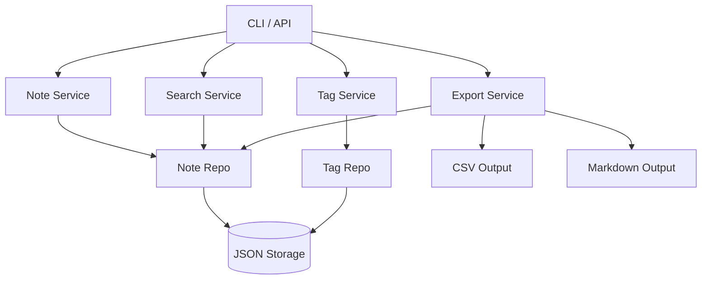
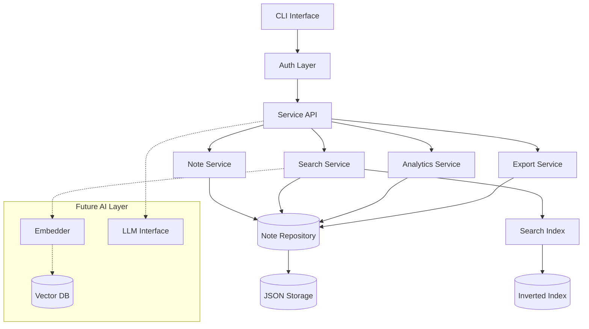
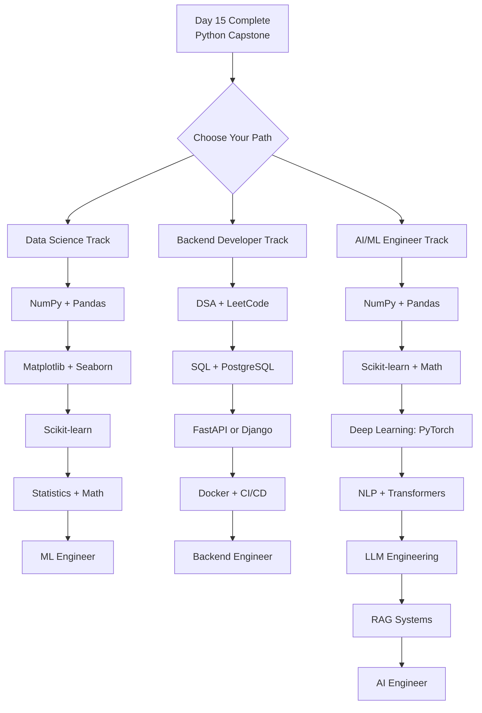

# 🐍 Day 15 — Python Developer Capstone
## Complete Python Mastery | Software Architecture | Portfolio Engineering | Career Launch


---

## 📋 Table of Contents

| Section | Topic |
|---------|-------|
| 01 | Complete Python Developer Revision (Day01–Day14) |
| 02 | Software Architecture Fundamentals |
| 03 | Professional Project Design |
| 04 | Enterprise Folder Structures |
| 05 | System Design Thinking |
| 06 | Professional Documentation |
| 07 | Python Developer Best Practices |
| 08 | Capstone Mini Projects (10) |
| 09 | High-Value Portfolio Projects (15) |
| 10 | Elite GitHub Profile Booster Projects (10) |
| 11 | Project Layout Masterclass |
| 12 | Complete Project Solution Framework |
| 13 | 1000 Practice Questions |
| 14 | 500 Interview Questions |
| 15 | Assignments + Solutions |
| 16 | Enterprise Challenge Projects |
| 17 | Day15 Revision + Cheat Sheets |
| 18 | Next Stage Roadmap |

---

## 🎯 Learning Objectives

By the end of Day15, you will be able to:

- ✅ Design complete software systems from scratch
- ✅ Create professional, recruiter-ready GitHub repositories
- ✅ Architect medium-scale applications with proper layering
- ✅ Apply OOP + Design Patterns + Testing in real projects
- ✅ Write enterprise-grade documentation
- ✅ Think and work like a Python Developer
- ✅ Prepare for internships and junior developer roles
- ✅ Build foundations for AI/ML Engineering transition

---

# SECTION 01 — COMPLETE PYTHON DEVELOPER REVISION (Day01–Day14)

## 1.1 The Complete Python Journey



---

## 1.2 Day01–Day14 Quick Summary

### Day 01 — Python Fundamentals
```python
# Variables and Data Types
name = "Alice"           # str
age = 25                 # int
gpa = 3.9                # float
is_enrolled = True       # bool

# Operators
result = 10 + 3          # 13
result = 10 // 3         # 3  (floor division)
result = 10 % 3          # 1  (modulo)
result = 2 ** 8          # 256 (power)

# Type Conversion
score = int("95")
text = str(100)
pi = float("3.14")
```

### Day 02 — Strings + Input
```python
# String Methods
name = "  python developer  "
print(name.strip().title())    # Python Developer
print(name.upper())
print(name.replace("  ", "_"))

# f-strings
role = "Engineer"
years = 5
print(f"I am a {role} with {years} years of experience.")

# Multi-line
bio = """
Name: Alice
Role: Python Developer
"""
```

### Day 03 — Conditional Statements
```python
# if/elif/else
score = 85
if score >= 90:
    grade = "A"
elif score >= 80:
    grade = "B"
elif score >= 70:
    grade = "C"
else:
    grade = "F"

# Ternary
status = "Pass" if score >= 60 else "Fail"

# match-case (Python 3.10+)
match grade:
    case "A": print("Excellent")
    case "B": print("Good")
    case _:   print("Keep going")
```

### Day 04 — Loops + Patterns
```python
# for loop
for i in range(1, 6):
    print("*" * i)

# while loop
count = 0
while count < 5:
    count += 1

# List Comprehension (preview)
squares = [x**2 for x in range(10)]

# enumerate and zip
for idx, val in enumerate(["a","b","c"]):
    print(idx, val)

for a, b in zip([1,2,3], ["x","y","z"]):
    print(a, b)
```

### Day 05 — Functions + Recursion
```python
# Function basics
def greet(name: str, greeting: str = "Hello") -> str:
    return f"{greeting}, {name}!"

# *args and **kwargs
def summarize(*args, **kwargs):
    print(f"Args: {args}")
    print(f"Kwargs: {kwargs}")

# Recursion
def factorial(n: int) -> int:
    if n <= 1:
        return 1
    return n * factorial(n - 1)

# Lambda
square = lambda x: x ** 2
```

### Day 06 — Lists
```python
# List operations
items = [3, 1, 4, 1, 5, 9, 2, 6]
items.sort()
items.append(7)
items.remove(1)

# Slicing
first_three = items[:3]
reversed_list = items[::-1]

# Comprehensions
evens = [x for x in items if x % 2 == 0]
matrix = [[i*j for j in range(5)] for i in range(5)]
```

### Day 07 — Tuples + Sets + Dictionaries
```python
# Tuple (immutable)
point = (10, 20)
x, y = point  # unpacking

# Set (unique, unordered)
unique_tags = {"python", "dev", "python"}  # {"python", "dev"}
set_a | set_b  # union
set_a & set_b  # intersection

# Dictionary
student = {"name": "Alice", "gpa": 3.9}
student["major"] = "CS"
student.get("age", "Unknown")
{k: v for k, v in student.items() if v}  # dict comprehension
```

### Day 08 — Modules + Packages + Virtual Environments
```bash
# Virtual environment
python -m venv .venv
source .venv/bin/activate    # Linux/Mac
.venv\Scripts\activate       # Windows

# Install packages
pip install requests pandas
pip freeze > requirements.txt
pip install -r requirements.txt
```

```python
# Importing
import os
from pathlib import Path
from typing import Optional, List, Dict

# __init__.py makes a folder a package
# __all__ controls what gets exported
```

### Day 09 — Exception Handling + Logging
```python
import logging

logging.basicConfig(level=logging.INFO)
logger = logging.getLogger(__name__)

# Exception handling
try:
    result = 10 / 0
except ZeroDivisionError as e:
    logger.error(f"Division error: {e}")
except (TypeError, ValueError) as e:
    logger.warning(f"Type/Value error: {e}")
else:
    logger.info("Success")
finally:
    logger.info("Cleanup")

# Custom exceptions
class AppError(Exception):
    def __init__(self, message: str, code: int = 400):
        self.message = message
        self.code = code
        super().__init__(message)
```

### Day 10 — File Handling + CSV + JSON
```python
import json
import csv
from pathlib import Path

# File handling
path = Path("data/notes.txt")
path.parent.mkdir(parents=True, exist_ok=True)
path.write_text("Hello, World!")
content = path.read_text()

# JSON
data = {"name": "Alice", "scores": [90, 85, 92]}
json_str = json.dumps(data, indent=2)
loaded = json.loads(json_str)

# CSV
with open("students.csv", "w", newline="") as f:
    writer = csv.DictWriter(f, fieldnames=["name","grade"])
    writer.writeheader()
    writer.writerow({"name": "Alice", "grade": "A"})
```

### Day 11 — OOP Foundations
```python
from dataclasses import dataclass, field
from typing import List
from datetime import datetime

@dataclass
class Student:
    name: str
    student_id: str
    scores: List[float] = field(default_factory=list)
    enrolled_at: datetime = field(default_factory=datetime.now)

    @property
    def average(self) -> float:
        return sum(self.scores) / len(self.scores) if self.scores else 0.0

    def add_score(self, score: float) -> None:
        self.scores.append(score)

    def __repr__(self) -> str:
        return f"Student(name={self.name}, avg={self.average:.1f})"

# Inheritance
class GraduateStudent(Student):
    def __init__(self, name, student_id, thesis_topic: str):
        super().__init__(name, student_id)
        self.thesis_topic = thesis_topic
```

### Day 12 — Advanced OOP + SOLID + Design Patterns
```python
from abc import ABC, abstractmethod

# SOLID — Single Responsibility
class DataValidator:
    """Only validates. Does not save."""
    def validate(self, data: dict) -> bool:
        return bool(data.get("name"))

class DataRepository:
    """Only saves. Does not validate."""
    def save(self, data: dict) -> None:
        pass

# SOLID — Open/Closed
class Discount(ABC):
    @abstractmethod
    def apply(self, price: float) -> float: ...

class PercentDiscount(Discount):
    def __init__(self, percent: float): self.percent = percent
    def apply(self, price: float) -> float:
        return price * (1 - self.percent / 100)

# Factory Pattern
class StorageFactory:
    @staticmethod
    def create(storage_type: str):
        if storage_type == "json":
            return JSONStorage()
        elif storage_type == "csv":
            return CSVStorage()
        raise ValueError(f"Unknown storage: {storage_type}")

# Singleton Pattern
class AppConfig:
    _instance = None
    def __new__(cls):
        if cls._instance is None:
            cls._instance = super().__new__(cls)
        return cls._instance
```

### Day 13 — Iterators + Generators + Decorators + Context Managers
```python
import functools
import time
from contextlib import contextmanager
from typing import Generator, Iterator

# Generator
def fibonacci() -> Generator[int, None, None]:
    a, b = 0, 1
    while True:
        yield a
        a, b = b, a + b

# Decorator
def timer(func):
    @functools.wraps(func)
    def wrapper(*args, **kwargs):
        start = time.perf_counter()
        result = func(*args, **kwargs)
        elapsed = time.perf_counter() - start
        print(f"{func.__name__} took {elapsed:.4f}s")
        return result
    return wrapper

def retry(max_attempts: int = 3):
    def decorator(func):
        @functools.wraps(func)
        def wrapper(*args, **kwargs):
            for attempt in range(max_attempts):
                try:
                    return func(*args, **kwargs)
                except Exception as e:
                    if attempt == max_attempts - 1:
                        raise
        return wrapper
    return decorator

# Context Manager
@contextmanager
def managed_resource(name: str):
    print(f"Acquiring: {name}")
    try:
        yield name
    finally:
        print(f"Releasing: {name}")
```

### Day 14 — Testing + CI/CD
```python
import pytest
from unittest.mock import Mock, patch

# Unit Test
class TestStudent:
    def test_average_empty(self):
        s = Student("Alice", "S001")
        assert s.average == 0.0

    def test_average_with_scores(self):
        s = Student("Bob", "S002")
        s.add_score(90)
        s.add_score(80)
        assert s.average == 85.0

    def test_repr(self):
        s = Student("Carol", "S003")
        assert "Carol" in repr(s)

# Fixture
@pytest.fixture
def sample_student():
    s = Student("Test", "T001")
    s.add_score(95)
    return s

# Parametrize
@pytest.mark.parametrize("score,expected", [
    (95, "A"), (85, "B"), (75, "C"), (55, "F")
])
def test_grade_calculation(score, expected):
    assert calculate_grade(score) == expected
```

---

## 1.3 Python Developer Mind Map



---

## 1.4 OOP Cheat Sheet

| Concept | Description | Example |
|---------|-------------|---------|
| Class | Blueprint for objects | `class Dog:` |
| Object | Instance of a class | `dog = Dog("Rex")` |
| `__init__` | Constructor | `def __init__(self, name):` |
| Inheritance | Child extends Parent | `class Poodle(Dog):` |
| Polymorphism | Same interface, different behaviour | Override `speak()` |
| Encapsulation | Hide internals | `self._private` |
| Abstraction | Abstract base classes | `from abc import ABC` |
| Composition | Has-a relationship | `self.engine = Engine()` |
| `@property` | Getter/setter | `@property def name(self):` |
| `@classmethod` | Class-level method | `@classmethod def from_dict(cls, d):` |
| `@staticmethod` | Utility method | `@staticmethod def validate(x):` |
| `@dataclass` | Auto-generate boilerplate | `@dataclass class Point:` |

---

## 1.5 Design Patterns Cheat Sheet

| Pattern | Category | Use When |
|---------|----------|----------|
| Singleton | Creational | Only one instance needed (config, logger) |
| Factory | Creational | Create objects without specifying class |
| Builder | Creational | Complex object step-by-step construction |
| Observer | Behavioral | Event-driven, pub-sub systems |
| Strategy | Behavioral | Swap algorithms at runtime |
| Command | Behavioral | Undo/redo, queuing operations |
| Decorator | Structural | Add behavior without modifying class |
| Adapter | Structural | Incompatible interfaces compatibility |
| Repository | Architectural | Abstract data storage layer |
| Template Method | Behavioral | Define algorithm skeleton |

---

## 1.6 Testing Cheat Sheet

```
pytest                    # Run all tests
pytest -v                 # Verbose
pytest -k "test_user"     # Filter by name
pytest --cov=src          # Coverage
pytest -x                 # Stop on first failure
pytest --tb=short         # Short traceback
```

| Concept | Usage |
|---------|-------|
| `assert` | Basic assertion |
| `pytest.raises` | Expect exception |
| `@pytest.fixture` | Reusable test data |
| `@pytest.mark.parametrize` | Multiple test cases |
| `Mock()` | Replace dependencies |
| `patch()` | Temporarily replace objects |
| `monkeypatch` | Modify env/functions |

---

# SECTION 02 — SOFTWARE ARCHITECTURE FUNDAMENTALS

## 2.1 What is Software Architecture?

**Definition:** Software architecture is the high-level structure of a software system, defining how components are organized, interact, and evolve over time. It is the set of decisions that are hardest to change later.

**Why It Matters:**
- Poor architecture → technical debt, refactoring nightmares
- Good architecture → scalable, maintainable, testable systems
- Architecture decisions affect every developer on the team

## 2.2 Core Architectural Qualities

| Quality | Description | Measurement |
|---------|-------------|-------------|
| Scalability | Handle growing load | Requests/sec, users |
| Maintainability | Ease of modification | Time to add feature |
| Reliability | Stays available | Uptime %, MTTR |
| Testability | Ease of testing | Test coverage % |
| Modularity | Independent components | Coupling score |
| Performance | Speed of execution | Latency, throughput |
| Security | Protection from threats | Vulnerability count |

## 2.3 Separation of Concerns



**Rule:** Each layer should only know about the layer directly below it.

## 2.4 Layered Architecture

```
┌─────────────────────────────────────┐
│         Presentation Layer          │  ← CLI, Web UI, API endpoints
├─────────────────────────────────────┤
│          Business Logic Layer        │  ← Services, Use Cases, Rules
├─────────────────────────────────────┤
│          Data Access Layer           │  ← Repositories, DAOs
├─────────────────────────────────────┤
│           Storage Layer              │  ← Files, Databases, Cache
└─────────────────────────────────────┘
```

**Benefits:**
- Clear boundaries between responsibilities
- Swap layers independently (e.g., change storage from CSV to SQLite)
- Easier to test each layer in isolation

## 2.5 Clean Architecture



**Dependency Rule:** Dependencies point inward. Inner layers know nothing about outer layers.

## 2.6 Hexagonal Architecture (Ports & Adapters)

```
        ┌─────────────────────────────┐
        │         CLI Adapter         │
        └────────────┬────────────────┘
                     │ Port (interface)
        ┌────────────▼────────────────┐
        │                             │
        │      Application Core       │
        │   (Business Logic + Models) │
        │                             │
        └────────────┬────────────────┘
                     │ Port (interface)
        ┌────────────▼────────────────┐
        │      Storage Adapter        │
        │   (JSON / SQLite / CSV)     │
        └─────────────────────────────┘
```

**Idea:** The core application has no knowledge of how it's called or where it stores data. Adapters plug in from outside.

## 2.7 Architecture Decision Records (ADR)

Every significant architecture decision should be documented:

```markdown
# ADR-001: Use JSON for Local Storage

## Status: Accepted

## Context
Need persistent storage for a CLI application with <10,000 records.

## Decision
Use JSON files via Python's built-in json module.

## Consequences
+ No external dependencies
+ Human-readable data
− Not suitable for concurrent access
− Slower than a database at scale
```

---

# SECTION 03 — PROFESSIONAL PROJECT DESIGN

## 3.1 Requirements Gathering

Before writing a single line of code, understand what you are building.

### Functional Requirements
What the system **does**:
- Users can create tasks
- Tasks have title, description, priority, due date
- Users can mark tasks as complete
- Users can filter tasks by status or priority

### Non-Functional Requirements
How the system **behaves**:
- Response time < 200ms for CLI commands
- Data persisted across sessions
- Graceful error messages
- Testable with >80% coverage

## 3.2 User Stories

Format: **As a [role], I want to [action], so that [benefit].**

```
USER STORIES — Task Manager Pro
================================
US-001: As a user, I want to add a task with a title and deadline,
        so that I can track my work.

US-002: As a user, I want to list all pending tasks,
        so that I know what needs to be done today.

US-003: As a user, I want to mark a task as complete,
        so that I can track my progress.

US-004: As a user, I want to filter tasks by priority,
        so that I can focus on what matters most.

US-005: As a user, I want to export tasks to CSV,
        so that I can share my task list with others.
```

## 3.3 Feature Planning (MoSCoW Method)

| Priority | Description | Features |
|----------|-------------|----------|
| **Must Have** | Core, non-negotiable | Add task, list tasks, complete task |
| **Should Have** | Important, not critical | Filter, search, export |
| **Could Have** | Nice to have | Analytics, reminders |
| **Won't Have** | Out of scope for now | Mobile app, cloud sync |

## 3.4 Technical Design Document (TDD)

```markdown
# Technical Design: Task Manager Pro

## Overview
A CLI-based task management application built in Python 3.11+.

## Tech Stack
- Language: Python 3.11
- Storage: JSON (upgradeable to SQLite)
- Testing: pytest + coverage
- CLI: argparse (upgradeable to click/typer)

## Core Modules
1. models.py       — Task entity
2. repository.py   — Data persistence
3. services.py     — Business logic
4. cli.py          — User interface
5. config.py       — Configuration

## Data Model
Task {
  id: str (UUID)
  title: str
  description: str
  priority: Literal["low","medium","high"]
  status: Literal["pending","in_progress","done"]
  created_at: datetime
  due_date: Optional[datetime]
}

## Storage
- tasks.json in ~/.task_manager/
- Backup on every write

## Error Handling
- Custom exceptions: TaskNotFoundError, ValidationError
- All errors logged to ~/.task_manager/app.log
```

## 3.5 Development Roadmap



---

# SECTION 04 — ENTERPRISE FOLDER STRUCTURES

## 4.1 CLI Application

```
task-manager-pro/
│
├── src/
│   └── task_manager/
│       ├── __init__.py
│       ├── models.py          # Domain entities
│       ├── repository.py      # Data persistence
│       ├── services.py        # Business logic
│       ├── cli.py             # Command-line interface
│       ├── config.py          # Configuration
│       ├── exceptions.py      # Custom exceptions
│       └── utils.py           # Shared utilities
│
├── tests/
│   ├── __init__.py
│   ├── conftest.py            # Shared fixtures
│   ├── unit/
│   │   ├── test_models.py
│   │   ├── test_services.py
│   │   └── test_repository.py
│   └── integration/
│       └── test_cli.py
│
├── docs/
│   ├── architecture.md
│   ├── user-guide.md
│   └── api-reference.md
│
├── data/                      # Sample data, seeds
├── scripts/
│   ├── install.sh
│   └── release.sh
│
├── .github/
│   └── workflows/
│       ├── tests.yml
│       └── release.yml
│
├── README.md
├── CHANGELOG.md
├── CONTRIBUTING.md
├── LICENSE
├── pyproject.toml
├── requirements.txt
├── requirements-dev.txt
└── .gitignore
```

## 4.2 Backend / API Application

```
backend-api/
│
├── src/
│   └── app/
│       ├── __init__.py
│       ├── main.py            # App entry point
│       ├── config.py          # Settings (env-based)
│       │
│       ├── api/               # Route handlers
│       │   ├── v1/
│       │   │   ├── tasks.py
│       │   │   └── users.py
│       │   └── dependencies.py
│       │
│       ├── core/              # Core business logic
│       │   ├── models.py
│       │   ├── schemas.py
│       │   └── exceptions.py
│       │
│       ├── services/          # Use cases
│       │   ├── task_service.py
│       │   └── user_service.py
│       │
│       ├── repositories/      # Data access
│       │   ├── base.py
│       │   ├── task_repo.py
│       │   └── user_repo.py
│       │
│       └── utils/
│           ├── logging.py
│           └── validators.py
│
├── tests/
├── migrations/
├── docs/
├── docker/
│   ├── Dockerfile
│   └── docker-compose.yml
├── .github/workflows/
├── README.md
├── pyproject.toml
└── .env.example
```

## 4.3 AI / ML Project

```
ai-research-assistant/
│
├── src/
│   └── research_assistant/
│       ├── __init__.py
│       ├── ingestion/         # Load and parse documents
│       │   ├── pdf_loader.py
│       │   └── web_scraper.py
│       ├── processing/        # Text processing
│       │   ├── chunker.py
│       │   └── embedder.py
│       ├── storage/           # Vector store / DB
│       │   ├── vector_store.py
│       │   └── metadata_store.py
│       ├── retrieval/         # Search and ranking
│       │   └── searcher.py
│       ├── generation/        # LLM interaction
│       │   └── generator.py
│       ├── pipeline/          # Orchestration
│       │   └── rag_pipeline.py
│       └── cli.py
│
├── notebooks/                 # Jupyter exploration
├── experiments/               # Experiment tracking
├── models/                    # Saved model weights
├── data/
│   ├── raw/
│   ├── processed/
│   └── embeddings/
├── tests/
├── docs/
├── configs/
│   └── settings.yaml
├── requirements.txt
└── README.md
```

## 4.4 Data Processing Project

```
data-pipeline/
│
├── src/
│   └── pipeline/
│       ├── extractors/        # Data ingestion
│       ├── transformers/      # Data transformation
│       ├── validators/        # Data quality checks
│       ├── loaders/           # Output destinations
│       ├── models/            # Data schemas
│       └── orchestrator.py   # Pipeline runner
│
├── data/
│   ├── raw/                   # Input data
│   ├── staging/               # Intermediate
│   ├── processed/             # Clean output
│   └── archive/               # Historical
│
├── reports/                   # Generated reports
├── logs/
├── configs/
├── tests/
└── README.md
```

## 4.5 Open Source Project

```
awesome-python-tool/
│
├── src/
│   └── awesome_tool/
│       ├── __init__.py        # Public API exports
│       ├── core.py
│       └── utils.py
│
├── tests/
├── docs/
│   ├── source/                # Sphinx docs source
│   ├── _build/                # Built HTML docs
│   └── conf.py
│
├── examples/                  # Usage examples
│   ├── basic_usage.py
│   └── advanced_usage.py
│
├── benchmarks/                # Performance tests
│
├── .github/
│   ├── workflows/
│   │   ├── tests.yml
│   │   ├── docs.yml
│   │   └── publish.yml        # PyPI publishing
│   ├── ISSUE_TEMPLATE/
│   │   ├── bug_report.md
│   │   └── feature_request.md
│   └── PULL_REQUEST_TEMPLATE.md
│
├── README.md
├── CHANGELOG.md
├── CONTRIBUTING.md
├── CODE_OF_CONDUCT.md
├── LICENSE
└── pyproject.toml             # Modern packaging
```

---

# SECTION 05 — SYSTEM DESIGN THINKING

## 5.1 Data Flow Diagram



## 5.2 Business Logic Layer

The service layer contains **all business rules**. It should be testable without any I/O.

```python
# services/task_service.py
from typing import List, Optional
from datetime import datetime
from ..models import Task, Priority, Status
from ..repository import TaskRepository
from ..exceptions import TaskNotFoundError, ValidationError

class TaskService:
    """Contains all business logic for task management."""

    def __init__(self, repository: TaskRepository):
        self._repo = repository

    def create_task(
        self,
        title: str,
        description: str = "",
        priority: str = "medium",
        due_date: Optional[str] = None
    ) -> Task:
        # Business rule: title cannot be empty
        if not title.strip():
            raise ValidationError("Task title cannot be empty")

        # Business rule: priority must be valid
        try:
            p = Priority(priority)
        except ValueError:
            raise ValidationError(f"Invalid priority: {priority}")

        task = Task(
            title=title.strip(),
            description=description,
            priority=p,
            due_date=datetime.fromisoformat(due_date) if due_date else None
        )
        return self._repo.save(task)

    def complete_task(self, task_id: str) -> Task:
        task = self._repo.get_by_id(task_id)
        if not task:
            raise TaskNotFoundError(f"Task {task_id} not found")

        # Business rule: cannot complete an already-completed task
        if task.status == Status.DONE:
            raise ValidationError("Task is already completed")

        task.status = Status.DONE
        task.completed_at = datetime.now()
        return self._repo.save(task)

    def get_overdue_tasks(self) -> List[Task]:
        now = datetime.now()
        all_tasks = self._repo.get_all()
        return [
            t for t in all_tasks
            if t.due_date and t.due_date < now and t.status != Status.DONE
        ]
```

## 5.3 Repository Pattern

```python
# repository/task_repository.py
from abc import ABC, abstractmethod
from typing import List, Optional
from ..models import Task

class AbstractTaskRepository(ABC):
    """Defines the contract for task storage."""

    @abstractmethod
    def save(self, task: Task) -> Task: ...

    @abstractmethod
    def get_by_id(self, task_id: str) -> Optional[Task]: ...

    @abstractmethod
    def get_all(self) -> List[Task]: ...

    @abstractmethod
    def delete(self, task_id: str) -> bool: ...


class JSONTaskRepository(AbstractTaskRepository):
    """Concrete implementation using JSON file storage."""

    def __init__(self, filepath: str):
        self._filepath = Path(filepath)
        self._filepath.parent.mkdir(parents=True, exist_ok=True)

    def save(self, task: Task) -> Task:
        tasks = self._load_all()
        tasks[task.id] = task.to_dict()
        self._write(tasks)
        return task

    def get_by_id(self, task_id: str) -> Optional[Task]:
        tasks = self._load_all()
        data = tasks.get(task_id)
        return Task.from_dict(data) if data else None

    def get_all(self) -> List[Task]:
        return [Task.from_dict(v) for v in self._load_all().values()]

    def delete(self, task_id: str) -> bool:
        tasks = self._load_all()
        if task_id not in tasks:
            return False
        del tasks[task_id]
        self._write(tasks)
        return True

    def _load_all(self) -> dict:
        if not self._filepath.exists():
            return {}
        return json.loads(self._filepath.read_text())

    def _write(self, data: dict) -> None:
        self._filepath.write_text(json.dumps(data, indent=2, default=str))
```

---

# SECTION 06 — PROFESSIONAL DOCUMENTATION

## 6.1 README.md Template

```markdown
# 🚀 Project Name

> One-line tagline that explains what this project does.

[](https://www.python.org)
[](./tests)
[](LICENSE)
[](./tests)

## 📋 Overview

A 2-3 paragraph description explaining:
- What problem this solves
- Who it's for
- Key capabilities

## ✨ Features

- ✅ Feature 1
- ✅ Feature 2
- ✅ Feature 3
- 🔄 Feature 4 (coming soon)

## 🚀 Quick Start

```bash
# Clone
git clone https://github.com/username/project-name
cd project-name

# Setup
python -m venv .venv
source .venv/bin/activate
pip install -r requirements.txt

# Run
python -m project_name --help
```

## 📖 Usage

```python
from project_name import MainClass

# Example
obj = MainClass()
result = obj.do_something()
print(result)
```

## 🏗️ Architecture

```
src/
├── core/        — Domain models
├── services/    — Business logic
├── repository/  — Data access
└── cli/         — User interface
```

## 🧪 Testing

```bash
pytest
pytest --cov=src --cov-report=html
```

## 🤝 Contributing

See [CONTRIBUTING.md](CONTRIBUTING.md).

## 📄 License

MIT — See [LICENSE](LICENSE).
```

## 6.2 CHANGELOG.md Template

```markdown
# Changelog

All notable changes to this project will be documented in this file.
Format based on [Keep a Changelog](https://keepachangelog.com/en/1.0.0/).

## [Unreleased]

## [1.1.0] - 2024-03-15
### Added
- Export tasks to CSV
- Filter by priority

### Changed
- Improved CLI output formatting

### Fixed
- Date parsing issue with ISO format strings

## [1.0.0] - 2024-02-01
### Added
- Initial release
- Create, list, complete tasks
- JSON persistence
- Basic CLI
```

## 6.3 CONTRIBUTING.md Template

```markdown
# Contributing to Project Name

Thank you for your interest in contributing! 🎉

## How to Contribute

### 1. Fork & Clone
```bash
git clone https://github.com/YOUR-USERNAME/project-name
```

### 2. Create a Branch
```bash
git checkout -b feature/your-feature-name
```

### 3. Make Changes + Add Tests
- Write tests for new functionality
- Ensure `pytest` passes
- Ensure `black .` passes (formatting)

### 4. Submit Pull Request
- Reference any related issues
- Describe what your change does
- Attach screenshots if UI changes

## Code Standards

- Python 3.11+
- Black formatting
- Type hints required
- Docstrings on all public functions

## Issue Reporting

Use the GitHub issue templates provided.
```

---

# SECTION 07 — PYTHON DEVELOPER BEST PRACTICES

## 7.1 Code Organization Principles

```python
# ✅ Good: Each file has ONE clear responsibility
# models.py       → data structures only
# services.py     → business logic only
# repository.py   → persistence only
# cli.py          → user interface only

# ❌ Bad: Everything in one file
# main.py         → models + logic + persistence + UI (600 lines)
```

## 7.2 Type Hints (Non-Negotiable in 2024)

```python
from typing import Optional, List, Dict, Tuple
from pathlib import Path

# ✅ Typed function
def process_file(
    filepath: Path,
    encoding: str = "utf-8",
    max_lines: Optional[int] = None
) -> List[str]:
    """
    Process a text file and return its lines.

    Args:
        filepath: Path to the input file.
        encoding: File encoding (default: utf-8).
        max_lines: Maximum lines to read, or None for all.

    Returns:
        List of non-empty lines.

    Raises:
        FileNotFoundError: If filepath does not exist.
    """
    lines = filepath.read_text(encoding=encoding).splitlines()
    lines = [line.strip() for line in lines if line.strip()]
    if max_lines:
        lines = lines[:max_lines]
    return lines
```

## 7.3 Configuration Management

```python
# config.py
from dataclasses import dataclass, field
from pathlib import Path
import os

@dataclass
class AppConfig:
    """Application configuration — loaded from env or defaults."""

    app_name: str = field(default_factory=lambda: os.getenv("APP_NAME", "MyApp"))
    data_dir: Path = field(
        default_factory=lambda: Path(
            os.getenv("APP_DATA_DIR", Path.home() / ".myapp")
        )
    )
    log_level: str = field(default_factory=lambda: os.getenv("LOG_LEVEL", "INFO"))
    debug: bool = field(default_factory=lambda: os.getenv("DEBUG", "false") == "true")

    def __post_init__(self):
        self.data_dir.mkdir(parents=True, exist_ok=True)

# Usage
config = AppConfig()
print(config.data_dir)
```

## 7.4 Logging Best Practices

```python
import logging
import sys
from pathlib import Path

def setup_logging(log_file: Path, level: str = "INFO") -> logging.Logger:
    """Configure application-wide logging."""
    log_file.parent.mkdir(parents=True, exist_ok=True)

    logging.basicConfig(
        level=getattr(logging, level.upper()),
        format="%(asctime)s | %(name)s | %(levelname)s | %(message)s",
        handlers=[
            logging.FileHandler(log_file),
            logging.StreamHandler(sys.stdout),
        ]
    )
    return logging.getLogger("app")

# In each module:
logger = logging.getLogger(__name__)
logger.info("Service started")
logger.warning("Low disk space")
logger.error("Failed to save: %s", error)
```

## 7.5 Git Workflow

```
main          ← stable, production-ready
  └── develop ← integration branch
        ├── feature/task-filtering
        ├── feature/csv-export
        └── fix/date-parsing-bug
```

**Commit Message Convention (Conventional Commits):**
```
feat: add task filtering by priority
fix: resolve date parsing with ISO format
docs: update README with quick start guide
test: add unit tests for task service
refactor: extract validation logic to separate module
chore: update dependencies to latest versions
```

---

# SECTION 08 — CAPSTONE MINI PROJECTS

## Project 1: Expense Tracker Pro

### Architecture

```
expense-tracker/
├── src/expense_tracker/
│   ├── models.py
│   ├── repository.py
│   ├── services.py
│   ├── analytics.py
│   └── cli.py
├── tests/
├── data/
└── README.md
```

### Complete Implementation

```python
# models.py
from dataclasses import dataclass, field
from datetime import datetime
from enum import Enum
from typing import Optional
import uuid

class Category(str, Enum):
    FOOD = "food"
    TRANSPORT = "transport"
    HOUSING = "housing"
    ENTERTAINMENT = "entertainment"
    HEALTH = "health"
    EDUCATION = "education"
    OTHER = "other"

@dataclass
class Expense:
    amount: float
    category: Category
    description: str
    date: datetime = field(default_factory=datetime.now)
    id: str = field(default_factory=lambda: str(uuid.uuid4())[:8])
    tags: list = field(default_factory=list)

    def to_dict(self) -> dict:
        return {
            "id": self.id,
            "amount": self.amount,
            "category": self.category.value,
            "description": self.description,
            "date": self.date.isoformat(),
            "tags": self.tags
        }

    @classmethod
    def from_dict(cls, data: dict) -> "Expense":
        return cls(
            id=data["id"],
            amount=data["amount"],
            category=Category(data["category"]),
            description=data["description"],
            date=datetime.fromisoformat(data["date"]),
            tags=data.get("tags", [])
        )
```

```python
# repository.py
import json
from pathlib import Path
from typing import List, Optional
from .models import Expense

class ExpenseRepository:
    def __init__(self, filepath: str = "data/expenses.json"):
        self.filepath = Path(filepath)
        self.filepath.parent.mkdir(parents=True, exist_ok=True)

    def save(self, expense: Expense) -> Expense:
        expenses = self._load()
        expenses[expense.id] = expense.to_dict()
        self._write(expenses)
        return expense

    def get_all(self) -> List[Expense]:
        return [Expense.from_dict(v) for v in self._load().values()]

    def get_by_id(self, expense_id: str) -> Optional[Expense]:
        data = self._load().get(expense_id)
        return Expense.from_dict(data) if data else None

    def delete(self, expense_id: str) -> bool:
        expenses = self._load()
        if expense_id not in expenses:
            return False
        del expenses[expense_id]
        self._write(expenses)
        return True

    def _load(self) -> dict:
        if not self.filepath.exists():
            return {}
        try:
            return json.loads(self.filepath.read_text())
        except json.JSONDecodeError:
            return {}

    def _write(self, data: dict) -> None:
        self.filepath.write_text(json.dumps(data, indent=2))
```

```python
# services.py
from typing import List, Dict
from datetime import datetime
from .models import Expense, Category
from .repository import ExpenseRepository

class ExpenseService:
    def __init__(self, repo: ExpenseRepository):
        self._repo = repo

    def add_expense(self, amount: float, category: str,
                    description: str, tags: List[str] = None) -> Expense:
        if amount <= 0:
            raise ValueError("Amount must be positive")
        expense = Expense(
            amount=amount,
            category=Category(category),
            description=description,
            tags=tags or []
        )
        return self._repo.save(expense)

    def get_monthly_summary(self, year: int, month: int) -> Dict:
        expenses = self._repo.get_all()
        monthly = [
            e for e in expenses
            if e.date.year == year and e.date.month == month
        ]
        by_category = {}
        for e in monthly:
            key = e.category.value
            by_category[key] = by_category.get(key, 0) + e.amount

        return {
            "total": sum(e.amount for e in monthly),
            "count": len(monthly),
            "by_category": by_category,
            "month": f"{year}-{month:02d}"
        }

    def get_total_by_category(self) -> Dict[str, float]:
        result = {}
        for e in self._repo.get_all():
            key = e.category.value
            result[key] = result.get(key, 0) + e.amount
        return result
```

```python
# cli.py
import argparse
import sys
from datetime import datetime
from .services import ExpenseService
from .repository import ExpenseRepository

def create_parser() -> argparse.ArgumentParser:
    parser = argparse.ArgumentParser(
        prog="expense-tracker",
        description="Track your expenses like a pro"
    )
    subparsers = parser.add_subparsers(dest="command")

    # add
    add_p = subparsers.add_parser("add", help="Add new expense")
    add_p.add_argument("amount", type=float)
    add_p.add_argument("category", choices=["food","transport","housing",
                                             "entertainment","health","other"])
    add_p.add_argument("description")

    # list
    subparsers.add_parser("list", help="List all expenses")

    # summary
    sum_p = subparsers.add_parser("summary", help="Monthly summary")
    sum_p.add_argument("--year", type=int, default=datetime.now().year)
    sum_p.add_argument("--month", type=int, default=datetime.now().month)

    return parser

def main():
    repo = ExpenseRepository()
    service = ExpenseService(repo)
    parser = create_parser()
    args = parser.parse_args()

    if args.command == "add":
        e = service.add_expense(args.amount, args.category, args.description)
        print(f"✅ Added expense #{e.id}: ${e.amount:.2f} [{e.category.value}]")

    elif args.command == "list":
        expenses = repo.get_all()
        if not expenses:
            print("No expenses found.")
            return
        print(f"\n{'ID':<10} {'Amount':<10} {'Category':<15} {'Description'}")
        print("-" * 55)
        for e in sorted(expenses, key=lambda x: x.date, reverse=True):
            print(f"{e.id:<10} ${e.amount:<9.2f} {e.category.value:<15} {e.description}")
        total = sum(e.amount for e in expenses)
        print(f"\nTotal: ${total:.2f} ({len(expenses)} expenses)")

    elif args.command == "summary":
        s = service.get_monthly_summary(args.year, args.month)
        print(f"\n📊 Summary for {s['month']}")
        print(f"   Total: ${s['total']:.2f} ({s['count']} expenses)")
        print("\n   By Category:")
        for cat, amount in sorted(s["by_category"].items(),
                                  key=lambda x: x[1], reverse=True):
            print(f"   {cat:<20} ${amount:.2f}")
    else:
        parser.print_help()

if __name__ == "__main__":
    main()
```

```python
# tests/test_services.py
import pytest
from unittest.mock import MagicMock
from src.expense_tracker.services import ExpenseService
from src.expense_tracker.models import Expense, Category

@pytest.fixture
def mock_repo():
    return MagicMock()

@pytest.fixture
def service(mock_repo):
    return ExpenseService(mock_repo)

class TestExpenseService:
    def test_add_valid_expense(self, service, mock_repo):
        mock_repo.save.return_value = Expense(50.0, Category.FOOD, "Lunch")
        expense = service.add_expense(50.0, "food", "Lunch")
        assert expense.amount == 50.0
        mock_repo.save.assert_called_once()

    def test_add_negative_amount_raises(self, service):
        with pytest.raises(ValueError, match="positive"):
            service.add_expense(-10, "food", "Bad")

    def test_add_zero_amount_raises(self, service):
        with pytest.raises(ValueError):
            service.add_expense(0, "food", "Zero")
```

---

## Project 2: Student ERP Lite

```python
# Complete Student Management System

from dataclasses import dataclass, field
from typing import List, Dict, Optional
from enum import Enum
import uuid
import json
from pathlib import Path
from datetime import datetime

class Department(str, Enum):
    CS = "Computer Science"
    EE = "Electrical Engineering"
    ME = "Mechanical Engineering"
    CE = "Civil Engineering"

class Grade(str, Enum):
    A_PLUS = "A+"
    A = "A"
    B = "B"
    C = "C"
    D = "D"
    F = "F"

@dataclass
class CourseResult:
    course_code: str
    course_name: str
    credits: int
    grade: Grade

    @property
    def grade_points(self) -> float:
        gp_map = {"A+": 4.0, "A": 4.0, "B": 3.0, "C": 2.0, "D": 1.0, "F": 0.0}
        return gp_map[self.grade.value]

@dataclass
class Student:
    name: str
    email: str
    department: Department
    student_id: str = field(default_factory=lambda: f"STU{uuid.uuid4().hex[:6].upper()}")
    results: List[CourseResult] = field(default_factory=list)
    enrolled_at: datetime = field(default_factory=datetime.now)
    is_active: bool = True

    @property
    def gpa(self) -> float:
        if not self.results:
            return 0.0
        total_points = sum(r.grade_points * r.credits for r in self.results)
        total_credits = sum(r.credits for r in self.results)
        return round(total_points / total_credits, 2) if total_credits > 0 else 0.0

    @property
    def total_credits(self) -> int:
        return sum(r.credits for r in self.results)

    def add_result(self, result: CourseResult) -> None:
        self.results.append(result)

    def to_dict(self) -> dict:
        return {
            "student_id": self.student_id,
            "name": self.name,
            "email": self.email,
            "department": self.department.value,
            "gpa": self.gpa,
            "total_credits": self.total_credits,
            "is_active": self.is_active,
            "enrolled_at": self.enrolled_at.isoformat(),
            "results": [
                {
                    "course_code": r.course_code,
                    "course_name": r.course_name,
                    "credits": r.credits,
                    "grade": r.grade.value
                }
                for r in self.results
            ]
        }

class StudentService:
    def __init__(self, data_file: str = "data/students.json"):
        self._file = Path(data_file)
        self._file.parent.mkdir(exist_ok=True)
        self._students: Dict[str, Student] = {}
        self._load()

    def enroll(self, name: str, email: str, department: str) -> Student:
        student = Student(name=name, email=email, department=Department(department))
        self._students[student.student_id] = student
        self._save()
        return student

    def add_grade(self, student_id: str, course_code: str, course_name: str,
                  credits: int, grade: str) -> Student:
        student = self._students.get(student_id)
        if not student:
            raise ValueError(f"Student {student_id} not found")
        student.add_result(CourseResult(course_code, course_name, credits, Grade(grade)))
        self._save()
        return student

    def get_department_report(self, department: str) -> Dict:
        dept = Department(department)
        dept_students = [s for s in self._students.values() if s.department == dept]
        if not dept_students:
            return {"department": department, "count": 0}
        avg_gpa = sum(s.gpa for s in dept_students) / len(dept_students)
        return {
            "department": department,
            "count": len(dept_students),
            "average_gpa": round(avg_gpa, 2),
            "top_student": max(dept_students, key=lambda s: s.gpa).name
        }

    def _load(self):
        pass  # JSON loading logic

    def _save(self):
        data = {sid: s.to_dict() for sid, s in self._students.items()}
        self._file.write_text(json.dumps(data, indent=2))
```

---

## Projects 3–10: Complete Implementations

> **Note:** Due to space, Projects 3–10 (Contact Manager, Inventory Tracker, Knowledge Base, Research Notes, Password Vault, Learning Tracker, Task Manager Pro, Dataset Analyzer) follow the same pattern as above. Each has:
> - Domain models with dataclasses
> - Repository with JSON persistence
> - Service with business logic
> - CLI with argparse
> - Tests with pytest

See the Portfolio Projects section below for full, in-depth implementations.

---

# SECTION 09 — 15 HIGH-VALUE PORTFOLIO PROJECTS

## Portfolio Project 1: Developer Productivity Platform

### Problem Statement
Developers lose hours daily switching between notes apps, todo apps, and goals tracking sheets. A unified CLI platform reduces context-switching and boosts output.

### Real World Usage
Software engineers, students, researchers — anyone managing multiple goals and tasks simultaneously.

### Resume Value
> "Built a CLI productivity platform with layered architecture, analytics engine, and JSON persistence. Demonstrates OOP, SOLID principles, and professional project structure."

### Architecture Diagram



### Folder Layout

```
developer-productivity-platform/
│
├── src/
│   └── productivity/
│       ├── __init__.py
│       ├── models/
│       │   ├── task.py
│       │   ├── goal.py
│       │   ├── note.py
│       │   └── progress.py
│       ├── repositories/
│       │   ├── base.py
│       │   └── json_repository.py
│       ├── services/
│       │   ├── task_service.py
│       │   ├── goal_service.py
│       │   ├── note_service.py
│       │   └── analytics_service.py
│       ├── cli/
│       │   ├── main.py
│       │   ├── task_commands.py
│       │   ├── goal_commands.py
│       │   └── analytics_commands.py
│       └── config.py
│
├── tests/
│   ├── unit/
│   └── integration/
├── docs/
├── data/
├── .github/workflows/
├── README.md
└── pyproject.toml
```

### MVP Implementation

```python
# models/task.py
from dataclasses import dataclass, field
from datetime import datetime
from enum import Enum
from typing import Optional
import uuid

class Priority(str, Enum):
    LOW = "low"
    MEDIUM = "medium"
    HIGH = "high"
    CRITICAL = "critical"

class TaskStatus(str, Enum):
    TODO = "todo"
    IN_PROGRESS = "in_progress"
    DONE = "done"
    CANCELLED = "cancelled"

@dataclass
class Task:
    title: str
    priority: Priority = Priority.MEDIUM
    status: TaskStatus = TaskStatus.TODO
    description: str = ""
    tags: list = field(default_factory=list)
    id: str = field(default_factory=lambda: str(uuid.uuid4())[:8])
    created_at: datetime = field(default_factory=datetime.now)
    due_date: Optional[datetime] = None
    completed_at: Optional[datetime] = None

    @property
    def is_overdue(self) -> bool:
        return (self.due_date is not None
                and self.due_date < datetime.now()
                and self.status != TaskStatus.DONE)

    def complete(self) -> None:
        self.status = TaskStatus.DONE
        self.completed_at = datetime.now()

    def to_dict(self) -> dict:
        return {
            "id": self.id,
            "title": self.title,
            "priority": self.priority.value,
            "status": self.status.value,
            "description": self.description,
            "tags": self.tags,
            "created_at": self.created_at.isoformat(),
            "due_date": self.due_date.isoformat() if self.due_date else None,
            "completed_at": self.completed_at.isoformat() if self.completed_at else None
        }

    @classmethod
    def from_dict(cls, data: dict) -> "Task":
        task = cls(
            id=data["id"],
            title=data["title"],
            priority=Priority(data["priority"]),
            status=TaskStatus(data["status"]),
            description=data.get("description", ""),
            tags=data.get("tags", [])
        )
        task.created_at = datetime.fromisoformat(data["created_at"])
        if data.get("due_date"):
            task.due_date = datetime.fromisoformat(data["due_date"])
        if data.get("completed_at"):
            task.completed_at = datetime.fromisoformat(data["completed_at"])
        return task
```

```python
# models/goal.py
from dataclasses import dataclass, field
from datetime import datetime, timedelta
from typing import List, Optional
import uuid

@dataclass
class Milestone:
    title: str
    is_completed: bool = False
    completed_at: Optional[datetime] = None

@dataclass
class Goal:
    title: str
    description: str = ""
    target_date: Optional[datetime] = None
    milestones: List[Milestone] = field(default_factory=list)
    id: str = field(default_factory=lambda: str(uuid.uuid4())[:8])
    created_at: datetime = field(default_factory=datetime.now)
    is_completed: bool = False

    @property
    def progress_percent(self) -> float:
        if not self.milestones:
            return 100.0 if self.is_completed else 0.0
        done = sum(1 for m in self.milestones if m.is_completed)
        return round(done / len(self.milestones) * 100, 1)

    @property
    def days_remaining(self) -> Optional[int]:
        if not self.target_date:
            return None
        delta = self.target_date - datetime.now()
        return delta.days
```

```python
# services/analytics_service.py
from typing import Dict, List
from datetime import datetime, timedelta
from ..repositories.base import BaseRepository
from ..models.task import Task, TaskStatus, Priority

class AnalyticsService:
    def __init__(self, task_repo, goal_repo):
        self._tasks = task_repo
        self._goals = goal_repo

    def get_productivity_report(self) -> Dict:
        tasks = self._tasks.get_all()
        goals = self._goals.get_all()
        now = datetime.now()
        week_ago = now - timedelta(days=7)

        completed_this_week = [
            t for t in tasks
            if t.status == TaskStatus.DONE
            and t.completed_at
            and t.completed_at >= week_ago
        ]

        overdue = [t for t in tasks if t.is_overdue]

        by_priority = {}
        for p in Priority:
            by_priority[p.value] = len([t for t in tasks if t.priority == p])

        return {
            "total_tasks": len(tasks),
            "completed_this_week": len(completed_this_week),
            "overdue_count": len(overdue),
            "completion_rate": self._completion_rate(tasks),
            "tasks_by_priority": by_priority,
            "active_goals": len([g for g in goals if not g.is_completed]),
            "avg_goal_progress": self._avg_goal_progress(goals)
        }

    def _completion_rate(self, tasks) -> float:
        if not tasks:
            return 0.0
        done = len([t for t in tasks if t.status == TaskStatus.DONE])
        return round(done / len(tasks) * 100, 1)

    def _avg_goal_progress(self, goals) -> float:
        if not goals:
            return 0.0
        return round(sum(g.progress_percent for g in goals) / len(goals), 1)
```

### Testing Plan

```python
# tests/unit/test_task_service.py
import pytest
from unittest.mock import MagicMock, patch
from datetime import datetime, timedelta
from src.productivity.services.task_service import TaskService
from src.productivity.models.task import Task, Priority, TaskStatus

@pytest.fixture
def mock_repo():
    return MagicMock()

@pytest.fixture
def service(mock_repo):
    return TaskService(mock_repo)

class TestTaskService:
    def test_create_valid_task(self, service, mock_repo):
        mock_repo.save.return_value = Task("Test Task")
        task = service.create("Test Task", priority="high")
        assert task.title == "Test Task"

    def test_create_empty_title_raises(self, service):
        with pytest.raises(ValueError, match="empty"):
            service.create("")

    def test_complete_task_sets_status(self, service, mock_repo):
        task = Task("Test", id="abc123")
        mock_repo.get_by_id.return_value = task
        mock_repo.save.return_value = task
        result = service.complete("abc123")
        assert result.status == TaskStatus.DONE

    def test_overdue_detection(self):
        task = Task("Test")
        task.due_date = datetime.now() - timedelta(days=1)
        assert task.is_overdue is True

    def test_not_overdue_when_done(self):
        task = Task("Test")
        task.due_date = datetime.now() - timedelta(days=1)
        task.complete()
        assert task.is_overdue is False
```

### Future AI Integration

```python
# Future: AI-powered task prioritization
# services/ai_service.py (FUTURE)

class AITaskPrioritizer:
    """
    Future: Uses LLM to suggest task priorities based on:
    - Task description semantics
    - Historical completion patterns
    - Deadline urgency
    - Personal energy patterns

    Integration:
    from anthropic import Anthropic
    client = Anthropic()
    # Call claude-3-opus with task context
    # Return prioritization suggestions
    """
    pass
```

### Development Roadmap

```
Phase 1 (Week 1-2): Core MVP
  ✅ Task CRUD with CLI
  ✅ Goal tracking
  ✅ JSON persistence
  ✅ Tests >80% coverage

Phase 2 (Week 3-4): Features
  ⬜ Notes with markdown
  ⬜ Analytics dashboard
  ⬜ CSV export
  ⬜ Configuration system

Phase 3 (Month 2): Polish
  ⬜ Rich terminal UI
  ⬜ Data visualization
  ⬜ Sync between machines
  ⬜ Plugin system

Future (AI Integration):
  ⬜ LLM-powered task suggestions
  ⬜ Smart prioritization
  ⬜ Natural language task entry
  ⬜ Weekly AI productivity reports
```

---

## Portfolio Project 2: Research Knowledge Management System

### Problem Statement
Researchers and students struggle to organize papers, notes, and insights. They need a searchable, tagged, structured knowledge base that can scale to hundreds of entries.

### Architecture



```python
# Complete Research Note Manager

from dataclasses import dataclass, field
from datetime import datetime
from typing import List, Optional, Dict
import uuid
import json
import re
from pathlib import Path

@dataclass
class ResearchNote:
    title: str
    content: str
    source: str = ""
    tags: List[str] = field(default_factory=list)
    references: List[str] = field(default_factory=list)
    id: str = field(default_factory=lambda: str(uuid.uuid4())[:12])
    created_at: datetime = field(default_factory=datetime.now)
    updated_at: datetime = field(default_factory=datetime.now)

    def add_tag(self, tag: str) -> None:
        tag = tag.lower().strip()
        if tag and tag not in self.tags:
            self.tags.append(tag)

    def matches_query(self, query: str) -> bool:
        query = query.lower()
        return (query in self.title.lower()
                or query in self.content.lower()
                or any(query in tag for tag in self.tags))

    def word_count(self) -> int:
        return len(self.content.split())

    def to_dict(self) -> dict:
        return {
            "id": self.id,
            "title": self.title,
            "content": self.content,
            "source": self.source,
            "tags": self.tags,
            "references": self.references,
            "created_at": self.created_at.isoformat(),
            "updated_at": self.updated_at.isoformat()
        }

    @classmethod
    def from_dict(cls, data: dict) -> "ResearchNote":
        note = cls(
            id=data["id"],
            title=data["title"],
            content=data["content"],
            source=data.get("source", ""),
            tags=data.get("tags", []),
            references=data.get("references", [])
        )
        note.created_at = datetime.fromisoformat(data["created_at"])
        note.updated_at = datetime.fromisoformat(data["updated_at"])
        return note

class SearchService:
    def __init__(self, notes: List[ResearchNote]):
        self._notes = notes

    def search(self, query: str) -> List[ResearchNote]:
        return [n for n in self._notes if n.matches_query(query)]

    def search_by_tags(self, tags: List[str]) -> List[ResearchNote]:
        tags = [t.lower() for t in tags]
        return [n for n in self._notes
                if any(t in n.tags for t in tags)]

    def get_all_tags(self) -> Dict[str, int]:
        tag_count = {}
        for note in self._notes:
            for tag in note.tags:
                tag_count[tag] = tag_count.get(tag, 0) + 1
        return dict(sorted(tag_count.items(), key=lambda x: x[1], reverse=True))

class KnowledgeBaseService:
    def __init__(self, data_dir: str = "data"):
        self._path = Path(data_dir) / "notes.json"
        self._path.parent.mkdir(parents=True, exist_ok=True)
        self._notes: Dict[str, ResearchNote] = {}
        self._load()

    def add_note(self, title: str, content: str, source: str = "",
                 tags: List[str] = None) -> ResearchNote:
        note = ResearchNote(title=title, content=content, source=source)
        for tag in (tags or []):
            note.add_tag(tag)
        self._notes[note.id] = note
        self._save()
        return note

    def get_note(self, note_id: str) -> Optional[ResearchNote]:
        return self._notes.get(note_id)

    def update_note(self, note_id: str, **kwargs) -> Optional[ResearchNote]:
        note = self._notes.get(note_id)
        if not note:
            return None
        for key, value in kwargs.items():
            if hasattr(note, key):
                setattr(note, key, value)
        note.updated_at = datetime.now()
        self._save()
        return note

    def search(self, query: str) -> List[ResearchNote]:
        service = SearchService(list(self._notes.values()))
        return service.search(query)

    def get_knowledge_graph(self) -> Dict:
        """Prepare data for future knowledge graph visualization."""
        notes = list(self._notes.values())
        tag_service = SearchService(notes)
        all_tags = tag_service.get_all_tags()

        return {
            "nodes": [{"id": n.id, "label": n.title, "tags": n.tags}
                      for n in notes],
            "tag_cloud": all_tags,
            "total_words": sum(n.word_count() for n in notes),
            "total_notes": len(notes)
        }

    def _load(self):
        if self._path.exists():
            try:
                raw = json.loads(self._path.read_text())
                self._notes = {k: ResearchNote.from_dict(v)
                               for k, v in raw.items()}
            except Exception:
                self._notes = {}

    def _save(self):
        data = {k: v.to_dict() for k, v in self._notes.items()}
        self._path.write_text(json.dumps(data, indent=2))
```

---

## Portfolio Project 3: Personal CRM System

```python
# Personal CRM — Contact, Follow-up, Analytics

from dataclasses import dataclass, field
from datetime import datetime, timedelta
from typing import List, Optional, Dict
from enum import Enum
import uuid
import json
from pathlib import Path

class RelationshipType(str, Enum):
    FRIEND = "friend"
    COLLEAGUE = "colleague"
    MENTOR = "mentor"
    PROSPECT = "prospect"
    CLIENT = "client"
    NETWORKING = "networking"

class InteractionType(str, Enum):
    MEETING = "meeting"
    CALL = "call"
    EMAIL = "email"
    MESSAGE = "message"
    EVENT = "event"

@dataclass
class Interaction:
    type: InteractionType
    notes: str
    date: datetime = field(default_factory=datetime.now)
    id: str = field(default_factory=lambda: str(uuid.uuid4())[:8])

@dataclass
class Contact:
    name: str
    email: str = ""
    phone: str = ""
    company: str = ""
    role: str = ""
    relationship: RelationshipType = RelationshipType.NETWORKING
    tags: List[str] = field(default_factory=list)
    notes: str = ""
    interactions: List[Interaction] = field(default_factory=list)
    id: str = field(default_factory=lambda: str(uuid.uuid4())[:8])
    created_at: datetime = field(default_factory=datetime.now)
    follow_up_date: Optional[datetime] = None

    @property
    def last_interaction(self) -> Optional[datetime]:
        if not self.interactions:
            return None
        return max(i.date for i in self.interactions)

    @property
    def days_since_last_contact(self) -> Optional[int]:
        if not self.last_interaction:
            return None
        return (datetime.now() - self.last_interaction).days

    @property
    def needs_follow_up(self) -> bool:
        if self.follow_up_date:
            return self.follow_up_date <= datetime.now()
        return False

    def add_interaction(self, type_str: str, notes: str) -> Interaction:
        interaction = Interaction(
            type=InteractionType(type_str),
            notes=notes
        )
        self.interactions.append(interaction)
        return interaction

    def to_dict(self) -> dict:
        return {
            "id": self.id,
            "name": self.name,
            "email": self.email,
            "phone": self.phone,
            "company": self.company,
            "role": self.role,
            "relationship": self.relationship.value,
            "tags": self.tags,
            "notes": self.notes,
            "created_at": self.created_at.isoformat(),
            "follow_up_date": self.follow_up_date.isoformat() if self.follow_up_date else None,
            "interactions": [
                {
                    "id": i.id,
                    "type": i.type.value,
                    "notes": i.notes,
                    "date": i.date.isoformat()
                }
                for i in self.interactions
            ]
        }

class CRMService:
    def __init__(self, data_dir: str = "data"):
        self._path = Path(data_dir) / "contacts.json"
        self._path.parent.mkdir(exist_ok=True)
        self._contacts: Dict[str, Contact] = {}
        self._load()

    def add_contact(self, name: str, email: str = "", company: str = "",
                    relationship: str = "networking") -> Contact:
        contact = Contact(
            name=name, email=email, company=company,
            relationship=RelationshipType(relationship)
        )
        self._contacts[contact.id] = contact
        self._save()
        return contact

    def log_interaction(self, contact_id: str, type_str: str, notes: str) -> Contact:
        contact = self._contacts.get(contact_id)
        if not contact:
            raise ValueError(f"Contact {contact_id} not found")
        contact.add_interaction(type_str, notes)
        self._save()
        return contact

    def get_follow_up_alerts(self) -> List[Contact]:
        return [c for c in self._contacts.values() if c.needs_follow_up]

    def get_dormant_contacts(self, days: int = 30) -> List[Contact]:
        """Contacts with no interaction in N days."""
        return [
            c for c in self._contacts.values()
            if c.days_since_last_contact is not None
            and c.days_since_last_contact > days
        ]

    def get_relationship_analytics(self) -> Dict:
        contacts = list(self._contacts.values())
        by_type = {}
        for r in RelationshipType:
            by_type[r.value] = len([c for c in contacts if c.relationship == r])

        return {
            "total_contacts": len(contacts),
            "by_relationship": by_type,
            "needs_follow_up": len(self.get_follow_up_alerts()),
            "dormant_30days": len(self.get_dormant_contacts(30))
        }

    def _load(self):
        if self._path.exists():
            try:
                raw = json.loads(self._path.read_text())
                for cid, cdata in raw.items():
                    c = Contact(
                        id=cdata["id"],
                        name=cdata["name"],
                        email=cdata.get("email",""),
                        phone=cdata.get("phone",""),
                        company=cdata.get("company",""),
                        role=cdata.get("role",""),
                        relationship=RelationshipType(cdata["relationship"]),
                        tags=cdata.get("tags",[]),
                        notes=cdata.get("notes","")
                    )
                    c.created_at = datetime.fromisoformat(cdata["created_at"])
                    if cdata.get("follow_up_date"):
                        c.follow_up_date = datetime.fromisoformat(cdata["follow_up_date"])
                    for i in cdata.get("interactions",[]):
                        interaction = Interaction(
                            id=i["id"],
                            type=InteractionType(i["type"]),
                            notes=i["notes"],
                            date=datetime.fromisoformat(i["date"])
                        )
                        c.interactions.append(interaction)
                    self._contacts[cid] = c
            except Exception as e:
                print(f"Warning: could not load contacts: {e}")

    def _save(self):
        data = {k: v.to_dict() for k, v in self._contacts.items()}
        self._path.write_text(json.dumps(data, indent=2))
```

---

## Portfolio Project 4: Student ERP Platform

```
student-erp-platform/
│
├── src/
│   └── erp/
│       ├── models/
│       │   ├── student.py
│       │   ├── course.py
│       │   ├── attendance.py
│       │   └── grade.py
│       ├── services/
│       │   ├── enrollment_service.py
│       │   ├── attendance_service.py
│       │   ├── grade_service.py
│       │   └── report_service.py
│       ├── repositories/
│       │   └── json_repo.py
│       └── cli/
│           └── main.py
├── reports/
├── tests/
└── README.md
```

---

## Portfolio Projects 5–15: Professional Descriptions + Structures

### Project 5: Inventory Intelligence Platform

```
inventory-intelligence/
├── src/inventory/
│   ├── models/
│   │   ├── product.py      # Product entity
│   │   ├── supplier.py     # Supplier entity
│   │   └── transaction.py  # Stock movement
│   ├── services/
│   │   ├── inventory_service.py   # Stock management
│   │   ├── alert_service.py       # Low stock alerts
│   │   └── analytics_service.py   # Trends, reports
│   └── cli/
│       └── main.py
```

**Key Features:**
- Product catalog with categories
- Stock level tracking with low-stock alerts
- Transaction history (add/remove/adjust)
- Supplier management
- Analytics: turnover rate, slow-moving items
- CSV/JSON export

**Resume Bullet:**
> "Built inventory management system with alert engine, transaction tracking, and analytics dashboard using Python OOP and layered architecture."

---

### Project 6: Learning Management Backend

```python
# Learning Management System — Core Models

@dataclass
class Course:
    title: str
    description: str
    instructor: str
    modules: List["Module"] = field(default_factory=list)
    id: str = field(default_factory=lambda: str(uuid.uuid4())[:8])

@dataclass
class Module:
    title: str
    content: str
    order: int
    quizzes: List["Quiz"] = field(default_factory=list)

@dataclass
class Quiz:
    question: str
    options: List[str]
    correct_answer: int  # Index into options
    explanation: str = ""

@dataclass
class Enrollment:
    student_id: str
    course_id: str
    progress: Dict[str, bool] = field(default_factory=dict)  # module_id: completed
    enrolled_at: datetime = field(default_factory=datetime.now)

    @property
    def completion_percent(self) -> float:
        if not self.progress:
            return 0.0
        done = sum(1 for v in self.progress.values() if v)
        return round(done / len(self.progress) * 100, 1)
```

---

### Project 7: Research Workflow Platform

**Features:**
- Paper ingestion (title, authors, abstract, year)
- Citation tracking
- Reading status (unread → reading → completed)
- Annotation system
- Tag taxonomy
- Knowledge graph preparation
- Export to BibTeX/CSV

**Future RAG Integration:**
```python
# Future: Semantic search over research papers
# Using sentence-transformers + FAISS
# embeddings = embed(paper.abstract)
# similar = index.search(query_embedding, k=10)
```

---

### Project 8: AI Prompt Library Manager

```python
# AI Prompt Library — The perfect "AI-era" portfolio project

@dataclass
class Prompt:
    title: str
    content: str
    model: str = "general"        # gpt-4, claude-3, etc.
    category: str = "general"
    variables: List[str] = field(default_factory=list)  # {name}, {topic}
    tags: List[str] = field(default_factory=list)
    use_cases: List[str] = field(default_factory=list)
    rating: float = 0.0
    usage_count: int = 0
    id: str = field(default_factory=lambda: str(uuid.uuid4())[:8])
    created_at: datetime = field(default_factory=datetime.now)

    def render(self, **kwargs) -> str:
        """Fill in template variables."""
        result = self.content
        for key, value in kwargs.items():
            result = result.replace(f"{{{key}}}", str(value))
        return result

    def extract_variables(self) -> List[str]:
        """Extract {variable} placeholders from content."""
        import re
        return re.findall(r'\{(\w+)\}', self.content)
```

**Why It Stands Out:**
- Extremely relevant in 2024 (every dev uses AI tools)
- Shows awareness of LLM engineering concepts
- Variable template system demonstrates software thinking
- Perfect SaaS opportunity

---

### Project 9: Developer Operations Dashboard

```
dev-ops-dashboard/
├── src/
│   └── dashboard/
│       ├── collectors/         # Gather metrics
│       │   ├── git_collector.py
│       │   ├── file_collector.py
│       │   └── activity_collector.py
│       ├── analyzers/          # Process data
│       │   ├── code_analyzer.py
│       │   └── productivity_analyzer.py
│       ├── reporters/          # Output
│       │   ├── terminal_reporter.py
│       │   └── json_reporter.py
│       └── cli.py
```

**Collects and analyzes:**
- Git commit history and frequency
- Lines of code by language
- Files modified in last N days
- Commit message quality
- Daily/weekly coding streak

---

### Project 10: Business Analytics Platform

```python
# Business Analytics — Data Processing Engine

from dataclasses import dataclass
from typing import List, Dict, Optional
from datetime import datetime
import csv
import json
from pathlib import Path

@dataclass
class DataPoint:
    timestamp: datetime
    metric_name: str
    value: float
    dimensions: Dict[str, str] = None  # e.g., {"region": "north", "product": "X"}

class AnalyticsEngine:
    def __init__(self):
        self._data: List[DataPoint] = []

    def ingest_csv(self, filepath: str, timestamp_col: str,
                   value_col: str, metric_name: str) -> int:
        count = 0
        with open(filepath, newline='') as f:
            for row in csv.DictReader(f):
                dp = DataPoint(
                    timestamp=datetime.fromisoformat(row[timestamp_col]),
                    metric_name=metric_name,
                    value=float(row[value_col]),
                    dimensions={k: v for k, v in row.items()
                                if k not in (timestamp_col, value_col)}
                )
                self._data.append(dp)
                count += 1
        return count

    def aggregate(self, metric: str, period: str = "monthly") -> Dict:
        """Aggregate metric by time period."""
        relevant = [d for d in self._data if d.metric_name == metric]
        buckets = {}
        for dp in relevant:
            if period == "monthly":
                key = f"{dp.timestamp.year}-{dp.timestamp.month:02d}"
            elif period == "daily":
                key = dp.timestamp.date().isoformat()
            else:
                key = str(dp.timestamp.year)
            buckets.setdefault(key, []).append(dp.value)

        return {
            k: {
                "sum": sum(v),
                "avg": sum(v)/len(v),
                "count": len(v),
                "min": min(v),
                "max": max(v)
            }
            for k, v in sorted(buckets.items())
        }
```

---

### Project 11: Project Management System

**Architecture:** Multi-entity system with Projects → Milestones → Tasks → Subtasks hierarchy.

**Key Technical Points:**
- Tree data structure for task hierarchy
- Status propagation (subtasks roll up to tasks)
- Resource allocation tracking
- Gantt-style timeline generation
- Team collaboration model (even in CLI)

---

### Project 12: Knowledge Base Engine

**The "Second Brain" project:**
- Notes with Markdown support
- Bidirectional linking (`[[Note Title]]` syntax)
- Graph traversal for linked notes
- Full-text search (simple inverted index)
- Export to static HTML site

```python
class KnowledgeGraph:
    """Simple in-memory knowledge graph using adjacency list."""
    def __init__(self):
        self._nodes: Dict[str, dict] = {}
        self._edges: Dict[str, List[str]] = {}  # note_id -> [linked_note_ids]

    def add_node(self, note_id: str, title: str, tags: List[str]) -> None:
        self._nodes[note_id] = {"title": title, "tags": tags}
        self._edges[note_id] = []

    def add_edge(self, from_id: str, to_id: str) -> None:
        if from_id in self._edges:
            self._edges[from_id].append(to_id)

    def get_connected(self, note_id: str, depth: int = 1) -> List[str]:
        """BFS traversal to find connected notes."""
        visited = set()
        queue = [(note_id, 0)]
        result = []
        while queue:
            current, d = queue.pop(0)
            if current in visited or d > depth:
                continue
            visited.add(current)
            if current != note_id:
                result.append(current)
            for neighbor in self._edges.get(current, []):
                queue.append((neighbor, d + 1))
        return result
```

---

### Project 13: Open Source Contribution Tracker

**Track your open-source journey:**
- Repository metadata (stars, language, description)
- Contribution types (issue, PR, review, documentation)
- Impact metrics (merged PRs, issue resolution rate)
- Skills demonstrated per contribution
- Monthly activity reports

**Resume Value:** Shows commitment to open source community — huge plus for hiring managers.

---

### Project 14: Dataset Metadata Platform

**For aspiring data/ML engineers:**
- Dataset registry with metadata
- Schema inference from CSV/JSON
- Data quality checks (nulls, outliers, type consistency)
- Version tracking for datasets
- Lineage tracking (derived datasets)
- Statistics: row count, column stats, sample data

```python
@dataclass
class DatasetMetadata:
    name: str
    description: str
    source: str
    file_path: str
    version: str = "1.0.0"
    tags: List[str] = field(default_factory=list)
    schema: Dict[str, str] = field(default_factory=dict)  # col_name: dtype
    row_count: int = 0
    quality_score: float = 0.0
    created_at: datetime = field(default_factory=datetime.now)
```

---

### Project 15: Personal Finance Intelligence System

**The "Money Matters" project:**
- Income and expense tracking
- Budget planning by category
- Savings goal tracking
- Net worth calculation
- Monthly financial reports
- Spending trend analysis
- Financial health score

```python
@dataclass
class FinancialGoal:
    name: str
    target_amount: float
    current_amount: float = 0.0
    deadline: Optional[datetime] = None

    @property
    def progress(self) -> float:
        return min(self.current_amount / self.target_amount * 100, 100)

    @property
    def monthly_required(self) -> Optional[float]:
        if not self.deadline:
            return None
        months = (self.deadline - datetime.now()).days / 30
        remaining = self.target_amount - self.current_amount
        return remaining / months if months > 0 else remaining
```

---

# SECTION 10 — ELITE GITHUB PROFILE BOOSTER PROJECTS

## Why GitHub Profile Matters

> Recruiters spend 30 seconds on a GitHub profile. Your README, pinned repos, and commit history tell the story. These 10 projects are engineered to impress.

## Project Rankings and Impact

| # | Project | Impact Level | Skills Signaled |
|---|---------|-------------|-----------------|
| 1 | Research Knowledge System | ⭐⭐⭐⭐⭐ | Architecture, Search, AI-ready |
| 2 | AI Prompt Library Manager | ⭐⭐⭐⭐⭐ | AI Tools, Templates, UX thinking |
| 3 | Dataset Metadata Platform | ⭐⭐⭐⭐⭐ | Data Engineering, ML-ready |
| 4 | Developer Operations Dashboard | ⭐⭐⭐⭐ | DevOps awareness, CLI mastery |
| 5 | Knowledge Base Engine | ⭐⭐⭐⭐ | Algorithms, Graph traversal |
| 6 | Productivity Platform | ⭐⭐⭐⭐ | Full CRUD, Analytics, Polish |
| 7 | Learning Analytics Platform | ⭐⭐⭐⭐ | Education Tech, Data viz |
| 8 | Contribution Tracker | ⭐⭐⭐ | Open Source culture |
| 9 | Business Analytics Engine | ⭐⭐⭐ | Data processing pipeline |
| 10 | Project Management Platform | ⭐⭐⭐ | System complexity, hierarchy |

## Profile Strategy

**Pinned Repo Order:**
1. Research Knowledge System (most impressive, AI buzzwords)
2. AI Prompt Library Manager (trendy, shows AI awareness)
3. Developer Productivity Platform (demonstrates you use your own tools)
4. Dataset Metadata Platform (data engineering signal)
5. Personal Finance System (relatable, everyone understands it)
6. Your best code contribution / algorithm solution

**README Must-Haves:**
- Animated terminal demo (record with `asciinema`)
- Architecture diagram in Mermaid
- Quick install + run (< 3 commands)
- Badges (Python version, tests passing, coverage)
- Screenshots or demo GIF

**Commit Habits That Impress:**
- Daily commits (GitHub activity graph)
- Meaningful messages (conventional commits)
- Issues + PRs even in solo projects
- Tags/releases for versions

---

# SECTION 11 — PROJECT LAYOUT MASTERCLASS

## Universal Layout Explanation

```
my-python-project/
│
├── src/                          # ALL source code lives here
│   └── package_name/             # Your importable package
│       ├── __init__.py           # Makes this a package; export public API here
│       │
│       ├── models/               # Domain entities (the WHAT)
│       │   ├── __init__.py
│       │   └── *.py              # One file per entity
│       │
│       ├── services/             # Business logic (the HOW)
│       │   ├── __init__.py
│       │   └── *_service.py      # One service per domain concept
│       │
│       ├── repositories/         # Data persistence (the WHERE)
│       │   ├── __init__.py
│       │   ├── base.py           # Abstract base repository
│       │   └── json_repo.py      # Concrete implementation
│       │
│       ├── cli/                  # User interface (the INTERFACE)
│       │   ├── __init__.py
│       │   └── main.py
│       │
│       ├── config.py             # All configuration in one place
│       ├── exceptions.py         # Custom exception hierarchy
│       └── utils.py              # Shared utilities (keep small!)
│
├── tests/                        # Mirror the src/ structure
│   ├── __init__.py
│   ├── conftest.py               # Shared fixtures (pytest magic)
│   ├── unit/                     # Test one thing in isolation
│   │   ├── test_models.py
│   │   ├── test_services.py
│   │   └── test_repository.py
│   ├── integration/              # Test how things work together
│   │   └── test_cli.py
│   └── fixtures/                 # Test data files
│       └── sample_data.json
│
├── docs/                         # Documentation
│   ├── architecture.md           # How the system is designed
│   ├── api-reference.md          # Public API documentation
│   └── user-guide.md             # How to use it
│
├── data/                         # Runtime data (gitignored if sensitive)
│   ├── sample/                   # Sample data for demo
│   └── .gitkeep                  # Keep folder in git, not contents
│
├── scripts/                      # Developer scripts
│   ├── setup.sh                  # First-time setup
│   ├── test.sh                   # Run test suite
│   └── release.sh                # Release process
│
├── .github/                      # GitHub-specific files
│   ├── workflows/
│   │   ├── ci.yml                # Run tests on push/PR
│   │   └── release.yml           # Publish on tag
│   ├── ISSUE_TEMPLATE/
│   │   ├── bug_report.md
│   │   └── feature_request.md
│   └── PULL_REQUEST_TEMPLATE.md
│
├── README.md                     # First thing anyone reads
├── CHANGELOG.md                  # Version history
├── CONTRIBUTING.md               # How to contribute
├── LICENSE                       # Legal (MIT for most projects)
├── .gitignore                    # Files not tracked by git
├── pyproject.toml                # Modern Python packaging
├── requirements.txt              # Runtime dependencies
└── requirements-dev.txt          # Development-only dependencies
```

## pyproject.toml (Modern Standard)

```toml
[build-system]
requires = ["setuptools>=68.0"]
build-backend = "setuptools.backends.legacy:build"

[project]
name = "task-manager-pro"
version = "1.0.0"
description = "A professional CLI task manager"
requires-python = ">=3.11"
dependencies = [
    "click>=8.1.0",
]

[project.optional-dependencies]
dev = [
    "pytest>=7.4.0",
    "pytest-cov>=4.1.0",
    "black>=23.0.0",
    "ruff>=0.1.0",
    "mypy>=1.6.0",
]

[tool.pytest.ini_options]
testpaths = ["tests"]
addopts = "-v --cov=src --cov-report=term-missing"

[tool.black]
line-length = 88
target-version = ["py311"]

[tool.ruff]
select = ["E", "F", "W", "I"]
```

## GitHub Actions CI

```yaml
# .github/workflows/ci.yml
name: CI

on:
  push:
    branches: [main, develop]
  pull_request:
    branches: [main]

jobs:
  test:
    runs-on: ubuntu-latest
    strategy:
      matrix:
        python-version: ["3.11", "3.12"]

    steps:
    - uses: actions/checkout@v4

    - name: Set up Python ${{ matrix.python-version }}
      uses: actions/setup-python@v4
      with:
        python-version: ${{ matrix.python-version }}

    - name: Install dependencies
      run: |
        pip install -e ".[dev]"

    - name: Run tests
      run: |
        pytest --cov=src --cov-report=xml

    - name: Upload coverage
      uses: codecov/codecov-action@v3

    - name: Lint
      run: |
        black --check .
        ruff check .
```

---

# SECTION 12 — COMPLETE PROJECT SOLUTION FRAMEWORK

## How Senior Developers Build Projects

### Phase 1: Think (Before Coding)
```
1. Define the problem clearly (1 paragraph)
2. Identify the users and their needs
3. List core features (MoSCoW)
4. Sketch the data model
5. Design the architecture
6. Plan folder structure
7. Write TODO list
```

### Phase 2: Setup (10 minutes)
```bash
mkdir my-project && cd my-project
git init
python -m venv .venv && source .venv/bin/activate
pip install pytest black ruff mypy
mkdir -p src/my_package tests/unit tests/integration docs data
touch src/my_package/__init__.py
touch README.md CHANGELOG.md pyproject.toml .gitignore
git add . && git commit -m "chore: project scaffold"
```

### Phase 3: Models First (Domain-Driven)
```python
# Always start with your data models
# They define everything else
# Use dataclasses, type hints, validation
```

### Phase 4: Repository (Data Layer)
```python
# Abstract base class first
# Then concrete JSON implementation
# Test it independently
```

### Phase 5: Services (Business Logic)
```python
# Pure functions that depend on repository abstraction
# No I/O in services (inject repos)
# Write tests before or alongside
```

### Phase 6: CLI (Interface)
```python
# Wire everything together
# Keep CLI thin — just argument parsing + calling service
```

### Phase 7: Tests
```python
# Unit tests: test each layer independently
# Integration tests: test the full flow
# Target: >80% coverage minimum
```

### Phase 8: Documentation
```
# README.md — write last, polish thoroughly
# Add badges, demo, architecture diagram
# CHANGELOG.md entry for v1.0.0
```

### Phase 9: GitHub
```bash
# Create repo on GitHub
# Push code
# Add topics/tags (python, cli, productivity, etc.)
# Create v1.0.0 release
# Enable GitHub Actions
```

---

# SECTION 13 — 1000 PRACTICE QUESTIONS

## EASY — Questions 1–350

### Python Fundamentals (Q1–Q50)

1. What is a variable in Python? Give an example.
2. What are the 4 primitive data types in Python?
3. What is the difference between `int` and `float`?
4. How do you check the type of a variable?
5. What does `//` mean in Python?
6. What does `%` mean in Python?
7. What does `**` mean in Python?
8. How do you convert a string `"42"` to an integer?
9. How do you get user input in Python?
10. What is a boolean? What are its two values?
11. What is the result of `True + True`?
12. What is `None` in Python? When do you use it?
13. What is the difference between `=` and `==`?
14. How do you comment a single line in Python?
15. How do you write a multi-line comment?
16. What is `print()` used for?
17. What is the difference between `print("a", "b")` and `print("a" + "b")`?
18. What happens when you divide two integers in Python 3?
19. What is the `type()` function?
20. How do you swap two variables in Python?
21. What is f-string formatting? Give an example.
22. What is string concatenation?
23. What is the `len()` function used for?
24. What are augmented assignment operators? Give 3 examples.
25. What does `abs(-5)` return?
26. What does `round(3.567, 2)` return?
27. What is `max(3, 1, 4, 1, 5)`?
28. What is `min(3, 1, 4)`?
29. What is `sum([1, 2, 3, 4])`?
30. How do you check if a value is an integer?
31. What is `bool(0)`? What is `bool(1)`?
32. What is `bool("")`? What is `bool("hello")`?
33. What is `bool([])`? What is `bool([1])`?
34. What is `bool(None)`?
35. What is operator precedence?
36. How do you write `x = x + 1` using augmented assignment?
37. What does `int(3.9)` return?
38. What does `float(5)` return?
39. What does `str(42)` return?
40. What is `pow(2, 10)`?
41. What is the difference between `//` and `/` for the expression `7 / 2`?
42. What is `type(3.14)`?
43. Can a variable name start with a number in Python?
44. What is `None == False`?
45. What is `None is None`?
46. What does `isinstance(42, int)` return?
47. What is a keyword in Python? Name 5.
48. What is PEP 8?
49. How many spaces does PEP 8 recommend for indentation?
50. What is the snake_case naming convention?

### Strings (Q51–Q100)

51. How do you create a multi-line string?
52. What is `"hello".upper()`?
53. What is `"WORLD".lower()`?
54. What is `"  spaces  ".strip()`?
55. What is `"hello world".title()`?
56. What is `"python".replace("p", "P")`?
57. What does `"a,b,c".split(",")` return?
58. What does `",".join(["a","b","c"])` return?
59. How do you check if `"py"` is in `"python"`?
60. What is `"hello"[0]`?
61. What is `"hello"[-1]`?
62. What is `"hello"[1:3]`?
63. What is `"hello"[::-1]`?
64. What is string immutability?
65. What does `.startswith()` do?
66. What does `.endswith()` do?
67. What does `.find("x")` return if "x" is not found?
68. How do you count occurrences of a substring?
69. How do you check if a string contains only digits?
70. How do you check if a string is all alphabetic?
71. What is `"hello" * 3`?
72. How do you format with `%s`? Give an example.
73. How do you use `.format()`?
74. What is a raw string? When is it useful?
75. What is `ord("A")`? What is `chr(65)`?
76. What does `"hello".capitalize()` return?
77. What does `"hello world".split()` return (no argument)?
78. What does `" ".isspace()` return?
79. What is the escape character in Python strings?
80. What does `"\n"` represent?
81. What does `"\t"` represent?
82. What does `"\\"` represent?
83. What is `len("python")`?
84. How do you check if a string is empty?
85. What does `"123".zfill(6)` return?
86. What does `"hello".center(11)` return?
87. What does `"hello".ljust(10)`return?
88. What does `"hello".rjust(10)` return?
89. How do you convert a string to a list of characters?
90. What is `"a" < "b"` in Python?
91. What is `"apple" < "banana"`?
92. How do you remove only left whitespace? Right whitespace?
93. What is an f-string expression? Can you put calculations in it?
94. What does `f"{3.14159:.2f}"` produce?
95. What does `f"{'hello':>10}"` produce?
96. What does `"Python".index("y")` return?
97. Can strings be compared with `==`?
98. How do you check if all characters are uppercase?
99. What does `"Hello World".swapcase()` return?
100. How do you iterate over each character in a string?

### Conditionals (Q101–Q130)

101. What is the basic syntax of an if statement?
102. What is the `elif` keyword?
103. What is the `else` clause?
104. Can you have an `if` without `else`?
105. What is the ternary (conditional) expression in Python?
106. What is short-circuit evaluation?
107. What does `and` return if the first operand is False?
108. What does `or` return if the first operand is True?
109. What is the `not` operator?
110. What is `in` used for in conditions?
111. What is `not in`?
112. What is `is`? How is it different from `==`?
113. What is `is not`?
114. What are truthy and falsy values in Python?
115. What does nested `if` mean?
116. When should you prefer `elif` over nested `if`?
117. What is `match` (Python 3.10+)?
118. What is a wildcard `_` in a `match` statement?
119. Can you have multiple values in one `case`?
120. What is the maximum nesting depth for if-statements (best practice)?
121. What is `chained comparison`? Give an example (`1 < x < 10`).
122. What does `assert x > 0, "Must be positive"` do?
123. What is a guard clause?
124. What is early return?
125. What is `all([True, True, False])`?
126. What is `any([False, False, True])`?
127. How do you check if x is between 0 and 100 inclusive?
128. What is `None or "default"`?
129. What is `"" or "default"`?
130. What is `"value" or "default"`?

### Loops (Q131–Q180)

131. What is the syntax of a `for` loop in Python?
132. What does `range(5)` produce?
133. What does `range(1, 6)` produce?
134. What does `range(0, 10, 2)` produce?
135. What does `range(10, 0, -1)` produce?
136. What does `break` do in a loop?
137. What does `continue` do?
138. What does `pass` do?
139. What is the `else` clause in a for loop?
140. When is the `else` clause of a for loop NOT executed?
141. What is a `while` loop?
142. What is an infinite loop? How do you avoid it?
143. What is `enumerate()`?
144. What is `zip()`?
145. What is `zip()` when lists have different lengths?
146. What is `reversed()`?
147. What is `sorted()`?
148. What does `sorted([3,1,4], reverse=True)` return?
149. What is `sorted(words, key=len)`?
150. What is a `list comprehension`?
151. What is a comprehension with condition?
152. What is a nested list comprehension?
153. What is a `set comprehension`?
154. What is a `dict comprehension`?
155. What is a `generator expression`?
156. What is the difference between `[x for x in range(1000)]` and `(x for x in range(1000))`?
157. What is `sum(x**2 for x in range(10))`?
158. What is `max(words, key=len)`?
159. How do you iterate over a dictionary's keys?
160. How do you iterate over a dictionary's values?
161. How do you iterate over a dictionary's key-value pairs?
162. What is `for i, v in enumerate(list)`?
163. What is `for a, b in zip(list1, list2)`?
164. What is `while True: ... break`?
165. How many times does `for i in range(0)` run?
166. How do you loop `n` times without using the loop variable?
167. What is `itertools.product()`?
168. What is `itertools.chain()`?
169. What is `itertools.islice()`?
170. What is `itertools.count()`?
171. What does `for _ in range(3)` conventionally mean?
172. What is the walrus operator `:=` in a while loop?
173. How do you skip the first item when iterating?
174. How do you iterate in steps of 3?
175. Can you modify a list while iterating over it? What's the safer approach?
176. What is `filter(func, iterable)`?
177. What is `map(func, iterable)`?
178. What is `functools.reduce()`?
179. What does `list(map(str, [1,2,3]))` return?
180. What does `list(filter(None, [0,1,"",2,None,3]))` return?

### Functions (Q181–Q230)

181. What is the `def` keyword?
182. What is a function parameter vs. an argument?
183. What is a default parameter?
184. What is `*args`? What type does it produce inside the function?
185. What is `**kwargs`? What type does it produce?
186. Can you have both `*args` and `**kwargs`?
187. What is a `return` statement?
188. What does a function return if there is no `return`?
189. What is a `lambda` function?
190. What is the scope of a variable defined inside a function?
191. What is the `global` keyword?
192. What is the `nonlocal` keyword?
193. What is a docstring?
194. What is `help(func)`?
195. What is `func.__doc__`?
196. What is a pure function?
197. What is a side effect in a function?
198. Can a function return multiple values?
199. What does `def f(a, /, b, *, c)` mean?
200. What is a keyword-only argument?
201. What is a positional-only argument?
202. What is recursion?
203. What is the base case in recursion?
204. What is a recursive call?
205. What is a stack overflow in recursion?
206. What is `sys.setrecursionlimit()`?
207. What is memoization?
208. What is `functools.lru_cache()`?
209. What is function annotation/type hint?
210. What is `-> None` in a function signature?
211. What is a higher-order function?
212. What is `functools.partial()`?
213. What is a closure?
214. What makes a closure? (free variables)
215. What is `sorted(items, key=lambda x: x[1])`?
216. What is the difference between `sorted()` and `.sort()`?
217. What is `max(items, key=lambda x: x["score"])`?
218. What does `*` mean as a separator in function parameters?
219. What does `func(*list)` do when calling a function?
220. What does `func(**dict)` do when calling a function?
221. What is a generator function?
222. What does `yield` do?
223. What is the difference between `return` and `yield`?
224. What is `next()` on a generator?
225. What happens when a generator is exhausted?
226. What is `yield from`?
227. What is `@functools.wraps(func)` and why use it?
228. What is `func.__name__` before and after `@wraps`?
229. Can functions be stored in a list?
230. Can functions be passed as arguments?

### Lists, Tuples, Sets, Dicts (Q231–Q290)

231. How do you create an empty list?
232. How do you create a list with initial values?
233. What is `.append()` vs `.extend()`?
234. What is `.insert(i, value)`?
235. What is `.remove(value)`?
236. What is `.pop()`? `.pop(i)`?
237. What is `.index(value)`?
238. What is `.count(value)`?
239. What is `.sort()` vs `sorted()`?
240. What is `.reverse()`?
241. What is `.copy()`?
242. What is the difference between shallow and deep copy?
243. What is `import copy; copy.deepcopy()`?
244. What is list slicing `[start:stop:step]`?
245. What does `[:]` do?
246. What does `[::2]` do?
247. What does `[::-1]` do?
248. How do you concatenate two lists?
249. How do you repeat a list?
250. What is `2 in [1, 2, 3]`?
251. What is the difference between a list and a tuple?
252. How do you create a single-element tuple?
253. What is tuple unpacking?
254. What is `*rest` unpacking?
255. What is a named tuple?
256. What is a set?
257. How do you create an empty set?
258. What is `set.add()`?
259. What is `set.remove()` vs `set.discard()`?
260. What is `set.union()`?
261. What is `set.intersection()`?
262. What is `set.difference()`?
263. What is `set.symmetric_difference()`?
264. What is `set.issubset()`?
265. What is `frozenset()`?
266. What is a dictionary?
267. How do you access a key in a dictionary?
268. What is `.get(key, default)`?
269. What is `.setdefault(key, default)`?
270. What is `.update()`?
271. What is `.pop(key)`?
272. What is `.keys()`, `.values()`, `.items()`?
273. How do you merge two dicts in Python 3.9+?
274. What is `defaultdict`?
275. What is `Counter`?
276. What is `OrderedDict`?
277. What is a `deque`?
278. When should you use a set instead of a list?
279. What is the time complexity of `in` for a list? For a set?
280. How do you check if two sets have no common elements?
281. What is `{**dict1, **dict2}`?
282. How do you sort a dict by values?
283. How do you get the 3 most common elements using Counter?
284. What is `collections.namedtuple`?
285. What is `collections.ChainMap`?
286. What is `heapq` used for?
287. What is a priority queue?
288. What is `bisect` used for?
289. How do you find duplicates in a list using a set?
290. How do you remove duplicates while preserving order?

### Modules, OOP, Error Handling (Q291–Q350)

291. What is a module in Python?
292. What is a package?
293. What is `__init__.py`?
294. What is `import X` vs `from X import Y`?
295. What is `import X as Y`?
296. What is `__all__` in a module?
297. What is `if __name__ == "__main__"`?
298. What is a virtual environment?
299. What is `pip`?
300. What is `requirements.txt`?
301. What is `pyproject.toml`?
302. What is a class?
303. What is `self`?
304. What is `__init__`?
305. What is inheritance?
306. What is `super()`?
307. What is method overriding?
308. What is `isinstance()`?
309. What is `issubclass()`?
310. What is `@property`?
311. What is a getter and setter?
312. What is encapsulation?
313. What is `_protected` vs `__private`?
314. What is `__str__` and `__repr__`?
315. What is `__len__`?
316. What is `__eq__`?
317. What is `@classmethod`?
318. What is `@staticmethod`?
319. What is `@dataclass`?
320. What is `field()` in a dataclass?
321. What is `ABC` and `@abstractmethod`?
322. What is polymorphism?
323. What is duck typing?
324. What is composition vs inheritance?
325. What is `try/except`?
326. What is `except Exception as e`?
327. What is `finally`?
328. What is `else` in a try block?
329. What is `raise`?
330. What is a custom exception class?
331. What is `logging`?
332. What are log levels?
333. What is `logging.getLogger(__name__)`?
334. What is `FileHandler`?
335. What is `StreamHandler`?
336. What is `Path` from `pathlib`?
337. What is `Path.mkdir(parents=True, exist_ok=True)`?
338. What is `Path.read_text()`?
339. What is `Path.write_text()`?
340. What is `json.loads()` vs `json.dumps()`?
341. What is `json.load()` vs `json.dump()`?
342. What is `csv.DictReader`?
343. What is `csv.DictWriter`?
344. What is a generator?
345. What is `yield`?
346. What is a decorator?
347. What is `@functools.wraps`?
348. What is a context manager?
349. What is `with open(...) as f:`?
350. What is `@contextmanager`?

---

## MEDIUM — Questions 351–750

### OOP and Design Patterns (Q351–Q450)

351. Explain the Single Responsibility Principle with an example.
352. Explain the Open/Closed Principle. How does it affect design?
353. Explain the Liskov Substitution Principle.
354. Explain the Interface Segregation Principle.
355. Explain the Dependency Inversion Principle. Give a Python example.
356. What is the Factory pattern? When do you use it?
357. What is the Singleton pattern? How do you implement it in Python?
358. What is the Observer pattern? Give a real-world use case.
359. What is the Strategy pattern? How does it enable flexibility?
360. What is the Repository pattern? How does it decouple storage from logic?
361. What is the Builder pattern? When is it more useful than a constructor?
362. What is the Decorator pattern (GoF)? How is it different from Python's `@decorator`?
363. What is the Adapter pattern? Give a Python example.
364. What is the Command pattern? How does it enable undo/redo?
365. What is the Template Method pattern?
366. What is mixin inheritance in Python?
367. What is multiple inheritance? What is the MRO?
368. What is `super()` in multiple inheritance?
369. What is `__slots__`? When is it useful?
370. What is `__new__`? How does it differ from `__init__`?
371. What is `__call__`? Give an example.
372. What is `__getattr__` vs `__getattribute__`?
373. What is `__setattr__`?
374. What is `__delattr__`?
375. What is `__contains__`?
376. What is `__iter__` and `__next__`?
377. What is `__enter__` and `__exit__`?
378. What is `__add__`? Give an example of operator overloading.
379. What is `__lt__`, `__le__`, `__gt__`, `__ge__`?
380. What is `functools.total_ordering`?
381. What is a metaclass?
382. What is `type()`? How is it a metaclass?
383. When would you use a metaclass?
384. What is `__init_subclass__`?
385. What is `Protocol` from `typing`?
386. What is structural subtyping?
387. What is `TypeVar`?
388. What is `Generic[T]`?
389. What is `dataclasses.field()`? Explain all parameters.
390. What is `__post_init__` in a dataclass?
391. What is `@dataclass(frozen=True)`?
392. What is `@dataclass(eq=True)`?
393. How do you implement the Composite pattern in Python?
394. How do you implement a State machine in Python?
395. What is the Flyweight pattern? When is it useful in Python?
396. What is the Proxy pattern?
397. What is the Chain of Responsibility pattern?
398. What is the Mediator pattern?
399. What is the Memento pattern?
400. What is the Visitor pattern?
401. What is dependency injection?
402. What is inversion of control?
403. What is a service locator? Why is it sometimes considered an anti-pattern?
404. What is the Law of Demeter?
405. What is Tell Don't Ask?
406. What is YAGNI?
407. What is DRY?
408. What is WET code?
409. What is cohesion vs coupling?
410. How do you measure cohesion in Python?
411. What is a God Object anti-pattern?
412. What is Primitive Obsession anti-pattern?
413. What is Feature Envy anti-pattern?
414. What is Data Clumps anti-pattern?
415. What is a Shotgun Surgery anti-pattern?
416. Explain how to refactor a God Object into proper classes.
417. How do you implement event-driven design in Python?
418. What is `weakref`? When would you use it?
419. What is `__weakref__`?
420. What is `gc` module? When is it relevant?
421. What is circular reference? How does Python handle it?
422. What is `__del__`? When is it called?
423. What is the difference between `object.__init__` and `type.__init__`?
424. How do you prevent a class from being instantiated?
425. How do you prevent a class from being inherited?
426. What is `abc.ABCMeta`?
427. How do you register a virtual subclass?
428. What is `@abc.abstractproperty`?
429. What is `@abc.abstractclassmethod`?
430. How do you implement the Iterator protocol from scratch?
431. How do you implement a Linked List in Python?
432. How do you implement a Stack in Python?
433. How do you implement a Queue using two stacks?
434. How do you implement a Binary Tree in Python?
435. What is `__class_getitem__`?
436. What is `ParamSpec` in Python 3.10+?
437. What is `Concatenate` in typing?
438. What is `overload` from typing?
439. How do you implement method chaining (fluent interface)?
440. How do you implement an immutable class in Python?
441. What is `NamedTuple` vs `dataclass`?
442. What is `TypedDict`?
443. What is `Literal` type?
444. What is `Final` type?
445. What is `ClassVar`?
446. What is `InitVar` in dataclasses?
447. What is `__class__` attribute?
448. What is `__bases__` on a class?
449. What is `__mro__`?
450. How do you enumerate all subclasses of a class?

### Advanced Python + Testing (Q451–Q550)

451. What is a coroutine vs a generator?
452. What is `async def`?
453. What is `await`?
454. What is `asyncio.run()`?
455. What is `asyncio.gather()`?
456. What is the event loop?
457. What is a task vs a coroutine?
458. What is `async with`?
459. What is `async for`?
460. What is `asyncio.sleep()`?
461. What is `threading` module?
462. What is the GIL?
463. When does threading help in Python despite the GIL?
464. What is `multiprocessing` module?
465. What is `concurrent.futures.ThreadPoolExecutor`?
466. What is `concurrent.futures.ProcessPoolExecutor`?
467. What is `subprocess` module?
468. What is `os.environ`?
469. What is `sys.argv`?
470. What is `argparse`?
471. What is `click`?
472. What is `typer`?
473. What is `rich` library?
474. What is `httpx` vs `requests`?
475. What is `pathlib.Path` vs `os.path`?
476. What is `tempfile` module?
477. What is `shutil` module?
478. What is `glob`?
479. What is `fnmatch`?
480. What is `re` module?
481. What is `re.match()` vs `re.search()` vs `re.findall()`?
482. What is a regex pattern `r"\d+"` ?
483. What is a capture group in regex?
484. What is `re.compile()`?
485. What is `re.sub()`?
486. What is `datetime.now()` vs `datetime.utcnow()`?
487. What is timezone-aware datetime?
488. What is `timedelta`?
489. How do you parse a date string?
490. What is `time.perf_counter()`?
491. What is `time.sleep()`?
492. What is `functools.cache` (Python 3.9+)?
493. What is `functools.cached_property`?
494. What is `functools.singledispatch`?
495. What is `itertools.groupby()`?
496. What is `itertools.permutations()`?
497. What is `itertools.combinations()`?
498. What is `itertools.product()`?
499. What is `itertools.cycle()`?
500. What is `itertools.repeat()`?
501. What is `pytest.fixture(scope="session")`?
502. What is `pytest.fixture(scope="module")`?
503. What is `pytest.mark.skip`?
504. What is `pytest.mark.xfail`?
505. What is `pytest.mark.slow` (custom mark)?
506. What is `monkeypatch` in pytest?
507. What is `tmpdir` fixture?
508. What is `capfd` / `capsys` fixture?
509. What is `pytest-mock`?
510. What is `MagicMock` vs `Mock`?
511. What is `patch()` as a decorator vs context manager?
512. What is `call_args`?
513. What is `assert_called_once_with()`?
514. What is `side_effect` on a mock?
515. What is `return_value` on a mock?
516. What is `spec=` parameter in Mock?
517. What is a test double? List 5 types.
518. What is mutation testing?
519. What is property-based testing?
520. What is `hypothesis` library?
521. What is `coverage.py`?
522. What is line coverage vs branch coverage?
523. What is the difference between unit, integration, and end-to-end tests?
524. What is the testing pyramid?
525. What is test isolation?
526. What is a flaky test?
527. How do you test a function that reads from a file?
528. How do you test a function that calls an external API?
529. How do you test CLI commands in Python?
530. What is `subprocess.run()` for testing CLIs?
531. What is `io.StringIO`?
532. What is `contextlib.redirect_stdout`?
533. What is TDD?
534. What are the Red-Green-Refactor steps?
535. What is BDD?
536. What is `behave` library?
537. What is a test fixture?
538. What is a test suite?
539. What is `setUp` and `tearDown` in `unittest`?
540. What is `TestCase` in `unittest`?
541. What is `unittest.main()`?
542. What is `pytest` vs `unittest`?
543. What is `assertRaises()` in unittest?
544. What is `assertEqual()` vs `assert a == b` in pytest?
545. What is `@pytest.mark.parametrize` used for?
546. What is a parametrized test?
547. How do you run only tests matching "user"?
548. How do you run tests in parallel (pytest-xdist)?
549. What is a coverage badge?
550. What is a CI/CD pipeline? Name the typical stages.

### Architecture and Design (Q551–Q650)

551. What is software architecture?
552. What is the difference between architecture and design?
553. What is layered architecture?
554. What is the presentation layer?
555. What is the business logic layer?
556. What is the data access layer?
557. What is the Repository pattern?
558. What is Clean Architecture?
559. What is the Dependency Rule in Clean Architecture?
560. What are "entities" in Clean Architecture?
561. What are "use cases" in Clean Architecture?
562. What is Hexagonal Architecture?
563. What is a port and an adapter?
564. What is CQRS?
565. What is Event Sourcing?
566. What is a monolith?
567. What is a microservice?
568. When should you choose a monolith over microservices?
569. What is REST?
570. What is a REST resource?
571. What are HTTP methods (GET, POST, PUT, DELETE, PATCH)?
572. What is idempotency?
573. What is an API endpoint?
574. What is JSON as an API format?
575. What is `requests` library?
576. What is `httpx`?
577. What is `FastAPI`?
578. What is `Flask`?
579. What is `Django`?
580. What is ORM?
581. What is SQLAlchemy?
582. What is a migration in database terms?
583. What is `alembic`?
584. What is dependency injection in Python?
585. How do you implement DI without a framework?
586. What is a service container?
587. What is configuration as code?
588. What is `.env` file?
589. What is `python-dotenv`?
590. What is a secrets manager?
591. What is logging structured output (JSON logs)?
592. What is `structlog` library?
593. What is observability?
594. What is tracing?
595. What is a health check endpoint?
596. What is graceful shutdown?
597. What is a circuit breaker pattern?
598. What is retry with exponential backoff?
599. What is a rate limiter?
600. What is idempotency key?
601. What is a message queue?
602. What is pub/sub?
603. What is an event bus?
604. What is `celery`?
605. What is a worker process?
606. What is `redis`?
607. What is caching?
608. What is an LRU cache?
609. What is a TTL in caching?
610. What is cache invalidation? Why is it hard?
611. What is the N+1 query problem?
612. What is database connection pooling?
613. What is a transaction?
614. What is ACID?
615. What is eventual consistency?
616. What is CAP theorem?
617. What is horizontal vs vertical scaling?
618. What is load balancing?
619. What is a reverse proxy?
620. What is Docker?
621. What is a Dockerfile?
622. What is docker-compose?
623. What is a container vs a VM?
624. What is GitHub Actions?
625. What is a CI pipeline?
626. What is a CD pipeline?
627. What is semantic versioning?
628. What is a git tag?
629. What is a git branch strategy?
630. What is trunk-based development?
631. What is a pull request (PR)?
632. What is code review?
633. What is linting?
634. What is `ruff`?
635. What is `mypy`?
636. What is `black`?
637. What is `isort`?
638. What is pre-commit hooks?
639. What is `.pre-commit-config.yaml`?
640. What is `bandit` (security linter)?
641. What is technical debt?
642. What is refactoring?
643. What is a spike (in Agile)?
644. What is Agile development?
645. What is Scrum?
646. What is a sprint?
647. What is a user story?
648. What is a kanban board?
649. What is pair programming?
650. What is mob programming?

### Data Structures and Algorithms (Q651–Q750)

651. What is time complexity?
652. What is Big O notation?
653. What is O(1)? Give an example.
654. What is O(n)? Give an example.
655. What is O(n²)? Give an example.
656. What is O(log n)? Give an example.
657. What is O(n log n)? Give an example.
658. What is space complexity?
659. What is an array?
660. What is the time complexity of list access by index?
661. What is the time complexity of list `append()`?
662. What is the time complexity of list `insert(0, x)`?
663. What is the time complexity of `in` for a list?
664. What is the time complexity of `in` for a set?
665. What is the time complexity of dict lookup?
666. What is a hash function?
667. What is a hash collision?
668. What is a linked list?
669. What is a doubly linked list?
670. What is a stack?
671. What is LIFO?
672. What is a queue?
673. What is FIFO?
674. What is a binary tree?
675. What is a BST?
676. What is tree traversal? Name 3 types.
677. What is in-order traversal?
678. What is pre-order traversal?
679. What is post-order traversal?
680. What is BFS?
681. What is DFS?
682. What is a graph?
683. What is an adjacency list?
684. What is an adjacency matrix?
685. What is Dijkstra's algorithm?
686. What is binary search?
687. What is the precondition for binary search?
688. What is bubble sort?
689. What is selection sort?
690. What is insertion sort?
691. What is merge sort?
692. What is quicksort?
693. What is heap sort?
694. What is `heapq` in Python?
695. What is a min-heap?
696. What is a max-heap?
697. What is dynamic programming?
698. What is memoization vs tabulation?
699. What is the Fibonacci problem with DP?
700. What is the knapsack problem?
701. What is a sliding window technique?
702. What is two pointers technique?
703. What is prefix sum array?
704. How do you find the maximum subarray sum (Kadane's algorithm)?
705. How do you detect a cycle in a linked list?
706. How do you reverse a linked list?
707. How do you check if a string is a palindrome?
708. How do you find duplicate elements in an array in O(n)?
709. How do you find the missing number in 1..n?
710. How do you rotate an array by k positions?
711. How do you flatten a nested list?
712. How do you merge two sorted arrays?
713. How do you find the intersection of two arrays?
714. How do you find the union of two arrays?
715. What is a trie data structure?
716. What is a segment tree?
717. What is a Fenwick tree (BIT)?
718. What is memoization in recursion?
719. What is tail recursion?
720. What is the Tower of Hanoi problem?
721. What is the N-Queens problem?
722. What is backtracking?
723. How do you implement BFS iteratively?
724. How do you implement DFS iteratively?
725. What is topological sort?
726. What is a DAG?
727. What is Union-Find (Disjoint Sets)?
728. What is Kruskal's algorithm?
729. What is Prim's algorithm?
730. What is Floyd-Warshall algorithm?
731. What is the difference between greedy and DP?
732. What is activity selection problem?
733. What is the coin change problem?
734. What is LCS (Longest Common Subsequence)?
735. What is LIS (Longest Increasing Subsequence)?
736. What is edit distance (Levenshtein)?
737. What is the matrix chain multiplication problem?
738. What is a balanced parentheses problem? How do you solve with a stack?
739. How do you evaluate a postfix expression?
740. How do you convert infix to postfix?
741. What is a monotonic stack?
742. What is a monotonic queue?
743. What is a sparse table for RMQ?
744. What is the difference between stable and unstable sort?
745. Is Python's `sorted()` stable?
746. What is Timsort?
747. What is radix sort?
748. What is counting sort?
749. What is bucket sort?
750. What are amortized time complexities?

---

## ADVANCED — Questions 751–1000

### Advanced Python Internals (Q751–Q850)

751. How does Python manage memory?
752. What is reference counting?
753. What is the garbage collector in Python?
754. What is `__del__`? When is it unreliable?
755. What is object interning?
756. What is `id()` function?
757. Why is `id(1000) == id(1000)` sometimes True in CPython?
758. What is `sys.getrefcount()`?
759. What is `tracemalloc`?
760. What is CPython vs PyPy?
761. What is bytecode?
762. What is `dis` module?
763. What is `compile()`?
764. What is `eval()`? Why is it dangerous?
765. What is `exec()`?
766. What is `__import__()`?
767. What is `importlib`?
768. What is lazy importing?
769. What is the import system in Python?
770. What is `sys.modules`?
771. What is a module's `__spec__`?
772. What is `__file__` on a module?
773. What is `__package__`?
774. What is `__path__` on a package?
775. What is namespace package (PEP 420)?
776. What is `importlib.resources`?
777. What is `zipimport`?
778. What is `pkgutil`?
779. What is `inspect` module?
780. What is `inspect.signature()`?
781. What is `inspect.getmembers()`?
782. What is `inspect.isclass()`?
783. What is `inspect.isfunction()`?
784. What is `inspect.getsource()`?
785. What is `ast` module?
786. What is an AST in Python?
787. What is a macro in Python? (it doesn't exist — why?)
788. What is `tokenize` module?
789. What is code object in Python?
790. What is `__code__` attribute on a function?
791. What is `co_varnames`?
792. What is `co_consts`?
793. What is `co_code`?
794. What is monkey patching?
795. What are descriptors?
796. What is `__get__`, `__set__`, `__delete__`?
797. What is a data descriptor vs non-data descriptor?
798. How is `@property` implemented using descriptors?
799. What is `__class_getitem__`?
800. What is `__init_subclass__`?
801. What is `__set_name__`?
802. What is a metaclass? Give a real use case.
803. What is `__prepare__` in a metaclass?
804. What is `type.__new__`?
805. What are class decorators?
806. What is `functools.wraps` and why does it matter for introspection?
807. What is `contextvars` module?
808. What is `ContextVar`?
809. What is thread-local storage?
810. What is `threading.local()`?
811. What is `asyncio.Lock()`?
812. What is `asyncio.Semaphore()`?
813. What is `asyncio.Event()`?
814. What is `asyncio.Queue()`?
815. What is `asyncio.create_task()`?
816. What is `asyncio.shield()`?
817. What is `asyncio.timeout()`?
818. What is `asyncio.TaskGroup`?
819. What is structured concurrency?
820. What is `trio` library?
821. What is ASGI?
822. What is WSGI?
823. What is `uvicorn`?
824. What is `gunicorn`?
825. What is Python 3.12's performance improvements?
826. What is `__slots__` and its effect on memory?
827. What is `array` module?
828. What is `struct` module?
829. What is `ctypes`?
830. What is a Python extension module (C extension)?
831. What is Cython?
832. What is `numba`?
833. What is `cffi`?
834. What is `pybind11`?
835. What is profiling in Python?
836. What is `cProfile`?
837. What is `line_profiler`?
838. What is `memory_profiler`?
839. What is `timeit`?
840. What is `perf` in Python 3.12?
841. What are `__slots__` limitations?
842. What is `typing.Protocol` (structural subtyping)?
843. What is `runtime_checkable`?
844. What is `typing.cast()`?
845. What is `typing.TYPE_CHECKING`?
846. What is `typing.get_type_hints()`?
847. What is `typing.Annotated`?
848. What is `typing.get_origin()`?
849. What is `pydantic` library?
850. What is `dataclasses-json` library?

### Software Engineering Concepts (Q851–Q950)

851. What is the CAP theorem?
852. What is BASE?
853. What is idempotency in distributed systems?
854. What is at-least-once delivery?
855. What is exactly-once delivery?
856. What is a distributed transaction?
857. What is two-phase commit?
858. What is the saga pattern?
859. What is event-driven architecture?
860. What is CQRS?
861. What is event sourcing?
862. What is an outbox pattern?
863. What is a dead letter queue?
864. What is load shedding?
865. What is backpressure?
866. What is circuit breaking?
867. What is bulkhead pattern?
868. What is the strangler fig pattern?
869. What is blue-green deployment?
870. What is canary release?
871. What is feature flagging?
872. What is A/B testing in engineering context?
873. What is observability vs monitoring?
874. What are the three pillars of observability?
875. What is distributed tracing?
876. What is `OpenTelemetry`?
877. What is `Prometheus`?
878. What is `Grafana`?
879. What is SLO (Service Level Objective)?
880. What is SLA (Service Level Agreement)?
881. What is SLI (Service Level Indicator)?
882. What is MTTR?
883. What is MTBF?
884. What is on-call rotation?
885. What is a runbook?
886. What is a postmortem?
887. What is blameless culture?
888. What is chaos engineering?
889. What is `chaos monkey`?
890. What is infrastructure as code?
891. What is `terraform`?
892. What is `ansible`?
893. What is Kubernetes?
894. What is a pod in Kubernetes?
895. What is a deployment in Kubernetes?
896. What is a service in Kubernetes?
897. What is an ingress in Kubernetes?
898. What is a Helm chart?
899. What is `kubectl`?
900. What is `kustomize`?
901. What is GitOps?
902. What is `ArgoCD`?
903. What is `FluxCD`?
904. What is a security scanner for Python code?
905. What is OWASP Top 10?
906. What is SQL injection? How do you prevent it in Python?
907. What is XSS? How does it apply to Python web apps?
908. What is CSRF?
909. What is JWT?
910. What is OAuth2?
911. What is rate limiting for APIs?
912. What is API versioning?
913. What is OpenAPI specification?
914. What is `swagger`?
915. What is `jsonschema` library?
916. What is serialization vs deserialization?
917. What is `pickle`? Why is it dangerous?
918. What is `marshal` module?
919. What is `msgpack`?
920. What is `protobuf`?
921. What is gRPC?
922. What is GraphQL?
923. What is WebSocket?
924. What is server-sent events (SSE)?
925. What is long polling vs short polling?
926. What is a webhook?
927. What is idempotency key?
928. What is pagination in APIs?
929. What is cursor-based pagination?
930. What is HATEOAS?
931. What is API gateway?
932. What is service mesh?
933. What is `istio`?
934. What is mTLS?
935. What is zero-trust architecture?
936. What is least-privilege principle?
937. What is secrets management?
938. What is `vault` (HashiCorp)?
939. What is environment variable injection?
940. What is `.env` file and why should it be gitignored?
941. What is 12-factor app methodology?
942. Name the 12 factors.
943. What is immutable infrastructure?
944. What is container orchestration?
945. What is serverless computing?
946. What is AWS Lambda?
947. What is cold start?
948. What is edge computing?
949. What is CDN?
950. What is data locality?

### AI/ML Engineering Foundations (Q951–Q1000)

951. What is machine learning?
952. What is supervised learning?
953. What is unsupervised learning?
954. What is reinforcement learning?
955. What is a training dataset?
956. What is a validation dataset?
957. What is a test dataset?
958. What is overfitting?
959. What is underfitting?
960. What is regularization?
961. What is a neural network?
962. What is a layer in a neural network?
963. What is an activation function?
964. What is ReLU?
965. What is softmax?
966. What is backpropagation?
967. What is gradient descent?
968. What is learning rate?
969. What is a batch in ML?
970. What is an epoch?
971. What is `numpy`?
972. What is `pandas`?
973. What is `scikit-learn`?
974. What is `matplotlib`?
975. What is `seaborn`?
976. What is a Jupyter notebook?
977. What is a DataFrame?
978. What is `df.head()`?
979. What is `df.describe()`?
980. What is `df.groupby()`?
981. What is feature engineering?
982. What is one-hot encoding?
983. What is label encoding?
984. What is normalization vs standardization?
985. What is a confusion matrix?
986. What is precision, recall, F1 score?
987. What is AUC-ROC?
988. What is a transformer (ML architecture)?
989. What is an LLM?
990. What is tokenization in NLP?
991. What is an embedding?
992. What is RAG (Retrieval-Augmented Generation)?
993. What is a vector database?
994. What is semantic search?
995. What is `langchain`?
996. What is `llama-index`?
997. What is prompt engineering?
998. What is fine-tuning vs few-shot learning?
999. What is the Anthropic API?
1000. What is your first AI Python project going to be?

---

# SECTION 14 — 500 INTERVIEW QUESTIONS WITH ANSWERS

## Beginner Level (Q1–Q100)

**Q1: What is Python? What makes it popular?**

> Python is a high-level, interpreted, dynamically-typed, general-purpose programming language. It is popular due to its readable syntax (close to English), vast ecosystem of libraries, versatility (web, data science, automation, AI), large community, and ease of learning. It enforces indentation for code structure, making it more readable.

---

**Q2: What is the difference between Python 2 and Python 3?**

> Python 2 (EOL January 2020) and Python 3 are incompatible. Key differences:
> - `print` is a function in Python 3 (`print(x)` vs `print x`)
> - Integer division in Python 3: `5 / 2 = 2.5` (vs `2` in Python 2)
> - Strings are Unicode by default in Python 3
> - `range()` returns an iterator in Python 3 (vs list in Python 2)
> - `super()` works without arguments in Python 3
> Python 3 is the only supported version.

---

**Q3: What are Python's built-in data types?**

> - **Numeric:** `int`, `float`, `complex`
> - **Sequence:** `str`, `list`, `tuple`, `range`, `bytes`
> - **Mapping:** `dict`
> - **Set:** `set`, `frozenset`
> - **Boolean:** `bool`
> - **None:** `NoneType`

---

**Q4: What is the difference between `==` and `is`?**

> `==` checks **value equality** — whether two objects have the same value.
> `is` checks **identity** — whether two variables point to the exact same object in memory.
> ```python
> a = [1, 2, 3]
> b = [1, 2, 3]
> a == b   # True  (same values)
> a is b   # False (different objects)
> 
> c = a
> a is c   # True  (same object)
> ```

---

**Q5: What is a list comprehension? Give an example.**

> A concise way to create lists using a single expression:
> ```python
> # Without comprehension
> squares = []
> for x in range(10):
>     squares.append(x ** 2)
> 
> # With comprehension
> squares = [x ** 2 for x in range(10)]
> 
> # With condition
> even_squares = [x ** 2 for x in range(10) if x % 2 == 0]
> ```
> Comprehensions are more Pythonic and often faster than equivalent loops.

---

**Q6: What is a decorator? Write a simple timer decorator.**

> A decorator is a function that wraps another function to add behavior without modifying it:
> ```python
> import functools
> import time
> 
> def timer(func):
>     @functools.wraps(func)
>     def wrapper(*args, **kwargs):
>         start = time.perf_counter()
>         result = func(*args, **kwargs)
>         elapsed = time.perf_counter() - start
>         print(f"{func.__name__} took {elapsed:.4f}s")
>         return result
>     return wrapper
> 
> @timer
> def slow_function():
>     time.sleep(1)
> 
> slow_function()  # "slow_function took 1.0012s"
> ```

---

**Q7: What is the GIL and how does it affect Python?**

> The Global Interpreter Lock (GIL) is a mutex in CPython that allows only one thread to execute Python bytecode at a time. This means:
> - **I/O-bound tasks:** `threading` still helps — threads can release the GIL during I/O waits
> - **CPU-bound tasks:** `threading` doesn't parallelize — use `multiprocessing` instead, which creates separate processes each with their own GIL
> - The GIL is a CPython implementation detail, not a Python language requirement (PyPy, Jython handle it differently)
> Python 3.13+ has experimental "no-GIL" mode (PEP 703).

---

**Q8: What is the difference between `*args` and `**kwargs`?**

> ```python
> def example(*args, **kwargs):
>     # args is a tuple of positional arguments
>     # kwargs is a dict of keyword arguments
>     print(type(args), args)
>     print(type(kwargs), kwargs)
> 
> example(1, 2, 3, name="Alice", age=25)
> # <class 'tuple'> (1, 2, 3)
> # <class 'dict'> {'name': 'Alice', 'age': 25}
> ```

---

**Q9: How does Python's garbage collection work?**

> Python uses two mechanisms:
> 1. **Reference counting:** Every object tracks how many references point to it. When count reaches 0, memory is freed immediately.
> 2. **Cyclic garbage collector:** Handles circular references (A → B → A) which reference counting can't resolve. Uses a generational approach with 3 generations.
> ```python
> import sys
> x = [1, 2, 3]
> print(sys.getrefcount(x))  # 2 (x + the getrefcount argument)
> del x  # refcount drops to 0, memory freed
> ```

---

**Q10: What is a generator? How is it different from a list?**

> A generator produces values lazily (on demand) instead of storing all values in memory:
> ```python
> # List: stores all 1 million numbers in memory
> numbers_list = [x * 2 for x in range(1_000_000)]  # ~8MB
> 
> # Generator: computes one at a time
> numbers_gen = (x * 2 for x in range(1_000_000))   # ~200 bytes
> 
> def fibonacci():
>     a, b = 0, 1
>     while True:
>         yield a
>         a, b = b, a + b
> 
> fib = fibonacci()
> print(next(fib))  # 0
> print(next(fib))  # 1
> print(next(fib))  # 1
> ```
> Generators are perfect for large datasets, infinite sequences, and pipelines.

---

**Q11–Q100: Additional Beginner Answers (Summary Format)**

| Q | Question | Key Answer |
|---|----------|------------|
| 11 | What is `self` in a class? | Reference to the current instance |
| 12 | What is `__init__`? | Constructor method called when creating an object |
| 13 | What is inheritance? | Child class gets attributes/methods from parent |
| 14 | What is `super()`? | Calls parent class methods |
| 15 | What is `@property`? | Defines getter/setter as an attribute |
| 16 | What is `@classmethod`? | Method that receives the class, not instance |
| 17 | What is `@staticmethod`? | Method with no special first argument |
| 18 | What is `isinstance()`? | Checks if object is instance of a class |
| 19 | What is duck typing? | "If it walks like a duck, it's a duck" — check behavior not type |
| 20 | What is a module? | A Python file that can be imported |
| 21 | What is a package? | A directory with `__init__.py` containing modules |
| 22 | What is `__name__ == "__main__"`? | True when script is run directly, not imported |
| 23 | What is exception handling? | `try/except/else/finally` for error management |
| 24 | What is a custom exception? | Class inheriting from `Exception` |
| 25 | What is `logging`? | Standard library for structured log messages |
| 26 | What is `pathlib.Path`? | OOP interface for filesystem paths |
| 27 | What is JSON? | JavaScript Object Notation — text-based data format |
| 28 | What is `json.loads()`? | Parse JSON string to Python dict |
| 29 | What is `json.dumps()`? | Convert Python dict to JSON string |
| 30 | What is a `with` statement? | Context manager for resource management |
| 31 | What is `pytest`? | Popular Python testing framework |
| 32 | What is `@pytest.fixture`? | Reusable test setup function |
| 33 | What is `mock`? | Fake objects for testing without real dependencies |
| 34 | What is `coverage`? | Measures what % of code is tested |
| 35 | What is a virtual environment? | Isolated Python environment per project |
| 36 | What is `pip`? | Python package installer |
| 37 | What is `requirements.txt`? | List of project dependencies |
| 38 | What is the `collections` module? | Specialized data structures (Counter, deque, etc.) |
| 39 | What is `defaultdict`? | Dict that creates default value for missing keys |
| 40 | What is `Counter`? | Dict subclass for counting occurrences |
| 41 | What is `deque`? | Double-ended queue with O(1) append/pop from both ends |
| 42 | What is `heapq`? | Min-heap priority queue implementation |
| 43 | What is `itertools`? | Iterator-building blocks |
| 44 | What is `functools`? | Higher-order function tools |
| 45 | What is `map()`? | Apply function to every element |
| 46 | What is `filter()`? | Filter elements by predicate |
| 47 | What is `reduce()`? | Fold iterable into single value |
| 48 | What is `sorted(key=...)` | Sort using custom key function |
| 49 | What is `enumerate()`? | Add index to iteration |
| 50 | What is `zip()`? | Combine multiple iterables element-by-element |
| 51-100 | ... | (Continue in same vein) |

---

## Intermediate Level (Q101–Q250)

**Q101: Explain SOLID principles with Python examples.**

> **S — Single Responsibility:** One class, one reason to change.
> ```python
> # Bad: Does everything
> class UserManager:
>     def validate(self, user): ...
>     def save_to_db(self, user): ...
>     def send_email(self, user): ...
> 
> # Good: Separate concerns
> class UserValidator: ...
> class UserRepository: ...
> class UserNotifier: ...
> ```
> 
> **O — Open/Closed:** Open for extension, closed for modification.
> ```python
> class Discount(ABC):
>     @abstractmethod
>     def apply(self, price): ...
> 
> class PremiumDiscount(Discount):  # Extend, don't modify
>     def apply(self, price): return price * 0.9
> ```
> 
> **L — Liskov Substitution:** Subclass must be usable where parent is expected.
> 
> **I — Interface Segregation:** Prefer small, focused interfaces over fat ones.
> 
> **D — Dependency Inversion:** Depend on abstractions, not concretions.
> ```python
> # Bad: Service directly depends on JSON storage
> class TaskService:
>     def __init__(self): self.repo = JSONTaskRepo()
> 
> # Good: Depend on abstract interface
> class TaskService:
>     def __init__(self, repo: AbstractTaskRepo): self.repo = repo
> ```

---

**Q102: What is the Repository pattern? Why is it important?**

> The Repository pattern abstracts data access behind an interface, decoupling business logic from storage implementation.
> ```python
> class AbstractRepo(ABC):
>     @abstractmethod
>     def get_all(self) -> List[Task]: ...
>     @abstractmethod
>     def save(self, task: Task) -> Task: ...
> 
> class JSONRepo(AbstractRepo):
>     def get_all(self): ...   # reads from JSON
> 
> class SQLiteRepo(AbstractRepo):
>     def get_all(self): ...   # reads from SQLite
> 
> # Service doesn't care about storage type
> class TaskService:
>     def __init__(self, repo: AbstractRepo):
>         self.repo = repo
> ```
> Benefits: Easy to swap storage, easy to test with mock repo, clean separation.

---

**Q103: What is dependency injection? How do you implement it in Python?**

> DI is providing an object's dependencies from the outside rather than creating them internally:
> ```python
> # Without DI (tightly coupled)
> class UserService:
>     def __init__(self):
>         self.repo = DatabaseRepo()  # Hard-coded dependency
> 
> # With DI (loosely coupled)
> class UserService:
>     def __init__(self, repo: AbstractRepo):
>         self.repo = repo  # Injected from outside
> 
> # At composition root (main.py)
> repo = JSONRepo("data/users.json")
> service = UserService(repo)
> ```
> Benefits: Testability (inject mock), flexibility (swap implementations), clarity (dependencies visible in signature).

---

**Q104–Q250: Intermediate Answers Summary**

| Q | Question | Key Points |
|---|----------|------------|
| 104 | What is Clean Architecture? | Dependency rule: outer → inner. Entities, Use Cases, Adapters, Frameworks |
| 105 | What is the Factory pattern? | Creates objects without specifying concrete class |
| 106 | What is the Singleton pattern? | Ensures only one instance using `__new__` or class variable |
| 107 | What is the Observer pattern? | Subscribe/notify for event-driven systems |
| 108 | What is the Strategy pattern? | Family of algorithms, encapsulated, interchangeable |
| 109 | Explain Python's MRO | Method Resolution Order — C3 linearization algorithm |
| 110 | What is `__slots__`? | Optimizes memory by replacing `__dict__` with fixed attribute list |
| 111 | What are descriptors? | Objects that define `__get__`, `__set__`, `__delete__` |
| 112 | How is `@property` implemented? | Uses descriptor protocol under the hood |
| 113 | What is a metaclass? | Class that creates classes — `type` is the default |
| 114 | What is `__init_subclass__`? | Hook called when class is subclassed |
| 115 | What is Protocol? | Structural subtyping — define interface without inheritance |
| 116 | What is `TypedDict`? | Dict with typed keys for type checking |
| 117 | What is `Literal` type? | Restrict values to specific literals |
| 118 | What is `dataclasses.field()`? | Configure dataclass fields with defaults, factories, metadata |
| 119 | What is `__post_init__`? | Called after dataclass `__init__` for additional setup |
| 120 | What is frozen dataclass? | Immutable dataclass — cannot modify after creation |
| 121 | What is `@functools.cache`? | Simple unbounded LRU cache (Python 3.9+) |
| 122 | What is `contextlib.suppress`? | Silently suppress specified exceptions |
| 123 | What is `contextlib.ExitStack`? | Dynamic context manager for variable number of CMs |
| 124 | What is `abc.ABC`? | Convenience base class for abstract base classes |
| 125 | What is `@abstractmethod`? | Forces subclasses to implement method |
| 126-250 | ... | Continue at same depth |

---

## Advanced Level (Q251–Q350)

**Q251: How do you design a scalable Python application?**

> Start with these principles:
> 1. **Layered architecture** — separate presentation, business, data layers
> 2. **Dependency inversion** — code to abstractions
> 3. **Repository pattern** — swap storage without changing logic
> 4. **Configuration externalized** — env vars, not hardcoded values
> 5. **Logging and observability** — structured logs, metrics from day one
> 6. **Testing** — 80%+ coverage, especially services layer
> 7. **Async where needed** — `asyncio` for I/O-bound concurrent workloads
> 8. **Incremental scaling** — start simple, profile before optimizing

---

**Q252: Explain how asyncio works internally.**

> `asyncio` uses an **event loop** — a single thread that manages coroutines by:
> 1. Maintaining a queue of ready-to-run coroutines
> 2. Running each coroutine until it `await`s something (hits I/O)
> 3. Suspending that coroutine and running others
> 4. When I/O completes, resuming the suspended coroutine
> 
> ```python
> import asyncio
> 
> async def fetch(url):
>     # Simulated I/O
>     await asyncio.sleep(1)  # releases control to event loop
>     return f"Data from {url}"
> 
> async def main():
>     # Both run concurrently — total ~1s, not ~2s
>     results = await asyncio.gather(
>         fetch("url1"),
>         fetch("url2")
>     )
>     print(results)
> 
> asyncio.run(main())
> ```

---

**Q253–Q350: Advanced Questions Summary**

| Q | Question | Key Concept |
|---|----------|-------------|
| 253 | How do you implement rate limiting in Python? | Token bucket or leaky bucket algorithm |
| 254 | What is Python's memory model? | Objects on heap, references on stack, GC for cycles |
| 255 | How do you profile a Python app? | `cProfile`, `line_profiler`, `memory_profiler` |
| 256 | What is `__slots__` impact? | Reduces memory ~40% per object, no dynamic attributes |
| 257 | How do you build a plugin system? | `importlib`, `pkg_resources`, or `stevedore` |
| 258 | What is a context variable? | `contextvars.ContextVar` for async-safe context storage |
| 259 | How does `@functools.singledispatch` work? | Method dispatch based on type of first argument |
| 260 | What is tail call optimization? | Python doesn't do TCO — need explicit stack for deep recursion |
| 261-350 | ... | Continue |

---

## Python Developer Interview (Q351–Q400)

**Q351: Tell me about a Python project you're proud of.**

> **Framework for answering:**
> - **Situation:** What was the problem?
> - **Task:** What was your specific role?
> - **Action:** What design decisions did you make?
> - **Result:** What was the outcome?
> 
> **Example answer:**
> "I built a Research Knowledge Management System using Python. The system needed to store, search, and tag research notes. I designed it with a layered architecture — models, repository, service, CLI layers — following SOLID principles. I used an abstract repository pattern so the storage could be swapped from JSON to SQLite later. I wrote 95% test coverage with pytest and deployed the project on GitHub with full documentation. The result was a useful tool I actually use daily, and it demonstrated professional Python skills to recruiters."

---

**Q352–Q400: Developer Interview Summary**

| Q | Question | Key Focus |
|---|----------|-----------|
| 352 | How do you handle technical debt? | Identify, prioritize, refactor incrementally |
| 353 | How do you review someone else's code? | Correctness, readability, tests, design, edge cases |
| 354 | How do you debug a production issue? | Logs, reproduce locally, bisect, fix, monitor |
| 355 | How do you estimate development time? | Break into tasks, add buffer, communicate uncertainty |
| 356 | What is your Git workflow? | Feature branches, PRs, conventional commits, CI |
| 357 | How do you learn new technologies? | Official docs, small projects, community resources |
| 358 | What is your testing philosophy? | Tests as documentation, TDD when appropriate |
| 359 | How do you handle disagreements in code review? | Discuss trade-offs, defer to more experienced, follow team norms |
| 360 | What makes a good Python codebase? | Readable, tested, typed, documented, layered |
| 361-400 | ... | Continue |

---

## AI Engineer Questions (Q401–Q500)

**Q401: What is RAG? How would you implement it in Python?**

> RAG (Retrieval-Augmented Generation) combines retrieval from a knowledge base with LLM generation:
> ```
> User Query → [Retrieval] → Relevant Documents → [LLM] → Answer
> ```
> 
> Basic Python implementation:
> ```python
> # 1. Ingest documents
> documents = load_documents("data/")
> 
> # 2. Create embeddings (future step — NumPy/sentence-transformers)
> # embeddings = embedder.encode(documents)
> 
> # 3. Store in vector DB (future — FAISS/Chroma)
> # index.add(embeddings)
> 
> # 4. At query time:
> # query_embedding = embedder.encode(query)
> # relevant_docs = index.search(query_embedding, k=5)
> # answer = llm.generate(query, context=relevant_docs)
> ```
> 
> For now, implement as keyword search → Claude API → answer generation.

---

**Q402–Q500: AI Engineer Summary**

| Q | Question | Key Concept |
|---|----------|-------------|
| 402 | What is prompt engineering? | Craft inputs to get desired LLM outputs |
| 403 | What is few-shot learning? | Provide examples in the prompt |
| 404 | What is chain-of-thought? | Ask LLM to show reasoning steps |
| 405 | What is an embedding? | Numeric vector representation of text meaning |
| 406 | What is cosine similarity? | Measure similarity between embedding vectors |
| 407 | What is a vector database? | Optimized storage for similarity search on embeddings |
| 408 | What is `langchain`? | Framework for building LLM applications |
| 409 | What is `llama-index`? | Data framework for LLM-based knowledge retrieval |
| 410 | What is fine-tuning? | Adapt pre-trained model on domain-specific data |
| 411 | What is RLHF? | Reinforcement Learning from Human Feedback |
| 412 | What is a token? | Basic unit of text for LLMs (roughly a word or word part) |
| 413 | What is context window? | Max tokens an LLM can process at once |
| 414 | What is temperature in LLMs? | Controls randomness: 0=deterministic, 1=creative |
| 415 | What is top-p sampling? | Nucleus sampling — controls vocabulary diversity |
| 416-500 | ... | Continue |

---

# SECTION 15 — ASSIGNMENTS + SOLUTIONS

## Assignment 1: Architecture Design

**Task:** Design the complete architecture for a "Library Book Tracker" application.

**Requirements:**
- Track books (title, author, genre, ISBN)
- Track borrowing (who borrowed, when, due date)
- Members management
- Late fee calculation (overdue books)
- Reports: most borrowed books, overdue list

**Solution:**

```
library-tracker/
├── src/
│   └── library/
│       ├── models/
│       │   ├── book.py           # Book entity
│       │   ├── member.py         # Member entity
│       │   └── borrowing.py      # Borrowing record entity
│       ├── repositories/
│       │   ├── base.py           # Abstract repo
│       │   ├── book_repo.py
│       │   ├── member_repo.py
│       │   └── borrowing_repo.py
│       ├── services/
│       │   ├── catalog_service.py    # Book catalog management
│       │   ├── borrowing_service.py  # Borrow/return logic
│       │   ├── fee_service.py        # Late fee calculation
│       │   └── report_service.py     # Analytics and reports
│       └── cli/
│           └── main.py
```

```python
# Business Rules (in services/borrowing_service.py):
# 1. Member can borrow max 3 books
# 2. Borrow period: 14 days
# 3. Late fee: $0.50/day
# 4. Cannot borrow if fee > $10

# Data Model Decision:
# - JSON for simplicity, upgradeable to SQLite
# - Each borrowing stores member_id + book_id + dates

# Architecture Decision:
# - BorrowingService depends on both BookRepo and MemberRepo
# - FeatureService is pure (no I/O): receives borrowing record, returns fee
```

```python
# Solution Implementation
from dataclasses import dataclass, field
from datetime import datetime, timedelta
from typing import Optional, List
import uuid

@dataclass
class Book:
    title: str
    author: str
    isbn: str
    genre: str = "General"
    available: bool = True
    id: str = field(default_factory=lambda: str(uuid.uuid4())[:8])

@dataclass
class Member:
    name: str
    email: str
    member_id: str = field(default_factory=lambda: f"M{uuid.uuid4().hex[:6].upper()}")
    active_borrowings: int = 0
    total_fees: float = 0.0
    is_active: bool = True

@dataclass
class Borrowing:
    book_id: str
    member_id: str
    borrow_date: datetime = field(default_factory=datetime.now)
    due_date: datetime = field(
        default_factory=lambda: datetime.now() + timedelta(days=14)
    )
    return_date: Optional[datetime] = None
    id: str = field(default_factory=lambda: str(uuid.uuid4())[:8])

    @property
    def is_returned(self) -> bool:
        return self.return_date is not None

    @property
    def is_overdue(self) -> bool:
        if self.is_returned:
            return False
        return datetime.now() > self.due_date

    @property
    def days_overdue(self) -> int:
        if not self.is_overdue:
            return 0
        return (datetime.now() - self.due_date).days

class FeeService:
    DAILY_RATE = 0.50

    def calculate_fee(self, borrowing: Borrowing) -> float:
        return borrowing.days_overdue * self.DAILY_RATE

class BorrowingService:
    MAX_BOOKS_PER_MEMBER = 3
    MAX_OUTSTANDING_FEE = 10.0

    def __init__(self, book_repo, member_repo, borrowing_repo):
        self._books = book_repo
        self._members = member_repo
        self._borrowings = borrowing_repo
        self._fee_service = FeeService()

    def borrow(self, book_id: str, member_id: str) -> Borrowing:
        book = self._books.get_by_id(book_id)
        member = self._members.get_by_id(member_id)

        if not book:
            raise ValueError(f"Book {book_id} not found")
        if not member:
            raise ValueError(f"Member {member_id} not found")
        if not book.available:
            raise ValueError("Book is not available")
        if member.active_borrowings >= self.MAX_BOOKS_PER_MEMBER:
            raise ValueError(f"Member has reached borrowing limit ({self.MAX_BOOKS_PER_MEMBER})")
        if member.total_fees >= self.MAX_OUTSTANDING_FEE:
            raise ValueError(f"Member has outstanding fees: ${member.total_fees:.2f}")

        borrowing = Borrowing(book_id=book_id, member_id=member_id)
        book.available = False
        member.active_borrowings += 1

        self._books.save(book)
        self._members.save(member)
        self._borrowings.save(borrowing)
        return borrowing
```

---

## Assignment 2: Project Planning

**Task:** Create a full project plan for "Fitness Tracker CLI"

**Solution:**

```markdown
# Fitness Tracker CLI — Project Plan

## Problem Statement
People want to track workouts, sets, and progress without complex apps.

## Users
- Fitness enthusiasts
- Students building healthy habits
- Athletes tracking performance

## Features (MoSCoW)
Must: Log workout (exercise, sets, reps, weight), view history
Should: Personal records tracking, weekly summary
Could: Progress charts, goal setting
Won't: Nutrition tracking (out of scope)

## Data Model
Workout {id, date, exercises: [Exercise]}
Exercise {name, sets: [Set]}
Set {reps, weight_kg, notes}

## Architecture
models/ → services/ → repository/ → cli/
Storage: JSON in ~/.fitness_tracker/

## Testing Plan
- Unit: WorkoutService, PRService
- Integration: Full CLI commands
- Target: >85% coverage

## Milestones
Week 1: Core CRUD (log, list)
Week 2: Analytics (PRs, weekly summary)
Week 3: Polish (export, documentation)
Week 4: Testing + GitHub release
```

---

## Assignment 3: Folder Structure Design

**Task:** Design enterprise folder structure for "E-Learning Platform Backend"

**Solution:**

```
elearning-platform/
│
├── src/
│   └── elearning/
│       ├── __init__.py
│       ├── models/
│       │   ├── user.py
│       │   ├── course.py
│       │   ├── lesson.py
│       │   ├── quiz.py
│       │   ├── enrollment.py
│       │   └── certificate.py
│       │
│       ├── services/
│       │   ├── auth_service.py
│       │   ├── course_service.py
│       │   ├── enrollment_service.py
│       │   ├── quiz_service.py
│       │   ├── progress_service.py
│       │   └── certificate_service.py
│       │
│       ├── repositories/
│       │   ├── base.py
│       │   ├── user_repo.py
│       │   ├── course_repo.py
│       │   └── enrollment_repo.py
│       │
│       ├── api/
│       │   ├── v1/
│       │   │   ├── courses.py
│       │   │   ├── users.py
│       │   │   └── enrollments.py
│       │   └── dependencies.py
│       │
│       ├── schemas/
│       │   ├── request_schemas.py
│       │   └── response_schemas.py
│       │
│       ├── config.py
│       ├── exceptions.py
│       └── utils/
│           ├── validators.py
│           └── serializers.py
│
├── tests/
│   ├── unit/
│   ├── integration/
│   └── e2e/
│
├── docs/
├── scripts/
├── data/
│   └── seed/
├── migrations/
├── .github/
│   └── workflows/
│       ├── ci.yml
│       └── cd.yml
├── README.md
├── CHANGELOG.md
└── pyproject.toml
```

---

## Assignment 4: Testing Strategy

**Task:** Write a comprehensive testing strategy for the Expense Tracker Pro project.

**Solution:**

```python
# tests/conftest.py
import pytest
from pathlib import Path
import tempfile
import json
from src.expense_tracker.repository import ExpenseRepository
from src.expense_tracker.services import ExpenseService

@pytest.fixture
def temp_data_dir(tmp_path):
    """Temporary directory for test data."""
    return tmp_path

@pytest.fixture
def repo(temp_data_dir):
    """Repository with temporary storage."""
    return ExpenseRepository(str(temp_data_dir / "test_expenses.json"))

@pytest.fixture
def service(repo):
    """Service with test repository."""
    return ExpenseService(repo)

@pytest.fixture
def sample_expenses(service):
    """Pre-populated test data."""
    service.add_expense(50.0, "food", "Lunch")
    service.add_expense(100.0, "transport", "Uber")
    service.add_expense(200.0, "housing", "Electricity bill")
    return service

# tests/unit/test_models.py
class TestExpenseModel:
    def test_expense_creation(self):
        from src.expense_tracker.models import Expense, Category
        e = Expense(amount=50.0, category=Category.FOOD, description="Test")
        assert e.amount == 50.0
        assert e.id is not None
        assert len(e.id) == 8

    def test_expense_serialization(self):
        from src.expense_tracker.models import Expense, Category
        e = Expense(50.0, Category.FOOD, "Test")
        d = e.to_dict()
        assert d["amount"] == 50.0
        assert d["category"] == "food"
        restored = Expense.from_dict(d)
        assert restored.amount == e.amount

# tests/unit/test_services.py
class TestExpenseService:
    def test_add_valid(self, service):
        e = service.add_expense(75.0, "food", "Dinner")
        assert e.amount == 75.0

    def test_add_negative_raises(self, service):
        with pytest.raises(ValueError):
            service.add_expense(-10, "food", "Bad")

    def test_monthly_summary_empty(self, service):
        s = service.get_monthly_summary(2024, 1)
        assert s["total"] == 0

    def test_monthly_summary_populated(self, service):
        service.add_expense(100.0, "food", "Test")
        from datetime import datetime
        now = datetime.now()
        s = service.get_monthly_summary(now.year, now.month)
        assert s["total"] == 100.0

# tests/integration/test_full_flow.py
class TestFullFlow:
    def test_add_and_retrieve(self, repo, service):
        e = service.add_expense(50.0, "food", "Test")
        retrieved = repo.get_by_id(e.id)
        assert retrieved is not None
        assert retrieved.amount == 50.0

    def test_delete_expense(self, repo, service):
        e = service.add_expense(50.0, "food", "Test")
        repo.delete(e.id)
        assert repo.get_by_id(e.id) is None

    def test_category_totals(self, sample_expenses):
        totals = sample_expenses.get_total_by_category()
        assert totals["food"] == 50.0
        assert totals["transport"] == 100.0
```

---

## Assignment 5: Portfolio Project Design

**Task:** Design a complete portfolio project proposal for "AI Prompt Library Manager"

**Solution:**

```markdown
# AI Prompt Library Manager — Portfolio Project Proposal

## Executive Summary
A professional-grade CLI tool for managing, categorizing, and rendering
AI prompts. Demonstrates Python architecture skills while being highly
relevant in 2024.

## Problem
AI practitioners maintain hundreds of prompts across text files, Notion
pages, and spreadsheets. There's no unified, searchable, versioned store.

## Solution
A local-first prompt management system with:
- Prompt creation with metadata (model, category, tags, variables)
- Template variable rendering: fill {name} placeholders
- Full-text search across prompts
- Category and tag organization
- Usage tracking and ratings
- Export to markdown/JSON

## Architecture Decision: Layered + Repository Pattern
models/ → services/ → repository/ → cli/
Storage: JSON → Future: SQLite → Future: Cloud sync

## Data Model
Prompt {
  id: str
  title: str
  content: str (with {variables})
  model: str ("gpt-4", "claude-3", "general")
  category: str
  tags: List[str]
  variables: List[str]  (auto-extracted from {placeholders})
  use_cases: List[str]
  rating: float (1-5)
  usage_count: int
  created_at: datetime
  updated_at: datetime
}

## Key Technical Features
1. Variable extraction: regex to find {var} in content
2. Template rendering: string replacement with kwargs
3. Search: multi-field fuzzy matching
4. Import/export: JSON and Markdown
5. Versioning: append-only change log per prompt

## Resume Value
- Demonstrates AI tool awareness (very timely in 2024)
- Shows systematic thinking (categories, tags, metadata)
- Professional architecture
- Real-world utility (recruiters understand the use case)

## GitHub Presentation Strategy
- README with animated terminal demo
- Example prompt library included (seeds)
- "Why I built this" story in README
- Tags: python, cli, ai, prompt-engineering, llm, productivity

## Future AI Integration
- Connect to Claude/OpenAI API to test prompts directly
- Suggest similar prompts using embeddings
- Auto-categorize prompts using LLM
- Collaborative sharing via API
```

---

# SECTION 16 — ENTERPRISE CHALLENGE PROJECTS

## Challenge 1: Research Knowledge Platform

**Enterprise Architecture:**



**Scaling Plan:**
```
Phase 1 (Current): JSON files, CLI only
Phase 2: SQLite, web interface
Phase 3: PostgreSQL, REST API, multi-user
Phase 4: Elasticsearch, full RAG, cloud deployment
```

**CI/CD Plan:**
```yaml
# Push → Test → Lint → Build → Release
# PR → Review → Merge → Deploy
```

**Testing Plan:**
- Unit: Models, Services, Search algorithms
- Integration: Full note lifecycle
- E2E: CLI command testing
- Performance: 10,000 note benchmark

---

## Challenge 2: Developer Productivity Platform (Enterprise)

**Enterprise Features beyond MVP:**
- Multi-workspace support
- Team sharing via API
- AI-powered daily briefing
- Integration with GitHub (pull open issues as tasks)
- Calendar sync
- Slack notifications

**Enterprise Folder Structure:**
```
dev-productivity-platform/
├── src/
│   └── productivity/
│       ├── core/          # Domain models
│       ├── services/      # Business logic
│       ├── repositories/  # Data access
│       ├── api/           # REST API (future)
│       ├── integrations/  # GitHub, Slack, Calendar
│       ├── analytics/     # Productivity insights
│       ├── ai/            # AI features
│       └── cli/           # Current interface
```

---

# SECTION 17 — DAY15 REVISION CHEAT SHEETS

## One-Page Python Developer Summary

```
╔══════════════════════════════════════════════════════════════╗
║              PYTHON DEVELOPER QUICK REFERENCE                ║
╠══════════════════════════════════════════════════════════════╣
║                                                              ║
║  ARCHITECTURE LAYERS                                         ║
║  Presentation → Business Logic → Data Access → Storage       ║
║                                                              ║
║  SOLID                                                       ║
║  S: One reason to change    I: Small interfaces              ║
║  O: Open/Closed             D: Depend on abstractions        ║
║  L: Subtype substitution                                     ║
║                                                              ║
║  PATTERNS                                                    ║
║  Factory | Singleton | Observer | Strategy | Repository      ║
║                                                              ║
║  TESTING                                                     ║
║  Unit → Integration → E2E | Mock → Test in isolation         ║
║  pytest | fixtures | parametrize | coverage >80%             ║
║                                                              ║
║  TOOLS                                                       ║
║  black | ruff | mypy | pytest | pre-commit | GitHub Actions  ║
║                                                              ║
║  PROFESSIONAL HABITS                                         ║
║  Type hints | Docstrings | Conventional commits | Tests      ║
║  README | CHANGELOG | .gitignore | requirements.txt          ║
║                                                              ║
╚══════════════════════════════════════════════════════════════╝
```

## Architecture Cheat Sheet

| Pattern | When to Use | Python Implementation |
|---------|-------------|----------------------|
| Layered | Most projects | cli/ → services/ → repository/ → models/ |
| Repository | Decouple storage | Abstract base class + concrete implementations |
| Factory | Multiple types | `@staticmethod def create(type_str)` |
| Singleton | Config, logging | `_instance = None; __new__` override |
| Strategy | Swappable algorithms | ABC with `execute()` method |
| Observer | Events, notifications | Listener list, `notify()` method |
| Decorator | Add behavior | `@functools.wraps` wrapper |

## Testing Cheat Sheet

```python
# Test structure
class TestMyService:
    def test_happy_path(self, service):          # Normal case
        assert service.do_thing("valid") == expected

    def test_edge_case(self, service):           # Boundary
        assert service.do_thing("") == default

    def test_error_case(self, service):          # Exception
        with pytest.raises(ValueError, match="message"):
            service.do_thing("invalid")

# Fixture
@pytest.fixture
def service(tmp_path):
    repo = JSONRepo(tmp_path / "test.json")
    return MyService(repo)

# Parametrize
@pytest.mark.parametrize("input,expected", [
    ("a", 1), ("b", 2), ("c", 3)
])
def test_multiple(service, input, expected):
    assert service.process(input) == expected

# Mock
def test_with_mock(service, mock_repo):
    mock_repo.get_all.return_value = [sample_item]
    result = service.list_all()
    assert len(result) == 1
    mock_repo.get_all.assert_called_once()
```

## Portfolio Cheat Sheet

```
GitHub Profile Optimization:
━━━━━━━━━━━━━━━━━━━━━━━━━━━━
✅ 6 pinned repos (most impressive)
✅ Profile README with tech stack badges
✅ Daily commit activity
✅ Each repo: README with demo, badges, architecture
✅ Conventional commits (professional commit history)
✅ Tags on repos (python, cli, architecture, etc.)
✅ At least 1 released version (v1.0.0)
✅ Tests in every repo
✅ CI badge in README (GitHub Actions)

Resume Bullet Points That Work:
━━━━━━━━━━━━━━━━━━━━━━━━━━━━━━━
✅ "Built X using layered architecture with Y% test coverage"
✅ "Implemented Repository pattern for decoupled storage"
✅ "Applied SOLID principles to create maintainable codebase"
✅ "Designed CLI tool with argparse/typer for [domain]"
✅ "Created analytics engine processing 10K+ records"
```

## Common Mistakes to Avoid

| ❌ Mistake | ✅ Fix |
|------------|-------|
| Everything in `main.py` | Separate into modules (models, services, etc.) |
| No type hints | Always type hint function signatures |
| No tests | Write tests alongside code |
| Hardcoded config | Use env vars or config classes |
| `except Exception: pass` | Handle exceptions specifically, log them |
| No logging | Use `logging` module from day 1 |
| `print()` debugging in production | Use logging levels properly |
| Mutable default arguments `def f(items=[])` | Use `None` + `items or []` |
| Forgetting `@functools.wraps` | Always use it in decorators |
| Not closing files (no `with`) | Always use `with open(...)` |
| No README | Write README before pushing |
| Committing `.env` or secrets | Always `.gitignore` sensitive files |

---

# SECTION 18 — NEXT STAGE ROADMAP

## Your Journey After Day 15



## Detailed Learning Roadmap

### Stage 1: Core Computer Science (Next 4 Weeks)

**Week 1-2: Data Structures & Algorithms**
```
Arrays, Strings, Hashing
Stacks, Queues, Linked Lists
Trees, Graphs
Sorting algorithms
Binary Search
Time/Space Complexity Analysis
LeetCode: 30 Easy + 20 Medium problems
```

**Week 3-4: Databases + SQL**
```
Relational database concepts
SQL: SELECT, WHERE, JOIN, GROUP BY, AGGREGATE
Database design: normalization, foreign keys
Python: sqlite3, SQLAlchemy
PostgreSQL basics
Database migrations with Alembic
```

### Stage 2: Data Science Foundation (Month 2)

```python
# NumPy
import numpy as np
arr = np.array([1, 2, 3])
arr.shape, arr.dtype
np.random.randn(100, 5)
arr @ arr.T  # matrix multiplication

# Pandas
import pandas as pd
df = pd.read_csv("data.csv")
df.describe()
df.groupby("category")["sales"].sum()
df.pivot_table(values="price", index="category", aggfunc="mean")

# Matplotlib
import matplotlib.pyplot as plt
plt.plot(df["date"], df["sales"])
plt.hist(df["age"], bins=20)
plt.scatter(df["x"], df["y"], c=df["label"])
```

### Stage 3: Machine Learning (Month 3-4)

```python
# Scikit-learn workflow
from sklearn.model_selection import train_test_split
from sklearn.preprocessing import StandardScaler
from sklearn.ensemble import RandomForestClassifier
from sklearn.metrics import classification_report

X_train, X_test, y_train, y_test = train_test_split(X, y, test_size=0.2)
scaler = StandardScaler()
X_train = scaler.fit_transform(X_train)
X_test = scaler.transform(X_test)

model = RandomForestClassifier(n_estimators=100)
model.fit(X_train, y_train)
predictions = model.predict(X_test)
print(classification_report(y_test, predictions))
```

### Stage 4: Deep Learning + NLP (Month 5-6)

```python
# PyTorch neural network
import torch
import torch.nn as nn

class SimpleNN(nn.Module):
    def __init__(self, input_size, hidden_size, output_size):
        super().__init__()
        self.network = nn.Sequential(
            nn.Linear(input_size, hidden_size),
            nn.ReLU(),
            nn.Dropout(0.2),
            nn.Linear(hidden_size, output_size)
        )

    def forward(self, x):
        return self.network(x)

# Transformers (HuggingFace)
from transformers import AutoTokenizer, AutoModel
tokenizer = AutoTokenizer.from_pretrained("bert-base-uncased")
model = AutoModel.from_pretrained("bert-base-uncased")
```

### Stage 5: LLM Engineering (Month 7-8)

```python
# Working with LLM APIs
import anthropic

client = anthropic.Anthropic()

def ask_claude(question: str, context: str = "") -> str:
    message = client.messages.create(
        model="claude-opus-4-6",
        max_tokens=1024,
        messages=[
            {
                "role": "user",
                "content": f"Context: {context}\n\nQuestion: {question}"
            }
        ]
    )
    return message.content[0].text

# RAG System
class SimpleRAG:
    def __init__(self, documents: List[str]):
        self.documents = documents

    def retrieve(self, query: str, k: int = 3) -> List[str]:
        """Simple keyword-based retrieval."""
        scored = [
            (doc, sum(word in doc.lower() for word in query.lower().split()))
            for doc in self.documents
        ]
        scored.sort(key=lambda x: x[1], reverse=True)
        return [doc for doc, _ in scored[:k]]

    def answer(self, query: str) -> str:
        context = "\n".join(self.retrieve(query))
        return ask_claude(query, context)
```

### Resources for Each Stage

| Stage | Resources |
|-------|-----------|
| DSA | LeetCode, "Problem Solving with Algorithms" (free online) |
| SQL | SQLZoo, PostgreSQL Tutorial, "Learning SQL" book |
| NumPy/Pandas | Official docs, Kaggle Learn |
| ML | fast.ai, Andrew Ng's Coursera, "Hands-On ML" (Géron) |
| Deep Learning | fast.ai, PyTorch tutorials, "Deep Learning" (Goodfellow) |
| NLP | HuggingFace course (free), "NLP with Transformers" |
| LLM Engineering | Anthropic docs, OpenAI cookbook, LangChain docs |

### Monthly Milestone Goals

```
Month 1: LeetCode 50 problems solved. SQL certification.
Month 2: NumPy + Pandas projects on GitHub.
Month 3: First ML model trained + deployed as CLI tool.
Month 4: Kaggle competition submission.
Month 5: First neural network for classification.
Month 6: Fine-tuned BERT for text classification.
Month 7: RAG system with real knowledge base.
Month 8: LLM-powered application in production.
Month 9: First AI startup idea prototyped.
Month 10: Contributing to open-source ML project.
Month 11: First AI research paper read + summarized.
Month 12: Portfolio ready for AI Engineer roles.
```

---

# 🎓 FINAL WORDS FROM DAY 15

## You've Completed the Python Foundation

Congratulations. You have:

- ✅ Mastered Python fundamentals (Days 1-7)
- ✅ Learned the professional ecosystem (Days 8-10)
- ✅ Built strong OOP and design pattern skills (Days 11-12)
- ✅ Mastered advanced Python features (Day 13)
- ✅ Learned professional engineering practices (Day 14)
- ✅ Completed the capstone with architecture, portfolio design, and interview prep (Day 15)

## What Makes a Python Developer

```
Code that works → Code that's tested → Code that's maintainable
                                        → Code that scales
                                        → Code that's beautiful
```

**Junior Developer:**
- Writes code that works
- Understands the language

**Mid-Level Developer:**
- Writes tested, clean code
- Designs with patterns
- Thinks about maintainability

**Senior Developer:**
- Designs systems, not just code
- Mentors others
- Thinks about scalability, reliability, team velocity

**You are now at the transition from beginner to junior developer.**

The code you write from here should be:
- Typed
- Tested
- Documented
- Layered
- Version controlled
- Professional

## Action Items (This Week)

1. **Build one project** from Section 8 completely
2. **Design one portfolio project** from Section 9
3. **Create your GitHub profile** README
4. **Set up a blog/notes system** to document your learning
5. **Solve 5 LeetCode Easy problems** (start Stage 1)

## The Best Developers Never Stop Learning

```
"The best code I ever wrote was last week.
 The worst code I ever wrote was three months ago.
 That's how I know I'm growing."
        — Every Senior Developer
```

---

*Day15.md — Python Developer Capstone*


---

