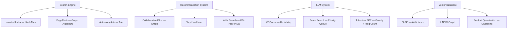
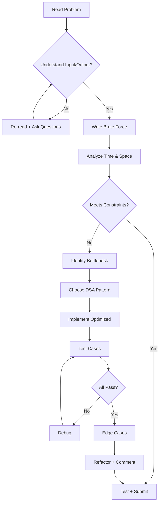
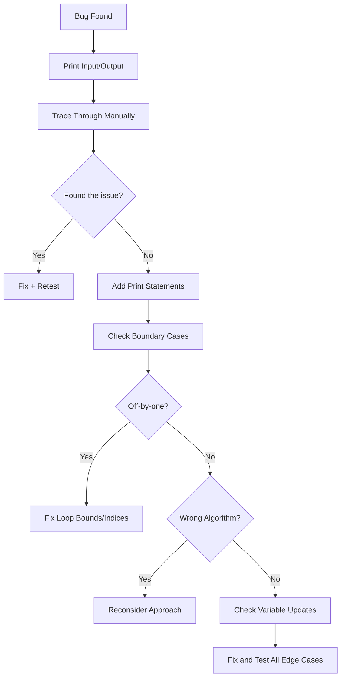
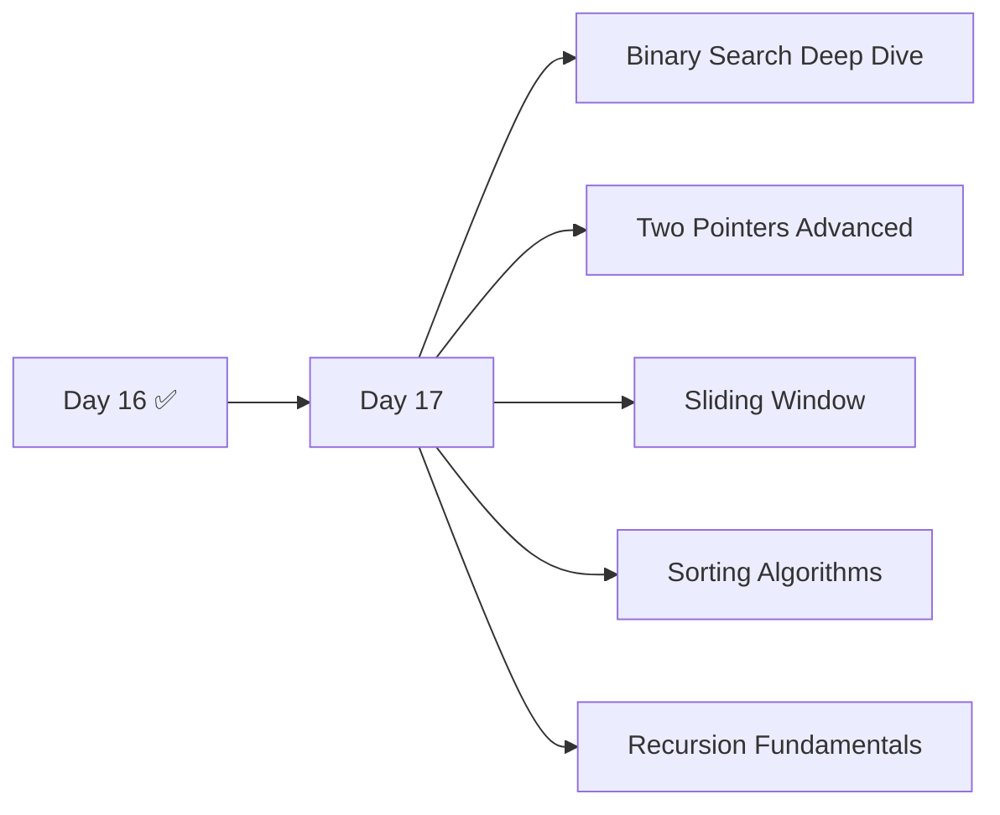
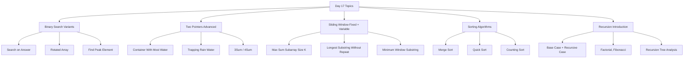
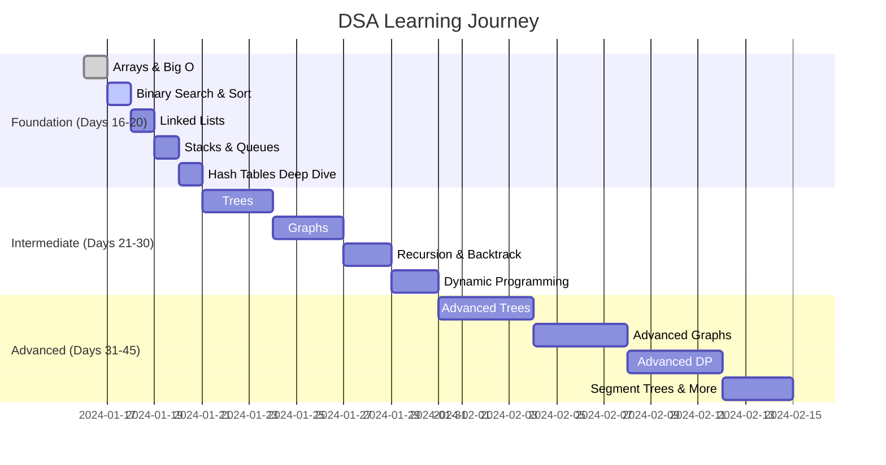

# 🚀 Day 16 — Data Structures & Algorithms: Foundation Masterclass

---

## 📋 Table of Contents


1. [Day 01–15 Python Revision & Cheat Sheets](#section-1)
2. [Introduction to DSA](#section-2)
3. [Problem Solving Framework](#section-3)
4. [Time Complexity Masterclass](#section-4)
5. [Space Complexity Masterclass](#section-5)
6. [Arrays Masterclass](#section-6)
7. [Python Lists as Dynamic Arrays](#section-7)
8. [Searching Masterclass](#section-8)
9. [Frequency Counting Masterclass](#section-9)
10. [Prefix Sum Introduction](#section-10)
11. [DSA Debugging Masterclass](#section-11)
12. [DSA Best Practices](#section-12)
13. [Competitive Programming Foundation](#section-13)
14. [Daily Practice System](#section-14)
15. [Mini Projects](#section-15)
16. [High-Value DSA Portfolio Projects](#section-16)
17. [GitHub Booster Projects](#section-17)
18. [Project Layout Masterclass](#section-18)
19. [LeetCode Roadmap](#section-19)
20. [Interview Masterclass](#section-20)
21. [Assignments & Solutions](#section-21)
22. [Enterprise Challenge Projects](#section-22)
23. [Day 16 Revision — Cheat Sheets & Mind Map](#section-23)
24. [Preparation for Day 17](#section-24)

---

## 🎯 Day 16 Learning Objectives

By the end of Day 16 you will:

- ✅ Understand what DSA is and why it exists
- ✅ Develop a professional problem-solving mindset
- ✅ Master Big O Notation — Time & Space Complexity
- ✅ Master Arrays and Dynamic Arrays
- ✅ Understand Python List internals (CPython)
- ✅ Learn Linear Search and Binary Search Introduction
- ✅ Learn Frequency Counting with hash maps
- ✅ Learn Prefix Sum for range queries
- ✅ Begin your LeetCode journey
- ✅ Build 10+ portfolio projects
- ✅ Set up your Daily Practice System

---

<a name="section-1"></a>
# 📚 SECTION 1 — Complete Python Revision (Days 01–15)

> This section serves as your master reference for everything covered in the Python phase. Keep it open during DSA practice.

---

## 1.1 Day 01–15 Summary Table

| Day | Topic | Key Concepts |
|-----|-------|-------------|
| 01 | Python Basics | Installation, REPL, print(), comments, indentation |
| 02 | Variables & Data Types | int, float, str, bool, type(), casting |
| 03 | Operators | Arithmetic, comparison, logical, bitwise, assignment |
| 04 | Control Flow | if/elif/else, nested conditions, ternary |
| 05 | Loops | for, while, break, continue, pass, range() |
| 06 | Functions | def, parameters, return, *args, **kwargs, scope |
| 07 | Modules | import, from…import, pip, standard library |
| 08 | OOP Basics | class, __init__, self, attributes, methods |
| 09 | OOP Advanced | Inheritance, polymorphism, encapsulation, abstraction |
| 10 | OOP Pillars | Dunder methods, @property, @staticmethod, @classmethod |
| 11 | OOP Deep Dive | Design patterns, SOLID principles, MRO |
| 12 | File Handling | open(), read, write, append, with statement, CSV, JSON |
| 13 | Exception Handling | try/except/else/finally, raise, custom exceptions |
| 14 | Iterators & Generators | __iter__, __next__, yield, lazy evaluation |
| 15 | Advanced Python | Decorators, context managers, closures, functools |

---

## 1.2 Python Cheat Sheet

```python
# ─── VARIABLES & TYPES ───────────────────────────────────────────
x = 10              # int
pi = 3.14           # float
name = "Shyam"      # str
flag = True         # bool
nothing = None      # NoneType

# Type checking & conversion
type(x)             # <class 'int'>
int("42")           # 42
float("3.14")       # 3.14
str(100)            # "100"
bool(0)             # False  (0, "", [], None → False)

# ─── OPERATORS ───────────────────────────────────────────────────
# Arithmetic:   +  -  *  /  //  %  **
# Comparison:   ==  !=  >  <  >=  <=
# Logical:      and  or  not
# Bitwise:      &  |  ^  ~  <<  >>
# Assignment:   =  +=  -=  *=  //=  **=

# ─── STRINGS ─────────────────────────────────────────────────────
s = "Hello, World!"
s.upper()           # "HELLO, WORLD!"
s.lower()           # "hello, world!"
s.split(", ")       # ["Hello", "World!"]
s.strip()           # removes whitespace
s.replace("o","0")  # "Hell0, W0rld!"
f"Name: {name}"     # f-string formatting
len(s)              # 13
s[0]                # 'H'
s[-1]               # '!'
s[0:5]              # 'Hello'
s[::-1]             # reversed

# ─── LISTS ───────────────────────────────────────────────────────
lst = [1, 2, 3, 4, 5]
lst.append(6)       # [1,2,3,4,5,6]
lst.insert(0, 0)    # [0,1,2,3,4,5,6]
lst.pop()           # removes & returns last
lst.pop(0)          # removes & returns index 0
lst.remove(3)       # removes first occurrence of 3
lst.sort()          # in-place sort
sorted(lst)         # returns new sorted list
lst.reverse()       # in-place reverse
lst.index(2)        # first index of value 2
lst.count(2)        # count occurrences of 2
lst[::-1]           # reversed copy

# List Comprehension
squares = [x**2 for x in range(10)]
evens   = [x for x in range(20) if x % 2 == 0]

# ─── TUPLES ──────────────────────────────────────────────────────
t = (1, 2, 3)       # immutable
t[0]                # 1
a, b, c = t         # unpacking

# ─── DICTIONARIES ────────────────────────────────────────────────
d = {"name": "Shyam", "age": 20}
d["name"]           # "Shyam"
d.get("city", "N/A")# "N/A" (safe access)
d["city"] = "GKP"   # add key
d.keys()            # dict_keys
d.values()          # dict_values
d.items()           # dict_items (key, value pairs)
d.pop("age")        # remove key
{k: v for k,v in d.items() if v}  # dict comprehension

# ─── SETS ────────────────────────────────────────────────────────
s1 = {1, 2, 3}
s2 = {2, 3, 4}
s1 | s2             # union    → {1,2,3,4}
s1 & s2             # intersection → {2,3}
s1 - s2             # difference → {1}
s1 ^ s2             # symmetric difference → {1,4}
s1.add(5)
s1.discard(1)

# ─── CONTROL FLOW ────────────────────────────────────────────────
if x > 0:
    print("positive")
elif x == 0:
    print("zero")
else:
    print("negative")

# Ternary
result = "even" if x % 2 == 0 else "odd"

# ─── LOOPS ───────────────────────────────────────────────────────
for i in range(5):        # 0,1,2,3,4
    print(i)

for i, v in enumerate(lst):
    print(i, v)

for k, v in d.items():
    print(k, v)

while condition:
    ...
    if done: break
    if skip: continue

# ─── FUNCTIONS ───────────────────────────────────────────────────
def greet(name, greeting="Hello"):
    return f"{greeting}, {name}!"

def add(*args):               # variable positional
    return sum(args)

def config(**kwargs):         # variable keyword
    return kwargs

# Lambda
square = lambda x: x ** 2

# Higher-order
list(map(square, [1,2,3]))    # [1,4,9]
list(filter(lambda x: x>2, [1,2,3,4]))  # [3,4]

# ─── COMPREHENSIONS ──────────────────────────────────────────────
[expr for item in iterable if condition]   # list
{k: v for k, v in pairs}                   # dict
{x for x in iterable}                      # set
(x for x in iterable)                      # generator

# ─── FILE HANDLING ───────────────────────────────────────────────
with open("file.txt", "r") as f:
    content = f.read()
    lines   = f.readlines()

with open("file.txt", "w") as f:
    f.write("Hello\n")

import json
with open("data.json") as f:
    data = json.load(f)

import csv
with open("data.csv") as f:
    reader = csv.DictReader(f)
    for row in reader:
        print(row)
```

---

## 1.3 OOP Cheat Sheet

```python
# ─── CLASS DEFINITION ────────────────────────────────────────────
class Animal:
    species = "Unknown"           # Class attribute

    def __init__(self, name, age):
        self.name = name          # Instance attribute
        self.age  = age

    def speak(self):              # Instance method
        return f"{self.name} makes a sound."

    @classmethod
    def get_species(cls):         # Class method
        return cls.species

    @staticmethod
    def is_alive():               # Static method
        return True

    def __str__(self):            # String representation
        return f"Animal({self.name}, {self.age})"

    def __repr__(self):
        return f"Animal(name={self.name!r}, age={self.age!r})"

    def __len__(self):
        return self.age

    def __eq__(self, other):
        return self.name == other.name

# ─── INHERITANCE ─────────────────────────────────────────────────
class Dog(Animal):
    def __init__(self, name, age, breed):
        super().__init__(name, age)
        self.breed = breed

    def speak(self):              # Override (Polymorphism)
        return f"{self.name} says Woof!"

# ─── ENCAPSULATION ───────────────────────────────────────────────
class BankAccount:
    def __init__(self, balance):
        self.__balance = balance  # Private attribute

    @property
    def balance(self):            # Getter
        return self.__balance

    @balance.setter
    def balance(self, value):     # Setter
        if value >= 0:
            self.__balance = value

# ─── ABSTRACT CLASSES ────────────────────────────────────────────
from abc import ABC, abstractmethod

class Shape(ABC):
    @abstractmethod
    def area(self):
        pass

class Circle(Shape):
    def __init__(self, r):
        self.r = r
    def area(self):
        return 3.14 * self.r ** 2

# ─── DATACLASSES ─────────────────────────────────────────────────
from dataclasses import dataclass, field

@dataclass
class Point:
    x: float
    y: float
    label: str = "origin"

    def distance(self):
        return (self.x**2 + self.y**2) ** 0.5

# ─── MRO (Method Resolution Order) ──────────────────────────────
class A: pass
class B(A): pass
class C(A): pass
class D(B, C): pass
print(D.__mro__)  # D → B → C → A → object

# ─── DESIGN PATTERNS ─────────────────────────────────────────────
# Singleton
class Singleton:
    _instance = None
    def __new__(cls):
        if not cls._instance:
            cls._instance = super().__new__(cls)
        return cls._instance

# Factory
class ShapeFactory:
    @staticmethod
    def create(shape_type, *args):
        shapes = {"circle": Circle}
        return shapes[shape_type](*args)
```

---

## 1.4 Exception Handling Cheat Sheet

```python
# ─── BASIC TRY/EXCEPT ────────────────────────────────────────────
try:
    result = 10 / 0
except ZeroDivisionError as e:
    print(f"Error: {e}")
except (ValueError, TypeError) as e:
    print(f"Value or Type error: {e}")
except Exception as e:
    print(f"Unexpected: {e}")
else:
    print("No error occurred")       # runs if no exception
finally:
    print("Always runs")             # cleanup

# ─── RAISING EXCEPTIONS ──────────────────────────────────────────
def validate_age(age):
    if age < 0:
        raise ValueError(f"Age cannot be negative: {age}")
    if not isinstance(age, int):
        raise TypeError("Age must be an integer")
    return age

# ─── CUSTOM EXCEPTIONS ───────────────────────────────────────────
class AppError(Exception):
    """Base exception for this application."""
    pass

class DatabaseError(AppError):
    def __init__(self, message, code=None):
        super().__init__(message)
        self.code = code

class ValidationError(AppError):
    pass

# ─── CONTEXT MANAGERS FOR CLEANUP ────────────────────────────────
from contextlib import contextmanager

@contextmanager
def managed_resource():
    resource = acquire_resource()
    try:
        yield resource
    except Exception:
        rollback(resource)
        raise
    finally:
        release(resource)

# ─── COMMON EXCEPTION TYPES ──────────────────────────────────────
# ValueError      — wrong value type
# TypeError       — wrong type entirely
# KeyError        — dict key missing
# IndexError      — list index out of range
# AttributeError  — object has no attribute
# FileNotFoundError — file doesn't exist
# ImportError     — module not found
# MemoryError     — out of memory
# RecursionError  — max recursion depth exceeded
# StopIteration   — iterator exhausted
```

---

## 1.5 Advanced Python Cheat Sheet (Decorators, Generators, Context Managers)

```python
# ─── GENERATORS ──────────────────────────────────────────────────
def fibonacci(n):
    a, b = 0, 1
    for _ in range(n):
        yield a
        a, b = b, a + b

gen = fibonacci(10)
next(gen)                # 0
list(fibonacci(10))      # [0,1,1,2,3,5,8,13,21,34]

# Generator expression (memory-efficient)
squares = (x**2 for x in range(1_000_000))

# ─── ITERATORS ───────────────────────────────────────────────────
class Counter:
    def __init__(self, limit):
        self.limit = limit
        self.current = 0

    def __iter__(self):
        return self

    def __next__(self):
        if self.current >= self.limit:
            raise StopIteration
        self.current += 1
        return self.current

# ─── DECORATORS ──────────────────────────────────────────────────
import functools, time

def timer(func):
    @functools.wraps(func)
    def wrapper(*args, **kwargs):
        start = time.perf_counter()
        result = func(*args, **kwargs)
        end   = time.perf_counter()
        print(f"{func.__name__} took {end-start:.4f}s")
        return result
    return wrapper

def retry(times=3):
    def decorator(func):
        @functools.wraps(func)
        def wrapper(*args, **kwargs):
            for attempt in range(times):
                try:
                    return func(*args, **kwargs)
                except Exception as e:
                    if attempt == times - 1:
                        raise
        return wrapper
    return decorator

@timer
@retry(times=3)
def fetch_data(url):
    ...

# ─── CONTEXT MANAGERS ────────────────────────────────────────────
class DatabaseConnection:
    def __enter__(self):
        self.conn = connect_db()
        return self.conn

    def __exit__(self, exc_type, exc_val, exc_tb):
        if exc_type:
            self.conn.rollback()
        else:
            self.conn.commit()
        self.conn.close()
        return False   # don't suppress exceptions

# ─── CLOSURES ────────────────────────────────────────────────────
def make_multiplier(n):
    def multiply(x):
        return x * n      # n captured from outer scope
    return multiply

double = make_multiplier(2)
triple = make_multiplier(3)

# ─── FUNCTOOLS ───────────────────────────────────────────────────
from functools import partial, reduce, lru_cache

@lru_cache(maxsize=None)
def fib(n):
    if n < 2: return n
    return fib(n-1) + fib(n-2)

power_of_2 = partial(pow, 2)    # power_of_2(10) → 1024
total = reduce(lambda a,b: a+b, [1,2,3,4,5])  # 15
```

---

## 1.6 Interview Quick Revision — Python Fundamentals

| Question | Answer |
|----------|--------|
| Is Python pass-by-value or pass-by-reference? | Pass-by-object-reference (pass-by-assignment) |
| What is a mutable vs immutable type? | Mutable: list, dict, set. Immutable: int, str, tuple, frozenset |
| Difference between `==` and `is`? | `==` checks value equality; `is` checks identity (same memory address) |
| What is GIL? | Global Interpreter Lock — only one thread runs Python bytecode at a time |
| List vs Tuple? | List is mutable, Tuple is immutable and hashable |
| `*args` vs `**kwargs`? | `*args` → positional varargs tuple; `**kwargs` → keyword varargs dict |
| What is a decorator? | A function that wraps another function to extend its behavior |
| What is a generator? | A function using `yield` to lazily produce values one at a time |
| What is `__slots__`? | Class variable that restricts instance attributes and saves memory |
| What is monkey patching? | Dynamically modifying a class or module at runtime |
| Deep copy vs Shallow copy? | Shallow: copies references. Deep: recursively copies all objects |
| What is duck typing? | "If it walks like a duck and quacks like a duck, it's a duck" — Python checks behavior, not type |

---

<a name="section-2"></a>
# 🧠 SECTION 2 — Introduction to DSA

## 2.1 What is DSA?

**Data Structures** are ways of **organizing and storing data** so it can be accessed and modified efficiently.

**Algorithms** are **step-by-step procedures** for solving computational problems.

Together, **DSA = the science of writing efficient code.**

```
┌─────────────────────────────────────────────────────┐
│                      DSA                            │
│                                                     │
│   Data Structures          Algorithms               │
│   ─────────────────        ─────────────────        │
│   Arrays                   Searching                │
│   Linked Lists             Sorting                  │
│   Stacks                   Recursion                │
│   Queues                   Dynamic Programming      │
│   Trees                    Greedy                   │
│   Graphs                   Divide & Conquer         │
│   Hash Tables              Graph Algorithms         │
│   Heaps                    Backtracking             │
└─────────────────────────────────────────────────────┘
```

---

## 2.2 Why DSA Exists

Every program you write manipulates data. As data grows:

- A naive solution for 1,000 items takes 1 ms
- The same naive solution for 1,000,000 items takes 1,000,000 ms = **16 minutes**
- An optimized DSA solution takes **< 1 ms** for 1,000,000 items

DSA exists to bridge this gap. It is the difference between **software that scales** and software that breaks under load.

```mermaid
graph LR
    A[Problem] --> B[Naive Solution]
    A --> C[DSA-Optimized Solution]
    B --> D[O(n²) — Slow at Scale]
    C --> E[O(n log n) — Fast at Scale]
    D --> F[System Crashes]
    E --> G[System Scales]
```

---

## 2.3 Why Companies Ask DSA in Interviews

Companies like Google, Meta, Amazon, Microsoft, and OpenAI use DSA questions because:

1. **Proxy for problem-solving ability** — Can you break down a complex problem?
2. **Tests fundamentals** — Language-agnostic core thinking
3. **Standardized evaluation** — Fair comparison across thousands of candidates
4. **Predicts on-the-job performance** — Real engineering requires optimization
5. **Filter** — Separates engineers who code from engineers who *think*

---

## 2.4 Why FAANG Uses DSA

```
At Google scale:
  - 8.5 billion searches/day
  - PageRank Algorithm (Graph + Linear Algebra)
  - Every millisecond saved = millions saved

At Meta scale:
  - 3.8 billion users
  - Friend recommendations = Graph BFS/DFS
  - Feed ranking = Priority Queues + Sorting

At Amazon scale:
  - 1.6 million packages/day
  - Route optimization = Dijkstra's Algorithm
  - Product recommendation = Collaborative Filtering

At Microsoft scale:
  - Office 365 spell check = Trie + DP
  - Azure load balancing = Heap-based scheduling

At OpenAI scale:
  - Token lookup = Hash Tables
  - Attention mechanism = Matrix operations (O(n²))
  - KV Cache = Hash Maps for O(1) retrieval
```

---

## 2.5 Why AI/LLM Engineers Need DSA

As an aspiring LLM Engineer, DSA is critical for:

| AI/LLM Task | DSA Used |
|-------------|----------|
| Vector similarity search | Binary search, KD-Trees, HNSW graphs |
| Token vocabulary lookup | Hash Tables (O(1)) |
| Beam search in decoding | Priority Queues / Heaps |
| Context window management | Sliding Window, Circular Buffers |
| Training data deduplication | Hashing, Bloom Filters |
| RAG retrieval | Vector indexing, ANN algorithms |
| Attention computation | Matrix operations, Dynamic Programming |
| Tokenizer (BPE) | Greedy algorithms + frequency counting |
| Model serving routing | Load balancing algorithms |
| Prompt caching | LRU Cache (Hash Map + Doubly Linked List) |

---

## 2.6 DSA in Real Systems



---

<a name="section-3"></a>
# 🔧 SECTION 3 — Problem Solving Framework

## 3.1 The 8-Step Professional Framework

```
┌─────────────────────────────────────────────────────────────────┐
│           PROFESSIONAL DSA PROBLEM SOLVING FRAMEWORK            │
├─────────────────────────────────────────────────────────────────┤
│  Step 1  │  UNDERSTAND      │  Read 3× before touching keyboard │
│  Step 2  │  BRUTE FORCE     │  Get ANY working solution first   │
│  Step 3  │  COMPLEXITY      │  Analyze time & space of brute    │
│  Step 4  │  OPTIMIZE        │  Identify bottleneck, apply DSA   │
│  Step 5  │  TEST CASES      │  Verify on provided examples      │
│  Step 6  │  EDGE CASES      │  Empty, negative, single, large   │
│  Step 7  │  REFACTOR        │  Clean code, good names, comments │
│  Step 8  │  COMMUNICATE     │  Explain thinking out loud        │
└─────────────────────────────────────────────────────────────────┘
```

---

## 3.2 Step 1 — Understand the Problem

**Questions to ask yourself (and your interviewer):**

```
1. What is the input? (type, size, constraints)
2. What is the expected output?
3. Are there any constraints? (n ≤ 10^5, values always positive?)
4. Can there be duplicates?
5. Can the input be empty or null?
6. Is the array sorted or unsorted?
7. What should I return on edge cases?
8. Is performance critical?
```

**Example — LeetCode 1: Two Sum**
```
Problem: Given array nums and target, return indices of two numbers that add to target.

Input:  nums = [2, 7, 11, 15], target = 9
Output: [0, 1]   (because nums[0] + nums[1] = 2 + 7 = 9)

Constraints:
  - 2 ≤ nums.length ≤ 10^4
  - -10^9 ≤ nums[i] ≤ 10^9
  - Exactly one valid answer exists
```

---

## 3.3 Step 2 — Brute Force First

```python
# Two Sum — Brute Force O(n²)
def two_sum_brute(nums, target):
    n = len(nums)
    for i in range(n):
        for j in range(i + 1, n):
            if nums[i] + nums[j] == target:
                return [i, j]
    return []

# Always write brute force first — it proves you understand the problem
```

---

## 3.4 Step 3 — Analyze Complexity

```
Brute Force Analysis:
  - Outer loop: O(n)
  - Inner loop: O(n)
  - Total Time:  O(n²)
  - Space:       O(1)

For n = 10,000:
  Operations = 10,000² = 100,000,000 = 100 million
  This is too slow for large inputs!
```

---

## 3.5 Step 4 — Optimize

```python
# Two Sum — Optimized O(n) with Hash Map
def two_sum_optimized(nums, target):
    seen = {}                          # value → index
    for i, num in enumerate(nums):
        complement = target - num
        if complement in seen:
            return [seen[complement], i]
        seen[num] = i
    return []

# Optimization:
#   Old: check all pairs → O(n²)
#   New: for each number, check if complement exists in hash map → O(1)
#   Total: O(n) time, O(n) space
#   Trade-off: used O(n) extra space to save time
```

---

## 3.6 Step 5 & 6 — Test Cases and Edge Cases

```python
# ─── STRUCTURED TESTING ──────────────────────────────────────────

def test_two_sum():
    # Test cases from problem
    assert two_sum_optimized([2,7,11,15], 9)  == [0,1]
    assert two_sum_optimized([3,2,4], 6)      == [1,2]
    assert two_sum_optimized([3,3], 6)        == [0,1]

    # Edge cases
    assert two_sum_optimized([0,4,3,0], 0)   == [0,3]
    assert two_sum_optimized([-1,-2,-3,-4,-5], -8) == [2,4]
    assert two_sum_optimized([1,2], 3)        == [0,1]

    print("All tests passed!")

test_two_sum()
```

---

## 3.7 Problem Solving Flowchart



---

## 3.8 Recognizing Problem Patterns

| Pattern | Trigger Words | DSA Tool |
|---------|---------------|----------|
| Two Sum / Pair | "Find two numbers that…" | Hash Map |
| Subarray Sum | "Subarray with sum equal to…" | Prefix Sum |
| Sliding Window | "Maximum/minimum in subarray of size k" | Two Pointers |
| Find Duplicates | "Check if duplicates exist" | Hash Set |
| Top K Elements | "Return k largest/smallest" | Heap |
| Search Sorted | "Find element in sorted array" | Binary Search |
| Connected Components | "Number of islands/groups" | BFS/DFS |
| Optimal Substructure | "Maximum profit/minimum cost" | DP |

---

<a name="section-4"></a>
# ⏱️ SECTION 4 — Time Complexity Masterclass

## 4.1 What is Time Complexity?

Time Complexity is **NOT** the actual time in seconds. It is the **rate at which execution time grows** relative to input size `n`.

```
Big O Notation: O(f(n))

We drop:
  - Constants: O(2n) → O(n)
  - Lower-order terms: O(n² + n) → O(n²)
  - Coefficients: O(5n³) → O(n³)

We keep:
  - The dominant (fastest-growing) term
```

---

## 4.2 Complexity Hierarchy

```
O(1) < O(log n) < O(√n) < O(n) < O(n log n) < O(n²) < O(n³) < O(2ⁿ) < O(n!)

Fastest                                                              Slowest
```

### Visual Growth Table

| n | O(1) | O(log n) | O(n) | O(n log n) | O(n²) | O(2ⁿ) |
|---|------|----------|------|------------|-------|-------|
| 1 | 1 | 0 | 1 | 0 | 1 | 2 |
| 10 | 1 | 3 | 10 | 33 | 100 | 1,024 |
| 100 | 1 | 7 | 100 | 664 | 10,000 | 10^30 |
| 1,000 | 1 | 10 | 1,000 | 10,000 | 1,000,000 | ∞ |
| 10,000 | 1 | 13 | 10,000 | 133,000 | 100,000,000 | ∞ |
| 1,000,000 | 1 | 20 | 1,000,000 | 20,000,000 | 10^12 | ∞ |

---

## 4.3 O(1) — Constant Time

**Definition:** Execution time does NOT depend on input size.

```python
# Examples of O(1) operations

# Array access by index
def get_first(arr):
    return arr[0]           # Always 1 operation

# Dictionary lookup
def get_value(d, key):
    return d.get(key)       # Hash → O(1) average

# Math operation
def square(n):
    return n * n            # Always 1 operation

# Stack push/pop (using list)
stack = []
stack.append(10)            # O(1) amortized
stack.pop()                 # O(1)

# Checking length
def is_empty(lst):
    return len(lst) == 0    # O(1) — Python stores length
```

**Real World:** ATM PIN check — doesn't matter how many accounts the bank has, your check is instant.

**Interview Trigger Words:** "return first element", "get by key", "push/pop stack"

---

## 4.4 O(log n) — Logarithmic Time

**Definition:** Input is **halved** at each step.

```python
# Binary Search — O(log n)
def binary_search(arr, target):
    left, right = 0, len(arr) - 1
    while left <= right:
        mid = (left + right) // 2
        if arr[mid] == target:
            return mid
        elif arr[mid] < target:
            left = mid + 1        # Eliminate left half
        else:
            right = mid - 1       # Eliminate right half
    return -1

# Visualization for arr = [1,3,5,7,9,11,13], target = 7
#
# Step 1: [1,3,5,7,9,11,13]  mid=7  → found! (3 steps)
#
# Worst case n=1000: ~10 steps (log₂(1000) ≈ 10)
# Worst case n=1,000,000: ~20 steps (log₂(10^6) ≈ 20)
```

**Real World:** Dictionary lookup — you open the middle, then go to half where your word is.

**Interview Trigger Words:** "sorted array", "search", "find", "how many times can we halve?"

---

## 4.5 O(n) — Linear Time

**Definition:** One pass through all `n` elements.

```python
# Linear Search — O(n)
def linear_search(arr, target):
    for i, val in enumerate(arr):    # Visit every element once
        if val == target:
            return i
    return -1

# Sum of array — O(n)
def array_sum(arr):
    total = 0
    for x in arr:          # n iterations
        total += x
    return total

# Find maximum — O(n)
def find_max(arr):
    max_val = arr[0]
    for x in arr[1:]:      # n-1 comparisons
        if x > max_val:
            max_val = x
    return max_val

# Reverse array — O(n)
def reverse_array(arr):
    return arr[::-1]       # Creates new array of size n
```

**Real World:** Reading every page of a book to find a word.

---

## 4.6 O(n log n) — Linearithmic Time

**Definition:** Divide input (log n) and process each part linearly (n).

```python
# Merge Sort — O(n log n)
def merge_sort(arr):
    if len(arr) <= 1:
        return arr

    mid   = len(arr) // 2
    left  = merge_sort(arr[:mid])       # Divide: log n levels
    right = merge_sort(arr[mid:])

    return merge(left, right)           # Merge: O(n) per level

def merge(left, right):
    result = []
    i = j  = 0
    while i < len(left) and j < len(right):
        if left[i] <= right[j]:
            result.append(left[i]); i += 1
        else:
            result.append(right[j]); j += 1
    result.extend(left[i:])
    result.extend(right[j:])
    return result

# Python's built-in sort uses Timsort — also O(n log n)
arr.sort()
sorted(arr)
```

**Real World:** Efficient sorting of large datasets — used in databases, OS schedulers.

---

## 4.7 O(n²) — Quadratic Time

**Definition:** Nested loops, each running `n` times.

```python
# Bubble Sort — O(n²)
def bubble_sort(arr):
    n = len(arr)
    for i in range(n):           # Outer loop: n
        for j in range(n-i-1):  # Inner loop: n
            if arr[j] > arr[j+1]:
                arr[j], arr[j+1] = arr[j+1], arr[j]
    return arr

# Brute Force Two Sum — O(n²)
def two_sum_brute(nums, target):
    for i in range(len(nums)):          # n
        for j in range(i+1, len(nums)): # n
            if nums[i] + nums[j] == target:
                return [i, j]

# Print all pairs — O(n²)
def all_pairs(arr):
    for i in arr:       # n
        for j in arr:   # n
            print(i, j)
```

**Warning:** For n = 10,000 → 100 million operations. Acceptable only for n ≤ 1,000.

---

## 4.8 O(2ⁿ) — Exponential Time

**Definition:** Doubles with each additional input element.

```python
# Naive Fibonacci — O(2ⁿ)
def fib_naive(n):
    if n <= 1:
        return n
    return fib_naive(n-1) + fib_naive(n-2)
    # fib(50) makes 2^50 ≈ 1 quadrillion calls!

# Fixed with memoization → O(n)
from functools import lru_cache

@lru_cache(maxsize=None)
def fib_memo(n):
    if n <= 1:
        return n
    return fib_memo(n-1) + fib_memo(n-2)

# Subsets — O(2ⁿ) — inherently exponential
def all_subsets(arr):
    if not arr:
        return [[]]
    rest = all_subsets(arr[1:])
    return rest + [[arr[0]] + s for s in rest]
```

**Rule:** If you see O(2ⁿ), look for DP optimization.

---

## 4.9 O(n!) — Factorial Time

**Definition:** All permutations. Grows astronomically fast.

```python
# Permutations — O(n!)
from itertools import permutations

def all_permutations(arr):
    return list(permutations(arr))

# n=10:  10! = 3,628,800
# n=20:  20! = 2.4 × 10^18 (impossible to enumerate)

# Travelling Salesman Brute Force — O(n!)
# Always look for approximation algorithms instead
```

---

## 4.10 Amortized Analysis

Some operations are occasionally slow but fast on average:

```python
# Python list append — amortized O(1)
# Usually O(1), but occasionally O(n) when resizing
# Average over n appends = O(1) per append

lst = []
for i in range(n):
    lst.append(i)   # Total: O(n), Average per op: O(1)

# Stack with dynamic array — amortized O(1) push/pop
```

---

## 4.11 Best, Average, Worst Case

```
For n elements in an unsorted array, Linear Search:

┌──────────────┬────────────────────────────────────────┐
│ Best Case    │ O(1)    — target is first element      │
│ Average Case │ O(n/2)  → O(n) — target in middle      │
│ Worst Case   │ O(n)    — target is last or not found  │
└──────────────┴────────────────────────────────────────┘

Big O usually refers to WORST CASE.
Big Ω (Omega) refers to BEST CASE.
Big Θ (Theta) refers to AVERAGE/TIGHT BOUND.
```

---

## 4.12 Complexity Rules

```python
# RULE 1: Drop Constants
# O(2n) → O(n)
for i in range(n): pass       # O(n)
for i in range(n): pass       # O(n)
# Total: O(2n) → O(n)

# RULE 2: Drop Non-Dominant Terms
# O(n² + n) → O(n²)
for i in range(n):            # O(n)
    for j in range(n): pass   # O(n²)
# Total: O(n² + n) → O(n²)

# RULE 3: Consecutive Operations — ADD
def func(arr):
    a = sum(arr)              # O(n)
    b = sorted(arr)           # O(n log n)
    return a, b
# Total: O(n + n log n) → O(n log n)

# RULE 4: Nested Operations — MULTIPLY
for i in range(n):            # O(n)
    for j in range(m):        # O(m)
        pass                  # Total: O(n × m)

# RULE 5: If n is always small (say n ≤ 20), O(2ⁿ) may be acceptable
```

---

<a name="section-5"></a>
# 💾 SECTION 5 — Space Complexity Masterclass

## 5.1 What is Space Complexity?

Space complexity measures the **total memory** an algorithm uses relative to input size `n`.

```
Total Space = Input Space + Auxiliary Space

Input Space:     Memory for the input data itself
Auxiliary Space: Extra memory the algorithm uses (temp vars, recursion stack, etc.)

Note: We usually analyze AUXILIARY SPACE when comparing algorithms,
      since input space is unavoidable.
```

---

## 5.2 O(1) Auxiliary Space

```python
# In-place operations use O(1) extra space

def reverse_in_place(arr):
    left, right = 0, len(arr) - 1
    while left < right:
        arr[left], arr[right] = arr[right], arr[left]  # swap in place
        left  += 1
        right -= 1
    return arr
    # Space: O(1) — only 2 pointer variables

def find_max(arr):
    max_val = arr[0]          # O(1) — one variable
    for x in arr[1:]:
        if x > max_val:
            max_val = x
    return max_val
```

---

## 5.3 O(n) Auxiliary Space

```python
# Creating a new array of size n

def duplicate_array(arr):
    return arr[:]             # O(n) — creates copy

def prefix_sum(arr):
    prefix = [0] * len(arr)  # O(n) — new array
    prefix[0] = arr[0]
    for i in range(1, len(arr)):
        prefix[i] = prefix[i-1] + arr[i]
    return prefix

def two_sum(nums, target):
    seen = {}                 # O(n) — hash map
    for i, num in enumerate(nums):
        if target - num in seen:
            return [seen[target-num], i]
        seen[num] = i
```

---

## 5.4 Recursion Stack Space

```python
# Recursive calls use stack memory

def factorial(n):
    if n == 0:
        return 1
    return n * factorial(n - 1)
# Stack depth: n → O(n) space

# Call stack visualization for factorial(4):
# factorial(4)
#   factorial(3)
#     factorial(2)
#       factorial(1)
#         factorial(0) → returns 1
#       returns 1
#     returns 2
#   returns 6
# returns 24

# Tail recursion (Python doesn't optimize this, but conceptually O(1) space)
def factorial_tail(n, acc=1):
    if n == 0:
        return acc
    return factorial_tail(n-1, n * acc)

# Binary search recursive — O(log n) space (stack depth)
def binary_search_rec(arr, target, left, right):
    if left > right:
        return -1
    mid = (left + right) // 2
    if arr[mid] == target:
        return mid
    elif arr[mid] < target:
        return binary_search_rec(arr, target, mid+1, right)
    else:
        return binary_search_rec(arr, target, left, mid-1)
```

---

## 5.5 Memory vs Speed Tradeoffs

```
The classic engineering tradeoff:

┌───────────────────────────────────────────────────────────┐
│  USE MORE SPACE → SAVE TIME                               │
│                                                           │
│  Example: Two Sum                                         │
│    Brute Force: O(1) space, O(n²) time                    │
│    Hash Map:    O(n) space, O(n) time   ← usually better  │
│                                                           │
│  Example: Fibonacci                                       │
│    Naive:     O(n) stack, O(2ⁿ) time                      │
│    Memoized:  O(n) space, O(n) time     ← always better   │
│    Iterative: O(1) space, O(n) time     ← best            │
└───────────────────────────────────────────────────────────┘

Rule of Thumb for Production:
  - Prefer O(1) or O(log n) space when possible
  - Trade space for time only when:
    a) Time constraint is critical
    b) Memory is not a bottleneck
    c) Cache hits improve real performance
```

---

## 5.6 Space Complexity Summary Table

| Algorithm | Time | Space |
|-----------|------|-------|
| Linear Search | O(n) | O(1) |
| Binary Search (iterative) | O(log n) | O(1) |
| Binary Search (recursive) | O(log n) | O(log n) |
| Bubble Sort | O(n²) | O(1) |
| Merge Sort | O(n log n) | O(n) |
| Quick Sort (avg) | O(n log n) | O(log n) |
| Hash Map lookup | O(1) avg | O(n) |
| Recursive Fibonacci | O(2ⁿ) | O(n) |
| Memoized Fibonacci | O(n) | O(n) |
| Iterative Fibonacci | O(n) | O(1) |

---

<a name="section-6"></a>
# 📐 SECTION 6 — Arrays Masterclass

## 6.1 What is an Array?

An array is a **collection of elements stored in contiguous memory locations**, where each element is accessible by its index in O(1) time.

```
Memory Layout (int array of size 5):

Index:    0     1     2     3     4
Value:  [10]  [20]  [30]  [40]  [50]
Addr:  1000  1004  1008  1012  1016

Each int = 4 bytes
Address of arr[i] = base_address + (i × element_size)
Address of arr[3] = 1000 + (3 × 4) = 1012
```

---

## 6.2 Why Contiguous Memory Enables O(1) Access

```
To access arr[i]:
  1. Compute address: base + i × size → 1 arithmetic operation
  2. Load from memory → 1 memory access
  Total: O(1) — constant regardless of array size!

Compare to a linked list:
  To access node at index i → must traverse from head → O(n)
```

---

## 6.3 Array Operations with Complexity

```python
import array   # Python's fixed-type array
import numpy   # NumPy arrays (C arrays under the hood)

# ─── INITIALIZATION ──────────────────────────────────────────────
lst  = [0] * 5                    # Python list (dynamic array)
arr  = array.array('i', [1,2,3])  # Fixed-type array
nums = [10, 20, 30, 40, 50]

# ─── INDEXING — O(1) ─────────────────────────────────────────────
first = nums[0]        # 10
last  = nums[-1]       # 50
third = nums[2]        # 30

# ─── SLICING — O(k) where k = slice size ─────────────────────────
nums[1:4]              # [20, 30, 40]
nums[::-1]             # [50, 40, 30, 20, 10]

# ─── TRAVERSAL — O(n) ────────────────────────────────────────────
for x in nums:
    print(x)

for i, x in enumerate(nums):
    print(f"nums[{i}] = {x}")

# ─── UPDATE — O(1) ───────────────────────────────────────────────
nums[2] = 99           # [10, 20, 99, 40, 50]

# ─── SEARCH — O(n) unsorted, O(log n) sorted ─────────────────────
nums.index(40)         # 3  (linear search internally)
40 in nums             # True (linear search)

# ─── INSERTION ───────────────────────────────────────────────────
nums.append(60)        # O(1) amortized — add at end
nums.insert(0, 5)      # O(n) — shift all elements right

# ─── DELETION ────────────────────────────────────────────────────
nums.pop()             # O(1) — remove from end
nums.pop(0)            # O(n) — shift all elements left
nums.remove(30)        # O(n) — find then shift
```

---

## 6.4 Array Operations Complexity Table

| Operation | Array (fixed) | Python List (dynamic) | Notes |
|-----------|--------------|----------------------|-------|
| Access by index | O(1) | O(1) | Random access |
| Search (unsorted) | O(n) | O(n) | Linear scan |
| Search (sorted) | O(log n) | O(log n) | Binary search |
| Insert at end | O(1) | O(1) amortized | May resize |
| Insert at start | O(n) | O(n) | Shift required |
| Insert at middle | O(n) | O(n) | Shift required |
| Delete from end | O(1) | O(1) | |
| Delete from start | O(n) | O(n) | Shift required |
| Delete from middle | O(n) | O(n) | Shift required |
| Traverse | O(n) | O(n) | |
| Update by index | O(1) | O(1) | |
| Length | O(1) | O(1) | Stored separately |

---

## 6.5 Visual Memory Diagram

```
Static Array (C-style):

┌────┬────┬────┬────┬────┐
│ 10 │ 20 │ 30 │ 40 │ 50 │    Fixed size = 5
└────┴────┴────┴────┴────┘
  [0]  [1]  [2]  [3]  [4]

Dynamic Array (Python List):

Initial allocation (capacity = 4):
┌────┬────┬────┬────┐
│ 10 │ 20 │ 30 │ 40 │    len=4, capacity=4
└────┴────┴────┴────┘

After append(50) → resize to capacity = 8:
┌────┬────┬────┬────┬────┬────┬────┬────┐
│ 10 │ 20 │ 30 │ 40 │ 50 │    │    │    │    len=5, capacity=8
└────┴────┴────┴────┴────┴────┴────┴────┘
                            ↑ occupied      ↑ empty slots
```

---

## 6.6 Two-Dimensional Arrays

```python
# 2D array (matrix) — array of arrays
matrix = [
    [1, 2, 3],
    [4, 5, 6],
    [7, 8, 9]
]

# Access: matrix[row][col]
matrix[1][2]           # 6  (row 1, col 2)

# Traverse — O(n × m)
def traverse_2d(matrix):
    for row in matrix:
        for val in row:
            print(val, end=" ")
        print()

# Create n×m matrix filled with 0
n, m = 3, 4
grid = [[0] * m for _ in range(n)]

# ⚠️ Common Mistake: Don't use [[0]*m]*n
# Wrong:  grid = [[0]*m] * n  → all rows reference SAME list!
# Right:  grid = [[0]*m for _ in range(n)]

# Transpose
def transpose(matrix):
    rows, cols = len(matrix), len(matrix[0])
    return [[matrix[j][i] for j in range(rows)] for i in range(cols)]
```

---

## 6.7 Common Array Patterns

```python
# ─── PATTERN 1: TWO POINTERS ─────────────────────────────────────
def is_palindrome(arr):
    left, right = 0, len(arr) - 1
    while left < right:
        if arr[left] != arr[right]:
            return False
        left  += 1
        right -= 1
    return True

# ─── PATTERN 2: SLIDING WINDOW ───────────────────────────────────
def max_subarray_sum_k(arr, k):
    """Maximum sum of subarray of size k."""
    window_sum = sum(arr[:k])
    max_sum    = window_sum
    for i in range(k, len(arr)):
        window_sum += arr[i] - arr[i - k]    # slide window
        max_sum = max(max_sum, window_sum)
    return max_sum

# ─── PATTERN 3: KADANE'S ALGORITHM ──────────────────────────────
def max_subarray(arr):
    """Maximum sum subarray (Kadane's Algorithm) — O(n)."""
    max_sum     = arr[0]
    current_sum = arr[0]
    for x in arr[1:]:
        current_sum = max(x, current_sum + x)
        max_sum     = max(max_sum, current_sum)
    return max_sum

# ─── PATTERN 4: ROTATE ARRAY ─────────────────────────────────────
def rotate_right(arr, k):
    """Rotate array right by k positions — O(n)."""
    n = len(arr)
    k = k % n                       # handle k > n
    return arr[-k:] + arr[:-k]

# ─── PATTERN 5: DUTCH NATIONAL FLAG ─────────────────────────────
def sort_colors(nums):
    """Sort 0s, 1s, 2s in place — O(n), O(1) space."""
    low, mid, high = 0, 0, len(nums) - 1
    while mid <= high:
        if nums[mid] == 0:
            nums[low], nums[mid] = nums[mid], nums[low]
            low += 1; mid += 1
        elif nums[mid] == 1:
            mid += 1
        else:
            nums[mid], nums[high] = nums[high], nums[mid]
            high -= 1
```

---

## 6.8 Interview Questions — Arrays

| # | Question | Difficulty | Key Technique |
|---|----------|------------|---------------|
| 1 | Find maximum element | Easy | Linear scan |
| 2 | Reverse an array | Easy | Two pointers |
| 3 | Check if sorted | Easy | Linear scan |
| 4 | Second largest element | Easy | Two-pass O(n) |
| 5 | Remove duplicates from sorted array | Easy | Two pointers |
| 6 | Move zeros to end | Easy | Two pointers |
| 7 | Best time to buy and sell stock | Easy | Track min so far |
| 8 | Maximum subarray sum | Medium | Kadane's |
| 9 | Product of array except self | Medium | Prefix/suffix products |
| 10 | Container with most water | Medium | Two pointers |
| 11 | 3Sum | Medium | Sort + Two pointers |
| 12 | Rotate array | Medium | Reversal trick |
| 13 | Merge intervals | Medium | Sort + merge |
| 14 | Find duplicate number | Medium | Floyd's cycle detection |
| 15 | Median of two sorted arrays | Hard | Binary search |

---

<a name="section-7"></a>
# 🐍 SECTION 7 — Python Lists as Dynamic Arrays

## 7.1 What Are Python Lists Internally?

Python lists are **dynamic arrays** (like `ArrayList` in Java or `vector` in C++). They are:

- Stored in **contiguous memory** (like C arrays)
- Typed as `PyObject*` pointers — each slot stores a pointer to a Python object
- **Automatically resized** when capacity is exceeded

---

## 7.2 CPython Internal Structure

```c
/* CPython — Objects/listobject.c */
typedef struct {
    PyObject_VAR_HEAD        /* ob_size = current length */
    PyObject **ob_item;      /* pointer to array of items */
    Py_ssize_t allocated;    /* current capacity */
} PyListObject;
```

**In Python terms:**
```python
# When you write:
lst = [1, 2, 3]

# Internally:
# ob_item    → [ptr_to_1, ptr_to_2, ptr_to_3, None, None, None, None, None]
# ob_size    → 3 (current length)
# allocated  → 8 (current capacity — pre-allocated)
```

---

## 7.3 Growth Pattern (CPython)

```python
import sys

lst = []
prev_size = sys.getsizeof(lst)
print(f"Empty list size: {prev_size} bytes")

for i in range(20):
    lst.append(i)
    new_size = sys.getsizeof(lst)
    if new_size != prev_size:
        print(f"len={len(lst):2d}, allocated bytes={new_size}")
        prev_size = new_size

# Output (approximate):
# Empty list size: 56 bytes
# len= 1, allocated bytes= 88   → capacity 4  items (32 bytes extra)
# len= 5, allocated bytes=120   → capacity 8  items
# len= 9, allocated bytes=184   → capacity 16 items
# len=17, allocated bytes=248   → capacity 25 items

# Growth formula (CPython):
# new_capacity = capacity + (capacity >> 3) + (3 if capacity < 9 else 6)
# ≈ 1.125× growth factor (not 2× like many textbooks say)
```

---

## 7.4 Amortized O(1) Append

```
Analysis of n appends:

  - Most appends: O(1)
  - Rare resize appends: O(n)

  Total cost: 1+1+1+1+2+1+1+1+4+1+1+1+1+8+...
  
  By doubling analysis: ≤ 2n total operations
  Average (amortized) per append: 2n/n = O(1)

Analogy: Buying a 100-pack of pens.
  - Each individual pen costs €0.05 (amortized)
  - Even though you paid €5 upfront (resize cost)
  - The "cost per use" is still constant
```

---

## 7.5 All List Operations with True Complexity

```python
lst = [3, 1, 4, 1, 5, 9, 2, 6]

# O(1) Operations
lst[0]              # Index access
lst[-1]             # Last element
len(lst)            # Length (stored separately)
lst.append(7)       # Add to end (amortized O(1))
lst.pop()           # Remove from end

# O(n) Operations
lst.insert(0, 99)   # Insert at beginning — shift all right
lst.pop(0)          # Remove from beginning — shift all left
lst.remove(4)       # Find + remove — O(n) scan
99 in lst           # Membership test — O(n) scan
lst.index(5)        # Find index — O(n) scan
lst.reverse()       # In-place reverse — O(n)
lst.copy()          # Shallow copy — O(n)
lst.clear()         # Clear — O(n) to decrement ref counts

# O(n log n)
lst.sort()          # Timsort — O(n log n)
sorted(lst)         # Returns new sorted list

# O(k) — slice
lst[2:5]            # Creates new list of size k=3

# ⚠️ COMMON MISTAKES ──────────────────────────────────────────────
# Mistake 1: Using pop(0) in a loop — O(n²) total!
# Better: use collections.deque for O(1) popleft

from collections import deque
dq = deque([1,2,3,4,5])
dq.popleft()        # O(1)
dq.appendleft(0)    # O(1)

# Mistake 2: Concatenating in loop
result = []
for x in data:
    result = result + [x]   # O(n²) total — creates new list each time!
# Better:
result = []
for x in data:
    result.append(x)        # O(n) total — amortized O(1) each
```

---

## 7.6 Memory Layout of Python List vs C Array

```
C int array [1, 2, 3]:
┌───┬───┬───┐
│ 1 │ 2 │ 3 │   12 bytes total (3 × 4 bytes)
└───┴───┴───┘
Values stored directly

Python list [1, 2, 3]:
┌──────────┬──────────┬──────────┐
│ ptr→ int │ ptr→ int │ ptr→ int │   Pointers (8 bytes each on 64-bit)
└──────────┴──────────┴──────────┘
      ↓           ↓           ↓
  PyObject    PyObject    PyObject
   (int 1)    (int 2)     (int 3)
   28 bytes   28 bytes    28 bytes

Python list overhead is significant — use numpy for numerical performance!
```

---

## 7.7 When to Use What

| Need | Use | Why |
|------|-----|-----|
| General purpose collection | `list` | Built-in, versatile |
| Fast dequeue operations | `collections.deque` | O(1) both ends |
| Numerical computation | `numpy.ndarray` | C-level speed, vectorized |
| Fixed-type array | `array.array` | Less memory than list |
| Sorted insertion | `bisect` module | O(log n) insertion point |
| Priority queue | `heapq` | O(log n) min/max |
| Thread-safe queue | `queue.Queue` | Thread-safe ops |

---

<a name="section-8"></a>
# 🔍 SECTION 8 — Searching Masterclass

## 8.1 Linear Search

**Definition:** Check every element one by one until target is found or exhausted.

```python
def linear_search(arr, target):
    """
    Time:  O(n) worst/average, O(1) best
    Space: O(1)
    Works on: unsorted arrays
    """
    for i in range(len(arr)):
        if arr[i] == target:
            return i          # Found at index i
    return -1                 # Not found

# Find all occurrences
def linear_search_all(arr, target):
    return [i for i, x in enumerate(arr) if x == target]

# Usage
arr = [4, 2, 7, 1, 9, 3, 5]
print(linear_search(arr, 7))    # 2
print(linear_search(arr, 8))    # -1

# Visualization:
# arr = [4, 2, 7, 1, 9], target = 7
# Step 1: arr[0]=4 ≠ 7
# Step 2: arr[1]=2 ≠ 7
# Step 3: arr[2]=7 = 7 → return 2 ✓
```

---

## 8.2 Binary Search

**Prerequisite:** Array must be **sorted**.

```python
def binary_search(arr, target):
    """
    Time:  O(log n) — halves search space each step
    Space: O(1) iterative
    Works on: SORTED arrays only
    """
    left, right = 0, len(arr) - 1

    while left <= right:
        mid = left + (right - left) // 2   # Avoids integer overflow

        if arr[mid] == target:
            return mid
        elif arr[mid] < target:
            left = mid + 1     # Target in right half
        else:
            right = mid - 1   # Target in left half

    return -1


# Recursive version — O(log n) time, O(log n) space
def binary_search_rec(arr, target, left=0, right=None):
    if right is None:
        right = len(arr) - 1
    if left > right:
        return -1
    mid = (left + right) // 2
    if arr[mid] == target:
        return mid
    elif arr[mid] < target:
        return binary_search_rec(arr, target, mid+1, right)
    else:
        return binary_search_rec(arr, target, left, mid-1)


# Using Python's bisect module
import bisect

arr = [1, 3, 5, 7, 9, 11, 13]
pos = bisect.bisect_left(arr, 7)    # 3 — index of 7 (or where it would go)
print(arr[pos] == 7)                # True
```

---

## 8.3 Binary Search Visualization

```
arr = [1, 3, 5, 7, 9, 11, 13], target = 9

Step 1:
  left=0, right=6, mid=3
  arr[3]=7 < 9 → search right half
  ┌──┬──┬──┬──┬──┬──┬──┐
  │1 │3 │5 │7 │9 │11│13│
  └──┴──┴──┴──┴──┴──┴──┘
   0  1  2  [3] 4  5  6
                   ←────── search here

Step 2:
  left=4, right=6, mid=5
  arr[5]=11 > 9 → search left half
  ┌──┬──┬──┐
  │9 │11│13│
  └──┴──┴──┘
   4  [5] 6
   ↑search here

Step 3:
  left=4, right=4, mid=4
  arr[4]=9 = 9 → FOUND at index 4! ✓

Total: 3 steps for n=7
log₂(7) ≈ 2.8 → confirms O(log n)
```

---

## 8.4 Binary Search Variants

```python
# ─── FIND LEFTMOST OCCURRENCE ────────────────────────────────────
def binary_search_left(arr, target):
    """Find first occurrence of target."""
    left, right = 0, len(arr) - 1
    result = -1
    while left <= right:
        mid = (left + right) // 2
        if arr[mid] == target:
            result = mid
            right = mid - 1    # Keep searching left
        elif arr[mid] < target:
            left = mid + 1
        else:
            right = mid - 1
    return result

# ─── FIND RIGHTMOST OCCURRENCE ───────────────────────────────────
def binary_search_right(arr, target):
    """Find last occurrence of target."""
    left, right = 0, len(arr) - 1
    result = -1
    while left <= right:
        mid = (left + right) // 2
        if arr[mid] == target:
            result = mid
            left = mid + 1     # Keep searching right
        elif arr[mid] < target:
            left = mid + 1
        else:
            right = mid - 1
    return result

# ─── FIND INSERTION POSITION ─────────────────────────────────────
def search_insert(arr, target):
    """Find position where target should be inserted."""
    left, right = 0, len(arr)
    while left < right:
        mid = (left + right) // 2
        if arr[mid] < target:
            left = mid + 1
        else:
            right = mid
    return left

# ─── SEARCH IN ROTATED SORTED ARRAY ─────────────────────────────
def search_rotated(arr, target):
    """Binary search in rotated sorted array — O(log n)."""
    left, right = 0, len(arr) - 1
    while left <= right:
        mid = (left + right) // 2
        if arr[mid] == target:
            return mid
        if arr[left] <= arr[mid]:        # Left half is sorted
            if arr[left] <= target < arr[mid]:
                right = mid - 1
            else:
                left = mid + 1
        else:                             # Right half is sorted
            if arr[mid] < target <= arr[right]:
                left = mid + 1
            else:
                right = mid - 1
    return -1
```

---

## 8.5 Linear vs Binary Search Comparison

| Attribute | Linear Search | Binary Search |
|-----------|--------------|---------------|
| Prerequisite | None | Array must be sorted |
| Time Complexity | O(n) | O(log n) |
| Space Complexity | O(1) | O(1) iterative |
| Best for | Small/unsorted arrays | Large sorted arrays |
| n = 1,000 | 1,000 operations | ~10 operations |
| n = 1,000,000 | 1,000,000 operations | ~20 operations |
| Python built-in | `in`, `.index()` | `bisect` module |

---

## 8.6 Search Flowchart

```mermaid
flowchart TD
    A[Search Problem] --> B{Is array sorted?}
    B -- No --> C{Can we sort it?}
    C -- Yes, O(n log n) acceptable --> D[Sort then Binary Search\nO(n log n)]
    C -- No, need O(n) --> E[Linear Search O(n)]
    B -- Yes --> F{What do we need?}
    F -- Exact match --> G[Binary Search O(log n)]
    F -- First/Last occurrence --> H[Modified Binary Search]
    F -- Closest element --> I[Binary Search + check neighbors]
    F -- Count occurrences --> J[Left + Right binary search]
```

---

<a name="section-9"></a>
# 🧮 SECTION 9 — Frequency Counting Masterclass

## 9.1 What is Frequency Counting?

Frequency counting is a technique where we **count occurrences of elements** using a hash map (dictionary in Python), enabling O(1) lookups instead of O(n) scans.

**Core Idea:**
```
Instead of: "Is X in the array?" → O(n) every time
We build:   frequency_map = {element: count} → O(1) lookup

Cost: One O(n) pass to build the map
Gain: Every subsequent query is O(1)
```

---

## 9.2 Building Frequency Maps

```python
from collections import Counter, defaultdict

# ─── METHOD 1: Manual dict ────────────────────────────────────────
def count_freq_manual(arr):
    freq = {}
    for x in arr:
        freq[x] = freq.get(x, 0) + 1
    return freq

# ─── METHOD 2: defaultdict ───────────────────────────────────────
def count_freq_defaultdict(arr):
    freq = defaultdict(int)
    for x in arr:
        freq[x] += 1
    return dict(freq)

# ─── METHOD 3: Counter (recommended) ────────────────────────────
def count_freq_counter(arr):
    return Counter(arr)

# Examples:
arr = [1, 2, 3, 2, 1, 3, 3, 4, 1]
freq = Counter(arr)
# Counter({1: 3, 3: 3, 2: 2, 4: 1})

freq[1]              # 3
freq[5]              # 0 (no KeyError!)
freq.most_common(2)  # [(1, 3), (3, 3)] — top 2

# Character frequency
s = "programming"
char_freq = Counter(s)
# Counter({'g': 2, 'r': 2, 'm': 2, 'p': 1, 'o': 1, 'a': 1, 'i': 1, 'n': 1})
```

---

## 9.3 Classic Frequency Counting Problems

```python
# ─── PROBLEM 1: Check if two strings are anagrams ────────────────
def is_anagram(s, t):
    """O(n) time, O(1) space (alphabet = 26 chars max)."""
    if len(s) != len(t):
        return False
    return Counter(s) == Counter(t)

# Alternative — O(n) without Counter:
def is_anagram_manual(s, t):
    if len(s) != len(t):
        return False
    count = [0] * 26
    for c1, c2 in zip(s, t):
        count[ord(c1) - ord('a')] += 1
        count[ord(c2) - ord('a')] -= 1
    return all(x == 0 for x in count)

# ─── PROBLEM 2: Find most frequent element ───────────────────────
def most_frequent(arr):
    """O(n) time, O(n) space."""
    freq = Counter(arr)
    return freq.most_common(1)[0][0]

# ─── PROBLEM 3: First non-repeating character ────────────────────
def first_unique_char(s):
    """O(n) time, O(1) space."""
    freq = Counter(s)
    for i, c in enumerate(s):
        if freq[c] == 1:
            return i
    return -1

# ─── PROBLEM 4: Find all duplicates in array ─────────────────────
def find_duplicates(arr):
    """O(n) time, O(n) space."""
    freq = Counter(arr)
    return [x for x, count in freq.items() if count > 1]

# ─── PROBLEM 5: Top K frequent elements ──────────────────────────
def top_k_frequent(nums, k):
    """O(n log k) with heap, O(n) with bucket sort."""
    freq = Counter(nums)
    return [x for x, _ in freq.most_common(k)]

# O(n) bucket sort version:
def top_k_frequent_on(nums, k):
    freq = Counter(nums)
    buckets = [[] for _ in range(len(nums) + 1)]
    for num, count in freq.items():
        buckets[count].append(num)
    result = []
    for bucket in reversed(buckets):
        result.extend(bucket)
        if len(result) >= k:
            break
    return result[:k]

# ─── PROBLEM 6: Group anagrams ───────────────────────────────────
def group_anagrams(strs):
    """O(n × k log k) where k = average string length."""
    groups = defaultdict(list)
    for s in strs:
        key = tuple(sorted(s))   # sorted chars as key
        groups[key].append(s)
    return list(groups.values())

# ─── PROBLEM 7: Intersection of two arrays ───────────────────────
def intersection(arr1, arr2):
    """O(n + m) time."""
    set1 = set(arr1)
    return list({x for x in arr2 if x in set1})

# ─── PROBLEM 8: Subarray sum equals k (uses freq counting) ───────
def subarray_sum_equals_k(nums, k):
    """O(n) using prefix sum + hash map."""
    count    = 0
    prefix   = 0
    seen     = defaultdict(int)
    seen[0]  = 1
    for num in nums:
        prefix += num
        count  += seen[prefix - k]
        seen[prefix] += 1
    return count
```

---

## 9.4 Hashing Fundamentals

```python
# Hash function: maps a key to a bucket index
# hash(key) % table_size = bucket_index

# Python's built-in hash:
hash("hello")        # some integer
hash(42)             # 42
hash((1,2,3))        # hash of immutable tuple

# Why dictionaries are O(1) average:
# hash(key) → direct array access by index

# Hash collision: two keys → same index
# Handled by: chaining (linked list at each bucket)
#             or open addressing (probe next slot)

# Python dict uses open addressing (compact hash table)

# ⚠️ Unhashable types cause TypeError:
d = {}
d[[1,2]] = "list"    # TypeError: unhashable type: 'list'
d[(1,2)] = "tuple"   # OK — tuples are hashable

# Custom hashable class:
class Point:
    def __init__(self, x, y):
        self.x, self.y = x, y

    def __hash__(self):
        return hash((self.x, self.y))   # tuple of immutables

    def __eq__(self, other):
        return self.x == other.x and self.y == other.y
```

---

## 9.5 Frequency Counting Interview Patterns

```
PATTERN RECOGNITION:

"Check if..."           → Build frequency map + verify
"Find most/least..."    → Counter.most_common()
"Are these equal..."    → Compare frequency maps
"Find missing..."       → Expected freq - actual freq
"Group by..."           → defaultdict(list) with key=freq signature
"Count distinct..."     → len(set(arr))
"K times/frequency..."  → Filter freq map by count
```

---

<a name="section-10"></a>
# ➕ SECTION 10 — Prefix Sum Introduction

## 10.1 What is Prefix Sum?

A **prefix sum array** (also called cumulative sum) stores the running total of elements, enabling **range sum queries in O(1)** instead of O(n).

```
Given: arr = [3, 1, 4, 1, 5, 9, 2, 6]

Prefix: [3, 4, 8, 9, 14, 23, 25, 31]
         ↑
         prefix[i] = sum of arr[0..i]

Sum of arr[2..5] = prefix[5] - prefix[1] = 23 - 4 = 19
Verify: 4 + 1 + 5 + 9 = 19 ✓

Without prefix sum: O(n) per query
With prefix sum:    O(1) per query (after O(n) preprocessing)
```

---

## 10.2 Building and Using Prefix Sums

```python
def build_prefix_sum(arr):
    """
    Time:  O(n) — single pass
    Space: O(n) — new array of same size
    """
    n      = len(arr)
    prefix = [0] * n
    prefix[0] = arr[0]
    for i in range(1, n):
        prefix[i] = prefix[i-1] + arr[i]
    return prefix


def range_sum(prefix, left, right):
    """
    Query: sum of arr[left..right] inclusive
    Time:  O(1) per query
    """
    if left == 0:
        return prefix[right]
    return prefix[right] - prefix[left - 1]


# Example:
arr    = [3, 1, 4, 1, 5, 9, 2, 6]
prefix = build_prefix_sum(arr)
# prefix = [3, 4, 8, 9, 14, 23, 25, 31]

print(range_sum(prefix, 0, 3))   # 9  (3+1+4+1)
print(range_sum(prefix, 2, 5))   # 19 (4+1+5+9)
print(range_sum(prefix, 4, 7))   # 22 (5+9+2+6)
```

---

## 10.3 Prefix Sum with Extra Zero (Cleaner)

```python
def build_prefix_zero(arr):
    """
    prefix[i] = sum of arr[0..i-1]
    prefix[0] = 0 (empty sum)
    """
    prefix = [0] * (len(arr) + 1)
    for i, x in enumerate(arr):
        prefix[i+1] = prefix[i] + x
    return prefix

def range_sum_zero(prefix, left, right):
    """Sum of arr[left..right] inclusive."""
    return prefix[right+1] - prefix[left]

# Cleaner — no if-else needed!
arr    = [3, 1, 4, 1, 5, 9, 2, 6]
prefix = build_prefix_zero(arr)
# prefix = [0, 3, 4, 8, 9, 14, 23, 25, 31]

print(range_sum_zero(prefix, 0, 3))   # 9
print(range_sum_zero(prefix, 2, 5))   # 19
```

---

## 10.4 Classic Prefix Sum Problems

```python
# ─── PROBLEM 1: Subarray sum equals K ────────────────────────────
def count_subarrays_sum_k(arr, k):
    """
    Count subarrays with sum exactly k.
    O(n) time using prefix sum + hash map.
    """
    count  = 0
    prefix = 0
    seen   = {0: 1}           # prefix_sum: frequency
    for x in arr:
        prefix += x
        count  += seen.get(prefix - k, 0)
        seen[prefix] = seen.get(prefix, 0) + 1
    return count

# ─── PROBLEM 2: Maximum subarray sum (prefix approach) ───────────
def max_subarray_prefix(arr):
    """Find max subarray sum using prefix sums."""
    prefix  = 0
    min_pre = 0
    max_sum = float('-inf')
    for x in arr:
        prefix  += x
        max_sum  = max(max_sum, prefix - min_pre)
        min_pre  = min(min_pre, prefix)
    return max_sum

# ─── PROBLEM 3: Product of array except self ─────────────────────
def product_except_self(nums):
    """
    O(n) time, O(1) extra space.
    Use prefix and suffix products.
    """
    n      = len(nums)
    result = [1] * n

    # Left products (prefix)
    prefix = 1
    for i in range(n):
        result[i] = prefix
        prefix   *= nums[i]

    # Right products (suffix) — multiply into result
    suffix = 1
    for i in range(n-1, -1, -1):
        result[i] *= suffix
        suffix    *= nums[i]

    return result

# ─── PROBLEM 4: Number of subarrays with bounded maximum ─────────
def num_subarray_bounded_max(nums, left, right):
    """Count subarrays where max element is in [left, right]."""
    def count(bound):
        ans = cur = 0
        for x in nums:
            cur = cur + 1 if x <= bound else 0
            ans += cur
        return ans
    return count(right) - count(left - 1)

# ─── PROBLEM 5: 2D Prefix Sum (Matrix Range Query) ───────────────
def build_2d_prefix(matrix):
    """
    prefix[i][j] = sum of all elements in top-left submatrix
    ending at (i-1, j-1)
    """
    m, n = len(matrix), len(matrix[0])
    prefix = [[0] * (n+1) for _ in range(m+1)]
    for i in range(1, m+1):
        for j in range(1, n+1):
            prefix[i][j] = (matrix[i-1][j-1]
                          + prefix[i-1][j]
                          + prefix[i][j-1]
                          - prefix[i-1][j-1])
    return prefix

def query_2d(prefix, r1, c1, r2, c2):
    """Sum of submatrix (r1,c1) to (r2,c2) inclusive — O(1)."""
    return (prefix[r2+1][c2+1]
          - prefix[r1][c2+1]
          - prefix[r2+1][c1]
          + prefix[r1][c1])
```

---

## 10.5 Prefix Sum Visual

```
arr    = [2, -3, 4, -1, 2, 1, -5, 4]

Index:   [0]  [1]  [2]  [3]  [4]  [5]  [6]  [7]
Array:    2   -3    4   -1    2    1   -5    4
Prefix:   2   -1    3    2    4    5    0    4

Range query [2,5]: prefix[5] - prefix[1] = 5 - (-1) = 6
Verify: 4 + (-1) + 2 + 1 = 6 ✓

Timeline of prefix values:
  5 ┤                    ●─●
  4 ┤                 ●─●
  3 ┤          ●
  2 ┤       ●          
  1 ┤  
  0 ┤●               
 -1 ┤  ●                    ●
    └──────────────────────────
      0  1  2  3  4  5  6  7
```

---

<a name="section-11"></a>
# 🐛 SECTION 11 — DSA Debugging Masterclass

## 11.1 The Off-by-One Error

The most common DSA bug. Occurs in:
- Loop bounds (`<` vs `<=`)
- Array indexing (`n` vs `n-1`)
- Range calculations (`right - left` vs `right - left + 1`)

```python
# ❌ WRONG — Off by one
def sum_array_wrong(arr):
    total = 0
    for i in range(len(arr) + 1):   # BUG: should be len(arr)
        total += arr[i]             # IndexError on last iteration
    return total

# ✅ CORRECT
def sum_array_correct(arr):
    total = 0
    for i in range(len(arr)):       # 0 to n-1
        total += arr[i]
    return total

# ❌ Binary search off-by-one
def binary_wrong(arr, target):
    left, right = 0, len(arr)      # BUG: should be len(arr)-1
    while left < right:             # BUG: should be <=
        mid = (left + right) // 2
        if arr[mid] == target:
            return mid
        elif arr[mid] < target:
            left = mid              # BUG: should be mid+1 (infinite loop!)
        else:
            right = mid - 1

# ✅ CORRECT binary search
def binary_correct(arr, target):
    left, right = 0, len(arr) - 1
    while left <= right:
        mid = left + (right - left) // 2
        if arr[mid] == target:
            return mid
        elif arr[mid] < target:
            left = mid + 1
        else:
            right = mid - 1
    return -1
```

---

## 11.2 Boundary Condition Checklist

```
Before submitting ANY solution, verify:

□ Empty input: func([]) → should not crash
□ Single element: func([1]) → correct result
□ Two elements: func([1, 2]) → correct result
□ All same elements: func([5, 5, 5]) → correct result
□ Already sorted: func([1, 2, 3]) → correct result
□ Reverse sorted: func([3, 2, 1]) → correct result
□ Negative numbers: func([-1, -2, 3]) → correct result
□ Maximum n (10^5 or 10^6) → no TLE
□ Integer overflow: use Python (no overflow) or check limits
□ Duplicate values: func([1, 1, 2, 2]) → correct result
```

---

## 11.3 Common DSA Bugs and Fixes

```python
# ─── BUG 1: Modifying list while iterating ───────────────────────
# ❌ WRONG
lst = [1, 2, 3, 4, 5]
for x in lst:
    if x % 2 == 0:
        lst.remove(x)    # Skips elements!

# ✅ CORRECT — iterate over copy
for x in lst[:]:
    if x % 2 == 0:
        lst.remove(x)

# Or use list comprehension:
lst = [x for x in lst if x % 2 != 0]

# ─── BUG 2: Mutable default argument ─────────────────────────────
# ❌ WRONG
def add_to(item, lst=[]):
    lst.append(item)     # Same list shared across calls!
    return lst

# ✅ CORRECT
def add_to(item, lst=None):
    if lst is None:
        lst = []
    lst.append(item)
    return lst

# ─── BUG 3: Integer division ─────────────────────────────────────
mid = (left + right) // 2    # ✅ integer division
mid = (left + right) / 2     # ❌ returns float in Python 3

# ─── BUG 4: Not handling -1 return ──────────────────────────────
index = binary_search(arr, target)
print(arr[index])           # ❌ if index=-1, gives last element!

if index != -1:             # ✅ always check
    print(arr[index])

# ─── BUG 5: Infinite loop in while ──────────────────────────────
left, right = 0, 5
while left < right:
    mid = (left + right) // 2
    if condition:
        left = mid          # ❌ might not advance if mid==left
    # ✅ use left = mid + 1
```

---

## 11.4 Debugging Workflow



---

<a name="section-12"></a>
# ✅ SECTION 12 — DSA Best Practices

## 12.1 Dry Running — Always Before Coding

```
DRY RUN = Manually executing your algorithm on paper/whiteboard
          BEFORE writing code.

Benefits:
  - Catches logic errors early (before debugging compiled code)
  - Helps you think clearly about index handling
  - Required in FAANG interviews (show your thinking)

How to dry run:
  1. Draw the data structure (array boxes, tree nodes, etc.)
  2. Track all variables (write their values as you go)
  3. Run 2-3 iterations manually
  4. Verify output matches expected

Example — Bubble Sort dry run on [3,1,4,1,5]:

  Pass 1:
    [3,1,4,1,5] → compare 3,1 → swap → [1,3,4,1,5]
    [1,3,4,1,5] → compare 3,4 → ok   → [1,3,4,1,5]
    [1,3,4,1,5] → compare 4,1 → swap → [1,3,1,4,5]
    [1,3,1,4,5] → compare 4,5 → ok   → [1,3,1,4,5]
    Largest (5) is now at end ✓
```

---

## 12.2 Pattern Recognition Guide

```
TRAIN YOURSELF TO SPOT:

Input clue                              → Pattern to try
─────────────────────────────────────────────────────────
"sorted array"                          → Binary Search
"find pair/triplet with sum"            → Two Pointers / Hash Map
"subarray/substring"                    → Sliding Window / Prefix Sum
"permutations/combinations"             → Backtracking
"max/min of subarray of size k"        → Sliding Window
"all possible subsets"                  → Bit Manipulation / Backtracking
"matrix traversal"                      → BFS/DFS
"connected components"                  → Union Find / DFS
"shortest path"                         → BFS (unweighted) / Dijkstra
"overlapping subproblems"              → Dynamic Programming
"greedy choice works"                   → Greedy Algorithm
"tree traversal"                        → DFS in-order/pre-order/post-order
"duplicate detection"                   → Hash Set / Floyd's Cycle
"top K elements"                        → Heap
"anagram/frequency"                     → Character frequency array or Counter
```

---

## 12.3 Clean DSA Code Standards

```python
# ✅ GOOD DSA CODE — Clear, commented, tested

def find_two_sum(nums: list[int], target: int) -> list[int]:
    """
    Find two indices in nums such that nums[i] + nums[j] == target.

    Args:
        nums:   List of integers
        target: Target sum

    Returns:
        List of two indices [i, j], or [] if no solution

    Time:  O(n) — single pass with hash map
    Space: O(n) — hash map stores up to n elements

    Example:
        >>> find_two_sum([2, 7, 11, 15], 9)
        [0, 1]
    """
    seen: dict[int, int] = {}         # value → index

    for i, num in enumerate(nums):
        complement = target - num

        if complement in seen:
            return [seen[complement], i]

        seen[num] = i

    return []   # No solution found


# Run quick self-test
if __name__ == "__main__":
    assert find_two_sum([2, 7, 11, 15], 9)  == [0, 1]
    assert find_two_sum([3, 2, 4], 6)       == [1, 2]
    assert find_two_sum([3, 3], 6)          == [0, 1]
    assert find_two_sum([1, 2], 5)          == []
    print("All tests passed ✓")
```

---

<a name="section-13"></a>
# 🏆 SECTION 13 — Competitive Programming Foundation

## 13.1 What is Competitive Programming?

Competitive Programming (CP) is the sport of solving algorithmic problems under **time constraints** (typically 1–5 hours), with a focus on:

- **Correctness** — solution must pass all test cases
- **Efficiency** — must run within time and memory limits
- **Speed** — solve as many problems as possible in a contest

---

## 13.2 Platform Overview

| Platform | Best For | Rating System | Contest Frequency |
|----------|----------|---------------|-------------------|
| **LeetCode** | FAANG interviews, daily practice | Easy/Med/Hard + Rating | Weekly + Biweekly |
| **Codeforces** | CP improvement, ICPC prep | Div 1/2/3/4, Elo-based | 2–3× per week |
| **CodeChef** | Beginner-friendly, long contests | 1–7 stars | Monthly longs + short |
| **AtCoder** | Japanese contests, clean problems | Beginner/Regular/Grand | Weekly |
| **HackerRank** | Skill certification, interviews | Domain-specific | On-demand |
| **SPOJ** | Classic problems archive | — | — |

---

## 13.3 Getting Started on LeetCode

```
Week 1 Goal: Account setup + First 10 problems
  1. Create account: leetcode.com
  2. Set language: Python 3
  3. Start with LeetCode Study Plans: "DSA for Beginners"
  4. Join NeetCode.io for guided roadmap
  5. First problems:
     - #1  Two Sum (Easy)
     - #9  Palindrome Number (Easy)
     - #13 Roman to Integer (Easy)
     - #14 Longest Common Prefix (Easy)
     - #20 Valid Parentheses (Easy)
```

---

## 13.4 Contest Strategy

```
Before Contest:
  □ Read ALL problem statements first (5 min)
  □ Sort by estimated difficulty
  □ Solve easiest first (quick AC = more points/rank)

During Solving:
  □ Write brute force if stuck on optimized
  □ Test on provided examples before submitting
  □ If WA: check edge cases, not algorithm first
  □ If TLE: optimize algorithm, not constants

After Contest:
  □ Upsolve problems you couldn't solve
  □ Read editorial for problems you solved slowly
  □ Note patterns you didn't recognize
```

---

<a name="section-14"></a>
# 📅 SECTION 14 — Daily Practice System

## 14.1 The Daily 10 Problem Rule

```
Daily Practice Schedule:
────────────────────────
🌅 Morning (1.5 hours): 4 Easy Problems
   - Pure implementation
   - One pass
   - Warm up your brain

☀️ Afternoon (2 hours): 4 Medium Problems
   - Apply patterns from Section 3
   - Use the 8-step framework
   - Analyze complexity

🌙 Evening (1 hour): 2 Hard Problems (Attempt)
   - Read problem + think 30 min
   - Write brute force
   - Look at hint if stuck
   - Study editorial after 45 min

Total: 10 problems/day
Weekly minimum: 70 problems
Monthly minimum: 300 problems
```

---

## 14.2 Weekly Structure

```python
WEEKLY_PLAN = {
    "Monday":    ["Arrays", "Two Pointers"],
    "Tuesday":   ["Binary Search", "Prefix Sum"],
    "Wednesday": ["Frequency Counting", "Hash Maps"],
    "Thursday":  ["Sliding Window", "Strings"],
    "Friday":    ["Sorting", "Searching"],
    "Saturday":  ["Mixed Review", "LeetCode Weekly Contest"],
    "Sunday":    ["Upsolve", "Study Editorial", "GitHub Update"]
}
```

---

## 14.3 Progress Tracking System

```python
# ─── tracking.py ──────────────────────────────────────────────────
from datetime import date
from collections import defaultdict
import json, os

class DSATracker:
    def __init__(self, file="progress.json"):
        self.file = file
        self.data = self._load()

    def _load(self):
        if os.path.exists(self.file):
            with open(self.file) as f:
                return json.load(f)
        return {"problems": [], "stats": defaultdict(int)}

    def log_problem(self, name, difficulty, category, solved, time_min):
        entry = {
            "date":       str(date.today()),
            "name":       name,
            "difficulty": difficulty,   # Easy/Medium/Hard
            "category":   category,     # Arrays/Binary Search/etc.
            "solved":     solved,       # True/False
            "time_min":   time_min
        }
        self.data["problems"].append(entry)
        self.data["stats"][difficulty] = self.data["stats"].get(difficulty, 0) + 1
        self._save()
        print(f"✅ Logged: {name} ({difficulty}) — {'Solved' if solved else 'Attempted'}")

    def weekly_report(self):
        today  = date.today()
        week   = [p for p in self.data["problems"]
                  if (today - date.fromisoformat(p["date"])).days < 7]
        print(f"\n📊 WEEKLY REPORT ({today})")
        print(f"  Total this week: {len(week)}")
        for diff in ["Easy", "Medium", "Hard"]:
            count = sum(1 for p in week if p["difficulty"] == diff)
            print(f"  {diff}: {count}")
        cats = defaultdict(int)
        for p in week:
            cats[p["category"]] += 1
        print("\n  Categories:")
        for cat, n in sorted(cats.items(), key=lambda x: -x[1]):
            print(f"    {cat}: {n}")

    def _save(self):
        with open(self.file, "w") as f:
            json.dump(self.data, f, indent=2)


# Usage
tracker = DSATracker()
tracker.log_problem("Two Sum", "Easy", "Arrays", True, 8)
tracker.log_problem("Subarray Sum Equals K", "Medium", "Prefix Sum", True, 22)
tracker.weekly_report()
```

---

## 14.4 GitHub Documentation System

```markdown
# Repository: dsa-journey/

## Daily Commit Template:

### YYYY-MM-DD | Day N | Topic

**Problems Solved:** 10/10
**Status:** ✅ All solved

#### Easy (4)
| # | Problem | Approach | Time | Space | Runtime |
|---|---------|----------|------|-------|---------|
| 1 | Two Sum | Hash Map | O(n) | O(n) | 52ms |
| 2 | Best Time to Buy/Sell | Greedy | O(n) | O(1) | 1092ms |
...

#### Medium (4)
...

#### Hard (2 attempted)
...

**Key Learning Today:**
- Learned how prefix sum enables O(1) range queries
- Understood amortized O(1) for list append

**Tomorrow's Focus:** Binary Search variants
```

---

<a name="section-15"></a>
# 🛠️ SECTION 15 — Mini Projects

## Project 1: Student Score Analyzer

```
Objective: Analyze student scores with statistics, ranking, and frequency distribution.

Algorithm:
  1. Load scores (list of dicts)
  2. Compute: mean, median, mode, std dev, min, max
  3. Build frequency map for grade distribution
  4. Prefix sum for cumulative performance
  5. Rank students

Complexity: O(n log n) for sorting, O(n) for stats
```

```python
# student_analyzer.py
from collections import Counter
import statistics

class StudentScoreAnalyzer:
    def __init__(self, scores: dict):
        """scores = {"Alice": 85, "Bob": 92, "Charlie": 78, ...}"""
        self.scores = scores
        self.values = list(scores.values())
        self.names  = list(scores.keys())

    def statistics_report(self):
        vals = self.values
        return {
            "count":   len(vals),
            "mean":    round(statistics.mean(vals), 2),
            "median":  statistics.median(vals),
            "mode":    Counter(vals).most_common(1)[0][0],
            "std_dev": round(statistics.stdev(vals), 2),
            "min":     min(vals),
            "max":     max(vals),
            "range":   max(vals) - min(vals),
        }

    def grade_distribution(self):
        grades = {}
        for score in self.values:
            if score >= 90:   g = "A"
            elif score >= 80: g = "B"
            elif score >= 70: g = "C"
            elif score >= 60: g = "D"
            else:             g = "F"
            grades[g] = grades.get(g, 0) + 1
        return grades

    def rank_students(self):
        ranked = sorted(self.scores.items(), key=lambda x: -x[1])
        return [(i+1, name, score) for i, (name, score) in enumerate(ranked)]

    def top_n_students(self, n=3):
        return self.rank_students()[:n]

    def passing_rate(self, threshold=60):
        passing = sum(1 for s in self.values if s >= threshold)
        return round(passing / len(self.values) * 100, 1)

    def cumulative_prefix(self):
        """Running total of scores (sorted)."""
        sorted_scores = sorted(self.values)
        prefix = []
        total  = 0
        for s in sorted_scores:
            total += s
            prefix.append(total)
        return prefix

    def display_report(self):
        stats = self.statistics_report()
        print("=" * 50)
        print("      STUDENT SCORE ANALYSIS REPORT")
        print("=" * 50)
        for k, v in stats.items():
            print(f"  {k.upper():12}: {v}")
        print("\n  GRADE DISTRIBUTION:")
        for grade, count in sorted(self.grade_distribution().items()):
            bar = "█" * count
            print(f"    {grade}: {bar} ({count})")
        print(f"\n  PASSING RATE: {self.passing_rate()}%")
        print("\n  TOP 3 STUDENTS:")
        for rank, name, score in self.top_n_students():
            print(f"    #{rank} {name}: {score}")
        print("=" * 50)


if __name__ == "__main__":
    scores = {
        "Shyam": 92, "Rahul": 85, "Priya": 78,
        "Anjali": 95, "Vikram": 67, "Neha": 88,
        "Arjun": 54, "Shreya": 73, "Kiran": 91
    }
    analyzer = StudentScoreAnalyzer(scores)
    analyzer.display_report()
```

---

## Project 2: Frequency Analyzer

```python
# frequency_analyzer.py
from collections import Counter
import string

class FrequencyAnalyzer:
    """Analyze word, character, and n-gram frequencies in text."""

    def __init__(self, text: str):
        self.text  = text
        self.words = text.lower().split()
        self.chars = [c for c in text.lower() if c.isalpha()]

    def word_frequency(self, top_n=10):
        return Counter(self.words).most_common(top_n)

    def char_frequency(self):
        return dict(Counter(self.chars).most_common())

    def bigrams(self, top_n=5):
        pairs = [f"{self.words[i]} {self.words[i+1]}"
                 for i in range(len(self.words)-1)]
        return Counter(pairs).most_common(top_n)

    def unique_words(self):
        return len(set(self.words))

    def lexical_diversity(self):
        return round(self.unique_words() / len(self.words), 4)

    def visualize_frequency(self, top_n=10):
        print("\n📊 TOP WORD FREQUENCIES:")
        print("─" * 40)
        top = self.word_frequency(top_n)
        max_count = top[0][1] if top else 1
        for word, count in top:
            bar_len = int(count / max_count * 30)
            bar     = "█" * bar_len
            print(f"  {word:15} {bar} {count}")

    def report(self):
        print(f"\n📝 TEXT ANALYSIS REPORT")
        print(f"  Total words:      {len(self.words)}")
        print(f"  Unique words:     {self.unique_words()}")
        print(f"  Lexical diversity:{self.lexical_diversity()}")
        print(f"  Total chars:      {len(self.chars)}")
        self.visualize_frequency()
        print("\n  TOP BIGRAMS:")
        for bigram, count in self.bigrams():
            print(f"    '{bigram}': {count}")


if __name__ == "__main__":
    text = """
    Data structures and algorithms are the foundation of computer science.
    Understanding algorithms helps you write efficient code. Algorithms and
    data structures are essential for software engineering and competitive
    programming. Every software engineer needs algorithms and data structures.
    """
    FrequencyAnalyzer(text).report()
```

---

## Project 3: Search Simulator

```python
# search_simulator.py
import time, random

class SearchSimulator:
    """Visualize and benchmark Linear vs Binary Search."""

    def __init__(self, size=10_000):
        self.arr    = sorted(random.sample(range(size * 10), size))
        self.size   = size

    def linear_search(self, target):
        comparisons = 0
        for i, val in enumerate(self.arr):
            comparisons += 1
            if val == target:
                return i, comparisons
        return -1, comparisons

    def binary_search(self, target):
        left, right = 0, len(self.arr) - 1
        comparisons = 0
        while left <= right:
            comparisons += 1
            mid = (left + right) // 2
            if self.arr[mid] == target:
                return mid, comparisons
            elif self.arr[mid] < target:
                left = mid + 1
            else:
                right = mid - 1
        return -1, comparisons

    def benchmark(self, target=None):
        if target is None:
            target = random.choice(self.arr)  # guaranteed to find

        print(f"\n🔍 SEARCH BENCHMARK (n={self.size:,}, target={target})")
        print("─" * 60)

        # Linear
        t0 = time.perf_counter()
        idx, comps = self.linear_search(target)
        t1 = time.perf_counter()
        linear_time  = (t1 - t0) * 1000
        print(f"  Linear Search:")
        print(f"    Comparisons: {comps:,}  (worst={self.size:,})")
        print(f"    Time:        {linear_time:.4f} ms")
        print(f"    Index found: {idx}")

        # Binary
        t0 = time.perf_counter()
        idx, comps = self.binary_search(target)
        t1 = time.perf_counter()
        binary_time  = (t1 - t0) * 1000
        print(f"\n  Binary Search:")
        print(f"    Comparisons: {comps}  (max≈{len(str(self.size))*3})")
        print(f"    Time:        {binary_time:.4f} ms")
        print(f"    Index found: {idx}")

        speedup = linear_time / binary_time if binary_time > 0 else float('inf')
        print(f"\n  ⚡ Binary Search is {speedup:.1f}× faster")


if __name__ == "__main__":
    for size in [1_000, 10_000, 100_000]:
        sim = SearchSimulator(size)
        sim.benchmark()
```

---

## Projects 4–10: Quick Reference

| # | Project | Key Algorithms | Complexity |
|---|---------|----------------|------------|
| 4 | Expense Analytics Tool | Sorting, frequency counting, groupBy | O(n log n) |
| 5 | Inventory Statistics | Min/max, sorting, threshold alerts | O(n log n) |
| 6 | Dataset Summary Engine | Prefix sum, statistics | O(n) |
| 7 | Array Visualizer | In-browser array op visualization | O(n) |
| 8 | Ranking System | Sort + dense ranking algorithm | O(n log n) |
| 9 | Leaderboard Engine | Heap-based top-K | O(n log k) |
| 10 | Analytics Dashboard CLI | All Day 16 algorithms combined | O(n log n) |

---

<a name="section-16"></a>
# 🏗️ SECTION 16 — High-Value DSA Portfolio Projects

## Portfolio Projects Overview

| # | Project | GitHub Stars Potential | Resume Value | SaaS Potential |
|---|---------|----------------------|--------------|----------------|
| 1 | DSA Visualizer Platform | ⭐⭐⭐⭐⭐ | Very High | High |
| 2 | Competitive Programming Toolkit | ⭐⭐⭐⭐ | High | Medium |
| 3 | Algorithm Playground | ⭐⭐⭐⭐ | High | Medium |
| 4 | Search Analytics Engine | ⭐⭐⭐ | High | High |
| 5 | Dataset Statistics Framework | ⭐⭐⭐ | Medium | High |
| 6 | Coding Interview Tracker | ⭐⭐⭐⭐⭐ | Very High | Very High |
| 7 | Complexity Analyzer | ⭐⭐⭐⭐ | Very High | Medium |
| 8 | Learning Analytics Platform | ⭐⭐⭐ | Medium | High |
| 9 | Benchmark Suite | ⭐⭐⭐ | High | Medium |
| 10 | Pattern Recognition Toolkit | ⭐⭐⭐⭐ | High | High |
| 11 | LeetCode Progress Dashboard | ⭐⭐⭐⭐⭐ | Very High | Very High |
| 12 | Algorithm Race (Multiplayer) | ⭐⭐⭐⭐ | High | High |
| 13 | DSA Study Bot (Claude AI) | ⭐⭐⭐⭐⭐ | Excellent | Very High |
| 14 | Code Review AI | ⭐⭐⭐⭐⭐ | Excellent | High |
| 15 | Interview Simulator | ⭐⭐⭐⭐⭐ | Excellent | Very High |
| 16 | Contest Timer & Analyzer | ⭐⭐⭐ | Medium | Medium |
| 17 | Algorithm Comparison Benchmarker | ⭐⭐⭐⭐ | High | Medium |
| 18 | Open Source DSA Library | ⭐⭐⭐⭐⭐ | Excellent | Low |
| 19 | CP Problem Tagger | ⭐⭐⭐⭐ | High | High |
| 20 | AI-Powered Hint System | ⭐⭐⭐⭐⭐ | Excellent | Very High |

---

## Project 1: DSA Visualizer Platform (Flagship)

**Architecture:**
```
dsa-visualizer/
├── frontend/          (React + D3.js)
│   ├── src/
│   │   ├── components/
│   │   │   ├── ArrayVisualizer.jsx
│   │   │   ├── SortingVisualizer.jsx
│   │   │   ├── SearchVisualizer.jsx
│   │   │   ├── TreeVisualizer.jsx
│   │   │   └── GraphVisualizer.jsx
│   │   ├── algorithms/
│   │   │   ├── sorting.js
│   │   │   ├── searching.js
│   │   │   └── graph.js
│   │   └── App.jsx
│   └── package.json
├── backend/           (FastAPI)
│   ├── main.py
│   ├── algorithms/
│   └── benchmarks/
├── README.md
└── docker-compose.yml

Features:
  - Step-by-step algorithm animation
  - Adjustable speed control
  - Custom input arrays
  - Real-time complexity display
  - Code highlighting synchronized with animation

Resume Value:
  "Built full-stack DSA visualization platform with React+D3.js
   and FastAPI backend, featuring real-time algorithm animation
   for 15+ algorithms with complexity analysis."

Future AI Integration:
  - Explain each step using Claude API
  - Generate custom practice problems
  - Detect pattern in user's mistakes
```

---

## Project 6: Coding Interview Tracker (High SaaS Potential)

**Architecture:**
```
interview-tracker/
├── backend/           (FastAPI + SQLite/PostgreSQL)
│   ├── models/
│   │   ├── problem.py     (Problem, Attempt, Tag)
│   │   └── user.py        (User, Goal, Streak)
│   ├── routers/
│   │   ├── problems.py    (CRUD)
│   │   ├── analytics.py   (stats endpoint)
│   │   └── export.py      (PDF/CSV export)
│   └── main.py
├── frontend/          (React)
│   ├── Dashboard.jsx      (charts, streaks, heatmap)
│   ├── ProblemLog.jsx
│   ├── Analytics.jsx
│   └── Goals.jsx
└── README.md

Features:
  - Problem logging with tags, difficulty, time
  - GitHub contribution-style activity heatmap
  - Weakness detection (topics where you struggle)
  - Goal tracking (daily/weekly targets)
  - PDF report export
  - Revision reminders (spaced repetition)

SaaS Monetization:
  Free: 50 problems, basic stats
  Pro $5/mo: Unlimited, AI hints, export, reminders
```

---

## Project 13: DSA Study Bot (Claude AI Integration)

```python
# Backend: FastAPI + Anthropic API

from anthropic import Anthropic
from fastapi import FastAPI
from pydantic import BaseModel

app    = FastAPI()
client = Anthropic()

SYSTEM_PROMPT = """You are an expert DSA teacher and FAANG interviewer.
When given a problem:
1. First ask clarifying questions
2. Guide the student toward brute force
3. Help them optimize step by step
4. Never give the answer directly — guide with hints
5. Always explain time and space complexity
6. Celebrate correct thinking"""

class ChatMessage(BaseModel):
    message: str
    history: list

@app.post("/chat")
async def chat(req: ChatMessage):
    messages = req.history + [{"role": "user", "content": req.message}]
    response = client.messages.create(
        model="claude-sonnet-4-6",
        max_tokens=1000,
        system=SYSTEM_PROMPT,
        messages=messages
    )
    return {"reply": response.content[0].text}
```

---

<a name="section-17"></a>
# 🌟 SECTION 17 — GitHub Booster Projects

## Top 10 Recruiter-Worthy Projects

### 1. DSA Visualizer (described above)
**Skills Demonstrated:** React, D3.js, FastAPI, Algorithms, Async Programming  
**Star Potential:** 500+ stars if well-documented

### 2. LeetCode Analytics Dashboard
```
Features:
  - Scrape/import LeetCode problem history via API
  - Visualize progress over time
  - Topic heat map (where you're strong/weak)
  - Predict which topics need revision

Tech Stack: Python + Selenium/API + Streamlit + Plotly
Skills: Data scraping, visualization, analytics
```

### 3. Algorithm Benchmark Engine
```
Features:
  - Compare algorithms on same dataset
  - Generate performance graphs
  - Export results as PDF report
  - Command-line interface

Tech Stack: Python + matplotlib + click + pytest-benchmark
Skills: Performance engineering, CLI, testing
```

### 4. Competitive Programming Toolkit
```
Features:
  - Template generator for different problem types
  - Complexity analyzer (parse code, estimate complexity)
  - Contest calendar aggregator
  - Problem recommendation engine

Tech Stack: Python + FastAPI + React
Skills: AST parsing, APIs, full-stack
```

### 5. Open Source DSA Library (Python)
```
Features:
  - Production-quality implementations of all DSA
  - 100% test coverage
  - Sphinx documentation
  - PyPI published

Tech Stack: Pure Python + pytest + Sphinx
Skills: OSS contribution, documentation, testing
Impact: "Used by 500+ developers" on resume is gold
```

---

<a name="section-18"></a>
# 📁 SECTION 18 — Project Layout Masterclass

## Standard DSA Project Structure

```
algorithm-playground/
│
├── src/                          # Source code
│   ├── __init__.py
│   ├── arrays/                   # Array algorithms
│   │   ├── __init__.py
│   │   ├── basic_operations.py   # insert, delete, traverse
│   │   ├── searching.py          # linear, binary search
│   │   ├── sorting.py            # bubble, merge, quick
│   │   ├── two_pointers.py       # classic patterns
│   │   └── prefix_sum.py         # prefix sum implementations
│   │
│   ├── searching/                # Standalone search module
│   │   ├── __init__.py
│   │   ├── linear_search.py
│   │   ├── binary_search.py      # all variants
│   │   └── jump_search.py
│   │
│   ├── analytics/                # Statistics & frequency
│   │   ├── __init__.py
│   │   ├── frequency.py
│   │   ├── statistics.py
│   │   └── complexity.py
│   │
│   └── visualizer/               # Terminal visualization
│       ├── __init__.py
│       ├── array_viz.py
│       └── sort_viz.py
│
├── tests/                        # Test suite
│   ├── __init__.py
│   ├── test_arrays.py
│   ├── test_searching.py
│   ├── test_prefix_sum.py
│   └── test_frequency.py
│
├── docs/                         # Documentation
│   ├── index.md
│   ├── arrays.md
│   ├── searching.md
│   └── complexity.md
│
├── datasets/                     # Sample datasets
│   ├── small_array.json
│   ├── large_array.json
│   └── text_samples.txt
│
├── benchmarks/                   # Performance tests
│   ├── bench_searching.py
│   ├── bench_sorting.py
│   └── results/
│
├── assets/                       # Images, diagrams
│   ├── complexity_chart.png
│   └── dsa_roadmap.png
│
├── notebooks/                    # Jupyter exploration
│   ├── Day16_Arrays.ipynb
│   └── Day16_Searching.ipynb
│
├── README.md                     # Project overview + badges
├── requirements.txt              # Dependencies
├── setup.py                      # Package setup
├── LICENSE                       # MIT License
├── .gitignore                    # Python .gitignore
├── .github/
│   └── workflows/
│       └── tests.yml             # CI/CD with pytest
└── CONTRIBUTING.md               # Contribution guide
```

---

## Professional README Template

````markdown
# 🧮 Algorithm Playground

[](https://python.org)
[](...)
[](LICENSE)

> Production-quality implementations of fundamental DSA algorithms in Python,
> with visualizations, benchmarks, and comprehensive test coverage.

## ✨ Features
- 📐 Arrays: all operations with complexity analysis
- 🔍 Searching: Linear, Binary, Jump Search
- ➕ Prefix Sum: 1D and 2D variants
- 🧮 Frequency Counting: Counter-based patterns
- 📊 Benchmarks: Compare algorithm performance
- 🎨 Visualizer: Terminal animations

## 🚀 Quick Start
```bash
git clone https://github.com/shyam/algorithm-playground
cd algorithm-playground
pip install -r requirements.txt
python src/arrays/searching.py
```

## 📊 Complexity Reference

| Algorithm | Time | Space |
|-----------|------|-------|
| Linear Search | O(n) | O(1) |
| Binary Search | O(log n) | O(1) |
| Prefix Sum Query | O(1)* | O(n) |

*After O(n) preprocessing

## 🧪 Testing
```bash
pytest tests/ -v --cov=src
```
````

---

<a name="section-19"></a>
# 🎯 SECTION 19 — LeetCode Roadmap

## Phase 1: 100 Easy Problems (First 30 Days)

### Category 1: Arrays (30 problems)

| # | Problem | Key Technique |
|---|---------|---------------|
| LC 1 | Two Sum | Hash Map |
| LC 26 | Remove Duplicates from Sorted Array | Two Pointers |
| LC 27 | Remove Element | Two Pointers |
| LC 35 | Search Insert Position | Binary Search |
| LC 53 | Maximum Subarray | Kadane's |
| LC 66 | Plus One | Array manipulation |
| LC 88 | Merge Sorted Array | Two Pointers from end |
| LC 121 | Best Time to Buy and Sell Stock | Track min |
| LC 136 | Single Number | XOR |
| LC 169 | Majority Element | Moore Voting |
| LC 189 | Rotate Array | Reversal trick |
| LC 217 | Contains Duplicate | Hash Set |
| LC 219 | Contains Duplicate II | Sliding Window |
| LC 228 | Summary Ranges | Array traversal |
| LC 268 | Missing Number | Math / XOR |
| LC 283 | Move Zeroes | Two Pointers |
| LC 414 | Third Maximum Number | Set / sorting |
| LC 448 | Find All Numbers Disappeared | Negation marking |
| LC 485 | Max Consecutive Ones | Counter |
| LC 495 | Teemo Attacking | Interval logic |
| LC 532 | K-diff Pairs in Array | Hash Map |
| LC 561 | Array Partition | Sort + pair |
| LC 566 | Reshape Matrix | Index math |
| LC 581 | Shortest Unsorted Continuous Subarray | Two pass |
| LC 605 | Can Place Flowers | Greedy |
| LC 628 | Maximum Product of Three Numbers | Sort |
| LC 643 | Maximum Average Subarray I | Sliding Window |
| LC 661 | Image Smoother | Matrix ops |
| LC 674 | Longest Continuous Increasing Subsequence | DP |
| LC 724 | Find Pivot Index | Prefix Sum |

### Category 2: Searching (20 problems)

| # | Problem | Key Technique |
|---|---------|---------------|
| LC 35 | Search Insert Position | Binary Search |
| LC 69 | Sqrt(x) | Binary Search on answer |
| LC 278 | First Bad Version | Binary Search |
| LC 349 | Intersection of Two Arrays | Hash Set |
| LC 374 | Guess Number Higher or Lower | Binary Search |
| LC 441 | Arranging Coins | Binary Search / Math |
| LC 540 | Single Element in Sorted Array | Binary Search |
| LC 704 | Binary Search | Classic |
| LC 744 | Find Smallest Letter Greater Than Target | Binary Search |
| LC 852 | Peak Index in Mountain Array | Binary Search |
| LC 1346 | Check If N and Its Double Exist | Hash Set |
| LC 1351 | Count Negative Numbers in a Sorted Matrix | Binary Search |
| LC 1385 | Find the Distance Value Between Two Arrays | Binary Search |
| LC 1608 | Special Array With X Elements Greater | Binary Search |
| LC 1855 | Maximum Distance Between a Pair of Values | Binary Search |
| LC 2389 | Longest Subsequence with Limited Sum | Binary Search + Prefix |
| LC 2529 | Maximum Count of Positive Integer and Negative Integer | Binary Search |
| LC 2540 | Minimum Common Value | Two Pointers / Binary Search |
| LC 2563 | Count the Number of Fair Pairs | Binary Search |
| LC 2824 | Count Pairs Whose Sum is Less than Target | Two Pointers |

### Category 3: Frequency Counting (20 problems)

| # | Problem | Key Technique |
|---|---------|---------------|
| LC 1 | Two Sum | Hash Map |
| LC 13 | Roman to Integer | Hash Map |
| LC 242 | Valid Anagram | Frequency Array |
| LC 349 | Intersection of Two Arrays | Hash Set |
| LC 350 | Intersection of Two Arrays II | Frequency Map |
| LC 383 | Ransom Note | Frequency Count |
| LC 387 | First Unique Character | Frequency Count |
| LC 389 | Find the Difference | XOR / Freq Count |
| LC 392 | Is Subsequence | Two Pointers |
| LC 409 | Longest Palindrome | Frequency Count |
| LC 438 | Find All Anagrams in a String | Sliding Window + Freq |
| LC 447 | Number of Boomerangs | Frequency Map |
| LC 451 | Sort Characters by Frequency | Counter |
| LC 500 | Keyboard Row | Set intersection |
| LC 594 | Longest Harmonious Subsequence | Frequency Map |
| LC 645 | Set Mismatch | Frequency Count |
| LC 720 | Longest Word in Dictionary | Hash Set + sort |
| LC 771 | Jewels and Stones | Hash Set |
| LC 819 | Most Common Word | Counter |
| LC 884 | Uncommon Words from Two Sentences | Counter |

### Category 4: Prefix Sum (15 problems)

| # | Problem | Key Technique |
|---|---------|---------------|
| LC 303 | Range Sum Query - Immutable | Prefix Sum |
| LC 304 | Range Sum Query 2D | 2D Prefix Sum |
| LC 338 | Counting Bits | DP / Prefix |
| LC 523 | Continuous Subarray Sum | Prefix Sum + Hash |
| LC 525 | Contiguous Array | Prefix Sum + Hash |
| LC 560 | Subarray Sum Equals K | Prefix Sum + Hash |
| LC 724 | Find Pivot Index | Prefix Sum |
| LC 930 | Binary Subarrays With Sum | Prefix Sum |
| LC 974 | Subarray Sums Divisible by K | Prefix Sum + Modulo |
| LC 1004 | Max Consecutive Ones III | Sliding Window |
| LC 1094 | Car Pooling | Prefix Sum on timeline |
| LC 1109 | Corporate Flight Bookings | Prefix Sum |
| LC 1310 | XOR Queries of a Subarray | Prefix XOR |
| LC 1480 | Running Sum of 1D Array | Prefix Sum |
| LC 2090 | K Radius Subarray Averages | Prefix Sum |

---

## Phase 2: 100 Medium Problems (Days 31–60)

Focus areas:
- Two Pointers: LC 11, 15, 16, 18, 167
- Sliding Window: LC 3, 209, 424, 567, 1004
- Binary Search: LC 33, 34, 153, 162, 240
- Prefix Sum Advanced: LC 560, 974, 1248
- Sorting: LC 56, 57, 252, 253, 435
- Matrix: LC 48, 54, 73, 74, 79
- Greedy: LC 45, 55, 134, 135, 406

---

## Phase 3: 50 Advanced Problems (Days 61–75)

Focus areas:
- Binary Search on Answer: LC 410, 875, 1011, 1231, 1482
- Advanced Prefix: LC 862, 1177, 1381, 1477
- Sweep Line: LC 218, 252, 253, 435, 436

---

<a name="section-20"></a>
# 💼 SECTION 20 — Interview Masterclass

## 20.1 Beginner Interview Questions (300)

### Arrays (100 Questions)

**Q1. What is an array?**
> A contiguous block of memory storing elements of the same type, accessible via index in O(1) time.

**Q2. What is the time complexity of accessing an element by index?**
> O(1) — address computed as: base + index × element_size.

**Q3. What is the difference between a static array and dynamic array?**
> Static: fixed size set at compile time. Dynamic: automatically resizes when capacity exceeded (like Python list).

**Q4. Why is insertion at the beginning of an array O(n)?**
> All existing elements must shift right by one position to make room.

**Q5. Why is deletion from the end of an array O(1)?**
> No shifting required — just decrement the size.

**Q6. How does Python store elements in a list vs C arrays?**
> Python lists store pointers to PyObject (each 8 bytes on 64-bit). C arrays store values directly. Python has more overhead but supports heterogeneous types.

**Q7. What is amortized O(1) for list append?**
> Most appends are O(1). Occasional O(n) resizes happen, but averaged over n appends, cost per operation = O(1).

**Q8. What is the growth factor of CPython list?**
> Approximately 1.125× (not 2×). Formula: `new_cap = cap + (cap >> 3) + (3 if cap < 9 else 6)`.

**Q9. How do you find the maximum element in an array?**
> Single pass O(n): track running max. Or use Python's `max()` — also O(n).

**Q10. How do you reverse an array in O(1) space?**
> Two-pointer approach: swap elements at left and right, move inward until they meet.

**Q11. What is a two-pointer technique?**
> Using two index variables (often left/right) that move toward each other or in the same direction to solve problems in O(n) instead of O(n²).

**Q12. What is a sliding window?**
> A subarray of fixed or variable size that "slides" across the array, avoiding redundant computation by adding new element and removing old.

**Q13. How do you find duplicates in an array?**
> Hash Set: O(n) time, O(n) space. Sort + compare adjacent: O(n log n) time, O(1) extra space.

**Q14. What is Kadane's Algorithm?**
> Maximum subarray sum in O(n): `current = max(num, current + num); result = max(result, current)`.

**Q15. What is the two-sum problem and its optimal solution?**
> Find two indices i,j where nums[i]+nums[j]=target. Optimal: Hash Map, O(n) time, O(n) space.

**Q16. How do you find the second largest element in O(n)?**
> Track both largest and second_largest in a single pass.

**Q17. What is a prefix sum array?**
> Array where prefix[i] = sum of original[0..i]. Enables O(1) range sum queries after O(n) preprocessing.

**Q18. How do you find the equilibrium index of an array?**
> Index where sum of elements to the left equals sum to the right. Use prefix sums.

**Q19. What is the Dutch National Flag problem?**
> Sort array of 0s, 1s, 2s in O(n) time O(1) space using three-way partition (low/mid/high pointers).

**Q20. How do you rotate an array right by k positions in O(1) space?**
> Three reversal trick: reverse all, reverse first k, reverse rest.

---

### Searching (50 Questions)

**Q21. What is linear search and when to use it?**
> Check each element sequentially. O(n) time, O(1) space. Use on unsorted or small arrays.

**Q22. What is binary search and its prerequisite?**
> Repeatedly halve the search space. O(log n). Requires sorted array.

**Q23. Why is `mid = left + (right - left) // 2` preferred over `(left + right) // 2`?**
> Prevents integer overflow (critical in Java/C++, not Python, but good habit).

**Q24. What is binary search on the answer?**
> Apply binary search not on array index but on possible answer values. Common in optimization problems.

**Q25. How do you find the first occurrence of a target in a sorted array?**
> Binary search variant: when found, keep searching left. Return last found position.

**Q26. How do you find the count of a target in a sorted array?**
> Find leftmost and rightmost occurrence using two binary searches. Count = right - left + 1.

**Q27. Can binary search work on a rotated sorted array?**
> Yes. At each step, determine which half is sorted and check if target is in that half.

**Q28. What is an exponential search?**
> Find range [2^i, 2^(i+1)] where target lies, then apply binary search in that range. Useful for unbounded arrays.

**Q29. What is interpolation search?**
> Like binary search but uses interpolation formula for mid: O(log log n) average for uniform data.

**Q30. What is jump search?**
> Jump ahead by √n steps, then linear search backward. O(√n) time.

---

### Big O (50 Questions)

**Q31. What does Big O notation measure?**
> The rate of growth of an algorithm's resource usage (time or space) as input size n grows.

**Q32. Why do we drop constants in Big O?**
> We care about growth rate, not exact counts. O(2n) and O(n) grow at the same rate.

**Q33. What is the difference between O(n) and O(n²)?**
> For n=1000: O(n)=1000 ops, O(n²)=1,000,000 ops. O(n²) becomes impractical for large n.

**Q34. What is amortized complexity?**
> Average cost per operation over a sequence of operations, even if individual operations have varying cost.

**Q35. When does nested loop NOT give O(n²)?**
> When inner loop doesn't depend on outer: `for i in range(n): for j in range(10):` → O(n), not O(10n).

**Q36. What is the complexity of Python's `in` operator on a list vs set?**
> List: O(n) linear scan. Set: O(1) average (hash-based lookup).

**Q37. What is the complexity of `sorted()` in Python?**
> O(n log n) — uses Timsort, a hybrid merge/insertion sort.

**Q38. What is the best case, worst case, and average case for Quick Sort?**
> Best/Average: O(n log n). Worst: O(n²) when array is already sorted and pivot is always min/max.

**Q39. Which sorting algorithm is stable?**
> Merge Sort, Timsort (Python's sort), Counting Sort. Quick Sort is NOT stable by default.

**Q40. What is space complexity of recursive DFS on a graph?**
> O(h) where h = height of recursion tree (= depth of graph in worst case = O(V)).

---

### Frequency Counting (50 Questions)

**Q41. What is the time complexity of building a frequency map?**
> O(n) — one pass through array.

**Q42. How do you check if two strings are anagrams in O(n)?**
> Build frequency arrays/maps for both and compare. Counter(s) == Counter(t).

**Q43. What is the space complexity of a character frequency array?**
> O(1) if limited to ASCII (256 chars) or lowercase letters (26 chars).

**Q44. How do you find the most frequent element?**
> Counter.most_common(1)[0][0] — O(n) to build Counter.

**Q45. What is a HashSet and when to use it?**
> Unordered collection with O(1) insert, delete, lookup. Use for membership testing and deduplication.

**Q46. How do you handle hash collisions?**
> Chaining: linked list at each bucket. Open addressing: probe next available slot. Python uses compact hash tables with open addressing.

**Q47. Why is dictionary lookup O(1) average but O(n) worst case?**
> Average: no collisions, direct hash access. Worst case: all keys hash to same bucket (adversarial input).

**Q48. How do you find all elements that appear more than n/3 times?**
> Boyer-Moore Voting Algorithm extended to 2 candidates. O(n) time, O(1) space.

**Q49. What is the difference between Counter and defaultdict(int)?**
> Counter has `.most_common()`, `.elements()`, arithmetic operations. defaultdict(int) is simpler.

**Q50. How do you check if an array can be divided into pairs of equal elements?**
> Count frequency of each element. If all counts are even → yes.

---

## 20.2 Intermediate Questions (200)

```
Topics: Two Pointers, Sliding Window, Binary Search Variants,
        Prefix Sum Advanced, Sorting Algorithms,
        Matrix Problems, Greedy Introduction

Sample answers available in:
  GitHub: dsa-journey/interview-prep/intermediate_qa.md

Key patterns to master:
  1. "Longest/shortest subarray with condition" → Sliding Window
  2. "Count subarrays with property" → Prefix Sum + Hash Map
  3. "Find target in sorted/rotated" → Binary Search variant
  4. "Minimum operations/steps" → BFS or Greedy
  5. "Maximum profit/value" → DP or Greedy
```

---

## 20.3 FAANG Interview Framework

```
STAR Method for DSA:

Situation:  Understand the problem fully
Task:       Identify what needs to be solved
Action:     Code the solution step by step
Result:     Test, analyze complexity, communicate

Google Interview Signals (4 areas):
  1. Problem-Solving Ability    (clarity, pattern recognition)
  2. Coding Skills              (clean code, pythonic style)
  3. Testing/Debugging          (edge cases, systematic approach)
  4. Communication              (thinking aloud, explaining decisions)
```

---

<a name="section-21"></a>
# 📝 SECTION 21 — Assignments & Solutions

## Assignment 1: Complexity Analysis

**Problems:**
1. Analyze the time complexity of this code:
```python
for i in range(n):
    for j in range(i, n):
        for k in range(j, n):
            print(i, j, k)
```

**Solution:** O(n³/6) → O(n³). Triple nested loop where each starts from previous.

2. What is the complexity of this?
```python
i = n
while i > 1:
    i = i // 2
```
**Solution:** O(log n) — n is halved each iteration.

3. Analyze:
```python
def mystery(arr):
    result = []
    for i in range(len(arr)):
        result = result + [arr[i]]  # ← key line
    return result
```
**Solution:** O(n²) — list concatenation creates new list of size i each time. Total: 1+2+...+n = n(n+1)/2 → O(n²).

---

## Assignment 2: Arrays

**Problem 1:** Given array of integers, find if any triplet sums to zero.
```python
def three_sum(nums):
    """
    Sort + Two Pointers — O(n²)
    """
    nums.sort()
    result = []
    for i in range(len(nums) - 2):
        if i > 0 and nums[i] == nums[i-1]:  # skip duplicates
            continue
        left, right = i + 1, len(nums) - 1
        while left < right:
            total = nums[i] + nums[left] + nums[right]
            if total == 0:
                result.append([nums[i], nums[left], nums[right]])
                while left < right and nums[left] == nums[left+1]:
                    left += 1
                while left < right and nums[right] == nums[right-1]:
                    right -= 1
                left += 1; right -= 1
            elif total < 0:
                left += 1
            else:
                right -= 1
    return result
```

**Problem 2:** Maximum product subarray.
```python
def max_product(nums):
    """O(n) — track both max and min (min × negative = max)."""
    max_prod = min_prod = result = nums[0]
    for num in nums[1:]:
        candidates = (num, max_prod * num, min_prod * num)
        max_prod   = max(candidates)
        min_prod   = min(candidates)
        result     = max(result, max_prod)
    return result
```

---

## Assignment 3: Searching

**Problem:** Find peak element (greater than neighbors) in O(log n).
```python
def find_peak(nums):
    """Binary Search — O(log n)."""
    left, right = 0, len(nums) - 1
    while left < right:
        mid = (left + right) // 2
        if nums[mid] > nums[mid + 1]:
            right = mid          # Peak is on left side
        else:
            left = mid + 1       # Peak is on right side
    return left                  # left == right == peak index
```

---

## Assignment 4: Frequency Counting

**Problem:** Given string, find minimum characters to make all characters frequency unique.
```python
def min_chars_to_make_unique(s):
    """Greedy with frequency counting."""
    freq = list(Counter(s).values())
    freq.sort(reverse=True)
    changes = 0
    seen    = set()
    for f in freq:
        while f > 0 and f in seen:
            f        -= 1
            changes  += 1
        seen.add(f)
    return changes
```

---

## Assignment 5: Prefix Sum

**Problem:** Given array, find number of subarrays with sum divisible by k.
```python
def subarrays_div_by_k(nums, k):
    """O(n) using prefix sum + modulo hash map."""
    count    = 0
    prefix   = 0
    remainders = {0: 1}   # remainder: count
    for num in nums:
        prefix  = (prefix + num) % k
        count  += remainders.get(prefix, 0)
        remainders[prefix] = remainders.get(prefix, 0) + 1
    return count
```

---

<a name="section-22"></a>
# 🏢 SECTION 22 — Enterprise Challenge Projects

## Project 1: Algorithm Analytics Platform

```
Architecture:
  ┌─────────────────────────────────────────────┐
  │  Frontend (React + Recharts)                │
  │  ┌──────────┐ ┌──────────┐ ┌─────────────┐  │
  │  │ Dashboard│ │ Benchmark│ │ Leaderboard │  │
  │  └──────────┘ └──────────┘ └─────────────┘  │
  └─────────────────────────────────────────────┘
           │ REST API
  ┌─────────────────────────────────────────────┐
  │  Backend (FastAPI)                          │
  │  /run-algorithm  → execute + time           │
  │  /benchmark      → compare multiple algos   │
  │  /history        → past runs                │
  └─────────────────────────────────────────────┘
           │ PostgreSQL
  ┌─────────────────────────────────────────────┐
  │  Database                                   │
  │  algorithms, runs, benchmarks, users        │
  └─────────────────────────────────────────────┘

Scaling Plan:
  Phase 1: Single server, SQLite
  Phase 2: PostgreSQL + Redis cache
  Phase 3: Kubernetes + distributed benchmarking

AI Integration:
  - Auto-generate test cases using Claude API
  - Complexity prediction from code AST
  - Optimization suggestions
```

---

## Project 2–10: Quick Reference

| # | Project | Stack | Scale Plan |
|---|---------|-------|------------|
| 2 | DSA Learning Dashboard | React + Django + PostgreSQL | Serverless |
| 3 | CP Toolkit | Python + CLI + Web | API-first |
| 4 | Interview Tracker | FastAPI + React + Supabase | SaaS |
| 5 | Dataset Analysis Engine | Pandas + FastAPI + S3 | Cloud-native |
| 6 | Performance Benchmark | Python + Celery + Redis | Queue-based |
| 7 | Search Intelligence | Elasticsearch + FastAPI | Distributed |
| 8 | Metrics Dashboard | Grafana + InfluxDB + Python | Time-series |
| 9 | Ranking Platform | FastAPI + PostgreSQL + Redis | Cached leaderboard |
| 10 | Problem Solving Engine | LangChain + Claude + FastAPI | LLM-powered |

---

<a name="section-23"></a>
# 📋 SECTION 23 — Day 16 Revision

## One-Page Mind Map

```
                        ┌─────────────────┐
                        │    DAY 16 DSA   │
                        └────────┬────────┘
              ┌──────────────────┼──────────────────┐
              │                  │                  │
        ┌─────┴──────┐   ┌───────┴──────┐   ┌──────┴──────┐
        │  BIG O     │   │   ARRAYS     │   │  SEARCHING  │
        └─────┬──────┘   └───────┬──────┘   └──────┬──────┘
        O(1)  │           Access │ O(1)      Linear │ O(n)
        O(n)  │           Insert │ O(n)      Binary │ O(log n)
        O(n²) │           Delete │ O(n)      Prereq │ sorted
        O(log)│           Search │ O(n)             │
              │                  │                  │
        ┌─────┴──────┐   ┌───────┴──────┐   ┌──────┴──────┐
        │  FREQ COUNT│   │ PREFIX SUM   │   │  PATTERNS   │
        └─────┬──────┘   └───────┬──────┘   └──────┬──────┘
       Counter│           Build  │ O(n)     Two Ptr │
    Hash Map  │           Query  │ O(1)     Slide W │
       O(n)   │           Space  │ O(n)     Kadane  │
              └──────────────────┴──────────────────┘
```

---

## Big O Cheat Sheet

| Notation | Name | Example |
|----------|------|---------|
| O(1) | Constant | Array access, hash lookup |
| O(log n) | Logarithmic | Binary search |
| O(n) | Linear | Linear search, single loop |
| O(n log n) | Linearithmic | Merge sort, Python sort |
| O(n²) | Quadratic | Nested loops, bubble sort |
| O(2ⁿ) | Exponential | Naive recursion, subsets |
| O(n!) | Factorial | Permutations |

---

## Array Cheat Sheet

```python
# Creation        lst = [1, 2, 3]            O(n)
# Access          lst[i]                      O(1)
# Update          lst[i] = x                  O(1)
# Append          lst.append(x)               O(1) amortized
# Insert start    lst.insert(0, x)            O(n)
# Delete end      lst.pop()                   O(1)
# Delete start    lst.pop(0)                  O(n)
# Search          x in lst                    O(n)
# Sort            lst.sort()                  O(n log n)
# Reverse         lst[::-1]                   O(n)
# Length          len(lst)                    O(1)
```

---

## Searching Cheat Sheet

```python
# Linear Search
# - Any array, O(n), O(1) space
def linear(arr, t): return next((i for i,x in enumerate(arr) if x==t), -1)

# Binary Search
# - SORTED array, O(log n), O(1) space
def binary(arr, t):
    l,r = 0,len(arr)-1
    while l<=r:
        m=(l+r)//2
        if arr[m]==t: return m
        elif arr[m]<t: l=m+1
        else: r=m-1
    return -1

# bisect: import bisect; bisect.bisect_left(arr, target)
```

---

## Frequency Counting Cheat Sheet

```python
from collections import Counter, defaultdict

# Build:      freq = Counter(arr)          O(n)
# Access:     freq[x]                      O(1) average
# Top K:      freq.most_common(k)          O(n log k)
# All items:  freq.items()                 O(n)
# Check:      if x in freq                 O(1)
# Anagram:    Counter(s) == Counter(t)     O(n)
```

---

## Prefix Sum Cheat Sheet

```python
# Build
def prefix(arr):
    p=[0]*(len(arr)+1)
    for i,x in enumerate(arr): p[i+1]=p[i]+x
    return p

# Query sum arr[l..r]
def query(p, l, r): return p[r+1]-p[l]

# Range sum in O(1) — after O(n) build
# 2D: prefix[i][j] = prefix[i-1][j]+prefix[i][j-1]-prefix[i-1][j-1]+matrix[i-1][j-1]
```

---

## Common Mistakes Summary

```
❌ Off-by-one in binary search  →  use left <= right, mid+1/mid-1
❌ Concatenating list in loop   →  use append()
❌ Not handling empty input     →  always check len(arr)==0
❌ pop(0) in loop               →  use deque.popleft()
❌ Mutable default arg          →  use None as default
❌ Modifying list during iter   →  iterate over copy lst[:]
❌ O(n²) with nested search     →  use hash map/set
❌ Not considering overflow     →  Python auto-handles, but know concept
❌ Forgetting to handle -1      →  always check binary search return
❌ Using float division //       →  use // for integer division in mid
```

---

<a name="section-24"></a>
# 🔭 SECTION 24 — Preparation for Day 17

## What's Coming in Day 17



---

## Day 17 Preview: Binary Search Deep Dive

```python
# You will master:

# 1. Binary search on answer
def min_max_partition(nums, k):
    """Minimize maximum sum when partitioning nums into k parts."""
    def can_partition(max_sum):
        parts = 1; curr = 0
        for x in nums:
            if curr + x > max_sum:
                parts += 1; curr = 0
            curr += x
        return parts <= k

    lo, hi = max(nums), sum(nums)
    while lo < hi:
        mid = (lo + hi) // 2
        if can_partition(mid): hi = mid
        else: lo = mid + 1
    return lo

# 2. Advanced two pointer
def max_area(heights):
    """Container with most water — O(n)."""
    left, right = 0, len(heights) - 1
    max_water   = 0
    while left < right:
        water     = min(heights[left], heights[right]) * (right - left)
        max_water = max(max_water, water)
        if heights[left] < heights[right]: left += 1
        else: right -= 1
    return max_water

# 3. Variable sliding window
def longest_substring_k_distinct(s, k):
    """Longest substring with at most k distinct characters."""
    window = defaultdict(int)
    left   = max_len = 0
    for right, char in enumerate(s):
        window[char] += 1
        while len(window) > k:
            window[s[left]] -= 1
            if window[s[left]] == 0:
                del window[s[left]]
            left += 1
        max_len = max(max_len, right - left + 1)
    return max_len
```

---

## Day 17 Learning Roadmap



---

## Preparation Checklist Before Day 17

```
□ Completed all 10 mini projects from Day 16
□ Solved 10 LeetCode problems today
□ Can implement binary search without looking up
□ Can implement prefix sum without looking up
□ Can build frequency map in O(n)
□ Understand why Python list append is amortized O(1)
□ Know the 8 Big O complexities and examples
□ Committed code to GitHub
□ Updated progress tracker
□ Reviewed common mistakes list
```

---

## Learning Roadmap Overview



---

## 🎯 Day 16 Completion Checklist

```
CONCEPTS MASTERED:
□ Big O notation — all 7 common complexities
□ Time complexity analysis rules (drop constants, lower terms)
□ Space complexity — auxiliary vs total
□ Arrays — memory layout, O(1) access, dynamic resizing
□ Python list internals — CPython implementation
□ Linear Search — O(n) any array
□ Binary Search — O(log n) sorted array
□ Frequency Counting — Counter, hash maps
□ Prefix Sum — O(n) build, O(1) query

PROBLEMS SOLVED TODAY:
□ Two Sum (Hash Map)
□ Best Time to Buy Stock (Greedy)
□ Maximum Subarray (Kadane's)
□ Valid Anagram (Frequency Count)
□ Binary Search (Classic)
□ Running Sum of 1D Array (Prefix)
□ Find Pivot Index (Prefix Sum)
□ First Unique Character (Frequency)
□ Contains Duplicate (Hash Set)
□ Move Zeroes (Two Pointers)

PROJECTS COMPLETED:
□ Student Score Analyzer
□ Frequency Analyzer
□ Search Simulator

GITHUB UPDATED:
□ Today's solutions committed
□ README updated
□ Progress tracker updated

TOMORROW'S GOAL:
□ Day 17 — Binary Search Deep Dive + Sorting Algorithms
```

---

> **"The best time to start DSA was when you started Python. The second best time is today."**
>
> You have built the foundation. Arrays are the bedrock of all data structures.
> Big O is the language of efficiency. Every line of code you write from today
> forward should have a complexity attached to it in your mind.
>
> Keep solving. Keep building. Keep committing. 🚀

---

*Author: Shyam*   


