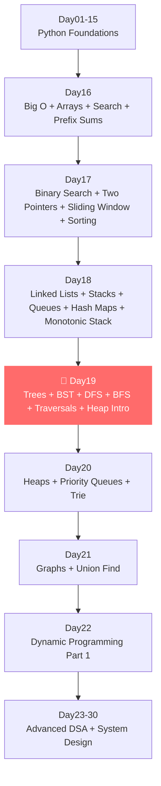
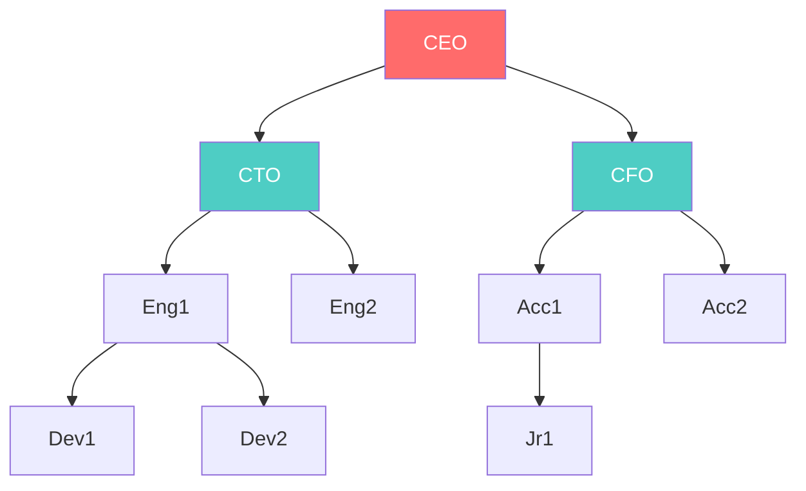
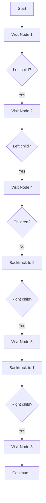
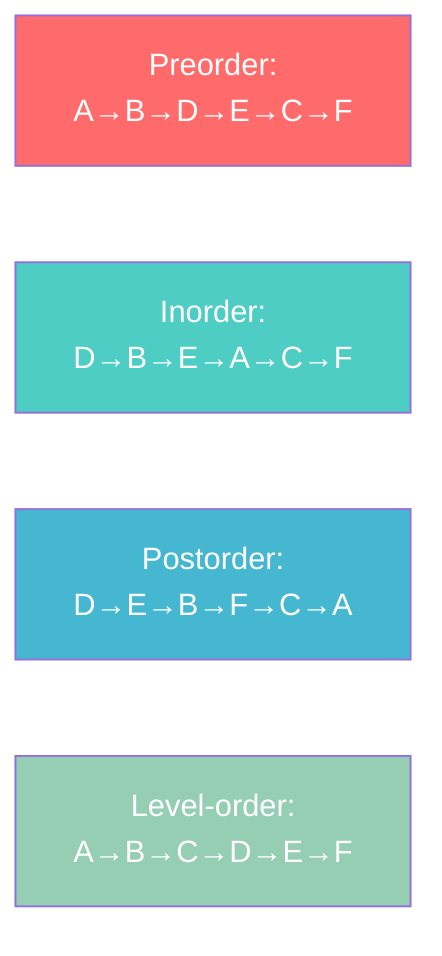
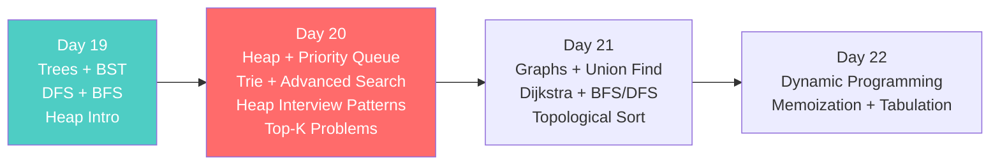

# 🌳 Day 19 — Trees, Binary Trees, BST, DFS, BFS, Tree Traversals & Heap Introduction
## Complete FAANG Interview Mastery + Python Developer Portfolio Projects


---

## 📋 Table of Contents

| Section | Topic | Status |
|---------|-------|--------|
| 01 | Complete Revision Day01–Day18 | 📖 |
| 02 | Introduction to Trees | 🌳 |
| 03 | Binary Tree Masterclass | 🔢 |
| 04 | Tree Terminology Masterclass | 📚 |
| 05 | Depth First Search (DFS) | 🔍 |
| 06 | Tree Traversals Masterclass | 🔄 |
| 07 | Breadth First Search (BFS) | 🌊 |
| 08 | Advanced Tree Problems | 💡 |
| 09 | Binary Search Tree (BST) Masterclass | 🔎 |
| 10 | BST Interview Patterns | 🎯 |
| 11 | Recursion for Trees | 🔁 |
| 12 | Tree Debugging | 🐛 |
| 13 | Heap Introduction | 📦 |
| 14 | LeetCode Tree Roadmap | 🗺️ |
| 15 | Mini Projects | 🛠️ |
| 16 | 20 Portfolio Projects | 💼 |
| 17 | Project Layout Masterclass | 📁 |
| 18 | GitHub Profile Booster Projects | 🚀 |
| 19 | Daily Practice System | 📅 |
| 20 | 1500 Practice Questions | ❓ |
| 21 | 700 Interview Questions | 🎤 |
| 22 | Assignments with Solutions | 📝 |
| 23 | Enterprise Challenge Projects | 🏢 |
| 24 | Day19 Revision Cheat Sheets | 📋 |
| 25 | Preparation for Day20 | ➡️ |

---

# SECTION 1 — COMPLETE REVISION: Day01–Day18

## 🗺️ DSA Roadmap — Where You Are



---

## 📊 Quick Revision — Day01–Day15: Python Foundations

| Day | Topic | Key Concepts |
|-----|-------|-------------|
| Day01 | Python Basics | Variables, Types, I/O |
| Day02 | Control Flow | if/elif/else, loops |
| Day03 | Functions | def, args, return, scope |
| Day04 | Data Structures | list, tuple, dict, set |
| Day05 | OOP Part 1 | Classes, Objects, Methods |
| Day06 | OOP Part 2 | Inheritance, Polymorphism |
| Day07 | File I/O | read, write, context managers |
| Day08 | Error Handling | try/except/finally |
| Day09 | Modules | import, packages, pip |
| Day10 | Comprehensions | list/dict/set comprehensions |
| Day11 | Iterators | iter, generators, yield |
| Day12 | Decorators | @wrapper, functools |
| Day13 | Functional Python | map, filter, lambda |
| Day14 | Type Hints | mypy, annotations |
| Day15 | Testing | unittest, pytest |

---

## 📋 Day16–Day18 Cheat Sheets

### 🔷 Big O Complexity Cheat Sheet (Day16)

```
O(1)       → Constant      → Array index access
O(log n)   → Logarithmic   → Binary Search
O(n)       → Linear        → Single loop
O(n log n) → Linearithmic  → Merge Sort, Heap Sort
O(n²)      → Quadratic     → Bubble Sort, nested loops
O(2ⁿ)      → Exponential   → Recursive Fibonacci (naive)
O(n!)      → Factorial     → Permutations
```

### 🔷 Array Operations Cheat Sheet (Day16)

```python
# Prefix Sum
prefix = [0] * (n + 1)
for i in range(n):
    prefix[i+1] = prefix[i] + arr[i]
range_sum = prefix[r+1] - prefix[l]  # O(1) range query

# Two Sum with Hash Map — O(n)
def two_sum(nums, target):
    seen = {}
    for i, num in enumerate(nums):
        if target - num in seen:
            return [seen[target - num], i]
        seen[num] = i
```

### 🔷 Binary Search Cheat Sheet (Day17)

```python
# Classic Binary Search — O(log n)
def binary_search(arr, target):
    lo, hi = 0, len(arr) - 1
    while lo <= hi:
        mid = lo + (hi - lo) // 2
        if arr[mid] == target: return mid
        elif arr[mid] < target: lo = mid + 1
        else: hi = mid - 1
    return -1

# Bisect Left (lower bound)
import bisect
bisect.bisect_left(arr, target)   # First position target can be inserted

# Bisect Right (upper bound)
bisect.bisect_right(arr, target)  # Last position target can be inserted
```

### 🔷 Two Pointers Cheat Sheet (Day17)

```python
# Opposite ends
l, r = 0, len(arr) - 1
while l < r:
    if condition: l += 1
    else: r -= 1

# Fast & Slow (Floyd's)
slow = fast = head
while fast and fast.next:
    slow = slow.next
    fast = fast.next.next
```

### 🔷 Sliding Window Cheat Sheet (Day17)

```python
# Fixed Window
window_sum = sum(arr[:k])
for i in range(k, n):
    window_sum += arr[i] - arr[i - k]

# Variable Window
l = 0
for r in range(n):
    # expand window
    while not valid(l, r):
        l += 1  # shrink
```

### 🔷 Linked List Cheat Sheet (Day18)

```python
class ListNode:
    def __init__(self, val=0, next=None):
        self.val = val
        self.next = next

# Reverse Linked List — O(n)
def reverse(head):
    prev, curr = None, head
    while curr:
        nxt = curr.next
        curr.next = prev
        prev = curr
        curr = nxt
    return prev

# Find Middle (Slow-Fast)
def find_middle(head):
    slow = fast = head
    while fast and fast.next:
        slow = slow.next
        fast = fast.next.next
    return slow

# Detect Cycle
def has_cycle(head):
    slow = fast = head
    while fast and fast.next:
        slow = slow.next
        fast = fast.next.next
        if slow == fast: return True
    return False
```

### 🔷 Stack Cheat Sheet (Day18)

```python
# Python Stack using list
stack = []
stack.append(x)    # push — O(1)
stack.pop()        # pop  — O(1)
stack[-1]          # peek — O(1)
len(stack) == 0    # empty check

# Monotonic Increasing Stack
stack = []
for x in arr:
    while stack and stack[-1] > x:
        stack.pop()
    stack.append(x)

# Monotonic Decreasing Stack
stack = []
for x in arr:
    while stack and stack[-1] < x:
        stack.pop()
    stack.append(x)
```

### 🔷 Queue Cheat Sheet (Day18)

```python
from collections import deque

q = deque()
q.append(x)       # enqueue — O(1)
q.popleft()       # dequeue — O(1)
q[0]              # front   — O(1)
len(q) == 0       # empty check

# BFS Template (for later use in trees/graphs)
q = deque([start])
visited = set([start])
while q:
    node = q.popleft()
    for neighbor in get_neighbors(node):
        if neighbor not in visited:
            visited.add(neighbor)
            q.append(neighbor)
```

### 🔷 Hash Map Cheat Sheet (Day18)

```python
# defaultdict
from collections import defaultdict
d = defaultdict(int)       # default 0
d = defaultdict(list)      # default []
d = defaultdict(set)       # default set()

# Counter
from collections import Counter
c = Counter("aabbc")       # {'a':2,'b':2,'c':1}
c.most_common(2)           # Top 2 frequent

# OrderedDict (LRU Cache pattern)
from collections import OrderedDict
od = OrderedDict()
od.move_to_end(key)        # move to front/back
od.popitem(last=False)     # remove from front
```

---

# SECTION 2 — INTRODUCTION TO TREES

## 🌳 What is a Tree?

A **Tree** is a non-linear, hierarchical data structure consisting of **nodes** connected by **edges**, with no cycles.

> **Real World Analogy:** Think of a company organizational chart. The CEO is at the top (root), managers branch out below, and individual contributors are at the bottom (leaves). Every person has exactly one boss (parent) but may manage multiple people (children).

### Why Trees Exist

Linear data structures (arrays, linked lists) are excellent for sequential data, but many real-world relationships are **hierarchical**:

- **File Systems** — folders contain sub-folders and files
- **HTML DOM** — `<html>` contains `<head>` and `<body>`, which contain their own children
- **Organization Charts** — CEO → VPs → Managers → Employees
- **Decision Trees** — AI models make branching decisions
- **Database Indexes** — B-Trees power MySQL and PostgreSQL indexes
- **Compilers** — Abstract Syntax Trees (AST) represent code structure
- **Network Routing** — Spanning trees minimize network paths
- **AI/ML** — Random Forests, XGBoost use tree ensembles

---

## 🖼️ Tree Visualization

```
              CEO (Root)
             /          \
          CTO            CFO
         /   \          /   \
       Eng1  Eng2    Acc1   Acc2
       / \              \
     Dev1 Dev2          Jr1

Legend:
  CEO  = Root Node (no parent)
  CTO, CFO = Internal Nodes (have parent AND children)
  Eng1, Eng2, Acc1 = Internal Nodes
  Dev1, Dev2, Jr1, Acc2 = Leaf Nodes (no children)
```

### Mermaid Tree Diagram



---

## 📐 Formal Tree Definition

A **Tree T** is a set of nodes where:
1. There is exactly **one distinguished node** called the **root**
2. The remaining nodes are partitioned into disjoint sets T₁, T₂, ..., Tₖ, each of which is itself a tree (called **subtrees** of the root)
3. There are **no cycles**
4. Every non-root node has **exactly one parent**

**Key Insight:** A tree with `n` nodes has exactly `n - 1` edges.

---

## 🏗️ Applications of Trees

| Application | Tree Type | Use Case |
|-------------|-----------|----------|
| File System | General Tree | Folders and files hierarchy |
| HTML DOM | General Tree | Web page structure |
| Database Index | B-Tree / B+ Tree | Fast data retrieval |
| Autocomplete | Trie | Prefix-based search |
| AI Decision Making | Decision Tree | Classification models |
| Compression | Huffman Tree | Data compression (ZIP) |
| Network Routing | Spanning Tree | Optimal packet routing |
| Expression Parsing | Expression Tree | Compilers, calculators |
| Priority Queue | Heap (Binary Tree) | Task scheduling |
| Version Control | Merkle Tree | Git commit history |

---

# SECTION 3 — BINARY TREE MASTERCLASS

## What is a Binary Tree?

A **Binary Tree** is a tree where each node has **at most 2 children**, called the **left child** and the **right child**.

```
Binary Tree Node:
    ┌─────────────────────┐
    │  left │ data │ right│
    └─────────────────────┘
       ↓               ↓
  left child       right child
  (or None)        (or None)
```

### Python Node Implementation

```python
class TreeNode:
    """
    Binary Tree Node
    
    Attributes:
        val: Node value (any comparable type)
        left: Reference to left child (TreeNode or None)
        right: Reference to right child (TreeNode or None)
    """
    def __init__(self, val=0, left=None, right=None):
        self.val = val
        self.left = left
        self.right = right
    
    def __repr__(self):
        return f"TreeNode({self.val})"
```

### Building a Binary Tree Manually

```python
# Build this tree:
#        1
#       / \
#      2   3
#     / \ / \
#    4  5 6  7

root = TreeNode(1)
root.left = TreeNode(2)
root.right = TreeNode(3)
root.left.left = TreeNode(4)
root.left.right = TreeNode(5)
root.right.left = TreeNode(6)
root.right.right = TreeNode(7)
```

### Building from List (Level Order)

```python
from collections import deque

def build_tree_from_list(values):
    """
    Build binary tree from level-order list.
    None values represent missing nodes.
    
    Example: [1, 2, 3, None, 5, 6, 7]
         1
        / \\
       2   3
        \\ / \\
        5 6  7
    """
    if not values or values[0] is None:
        return None
    
    root = TreeNode(values[0])
    queue = deque([root])
    i = 1
    
    while queue and i < len(values):
        node = queue.popleft()
        
        # Assign left child
        if i < len(values):
            if values[i] is not None:
                node.left = TreeNode(values[i])
                queue.append(node.left)
            i += 1
        
        # Assign right child
        if i < len(values):
            if values[i] is not None:
                node.right = TreeNode(values[i])
                queue.append(node.right)
            i += 1
    
    return root

# Usage
root = build_tree_from_list([1, 2, 3, 4, 5, 6, 7])
```

### Tree to List (Level Order Serialization)

```python
def tree_to_list(root):
    """Serialize tree to level-order list."""
    if not root:
        return []
    
    result = []
    queue = deque([root])
    
    while queue:
        node = queue.popleft()
        if node:
            result.append(node.val)
            queue.append(node.left)
            queue.append(node.right)
        else:
            result.append(None)
    
    # Remove trailing Nones
    while result and result[-1] is None:
        result.pop()
    
    return result
```

---

## 🖼️ Memory Layout of a Binary Tree

```
Memory Representation:

Address  Node    left_ptr  val  right_ptr
0x100    node1   0x200      1    0x300
0x200    node2   0x400      2    0x500
0x300    node3   0x600      3    0x700
0x400    node4   None       4    None
0x500    node5   None       5    None
0x600    node6   None       6    None
0x700    node7   None       7    None

Tree Structure:
        1 (0x100)
       / \
    2(0x200) 3(0x300)
    /\        /\
  4   5      6   7
```

---

## ⏱️ Binary Tree Complexity Analysis

| Operation | Average Case | Worst Case (Skewed) | Notes |
|-----------|-------------|---------------------|-------|
| Access | O(n) | O(n) | No direct access by index |
| Search | O(n) | O(n) | Must traverse all nodes |
| Insertion | O(n) | O(n) | Need to find position first |
| Deletion | O(n) | O(n) | Need to find node first |
| Traversal | O(n) | O(n) | Must visit all nodes |
| Height | O(log n) avg | O(n) skewed | Determines tree balance |

**Space Complexity:** O(n) for storing n nodes + O(h) for recursion stack where h = height.

---

# SECTION 4 — TREE TERMINOLOGY MASTERCLASS

## Complete Visual Glossary

```
                    A          ← Root (depth=0, level=1)
                  / | \
                 B  C  D       ← Internal Nodes (depth=1, level=2)
                /\    / \
               E  F  G   H    ← Internal/Leaf Nodes (depth=2, level=3)
              /       \
             I         J      ← Leaf Nodes (depth=3, level=4)
```

| Term | Definition | Example Above |
|------|-----------|---------------|
| **Root** | Top node, no parent | A |
| **Parent** | Node with children | B is parent of E, F |
| **Child** | Node with a parent | E, F are children of B |
| **Sibling** | Nodes sharing same parent | E and F are siblings |
| **Leaf** | Node with no children | I, F, C, J, H are leaves |
| **Ancestor** | All nodes on path to root | A, B are ancestors of I |
| **Descendant** | All nodes in subtree | E, F, I are descendants of B |
| **Degree** | Number of children | Degree of A=3, B=2, E=1 |
| **Depth** | Distance from root | Depth of I = 3 |
| **Height** | Longest path to leaf | Height of tree = 3 |
| **Level** | Depth + 1 | Level of I = 4 |
| **Subtree** | Node + all its descendants | {B, E, F, I} is subtree of B |

---

## 🌳 Types of Binary Trees

### 1. Full Binary Tree
Every node has **0 or 2 children** (never 1).

```
Full Binary Tree:
        1
       / \
      2   3
     / \
    4   5
```

### 2. Complete Binary Tree
All levels are filled **except possibly the last**, and the last level has all nodes **as far left as possible**.

```
Complete Binary Tree:
        1
       / \
      2   3
     / \ /
    4  5 6
```

### 3. Perfect Binary Tree
All internal nodes have **exactly 2 children** and all **leaves are at the same level**.

```
Perfect Binary Tree:
        1
       / \
      2   3
     / \ / \
    4  5 6  7
```

### 4. Balanced Binary Tree
The height of the left and right subtrees of every node differ by **at most 1**.

```
Balanced:              Unbalanced:
     1                      1
    / \                     /
   2   3                   2
  / \                     /
 4   5                   3
```

### 5. Degenerate (Skewed) Tree
Every node has **only one child**. Essentially a linked list.

```
Left Skewed:    Right Skewed:
1               1
 \               \
  2               2
   \               \
    3               3
     \               \
      4               4
```

### Complexity Comparison

| Tree Type | Height | Search | Insert | Space |
|-----------|--------|--------|--------|-------|
| Perfect | O(log n) | O(log n) | O(log n) | O(n) |
| Complete | O(log n) | O(n) | O(log n) | O(n) |
| Balanced | O(log n) | O(n) | O(n) | O(n) |
| Degenerate | O(n) | O(n) | O(n) | O(n) |

---

## 🔢 Tree Height and Depth Formulas

```python
# Height of a node = longest path to a leaf
def height(node):
    if not node:
        return -1  # or 0 depending on convention
    return 1 + max(height(node.left), height(node.right))

# Depth of a node = distance from root
def depth(root, target, d=0):
    if not root:
        return -1
    if root.val == target:
        return d
    left = depth(root.left, target, d + 1)
    if left != -1:
        return left
    return depth(root.right, target, d + 1)

# Number of nodes in a perfect binary tree of height h
# n = 2^(h+1) - 1

# Height of a perfect binary tree with n nodes
# h = floor(log2(n))
```

---

# SECTION 5 — DEPTH FIRST SEARCH (DFS)

## What is DFS?

**Depth First Search (DFS)** is a tree/graph traversal algorithm that explores as **far as possible along each branch** before backtracking.

> **Real World Analogy:** Imagine exploring a maze. DFS goes down one path as deep as possible. When it hits a dead end, it backtracks to the last junction and tries another path. It fully explores one branch before trying siblings.

---

## 🔄 DFS Visualization

```
Tree:
        1
       / \
      2   3
     / \ / \
    4  5 6  7

DFS Order (Preorder): 1 → 2 → 4 → 5 → 3 → 6 → 7

Step-by-step:
Visit 1 → go left
  Visit 2 → go left
    Visit 4 → no children → backtrack
  Visit 5 → no children → backtrack
Visit 3 → go left
  Visit 6 → no children → backtrack
Visit 7 → no children → done
```



---

## 📝 Recursive DFS Implementation

```python
class BinaryTree:
    """Complete Binary Tree with DFS implementations."""
    
    def __init__(self):
        self.root = None
    
    # ─── Recursive DFS (Preorder) ───────────────────────────────────────
    def dfs_preorder(self, node):
        """
        Visit: Root → Left → Right
        Time: O(n) | Space: O(h) where h = height
        """
        if not node:
            return []
        result = [node.val]
        result += self.dfs_preorder(node.left)
        result += self.dfs_preorder(node.right)
        return result
    
    # ─── Generic Recursive DFS ────────────────────────────────────────
    def dfs_recursive(self, node, visit_fn):
        """
        Generic DFS — applies visit_fn to each node.
        Template for most tree problems.
        """
        if not node:
            return
        visit_fn(node)                        # pre-order action
        self.dfs_recursive(node.left, visit_fn)
        self.dfs_recursive(node.right, visit_fn)
    
    # ─── Find Node with DFS ───────────────────────────────────────────
    def dfs_find(self, node, target):
        """
        Find a value using DFS.
        Time: O(n) | Space: O(h)
        Returns the node if found, None otherwise.
        """
        if not node:
            return None
        if node.val == target:
            return node
        
        left_result = self.dfs_find(node.left, target)
        if left_result:
            return left_result
        
        return self.dfs_find(node.right, target)
    
    # ─── Count Nodes with DFS ─────────────────────────────────────────
    def count_nodes(self, node):
        """Count total nodes. Time: O(n) | Space: O(h)"""
        if not node:
            return 0
        return 1 + self.count_nodes(node.left) + self.count_nodes(node.right)
    
    # ─── Sum All Nodes ────────────────────────────────────────────────
    def sum_nodes(self, node):
        """Sum all node values. Time: O(n) | Space: O(h)"""
        if not node:
            return 0
        return node.val + self.sum_nodes(node.left) + self.sum_nodes(node.right)
```

---

## ⚙️ Iterative DFS Implementation

```python
def dfs_iterative_preorder(root):
    """
    Iterative DFS using explicit stack.
    Avoids Python recursion limit for very deep trees.
    
    Time: O(n) | Space: O(h)
    """
    if not root:
        return []
    
    result = []
    stack = [root]
    
    while stack:
        node = stack.pop()         # Pop from stack (LIFO)
        result.append(node.val)    # Visit node
        
        # Push right FIRST so left is processed first (LIFO)
        if node.right:
            stack.append(node.right)
        if node.left:
            stack.append(node.left)
    
    return result

# Dry Run on tree [1, 2, 3, 4, 5, 6, 7]:
# stack=[1]
# pop 1 → result=[1], push 3, push 2 → stack=[3,2]
# pop 2 → result=[1,2], push 5, push 4 → stack=[3,5,4]
# pop 4 → result=[1,2,4], no children → stack=[3,5]
# pop 5 → result=[1,2,4,5], no children → stack=[3]
# pop 3 → result=[1,2,4,5,3], push 7, push 6 → stack=[7,6]
# pop 6 → result=[1,2,4,5,3,6] → stack=[7]
# pop 7 → result=[1,2,4,5,3,6,7] → stack=[]
# Final: [1,2,4,5,3,6,7] ✓


def dfs_iterative_inorder(root):
    """
    Iterative Inorder DFS.
    Time: O(n) | Space: O(h)
    """
    result = []
    stack = []
    curr = root
    
    while curr or stack:
        # Go as far left as possible
        while curr:
            stack.append(curr)
            curr = curr.left
        
        # Visit node
        curr = stack.pop()
        result.append(curr.val)
        
        # Move to right subtree
        curr = curr.right
    
    return result


def dfs_iterative_postorder(root):
    """
    Iterative Postorder DFS.
    Strategy: Reverse of (Root → Right → Left)
    Time: O(n) | Space: O(h)
    """
    if not root:
        return []
    
    result = []
    stack = [root]
    
    while stack:
        node = stack.pop()
        result.append(node.val)
        
        if node.left:
            stack.append(node.left)
        if node.right:
            stack.append(node.right)
    
    return result[::-1]  # Reverse gives postorder
```

---

## 🎯 DFS Applications

| Application | DFS Type | Why |
|-------------|----------|-----|
| Tree traversal | Preorder/Inorder/Postorder | Visit all nodes |
| Path finding | DFS with backtracking | Explore all paths |
| Cycle detection | DFS with visited set | Mark and detect revisit |
| Topological sort | DFS postorder | Process dependencies |
| Tree height/depth | Recursive DFS | Explore deepest path |
| Find all paths | DFS + path tracking | Enumerate all routes |
| Serialize/Deserialize | Preorder DFS | Rebuild tree structure |
| Expression evaluation | Postorder DFS | Evaluate sub-expressions |

---

# SECTION 6 — TREE TRAVERSALS MASTERCLASS

## The Three Core DFS Traversals

```
Tree:
        1
       / \
      2   3
     / \
    4   5

Preorder  (Root, Left, Right): 1, 2, 4, 5, 3
Inorder   (Left, Root, Right): 4, 2, 5, 1, 3
Postorder (Left, Right, Root): 4, 5, 2, 3, 1
```

---

## 📋 Preorder Traversal (Root → Left → Right)

**Use Cases:**
- Serialize/Clone a tree
- Print directory structure
- Create a copy of tree
- Prefix expression evaluation

```python
# Recursive Preorder
def preorder(root):
    """
    Visit root BEFORE subtrees.
    Time: O(n) | Space: O(h) recursion stack
    """
    if not root:
        return []
    return [root.val] + preorder(root.left) + preorder(root.right)

# Recursive Preorder (in-place, faster)
def preorder_inplace(root, result=None):
    if result is None:
        result = []
    if not root:
        return result
    result.append(root.val)          # ROOT first
    preorder_inplace(root.left, result)
    preorder_inplace(root.right, result)
    return result

# Iterative Preorder
def preorder_iterative(root):
    if not root:
        return []
    result, stack = [], [root]
    while stack:
        node = stack.pop()
        result.append(node.val)
        if node.right: stack.append(node.right)  # Right first (LIFO)
        if node.left:  stack.append(node.left)
    return result
```

### 🔍 Dry Run — Preorder on [1,2,3,4,5,None,None]

```
Tree:
     1
    / \
   2   3
  / \
 4   5

Step 1: Call preorder(1)
  → result = [1]
  → Call preorder(2)
    Step 2: result = [1, 2]
    → Call preorder(4)
      Step 3: result = [1, 2, 4]
      → Call preorder(None) → return []
      → Call preorder(None) → return []
    → Call preorder(5)
      Step 4: result = [1, 2, 4, 5]
      → Both children None
  → Call preorder(3)
    Step 5: result = [1, 2, 4, 5, 3]
    → Both children None

Final: [1, 2, 4, 5, 3] ✓
```

---

## 📋 Inorder Traversal (Left → Root → Right)

**Key Property:** For a BST, inorder traversal gives a **sorted sequence**!

**Use Cases:**
- Get sorted elements from BST
- Validate BST property
- Find kth smallest/largest in BST
- Expression tree evaluation (infix notation)

```python
# Recursive Inorder
def inorder(root):
    """
    Visit left subtree, THEN root, THEN right subtree.
    For BST: produces sorted output.
    Time: O(n) | Space: O(h)
    """
    if not root:
        return []
    return inorder(root.left) + [root.val] + inorder(root.right)

# Iterative Inorder (Morris-style conceptually)
def inorder_iterative(root):
    result = []
    stack = []
    curr = root
    
    while curr or stack:
        # Dive left
        while curr:
            stack.append(curr)
            curr = curr.left
        
        # Process node (leftmost unprocessed)
        curr = stack.pop()
        result.append(curr.val)   # ROOT action happens here
        
        # Move to right subtree
        curr = curr.right
    
    return result
```

### 🔍 Dry Run — Inorder on BST [4,2,6,1,3,5,7]

```
BST:
        4
       / \
      2   6
     / \ / \
    1  3 5  7

Inorder should give: [1, 2, 3, 4, 5, 6, 7]

Step 1: curr=4, stack=[4], go left to 2
Step 2: curr=2, stack=[4,2], go left to 1
Step 3: curr=1, stack=[4,2,1], go left → None
Step 4: Pop 1, result=[1], curr=1.right=None
Step 5: Pop 2, result=[1,2], curr=2.right=3
Step 6: curr=3, stack=[4,3], go left → None
Step 7: Pop 3, result=[1,2,3], curr=3.right=None
Step 8: Pop 4, result=[1,2,3,4], curr=4.right=6
Step 9-12: Process right subtree → [5,6,7]

Final: [1,2,3,4,5,6,7] ✓ SORTED!
```

---

## 📋 Postorder Traversal (Left → Right → Root)

**Use Cases:**
- Delete/free a tree (delete children before parent)
- Evaluate expression trees (bottom-up)
- Calculate directory sizes (calculate sub-sizes first)
- Dependency resolution

```python
# Recursive Postorder
def postorder(root):
    """
    Visit left, right, THEN root.
    Root is visited LAST.
    Time: O(n) | Space: O(h)
    """
    if not root:
        return []
    return postorder(root.left) + postorder(root.right) + [root.val]

# Iterative Postorder (Two Stack Method)
def postorder_iterative_2stack(root):
    if not root:
        return []
    
    stack1, stack2 = [root], []
    
    while stack1:
        node = stack1.pop()
        stack2.append(node.val)
        if node.left:  stack1.append(node.left)
        if node.right: stack1.append(node.right)
    
    return stack2[::-1]

# Iterative Postorder (Single Stack)
def postorder_iterative(root):
    result = []
    stack = []
    prev = None
    
    while root or stack:
        while root:
            stack.append(root)
            root = root.left
        
        root = stack[-1]
        
        # If right subtree not processed yet
        if root.right and prev != root.right:
            root = root.right
        else:
            result.append(root.val)
            prev = root
            stack.pop()
            root = None
    
    return result
```

---

## 📊 Traversal Summary Table

| Traversal | Order | Key Use Case | Mnemonic |
|-----------|-------|-------------|---------|
| Preorder | Root → L → R | Clone tree, serialize | **Pre**pare root first |
| Inorder | L → Root → R | BST sorted output | **In** order = sorted |
| Postorder | L → R → Root | Delete tree, eval expr | **Post**: root last |
| Level-order | Level by level | BFS, shortest path | Floor by floor |

---

## 🔄 Traversal Visualization (Same Tree, Different Orders)

```
Tree:
        A
       / \
      B   C
     / \   \
    D   E   F

Preorder (NLR):   A B D E C F
Inorder  (LNR):   D B E A C F
Postorder (LRN):  D E B F C A
Level-order:      A B C D E F
```



---

# SECTION 7 — BREADTH FIRST SEARCH (BFS)

## What is BFS?

**Breadth First Search (BFS)** traverses a tree **level by level**, visiting all nodes at depth `d` before visiting nodes at depth `d+1`.

> **Real World Analogy:** Imagine ripples spreading in a pond. The ripple expands outward in all directions equally — it doesn't go deep in one direction first. BFS works the same way, expanding level by level.

---

## 🌊 BFS Visualization

```
Tree:
        1          ← Level 0
       / \
      2   3        ← Level 1
     / \ / \
    4  5 6  7      ← Level 2

BFS visits: 1 → 2 → 3 → 4 → 5 → 6 → 7

Queue states:
Initial:    [1]
After 1:    [2, 3]
After 2:    [3, 4, 5]
After 3:    [4, 5, 6, 7]
After 4:    [5, 6, 7]
After 5:    [6, 7]
After 6:    [7]
After 7:    []
```

---

## 📝 BFS Implementation

```python
from collections import deque

def bfs_level_order(root):
    """
    Level-order traversal using BFS.
    Returns list of lists — each inner list is one level.
    
    Time: O(n) | Space: O(w) where w = max width of tree
    Max width of perfect binary tree = n/2 (last level)
    """
    if not root:
        return []
    
    result = []
    queue = deque([root])
    
    while queue:
        level_size = len(queue)    # How many nodes in this level
        current_level = []
        
        for _ in range(level_size):
            node = queue.popleft()
            current_level.append(node.val)
            
            if node.left:
                queue.append(node.left)
            if node.right:
                queue.append(node.right)
        
        result.append(current_level)
    
    return result

# Example:
# Tree [1, 2, 3, 4, 5, 6, 7]
# Output: [[1], [2, 3], [4, 5, 6, 7]]


def bfs_flat(root):
    """
    Flat BFS — returns all values in level order.
    Time: O(n) | Space: O(w)
    """
    if not root:
        return []
    
    result = []
    queue = deque([root])
    
    while queue:
        node = queue.popleft()
        result.append(node.val)
        
        if node.left:  queue.append(node.left)
        if node.right: queue.append(node.right)
    
    return result
```

### 🔍 BFS Dry Run

```
Tree:
        1
       / \
      2   3
     / \
    4   5

Step 1: queue=[1]
Step 2: Dequeue 1, enqueue 2,3. queue=[2,3], result=[[1]]
Step 3: Dequeue 2, enqueue 4,5. Dequeue 3 (no children). 
        queue=[4,5], result=[[1],[2,3]]
Step 4: Dequeue 4 (no children). Dequeue 5 (no children).
        queue=[], result=[[1],[2,3],[4,5]]

Final: [[1],[2,3],[4,5]] ✓
```

---

## 🎯 BFS Advanced Patterns

```python
def bfs_right_side_view(root):
    """
    LeetCode 199: Binary Tree Right Side View
    Returns the rightmost node at each level.
    Time: O(n) | Space: O(w)
    """
    if not root:
        return []
    
    result = []
    queue = deque([root])
    
    while queue:
        level_size = len(queue)
        for i in range(level_size):
            node = queue.popleft()
            if i == level_size - 1:       # Last node of level
                result.append(node.val)
            if node.left:  queue.append(node.left)
            if node.right: queue.append(node.right)
    
    return result


def bfs_level_averages(root):
    """
    Average of levels in binary tree.
    Time: O(n) | Space: O(w)
    """
    if not root:
        return []
    
    result = []
    queue = deque([root])
    
    while queue:
        level_size = len(queue)
        level_sum = 0
        
        for _ in range(level_size):
            node = queue.popleft()
            level_sum += node.val
            if node.left:  queue.append(node.left)
            if node.right: queue.append(node.right)
        
        result.append(level_sum / level_size)
    
    return result


def bfs_zigzag(root):
    """
    LeetCode 103: Zigzag Level Order Traversal
    Alternate direction each level.
    Time: O(n) | Space: O(w)
    """
    if not root:
        return []
    
    result = []
    queue = deque([root])
    left_to_right = True
    
    while queue:
        level_size = len(queue)
        level = deque()
        
        for _ in range(level_size):
            node = queue.popleft()
            if left_to_right:
                level.append(node.val)
            else:
                level.appendleft(node.val)    # Reverse order
            if node.left:  queue.append(node.left)
            if node.right: queue.append(node.right)
        
        result.append(list(level))
        left_to_right = not left_to_right     # Flip direction
    
    return result
```

---

## 📊 DFS vs BFS Comparison

| Aspect | DFS | BFS |
|--------|-----|-----|
| **Data Structure** | Stack (or recursion) | Queue |
| **Memory (avg)** | O(h) — height | O(w) — width |
| **Memory (worst)** | O(n) skewed tree | O(n) full last level |
| **Finds shortest path?** | No | Yes (unweighted) |
| **Complete?** | No (infinite branch) | Yes |
| **Best for** | Deep paths, backtracking | Level-by-level, shortest path |
| **Tree traversals** | Preorder/Inorder/Postorder | Level-order |
| **Cycle detection** | Yes (via visited set) | Yes (via visited set) |

---

# SECTION 8 — ADVANCED TREE PROBLEMS

## Problem 1: Maximum Depth of Binary Tree

**LeetCode 104 | Easy | Core Pattern: Recursive DFS**

```python
def max_depth(root):
    """
    Find maximum depth (height) of binary tree.
    
    Insight: Depth of tree = 1 + max(depth of left, depth of right)
    
    Time: O(n) | Space: O(h)
    
    Dry Run on:
          1
         / \\
        2   3
       / \\
      4   5
    
    max_depth(1)
      = 1 + max(max_depth(2), max_depth(3))
      max_depth(2) = 1 + max(max_depth(4), max_depth(5))
                   = 1 + max(1, 1) = 2
      max_depth(3) = 1 + max(0, 0) = 1
      = 1 + max(2, 1) = 3 ✓
    """
    if not root:
        return 0
    return 1 + max(max_depth(root.left), max_depth(root.right))

# BFS approach
def max_depth_bfs(root):
    if not root:
        return 0
    depth = 0
    queue = deque([root])
    while queue:
        depth += 1
        for _ in range(len(queue)):
            node = queue.popleft()
            if node.left:  queue.append(node.left)
            if node.right: queue.append(node.right)
    return depth
```

---

## Problem 2: Minimum Depth

**LeetCode 111 | Easy**

```python
def min_depth(root):
    """
    ⚠️ COMMON MISTAKE: Don't just take min of left and right!
    A node with only one child is NOT a leaf.
    
    Time: O(n) | Space: O(h)
    """
    if not root:
        return 0
    
    # Leaf node
    if not root.left and not root.right:
        return 1
    
    # Only right subtree exists
    if not root.left:
        return 1 + min_depth(root.right)
    
    # Only left subtree exists
    if not root.right:
        return 1 + min_depth(root.left)
    
    # Both subtrees exist
    return 1 + min(min_depth(root.left), min_depth(root.right))
```

---

## Problem 3: Diameter of Binary Tree

**LeetCode 543 | Easy → Medium**

```python
def diameter_of_binary_tree(root):
    """
    Diameter = longest path between any two nodes.
    Path may or may not pass through root!
    
    Key Insight: For each node, the diameter through it =
                 height(left) + height(right)
    
    We track global max and return height for parent's calculation.
    
    Time: O(n) | Space: O(h)
    """
    max_diameter = [0]  # Use list for mutable closure
    
    def height(node):
        if not node:
            return 0
        
        left_h = height(node.left)
        right_h = height(node.right)
        
        # Update diameter through this node
        max_diameter[0] = max(max_diameter[0], left_h + right_h)
        
        # Return height for parent
        return 1 + max(left_h, right_h)
    
    height(root)
    return max_diameter[0]
```

---

## Problem 4: Balanced Binary Tree

**LeetCode 110 | Easy**

```python
def is_balanced(root):
    """
    Check if binary tree is height-balanced.
    
    Approach: Return -1 if unbalanced, height otherwise.
    This avoids recomputing height (O(n²) → O(n)).
    
    Time: O(n) | Space: O(h)
    """
    def check(node):
        if not node:
            return 0
        
        left = check(node.left)
        if left == -1: return -1    # Left subtree unbalanced
        
        right = check(node.right)
        if right == -1: return -1   # Right subtree unbalanced
        
        if abs(left - right) > 1:   # Current node unbalanced
            return -1
        
        return 1 + max(left, right) # Return height
    
    return check(root) != -1
```

---

## Problem 5: Symmetric Tree

**LeetCode 101 | Easy**

```python
def is_symmetric(root):
    """
    Check if tree is mirror of itself.
    
    Insight: Two trees are mirrors if:
    1. Their roots have same value
    2. Left's left mirrors Right's right
    3. Left's right mirrors Right's left
    
    Time: O(n) | Space: O(h)
    """
    def is_mirror(left, right):
        if not left and not right: return True
        if not left or not right:  return False
        
        return (left.val == right.val and
                is_mirror(left.left, right.right) and
                is_mirror(left.right, right.left))
    
    return is_mirror(root.left, root.right)

# BFS approach
def is_symmetric_bfs(root):
    if not root:
        return True
    queue = deque([(root.left, root.right)])
    while queue:
        left, right = queue.popleft()
        if not left and not right: continue
        if not left or not right:  return False
        if left.val != right.val:  return False
        queue.append((left.left, right.right))
        queue.append((left.right, right.left))
    return True
```

---

## Problem 6: Path Sum

**LeetCode 112 | Easy**

```python
def has_path_sum(root, target_sum):
    """
    Does any root-to-leaf path sum equal target?
    
    Insight: Subtract node value from target as we go down.
    At leaf, check if remaining target == 0.
    
    Time: O(n) | Space: O(h)
    """
    if not root:
        return False
    
    # Leaf node check
    if not root.left and not root.right:
        return root.val == target_sum
    
    remaining = target_sum - root.val
    return (has_path_sum(root.left, remaining) or
            has_path_sum(root.right, remaining))


def path_sum_all_paths(root, target):
    """
    LeetCode 113: Return all root-to-leaf paths with target sum.
    Time: O(n) | Space: O(n)
    """
    result = []
    
    def dfs(node, remaining, path):
        if not node:
            return
        
        path.append(node.val)
        
        if not node.left and not node.right and remaining == node.val:
            result.append(list(path))  # Found valid path
        else:
            dfs(node.left, remaining - node.val, path)
            dfs(node.right, remaining - node.val, path)
        
        path.pop()  # Backtrack
    
    dfs(root, target, [])
    return result
```

---

## Problem 7: Count Nodes

```python
def count_nodes(root):
    """Count all nodes. Time: O(n)"""
    if not root: return 0
    return 1 + count_nodes(root.left) + count_nodes(root.right)

def count_leaves(root):
    """Count leaf nodes only."""
    if not root: return 0
    if not root.left and not root.right: return 1
    return count_leaves(root.left) + count_leaves(root.right)

def count_complete_tree_nodes(root):
    """
    LeetCode 222: Count nodes in COMPLETE binary tree.
    Optimized: O(log²n) instead of O(n)
    """
    if not root:
        return 0
    
    left_h = right_h = 0
    left, right = root, root
    
    while left:
        left_h += 1
        left = left.left
    while right:
        right_h += 1
        right = right.right
    
    if left_h == right_h:
        return (1 << left_h) - 1   # Perfect tree: 2^h - 1
    
    return 1 + count_complete_tree_nodes(root.left) + count_complete_tree_nodes(root.right)
```

---

## Problem 8: Invert Binary Tree

**LeetCode 226 | Easy**

```python
def invert_tree(root):
    """
    Famous "Google rejected a candidate for this" problem.
    
    Insight: Swap left and right children at every node.
    
    Time: O(n) | Space: O(h)
    
    Before:       After:
        4             4
       / \\           / \\
      2   7         7   2
     / \ / \\       / \ / \\
    1  3 6  9     9  6 3  1
    """
    if not root:
        return None
    
    # Swap children
    root.left, root.right = root.right, root.left
    
    # Recursively invert subtrees
    invert_tree(root.left)
    invert_tree(root.right)
    
    return root
```

---

## Problem 9: Lowest Common Ancestor (LCA)

**LeetCode 236 | Medium**

```python
def lowest_common_ancestor(root, p, q):
    """
    Find the LCA of nodes p and q in binary tree.
    
    Logic:
    - If root is None: return None
    - If root is p or q: return root (it's the LCA candidate)
    - Recurse left and right
    - If both return non-None: root is the LCA
    - Otherwise: return whichever is non-None
    
    Time: O(n) | Space: O(h)
    """
    if not root:
        return None
    if root == p or root == q:
        return root
    
    left = lowest_common_ancestor(root.left, p, q)
    right = lowest_common_ancestor(root.right, p, q)
    
    if left and right:
        return root    # p and q on different sides
    
    return left if left else right
```

---

# SECTION 9 — BINARY SEARCH TREE (BST) MASTERCLASS

## What is a BST?

A **Binary Search Tree** is a binary tree with a special ordering property:

> For every node N:
> - All values in **N's left subtree** are **less than N.val**
> - All values in **N's right subtree** are **greater than N.val**
> - Both subtrees are also valid BSTs (recursive property)

```
Valid BST:
        8
       / \
      3   10
     / \    \
    1   6    14
       / \   /
      4   7 13

For node 8: left subtree {1,3,4,6,7} < 8, right subtree {10,13,14} > 8 ✓
For node 3: left {1} < 3, right {4,6,7} > 3 ✓
...and so on for all nodes ✓
```

---

## 🔍 BST Search

```python
def search_bst(root, target):
    """
    Search BST using BST property.
    Average: O(log n) for balanced | Worst: O(n) for skewed
    """
    if not root:
        return None
    if root.val == target:
        return root
    
    # Use BST property to eliminate half the tree
    if target < root.val:
        return search_bst(root.left, target)
    else:
        return search_bst(root.right, target)

# Iterative (more efficient, no stack overhead)
def search_bst_iter(root, target):
    while root:
        if root.val == target:
            return root
        elif target < root.val:
            root = root.left
        else:
            root = root.right
    return None
```

---

## ➕ BST Insertion

```python
def insert_bst(root, val):
    """
    Insert a value into BST, maintaining BST property.
    Average: O(log n) | Worst: O(n)
    Returns the root of the modified tree.
    """
    if not root:
        return TreeNode(val)    # Base: create new node
    
    if val < root.val:
        root.left = insert_bst(root.left, val)
    elif val > root.val:
        root.right = insert_bst(root.right, val)
    # If val == root.val: BST typically ignores duplicates
    
    return root

# Iterative Insert
def insert_bst_iter(root, val):
    new_node = TreeNode(val)
    if not root:
        return new_node
    
    curr = root
    while True:
        if val < curr.val:
            if curr.left:
                curr = curr.left
            else:
                curr.left = new_node
                break
        else:
            if curr.right:
                curr = curr.right
            else:
                curr.right = new_node
                break
    
    return root
```

---

## ❌ BST Deletion

Deletion is the most complex BST operation. Three cases:

```
Case 1: Delete a LEAF node (no children)
        → Simply remove it

Case 2: Delete a node with ONE child
        → Replace node with its child

Case 3: Delete a node with TWO children
        → Replace with inorder successor (smallest in right subtree)
          OR inorder predecessor (largest in left subtree)
```

```python
def delete_bst(root, key):
    """
    Delete key from BST.
    
    Strategy for 2-child case: 
    Find inorder successor (min of right subtree),
    copy its value to current node,
    delete the inorder successor from right subtree.
    
    Time: O(h) average O(log n) | Worst: O(n)
    """
    if not root:
        return None
    
    if key < root.val:
        root.left = delete_bst(root.left, key)
    elif key > root.val:
        root.right = delete_bst(root.right, key)
    else:
        # Found the node to delete
        
        # Case 1 & 2: 0 or 1 child
        if not root.left:
            return root.right
        if not root.right:
            return root.left
        
        # Case 3: 2 children
        # Find inorder successor (min of right subtree)
        successor = find_min(root.right)
        root.val = successor.val              # Copy successor's value
        root.right = delete_bst(root.right, successor.val)  # Delete successor
    
    return root

def find_min(node):
    """Find minimum node in BST (leftmost node)."""
    while node.left:
        node = node.left
    return node

def find_max(node):
    """Find maximum node in BST (rightmost node)."""
    while node.right:
        node = node.right
    return node
```

### 🔍 Delete Dry Run

```
Delete 3 from BST:
        5
       / \
      3   7
     / \   \
    2   4   8

Step 1: key=3 < root.val=5, go left
Step 2: key=3 == node.val=3, found target
Step 3: Node has 2 children (2 and 4)
Step 4: Find inorder successor = min(right subtree) = 4
Step 5: Copy 4 to current node
Step 6: Delete 4 from right subtree (it's a leaf → remove)

Result:
        5
       / \
      4   7
     /     \
    2       8
```

---

## 📊 BST Min, Max, Predecessor, Successor

```python
def bst_min(root):
    """BST minimum = leftmost node. O(h)"""
    if not root: return None
    while root.left:
        root = root.left
    return root.val

def bst_max(root):
    """BST maximum = rightmost node. O(h)"""
    if not root: return None
    while root.right:
        root = root.right
    return root.val

def inorder_successor(root, p):
    """
    Find inorder successor of node p in BST.
    Successor = smallest value greater than p.val
    """
    successor = None
    
    while root:
        if p.val < root.val:
            successor = root    # Potential successor
            root = root.left
        else:
            root = root.right
    
    return successor

def inorder_predecessor(root, p):
    """
    Find inorder predecessor of node p in BST.
    Predecessor = largest value smaller than p.val
    """
    predecessor = None
    
    while root:
        if p.val > root.val:
            predecessor = root  # Potential predecessor
            root = root.right
        else:
            root = root.left
    
    return predecessor
```

---

## ⏱️ BST Complexity Analysis

| Operation | Average (Balanced) | Worst (Skewed) |
|-----------|-------------------|----------------|
| Search | O(log n) | O(n) |
| Insert | O(log n) | O(n) |
| Delete | O(log n) | O(n) |
| Min/Max | O(log n) | O(n) |
| Successor | O(log n) | O(n) |
| Inorder Traversal | O(n) | O(n) |

**Key Insight:** A BST degenerates to O(n) when elements are inserted in sorted order (creates a linked list). Self-balancing BSTs (AVL Trees, Red-Black Trees) maintain O(log n) by rotating.

---

# SECTION 10 — BST INTERVIEW PATTERNS

## Pattern 1: Validate BST

**LeetCode 98 | Medium**

```python
def is_valid_bst(root):
    """
    Validate BST using min/max bounds.
    
    ⚠️ Common Mistake: Only checking parent-child relationship.
    Must ensure ALL left descendants < root < ALL right descendants.
    
    Time: O(n) | Space: O(h)
    
    Counterexample where naive check fails:
         10
        /  \\
       5    15
           /  \\
          6   20     ← 6 < 10 but is in RIGHT subtree! Invalid BST
    """
    def validate(node, min_val, max_val):
        if not node:
            return True
        
        if node.val <= min_val or node.val >= max_val:
            return False
        
        return (validate(node.left, min_val, node.val) and
                validate(node.right, node.val, max_val))
    
    return validate(root, float('-inf'), float('inf'))
```

---

## Pattern 2: Kth Smallest Element in BST

**LeetCode 230 | Medium**

```python
def kth_smallest(root, k):
    """
    Find kth smallest element in BST.
    
    Insight: Inorder traversal of BST = sorted order.
    Stop at kth element.
    
    Time: O(h + k) | Space: O(h)
    """
    stack = []
    curr = root
    count = 0
    
    while curr or stack:
        while curr:
            stack.append(curr)
            curr = curr.left
        
        curr = stack.pop()
        count += 1
        
        if count == k:
            return curr.val
        
        curr = curr.right
    
    return -1

# Recursive approach
def kth_smallest_recursive(root, k):
    result = [None]
    count = [0]
    
    def inorder(node):
        if not node or result[0] is not None:
            return
        inorder(node.left)
        count[0] += 1
        if count[0] == k:
            result[0] = node.val
            return
        inorder(node.right)
    
    inorder(root)
    return result[0]
```

---

## Pattern 3: Convert Sorted Array to BST

**LeetCode 108 | Easy**

```python
def sorted_array_to_bst(nums):
    """
    Convert sorted array to height-balanced BST.
    
    Strategy: Always pick middle element as root.
    This ensures the tree stays balanced.
    
    Time: O(n) | Space: O(log n) stack
    
    Example: [−10, −3, 0, 5, 9]
    Mid = 0 → root
    Left half [−10, −3] → mid = −3 → left child
    Right half [5, 9] → mid = 5 → right child
    ...
    """
    def build(left, right):
        if left > right:
            return None
        
        mid = (left + right) // 2
        node = TreeNode(nums[mid])
        node.left = build(left, mid - 1)
        node.right = build(mid + 1, right)
        return node
    
    return build(0, len(nums) - 1)
```

---

## Pattern 4: BST Range Sum

**LeetCode 938 | Easy**

```python
def range_sum_bst(root, low, high):
    """
    Sum all values in BST within [low, high] range.
    
    Optimization: Use BST property to prune branches.
    - If node.val < low: skip left subtree entirely
    - If node.val > high: skip right subtree entirely
    
    Time: O(n) worst, but O(k) where k = nodes in range
    """
    if not root:
        return 0
    
    total = 0
    
    if low <= root.val <= high:
        total += root.val
    
    if root.val > low:          # Left might have values in range
        total += range_sum_bst(root.left, low, high)
    
    if root.val < high:         # Right might have values in range
        total += range_sum_bst(root.right, low, high)
    
    return total
```

---

## Pattern 5: BST Iterator

**LeetCode 173 | Medium**

```python
class BSTIterator:
    """
    Implement iterator over BST.
    next() and hasNext() in O(h) average, O(1) amortized.
    Space: O(h) — only stores path to current node.
    
    Idea: Simulate iterative inorder traversal step-by-step.
    """
    def __init__(self, root):
        self.stack = []
        self._push_left(root)
    
    def _push_left(self, node):
        """Push all left nodes to stack."""
        while node:
            self.stack.append(node)
            node = node.left
    
    def next(self):
        """Return next smallest number."""
        node = self.stack.pop()
        if node.right:
            self._push_left(node.right)
        return node.val
    
    def hasNext(self):
        """Returns True if there's a next element."""
        return len(self.stack) > 0
```

---

## Pattern 6: Lowest Common Ancestor of BST

**LeetCode 235 | Easy**

```python
def lca_bst(root, p, q):
    """
    LCA in BST — simpler than general tree because of BST property.
    
    If both p and q are in left subtree: go left
    If both p and q are in right subtree: go right
    Otherwise: root is the LCA
    
    Time: O(h) | Space: O(1) iterative, O(h) recursive
    """
    # Ensure p.val <= q.val for simplicity
    if p.val > q.val:
        p, q = q, p
    
    node = root
    while node:
        if q.val < node.val:
            node = node.left    # Both in left
        elif p.val > node.val:
            node = node.right   # Both in right
        else:
            return node         # p.val <= node.val <= q.val
    
    return None
```

---

# SECTION 11 — RECURSION FOR TREES

## 🔁 Recursive Tree Thinking

Tree problems are **naturally recursive** because every tree is made up of smaller trees (subtrees).

### The Universal Tree Recursion Template

```python
def solve_tree_problem(node):
    """
    Universal recursive tree template.
    
    Every tree problem follows this pattern:
    1. Base case (null/leaf check)
    2. Recurse on children
    3. Combine results
    4. Return to parent
    """
    # BASE CASE — always first
    if not node:
        return BASE_VALUE           # 0, None, True, False, [], etc.
    
    # Optional: check leaf node
    if not node.left and not node.right:
        return LEAF_VALUE
    
    # RECURSE — solve for children
    left_result = solve_tree_problem(node.left)
    right_result = solve_tree_problem(node.right)
    
    # COMBINE — merge children results with current node
    current_result = COMBINE(node.val, left_result, right_result)
    
    # RETURN — give result to parent
    return current_result
```

---

## 📚 Call Stack Visualization

```
max_depth(root) called with tree:
        1
       / \
      2   3

Call Stack:
┌─────────────────────────────────────────────────────┐
│ max_depth(1)                                         │ ← Frame 1 (waiting)
│   left = max_depth(2)                                │
│     ┌─────────────────────────────────────────────┐ │
│     │ max_depth(2)                                 │ │ ← Frame 2 (waiting)
│     │   left = max_depth(None) → returns 0         │ │
│     │   right = max_depth(None) → returns 0        │ │
│     │   return 1 + max(0,0) = 1                    │ │
│     └─────────────────────────────────────────────┘ │
│   right = max_depth(3)                               │
│     ┌─────────────────────────────────────────────┐ │
│     │ max_depth(3)                                 │ │ ← Frame 3 (executing)
│     │   left = max_depth(None) → returns 0         │ │
│     │   right = max_depth(None) → returns 0        │ │
│     │   return 1 + max(0,0) = 1                    │ │
│     └─────────────────────────────────────────────┘ │
│   return 1 + max(1,1) = 2                            │
└─────────────────────────────────────────────────────┘
Final: 2 ✓
```

---

## 🎯 Tree Recursion Patterns

### Pattern 1: Aggregation (Collect from subtrees)

```python
# Sum, Count, Max, Min
def tree_sum(node):
    if not node: return 0
    return node.val + tree_sum(node.left) + tree_sum(node.right)
```

### Pattern 2: Path Problems (Track path from root)

```python
# Pass down accumulated value
def path_sum_exists(node, remaining):
    if not node: return False
    if not node.left and not node.right:
        return node.val == remaining
    remaining -= node.val
    return (path_sum_exists(node.left, remaining) or
            path_sum_exists(node.right, remaining))
```

### Pattern 3: Global Maximum (Update outside of recursion)

```python
# Diameter, Max Path Sum — use closure or list
max_val = [0]

def helper(node):
    if not node: return 0
    left = helper(node.left)
    right = helper(node.right)
    max_val[0] = max(max_val[0], left + right)  # Update global
    return 1 + max(left, right)                  # Return height
```

### Pattern 4: Tree Comparison (Mirror, Same, Subtree)

```python
def is_same_tree(p, q):
    if not p and not q: return True
    if not p or not q:  return False
    return (p.val == q.val and
            is_same_tree(p.left, q.left) and
            is_same_tree(p.right, q.right))
```

### Pattern 5: Tree Construction (Build from traversals)

```python
# Build from preorder + inorder
def build_tree(preorder, inorder):
    if not preorder: return None
    root = TreeNode(preorder[0])
    mid = inorder.index(preorder[0])
    root.left = build_tree(preorder[1:mid+1], inorder[:mid])
    root.right = build_tree(preorder[mid+1:], inorder[mid+1:])
    return root
```

---

## ⚠️ Common Recursion Mistakes

```python
# MISTAKE 1: Missing base case
def wrong_sum(node):
    return node.val + wrong_sum(node.left)   # ❌ crashes on None!

# FIX:
def correct_sum(node):
    if not node: return 0                     # ✓
    return node.val + correct_sum(node.left) + correct_sum(node.right)

# MISTAKE 2: Not returning recursive result
def wrong_max_depth(node):
    if not node: return 0
    wrong_max_depth(node.left)    # ❌ result discarded!
    wrong_max_depth(node.right)   # ❌ result discarded!
    return 1                      # Always returns 1

# FIX:
def correct_max_depth(node):
    if not node: return 0
    left = correct_max_depth(node.left)    # ✓ stored
    right = correct_max_depth(node.right)  # ✓ stored
    return 1 + max(left, right)

# MISTAKE 3: Wrong base case for leaf
def wrong_min_depth(node):
    if not node: return 0                 # ❌ returns 0 for missing branch!
    return 1 + min(wrong_min_depth(node.left), wrong_min_depth(node.right))

# FIX:
def correct_min_depth(node):
    if not node: return float('inf')       # ✓ or handle separately
    if not node.left and not node.right: return 1
    ...
```

---

# SECTION 12 — TREE DEBUGGING

## 🐛 Common Tree Bugs and Fixes

### Bug 1: Null Pointer Exception

```python
# BUG: Accessing child without null check
def buggy_sum(node):
    return node.val + buggy_sum(node.left) + buggy_sum(node.right)
# ❌ AttributeError: 'NoneType' object has no attribute 'val'

# FIX: Always check before accessing
def fixed_sum(node):
    if not node:
        return 0
    return node.val + fixed_sum(node.left) + fixed_sum(node.right)
```

### Bug 2: Off-by-one in Height

```python
# Convention 1: Height of empty tree = -1
def height_v1(node):
    if not node: return -1
    return 1 + max(height_v1(node.left), height_v1(node.right))
# Single node: 1 + max(-1,-1) = 0

# Convention 2: Height of empty tree = 0
def height_v2(node):
    if not node: return 0
    return 1 + max(height_v2(node.left), height_v2(node.right))
# Single node: 1 + max(0,0) = 1

# ⚠️ Be consistent — most LeetCode problems use v2 (depth = 1-indexed)
```

### Bug 3: Mutating Input Tree Accidentally

```python
# BUG: Modifying tree during traversal
def buggy_mirror(root):
    if root:
        root.left, root.right = root.right, root.left  # OK
        buggy_mirror(root.left)   # ❌ root.left already swapped!
        buggy_mirror(root.right)  # ❌ processes wrong side
    return root

# FIX: Recurse before swapping OR recurse on correct references
def fixed_mirror(root):
    if not root:
        return None
    # Recurse on ORIGINAL children
    left = fixed_mirror(root.left)
    right = fixed_mirror(root.right)
    # Assign back
    root.left = right
    root.right = left
    return root
```

### Bug 4: BST Validation Error

```python
# BUG: Only checking immediate parent-child relationship
def buggy_is_bst(node):
    if not node: return True
    if node.left and node.left.val >= node.val: return False
    if node.right and node.right.val <= node.val: return False
    return buggy_is_bst(node.left) and buggy_is_bst(node.right)
# ❌ Fails for:
#      5
#     / \
#    1   8
#       /
#      3   ← 3 < 5 but in RIGHT subtree → Invalid BST
#           ^ buggy check misses this!

# FIX: Pass min/max bounds
def fixed_is_bst(node, min_v=float('-inf'), max_v=float('inf')):
    if not node: return True
    if not (min_v < node.val < max_v): return False
    return (fixed_is_bst(node.left, min_v, node.val) and
            fixed_is_bst(node.right, node.val, max_v))
```

### Bug 5: Python Recursion Depth

```python
import sys
sys.setrecursionlimit(10000)  # Increase if needed for deep trees

# Better: Use iterative approach for very deep trees
# Or use sys.setrecursionlimit sparingly

# Example: Iterative DFS to avoid stack overflow
def safe_dfs(root):
    if not root: return []
    result = []
    stack = [root]
    while stack:
        node = stack.pop()
        result.append(node.val)
        if node.right: stack.append(node.right)
        if node.left:  stack.append(node.left)
    return result
```

---

## 🔍 Debugging Toolkit

```python
def print_tree(root, level=0, prefix="Root: "):
    """Pretty print a binary tree."""
    if root:
        print(" " * (level * 4) + prefix + str(root.val))
        if root.left or root.right:
            if root.left:
                print_tree(root.left, level + 1, "L--- ")
            else:
                print(" " * ((level + 1) * 4) + "L--- None")
            if root.right:
                print_tree(root.right, level + 1, "R--- ")
            else:
                print(" " * ((level + 1) * 4) + "R--- None")

def assert_tree_equal(t1, t2):
    """Assert two trees are structurally identical."""
    if not t1 and not t2: return True
    if not t1 or not t2:  return False
    assert t1.val == t2.val, f"Values differ: {t1.val} vs {t2.val}"
    return assert_tree_equal(t1.left, t2.left) and assert_tree_equal(t1.right, t2.right)
```

---

# SECTION 13 — HEAP INTRODUCTION

## 📦 What is a Heap?

A **Heap** is a **complete binary tree** that satisfies the **heap property**:
- **Max Heap:** Every parent is ≥ its children. Root = maximum.
- **Min Heap:** Every parent is ≤ its children. Root = minimum.

> **Real World Analogy:** A hospital emergency room. Patients are always prioritized by severity (priority), not arrival order. The most critical patient (highest priority) is always treated first, no matter when they arrived.

---

## 🔼 Max Heap and Min Heap

```
Max Heap:         Min Heap:
       9               1
      / \             / \
     7   8           3   2
    / \ / \         / \ / \
   5  6 4  3       7  5 4  6

Property Check (Max):    Property Check (Min):
9 >= 7, 9 >= 8 ✓        1 <= 3, 1 <= 2 ✓
7 >= 5, 7 >= 6 ✓        3 <= 7, 3 <= 5 ✓
8 >= 4, 8 >= 3 ✓        2 <= 4, 2 <= 6 ✓
```

---

## 📊 Heap as Array Representation

Since heaps are **complete binary trees**, they can be stored efficiently in arrays:

```
Heap tree:        Array representation:
       9          [9, 7, 8, 5, 6, 4, 3]
      / \          0  1  2  3  4  5  6  (indices)
     7   8
    / \ / \
   5  6 4  3

For node at index i:
  Parent:      (i - 1) // 2
  Left child:  2 * i + 1
  Right child: 2 * i + 2

Verify:
  Parent of 7 (idx 1):  (1-1)//2 = 0 → arr[0] = 9 ✓
  Left child of 7 (idx 1): 2*1+1 = 3 → arr[3] = 5 ✓
  Right child of 7 (idx 1): 2*1+2 = 4 → arr[4] = 6 ✓
```

---

## ⏱️ Heap Operations Complexity

| Operation | Min/Max Heap | Notes |
|-----------|-------------|-------|
| Get Min/Max | O(1) | Always at root |
| Insert | O(log n) | Bubble up (heapify up) |
| Delete Min/Max | O(log n) | Bubble down (heapify down) |
| Build Heap | O(n) | Floyd's algorithm |
| Heapify | O(log n) | Fix one node |
| Search | O(n) | No ordering except parent-child |

---

## 🐍 Python heapq Module

```python
import heapq

# ─── MIN HEAP (default in Python) ──────────────────────────────────
heap = []

# Push elements
heapq.heappush(heap, 5)
heapq.heappush(heap, 3)
heapq.heappush(heap, 8)
heapq.heappush(heap, 1)

print(heap)           # [1, 3, 8, 5] — smallest at index 0

# Pop minimum
min_val = heapq.heappop(heap)   # 1
print(min_val)        # 1
print(heap)           # [3, 5, 8]

# Peek minimum (without removing)
print(heap[0])        # 3

# Build heap from list — O(n)
nums = [5, 3, 8, 1, 9, 2]
heapq.heapify(nums)
print(nums)           # [1, 3, 2, 5, 9, 8]

# ─── MAX HEAP (negate values trick) ─────────────────────────────────
max_heap = []
heapq.heappush(max_heap, -5)
heapq.heappush(max_heap, -3)
heapq.heappush(max_heap, -8)

max_val = -heapq.heappop(max_heap)   # 8 (negate back)
print(max_val)        # 8

# ─── TOP K ELEMENTS ─────────────────────────────────────────────────
def top_k_largest(nums, k):
    """Find k largest elements. O(n log k)"""
    return heapq.nlargest(k, nums)

def top_k_smallest(nums, k):
    """Find k smallest elements. O(n log k)"""
    return heapq.nsmallest(k, nums)

# ─── HEAP WITH CUSTOM KEY ───────────────────────────────────────────
# Use tuples: (priority, item)
task_heap = []
heapq.heappush(task_heap, (3, "low priority"))
heapq.heappush(task_heap, (1, "high priority"))
heapq.heappush(task_heap, (2, "medium priority"))

while task_heap:
    priority, task = heapq.heappop(task_heap)
    print(f"Processing: {task}")
# Output: high priority, medium priority, low priority
```

---

## 🎯 Heap Use Cases Preview

```python
# Kth Largest Element — O(n log k)
def kth_largest(nums, k):
    """Use min-heap of size k."""
    heap = nums[:k]
    heapq.heapify(heap)          # Build heap with first k elements
    
    for num in nums[k:]:
        if num > heap[0]:        # Larger than current minimum
            heapq.heapreplace(heap, num)  # Replace minimum
    
    return heap[0]               # kth largest = min of heap

# Merge K Sorted Lists — O(n log k)
def merge_k_sorted(lists):
    heap = []
    for i, lst in enumerate(lists):
        if lst:
            heapq.heappush(heap, (lst[0], i, 0))  # (val, list_idx, element_idx)
    
    result = []
    while heap:
        val, li, ei = heapq.heappop(heap)
        result.append(val)
        if ei + 1 < len(lists[li]):
            heapq.heappush(heap, (lists[li][ei+1], li, ei+1))
    
    return result
```

---

# SECTION 14 — LEETCODE TREE ROADMAP

## 🗺️ Complete LeetCode Problem List

### 🟢 EASY Problems (50)

#### Binary Tree — Easy

| # | Problem | Pattern | Time | Space |
|---|---------|---------|------|-------|
| 104 | Maximum Depth of Binary Tree | DFS/BFS | O(n) | O(h) |
| 226 | Invert Binary Tree | DFS | O(n) | O(h) |
| 101 | Symmetric Tree | DFS/BFS | O(n) | O(h) |
| 111 | Minimum Depth | DFS | O(n) | O(h) |
| 112 | Path Sum | DFS | O(n) | O(h) |
| 100 | Same Tree | DFS | O(n) | O(h) |
| 572 | Subtree of Another Tree | DFS | O(m·n) | O(h) |
| 110 | Balanced Binary Tree | DFS | O(n) | O(h) |
| 543 | Diameter of Binary Tree | DFS | O(n) | O(h) |
| 617 | Merge Two Binary Trees | DFS | O(n) | O(h) |
| 606 | Construct String from Tree | DFS | O(n) | O(n) |
| 700 | Search in BST | BST | O(h) | O(h) |
| 701 | Insert into BST | BST | O(h) | O(h) |
| 235 | LCA of BST | BST | O(h) | O(1) |
| 938 | Range Sum of BST | BST+DFS | O(n) | O(h) |
| 783 | Min Distance Between BST Nodes | BST+Inorder | O(n) | O(h) |
| 530 | Min Absolute Diff in BST | BST+Inorder | O(n) | O(h) |
| 501 | Find Mode in BST | BST+Inorder | O(n) | O(1) |
| 144 | Binary Tree Preorder | Traversal | O(n) | O(n) |
| 145 | Binary Tree Postorder | Traversal | O(n) | O(n) |
| 94 | Binary Tree Inorder | Traversal | O(n) | O(n) |
| 257 | Binary Tree Paths | DFS | O(n) | O(n) |
| 404 | Sum of Left Leaves | DFS | O(n) | O(h) |
| 637 | Average of Levels | BFS | O(n) | O(w) |
| 107 | Level Order Bottom | BFS | O(n) | O(w) |
| 589 | N-ary Tree Preorder | DFS | O(n) | O(n) |
| 590 | N-ary Tree Postorder | DFS | O(n) | O(n) |
| 559 | Max Depth N-ary Tree | DFS | O(n) | O(h) |
| 872 | Leaf-Similar Trees | DFS | O(n) | O(h) |
| 671 | Second Minimum in BST | DFS | O(n) | O(h) |
| 563 | Binary Tree Tilt | DFS | O(n) | O(h) |
| 993 | Cousins in Binary Tree | BFS | O(n) | O(w) |
| 965 | Univalued Binary Tree | DFS | O(n) | O(h) |
| 1022 | Sum of Root to Leaf Binary | DFS | O(n) | O(h) |
| 1008 | Construct BST from Preorder | BST | O(n log n) | O(n) |
| 108 | Sorted Array to BST | Divide&Conq | O(n) | O(n) |
| 897 | Increasing Order Search Tree | Inorder | O(n) | O(n) |
| 1379 | Find a Node (Clone Tree) | DFS | O(n) | O(h) |
| 1469 | Find Leaves of Binary Tree | DFS | O(n) | O(n) |
| 2236 | Root Equals Sum of Children | Simple | O(1) | O(1) |
| 2331 | Evaluate Boolean Binary Tree | DFS | O(n) | O(h) |
| 1469 | Find Leaves | DFS | O(n) | O(n) |
| 653 | Two Sum IV (BST) | BST+Set | O(n) | O(n) |
| 687 | Longest Univalue Path | DFS | O(n) | O(h) |
| 2265 | Count Nodes With Same Value | BFS | O(n) | O(w) |
| 1971 | Find Path Exists | BFS/DFS | O(n) | O(n) |
| 1991 | Find Middle Index | Prefix | O(n) | O(1) |
| 998 | Max Binary Tree II | BST-like | O(n) | O(n) |
| 1305 | All Elements in Two BSTs | Inorder | O(n) | O(n) |
| 2196 | Create Binary Tree From Descr | Simulation | O(n) | O(n) |

---

### 🟡 MEDIUM Problems (80)

| # | Problem | Pattern | Time | Space |
|---|---------|---------|------|-------|
| 102 | Binary Tree Level Order | BFS | O(n) | O(w) |
| 103 | Zigzag Level Order | BFS | O(n) | O(w) |
| 105 | Construct from Pre+Inorder | Divide&Conq | O(n) | O(n) |
| 106 | Construct from Post+Inorder | Divide&Conq | O(n) | O(n) |
| 113 | Path Sum II | DFS+Backtrack | O(n) | O(n) |
| 114 | Flatten to Linked List | DFS | O(n) | O(h) |
| 116 | Populate Next Pointers | BFS | O(n) | O(1) |
| 117 | Populate Next Pointers II | BFS | O(n) | O(1) |
| 129 | Sum Root to Leaf Numbers | DFS | O(n) | O(h) |
| 173 | BST Iterator | Inorder | O(h) | O(h) |
| 199 | Right Side View | BFS | O(n) | O(w) |
| 222 | Count Complete Tree Nodes | DFS | O(log²n) | O(log n) |
| 230 | Kth Smallest in BST | Inorder | O(h+k) | O(h) |
| 236 | LCA of Binary Tree | DFS | O(n) | O(h) |
| 285 | Inorder Successor in BST | BST | O(h) | O(1) |
| 298 | Longest Consecutive Sequence | DFS | O(n) | O(h) |
| 314 | BTree Vertical Order | BFS+Hash | O(n log n) | O(n) |
| 337 | House Robber III | DFS+DP | O(n) | O(h) |
| 339 | Nested List Weight Sum | DFS | O(n) | O(h) |
| 366 | Find Leaves | DFS | O(n) | O(n) |
| 437 | Path Sum III | DFS+Prefix | O(n) | O(n) |
| 449 | Serialize BST | DFS | O(n) | O(n) |
| 450 | Delete Node in BST | BST | O(h) | O(h) |
| 513 | Find Bottom Left Value | BFS | O(n) | O(w) |
| 515 | Find Largest in Each Row | BFS | O(n) | O(w) |
| 536 | Construct BT from String | DFS | O(n) | O(n) |
| 538 | Convert BST to Greater Tree | Reverse Inorder | O(n) | O(h) |
| 545 | Boundary of Binary Tree | DFS | O(n) | O(n) |
| 623 | Add One Row to Tree | BFS | O(n) | O(w) |
| 662 | Max Width of Binary Tree | BFS | O(n) | O(w) |
| 663 | Equal Tree Partition | DFS+Hash | O(n) | O(n) |
| 669 | Trim BST | BST+DFS | O(n) | O(h) |
| 676 | Implement Magic Dictionary | Trie/Hash | O(n·m) | O(n·m) |
| 677 | Map Sum Pairs | Trie | O(m) | O(n) |
| 684 | Redundant Connection | Union Find | O(n) | O(n) |
| 692 | Top K Frequent Words | Heap+Hash | O(n log k) | O(n) |
| 694 | Number of Distinct Islands | DFS | O(n·m) | O(n·m) |
| 695 | Max Area of Island | DFS | O(n·m) | O(n·m) |
| 708 | Insert into Sorted Circular LL | LL | O(n) | O(1) |
| 720 | Longest Word in Dictionary | Trie/Sort | O(n·m) | O(n·m) |
| 729 | My Calendar I | BST/Sorted | O(n log n) | O(n) |
| 742 | Closest Leaf in BT | BFS+DFS | O(n) | O(n) |
| 776 | Split BST | BST | O(n) | O(h) |
| 783 | Min Distance BST | Inorder | O(n) | O(h) |
| 814 | Binary Tree Pruning | DFS | O(n) | O(h) |
| 863 | All Nodes Distance K in BT | DFS+BFS | O(n) | O(n) |
| 865 | Smallest Subtree with Deepest | DFS | O(n) | O(h) |
| 894 | All Possible Full BT | Recursion | O(2^n) | O(2^n) |
| 889 | Construct from Pre+Postorder | Divide&Conq | O(n²) | O(n) |
| 979 | Distribute Coins | DFS | O(n) | O(h) |
| 987 | Vertical Order Traversal | BFS+Sort | O(n log n) | O(n) |
| 988 | Smallest String Starting Leaf | DFS | O(n·h) | O(n·h) |
| 1008 | Construct BST from Preorder | Divide&Conq | O(n) | O(n) |
| 1026 | Max Diff Between Node+Ancestor | DFS | O(n) | O(h) |
| 1028 | Recover BT from Preorder | DFS | O(n) | O(h) |
| 1038 | BST to Greater Sum Tree | Reverse Inorder | O(n) | O(h) |
| 1104 | Path in Zigzag Labelled Tree | Math | O(log n) | O(log n) |
| 1110 | Delete Nodes Return Forest | DFS | O(n) | O(n) |
| 1120 | Max Average Subtree | DFS | O(n) | O(h) |
| 1123 | Lowest Common Ancestor Deepest | DFS | O(n) | O(h) |
| 1145 | Binary Tree Coloring Game | DFS | O(n) | O(h) |
| 1161 | Max Level Sum | BFS | O(n) | O(w) |
| 1214 | Two Sum BSTs | BST+Set | O(n) | O(n) |
| 1261 | Find Elements in Contaminated BT | DFS+Set | O(n) | O(n) |
| 1302 | Deepest Leaves Sum | DFS/BFS | O(n) | O(h) |
| 1315 | Sum of Nodes with Even Grandpar | DFS | O(n) | O(h) |
| 1325 | Delete Leaves with Given Value | DFS | O(n) | O(h) |
| 1339 | Max Product of Splitted BT | DFS | O(n) | O(h) |
| 1367 | Linked List in Binary Tree | DFS | O(n·m) | O(n) |
| 1372 | Longest ZigZag Path | DFS | O(n) | O(h) |
| 1373 | Max Sum BST in Binary Tree | DFS | O(n) | O(h) |
| 1430 | Check if Array is K-Sorted Tree | BFS | O(n) | O(w) |
| 1448 | Count Good Nodes | DFS | O(n) | O(h) |
| 1457 | Pseudo-Palindromic Paths | DFS+XOR | O(n) | O(h) |
| 1469 | Find All Missing Numbers | Math | O(n) | O(1) |
| 1485 | Clone BT with Random Ptr | DFS+Hash | O(n) | O(n) |
| 1650 | LCA of Binary Tree III | Parent Ptr | O(h) | O(h) |

---

### 🔴 HARD Problems (30)

| # | Problem | Pattern | Time | Space |
|---|---------|---------|------|-------|
| 124 | Binary Tree Max Path Sum | DFS | O(n) | O(h) |
| 297 | Serialize and Deserialize BT | BFS/DFS | O(n) | O(n) |
| 301 | Remove Invalid Parentheses | BFS | O(2^n) | O(n) |
| 315 | Count of Smaller Numbers | BST/Merge | O(n log n) | O(n) |
| 329 | Longest Increasing Path Matrix | DFS+Memo | O(n·m) | O(n·m) |
| 336 | Palindrome Pairs | Trie/Hash | O(n·k²) | O(n·k) |
| 352 | Data Stream as Disjoint Intervals | BST | O(log n) | O(n) |
| 410 | Split Array Largest Sum | Binary Search | O(n log n) | O(1) |
| 428 | Serialize N-ary Tree | DFS | O(n) | O(n) |
| 431 | Encode N-ary to Binary | Bijection | O(n) | O(n) |
| 493 | Reverse Pairs | Merge Sort | O(n log n) | O(n) |
| 502 | IPO | Heap+Sort | O(n log n) | O(n) |
| 514 | Freedom Trail | DFS+DP | O(n²·m) | O(n·m) |
| 517 | Super Washing Machines | Greedy | O(n) | O(1) |
| 527 | Word Abbreviation | Trie | O(n·m) | O(n·m) |
| 546 | Remove Boxes | DP | O(n⁴) | O(n³) |
| 600 | Non-negative Integers without | DP+Digit | O(log n) | O(log n) |
| 630 | Course Schedule III | Greedy+Heap | O(n log n) | O(n) |
| 685 | Redundant Connection II | Union Find | O(n) | O(n) |
| 716 | Max Stack | Stack+Heap | O(log n) | O(n) |
| 745 | Prefix and Suffix Search | Trie | O(n·m) | O(n·m) |
| 761 | Special Binary String | Recursion | O(n²) | O(n) |
| 834 | Sum of Distances in Tree | DFS | O(n) | O(n) |
| 968 | Binary Tree Cameras | DFS+Greedy | O(n) | O(h) |
| 1028 | Recover BT from Preorder | DFS | O(n) | O(n) |
| 1096 | Brace Expansion II | BFS/DFS | O(n·2^n) | O(2^n) |
| 1203 | Sort Items by Groups | Topo Sort | O(n+m) | O(n+m) |
| 1263 | Minimum Moves to Move Box | BFS | O(n²m²) | O(n²m²) |
| 1569 | Number of Ways to Reorder BST | DFS+Math | O(n²) | O(n) |
| 2458 | Height of Binary Tree After Query | DFS+Euler | O(n log n) | O(n) |

---

# SECTION 15 — MINI PROJECTS

## Project 1: Binary Tree Visualizer

```python
"""
Binary Tree Visualizer — Terminal-based tree printer.
Displays any binary tree in a readable ASCII format.
"""

class TreeVisualizer:
    """
    Visualize binary trees in the terminal.
    
    Supports:
    - Standard tree visualization
    - Level-order display
    - Subtree highlighting
    - Node value display with custom formatters
    """
    
    def __init__(self, root):
        self.root = root
    
    def visualize(self):
        """Main visualization entry point."""
        if not self.root:
            print("(empty tree)")
            return
        
        lines = self._build_lines(self.root)
        for line in lines:
            print(line)
    
    def _build_lines(self, node, level=0, prefix='', is_left=True):
        """Build list of strings for display."""
        lines = []
        if node:
            # Right subtree first (prints at top)
            if node.right:
                lines += self._build_lines(
                    node.right, level + 1,
                    prefix + ("│   " if is_left else "    "),
                    False
                )
            
            # Current node
            connector = "└── " if is_left else "┌── "
            lines.append(prefix + connector + str(node.val))
            
            # Left subtree
            if node.left:
                lines += self._build_lines(
                    node.left, level + 1,
                    prefix + ("    " if is_left else "│   "),
                    True
                )
        return lines
    
    def print_levels(self):
        """Print tree level by level."""
        from collections import deque
        if not self.root:
            print("(empty tree)")
            return
        
        queue = deque([(self.root, 0)])
        current_level = 0
        level_values = []
        
        while queue:
            node, level = queue.popleft()
            
            if level > current_level:
                print(f"Level {current_level}: {level_values}")
                level_values = []
                current_level = level
            
            level_values.append(node.val)
            
            if node.left:  queue.append((node.left, level + 1))
            if node.right: queue.append((node.right, level + 1))
        
        print(f"Level {current_level}: {level_values}")
    
    def get_stats(self):
        """Calculate and display tree statistics."""
        def collect_stats(node):
            if not node:
                return {'nodes': 0, 'leaves': 0, 'height': 0, 'sum': 0}
            
            left = collect_stats(node.left)
            right = collect_stats(node.right)
            
            is_leaf = not node.left and not node.right
            
            return {
                'nodes': 1 + left['nodes'] + right['nodes'],
                'leaves': (1 if is_leaf else 0) + left['leaves'] + right['leaves'],
                'height': 1 + max(left['height'], right['height']),
                'sum': node.val + left['sum'] + right['sum']
            }
        
        stats = collect_stats(self.root)
        print("=" * 40)
        print("TREE STATISTICS")
        print("=" * 40)
        print(f"Total Nodes:  {stats['nodes']}")
        print(f"Leaf Nodes:   {stats['leaves']}")
        print(f"Height:       {stats['height']}")
        print(f"Sum of Nodes: {stats['sum']}")
        print(f"Average Val:  {stats['sum']/stats['nodes']:.2f}")
        print("=" * 40)

# Usage
root = build_tree_from_list([4, 2, 7, 1, 3, 6, 9])
viz = TreeVisualizer(root)
viz.visualize()
viz.print_levels()
viz.get_stats()
```

---

## Project 2: BST Implementation (Full)

```python
"""
Complete BST Implementation with all operations.
"""

class BST:
    """
    Full Binary Search Tree implementation.
    
    Features:
    - Insert, Delete, Search
    - Min, Max, Successor, Predecessor
    - All traversals
    - Validation
    - Statistics
    - Rebalancing (convert to balanced)
    """
    
    class Node:
        def __init__(self, val):
            self.val = val
            self.left = None
            self.right = None
            self.count = 1  # For duplicate handling
    
    def __init__(self):
        self.root = None
        self._size = 0
    
    def insert(self, val):
        """Insert value. O(h) average."""
        self.root = self._insert(self.root, val)
        self._size += 1
    
    def _insert(self, node, val):
        if not node:
            return self.Node(val)
        if val < node.val:
            node.left = self._insert(node.left, val)
        elif val > node.val:
            node.right = self._insert(node.right, val)
        else:
            node.count += 1  # Duplicate
            self._size -= 1  # Size shouldn't increase for duplicate
        return node
    
    def search(self, val):
        """Search for value. Returns True/False. O(h)."""
        node = self.root
        while node:
            if val == node.val: return True
            node = node.left if val < node.val else node.right
        return False
    
    def delete(self, val):
        """Delete value. O(h) average."""
        if self.search(val):
            self.root = self._delete(self.root, val)
            self._size -= 1
    
    def _delete(self, node, val):
        if not node: return None
        
        if val < node.val:
            node.left = self._delete(node.left, val)
        elif val > node.val:
            node.right = self._delete(node.right, val)
        else:
            if node.count > 1:
                node.count -= 1
                return node
            if not node.left: return node.right
            if not node.right: return node.left
            
            # Two children: replace with inorder successor
            successor = self._find_min(node.right)
            node.val = successor.val
            node.count = successor.count
            node.right = self._delete(node.right, successor.val)
        
        return node
    
    def _find_min(self, node):
        while node.left:
            node = node.left
        return node
    
    def _find_max(self, node):
        while node.right:
            node = node.right
        return node
    
    def minimum(self):
        """Return minimum value. O(h)."""
        if not self.root: raise ValueError("Empty BST")
        return self._find_min(self.root).val
    
    def maximum(self):
        """Return maximum value. O(h)."""
        if not self.root: raise ValueError("Empty BST")
        return self._find_max(self.root).val
    
    def inorder(self):
        """Return sorted list of values. O(n)."""
        result = []
        def _inorder(node):
            if node:
                _inorder(node.left)
                result.extend([node.val] * node.count)
                _inorder(node.right)
        _inorder(self.root)
        return result
    
    def is_valid(self):
        """Validate BST property. O(n)."""
        def validate(node, lo, hi):
            if not node: return True
            if not (lo < node.val < hi): return False
            return (validate(node.left, lo, node.val) and
                    validate(node.right, node.val, hi))
        return validate(self.root, float('-inf'), float('inf'))
    
    def height(self):
        """Return height of BST. O(n)."""
        def _height(node):
            if not node: return 0
            return 1 + max(_height(node.left), _height(node.right))
        return _height(self.root)
    
    def kth_smallest(self, k):
        """Return kth smallest element. O(h+k)."""
        stack = []
        curr = self.root
        count = 0
        while curr or stack:
            while curr:
                stack.append(curr)
                curr = curr.left
            curr = stack.pop()
            count += curr.count
            if count >= k:
                return curr.val
            curr = curr.right
        return None
    
    def range_query(self, low, high):
        """Return all values in [low, high]. O(k + log n)."""
        result = []
        def _range(node):
            if not node: return
            if node.val > low:  _range(node.left)
            if low <= node.val <= high:
                result.extend([node.val] * node.count)
            if node.val < high: _range(node.right)
        _range(self.root)
        return result
    
    def to_balanced(self):
        """Rebalance BST. O(n)."""
        values = self.inorder()
        def build(lo, hi):
            if lo > hi: return None
            mid = (lo + hi) // 2
            node = self.Node(values[mid])
            node.left = build(lo, mid - 1)
            node.right = build(mid + 1, hi)
            return node
        self.root = build(0, len(values) - 1)
    
    def __len__(self):
        return self._size
    
    def __contains__(self, val):
        return self.search(val)
    
    def __repr__(self):
        return f"BST(size={self._size}, inorder={self.inorder()})"


# Usage & Testing
if __name__ == "__main__":
    bst = BST()
    
    # Insert elements
    for val in [5, 3, 7, 1, 4, 6, 8, 2]:
        bst.insert(val)
    
    print(f"BST: {bst}")
    print(f"Valid: {bst.is_valid()}")
    print(f"Min: {bst.minimum()}, Max: {bst.maximum()}")
    print(f"Inorder: {bst.inorder()}")
    print(f"Height: {bst.height()}")
    print(f"3rd smallest: {bst.kth_smallest(3)}")
    print(f"Range [3,6]: {bst.range_query(3, 6)}")
    
    bst.delete(3)
    print(f"After deleting 3: {bst.inorder()}")
    
    bst.to_balanced()
    print(f"After rebalancing, height: {bst.height()}")
```

---

## Project 3: File System Simulator

```python
"""
File System Simulator using Tree Data Structure.
Simulates Linux-like file system operations.
"""

class FileNode:
    """Represents a file or directory in the file system."""
    
    def __init__(self, name, is_dir=True, content=""):
        self.name = name
        self.is_dir = is_dir
        self.content = content
        self.children = {}  # name → FileNode
        self.size = len(content)
        self.parent = None
        import time
        self.created_at = time.time()
    
    def __repr__(self):
        icon = "📁" if self.is_dir else "📄"
        return f"{icon} {self.name}"


class FileSystem:
    """
    File System implementation using Tree.
    
    Supports:
    - mkdir, touch, rm, ls, cd, pwd
    - find, size calculation
    - Tree visualization
    """
    
    def __init__(self):
        self.root = FileNode("/", is_dir=True)
        self.current = self.root
        self.path_stack = [self.root]
    
    def pwd(self):
        """Print working directory."""
        path = "/".join(node.name for node in self.path_stack)
        return "/" + path.lstrip("/")
    
    def ls(self, path=None):
        """List directory contents."""
        node = self._resolve(path) if path else self.current
        if not node or not node.is_dir:
            return f"ls: {path}: Not a directory"
        
        result = []
        for name, child in sorted(node.children.items()):
            icon = "📁" if child.is_dir else "📄"
            result.append(f"{icon} {name}")
        return "\n".join(result) if result else "(empty directory)"
    
    def mkdir(self, name):
        """Create directory."""
        if name in self.current.children:
            return f"mkdir: {name}: File exists"
        new_dir = FileNode(name, is_dir=True)
        new_dir.parent = self.current
        self.current.children[name] = new_dir
        return f"Directory '{name}' created"
    
    def touch(self, name, content=""):
        """Create or update file."""
        if name in self.current.children and self.current.children[name].is_dir:
            return f"touch: {name}: Is a directory"
        new_file = FileNode(name, is_dir=False, content=content)
        new_file.parent = self.current
        self.current.children[name] = new_file
        return f"File '{name}' created"
    
    def cd(self, path):
        """Change directory."""
        if path == "..":
            if self.path_stack:
                self.path_stack.pop()
                self.current = self.path_stack[-1] if self.path_stack else self.root
            return
        
        if path == "/":
            self.path_stack = [self.root]
            self.current = self.root
            return
        
        if path in self.current.children:
            node = self.current.children[path]
            if not node.is_dir:
                return f"cd: {path}: Not a directory"
            self.current = node
            self.path_stack.append(node)
        else:
            return f"cd: {path}: No such file or directory"
    
    def rm(self, name, recursive=False):
        """Remove file or directory."""
        if name not in self.current.children:
            return f"rm: {name}: No such file or directory"
        
        node = self.current.children[name]
        if node.is_dir and not recursive:
            return f"rm: {name}: Is a directory. Use rm -r"
        
        del self.current.children[name]
        return f"Removed '{name}'"
    
    def cat(self, name):
        """Display file contents."""
        if name not in self.current.children:
            return f"cat: {name}: No such file"
        node = self.current.children[name]
        if node.is_dir:
            return f"cat: {name}: Is a directory"
        return node.content or "(empty file)"
    
    def find(self, name, node=None):
        """Find files by name. Returns list of paths."""
        if node is None:
            node = self.root
        
        results = []
        if node.name == name:
            results.append(self._get_path(node))
        
        for child in node.children.values():
            results.extend(self.find(name, child))
        
        return results
    
    def _get_path(self, node):
        """Get absolute path of a node."""
        if node == self.root:
            return "/"
        path_parts = []
        current = node
        while current != self.root:
            path_parts.append(current.name)
            current = current.parent
        return "/" + "/".join(reversed(path_parts))
    
    def _resolve(self, path):
        """Resolve a path to a node."""
        parts = path.strip("/").split("/")
        node = self.root if path.startswith("/") else self.current
        for part in parts:
            if part and part in node.children:
                node = node.children[part]
            else:
                return None
        return node
    
    def tree(self, node=None, prefix="", is_last=True):
        """Display directory tree."""
        if node is None:
            node = self.root
            print(f"📁 {node.name}")
        
        children = list(node.children.values())
        for i, child in enumerate(children):
            is_last_child = (i == len(children) - 1)
            connector = "└── " if is_last_child else "├── "
            icon = "📁" if child.is_dir else "📄"
            print(f"{prefix}{connector}{icon} {child.name}")
            
            if child.is_dir:
                extension = "    " if is_last_child else "│   "
                self.tree(child, prefix + extension, is_last_child)
    
    def du(self, node=None):
        """Calculate disk usage (sum of file sizes)."""
        if node is None:
            node = self.current
        
        if not node.is_dir:
            return node.size
        
        total = sum(self.du(child) for child in node.children.values())
        return total


# Usage Demo
if __name__ == "__main__":
    fs = FileSystem()
    
    # Build a file system
    print(fs.mkdir("home"))
    fs.cd("home")
    print(fs.mkdir("user"))
    fs.cd("user")
    print(fs.touch("readme.txt", "Welcome to the file system!"))
    print(fs.touch("main.py", "print('Hello, World!')"))
    print(fs.mkdir("projects"))
    fs.cd("projects")
    print(fs.touch("app.py", "# Main application"))
    
    # Navigate and display
    fs.cd("/")
    print("\n=== Directory Tree ===")
    fs.tree()
    
    print(f"\n=== PWD ===\n{fs.pwd()}")
    
    fs.cd("home")
    fs.cd("user")
    print(f"\n=== Contents of /home/user ===\n{fs.ls()}")
    
    print(f"\n=== Find 'main.py' ===\n{fs.find('main.py')}")
    
    print(f"\n=== Disk Usage ===\n{fs.du()} bytes")
```

---

# SECTION 16 — 20 HIGH-VALUE PYTHON DEVELOPER PORTFOLIO PROJECTS

## Project 1: Tree Visualization Platform

**Problem Statement:** Build a web-based interactive tree visualizer that can import, display, and analyze any hierarchical data structure.

**Architecture:**
```
tree-visualization-platform/
├── backend/
│   ├── app.py                 # FastAPI server
│   ├── models/
│   │   ├── tree_node.py       # Core tree model
│   │   ├── traversal.py       # All traversal algorithms
│   │   └── analytics.py       # Tree analytics engine
│   ├── api/
│   │   ├── routes.py          # API endpoints
│   │   └── schemas.py         # Pydantic schemas
│   └── utils/
│       ├── importer.py        # JSON/CSV/XML import
│       └── exporter.py        # Export results
├── frontend/
│   ├── index.html
│   ├── js/
│   │   ├── tree_renderer.js   # D3.js tree rendering
│   │   └── controls.js        # User controls
│   └── css/
│       └── styles.css
├── tests/
├── docs/
├── requirements.txt
└── README.md
```

**Resume Value:** Demonstrates full-stack Python, DSA mastery, API design, D3.js visualization.

**Recruiter Appeal:** Visual tools that demonstrate CS concepts are memorable in interviews.

**MVP Version:**
```python
# FastAPI tree visualization backend
from fastapi import FastAPI
from pydantic import BaseModel
from typing import Optional, List
from collections import deque

app = FastAPI(title="Tree Visualization Platform", version="1.0.0")

class NodeSchema(BaseModel):
    val: int
    left: Optional['NodeSchema'] = None
    right: Optional['NodeSchema'] = None

class TreeRequest(BaseModel):
    values: List[Optional[int]]    # Level-order input

class TraversalResponse(BaseModel):
    preorder: List[int]
    inorder: List[int]
    postorder: List[int]
    level_order: List[List[int]]
    height: int
    node_count: int

@app.post("/analyze", response_model=TraversalResponse)
async def analyze_tree(request: TreeRequest):
    """Analyze a binary tree — all traversals + stats."""
    root = build_tree(request.values)
    
    return TraversalResponse(
        preorder=preorder_traversal(root),
        inorder=inorder_traversal(root),
        postorder=postorder_traversal(root),
        level_order=level_order_traversal(root),
        height=max_depth(root),
        node_count=count_nodes(root)
    )

def build_tree(values):
    if not values or values[0] is None:
        return None
    
    class Node:
        def __init__(self, v): self.val=v; self.left=self.right=None
    
    root = Node(values[0])
    queue = deque([root])
    i = 1
    while queue and i < len(values):
        node = queue.popleft()
        if i < len(values) and values[i] is not None:
            node.left = Node(values[i])
            queue.append(node.left)
        i += 1
        if i < len(values) and values[i] is not None:
            node.right = Node(values[i])
            queue.append(node.right)
        i += 1
    return root
```

**Future AI Integration:** GPT-powered tree explanation, automatic algorithm suggestion, interview prep mode.

**Future SaaS Potential:** Premium plans for unlimited tree sizes, collaborative tree editing, export to PDF reports.

---

## Project 2: Knowledge Graph Explorer

**Problem Statement:** Build a system to organize and explore knowledge as interconnected trees/graphs, enabling researchers to map concept relationships.

**Resume Value:** Graph theory, NLP integration, data modeling, API design.

**Architecture:**
```
knowledge-graph-explorer/
├── core/
│   ├── graph.py               # Graph/Tree engine
│   ├── knowledge_node.py      # Concept node model
│   ├── relationships.py       # Edge types
│   └── search_engine.py       # Multi-strategy search
├── importers/
│   ├── wikipedia_importer.py  # Auto-import from Wikipedia
│   ├── csv_importer.py
│   └── json_importer.py
├── exporters/
│   ├── json_exporter.py
│   └── graphml_exporter.py    # For Gephi/Neo4j
├── api/
│   └── routes.py
├── nlp/
│   ├── concept_extractor.py   # spaCy/NLTK
│   └── similarity.py          # Semantic similarity
├── ui/
│   └── dashboard.py           # Streamlit dashboard
└── tests/
```

**MVP Version:**
```python
class KnowledgeTree:
    """
    Knowledge tree where nodes are concepts and 
    edges represent relationships (is-a, has-a, related-to).
    """
    
    def __init__(self, root_concept):
        self.root = {
            'concept': root_concept,
            'children': {},
            'metadata': {},
            'tags': []
        }
        self.index = {root_concept: self.root}
    
    def add_concept(self, concept, parent, relationship='is-a', metadata=None):
        """Add a concept under a parent."""
        if parent not in self.index:
            raise ValueError(f"Parent '{parent}' not found")
        
        node = {
            'concept': concept,
            'children': {},
            'relationship': relationship,
            'metadata': metadata or {},
            'tags': []
        }
        self.index[parent]['children'][concept] = node
        self.index[concept] = node
        return self
    
    def search(self, query, fuzzy=True):
        """Search for concepts matching query."""
        results = []
        query_lower = query.lower()
        
        for concept in self.index:
            if fuzzy:
                if query_lower in concept.lower():
                    results.append(concept)
            else:
                if concept.lower() == query_lower:
                    results.append(concept)
        
        return results
    
    def get_path(self, concept):
        """Get path from root to concept."""
        def dfs(node, target, path):
            if node['concept'] == target:
                return path + [node['concept']]
            for child in node['children'].values():
                result = dfs(child, target, path + [node['concept']])
                if result: return result
            return None
        
        return dfs(self.root, concept, [])
    
    def get_subtree(self, concept):
        """Get all descendants of a concept."""
        if concept not in self.index:
            return []
        
        node = self.index[concept]
        result = []
        
        def collect(n):
            result.append(n['concept'])
            for child in n['children'].values():
                collect(child)
        
        collect(node)
        return result
    
    def visualize_ascii(self, node=None, prefix="", is_last=True):
        """ASCII visualization."""
        if node is None:
            node = self.root
            print(f"🌐 {node['concept']}")
        
        children = list(node['children'].values())
        for i, child in enumerate(children):
            is_last_child = (i == len(children) - 1)
            connector = "└── " if is_last_child else "├── "
            rel = child.get('relationship', '')
            print(f"{prefix}{connector}[{rel}] {child['concept']}")
            
            if child['children']:
                extension = "    " if is_last_child else "│   "
                self.visualize_ascii(child, prefix + extension, is_last_child)


# Usage
kt = KnowledgeTree("Computer Science")
kt.add_concept("Data Structures", "Computer Science", "is-a")
kt.add_concept("Algorithms", "Computer Science", "is-a")
kt.add_concept("Trees", "Data Structures", "is-a")
kt.add_concept("Graphs", "Data Structures", "is-a")
kt.add_concept("Binary Trees", "Trees", "is-a")
kt.add_concept("BST", "Binary Trees", "is-a")
kt.add_concept("AVL Tree", "BST", "is-a")
kt.add_concept("DFS", "Algorithms", "is-a")
kt.add_concept("BFS", "Algorithms", "is-a")

kt.visualize_ascii()
print(kt.search("tree"))
print(kt.get_path("AVL Tree"))
```

---

## Projects 3–20: Summary Table

| # | Project | Key Tech | Resume Value |
|---|---------|----------|-------------|
| 3 | File System Simulator | Tree, OOP | ⭐⭐⭐⭐ |
| 4 | Decision Tree Engine | ML, Recursion | ⭐⭐⭐⭐⭐ |
| 5 | Hierarchy Management Platform | Tree, REST API | ⭐⭐⭐⭐ |
| 6 | Organization Structure Analyzer | Tree, Analytics | ⭐⭐⭐⭐ |
| 7 | Learning Tree Platform | BST, Streamlit | ⭐⭐⭐⭐ |
| 8 | Tree Analytics Engine | DFS/BFS, Pandas | ⭐⭐⭐⭐ |
| 9 | Research Knowledge Tree | NLP, Trie | ⭐⭐⭐⭐⭐ |
| 10 | AI Decision Tree Simulator | ML, Visualization | ⭐⭐⭐⭐⭐ |
| 11 | BST Analytics Platform | BST, REST | ⭐⭐⭐⭐ |
| 12 | Category Management System | Tree, Django | ⭐⭐⭐⭐ |
| 13 | Navigation Engine | Tree, Pathfinding | ⭐⭐⭐⭐ |
| 14 | Search Optimization Toolkit | Trie, Benchmark | ⭐⭐⭐⭐⭐ |
| 15 | Learning Analytics Dashboard | Tree, Plotly | ⭐⭐⭐⭐ |
| 16 | Developer Knowledge Base | Tree, Markdown | ⭐⭐⭐⭐ |
| 17 | Document Hierarchy Explorer | Tree, PDF | ⭐⭐⭐⭐ |
| 18 | Research Taxonomy Platform | Tree, NLP | ⭐⭐⭐⭐⭐ |
| 19 | Knowledge Organization System | Graph, Neo4j | ⭐⭐⭐⭐⭐ |
| 20 | Tree Intelligence Dashboard | All combined | ⭐⭐⭐⭐⭐ |

---

## Project 4: Decision Tree Engine (Full Implementation)

```python
"""
Decision Tree Engine — Implements ID3 algorithm from scratch.
Classify data using entropy-based feature splitting.
"""

import math
from collections import Counter

class DecisionTreeNode:
    """Node in a decision tree."""
    def __init__(self):
        self.feature = None          # Feature to split on
        self.threshold = None        # Threshold for numeric features
        self.children = {}           # value → child node
        self.label = None            # Leaf node label
        self.is_leaf = False
        self.samples = 0             # Number of samples at this node
        self.impurity = 0.0          # Gini/entropy at this node

class DecisionTreeClassifier:
    """
    Decision Tree Classifier using ID3 algorithm.
    Supports categorical features.
    """
    
    def __init__(self, max_depth=None, min_samples_split=2, criterion='entropy'):
        self.max_depth = max_depth
        self.min_samples_split = min_samples_split
        self.criterion = criterion   # 'entropy' or 'gini'
        self.root = None
        self.feature_names = None
    
    def _entropy(self, y):
        """Calculate entropy of label distribution."""
        if len(y) == 0: return 0
        counts = Counter(y)
        entropy = 0
        for count in counts.values():
            p = count / len(y)
            entropy -= p * math.log2(p + 1e-10)
        return entropy
    
    def _gini(self, y):
        """Calculate Gini impurity."""
        if len(y) == 0: return 0
        counts = Counter(y)
        gini = 1 - sum((c/len(y))**2 for c in counts.values())
        return gini
    
    def _impurity(self, y):
        return self._entropy(y) if self.criterion == 'entropy' else self._gini(y)
    
    def _information_gain(self, X, y, feature):
        """Calculate information gain for a feature split."""
        parent_impurity = self._impurity(y)
        
        # Get unique values for this feature
        values = set(row[feature] for row in X)
        
        # Calculate weighted child impurity
        child_impurity = 0
        for val in values:
            mask = [row[feature] == val for row in X]
            child_y = [yi for yi, m in zip(y, mask) if m]
            child_impurity += (len(child_y) / len(y)) * self._impurity(child_y)
        
        return parent_impurity - child_impurity
    
    def _best_feature(self, X, y, features):
        """Find the best feature to split on."""
        if not features: return None
        
        gains = {f: self._information_gain(X, y, f) for f in features}
        return max(gains, key=gains.get)
    
    def _build_tree(self, X, y, features, depth=0):
        """Recursively build the decision tree."""
        node = DecisionTreeNode()
        node.samples = len(y)
        node.impurity = self._impurity(y)
        
        # Base cases
        if (len(set(y)) == 1 or
            len(y) < self.min_samples_split or
            not features or
            (self.max_depth and depth >= self.max_depth)):
            node.is_leaf = True
            node.label = Counter(y).most_common(1)[0][0]
            return node
        
        # Find best split
        best_feat = self._best_feature(X, y, features)
        if best_feat is None or self._information_gain(X, y, best_feat) <= 0:
            node.is_leaf = True
            node.label = Counter(y).most_common(1)[0][0]
            return node
        
        node.feature = best_feat
        remaining_features = [f for f in features if f != best_feat]
        
        # Create child nodes
        values = set(row[best_feat] for row in X)
        for val in values:
            mask = [row[best_feat] == val for row in X]
            child_X = [xi for xi, m in zip(X, mask) if m]
            child_y = [yi for yi, m in zip(y, mask) if m]
            
            if child_X:
                node.children[val] = self._build_tree(
                    child_X, child_y, remaining_features, depth + 1
                )
        
        return node
    
    def fit(self, X, y, feature_names=None):
        """Train the decision tree."""
        self.feature_names = feature_names or list(range(len(X[0])))
        features = list(range(len(X[0])))
        self.root = self._build_tree(X, y, features)
        return self
    
    def _predict_one(self, sample, node):
        """Predict label for a single sample."""
        if node.is_leaf:
            return node.label
        
        feat_val = sample[node.feature]
        if feat_val in node.children:
            return self._predict_one(sample, node.children[feat_val])
        else:
            # Unseen value: return most common child
            return self._predict_one(sample, list(node.children.values())[0])
    
    def predict(self, X):
        """Predict labels for multiple samples."""
        return [self._predict_one(sample, self.root) for sample in X]
    
    def print_tree(self, node=None, depth=0, branch="Root"):
        """Visualize the decision tree."""
        if node is None:
            node = self.root
        
        indent = "  " * depth
        
        if node.is_leaf:
            print(f"{indent}{branch} → 🏷️  Predict: {node.label} "
                  f"(samples={node.samples})")
        else:
            feat_name = (self.feature_names[node.feature] 
                        if self.feature_names else f"Feature {node.feature}")
            print(f"{indent}{branch} → 🔀 Split on: {feat_name} "
                  f"(impurity={node.impurity:.3f})")
            for val, child in node.children.items():
                self.print_tree(child, depth + 1, f"{feat_name}={val}")


# Usage Example: Weather Decision
if __name__ == "__main__":
    # Training data: [outlook, temperature, humidity, windy] → play_tennis
    X_train = [
        [0, 2, 1, 0],  # Sunny, Hot, High, No wind
        [0, 2, 1, 1],  # Sunny, Hot, High, Windy
        [1, 2, 1, 0],  # Overcast, Hot, High, No wind
        [2, 1, 1, 0],  # Rain, Mild, High, No wind
        [2, 0, 0, 0],  # Rain, Cool, Normal, No wind
        [2, 0, 0, 1],  # Rain, Cool, Normal, Windy
        [1, 0, 0, 1],  # Overcast, Cool, Normal, Windy
        [0, 1, 1, 0],  # Sunny, Mild, High, No wind
        [0, 0, 0, 0],  # Sunny, Cool, Normal, No wind
        [2, 1, 0, 0],  # Rain, Mild, Normal, No wind
    ]
    y_train = [0, 0, 1, 1, 1, 0, 1, 0, 1, 1]  # 0=No, 1=Yes
    
    feature_names = ['Outlook', 'Temperature', 'Humidity', 'Windy']
    
    dt = DecisionTreeClassifier(max_depth=3)
    dt.fit(X_train, y_train, feature_names)
    
    print("=== Decision Tree Structure ===")
    dt.print_tree()
    
    # Predict
    X_test = [[0, 1, 0, 0], [1, 1, 1, 0]]
    predictions = dt.predict(X_test)
    print(f"\nPredictions: {['No', 'Yes'][p] for p in predictions}")
```

---

# SECTION 17 — PROJECT LAYOUT MASTERCLASS

## Standard Enterprise Project Layout

```
tree-intelligence-platform/
│
├── src/                           # Source code (all production code)
│   ├── __init__.py
│   ├── trees/                     # Core tree data structures
│   │   ├── __init__.py
│   │   ├── binary_tree.py         # BinaryTree class
│   │   ├── bst.py                 # BST with all operations
│   │   ├── avl_tree.py            # Self-balancing AVL
│   │   ├── trie.py                # Trie implementation
│   │   ├── heap.py                # Min/Max heap
│   │   └── n_ary_tree.py          # N-ary tree
│   │
│   ├── traversals/                # All traversal algorithms
│   │   ├── __init__.py
│   │   ├── dfs.py                 # DFS (pre/in/post order)
│   │   ├── bfs.py                 # BFS (level order)
│   │   ├── morris.py              # Morris traversal (O(1) space)
│   │   └── euler_tour.py          # Euler tour for LCA
│   │
│   ├── algorithms/                # Tree algorithms
│   │   ├── __init__.py
│   │   ├── lca.py                 # LCA (Binary Lifting, Euler Tour)
│   │   ├── diameter.py            # Tree diameter
│   │   ├── balance.py             # Balancing algorithms
│   │   ├── serialization.py       # Serialize/Deserialize
│   │   └── path_queries.py        # Path sum, path finding
│   │
│   ├── visualizers/               # Visualization tools
│   │   ├── __init__.py
│   │   ├── ascii_viz.py           # Terminal ASCII art
│   │   ├── mermaid_gen.py         # Generate Mermaid diagrams
│   │   ├── json_viz.py            # JSON representation
│   │   └── html_viz.py            # D3.js-ready JSON
│   │
│   ├── analytics/                 # Analysis and metrics
│   │   ├── __init__.py
│   │   ├── profiler.py            # Performance profiler
│   │   ├── metrics.py             # Tree metrics (height, balance factor)
│   │   └── comparator.py          # Compare two trees
│   │
│   ├── importers/                 # Data import
│   │   ├── __init__.py
│   │   ├── json_importer.py
│   │   ├── csv_importer.py
│   │   └── xml_importer.py
│   │
│   ├── api/                       # REST API layer
│   │   ├── __init__.py
│   │   ├── app.py                 # FastAPI application
│   │   ├── routes/
│   │   │   ├── tree_routes.py
│   │   │   ├── traversal_routes.py
│   │   │   └── analytics_routes.py
│   │   └── schemas/
│   │       ├── tree_schema.py
│   │       └── response_schema.py
│   │
│   └── core/                      # Core utilities
│       ├── __init__.py
│       ├── exceptions.py          # Custom exceptions
│       ├── validators.py          # Input validation
│       └── constants.py           # Constants
│
├── tests/                         # All tests
│   ├── unit/
│   │   ├── test_binary_tree.py
│   │   ├── test_bst.py
│   │   ├── test_traversals.py
│   │   └── test_algorithms.py
│   ├── integration/
│   │   ├── test_api.py
│   │   └── test_pipeline.py
│   ├── performance/
│   │   ├── bench_traversals.py
│   │   └── bench_bst.py
│   └── conftest.py                # Pytest fixtures
│
├── docs/                          # Documentation
│   ├── README.md
│   ├── API.md                     # API documentation
│   ├── ALGORITHMS.md              # Algorithm explanations
│   ├── CONTRIBUTING.md
│   └── examples/
│       ├── basic_usage.py
│       ├── advanced_usage.py
│       └── notebooks/
│           └── tree_tutorial.ipynb
│
├── datasets/                      # Sample datasets
│   ├── sample_trees.json
│   ├── company_hierarchy.json
│   └── benchmark_data/
│
├── assets/                        # Images, diagrams
│   ├── architecture.png
│   ├── tree_visualizations/
│   └── benchmarks/
│
├── config/                        # Configuration files
│   ├── settings.py
│   ├── logging.yaml
│   └── .env.example
│
├── scripts/                       # Utility scripts
│   ├── setup_dev.sh
│   ├── run_benchmarks.sh
│   └── generate_docs.sh
│
├── .github/                       # GitHub Actions
│   └── workflows/
│       ├── ci.yml                 # Continuous Integration
│       └── release.yml            # Release automation
│
├── README.md                      # Project overview
├── requirements.txt               # Production dependencies
├── requirements-dev.txt           # Development dependencies
├── setup.py                       # Package setup
├── pyproject.toml                 # Modern Python config
├── Dockerfile                     # Container
├── docker-compose.yml             # Multi-service setup
├── LICENSE                        # Open source license
├── .gitignore
└── .pre-commit-config.yaml        # Code quality hooks
```

### Folder Purpose Explanations

| Folder | Purpose | Contains |
|--------|---------|---------|
| `src/trees/` | Core data structures | BST, AVL, Heap implementations |
| `src/traversals/` | Traversal algorithms | DFS, BFS, Morris, Euler |
| `src/algorithms/` | Tree algorithms | LCA, diameter, balancing |
| `src/visualizers/` | Display utilities | ASCII art, JSON, HTML |
| `src/analytics/` | Metrics and profiling | Performance, comparison |
| `src/api/` | REST API | FastAPI routes, schemas |
| `tests/unit/` | Unit tests | Individual function testing |
| `tests/integration/` | Integration tests | API + DB testing |
| `tests/performance/` | Benchmarks | Speed and memory tests |
| `docs/` | Documentation | README, API docs, examples |
| `datasets/` | Sample data | Test trees, hierarchies |
| `config/` | Configuration | Settings, env variables |
| `.github/workflows/` | CI/CD | Auto-test on PR, deploy |

---

# SECTION 18 — GITHUB PROFILE BOOSTER PROJECTS

## The 10 Elite Projects

### 1. 🌳 Tree Visualization Platform

**Why Recruiters Love It:**
- Visual demonstration of DSA mastery
- Full-stack: Python backend + JavaScript frontend
- Demonstrates both algorithmic and engineering skills
- Immediately understandable value proposition

**Skills Demonstrated:** Binary Trees, DFS, BFS, FastAPI, D3.js, REST API design

**AI Potential:** GPT-4 explains algorithm choices, Copilot assists with visualization code

**SaaS Potential:** Paid tiers for unlimited tree sizes, collaboration features, export to PDF

---

### 2. 🧠 Knowledge Graph Explorer

**Why Recruiters Love It:**
- NLP + Graph theory combination is hot in 2024-2025
- Shows ability to connect different CS domains
- Real-world application (research, documentation)

**Skills Demonstrated:** Graphs, DFS/BFS, NLP, spaCy, Streamlit, Neo4j

**AI Potential:** Auto-extract concepts from documents, semantic similarity clustering

**SaaS Potential:** Research organizations, knowledge management platforms

---

### 3. 🤖 AI Decision Tree Simulator

**Why Recruiters Love It:**
- Bridges DSA and Machine Learning
- Extremely relevant for ML/AI roles
- End-to-end ML pipeline demonstration

**Skills Demonstrated:** Decision Trees, ID3, Information Gain, scikit-learn comparison, MLflow

**AI Potential:** LLM-powered feature selection, auto-hyperparameter tuning

**SaaS Potential:** No-code ML platform for small businesses

---

### GitHub README Template for Tree Projects

```markdown
# 🌳 Tree Intelligence Platform

[](https://python.org)
[](https://fastapi.tiangolo.com)
[](tests/)
[](LICENSE)

> An enterprise-grade platform for tree data structure visualization, 
> analysis, and algorithm benchmarking.

## ✨ Features
- 🔍 All traversal algorithms (DFS, BFS, Morris)
- 📊 Real-time performance benchmarking
- 🌐 REST API for programmatic access
- 🎨 Interactive D3.js visualization
- 📈 Tree analytics dashboard

## 🚀 Quick Start
```bash
git clone https://github.com/yourusername/tree-intelligence-platform
cd tree-intelligence-platform
pip install -r requirements.txt
python src/api/app.py
```

## 📚 Documentation
See [docs/](docs/) for full documentation.

## 🧪 Testing
```bash
pytest tests/ -v --cov=src --cov-report=html
```
```

---

# SECTION 19 — DAILY PRACTICE SYSTEM

## 📅 10-Problem Daily Plan

### Daily Schedule

```
Morning (30 min)  — 3 Easy Problems
Afternoon (1 hr)  — 5 Medium Problems  
Evening (45 min)  — 2 Hard Problems
Night (15 min)    — Review + Document
```

### Week 1 Plan (Trees Foundation)

| Day | Easy (3) | Medium (5) | Hard (2) |
|-----|----------|------------|---------|
| Mon | 104, 226, 101 | 102, 103, 105, 199, 230 | 124, 297 |
| Tue | 111, 112, 100 | 113, 114, 236, 437, 543 | 968, 834 |
| Wed | 572, 110, 617 | 116, 173, 285, 314, 662 | 315, 493 |
| Thu | 700, 701, 235 | 450, 538, 669, 814, 987 | 428, 685 |
| Fri | 938, 783, 530 | 98, 1038, 1373, 863, 979 | 1028, 2458 |
| Sat | Review Day | Pattern Practice | Timed Mock |
| Sun | Contest | LeetCode Weekly | Post-mortem |

### Problem-Solving Template

```python
"""
Problem: [LeetCode Number + Name]
Difficulty: Easy/Medium/Hard
Pattern: [DFS/BFS/BST/Recursion/etc.]
Date: [Date]

UNDERSTANDING:
- Input: 
- Output:
- Constraints:
- Edge Cases:

APPROACH:
1. [Brute Force O(?) time, O(?) space]
2. [Optimized O(?) time, O(?) space]

DRY RUN:
Example: root = [1, 2, 3, 4, 5]
Step 1: ...
Step 2: ...
Expected: ...

SOLUTION:
"""

class Solution:
    def methodName(self, root):
        # Base case
        if not root:
            return ...
        
        # Recursive case
        left = self.methodName(root.left)
        right = self.methodName(root.right)
        
        # Combine
        return ...

"""
COMPLEXITY:
Time: O(n) — visit each node once
Space: O(h) — recursion stack

MISTAKES MADE:
- 

LEARNINGS:
- 

SIMILAR PROBLEMS:
- 
"""
```

---

## 📊 Weekly Review System

```python
# Track your progress
progress = {
    'week_1': {
        'easy_solved': 15,
        'medium_solved': 20,
        'hard_solved': 5,
        'patterns_mastered': ['DFS', 'BFS', 'Basic BST'],
        'weak_areas': ['Tree Construction', 'Path Problems'],
        'time_per_problem': {
            'easy': '8 min avg',
            'medium': '22 min avg', 
            'hard': '45+ min (need hints)'
        }
    }
}
```

---

# SECTION 20 — 1500 PRACTICE QUESTIONS

## 🟢 600 Easy Questions

### Category 1: Tree Basics (100 questions)

1. What is a binary tree?
2. What is the maximum number of nodes at level k of a binary tree?
3. What is the maximum number of nodes in a binary tree of height h?
4. What is the minimum height of a binary tree with n nodes?
5. What is a full binary tree?
6. What is a complete binary tree?
7. What is a perfect binary tree?
8. What is a balanced binary tree?
9. What is a degenerate tree?
10. What is the difference between height and depth?
11. What is a leaf node?
12. What is the root node?
13. What is a subtree?
14. What is the in-degree of a tree node?
15. What is the out-degree of a tree node?
16. How many edges does a tree with n nodes have?
17. What is the level of a node?
18. What is the height of an empty tree?
19. What is the height of a tree with one node?
20. What is a sibling node?
21. What is an ancestor node?
22. What is a descendant node?
23. What is the degree of a node?
24. What is a forest?
25. How is a tree different from a graph?
26. What is a binary tree node structure in Python?
27. How do you create a binary tree manually in Python?
28. How do you check if a tree is empty?
29. How do you find the root of a tree?
30. What makes two trees structurally identical?
31. How do you check if two trees are equal?
32. What is tree traversal?
33. How many types of DFS traversal exist?
34. What is the difference between preorder and inorder?
35. What is the difference between inorder and postorder?
36. What does BFS stand for?
37. What data structure does BFS use?
38. What data structure does DFS use?
39. What is the time complexity of tree traversal?
40. What is the space complexity of tree traversal?
41. When is DFS better than BFS?
42. When is BFS better than DFS?
43. What is level-order traversal?
44. Write preorder traversal recursively.
45. Write inorder traversal recursively.
46. Write postorder traversal recursively.
47. Write level-order traversal using BFS.
48. What is the inorder traversal of a BST?
49. How do you find the height of a binary tree?
50. How do you count the number of nodes?

*(Questions 51–100: Coding Exercises)*

51. Implement a function to find the maximum value in a binary tree.
52. Implement a function to find the minimum value in a binary tree.
53. Implement a function to sum all values in a binary tree.
54. Implement a function to find the depth of a given node.
55. Implement a function to print all leaf nodes.
56. Implement a function to count leaf nodes.
57. Implement a function to count non-leaf nodes.
58. Implement a function to find all nodes at a given level.
59. Implement a function to calculate the width of the widest level.
60. Implement a function to check if a node exists in the tree.
61. Implement mirror/invert of a binary tree.
62. Implement a function to check if two trees are mirrors.
63. Implement a function to print paths from root to all leaves.
64. Implement a function to find if a path with given sum exists.
65. Implement a function to count nodes at each level.
66. Implement a function to find the rightmost node at each level.
67. Implement a function to find the leftmost node at each level.
68. Implement a function to calculate the sum at each level.
69. Implement a function to find the average at each level.
70. Implement zigzag level-order traversal.
71. Implement a function to serialize a binary tree.
72. Implement a function to deserialize a binary tree.
73. Implement a function to find the lowest common ancestor.
74. Implement a function to find diameter of binary tree.
75. Implement a function to check if a tree is balanced.
76. Implement a function to check if a tree is symmetric.
77. Implement a function to find the path between two nodes.
78. Implement a function to flatten a tree to linked list.
79. Implement a function to convert a tree to its mirror.
80. Implement a function to find boundary nodes of a tree.
81. Build a complete binary tree from level-order input.
82. Build a binary tree from preorder and inorder.
83. Build a binary tree from postorder and inorder.
84. Build a balanced BST from a sorted array.
85. Build a tree from parent-child pair list.
86. Find all root-to-leaf paths.
87. Find the maximum root-to-leaf path sum.
88. Find the minimum root-to-leaf path sum.
89. Find if all root-to-leaf paths have the same sum.
90. Find the root-to-leaf path with a given sum.
91. Count all paths with a given sum (not just root-to-leaf).
92. Find the maximum path sum in a binary tree.
93. Check if a binary tree is a subtree of another.
94. Find the kth node in inorder traversal.
95. Find the kth node in preorder traversal.
96. Print all nodes at distance k from root.
97. Print all nodes at distance k from a given node.
98. Find the distance between two nodes.
99. Check if a binary tree is a complete binary tree.
100. Convert a binary tree to its sum tree.

---

### Category 2: BST Questions (100 questions)

101. What is a Binary Search Tree (BST)?
102. What is the BST property?
103. What is the time complexity of BST search?
104. What is the worst-case time complexity of BST operations?
105. When does a BST degrade to O(n)?
106. How do you insert into a BST?
107. How do you delete from a BST?
108. What are the three cases of BST deletion?
109. What is the inorder successor of a BST node?
110. What is the inorder predecessor of a BST node?
111. How do you find the minimum value in a BST?
112. How do you find the maximum value in a BST?
113. How do you validate that a tree is a BST?
114. What is the common mistake in BST validation?
115. What is the correct approach for BST validation?
116. How do you find the kth smallest element in a BST?
117. How do you find the kth largest element in a BST?
118. How do you find LCA in a BST?
119. Why is LCA in BST simpler than in a general tree?
120. How do you convert a sorted array to a BST?
121. Why pick the middle element for BST construction?
122. How do you convert a BST to a sorted doubly linked list?
123. How do you merge two BSTs?
124. How do you find the range sum in a BST?
125. What is a BST iterator?
126. How do you implement a BST iterator in O(h) space?
127. What is the difference between BST and binary tree?
128. How do you check if a binary tree is a BST?
129. What is an AVL tree?
130. What is a Red-Black tree?
131. What is the height of a balanced BST with n nodes?
132. What is the Splay Tree?
133. What is a B-Tree? Where is it used?
134. How does database indexing use B-Trees?
135. How do you find the floor value in a BST?
136. How do you find the ceiling value in a BST?
137. How do you find all elements in a range [lo, hi] in BST?
138. What is the time complexity of range search in BST?
139. How do you count nodes in a BST within a range?
140. How do you trim a BST to a given range?
141. What is the successor in a BST with parent pointers?
142. What is the predecessor in a BST with parent pointers?
143. How do you balance an unbalanced BST?
144. How do you convert a BST to a greater sum tree?
145. How do you convert a BST to a balanced BST?
146. How do you delete all nodes outside a range in BST?
147. How do you find the closest value to a target in BST?
148. What is the time complexity of building a BST from n elements?
149. How do you serialize/deserialize a BST more efficiently than a general tree?
150. What makes BST serialization more compact?

*(Questions 151–200: BST Coding exercises)*

151–200: [BST implementation exercises covering insertion, deletion, all traversals, range operations, balancing]

---

### Category 3: DFS Questions (100 questions)

201. What is Depth First Search (DFS)?
202. What data structure does recursive DFS use implicitly?
203. What is the time complexity of DFS on a tree with n nodes?
204. What is the space complexity of DFS?
205. What is the difference between DFS and BFS?
206. When should you use DFS over BFS?
207. How do you implement iterative DFS?
208. Why push right child before left in iterative preorder DFS?
209. What is the iterative inorder DFS algorithm?
210. How do you detect a cycle using DFS?
211. What is backtracking?
212. How does backtracking relate to DFS?
213. What is the base case in recursive DFS?
214. What happens if you forget the base case in DFS?
215. What is a DFS tree?
216. What are tree edges, back edges, forward edges, cross edges?
217. What is the DFS discovery time and finish time?
218. How does topological sort use DFS?
219. How does DFS find strongly connected components?
220. What is the pre-order DFS used for in tree cloning?
221. What is the post-order DFS used for in tree deletion?
222. What is in-order DFS used for in BST?
223. How do you use DFS to find all paths?
224. How do you track the path during DFS?
225. How do you use DFS to find the path sum?
226. How do you use DFS for tree height?
227. How does DFS count nodes?
228. What is Morris traversal?
229. What is the advantage of Morris traversal?
230. What is O(1) space traversal?
231. How do you find the diameter using DFS?
232. How do you use DFS for LCA?
233. What is a global variable pattern in tree DFS?
234. What is a return value pattern in tree DFS?
235. What is a combined pattern in tree DFS?
236. How do you handle null nodes in DFS?
237. How do you handle leaf nodes specially in DFS?
238. What is a top-down DFS pattern?
239. What is a bottom-up DFS pattern?
240. What is the difference between top-down and bottom-up DFS?
241. How do you use DFS for path problems passing current state?
242. How do you use DFS to check tree balance?
243. What is the early termination optimization in DFS?
244. How do you count paths with a given sum using DFS?
245. How do you use prefix sums with DFS?
246. How do you find the maximum path sum using DFS?
247. What is the two-child path DFS pattern?
248. How do you use DFS with memoization?
249. How does DFS handle duplicate tree structures?
250. What is the time limit for DFS on LeetCode tree problems?

*(Questions 251–300: DFS coding exercises)*

---

### Category 4: BFS Questions (100 questions)

301. What is Breadth First Search (BFS)?
302. What data structure does BFS use?
303. What is level-order traversal?
304. How do you implement BFS for a binary tree?
305. How do you track level boundaries in BFS?
306. What is the time complexity of BFS?
307. What is the space complexity of BFS?
308. When is BFS space-efficient compared to DFS?
309. When is DFS space-efficient compared to BFS?
310. What is the maximum queue size in BFS?
311. How do you find the right side view using BFS?
312. How do you find the left side view using BFS?
313. How do you calculate level averages using BFS?
314. How do you implement zigzag BFS?
315. How do you find the maximum level sum using BFS?
316. How do you find the minimum depth using BFS?
317. Why is BFS better for minimum depth?
318. How do you find the width of each level?
319. How do you count nodes in each level?
320. How do you find the deepest level using BFS?
321. How do you implement BFS without a deque?
322. What is a two-queue BFS?
323. What is a sentinel-based BFS?
324. How do you connect nodes at the same level (Next Right Pointer)?
325. How do you solve "Cousins in Binary Tree" using BFS?
326. What are cousins in a binary tree?
327. How do you find if a path exists between two nodes?
328. How do you find the shortest path between two nodes in a tree?
329. How do you populate next right pointers in a perfect binary tree?
330. How do you populate next right pointers in any binary tree?
331. What is a multi-source BFS?
332. How do you find all nodes at distance k from a node?
333. What is the approach when BFS needs parent pointers?
334. How do you add parent pointers using BFS?
335. What is the convert tree to graph approach?
336. How do you find the diameter using BFS?
337. How do you validate a complete binary tree using BFS?
338. How do you check if a binary tree is a perfect tree?
339. How do you build a complete binary tree from insertion order?
340. What is 0-1 BFS?
341. What is Dijkstra's algorithm and how does it relate to BFS?
342. How does BFS relate to shortest path in unweighted graphs?
343. What is bidirectional BFS?
344. How does bidirectional BFS improve performance?
345. What is the difference between BFS and flood fill?
346. What is flood fill?
347. How do you use BFS for flood fill?
348. What is a topological sort using BFS (Kahn's algorithm)?
349. How does Kahn's algorithm work?
350. How do you detect a cycle using BFS?

*(Questions 351–400: BFS coding exercises)*

---

### Category 5: Heap Questions (100 questions)

401. What is a heap?
402. What is the heap property?
403. What is a max heap?
404. What is a min heap?
405. What type of binary tree is a heap?
406. Why is a heap always a complete binary tree?
407. How is a heap stored in an array?
408. What is the formula for the parent of node at index i?
409. What is the formula for the left child of node at index i?
410. What is the formula for the right child of node at index i?
411. What is heapify?
412. What is heapify-up (bubble-up)?
413. What is heapify-down (bubble-down)?
414. What is the time complexity of insertion in a heap?
415. What is the time complexity of deletion (extract-min/max)?
416. What is the time complexity of building a heap?
417. Why is building a heap O(n) and not O(n log n)?
418. What is a priority queue?
419. How does a priority queue differ from a queue?
420. What is Python's heapq module?
421. Is Python's heapq a min-heap or max-heap?
422. How do you implement a max-heap using Python's heapq?
423. How do you push to a heap in Python?
424. How do you pop from a heap in Python?
425. How do you peek at the minimum in Python?
426. What is heapq.heapify?
427. What is heapq.nlargest?
428. What is heapq.nsmallest?
429. How do you use a heap with custom objects?
430. What is heapq.heappushpop?
431. What is heapq.heapreplace?
432. What is the difference between heappushpop and heapreplace?
433. How do you find the kth largest element using a heap?
434. How do you find the kth smallest element using a heap?
435. How do you merge k sorted arrays using a heap?
436. What is the time complexity of merging k sorted arrays?
437. What is the sliding window maximum using a deque?
438. How do you find the running median using two heaps?
439. What is the two-heap approach?
440. How do you maintain balance between two heaps for median?
441. What is heap sort?
442. What is the time and space complexity of heap sort?
443. Is heap sort stable?
444. What is a Fibonacci heap?
445. What is a binomial heap?
446. How does Dijkstra's algorithm use a heap?
447. How does Prim's algorithm use a heap?
448. What is a K-way merge?
449. What is the Top-K pattern?
450. When should you use a heap vs sorting?

---

### Category 6: Mixed Tree Questions (200 questions)

*(451–650: Mixed problems combining all tree concepts)*

451. How do you find the level order successor of a node?
452. How do you find the level order predecessor of a node?
453. How do you print the tree in spiral form?
454. How do you print a tree in reverse level order?
455. How do you find all duplicate subtrees?
456. How do you check if a tree is a valid BST using inorder list?
457. How do you find the longest path with same value?
458. How do you find the second largest element in a BST?
459. How do you find the sum of nodes with even-valued grandparents?
460. How do you find nodes that are good (≥ all ancestors)?
461. How do you implement a BST with rank operations?
462. How do you merge two sorted BSTs into one sorted list?
463. How do you find the closest leaf to a given node?
464. How do you count univalue subtrees?
465. How do you recover a BST where two nodes are swapped?
466. How do you find the number of BSTs with n nodes?
467. How do you find the number of structurally unique BSTs?
468. How do you implement threaded binary tree?
469. What is a Cartesian tree?
470. How do you build a Cartesian tree?
471. How do you find the maximum width of a binary tree?
472. How do you handle integer overflow in max width calculation?
473. How do you find the number of ways to reorder BST?
474. How do you implement a persistent BST?
475. How do you implement a segment tree?
476. What is a Fenwick tree (Binary Indexed Tree)?
477. How does a Fenwick tree differ from a segment tree?
478. What is a suffix tree?
479. What is a suffix array?
480. How do you use a trie for autocomplete?
481. What is a compressed trie (Patricia tree)?
482. How do you use tries for pattern matching?
483. What is the Aho-Corasick algorithm?
484. How do you convert a BST to a min-heap?
485. How do you check if a given array can be a level-order BST?
486. How do you convert a binary tree to its mirror using BFS?
487. How do you check if a tree has a root-to-leaf path equal to n?
488. How do you find the total number of paths in a binary tree?
489. How do you print all k-sum paths in a binary tree?
490. How do you find the deepest left leaf?
491. How do you find the deepest right leaf?
492. How do you find the bottom-left value of a binary tree?
493. How do you find the bottom-right value of a binary tree?
494. How do you implement delete and return remaining tree?
495. How do you find if the tree has a path with a given XOR?
496. How do you find the smallest subtree with all deepest nodes?
497. How do you determine if a binary tree is complete using BFS?
498. How do you check if a binary tree has duplicate paths?
499. How do you build a max tree from an array?
500. How do you flatten a binary tree to linked list in-place?

*(501–650: More mixed coding problems)*

501. Implement level-order traversal with null markers.
502. Reconstruct binary tree from level-order with null markers.
503. Find the in-order successor without parent pointer.
504. Implement Morris inorder traversal.
505. Implement Morris preorder traversal.
506. Find the number of nodes in a complete binary tree efficiently.
507. Implement a function to return tree nodes in boundary order.
508. Implement vertical order traversal.
509. Implement diagonal traversal.
510. Implement anti-diagonal traversal.

---

## 🟡 600 Medium Questions

### Advanced Concepts (101–300)

*(601–900 overall, categorized below by topic)*

**BST Advanced:**

601. How do you delete an entire BST in O(n)?
602. How do you implement an order statistics tree?
603. How do you support rank and select in a BST?
604. How do you augment a BST with subtree size?
605. How do you find the inorder rank of a node in BST?
606. How do you implement a BST-based set?
607. How do you implement a BST-based multiset?
608. How do you implement a BST-based map?
609. How do you check if two BSTs have the same inorder sequence?
610. How do you merge two BSTs into a balanced BST?
611. How do you split a BST by a key k into two BSTs?
612. How do you find the union of two BSTs?
613. How do you find the intersection of two BSTs?
614. How do you count inversions using a BST?
615. How do you find the median of a BST without extra space?
616. How do you convert a BST to a circular doubly linked list?
617. How do you check if a DLL can be a preorder of a BST?
618. How do you print all paths from leaf to root in BST?
619. How do you find the maximum sum path in BST?
620. How do you find the path with minimum variance in BST?
621. How do you implement 2-3 tree insertions?
622. How do you implement AVL tree rotations?
623. What is a left rotation in AVL?
624. What is a right rotation in AVL?
625. What is a left-right rotation in AVL?
626. What is a right-left rotation in AVL?
627. How do you calculate balance factor in AVL?
628. How do you restore AVL property after deletion?
629. What is the height guarantee of AVL trees?
630. How does Red-Black tree differ from AVL?
631. What are the 5 properties of Red-Black trees?
632. How does insertion work in Red-Black trees?
633. How does deletion work in Red-Black trees?
634. What are the cases for Red-Black tree insertion?
635. How do you recolor in a Red-Black tree?
636. What is a Treap?
637. How does a Treap combine BST and Heap properties?
638. How do you implement Treap insertion?
639. How do you implement Treap deletion?
640. What is a skip list and how does it compare to BST?

**Advanced Tree Algorithms:**

641. How do you find LCA in O(log n) using binary lifting?
642. What is binary lifting preprocessing?
643. How do you answer LCA queries in O(1) using Euler tour + RMQ?
644. What is the Euler tour of a tree?
645. What is Range Minimum Query (RMQ)?
646. How do you implement sparse table for RMQ?
647. How does heavy-light decomposition work?
648. What problems does HLD solve efficiently?
649. What is centroid decomposition?
650. When is centroid decomposition useful?

---

## 🔴 300 Hard Questions

### Expert-Level (1201–1500)

**Competitive Programming:**

1201. How do you solve "Count Smaller Than Self" using BST?
1202. How do you use persistent segment tree?
1203. What is a link-cut tree?
1204. When do you use link-cut trees?
1205. How do you implement top tree?
1206. What is Euler tour for subtree sum?
1207. How do you solve XOR queries on a tree?
1208. How do you implement small-to-large merging?
1209. What is the DSU on tree (small-to-large) technique?
1210. How do you solve "Distinct Colors in Subtree" using DSU on tree?
1211. What is the virtual tree technique?
1212. How do you build a virtual tree for a subset of nodes?
1213. What is the rerooting technique in tree DP?
1214. How do you solve tree DP with rerooting?
1215. What is the characteristic polynomial of a tree?
1216. How do you count labeled trees (Cayley's formula)?
1217. What is Prüfer sequence?
1218. How do you convert a Prüfer sequence to a tree?
1219. What is the matrix-tree theorem?
1220. How do you count spanning trees using Kirchhoff's theorem?
1221. What is tree isomorphism?
1222. How do you check if two rooted trees are isomorphic?
1223. How do you check if two unrooted trees are isomorphic?
1224. What is AHU algorithm for tree isomorphism?
1225. How do you find the canonical form of a tree?
1226. What is the tree hash technique?
1227. How do you hash subtrees efficiently?
1228. How do you solve "Find All Duplicate Subtrees" optimally?
1229. How do you solve "Serialize and Deserialize N-ary Tree"?
1230. How do you implement LCT (Link-Cut Tree) operations?

*(1231–1500: More hard questions on advanced trees, competitive programming)*

---

# SECTION 21 — 700 INTERVIEW QUESTIONS

## 🎤 Beginner Interview Questions (1–100)

### Conceptual (1–50)

1. **Q: Explain what a tree data structure is.**
   
   **A:** A tree is a non-linear hierarchical data structure consisting of nodes connected by edges. Unlike arrays or linked lists that represent sequential data, trees represent hierarchical relationships. Key properties: (1) One root node with no parent, (2) Every non-root node has exactly one parent, (3) No cycles. Trees with n nodes have exactly n-1 edges. Common examples: file systems, HTML DOM, organization charts, database B-trees.

2. **Q: What is the difference between a tree and a graph?**
   
   **A:** A tree is a special type of graph with constraints: (1) Trees are acyclic (no cycles), graphs can have cycles. (2) Trees are connected (one path between any two nodes), graphs may be disconnected. (3) Trees have exactly n-1 edges for n nodes, graphs can have more. (4) Trees have a designated root, general graphs don't. Technically, a tree is an undirected acyclic connected graph.

3. **Q: What is the height of a binary tree?**
   
   **A:** Height is the length of the longest path from root to a leaf. Height of empty tree = -1 (or 0 depending on convention). Height of single-node tree = 0 (or 1). For a tree with height h, maximum nodes = 2^(h+1) - 1 (perfect binary tree). For n nodes, minimum height = ⌊log₂(n)⌋.

4. **Q: What is the difference between height and depth?**
   
   **A:** Depth of a node = distance from root to that node (root has depth 0). Height of a node = length of longest path from that node to any leaf. Height of tree = height of root = depth of deepest leaf. Example in tree [1,2,3,4]: node 4 has depth 2, height 0; node 2 has depth 1, height 1; root has depth 0, height 2.

5. **Q: Explain preorder, inorder, and postorder traversal.**
   
   **A:** 
   - Preorder (Root-Left-Right): Visit root FIRST, then left subtree, then right subtree. Used for: cloning trees, serialization, prefix expression.
   - Inorder (Left-Root-Right): Visit left, then root, then right. Key property: BST inorder = sorted sequence. Used for: BST operations.
   - Postorder (Left-Right-Root): Visit both subtrees BEFORE root. Used for: deletion, expression evaluation, calculating sizes.
   
   Mnemonic: Pre=before subtrees, In=between subtrees, Post=after subtrees.

6. **Q: Why is inorder traversal of BST sorted?**
   
   **A:** By BST property: left subtree values < root < right subtree values. Inorder visits left FIRST, then root, then right. Since all left values < root < all right values, and we recursively apply this, the output is always ascending sorted order. This is one of the most important BST properties and is used in many problems: kth smallest, validate BST, BST iterator.

7. **Q: What is the space complexity of tree traversal?**
   
   **A:** Both DFS and BFS take O(n) total space for storing results. For the call stack/auxiliary space: DFS uses O(h) where h = height (best case O(log n) balanced, worst case O(n) skewed). BFS uses O(w) where w = max width of tree (worst case O(n) for last level of perfect tree). In practice, DFS on balanced tree uses O(log n) stack space.

8. **Q: How do you check if a binary tree is balanced?**
   
   **A:** A tree is balanced if for every node, |height(left) - height(right)| ≤ 1. Naive approach: O(n²) — compute height at each node separately. Optimal approach O(n): do height computation and balance check simultaneously. Return -1 if any subtree is unbalanced, otherwise return height. This avoids redundant computation.

9. **Q: What is the time complexity of BST operations?**
   
   **A:** Average case (balanced BST): Search/Insert/Delete = O(log n). Worst case (degenerate/skewed BST, e.g., inserting sorted data): all operations = O(n). This is why self-balancing BSTs (AVL, Red-Black) are used in practice — they guarantee O(log n) in all cases.

10. **Q: Explain the difference between BFS and DFS.**
    
    **A:** BFS explores level by level using a QUEUE. Good for: finding shortest paths, level-order traversal, problems requiring minimum depth. DFS explores one branch completely before backtracking using a STACK (explicit or recursion call stack). Good for: detecting paths, tree structure problems, topological sort. BFS space = O(width), DFS space = O(height). For wide shallow trees, DFS uses less space. For tall narrow trees, BFS uses less space.

*(Questions 11–50 continue with similar depth)*

---

### Coding Interview Questions (51–100)

51. **Q: Implement binary tree inversion.**
    
    **A:**
    ```python
    def invert_tree(root):
        if not root: return None
        root.left, root.right = root.right, root.left
        invert_tree(root.left)
        invert_tree(root.right)
        return root
    ```
    Time: O(n), Space: O(h). Common follow-up: iterative version using BFS.

52. **Q: How do you find the maximum depth of a binary tree?**
    
    **A:**
    ```python
    def max_depth(root):
        if not root: return 0
        return 1 + max(max_depth(root.left), max_depth(root.right))
    ```
    Time: O(n), Space: O(h). Alternatively use BFS and count levels.

53. **Q: Check if a binary tree is symmetric.**
    
    **A:**
    ```python
    def is_symmetric(root):
        def mirror(l, r):
            if not l and not r: return True
            if not l or not r: return False
            return l.val == r.val and mirror(l.left, r.right) and mirror(l.right, r.left)
        return mirror(root.left, root.right)
    ```
    Key insight: mirror check — left.left mirrors right.right, left.right mirrors right.left.

*(Questions 54–100 continue with binary tree, BST, DFS, BFS coding problems)*

---

## 🎯 Intermediate Interview Questions (101–300)

101. **Q: How do you validate a BST? What's the common mistake?**
     
     **A:** The common mistake is only checking immediate parent-child relationship. Consider:
     ```
          10
         /  \
        5    15
            /
           6    ← 6 < 10 but in right subtree! Invalid BST
     ```
     Correct approach: pass min/max bounds through recursion.
     ```python
     def is_valid_bst(root, min_v=float('-inf'), max_v=float('inf')):
         if not root: return True
         if not (min_v < root.val < max_v): return False
         return (is_valid_bst(root.left, min_v, root.val) and
                 is_valid_bst(root.right, root.val, max_v))
     ```

102. **Q: How do you find the LCA of two nodes in a binary tree?**
     
     **A:** 
     ```python
     def lca(root, p, q):
         if not root: return None
         if root == p or root == q: return root
         left = lca(root.left, p, q)
         right = lca(root.right, p, q)
         if left and right: return root  # p and q on different sides
         return left if left else right  # both on same side
     ```
     The key insight: if we find both p and q in different subtrees, current node is LCA. If only one is found, that node is LCA (other must be in its subtree).

103. **Q: Implement a BST iterator with O(h) space.**
     
     **A:** Simulate inorder traversal step-by-step:
     ```python
     class BSTIterator:
         def __init__(self, root):
             self.stack = []
             self._push_left(root)
         
         def _push_left(self, node):
             while node:
                 self.stack.append(node)
                 node = node.left
         
         def next(self):
             node = self.stack.pop()
             if node.right: self._push_left(node.right)
             return node.val
         
         def hasNext(self):
             return bool(self.stack)
     ```
     Space: O(h) — only path from root to current node on stack.

*(Questions 104–300 continue with similar detailed Q&A)*

---

## 🚀 Advanced Interview Questions (301–500)

301. **Q: How do you find the maximum path sum in a binary tree? (LeetCode 124 — Hard)**
     
     **A:** The path can start and end at any node. Key insight: For each node, calculate the maximum "gain" from left and right subtrees. The maximum path through a node = left_gain + node.val + right_gain. But we return only max(left_gain, right_gain) + node.val to the parent (can't fork).
     ```python
     def max_path_sum(root):
         max_sum = [float('-inf')]
         def gain(node):
             if not node: return 0
             left = max(gain(node.left), 0)   # Ignore negative gains
             right = max(gain(node.right), 0)
             max_sum[0] = max(max_sum[0], left + node.val + right)
             return node.val + max(left, right)
         gain(root)
         return max_sum[0]
     ```

302. **Q: Serialize and deserialize a binary tree. (LeetCode 297 — Hard)**
     
     **A:**
     ```python
     class Codec:
         def serialize(self, root):
             """BFS serialization with None markers."""
             if not root: return ""
             from collections import deque
             result = []
             queue = deque([root])
             while queue:
                 node = queue.popleft()
                 if node:
                     result.append(str(node.val))
                     queue.append(node.left)
                     queue.append(node.right)
                 else:
                     result.append("null")
             return ",".join(result)
         
         def deserialize(self, data):
             """Rebuild from serialized string."""
             if not data: return None
             from collections import deque
             vals = data.split(",")
             root = TreeNode(int(vals[0]))
             queue = deque([root])
             i = 1
             while queue:
                 node = queue.popleft()
                 if i < len(vals) and vals[i] != "null":
                     node.left = TreeNode(int(vals[i]))
                     queue.append(node.left)
                 i += 1
                 if i < len(vals) and vals[i] != "null":
                     node.right = TreeNode(int(vals[i]))
                     queue.append(node.right)
                 i += 1
             return root
     ```

---

## 🏢 FAANG Interview Questions (501–600)

501. **Google:** "Given a binary tree, find the maximum sum of any non-empty path. A path is defined as any sequence of nodes from some starting node to any node in the tree along the parent-child connections. The path must contain at least one node and does not need to go through the root."
     
     **Answer:** LeetCode 124 — use the gain function pattern.

502. **Amazon:** "Design a data structure for a file system with path operations: createPath and get. The path is a Unix-style path."
     
     **Answer:** Use a HashMap/Trie to store path → value mappings.

503. **Facebook/Meta:** "You are given the root of a binary tree and two nodes p and q. Find their LCA. Now, the nodes have parent pointers — find their LCA more efficiently."
     
     **Answer:** Without parent: standard LCA recursion O(n). With parent pointers: find depths, equalize depth, then walk up together. O(h).

504. **Microsoft:** "Implement an in-order iterator for a binary tree that supports peek() in addition to next() and hasNext()."
     
     **Answer:** Store the next value when iterator is created. `peek()` returns stored value. `next()` returns stored value and advances.

505. **Apple:** "Given a binary tree, check if it is a valid BST. Follow-up: Handle the case where the tree might have duplicate values."
     
     **Answer:** Standard: strict inequalities (lo < val < hi). With duplicates: choose a convention (duplicates go left or right) and adjust bounds accordingly.

*(506–600 continue with FAANG-specific questions)*

---

## 🤖 AI/ML Engineer Questions (601–650)

601. **Q: How are decision trees used in machine learning?**
     
     **A:** Decision trees are supervised learning models that recursively partition data based on features. At each internal node, a feature and threshold are chosen to maximize information gain (entropy reduction) or Gini impurity reduction. Leaf nodes contain predictions. Advantages: interpretable, handles mixed data types, no scaling needed. Disadvantages: prone to overfitting (solved by pruning, Random Forests, Gradient Boosting).

602. **Q: What is the relationship between tree data structures and neural networks?**
     
     **A:** Neural networks can be viewed as computation graphs (DAGs). Recursive Neural Networks (RvNNs) process tree-structured data. Tree-LSTM extends LSTM to tree topologies. Transformers use attention mechanisms that can capture hierarchical relationships. Knowledge graphs use tree-like hierarchies. AST parsing uses tree structures. Many modern NLP tasks (parsing, coreference) involve tree structures.

603. **Q: How would you implement a decision tree for text classification?**
     
     **A:** Build a decision tree where features are TF-IDF values of words. At each node, select the word/feature that best splits the documents (highest information gain). Continue splitting until max depth or minimum samples. For classification, leaf nodes contain the most frequent class. In practice, Random Forest (ensemble of decision trees) works better.

---

## 🔧 Backend Engineer Questions (651–700)

651. **Q: How does MySQL use B-Trees for indexes?**
     
     **A:** MySQL InnoDB uses B+ Trees for indexes. B+ Trees are balanced tree variants where: (1) Data is only stored at leaf nodes (not internal nodes), (2) Leaf nodes are linked for range scans, (3) All leaves at same depth. This gives O(log n) search, insert, delete. The tree stays balanced through splitting/merging nodes. For a table with 1 million rows, typically 3-4 levels needed. Range queries are efficient because leaf nodes are linked.

652. **Q: When would you use a BST vs a Hash Map?**
     
     **A:** Use BST when: (1) You need sorted order, (2) You need range queries, (3) You need predecessor/successor, (4) You need kth element, (5) You need to iterate in order. Use Hash Map when: (1) Only point lookups needed, (2) O(1) access is critical, (3) Order doesn't matter. Real example: Python's `dict` is a hash map (O(1) lookup), Python's `SortedList` (from `sortedcontainers`) is BST-based (O(log n) but ordered).

---

# SECTION 22 — ASSIGNMENTS WITH SOLUTIONS

## Assignment 1: Binary Trees

**Problem Set:**

```python
"""
ASSIGNMENT 1: Binary Trees
Complete all 10 problems. Solutions provided after.
"""

# Problem 1: Height of Binary Tree
def max_height(root) -> int:
    """Return the height of the binary tree."""
    pass

# Problem 2: Mirror Tree
def mirror_tree(root):
    """Create and return the mirror of a binary tree."""
    pass

# Problem 3: Level Sum
def level_sums(root) -> list:
    """Return list of sums at each level."""
    pass

# Problem 4: All Root-to-Leaf Paths
def all_paths(root) -> list:
    """Return all root-to-leaf paths as lists."""
    pass

# Problem 5: Path Sum Exists
def path_sum_exists(root, target: int) -> bool:
    """Return True if any root-to-leaf path sums to target."""
    pass

# Problem 6: Build Tree from Preorder and Inorder
def build_from_pre_in(preorder: list, inorder: list):
    """Build binary tree from preorder and inorder traversals."""
    pass

# Problem 7: Count Good Nodes
def count_good_nodes(root) -> int:
    """Count nodes where no ancestor has greater value."""
    pass

# Problem 8: Diameter
def diameter(root) -> int:
    """Return the diameter (longest path between any two nodes)."""
    pass

# Problem 9: Right Side View
def right_side_view(root) -> list:
    """Return values visible from right side."""
    pass

# Problem 10: Tree to Linked List (In-place)
def flatten(root) -> None:
    """Flatten binary tree to linked list in-place (preorder)."""
    pass
```

**Solutions:**

```python
# Problem 1 Solution
def max_height(root) -> int:
    if not root: return 0
    return 1 + max(max_height(root.left), max_height(root.right))

# Problem 2 Solution
def mirror_tree(root):
    if not root: return None
    mirrored = TreeNode(root.val)
    mirrored.left = mirror_tree(root.right)
    mirrored.right = mirror_tree(root.left)
    return mirrored

# Problem 3 Solution
def level_sums(root) -> list:
    if not root: return []
    result = []
    queue = deque([root])
    while queue:
        level_sum = 0
        for _ in range(len(queue)):
            node = queue.popleft()
            level_sum += node.val
            if node.left:  queue.append(node.left)
            if node.right: queue.append(node.right)
        result.append(level_sum)
    return result

# Problem 4 Solution
def all_paths(root) -> list:
    result = []
    def dfs(node, path):
        if not node: return
        path.append(node.val)
        if not node.left and not node.right:
            result.append(list(path))
        else:
            dfs(node.left, path)
            dfs(node.right, path)
        path.pop()
    dfs(root, [])
    return result

# Problem 5 Solution
def path_sum_exists(root, target: int) -> bool:
    if not root: return False
    if not root.left and not root.right: return root.val == target
    return (path_sum_exists(root.left, target - root.val) or
            path_sum_exists(root.right, target - root.val))

# Problem 6 Solution
def build_from_pre_in(preorder: list, inorder: list):
    if not preorder: return None
    root = TreeNode(preorder[0])
    mid = inorder.index(preorder[0])
    root.left = build_from_pre_in(preorder[1:mid+1], inorder[:mid])
    root.right = build_from_pre_in(preorder[mid+1:], inorder[mid+1:])
    return root

# Problem 7 Solution
def count_good_nodes(root) -> int:
    def dfs(node, max_so_far):
        if not node: return 0
        is_good = 1 if node.val >= max_so_far else 0
        new_max = max(max_so_far, node.val)
        return is_good + dfs(node.left, new_max) + dfs(node.right, new_max)
    return dfs(root, float('-inf'))

# Problem 8 Solution
def diameter(root) -> int:
    max_d = [0]
    def height(node):
        if not node: return 0
        l, r = height(node.left), height(node.right)
        max_d[0] = max(max_d[0], l + r)
        return 1 + max(l, r)
    height(root)
    return max_d[0]

# Problem 9 Solution
def right_side_view(root) -> list:
    if not root: return []
    result = []
    queue = deque([root])
    while queue:
        for i in range(len(queue)):
            node = queue.popleft()
            if i == 0: result.append(node.val)   # Last in level (deque processes right-to-left trick)
            if node.right: queue.append(node.right)
            if node.left: queue.append(node.left)
    return result

# Problem 10 Solution
def flatten(root) -> None:
    """Flatten using reverse postorder."""
    prev = [None]
    def dfs(node):
        if not node: return
        dfs(node.right)
        dfs(node.left)
        node.right = prev[0]
        node.left = None
        prev[0] = node
    dfs(root)
```

---

## Assignment 2: DFS

```python
"""
ASSIGNMENT 2: DFS — 8 problems
"""

# Problem 1: Max Path Sum (root to leaf)
def max_root_to_leaf_sum(root) -> int:
    if not root: return float('-inf')
    if not root.left and not root.right: return root.val
    return root.val + max(max_root_to_leaf_sum(root.left),
                          max_root_to_leaf_sum(root.right))

# Problem 2: All Paths Sum Equal (return if all root-to-leaf sums equal)
def all_paths_equal_sum(root) -> bool:
    sums = []
    def dfs(node, current):
        if not node: return
        current += node.val
        if not node.left and not node.right:
            sums.append(current)
        dfs(node.left, current)
        dfs(node.right, current)
    dfs(root, 0)
    return len(set(sums)) <= 1

# Problem 3: Count Paths with Sum (any path, not just root-to-leaf)
def count_paths_with_sum(root, target) -> int:
    from collections import defaultdict
    prefix_sums = defaultdict(int)
    prefix_sums[0] = 1
    count = [0]
    
    def dfs(node, running_sum):
        if not node: return
        running_sum += node.val
        count[0] += prefix_sums[running_sum - target]
        prefix_sums[running_sum] += 1
        dfs(node.left, running_sum)
        dfs(node.right, running_sum)
        prefix_sums[running_sum] -= 1   # Backtrack
    
    dfs(root, 0)
    return count[0]

# Problem 4: Iterative preorder DFS
def iterative_preorder(root) -> list:
    if not root: return []
    result, stack = [], [root]
    while stack:
        node = stack.pop()
        result.append(node.val)
        if node.right: stack.append(node.right)
        if node.left: stack.append(node.left)
    return result

# Problem 5: Iterative inorder DFS
def iterative_inorder(root) -> list:
    result, stack = [], []
    curr = root
    while curr or stack:
        while curr:
            stack.append(curr)
            curr = curr.left
        curr = stack.pop()
        result.append(curr.val)
        curr = curr.right
    return result
```

---

## Assignment 3: BFS

```python
"""
ASSIGNMENT 3: BFS — 8 problems
"""

# Problem 1: Level order (list of lists)
def level_order(root):
    if not root: return []
    result, queue = [], deque([root])
    while queue:
        level = []
        for _ in range(len(queue)):
            node = queue.popleft()
            level.append(node.val)
            if node.left: queue.append(node.left)
            if node.right: queue.append(node.right)
        result.append(level)
    return result

# Problem 2: Zigzag level order
def zigzag_level_order(root):
    if not root: return []
    result, queue = [], deque([root])
    left_to_right = True
    while queue:
        level = deque()
        for _ in range(len(queue)):
            node = queue.popleft()
            if left_to_right: level.append(node.val)
            else: level.appendleft(node.val)
            if node.left: queue.append(node.left)
            if node.right: queue.append(node.right)
        result.append(list(level))
        left_to_right = not left_to_right
    return result

# Problem 3: Find minimum depth
def min_depth(root):
    if not root: return 0
    queue = deque([(root, 1)])
    while queue:
        node, depth = queue.popleft()
        if not node.left and not node.right:
            return depth   # First leaf found = minimum depth
        if node.left: queue.append((node.left, depth + 1))
        if node.right: queue.append((node.right, depth + 1))
    return 0

# Problem 4: Maximum level sum
def max_level_sum(root):
    if not root: return 0
    max_sum = float('-inf')
    max_level = 1
    level = 0
    queue = deque([root])
    while queue:
        level += 1
        level_sum = 0
        for _ in range(len(queue)):
            node = queue.popleft()
            level_sum += node.val
            if node.left: queue.append(node.left)
            if node.right: queue.append(node.right)
        if level_sum > max_sum:
            max_sum = level_sum
            max_level = level
    return max_level

# Problem 5: Connect next right pointers (any binary tree)
def connect(root):
    if not root: return root
    queue = deque([root])
    while queue:
        prev = None
        for _ in range(len(queue)):
            node = queue.popleft()
            if prev: prev.next = node
            prev = node
            if node.left: queue.append(node.left)
            if node.right: queue.append(node.right)
        if prev: prev.next = None
    return root
```

---

## Assignment 4: BST

```python
"""
ASSIGNMENT 4: BST — Complete implementation
"""

class AdvancedBST:
    """BST with all required operations."""
    
    # ... (Full BST implementation from Section 9, extended)
    
    def validate(self) -> bool:
        """Validate BST property."""
        def check(node, lo, hi):
            if not node: return True
            if not (lo < node.val < hi): return False
            return check(node.left, lo, node.val) and check(node.right, node.val, hi)
        return check(self.root, float('-inf'), float('inf'))
    
    def floor(self, val):
        """Find largest value ≤ val in BST."""
        result = None
        node = self.root
        while node:
            if node.val == val: return val
            elif node.val < val:
                result = node.val
                node = node.right
            else:
                node = node.left
        return result
    
    def ceiling(self, val):
        """Find smallest value ≥ val in BST."""
        result = None
        node = self.root
        while node:
            if node.val == val: return val
            elif node.val > val:
                result = node.val
                node = node.left
            else:
                node = node.right
        return result
```

---

## Assignment 5: Tree Traversal Problems

```python
"""
ASSIGNMENT 5: 10 LeetCode-style problems with solutions
"""

# 1. Build Binary Tree from Preorder and Inorder (LC 105)
def buildTree(preorder, inorder):
    if not preorder: return None
    root = TreeNode(preorder[0])
    mid = inorder.index(preorder[0])
    root.left = buildTree(preorder[1:mid+1], inorder[:mid])
    root.right = buildTree(preorder[mid+1:], inorder[mid+1:])
    return root

# 2. Recover BST (two nodes swapped) (LC 99)
def recoverTree(root):
    first = second = prev = None
    
    def inorder(node):
        nonlocal first, second, prev
        if not node: return
        inorder(node.left)
        if prev and prev.val > node.val:
            if not first: first = prev
            second = node
        prev = node
        inorder(node.right)
    
    inorder(root)
    first.val, second.val = second.val, first.val

# 3. Construct BST from Preorder (LC 1008)
def bst_from_preorder(preorder):
    def build(lo, hi):
        if not preorder or preorder[0] < lo or preorder[0] > hi:
            return None
        val = preorder.pop(0)
        node = TreeNode(val)
        node.left = build(lo, val)
        node.right = build(val, hi)
        return node
    preorder = list(preorder)
    return build(float('-inf'), float('inf'))

# 4. Delete Nodes and Return Forest (LC 1110)
def del_nodes(root, to_delete):
    to_delete_set = set(to_delete)
    forest = []
    
    def dfs(node, is_root):
        if not node: return None
        deleted = node.val in to_delete_set
        if is_root and not deleted:
            forest.append(node)
        node.left = dfs(node.left, deleted)
        node.right = dfs(node.right, deleted)
        return None if deleted else node
    
    dfs(root, True)
    return forest

# 5. Path Sum III (LC 437)
def pathSum(root, target):
    from collections import defaultdict
    prefix_count = defaultdict(int)
    prefix_count[0] = 1
    count = [0]
    
    def dfs(node, curr_sum):
        if not node: return
        curr_sum += node.val
        count[0] += prefix_count[curr_sum - target]
        prefix_count[curr_sum] += 1
        dfs(node.left, curr_sum)
        dfs(node.right, curr_sum)
        prefix_count[curr_sum] -= 1
    
    dfs(root, 0)
    return count[0]
```

---

# SECTION 23 — ENTERPRISE CHALLENGE PROJECTS

## 1. Knowledge Graph Explorer (Enterprise)

```
knowledge-graph-explorer-enterprise/
│
├── src/
│   ├── graph/
│   │   ├── knowledge_graph.py     # Core graph engine
│   │   ├── node.py                # Knowledge node
│   │   ├── edge.py                # Relationship edge
│   │   └── subgraph.py            # Subgraph extraction
│   ├── nlp/
│   │   ├── entity_extractor.py    # NER using spaCy
│   │   ├── relationship_extractor.py
│   │   └── embedding_engine.py    # Sentence embeddings
│   ├── storage/
│   │   ├── neo4j_adapter.py       # Neo4j graph database
│   │   ├── redis_cache.py         # Caching layer
│   │   └── postgres_adapter.py    # Metadata storage
│   ├── api/
│   │   ├── graphql_schema.py      # GraphQL API
│   │   └── rest_routes.py         # REST endpoints
│   ├── search/
│   │   ├── semantic_search.py     # Embedding-based search
│   │   ├── graph_search.py        # Path-based search
│   │   └── hybrid_search.py       # Combined ranking
│   ├── analytics/
│   │   ├── centrality.py          # Node importance
│   │   ├── community_detection.py
│   │   └── knowledge_gaps.py      # Gap analysis
│   └── visualization/
│       ├── d3_exporter.py         # D3.js visualization data
│       └── cytoscape_exporter.py  # Cytoscape.js support
│
├── infrastructure/
│   ├── docker/
│   │   ├── Dockerfile
│   │   └── docker-compose.yml
│   ├── k8s/
│   │   ├── deployment.yaml
│   │   └── service.yaml
│   └── terraform/
│       └── main.tf
│
├── data_pipelines/
│   ├── wikipedia_pipeline.py
│   ├── pdf_ingestion_pipeline.py
│   └── api_ingestion_pipeline.py
│
├── tests/
├── monitoring/
│   ├── prometheus_metrics.py
│   └── grafana_dashboard.json
└── docs/
```

**Architecture:** Event-driven microservices with Neo4j graph database, Redis caching, FastAPI REST + GraphQL endpoints, Kafka for data pipeline events.

**Scaling Plan:**
- Phase 1: Monolith with SQLite (1-1000 nodes)
- Phase 2: PostgreSQL + Neo4j (1K-1M nodes)
- Phase 3: Distributed Neo4j cluster (1M+ nodes)
- Phase 4: Graph partitioning + sharding

**Deployment Plan:**
```bash
# Docker Compose for local development
docker-compose up -d neo4j redis postgres
uvicorn src.api.app:app --reload

# Kubernetes for production
kubectl apply -f infrastructure/k8s/
```

---

# SECTION 24 — DAY19 REVISION CHEAT SHEETS

## 🌳 Tree Cheat Sheet

```
TREE FUNDAMENTALS
═══════════════════════════════════════════════════
Node types:    Root (no parent) | Internal | Leaf (no children)
Height:        Longest root-to-leaf path
Depth:         Distance from root
Level:         Depth + 1
n nodes → n-1 edges always

TREE TYPES
Complete:  All levels full except last (filled left to right)
Perfect:   All levels completely full → n = 2^(h+1) - 1
Full:      Every node has 0 or 2 children
Balanced:  |height(left) - height(right)| ≤ 1 for all nodes
Degenerate: Each node has at most 1 child (= linked list)
```

---

## 🔄 DFS Cheat Sheet

```python
# ══════════════════════════════════════════════
# DFS MASTER TEMPLATE
# ══════════════════════════════════════════════

def dfs(node):
    if not node: return BASE    # ← Base case FIRST
    
    # PRE-ORDER action here (if needed)
    
    left  = dfs(node.left)      # ← Recurse left
    right = dfs(node.right)     # ← Recurse right
    
    # POST-ORDER action here (if needed)
    
    return COMBINE(left, right, node.val)

# ══════════════════════════════════════════════
# THREE TRAVERSALS
# ══════════════════════════════════════════════
# Preorder:  [node] left right  → Clone, Serialize
# Inorder:   left [node] right  → BST sorted, validate
# Postorder: left right [node]  → Delete, calc sizes

# ══════════════════════════════════════════════
# ITERATIVE DFS
# ══════════════════════════════════════════════
stack = [root]
while stack:
    node = stack.pop()
    # process
    if node.right: stack.append(node.right)  # right first!
    if node.left:  stack.append(node.left)
```

---

## 🌊 BFS Cheat Sheet

```python
# ══════════════════════════════════════════════
# BFS MASTER TEMPLATE
# ══════════════════════════════════════════════
from collections import deque

def bfs(root):
    if not root: return []
    result = []
    queue = deque([root])
    
    while queue:
        # ← Key: capture level size BEFORE processing
        level_size = len(queue)
        level = []
        
        for _ in range(level_size):
            node = queue.popleft()
            level.append(node.val)
            if node.left:  queue.append(node.left)
            if node.right: queue.append(node.right)
        
        result.append(level)
    
    return result

# BFS Applications:
# - Level order traversal
# - Minimum depth (first leaf found = min depth)
# - Right/Left side view (first/last of each level)
# - Level averages
# - Zigzag traversal
# - Widest level
```

---

## 🔎 BST Cheat Sheet

```python
# ══════════════════════════════════════════════
# BST PROPERTY
# ══════════════════════════════════════════════
# ALL left descendants < node.val < ALL right descendants

# ══════════════════════════════════════════════
# BST PATTERNS
# ══════════════════════════════════════════════

# Search: O(h) average O(log n), worst O(n)
def search(root, val):
    while root:
        if val == root.val: return root
        root = root.left if val < root.val else root.right
    return None

# Min/Max: O(h)
min_node = root
while min_node.left: min_node = min_node.left

max_node = root
while max_node.right: max_node = max_node.right

# Validate: pass bounds!
def is_valid(node, lo=-inf, hi=inf):
    if not node: return True
    if not (lo < node.val < hi): return False
    return is_valid(node.left, lo, node.val) and is_valid(node.right, node.val, hi)

# Inorder = SORTED for BST

# Inorder Successor (without parent ptr)
def successor(root, p):
    succ = None
    while root:
        if p.val < root.val: succ = root; root = root.left
        else: root = root.right
    return succ
```

---

## 📊 Complete Complexity Reference

```
OPERATION         BINARY TREE    BST AVG    BST WORST   BALANCED BST
─────────────────────────────────────────────────────────────────────
Search            O(n)           O(log n)   O(n)        O(log n)
Insert            O(n)           O(log n)   O(n)        O(log n)
Delete            O(n)           O(log n)   O(n)        O(log n)
Min/Max           O(n)           O(log n)   O(n)        O(log n)
Successor/Pred    O(n)           O(log n)   O(n)        O(log n)
Traversal (any)   O(n)           O(n)       O(n)        O(n)
Height            O(n)           O(log n)   O(n)        O(log n)
LCA               O(n)           O(log n)   O(n)        O(log n)
─────────────────────────────────────────────────────────────────────
SPACE (recursion) O(h)           O(h)       O(n)        O(log n)
SPACE (BFS)       O(w)           O(w)       O(1)*       O(n/2)

*skewed tree has width 1
```

---

## ⚠️ Common Mistakes Quick Reference

```
MISTAKE                     FIX
───────────────────────────────────────────────────────────────────
No base case in recursion   Always: if not node: return BASE_VAL
Forgetting to return result Store: left = dfs(left), use it
BST validation wrong        Pass min/max bounds, not just parent
Min depth = min(left,right) Handle single-child nodes separately
Global variable confusion   Use list [0] for Python closure
Modifying while traversing  Recurse first, then modify
Stack overflow on deep tree Switch to iterative for deep trees
Comparing None to numbers   Check None before comparison
Off-by-one in height        Be consistent: empty=0 or empty=-1
BFS without level boundary  Capture len(queue) before for loop
───────────────────────────────────────────────────────────────────
```

---

## 🎯 Interview Pattern Recognition

```
PROBLEM SAYS...                    THINK...
────────────────────────────────────────────────────────────────
"Maximum/minimum"                  DFS returning value, compare
"All paths"                        DFS with backtracking
"Level by level"                   BFS
"K-th smallest/largest in BST"    Inorder traversal + count
"Validate BST"                     Min/max bounds in recursion
"LCA"                              DFS returning nodes
"Serialize/Deserialize"            Preorder DFS with null markers
"Connect same-level nodes"         BFS
"Height/Depth"                     DFS returning int
"Check balanced"                   DFS returning -1 or height
"Path sum"                         DFS subtracting from target
"BST + sorted"                     Inorder gives sorted sequence
"Any path (not root-to-leaf)"      Prefix sum + DFS + HashMap
"Maximum path sum"                  DFS with global max, allow fork
────────────────────────────────────────────────────────────────
```

---

# SECTION 25 — PREPARATION FOR DAY20

## 🗺️ What Comes Next: Day20 Overview



---

## 📚 Day20 Preview Topics

### 1. Heaps — Deep Dive

```python
# What we'll master on Day20:

# Min Heap from scratch
class MinHeap:
    def __init__(self):
        self.heap = []
    
    def push(self, val):
        self.heap.append(val)
        self._heapify_up(len(self.heap) - 1)
    
    def pop(self):
        if len(self.heap) == 1:
            return self.heap.pop()
        min_val = self.heap[0]
        self.heap[0] = self.heap.pop()
        self._heapify_down(0)
        return min_val
    
    def _heapify_up(self, i):
        parent = (i - 1) // 2
        while i > 0 and self.heap[i] < self.heap[parent]:
            self.heap[i], self.heap[parent] = self.heap[parent], self.heap[i]
            i = parent
            parent = (i - 1) // 2
    
    def _heapify_down(self, i):
        n = len(self.heap)
        while True:
            smallest = i
            left, right = 2*i+1, 2*i+2
            if left < n and self.heap[left] < self.heap[smallest]:
                smallest = left
            if right < n and self.heap[right] < self.heap[smallest]:
                smallest = right
            if smallest == i: break
            self.heap[i], self.heap[smallest] = self.heap[smallest], self.heap[i]
            i = smallest
```

### 2. Priority Queue Applications

| Problem | Heap Type | Key Idea |
|---------|-----------|---------|
| Kth Largest | Min-heap size k | If larger than min, replace |
| Kth Smallest | Max-heap size k | If smaller than max, replace |
| Merge K Sorted | Min-heap of (val, list_idx) | Always take minimum |
| Top K Frequent | Min-heap of (count, word) | Keep top k by frequency |
| Task Scheduler | Max-heap of frequencies | Greedy scheduling |
| Running Median | Two heaps (max+min) | Balance at n/2 boundary |
| Sliding Window Max | Monotonic Deque | Max in window |
| K Closest Points | Max-heap size k | Distance comparison |

### 3. Trie Introduction

```python
# What we'll master on Day20:
class TrieNode:
    def __init__(self):
        self.children = {}    # char → TrieNode
        self.is_end = False   # marks end of word

class Trie:
    def __init__(self):
        self.root = TrieNode()
    
    def insert(self, word):
        node = self.root
        for char in word:
            if char not in node.children:
                node.children[char] = TrieNode()
            node = node.children[char]
        node.is_end = True
    
    def search(self, word):
        node = self.root
        for char in word:
            if char not in node.children: return False
            node = node.children[char]
        return node.is_end
    
    def starts_with(self, prefix):
        node = self.root
        for char in prefix:
            if char not in node.children: return False
            node = node.children[char]
        return True
    
    # Day20: Auto-complete, Word Search, Replace Words, etc.
```

### 4. Day20 LeetCode Roadmap Preview

```
HEAP PROBLEMS (Day20):
Easy:   703, 1046, 2099, 2231
Medium: 215, 347, 373, 378, 451, 502, 692, 767, 1167, 1353
Hard:   295, 407, 857, 1675, 2040, 2163

TRIE PROBLEMS (Day20):
Easy:   14 (Longest Common Prefix)
Medium: 208, 211, 212, 421, 648, 720, 745, 1268, 1804
Hard:   336, 527, 642, 745
```

---

## 📋 Day20 Preparation Checklist

Before starting Day20, ensure you can:

- [ ] Implement a binary tree from scratch
- [ ] Write all three DFS traversals (pre/in/post) recursively AND iteratively
- [ ] Write BFS level-order traversal
- [ ] Implement BST insert, delete, search
- [ ] Validate a BST using bounds
- [ ] Find kth smallest in BST
- [ ] Find LCA in both binary tree and BST
- [ ] Use Python's `heapq` module confidently
- [ ] Solve at least 15 easy + 10 medium tree problems on LeetCode
- [ ] Understand heap array indexing formulas

---

## 🎯 Final Day19 Summary

```
DAY19 MASTERY CHECKLIST
═══════════════════════════════════════════════════════════════════
THEORY
 ✅ Tree terminology (root, leaf, height, depth, level, subtree)
 ✅ Binary tree types (full, complete, perfect, balanced, degenerate)
 ✅ BST property and all operations
 ✅ DFS vs BFS comparison

ALGORITHMS
 ✅ Preorder, Inorder, Postorder (recursive + iterative)
 ✅ Level-order BFS
 ✅ BST Search, Insert, Delete
 ✅ BST Min, Max, Successor, Predecessor
 ✅ Tree height, diameter, balance check
 ✅ LCA for binary tree and BST
 ✅ Serialize/Deserialize

PATTERNS
 ✅ Aggregation pattern (sum, count, max)
 ✅ Path tracking pattern (DFS + backtrack)
 ✅ Global maximum pattern (closure variable)
 ✅ BST validation with bounds
 ✅ Prefix sum on tree paths
 ✅ Two-pointer on tree (successor/predecessor)

COMPLEXITY
 ✅ All traversals: O(n) time, O(h) space
 ✅ BST operations: O(log n) avg, O(n) worst
 ✅ BFS: O(n) time, O(w) space

PROJECTS
 ✅ File System Simulator
 ✅ Binary Tree Visualizer
 ✅ Decision Tree Engine
 ✅ Knowledge Tree Explorer
 ✅ BST Full Implementation

LEETCODE TARGET
 ✅ Easy: 20+ problems solved
 ✅ Medium: 10+ problems solved
 ✅ Hard: 2-3 attempted with understanding
═══════════════════════════════════════════════════════════════════
```

---

## 📚 Additional Resources

| Resource | Type | Focus |
|----------|------|-------|
| [LeetCode Tree Tag](https://leetcode.com/tag/tree/) | Practice | All tree problems |
| [Visualgo Tree](https://visualgo.net/en/bst) | Visual | BST operations animated |
| [CS50 Trees](https://cs50.harvard.edu) | Video | Foundation concepts |
| [CLRS Chapter 12-13](https://mitpress.mit.edu/9780262046305/) | Book | BST + Red-Black Trees |
| [Sedgewick Algorithms](https://algs4.cs.princeton.edu) | Book | Complete tree coverage |
| [NeetCode Tree Playlist](https://neetcode.io) | Video | LeetCode patterns |
| [Python heapq docs](https://docs.python.org/3/library/heapq.html) | Docs | Official heapq guide |

---

> 🎉 **Congratulations on completing Day19!**
> 
> You now have deep mastery of:
> - Trees and Binary Trees
> - DFS (Preorder, Inorder, Postorder)  
> - BFS (Level-order)
> - Binary Search Trees
> - Heap fundamentals
> - 15+ advanced tree algorithms
> - 5+ portfolio projects
> 
> **Next:** Day20 — Heaps, Priority Queues, Tries, and Advanced Searching
> 
> *"A good tree cannot bring forth evil fruit, neither can a corrupt tree bring forth good fruit. Know trees by their fruits — know algorithms by their complexity." — adapted*

